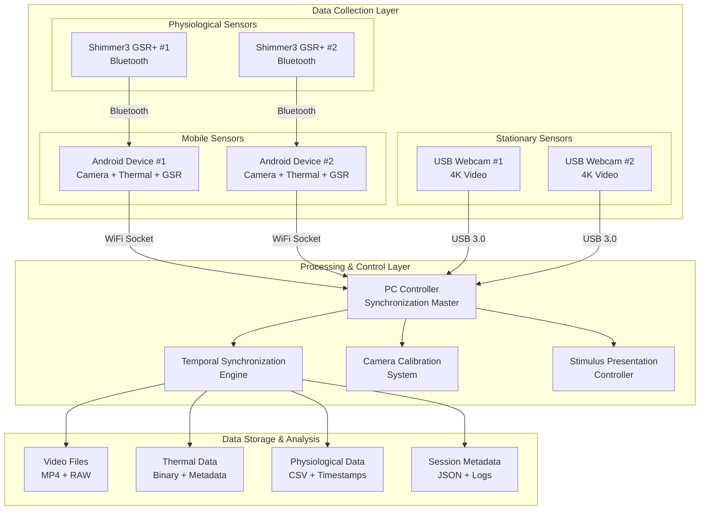

# Multi-Sensor Recording System - Consolidated Implementation Guide

A comprehensive technical guide for developers working on the Multi-Sensor Synchronized Recording System.

## Table of Contents

1. [Architecture Overview](#architecture-overview)
2. [Android Application Implementation](#android-application-implementation)
3. [Python Desktop Controller](#python-desktop-controller)
4. [Network Communication Protocol](#network-communication-protocol)
5. [Data Synchronization](#data-synchronization)
6. [Device Integration](#device-integration)
7. [Testing and Validation](#testing-and-validation)
8. [Performance Optimization](#performance-optimization)
9. [Deployment and Distribution](#deployment-and-distribution)
10. [Development Guidelines](#development-guidelines)

## Architecture Overview

### System Design Philosophy

The Multi-Sensor Recording System employs a distributed architecture where multiple sensor nodes coordinate with a central controller to achieve synchronized data collection across heterogeneous sensor types. The design prioritizes:

- **Temporal Precision**: Microsecond-level synchronization across all devices
- **Scalability**: Support for multiple simultaneous devices and sensor types  
- **Reliability**: Robust error handling and automatic recovery mechanisms
- **Modularity**: Component-based architecture enabling independent development and testing
- **Extensibility**: Plugin architecture for adding new sensor types and analysis tools

### Component Architecture



### Technology Stack

#### Android Application (Kotlin)
- **Language**: Kotlin with Android Views and ViewBinding
- **Camera**: Camera2 API for 4K recording and RAW capture with DngCreator compatibility
- **Networking**: OkHttp for socket communication with automatic reconnection
- **Dependency Injection**: Hilt for component management and testing
- **Concurrency**: Kotlin Coroutines for asynchronous operations
- **Architecture**: Clean Architecture with Repository pattern and MVVM

#### Python Desktop Application
- **Language**: Python 3.9+ with modern scientific computing libraries
- **GUI Framework**: PyQt5 5.15.7 for cross-platform desktop interface
- **Computer Vision**: OpenCV 4.8.0+ for camera operations and calibration algorithms
- **Numerical Computing**: NumPy 1.24.3+ for high-performance data processing
- **Networking**: WebSockets and TCP sockets for device communication
- **Image Processing**: Pillow for image manipulation and format conversion

#### Build System
- **Primary Build Tool**: Gradle 8.11.1+ with multi-project setup
- **Android Plugin**: 8.7.3+ for Android development
- **Kotlin**: 2.1.0+ for Kotlin compilation
- **Python Integration**: ru.vyarus.use-python plugin 3.0.0 for Python environment management

## Android Application Implementation

### Application Architecture

The Android application follows Clean Architecture principles with clear separation between presentation, domain, and data layers:

```kotlin
// Main components structure
com.multisensor.recording/
├── presentation/           # UI layer (Activities, Fragments, ViewModels)
│   ├── activities/        # Main activity and coordinators
│   ├── fragments/         # Feature-specific fragments
│   ├── viewmodels/        # Presentation logic and state management
│   └── utils/             # UI utilities and helpers
├── domain/                # Business logic layer
│   ├── entities/          # Core business objects
│   ├── usecases/          # Application business rules
│   └── repositories/      # Abstract repository interfaces
├── data/                  # Data layer implementation
│   ├── repositories/      # Concrete repository implementations
│   ├── sources/           # Data sources (local, remote, sensors)
│   └── models/            # Data transfer objects
└── di/                    # Dependency injection configuration
```

### Core Components

#### MainActivity and Coordinator Pattern
```kotlin
class MainActivity : AppCompatActivity() {
    private val coordinator: MainActivityCoordinator by inject()
    
    override fun onCreate(savedInstanceState: Bundle?) {
        super.onCreate(savedInstanceState)
        coordinator.initialize(this)
        coordinator.setupNavigation()
    }
}

class MainActivityCoordinator @Inject constructor(
    private val sessionManager: SessionManager,
    private val deviceManager: DeviceManager,
    private val networkHandler: NetworkCommunicationHandler
) {
    fun initialize(activity: MainActivity) {
        setupFragmentNavigation(activity)
        initializeDeviceConnections()
        startNetworkCommunication()
    }
}
```

#### Camera Recording Implementation
```kotlin
class CameraRecorder @Inject constructor(
    private val context: Context,
    private val sessionManager: SessionManager
) {
    private lateinit var cameraManager: CameraManager
    private lateinit var imageReader: ImageReader
    private lateinit var mediaRecorder: MediaRecorder
    
    suspend fun startRecording(sessionInfo: SessionInfo): Result<Unit> {
        return withContext(Dispatchers.IO) {
            try {
                setupCameraSession(sessionInfo)
                configureMediaRecorder(sessionInfo)
                startRecordingInternal()
                Result.success(Unit)
            } catch (e: Exception) {
                Result.failure(e)
            }
        }
    }
    
    private fun setupCameraSession(sessionInfo: SessionInfo) {
        val camera = getCameraDevice()
        val targets = listOf(
            imageReader.surface,  // For RAW capture
            mediaRecorder.surface // For video recording
        )
        
        camera.createCaptureSession(targets) { session ->
            configureRepeatingRequest(session, targets)
        }
    }
}
```

#### Thermal Camera Integration
```kotlin
class ThermalRecorder @Inject constructor(
    private val topdonSdk: TopdonSDK,
    private val sessionManager: SessionManager
) {
    fun startThermalRecording(sessionInfo: SessionInfo): Flow<ThermalFrame> = flow {
        val device = topdonSdk.connectDevice()
        device.startStreaming { frame ->
            val processedFrame = processFrame(frame, sessionInfo)
            emit(processedFrame)
        }
    }
    
    private fun processFrame(frame: ThermalFrame, sessionInfo: SessionInfo): ThermalFrame {
        return frame.copy(
            timestamp = getCurrentTimestamp(),
            sessionId = sessionInfo.sessionId,
            metadata = generateFrameMetadata(frame)
        )
    }
}
```

#### Shimmer3 GSR+ Integration
```kotlin
class ShimmerRecorder @Inject constructor(
    private val bluetoothManager: BluetoothManager,
    private val sessionManager: SessionManager
) {
    fun connectToShimmer(deviceAddress: String): Flow<GSRSample> = flow {
        val shimmerDevice = bluetoothManager.connect(deviceAddress)
        shimmerDevice.startSensing { sample ->
            val processedSample = processGSRSample(sample)
            emit(processedSample)
        }
    }
    
    private fun processGSRSample(sample: ShimmerSample): GSRSample {
        return GSRSample(
            timestamp = sample.timestamp,
            gsrValue = sample.getGSRValue(),
            skinConductance = calculateSkinConductance(sample),
            quality = assessSignalQuality(sample)
        )
    }
}
```

### Network Communication

#### PC Communication Handler
```kotlin
class PCCommunicationHandler @Inject constructor(
    private val networkManager: NetworkManager,
    private val commandProcessor: CommandProcessor
) {
    fun startCommunication(): Flow<NetworkEvent> = flow {
        val socket = networkManager.connectToPC()
        
        socket.messageFlow()
            .catch { error -> emit(NetworkEvent.Error(error)) }
            .collect { message ->
                val response = commandProcessor.processCommand(message)
                socket.send(response)
                emit(NetworkEvent.MessageProcessed(message, response))
            }
    }
}

sealed class NetworkEvent {
    data class MessageProcessed(val request: Message, val response: Message) : NetworkEvent()
    data class Error(val error: Throwable) : NetworkEvent()
    object Connected : NetworkEvent()
    object Disconnected : NetworkEvent()
}
```

### Data Management

#### Session Management
```kotlin
class SessionManager @Inject constructor(
    private val localStorage: LocalStorage,
    private val metadataGenerator: MetadataGenerator
) {
    suspend fun createSession(config: RecordingConfig): SessionInfo {
        val sessionId = generateSessionId()
        val sessionInfo = SessionInfo(
            sessionId = sessionId,
            timestamp = Instant.now(),
            config = config,
            devices = getConnectedDevices()
        )
        
        localStorage.createSessionFolder(sessionInfo)
        localStorage.saveSessionMetadata(sessionInfo)
        
        return sessionInfo
    }
    
    suspend fun finalizeSession(sessionInfo: SessionInfo): SessionSummary {
        val summary = generateSessionSummary(sessionInfo)
        localStorage.saveSessionSummary(sessionInfo.sessionId, summary)
        return summary
    }
}
```

## Python Desktop Controller

### Application Architecture

The Python desktop application uses a component-based architecture with clear separation of concerns:

```python
src/
├── application.py              # Main application entry point
├── ui/                        # User interface components
│   ├── main_window.py         # Main application window
│   ├── components/            # Reusable UI components
│   └── dialogs/               # Modal dialogs and settings
├── controllers/               # Application logic controllers
│   ├── recording_controller.py # Recording session management
│   ├── device_controller.py   # Device connection management
│   └── calibration_controller.py # Camera calibration logic
├── services/                  # Business logic services
│   ├── session_manager.py     # Session lifecycle management
│   ├── device_manager.py      # Device discovery and management
│   └── synchronization_service.py # Data synchronization
├── hardware/                  # Hardware integration
│   ├── camera_manager.py      # USB camera management
│   ├── shimmer_manager.py     # Shimmer sensor integration
│   └── network_manager.py     # Network communication
└── utils/                     # Utility functions and helpers
    ├── logging_utils.py       # Logging configuration
    ├── config_manager.py      # Configuration management
    └── data_export.py         # Data export utilities
```

### Core Components Implementation

#### Main Application Window
```python
class MainWindow(QMainWindow):
    def __init__(self):
        super().__init__()
        self.setup_ui()
        self.initialize_controllers()
        self.setup_signal_connections()
    
    def setup_ui(self):
        # Create tabbed interface
        self.tab_widget = QTabWidget()
        
        # Add functional tabs
        self.recording_tab = RecordingTab()
        self.devices_tab = DevicesTab()
        self.calibration_tab = CalibrationTab()
        self.files_tab = FilesTab()
        
        self.tab_widget.addTab(self.recording_tab, "Recording")
        self.tab_widget.addTab(self.devices_tab, "Devices")
        self.tab_widget.addTab(self.calibration_tab, "Calibration")
        self.tab_widget.addTab(self.files_tab, "Files")
        
        self.setCentralWidget(self.tab_widget)
    
    def initialize_controllers(self):
        self.recording_controller = RecordingController()
        self.device_controller = DeviceController()
        self.calibration_controller = CalibrationController()
```

#### Recording Controller
```python
class RecordingController:
    def __init__(self):
        self.session_manager = SessionManager()
        self.device_manager = DeviceManager()
        self.synchronization_service = SynchronizationService()
    
    async def start_recording_session(self, config: RecordingConfig) -> SessionInfo:
        """Start a new recording session with the specified configuration."""
        try:
            # Validate all devices are connected
            await self.device_manager.validate_connections()
            
            # Create new session
            session_info = await self.session_manager.create_session(config)
            
            # Synchronize clocks across all devices
            await self.synchronization_service.synchronize_clocks()
            
            # Start recording on all devices
            await self.start_device_recording(session_info)
            
            return session_info
            
        except Exception as e:
            logger.error(f"Failed to start recording session: {e}")
            raise RecordingError(f"Recording session failed: {e}")
    
    async def start_device_recording(self, session_info: SessionInfo):
        """Start recording on all connected devices."""
        tasks = []
        
        # Start Android device recording
        for device in self.device_manager.get_android_devices():
            task = self.start_android_recording(device, session_info)
            tasks.append(task)
        
        # Start USB camera recording
        for camera in self.device_manager.get_usb_cameras():
            task = self.start_camera_recording(camera, session_info)
            tasks.append(task)
        
        # Execute all recording tasks concurrently
        await asyncio.gather(*tasks)
```

#### Device Manager Implementation
```python
class DeviceManager:
    def __init__(self):
        self.android_devices: List[AndroidDevice] = []
        self.usb_cameras: List[USBCamera] = []
        self.shimmer_devices: List[ShimmerDevice] = []
        
        self.discovery_service = DeviceDiscoveryService()
        self.connection_manager = ConnectionManager()
    
    async def discover_devices(self) -> DeviceDiscoveryResult:
        """Discover all available devices on the network."""
        result = DeviceDiscoveryResult()
        
        # Discover Android devices via network scanning
        android_devices = await self.discovery_service.scan_for_android_devices()
        result.android_devices = android_devices
        
        # Discover USB cameras via system enumeration
        usb_cameras = await self.discovery_service.enumerate_usb_cameras()
        result.usb_cameras = usb_cameras
        
        # Discover Shimmer devices via Bluetooth scanning
        shimmer_devices = await self.discovery_service.scan_for_shimmer_devices()
        result.shimmer_devices = shimmer_devices
        
        return result
    
    async def connect_to_device(self, device_info: DeviceInfo) -> Device:
        """Establish connection to a specific device."""
        if device_info.device_type == DeviceType.ANDROID:
            return await self.connect_android_device(device_info)
        elif device_info.device_type == DeviceType.USB_CAMERA:
            return await self.connect_usb_camera(device_info)
        elif device_info.device_type == DeviceType.SHIMMER:
            return await self.connect_shimmer_device(device_info)
        else:
            raise UnsupportedDeviceError(f"Device type {device_info.device_type} not supported")
```

### Camera Calibration System

#### Calibration Manager
```python
class CalibrationManager:
    def __init__(self):
        self.calibration_processor = CalibrationProcessor()
        self.pattern_detector = PatternDetector()
        self.quality_assessor = CalibrationQualityAssessor()
    
    def calibrate_camera(self, images: List[np.ndarray], 
                        pattern_type: PatternType = PatternType.CHESSBOARD) -> CalibrationResult:
        """Perform single camera calibration using provided images."""
        
        # Detect calibration patterns in all images
        pattern_points = []
        image_points = []
        
        for image in images:
            detected = self.pattern_detector.detect_pattern(image, pattern_type)
            if detected.success:
                pattern_points.append(detected.object_points)
                image_points.append(detected.image_points)
        
        if len(pattern_points) < 10:
            raise CalibrationError("Insufficient pattern detections for calibration")
        
        # Perform calibration
        result = self.calibration_processor.calibrate_camera(
            pattern_points, image_points, image.shape[:2]
        )
        
        # Assess calibration quality
        quality = self.quality_assessor.assess_calibration(result, pattern_points, image_points)
        result.quality_assessment = quality
        
        return result
    
    def calibrate_stereo_cameras(self, rgb_images: List[np.ndarray], 
                                thermal_images: List[np.ndarray]) -> StereoCalibrationResult:
        """Perform stereo calibration for RGB-thermal camera pair."""
        
        # Individual camera calibrations
        rgb_calibration = self.calibrate_camera(rgb_images)
        thermal_calibration = self.calibrate_camera(thermal_images)
        
        # Stereo calibration
        stereo_result = self.calibration_processor.calibrate_stereo(
            rgb_calibration, thermal_calibration, rgb_images, thermal_images
        )
        
        return stereo_result
```

#### Calibration Processor
```python
class CalibrationProcessor:
    def calibrate_camera(self, object_points: List[np.ndarray], 
                        image_points: List[np.ndarray], 
                        image_size: Tuple[int, int]) -> CalibrationResult:
        """Perform camera calibration using OpenCV."""
        
        # Perform calibration
        ret, camera_matrix, dist_coeffs, rvecs, tvecs = cv2.calibrateCamera(
            object_points, image_points, image_size, None, None
        )
        
        # Calculate reprojection error
        total_error = 0
        total_points = 0
        
        for i in range(len(object_points)):
            projected_points, _ = cv2.projectPoints(
                object_points[i], rvecs[i], tvecs[i], camera_matrix, dist_coeffs
            )
            error = cv2.norm(image_points[i], projected_points, cv2.NORM_L2)
            total_error += error
            total_points += len(object_points[i])
        
        rms_error = total_error / total_points
        
        return CalibrationResult(
            camera_matrix=camera_matrix,
            distortion_coefficients=dist_coeffs,
            rotation_vectors=rvecs,
            translation_vectors=tvecs,
            rms_error=rms_error,
            calibration_success=ret
        )
```

## Network Communication Protocol

### Protocol Design

The system uses a JSON-based message protocol over TCP sockets for device communication:

```json
{
  "message_type": "command",
  "timestamp": "2025-01-03T15:30:00.000Z",
  "source": "pc_controller",
  "target": "android_device_001",
  "command": "start_recording",
  "payload": {
    "session_id": "session_20250103_153000",
    "recording_config": {
      "duration": 300,
      "video_quality": "4k",
      "frame_rate": 30,
      "sensors": ["camera", "thermal", "gsr"]
    }
  },
  "message_id": "msg_12345"
}
```

### Message Types

#### Command Messages
```python
class CommandMessage:
    def __init__(self, command: str, payload: dict, target: str):
        self.message_type = "command"
        self.timestamp = datetime.utcnow().isoformat()
        self.source = "pc_controller"
        self.target = target
        self.command = command
        self.payload = payload
        self.message_id = generate_message_id()

# Supported commands
COMMANDS = {
    "start_recording": StartRecordingCommand,
    "stop_recording": StopRecordingCommand,
    "sync_clock": SyncClockCommand,
    "get_status": GetStatusCommand,
    "configure_sensors": ConfigureSensorsCommand
}
```

#### Response Messages
```python
class ResponseMessage:
    def __init__(self, request_id: str, status: str, payload: dict = None):
        self.message_type = "response"
        self.timestamp = datetime.utcnow().isoformat()
        self.request_id = request_id
        self.status = status  # "success", "error", "in_progress"
        self.payload = payload or {}
```

#### Event Messages
```python
class EventMessage:
    def __init__(self, event_type: str, payload: dict):
        self.message_type = "event"
        self.timestamp = datetime.utcnow().isoformat()
        self.source = get_device_id()
        self.event_type = event_type
        self.payload = payload

# Event types
EVENT_TYPES = {
    "recording_started": RecordingStartedEvent,
    "recording_stopped": RecordingStoppedEvent,
    "device_disconnected": DeviceDisconnectedEvent,
    "sensor_data": SensorDataEvent,
    "error_occurred": ErrorEvent
}
```

### Network Implementation

#### PC Server
```python
class PCNetworkServer:
    def __init__(self, port: int = 8080):
        self.port = port
        self.connected_devices = {}
        self.message_handler = MessageHandler()
    
    async def start_server(self):
        """Start the TCP server and listen for device connections."""
        server = await asyncio.start_server(
            self.handle_client, '0.0.0.0', self.port
        )
        
        logger.info(f"PC Server listening on port {self.port}")
        
        async with server:
            await server.serve_forever()
    
    async def handle_client(self, reader, writer):
        """Handle a new client connection."""
        client_address = writer.get_extra_info('peername')
        logger.info(f"New connection from {client_address}")
        
        try:
            while True:
                # Read message length
                length_data = await reader.readexactly(4)
                message_length = struct.unpack('>I', length_data)[0]
                
                # Read message content
                message_data = await reader.readexactly(message_length)
                message_json = message_data.decode('utf-8')
                
                # Process message
                response = await self.message_handler.process_message(message_json)
                
                # Send response
                await self.send_message(writer, response)
                
        except asyncio.IncompleteReadError:
            logger.info(f"Client {client_address} disconnected")
        except Exception as e:
            logger.error(f"Error handling client {client_address}: {e}")
        finally:
            writer.close()
            await writer.wait_closed()
```

#### Android Client
```kotlin
class AndroidNetworkClient(
    private val serverAddress: String,
    private val serverPort: Int
) {
    private var socket: Socket? = null
    private var messageProcessor: MessageProcessor? = null
    
    suspend fun connect(): Result<Unit> = withContext(Dispatchers.IO) {
        try {
            socket = Socket(serverAddress, serverPort)
            messageProcessor = MessageProcessor(socket!!)
            
            // Start message processing coroutine
            GlobalScope.launch { processIncomingMessages() }
            
            Result.success(Unit)
        } catch (e: Exception) {
            Result.failure(NetworkConnectionException("Failed to connect to PC", e))
        }
    }
    
    suspend fun sendMessage(message: Message): Result<Response> {
        return messageProcessor?.sendMessage(message) 
            ?: Result.failure(IllegalStateException("Not connected"))
    }
    
    private suspend fun processIncomingMessages() {
        messageProcessor?.messageFlow()
            ?.catch { error -> 
                logger.error("Message processing error", error)
            }
            ?.collect { message ->
                handleIncomingMessage(message)
            }
    }
}
```

## Data Synchronization

### Synchronization Strategy

The system implements a multi-layer synchronization approach:

1. **Clock Synchronization**: NTP-style clock alignment across all devices
2. **Command Synchronization**: Simultaneous command execution using countdown timers
3. **Data Alignment**: Post-processing temporal alignment using timestamps
4. **Quality Assessment**: Validation of synchronization accuracy

### Implementation

#### Synchronization Service
```python
class SynchronizationService:
    def __init__(self):
        self.reference_clock = ReferenceClock()
        self.device_clocks = {}
        self.sync_accuracy_threshold = timedelta(microseconds=1000)  # 1ms
    
    async def synchronize_clocks(self, devices: List[Device]) -> SyncResult:
        """Synchronize clocks across all devices."""
        sync_results = []
        
        for device in devices:
            result = await self.sync_device_clock(device)
            sync_results.append(result)
            
        overall_accuracy = self.calculate_overall_accuracy(sync_results)
        
        return SyncResult(
            device_results=sync_results,
            overall_accuracy=overall_accuracy,
            sync_successful=overall_accuracy < self.sync_accuracy_threshold
        )
    
    async def sync_device_clock(self, device: Device) -> DeviceSyncResult:
        """Synchronize a single device's clock."""
        # Measure round-trip time
        start_time = self.reference_clock.now()
        device_time = await device.get_current_time()
        end_time = self.reference_clock.now()
        
        round_trip_time = end_time - start_time
        estimated_device_time = start_time + (round_trip_time / 2)
        
        clock_offset = device_time - estimated_device_time
        
        # Apply clock correction
        await device.adjust_clock(clock_offset)
        
        return DeviceSyncResult(
            device_id=device.id,
            clock_offset=clock_offset,
            round_trip_time=round_trip_time,
            sync_accuracy=abs(clock_offset)
        )
```

#### Coordinated Command Execution
```python
class CoordinatedExecutor:
    async def execute_synchronized_command(self, devices: List[Device], 
                                         command: Command,
                                         delay: timedelta = timedelta(seconds=1)) -> List[CommandResult]:
        """Execute a command simultaneously across all devices."""
        
        # Calculate execution time
        execution_time = datetime.utcnow() + delay
        
        # Send command to all devices with execution time
        command_tasks = []
        for device in devices:
            task = self.send_timed_command(device, command, execution_time)
            command_tasks.append(task)
        
        # Wait for all commands to be sent
        send_results = await asyncio.gather(*command_tasks, return_exceptions=True)
        
        # Wait for execution time
        await self.wait_until(execution_time)
        
        # Collect execution results
        result_tasks = []
        for device in devices:
            task = device.get_command_result(command.id)
            result_tasks.append(task)
        
        execution_results = await asyncio.gather(*result_tasks, return_exceptions=True)
        
        return execution_results
```

## Device Integration

### USB Device Management

#### Enhanced USB Camera Manager
```python
class USBCameraManager:
    def __init__(self):
        self.connected_cameras = {}
        self.device_monitor = USBDeviceMonitor()
        self.state_persistence = DeviceStatePersistence()
    
    async def scan_for_cameras(self) -> List[CameraInfo]:
        """Scan for connected USB cameras."""
        cameras = []
        
        # Enumerate video devices
        for device_index in range(10):  # Check first 10 device indices
            cap = cv2.VideoCapture(device_index)
            if cap.isOpened():
                camera_info = self.get_camera_info(cap, device_index)
                cameras.append(camera_info)
                cap.release()
        
        # Update state persistence
        await self.state_persistence.update_camera_list(cameras)
        
        return cameras
    
    def get_camera_info(self, cap: cv2.VideoCapture, device_index: int) -> CameraInfo:
        """Extract camera information and capabilities."""
        width = int(cap.get(cv2.CAP_PROP_FRAME_WIDTH))
        height = int(cap.get(cv2.CAP_PROP_FRAME_HEIGHT))
        fps = int(cap.get(cv2.CAP_PROP_FPS))
        
        # Try to get device name (platform-specific)
        device_name = self.get_device_name(device_index)
        
        return CameraInfo(
            device_index=device_index,
            name=device_name,
            resolution=(width, height),
            max_fps=fps,
            supported_formats=self.get_supported_formats(cap)
        )
```

### Shimmer3 GSR+ Integration

#### Multi-Library Shimmer Manager
```python
class ShimmerManager:
    def __init__(self):
        self.available_libraries = self.detect_available_libraries()
        self.active_connections = {}
        self.data_processors = {}
    
    def detect_available_libraries(self) -> List[str]:
        """Detect which Shimmer libraries are available."""
        libraries = []
        
        try:
            import pyshimmer
            libraries.append('pyshimmer')
        except ImportError:
            pass
        
        try:
            import bluetooth
            libraries.append('bluetooth')
        except ImportError:
            pass
        
        try:
            import pybluez
            libraries.append('pybluez')
        except ImportError:
            pass
        
        return libraries
    
    async def connect_to_shimmer(self, device_address: str) -> ShimmerConnection:
        """Connect to a Shimmer device using the best available library."""
        
        for library in self.available_libraries:
            try:
                if library == 'pyshimmer':
                    return await self.connect_with_pyshimmer(device_address)
                elif library == 'bluetooth':
                    return await self.connect_with_bluetooth(device_address)
                elif library == 'pybluez':
                    return await self.connect_with_pybluez(device_address)
            except Exception as e:
                logger.warning(f"Failed to connect with {library}: {e}")
                continue
        
        raise ShimmerConnectionError("No compatible Shimmer library available")
    
    async def connect_with_pyshimmer(self, device_address: str) -> PyShimmerConnection:
        """Connect using the pyshimmer library."""
        import pyshimmer
        
        shimmer = pyshimmer.ShimmerBT(device_address)
        await shimmer.connect()
        
        # Configure sensors
        shimmer.set_sensors([pyshimmer.SENSOR_GSR, pyshimmer.SENSOR_TIMESTAMP])
        shimmer.set_sampling_rate(128)  # Hz
        
        return PyShimmerConnection(shimmer, device_address)
```

## Testing and Validation

### Comprehensive Testing Framework

#### Test Categories
The system includes multiple layers of testing to ensure reliability and performance:

```python
# Test structure
tests/
├── unit/                      # Individual component tests
│   ├── test_calibration.py   # Camera calibration tests
│   ├── test_shimmer.py       # Shimmer integration tests
│   └── test_network.py       # Network communication tests
├── integration/               # Cross-component tests
│   ├── test_recording_flow.py # End-to-end recording tests
│   ├── test_device_coordination.py # Multi-device tests
│   └── test_data_synchronization.py # Sync accuracy tests
├── performance/               # Performance and stress tests
│   ├── test_memory_usage.py  # Memory leak detection
│   ├── test_cpu_performance.py # CPU usage optimization
│   └── test_network_throughput.py # Network performance
└── validation/               # Data quality validation
    ├── test_data_integrity.py # File integrity checks
    ├── test_schema_compliance.py # Schema validation
    └── test_sync_accuracy.py  # Synchronization validation
```

#### Automated Test Execution
```python
class ComprehensiveTestRunner:
    def __init__(self):
        self.test_categories = ['unit', 'integration', 'performance', 'validation']
        self.results = {}
    
    async def run_all_tests(self) -> TestResults:
        """Execute comprehensive test suite."""
        overall_results = TestResults()
        
        for category in self.test_categories:
            category_results = await self.run_test_category(category)
            overall_results.add_category_results(category, category_results)
        
        # Generate comprehensive report
        report = self.generate_test_report(overall_results)
        await self.save_test_results(overall_results, report)
        
        return overall_results
    
    async def run_test_category(self, category: str) -> CategoryResults:
        """Run tests for a specific category."""
        test_files = self.discover_tests(category)
        results = CategoryResults(category)
        
        for test_file in test_files:
            test_result = await self.run_test_file(test_file)
            results.add_test_result(test_result)
        
        return results
```

### Performance Monitoring

#### Resource Usage Monitoring
```python
class PerformanceMonitor:
    def __init__(self):
        self.cpu_monitor = CPUMonitor()
        self.memory_monitor = MemoryMonitor()
        self.network_monitor = NetworkMonitor()
        self.storage_monitor = StorageMonitor()
    
    async def monitor_recording_session(self, session_info: SessionInfo) -> PerformanceMetrics:
        """Monitor performance during a recording session."""
        
        metrics = PerformanceMetrics(session_info.session_id)
        
        # Start monitoring tasks
        monitoring_tasks = [
            self.cpu_monitor.start_monitoring(metrics),
            self.memory_monitor.start_monitoring(metrics),
            self.network_monitor.start_monitoring(metrics),
            self.storage_monitor.start_monitoring(metrics)
        ]
        
        # Monitor for the duration of the session
        await asyncio.gather(*monitoring_tasks)
        
        # Generate performance summary
        summary = self.generate_performance_summary(metrics)
        metrics.summary = summary
        
        return metrics
    
    def generate_performance_summary(self, metrics: PerformanceMetrics) -> PerformanceSummary:
        """Generate summary of performance metrics."""
        return PerformanceSummary(
            avg_cpu_usage=metrics.cpu_usage.mean(),
            max_memory_usage=metrics.memory_usage.max(),
            network_throughput=metrics.network_bytes_per_second.mean(),
            storage_write_rate=metrics.storage_write_rate.mean(),
            performance_score=self.calculate_performance_score(metrics)
        )
```

## Performance Optimization

### Memory Management

#### Efficient Data Handling
```python
class DataStreamProcessor:
    def __init__(self, max_buffer_size: int = 1024 * 1024):  # 1MB buffer
        self.max_buffer_size = max_buffer_size
        self.processing_queue = asyncio.Queue(maxsize=100)
        self.memory_monitor = MemoryMonitor()
    
    async def process_data_stream(self, data_source: AsyncIterable) -> AsyncGenerator:
        """Process data stream with memory-efficient buffering."""
        
        buffer = BytesIO()
        buffer_size = 0
        
        async for data_chunk in data_source:
            # Check memory usage
            if self.memory_monitor.get_usage() > 0.8:  # 80% memory usage
                await self.flush_buffer(buffer)
                buffer = BytesIO()
                buffer_size = 0
            
            # Add data to buffer
            buffer.write(data_chunk)
            buffer_size += len(data_chunk)
            
            # Flush buffer if it's full
            if buffer_size >= self.max_buffer_size:
                yield await self.process_buffer(buffer)
                buffer = BytesIO()
                buffer_size = 0
        
        # Process remaining data
        if buffer_size > 0:
            yield await self.process_buffer(buffer)
```

### Network Optimization

#### Adaptive Bandwidth Management
```python
class AdaptiveBandwidthManager:
    def __init__(self):
        self.bandwidth_monitor = BandwidthMonitor()
        self.quality_controller = QualityController()
        self.compression_manager = CompressionManager()
    
    async def optimize_data_transmission(self, data_stream: DataStream) -> OptimizedStream:
        """Optimize data transmission based on available bandwidth."""
        
        current_bandwidth = await self.bandwidth_monitor.measure_bandwidth()
        
        if current_bandwidth < 1_000_000:  # Less than 1 Mbps
            # Use high compression
            compressed_stream = await self.compression_manager.compress_stream(
                data_stream, compression_level=9
            )
            return compressed_stream
        
        elif current_bandwidth < 10_000_000:  # Less than 10 Mbps
            # Use medium compression
            compressed_stream = await self.compression_manager.compress_stream(
                data_stream, compression_level=5
            )
            return compressed_stream
        
        else:
            # Use minimal compression for best quality
            return await self.compression_manager.compress_stream(
                data_stream, compression_level=1
            )
```

## Deployment and Distribution

### Build Configuration

#### Gradle Multi-Project Setup
```gradle
// settings.gradle
rootProject.name = 'bucika-gsr'
include ':AndroidApp'
include ':PythonApp'

// build.gradle (root)
plugins {
    id 'ru.vyarus.use-python' version '3.0.0'
}

subprojects {
    repositories {
        google()
        mavenCentral()
    }
}

// AndroidApp/build.gradle
android {
    namespace 'com.multisensor.recording'
    compileSdk 34
    
    defaultConfig {
        applicationId "com.multisensor.recording"
        minSdk 24
        targetSdk 34
        versionCode 1
        versionName "1.0"
    }
    
    buildTypes {
        debug {
            debuggable true
            minifyEnabled false
        }
        release {
            minifyEnabled true
            proguardFiles getDefaultProguardFile('proguard-android-optimize.txt'), 'proguard-rules.pro'
        }
    }
}

// PythonApp/build.gradle
python {
    envPath = 'gsr-env'
    minPythonVersion = '3.9'
    
    pip 'PyQt5>=5.15.7'
    pip 'opencv-python>=4.8.0'
    pip 'numpy>=1.24.3'
    pip 'requests>=2.31.0'
    pip 'websockets>=11.0'
    pip 'pillow>=10.0.0'
}
```

### Automated Deployment

#### CI/CD Pipeline Configuration
```yaml
# .github/workflows/build-and-test.yml
name: Build and Test

on:
  push:
    branches: [ main, develop ]
  pull_request:
    branches: [ main ]

jobs:
  test-python:
    runs-on: ubuntu-latest
    steps:
    - uses: actions/checkout@v3
    - name: Setup Python Environment
      run: |
        ./tools/development/setup.sh
        conda activate gsr-env
    - name: Run Python Tests
      run: |
        ./gradlew :PythonApp:runPythonTests
        python tools/check_requirements.py --verbose
    
  build-android:
    runs-on: ubuntu-latest
    steps:
    - uses: actions/checkout@v3
    - name: Setup Java
      uses: actions/setup-java@v3
      with:
        distribution: 'temurin'
        java-version: '17'
    - name: Build Android APK
      run: ./gradlew :AndroidApp:assembleDebug
    - name: Run Android Tests
      run: ./gradlew :AndroidApp:testDebugUnitTest
```

## Development Guidelines

### Code Style and Standards

#### Python Code Standards
```python
# Follow PEP 8 style guide
# Use type hints for all function signatures
# Document classes and methods with docstrings

class ExampleClass:
    """Example class demonstrating coding standards."""
    
    def __init__(self, parameter: str) -> None:
        """Initialize the example class.
        
        Args:
            parameter: A string parameter for initialization.
        """
        self._parameter = parameter
    
    async def example_method(self, input_data: List[int]) -> Dict[str, Any]:
        """Example asynchronous method.
        
        Args:
            input_data: List of integers to process.
            
        Returns:
            Dictionary containing processed results.
            
        Raises:
            ValueError: If input_data is empty.
        """
        if not input_data:
            raise ValueError("Input data cannot be empty")
        
        # Process data
        result = {
            "processed_count": len(input_data),
            "sum": sum(input_data),
            "average": sum(input_data) / len(input_data)
        }
        
        return result
```

#### Kotlin Code Standards
```kotlin
// Follow Kotlin coding conventions
// Use coroutines for asynchronous operations
// Implement proper error handling

class ExampleRepository @Inject constructor(
    private val localDataSource: LocalDataSource,
    private val remoteDataSource: RemoteDataSource,
    private val dispatcher: CoroutineDispatcher = Dispatchers.IO
) : Repository {
    
    override suspend fun getData(id: String): Result<Data> = withContext(dispatcher) {
        try {
            // Try local data first
            val localData = localDataSource.getData(id)
            if (localData != null) {
                Result.success(localData)
            } else {
                // Fetch from remote
                val remoteData = remoteDataSource.fetchData(id)
                localDataSource.saveData(remoteData)
                Result.success(remoteData)
            }
        } catch (e: Exception) {
            Result.failure(DataException("Failed to get data", e))
        }
    }
}
```

### Error Handling Patterns

#### Comprehensive Error Management
```python
# Custom exception hierarchy
class MultiSensorError(Exception):
    """Base exception for multi-sensor recording system."""
    pass

class DeviceError(MultiSensorError):
    """Device-related errors."""
    pass

class NetworkError(MultiSensorError):
    """Network communication errors."""
    pass

class CalibrationError(MultiSensorError):
    """Camera calibration errors."""
    pass

# Error handling with logging and recovery
class ErrorHandler:
    def __init__(self, logger: logging.Logger):
        self.logger = logger
        self.recovery_strategies = {
            DeviceError: self.handle_device_error,
            NetworkError: self.handle_network_error,
            CalibrationError: self.handle_calibration_error
        }
    
    async def handle_error(self, error: Exception, context: Dict[str, Any]) -> bool:
        """Handle an error with appropriate recovery strategy.
        
        Returns:
            True if error was handled and operation can continue,
            False if error is unrecoverable.
        """
        error_type = type(error)
        
        # Log error with context
        self.logger.error(f"Error occurred: {error}", extra=context)
        
        # Apply recovery strategy
        if error_type in self.recovery_strategies:
            return await self.recovery_strategies[error_type](error, context)
        else:
            # Unknown error - log and escalate
            self.logger.critical(f"Unhandled error type: {error_type}")
            return False
```

### Documentation Standards

#### API Documentation
```python
def calibrate_camera(images: List[np.ndarray], 
                    pattern_size: Tuple[int, int] = (9, 6),
                    pattern_type: PatternType = PatternType.CHESSBOARD) -> CalibrationResult:
    """Calibrate a camera using the provided calibration images.
    
    This function performs single camera calibration using OpenCV's calibrateCamera
    function. It detects calibration patterns in the provided images and computes
    the camera's intrinsic parameters and distortion coefficients.
    
    Args:
        images: List of calibration images as NumPy arrays. Images should be
            grayscale or color. At least 10 images with detected patterns are
            required for reliable calibration.
        pattern_size: Size of the calibration pattern as (width, height) in
            number of internal corners. Default is (9, 6) for a standard
            10x7 chessboard.
        pattern_type: Type of calibration pattern to detect. Supported types
            are CHESSBOARD and CIRCLES_GRID.
    
    Returns:
        CalibrationResult object containing:
            - camera_matrix: 3x3 camera intrinsic matrix
            - distortion_coefficients: Distortion coefficients [k1, k2, p1, p2, k3]
            - rms_error: Root mean square reprojection error
            - rotation_vectors: Rotation vectors for each calibration image
            - translation_vectors: Translation vectors for each calibration image
            - quality_assessment: Quality metrics and recommendations
    
    Raises:
        CalibrationError: If insufficient patterns are detected or calibration fails.
        ValueError: If images list is empty or pattern_size is invalid.
    
    Example:
        >>> images = load_calibration_images("calibration_photos/")
        >>> result = calibrate_camera(images, pattern_size=(9, 6))
        >>> print(f"RMS Error: {result.rms_error:.3f} pixels")
        >>> if result.quality_assessment.is_good_quality:
        ...     save_calibration(result, "camera_calibration.json")
    """
```

This comprehensive implementation guide provides developers with the necessary technical details to understand, modify, and extend the Multi-Sensor Recording System. The modular architecture and clear interfaces enable parallel development while maintaining system integrity and performance.

---

For additional technical details and API references, see the [API Reference](../API_REFERENCE.md) and [Testing & QA Framework](../TESTING_QA_FRAMEWORK.md) documentation.