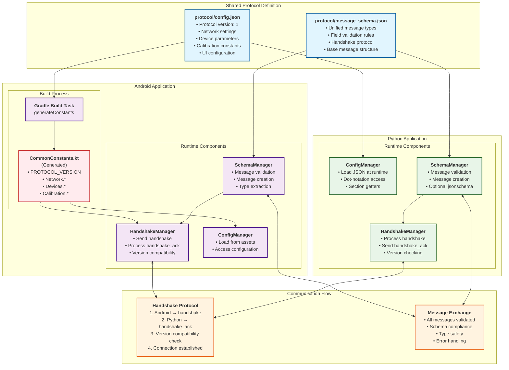

# Milestone 6: Schema Synchronization Architecture

This diagram illustrates the architectural changes introduced in Milestone 6 for shared constants and schema synchronization between the Android and Python applications.

## Architecture Overview

## Key Benefits

### 1. Single Source of Truth
- **Shared Configuration**: Both applications use identical constants from `protocol/config.json`
- **Unified Schema**: All message types defined in `protocol/message_schema.json`
- **Automatic Synchronization**: Changes propagate to both sides (Android after rebuild, Python immediately)

### 2. Version Compatibility
- **Protocol Versioning**: Explicit version checking prevents silent failures
- **Handshake Protocol**: Connection establishment with compatibility verification
- **Error Detection**: Early detection of version mismatches with clear error messages

### 3. Type Safety and Validation
- **Schema Validation**: All messages validated against unified schema
- **Generated Constants**: Android gets compile-time type safety through code generation
- **Runtime Validation**: Python validates messages at runtime with detailed error reporting

### 4. Maintainability
- **Centralized Changes**: Modify constants in one place, automatically sync everywhere
- **Clear Architecture**: Well-defined components with specific responsibilities
- **Comprehensive Testing**: Both unit and integration tests ensure reliability

## Implementation Details

### Android Side
1. **Build-Time Generation**: Gradle task generates `CommonConstants.kt` from shared config
2. **Asset Integration**: Schema and config files bundled as Android assets
3. **Manager Classes**: `SchemaManager`, `HandshakeManager`, and `ConfigManager` handle protocol logic
4. **Type Safety**: Compile-time constants with proper Kotlin types

### Python Side
1. **Runtime Loading**: Configuration loaded dynamically from JSON files
2. **Flexible Access**: Dot-notation access to nested configuration values
3. **Optional Dependencies**: Graceful degradation when optional libraries unavailable
4. **Manager Classes**: Matching functionality to Android implementation

### Communication Protocol
1. **Connection Establishment**: Handshake exchange with version verification
2. **Message Validation**: All messages validated against unified schema
3. **Error Handling**: Clear error messages and graceful failure handling
4. **Extensibility**: Forward-compatible design allows schema evolution

This architecture ensures robust, maintainable communication between the Android and Python applications while eliminating synchronization issues and providing clear upgrade paths for future enhancements.
