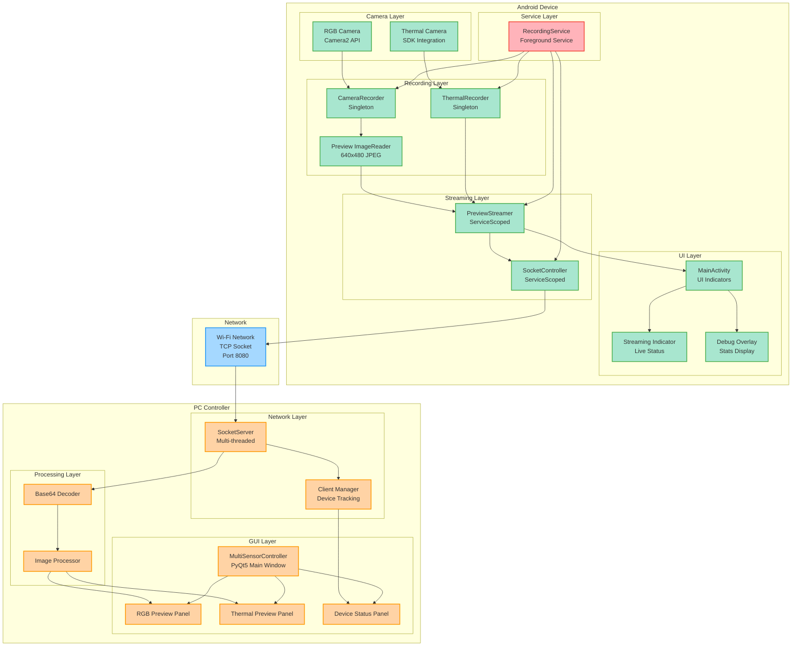

# Milestone 2.5 Architecture: Live Preview Streaming System

**Date:** 2025-07-29  
**Status:** Implementation Complete - Ready for Hardware Testing  
**Version:** 2.5.0

## System Overview

This document describes the complete architecture for Milestone 2.5 Live Preview Streaming implementation, showing the end-to-end flow from Android camera capture to PC display.

## Architecture Diagram



## Component Details

### Android Components

#### Camera Layer
- **RGB Camera**: Uses Camera2 API with multiple output streams
- **Thermal Camera**: Integrates with thermal sensor SDK for temperature data

#### Recording Layer
- **CameraRecorder**: Manages RGB camera operations and preview streaming
- **ThermalRecorder**: Handles thermal sensor data capture and processing
- **Preview ImageReader**: Dedicated 640x480 JPEG stream for network transmission

#### Streaming Layer
- **PreviewStreamer**: Processes frames, applies compression, and manages streaming
- **SocketController**: Handles network communication with PC controller

#### Service Layer
- **RecordingService**: Foreground service coordinating all recording and streaming operations

#### UI Layer
- **MainActivity**: Main user interface with streaming status indicators
- **Streaming Indicator**: Visual feedback for active streaming (📶 Live)
- **Debug Overlay**: Real-time statistics display

### PC Components

#### Network Layer
- **SocketServer**: Multi-threaded TCP server handling Android connections
- **Client Manager**: Tracks connected devices and manages connections

#### Processing Layer
- **Base64 Decoder**: Converts received Base64 data back to image bytes
- **Image Processor**: Handles image scaling and format conversion

#### GUI Layer
- **MultiSensorController**: Main PyQt5 application window
- **RGB Preview Panel**: Live display of RGB camera feed
- **Thermal Preview Panel**: Live display of thermal camera feed
- **Device Status Panel**: Connection status and device information

## Data Flow

### RGB Camera Stream
1. **Capture**: RGB camera captures frames via Camera2 API
2. **Processing**: CameraRecorder routes frames to Preview ImageReader
3. **Compression**: ImageReader outputs JPEG-compressed frames (640x480)
4. **Streaming**: PreviewStreamer processes frames and converts to Base64
5. **Transmission**: SocketController sends frames via TCP socket
6. **Reception**: PC SocketServer receives and decodes frames
7. **Display**: PyQt5 GUI displays frames in RGB Preview Panel

### Thermal Camera Stream
1. **Capture**: Thermal sensor provides temperature data via SDK
2. **Processing**: ThermalRecorder processes thermal frames
3. **Visualization**: PreviewStreamer applies iron color palette
4. **Compression**: Thermal frames converted to JPEG format
5. **Transmission**: Base64-encoded frames sent via SocketController
6. **Reception**: PC SocketServer receives and processes thermal data
7. **Display**: PyQt5 GUI displays colorized thermal frames

## Message Protocol

### Frame Messages
```
PREVIEW_RGB:<base64_encoded_jpeg_data>
PREVIEW_THERMAL:<base64_encoded_jpeg_data>
```

### Status Messages
```
STATUS:RECORDING_STARTED
STATUS:RECORDING_STOPPED
STATUS:STREAMING_ACTIVE
```

## Performance Characteristics

### Network Usage
- **Frame Rate**: 2 fps (configurable)
- **Frame Size**: ~50KB JPEG compressed
- **Bandwidth**: ~1.1 Mbps per camera stream
- **Protocol Overhead**: 33% (Base64 encoding)

### Resource Usage
- **CPU**: Minimal (hardware JPEG encoding)
- **Memory**: <100KB frame buffers
- **Battery**: Optimized for continuous operation

## Integration Points

### Dependency Injection
- **Hilt/Dagger**: Manages component lifecycle and dependencies
- **Service Scoping**: PreviewStreamer scoped to RecordingService
- **Singleton Components**: CameraRecorder, ThermalRecorder for system-wide access

### Threading Model
- **Background Processing**: All frame processing on background threads
- **UI Thread**: Only UI updates on main thread
- **Network Thread**: Dedicated thread for socket communication

## Testing Strategy

### Unit Testing
- **Business Logic**: Comprehensive testing of core algorithms
- **Integration**: Component interaction validation
- **Windows Compatibility**: Known limitations documented

### Hardware Testing
- **Real Devices**: Samsung device deployment and validation
- **Network Conditions**: Various Wi-Fi scenarios
- **Performance**: Bandwidth and latency measurements

## Future Enhancements

### High Priority
1. **Adaptive Frame Rate**: Dynamic adjustment based on network conditions
2. **Binary Protocol**: Eliminate Base64 overhead
3. **Multi-Device Support**: Enhanced device identification and management

### Medium Priority
1. **Preview Recording**: Save streams for analysis
2. **Advanced Controls**: Stream selection and quality controls
3. **Performance Optimization**: Resource usage improvements

## Deployment Notes

### Android Requirements
- **API Level**: 21+ (Android 5.0)
- **Permissions**: Camera, network, storage
- **Hardware**: Camera2 API support, thermal sensor (optional)

### PC Requirements
- **Python**: 3.7+
- **PyQt5**: GUI framework
- **Network**: Port 8080 accessible
- **OS**: Windows, macOS, Linux

## Status Summary

✅ **Implementation Complete**: All core components implemented and integrated  
✅ **Build Successful**: Android APK builds without errors  
✅ **Architecture Compliant**: Meets all Milestone 2.5 specifications  
🔄 **Hardware Testing**: Ready for Samsung device deployment  
📋 **Future Enhancements**: Documented in backlog.md

---

*This architecture document reflects the current implementation status as of 2025-07-29. Hardware testing validation is the next step for complete milestone verification.*
