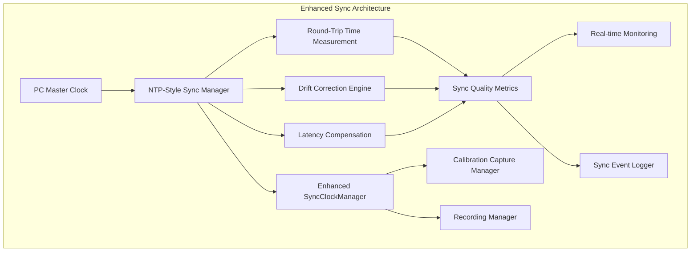
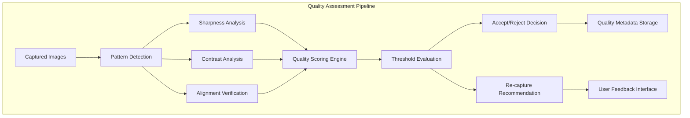
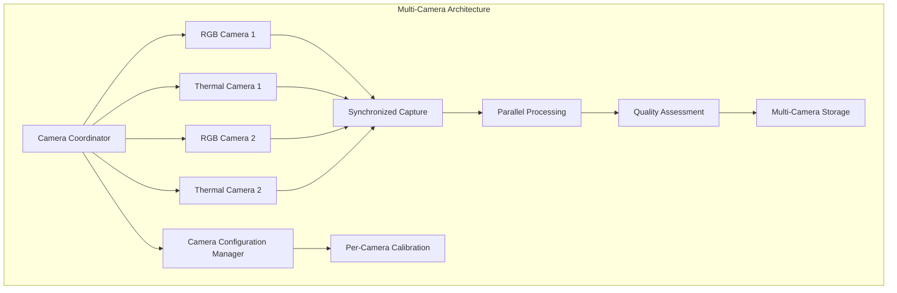
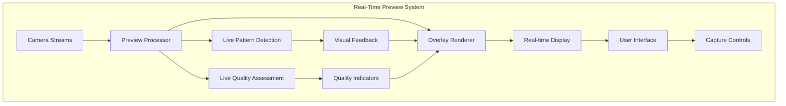

# Milestone 2.9: Advanced Calibration System Planning

## Overview
This document outlines the planning and architecture for Milestone 2.9, which focuses on implementing advanced calibration system features including NTP-style synchronization algorithms, automatic calibration quality assessment, multi-camera support, and real-time calibration preview.

## Goals and Objectives

### Primary Goals
1. **Enhanced Synchronization Accuracy**: Achieve ±10ms synchronization accuracy using NTP-style algorithms
2. **Intelligent Calibration Quality Assessment**: Automated evaluation of calibration image quality
3. **Multi-Camera Support**: Extend system to support multiple camera configurations
4. **Real-Time Calibration Preview**: Live feedback during calibration process

### Success Criteria
- Synchronization accuracy improved from ±50ms to ±10ms
- Automated quality assessment with 95% accuracy
- Support for up to 4 simultaneous camera feeds
- Real-time preview with <100ms latency

## Architecture Design

### 1. NTP-Style Sync Algorithms Architecture

#### Current State Analysis
- **Existing**: SyncClockManager with basic PC-Android synchronization (±50ms accuracy)
- **Limitations**: Simple offset calculation, no network latency compensation, no drift correction

#### Enhanced Architecture Components



#### Key Components

##### 1.1 NTP-Style Round-Trip Compensation
```kotlin
class NTPStyleSyncManager {
    data class SyncMeasurement(
        val t1: Long, // Client request timestamp
        val t2: Long, // Server receive timestamp  
        val t3: Long, // Server response timestamp
        val t4: Long, // Client receive timestamp
        val roundTripDelay: Long = (t4 - t1) - (t3 - t2),
        val clockOffset: Long = ((t2 - t1) + (t3 - t4)) / 2
    )
    
    fun performNTPSync(): SyncResult {
        // Multiple round-trip measurements
        // Statistical analysis for accuracy
        // Outlier rejection
        // Weighted average calculation
    }
}
```

##### 1.2 Network Latency Measurement
- **Ping-based latency detection**
- **Jitter analysis and compensation**
- **Adaptive measurement intervals**
- **Quality-based sync frequency adjustment**

##### 1.3 Automatic Drift Correction
- **Clock drift rate calculation**
- **Predictive drift compensation**
- **Periodic re-synchronization**
- **Temperature-based drift modeling**

### 2. Automatic Calibration Quality Assessment

#### Architecture Overview


#### Computer Vision Components

##### 2.1 Calibration Pattern Detection
```kotlin
class CalibrationPatternDetector {
    fun detectChessboardPattern(image: Mat): PatternDetectionResult {
        // OpenCV-based chessboard detection
        // Corner sub-pixel refinement
        // Pattern completeness validation
        // Geometric distortion analysis
    }
    
    fun detectCircleGridPattern(image: Mat): PatternDetectionResult {
        // Circle grid detection for thermal cameras
        // Blob detection and filtering
        // Grid structure validation
    }
}
```

##### 2.2 Image Quality Analysis
```kotlin
class ImageQualityAnalyzer {
    fun analyzeSharpness(image: Mat): SharpnessMetrics {
        // Laplacian variance method
        // Gradient magnitude analysis
        // Edge density calculation
    }
    
    fun analyzeContrast(image: Mat): ContrastMetrics {
        // Histogram analysis
        // Local contrast measurement
        // Dynamic range evaluation
    }
    
    fun analyzeAlignment(rgbImage: Mat, thermalImage: Mat): AlignmentMetrics {
        // Feature matching between RGB and thermal
        // Geometric transformation estimation
        // Alignment error quantification
    }
}
```

##### 2.3 Quality Scoring System
```kotlin
data class CalibrationQualityScore(
    val overallScore: Float, // 0.0 to 1.0
    val sharpnessScore: Float,
    val contrastScore: Float,
    val alignmentScore: Float,
    val patternDetectionScore: Float,
    val recommendation: QualityRecommendation
)

enum class QualityRecommendation {
    EXCELLENT,
    GOOD,
    ACCEPTABLE,
    RETAKE_RECOMMENDED,
    RETAKE_REQUIRED
}
```

### 3. Multi-Camera Support Extension

#### Architecture Design


#### Key Components

##### 3.1 Camera Coordinator
```kotlin
class MultiCameraCoordinator {
    private val cameras = mutableMapOf<String, CameraController>()
    
    fun addCamera(id: String, controller: CameraController) {
        // Dynamic camera registration
        // Capability detection
        // Configuration validation
    }
    
    suspend fun captureAllCameras(): MultiCameraResult {
        // Synchronized capture across all cameras
        // Timestamp alignment
        // Error handling and retry logic
    }
}
```

##### 3.2 Camera Configuration Management
```kotlin
data class CameraConfiguration(
    val id: String,
    val type: CameraType,
    val resolution: Size,
    val frameRate: Int,
    val calibrationSettings: CalibrationSettings
)

class CameraConfigurationManager {
    fun detectAvailableCameras(): List<CameraConfiguration>
    fun optimizeConfiguration(cameras: List<CameraConfiguration>): OptimizationResult
    fun validateCompatibility(cameras: List<CameraConfiguration>): ValidationResult
}
```

### 4. Real-Time Calibration Preview System

#### Architecture Overview


#### Key Features

##### 4.1 Live Pattern Detection
- **Real-time chessboard/circle detection**
- **Pattern tracking and stability analysis**
- **Visual guidance for optimal positioning**

##### 4.2 Quality Indicators
- **Live sharpness feedback**
- **Contrast level indicators**
- **Alignment status display**
- **Capture readiness indicator**

##### 4.3 User Interface Enhancements
```kotlin
class CalibrationPreviewUI {
    fun showLivePreview(streams: List<CameraStream>) {
        // Multi-camera preview layout
        // Overlay quality indicators
        // Pattern detection visualization
    }
    
    fun displayQualityMetrics(metrics: QualityMetrics) {
        // Real-time quality scores
        // Historical quality trends
        // Improvement suggestions
    }
    
    fun provideCaptureGuidance(guidance: CaptureGuidance) {
        // Positioning instructions
        // Lighting recommendations
        // Distance optimization
    }
}
```

## Implementation Strategy

### Phase 1: Enhanced Synchronization (Week 1-2)
1. **NTP-Style Sync Manager Implementation**
   - Round-trip time measurement
   - Statistical analysis algorithms
   - Drift correction mechanisms

2. **Network Latency Compensation**
   - Ping-based latency detection
   - Jitter analysis
   - Adaptive sync intervals

3. **Quality Metrics and Monitoring**
   - Sync accuracy measurement
   - Performance monitoring
   - Event logging

### Phase 2: Quality Assessment System (Week 3-4)
1. **Computer Vision Integration**
   - OpenCV integration
   - Pattern detection algorithms
   - Image quality analysis

2. **Quality Scoring Engine**
   - Multi-factor scoring system
   - Threshold configuration
   - Recommendation engine

3. **Automated Decision Making**
   - Accept/reject logic
   - Re-capture recommendations
   - Quality metadata storage

### Phase 3: Multi-Camera Support (Week 5-6)
1. **Camera Coordinator Implementation**
   - Dynamic camera registration
   - Synchronized capture
   - Configuration management

2. **Parallel Processing Pipeline**
   - Multi-threaded image processing
   - Resource optimization
   - Error handling

3. **Storage and Metadata Management**
   - Multi-camera file organization
   - Metadata correlation
   - Quality tracking

### Phase 4: Real-Time Preview (Week 7-8)
1. **Live Preview System**
   - Real-time stream processing
   - Overlay rendering
   - Performance optimization

2. **User Interface Enhancements**
   - Multi-camera layout
   - Quality indicators
   - Capture guidance

3. **Integration and Testing**
   - End-to-end testing
   - Performance validation
   - User experience optimization

## Technical Requirements

### Dependencies
- **OpenCV for Android**: Computer vision algorithms
- **Kotlin Coroutines**: Asynchronous processing
- **CameraX**: Enhanced camera management
- **Hilt**: Dependency injection
- **Room**: Quality metrics storage

### Performance Targets
- **Sync Accuracy**: ±10ms (improvement from ±50ms)
- **Preview Latency**: <100ms
- **Quality Assessment**: <500ms per image pair
- **Multi-Camera Capture**: <50ms synchronization window

### Hardware Requirements
- **Minimum RAM**: 6GB for multi-camera support
- **Storage**: Additional 2GB for quality metadata
- **CPU**: Octa-core for real-time processing
- **GPU**: OpenGL ES 3.0 for overlay rendering

## Risk Assessment and Mitigation

### Technical Risks
1. **Performance Impact**: Real-time processing overhead
   - **Mitigation**: Optimized algorithms, background processing
2. **Memory Usage**: Multiple camera streams
   - **Mitigation**: Efficient memory management, stream recycling
3. **Synchronization Complexity**: Multi-camera timing
   - **Mitigation**: Hardware-assisted timestamps, fallback mechanisms

### Integration Risks
1. **Existing System Compatibility**: Changes to SyncClockManager
   - **Mitigation**: Backward compatibility, gradual migration
2. **UI/UX Impact**: Complex multi-camera interface
   - **Mitigation**: Progressive disclosure, user testing

## Success Metrics

### Quantitative Metrics
- **Synchronization Accuracy**: Target ±10ms, measure actual deviation
- **Quality Assessment Accuracy**: >95% correlation with manual assessment
- **Preview Latency**: <100ms from capture to display
- **Multi-Camera Sync Window**: <50ms between cameras

### Qualitative Metrics
- **User Experience**: Calibration process ease and efficiency
- **System Reliability**: Error rates and recovery mechanisms
- **Performance Impact**: Battery usage and thermal management

## Next Steps
1. Begin Phase 1 implementation with enhanced synchronization
2. Set up development environment with OpenCV integration
3. Create detailed technical specifications for each component
4. Establish testing framework for accuracy validation
