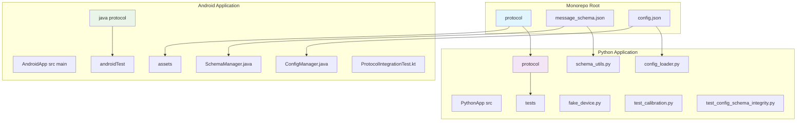
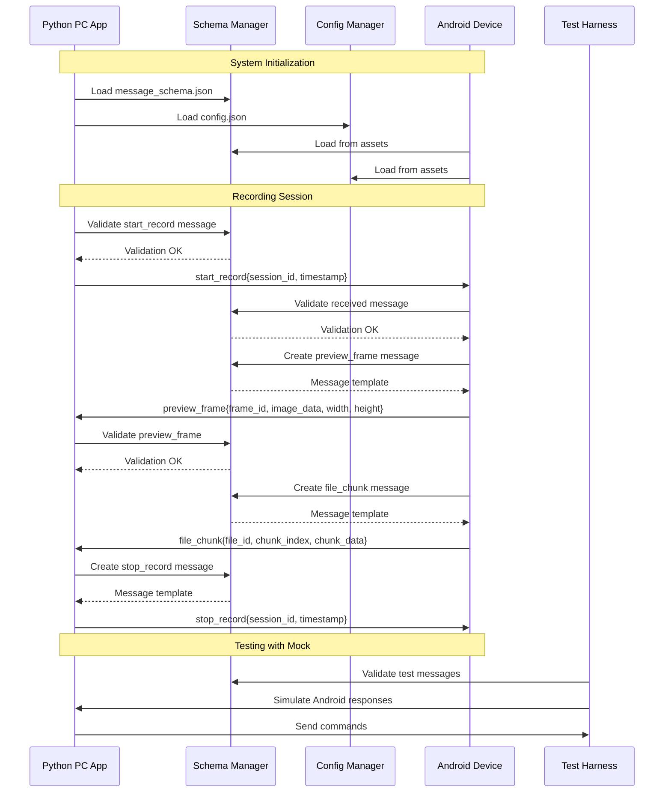
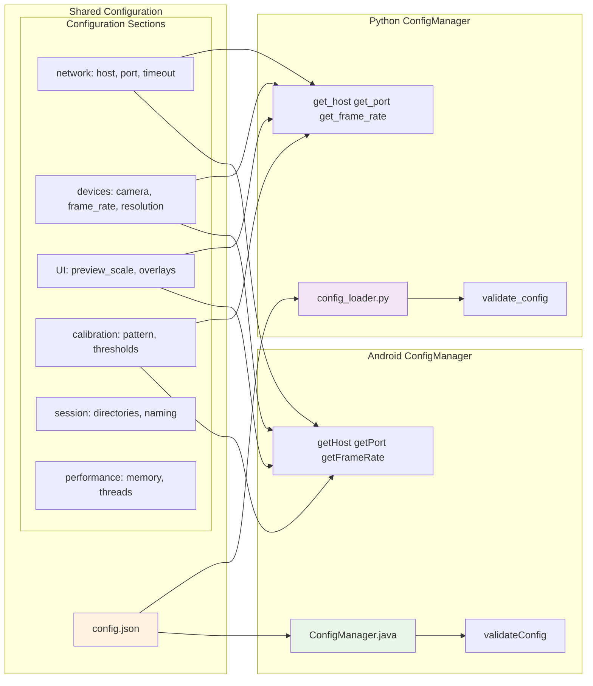
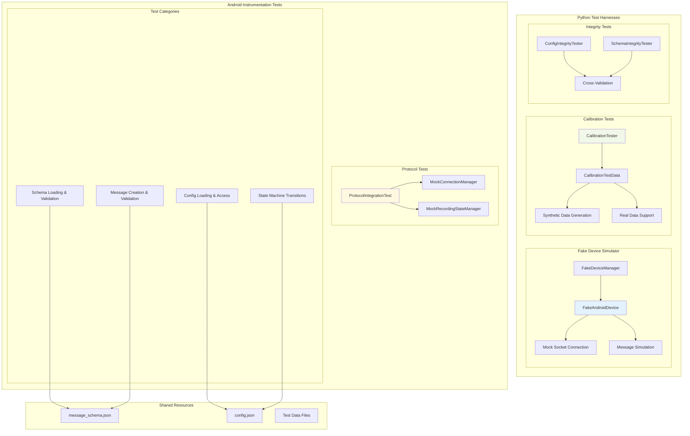
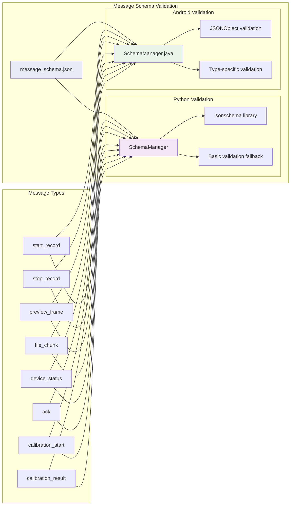
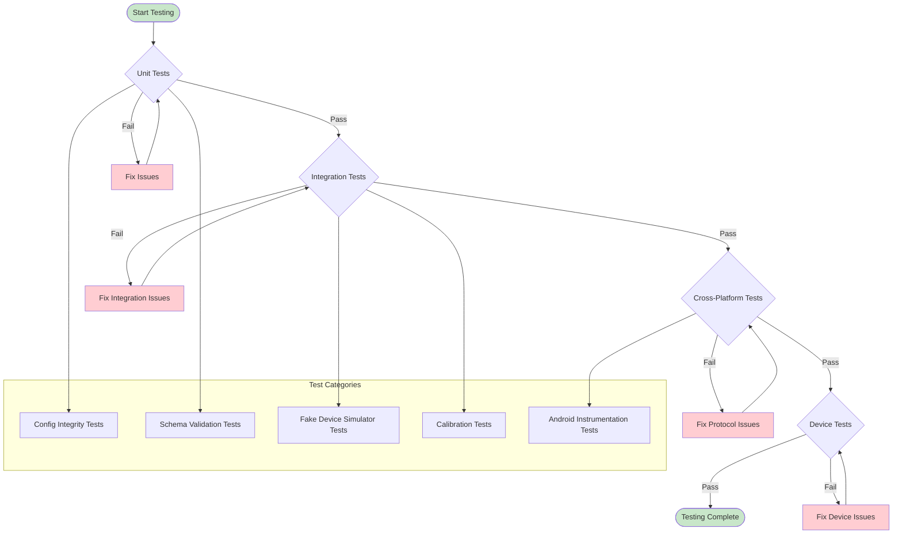

# Milestone 4 Architecture: Unified Protocol & Shared Configuration

This document provides comprehensive architectural diagrams for the Milestone 4 implementation, documenting the unified protocol system, shared configuration, and test harnesses.

## System Overview Architecture

## Unified Protocol Communication Flow

## Shared Configuration Architecture

## Test Harnesses Architecture

## Cross-Platform Protocol Validation

## Testing Strategy Flow

## Development Workflow Integration

```mermaid
flowchart TD
    Start([Initial Milestone 4]) --> ProtocolBranch{Create Protocol Schema}
    
    ProtocolBranch --> Schema[Create message_schema.json]
    Schema --> Config[Create config.json]
    Config --> PySchema[Python SchemaManager]
    PySchema --> PyConfig[Python ConfigManager]
    PyConfig --> ProtocolMerge[Merge Protocol Schema]
    
    ProtocolMerge --> AndroidBranch{Android Integration}
    AndroidBranch --> AndroidSchema[Android SchemaManager]
    AndroidSchema --> AndroidConfig[Android ConfigManager]
    AndroidConfig --> AssetIntegration[Asset Integration]
    AssetIntegration --> AndroidMerge[Merge Android Integration]
    
    AndroidMerge --> TestBranch{Test Harnesses}
    TestBranch --> FakeDevice[Fake Device Simulator]
    FakeDevice --> CalibTests[Calibration Tests]
    CalibTests --> IntegrityTests[Integrity Tests]
    IntegrityTests --> AndroidTests[Android Instrumentation Tests]
    AndroidTests --> TestMerge[Merge Test Harnesses]
    
    TestMerge --> Documentation[Documentation Update]
    Documentation --> Complete([Milestone 4 Complete])
    
    style Start fill:#c8e6c9
    style Complete fill:#c8e6c9
    style ProtocolBranch fill:#e1f5fe
    style AndroidBranch fill:#e8f5e8
    style TestBranch fill:#fff3e0
```

## Key Benefits of Milestone 4 Architecture

1. **Unified Protocol**: Single source of truth for message formats across platforms
2. **Shared Configuration**: Consistent parameters between Python and Android
3. **Runtime Loading**: Dynamic schema and config loading for flexibility
4. **Comprehensive Testing**: Offline testing capabilities without physical devices
5. **Cross-Platform Validation**: Consistent message validation on both platforms
6. **Maintainable Structure**: Monorepo approach for easy synchronization
7. **Development Support**: Enhanced workflow with comprehensive test harnesses

This architecture ensures reliable communication, consistent behavior, and maintainable code across the synchronized multimodal recording system.
