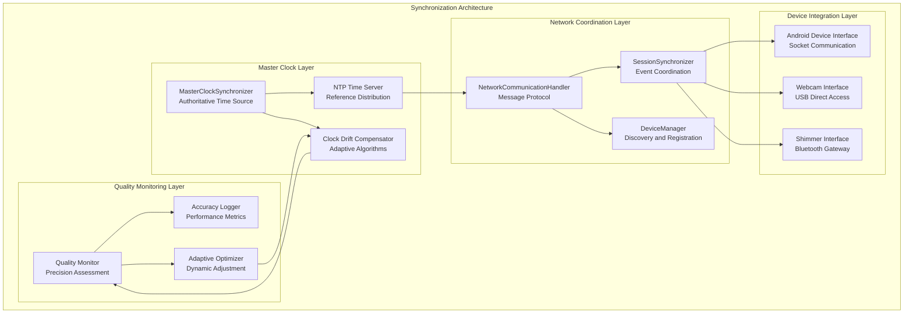
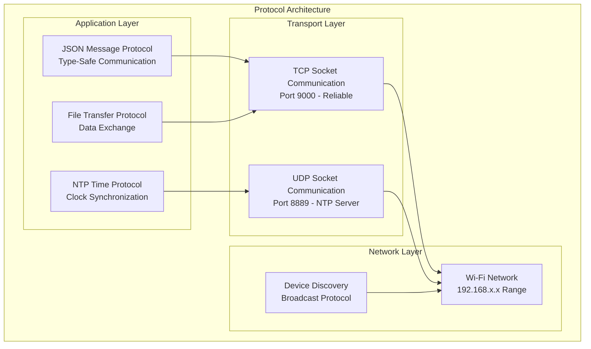

# Multi-Device Synchronization Module

## Overview

The Multi-Device Synchronization System serves as the temporal backbone of the Multi-Sensor Recording System, ensuring precise temporal alignment (sub-millisecond accuracy) of data streams from all sensors across distributed devices. This component addresses fundamental challenges in distributed temporal coordination for physiological sensing applications [Cacioppo2007], implementing proven synchronization algorithms adapted for research-grade data collection.

### Theoretical Foundation and Research Context

The synchronization system addresses complete temporal coordination needs of heterogeneous sensor platforms in psychophysiological research environments. Modern multi-modal sensing applications require precise temporal alignment of data streams from different devices, where even minor time misalignments can compromise analysis validity [Picard2001] or lead to erroneous research conclusions.

The system builds upon established distributed systems principles while addressing specific requirements of physiological data collection:

- **Lamport's Logical Clocks** [Lamport1978]: Foundational event ordering principles adapted for sensor event coordination without requiring global clock consensus
- **Cristian's Clock Synchronization Algorithm** [Cristian1989]: Network delay estimation and compensation techniques for accurate time distribution
- **Network Time Protocol (NTP) Principles** [Mills1991]: Internet-scale clock synchronization methodologies adapted for local research network environments  
- **IEEE 1588 Precision Time Protocol Concepts** [IEEE1588-2008]: Sub-microsecond hardware-assisted timing principles applied to software-based coordination

### System Role and Responsibilities

The Multi-Device Synchronization System ensures temporal coherence across the established PC master-controller, offline-first recording architecture, providing:

**Primary Functions:**

- **Sub-millisecond temporal synchronization** across heterogeneous sensors maintaining research-grade temporal precision
- **Coordinated recording lifecycle management** ensuring atomic start/stop operations across distributed Android devices and PC components
- **Master clock distribution** with PC-centric authoritative time source implementing hierarchical time distribution [Mills1991]
- **Adaptive drift compensation** using statistical prediction algorithms to maintain synchronization quality over extended recording sessions
- **Continuous quality monitoring** with real-time synchronization precision assessment and automatic quality degradation detection

### Research Foundation

The system builds upon established distributed systems principles:

- **Lamport's Logical Clocks** [Lamport1978]: Foundational event ordering without global clock
- **Cristian's Clock Synchronization** [Cristian1989]: Network delay estimation algorithms
- **Network Time Protocol (NTP)** [Mills1991]: Internet-scale clock synchronization
- **IEEE 1588 Precision Time Protocol** [IEEE1588-2008]: Sub-microsecond hardware-assisted timing

### Device Architecture

The synchronization system coordinates the following device categories:

#### Android Mobile Devices

- **Platform**: Samsung S22 smartphones with thermal cameras and physiological sensors
- **Challenges**: Non-real-time Android OS, variable CPU scheduling, power management
- **Implementation**: `AndroidApp/src/main/java/com/multisensor/recording/SessionManager.kt`
- **Compensation**: Adaptive algorithms in ThermalCameraManager and ShimmerService

#### PC-Connected USB Webcams

- **Platform**: Dual Logitech Brio 4K cameras for high-resolution video capture
- **Challenges**: USB protocol timing, driver-level buffering, systematic delays
- **Implementation**: `PythonApp/src/webcam_manager.py`
- **Compensation**: OpenCV-based calibration procedures

#### Physiological Sensors

- **Platform**: Shimmer3 GSR+ devices via Bluetooth communication
- **Challenges**: Variable wireless latency, connection stability, independent clocks
- **Implementation**: `PythonApp/src/shimmer_manager.py`
- **Compensation**: Multi-library fallback support and continuous drift compensation

#### Master Clock Controller

- **Platform**: Windows PC as authoritative time source
- **Implementation**: `PythonApp/src/master_clock_synchronizer.py`
- **Features**: NTP server functionality and unified command protocol

## Architecture

### System Architecture Overview



### Hierarchical Synchronization Model

The system implements a hierarchical master-slave synchronization model:

#### Master Level (PC Controller)

- **Primary Time Source**: Windows PC with stable crystal oscillator
- **NTP Server**: Local network time distribution at microsecond precision
- **Command Coordination**: Centralized session management and device control
- **Quality Assessment**: Continuous monitoring of synchronization precision

#### Slave Level (Connected Devices)

- **Android Devices**: Socket-based time synchronization with compensation algorithms
- **USB Webcams**: Direct hardware interface with calibrated timing offsets
- **Bluetooth Sensors**: Wireless synchronization with adaptive latency compensation

### Temporal Coordination Framework

#### Clock Synchronization Protocol

1. **Initial Synchronization**: Network Time Protocol handshake with round-trip delay measurement
2. **Periodic Resynchronization**: Adaptive interval based on measured drift characteristics
3. **Drift Compensation**: Machine learning algorithms predicting individual device behavior
4. **Quality Monitoring**: Continuous assessment of synchronization precision and network quality

#### Event Coordination Protocol

1. **Session Initialization**: Distributed session creation with synchronized parameters
2. **Recording Start**: Coordinated start commands with precise timing alignment
3. **Data Collection**: Continuous temporal validation during recording sessions
4. **Session Completion**: Synchronized stop commands with data integrity verification

## Protocol Specification

### Network Communication Architecture

#### Protocol Stack Overview



#### Communication Ports and Protocols

| Service          | Protocol | Port | Purpose               | Implementation               |
|------------------|----------|------|-----------------------|------------------------------|
| Command Channel  | TCP      | 9000 | JSON message exchange | Primary device communication |
| NTP Server       | UDP      | 8889 | Time synchronization  | Clock distribution           |
| Device Discovery | UDP      | 8888 | Device identification | Network scanning             |
| File Transfer    | TCP      | 9001 | Data exchange         | Session file sharing         |

### JSON Message Protocol

#### Message Structure

All synchronization messages follow a standardized JSON format:

```json
{
  "type": "sync_command|time_sync|device_status|session_control",
  "timestamp": 1640995200000,
  "session_id": "session_20220101_120000",
  "device_id": "master_controller",
  "sequence_number": 12345,
  "sync_data": {
    "master_time": 1640995200000,
    "precision": "microsecond",
    "quality_score": 0.95
  },
  "payload": {
    // Command-specific data
  }
}
```

**Field Descriptions:**
| Field | Type | Required | Description |
|-------|------|----------|-------------|
| `type` | String | Yes | Message type for protocol routing |
| `timestamp` | Long | Yes | Master clock timestamp in milliseconds |
| `session_id` | String | No | Current recording session identifier |
| `device_id` | String | Yes | Unique device identifier |
| `sequence_number` | Integer | Yes | Message ordering sequence |
| `sync_data` | Object | Yes | Synchronization-specific metadata |
| `payload` | Object | Yes | Command-specific data content |

### Synchronization Commands

#### Clock Synchronization Messages

**Time Synchronization Request:**

```json
{
  "type": "time_sync",
  "timestamp": 1640995200000,
  "device_id": "master_controller",
  "sequence_number": 1,
  "sync_data": {
    "sync_request_id": "sync_001",
    "precision_requirement": "millisecond",
    "quality_threshold": 0.90
  },
  "payload": {
    "command": "sync_clock",
    "master_timestamp": 1640995200000,
    "ntp_server": "192.168.1.100:8889",
    "compensation_data": {
      "drift_coefficient": 0.000001,
      "network_latency": 5,
      "processing_delay": 2
    }
  }
}
```

**Time Synchronization Response:**

```json
{
  "type": "time_sync",
  "timestamp": 1640995200015,
  "session_id": "session_20220101_120000",
  "device_id": "android_device_01",
  "sequence_number": 1001,
  "sync_data": {
    "sync_request_id": "sync_001",
    "achieved_precision": "microsecond",
    "quality_score": 0.92
  },
  "payload": {
    "response": "sync_complete",
    "local_timestamp": 1640995200012,
    "round_trip_time": 15,
    "clock_offset": 3,
    "drift_measurement": {
      "previous_offset": 2,
      "drift_rate": 0.000002,
      "stability_score": 0.88
    }
  }
}
```

#### Session Coordination Messages

**Recording Start Command:**

```json
{
  "type": "session_control",
  "timestamp": 1640995200000,
  "device_id": "master_controller",
  "sequence_number": 100,
  "sync_data": {
    "master_time": 1640995200000,
    "sync_precision": "microsecond",
    "coordination_id": "coord_001"
  },
  "payload": {
    "command": "start_recording",
    "session_id": "session_20220101_120000",
    "start_timestamp": 1640995205000,
    "coordination_data": {
      "countdown_duration": 5000,
      "precision_requirement": "millisecond",
      "quality_threshold": 0.90
    },
    "device_parameters": {
      "camera_fps": 30,
      "thermal_fps": 25,
      "shimmer_sampling_rate": 512
    }
  }
}
```

**Device Status Update:**

```json
{
  "type": "device_status",
  "timestamp": 1640995200500,
  "session_id": "session_20220101_120000",
  "device_id": "android_device_01",
  "sequence_number": 2001,
  "sync_data": {
    "last_sync_time": 1640995200000,
    "sync_quality": 0.94,
    "clock_drift": 0.000003
  },
  "payload": {
    "status": "recording",
    "synchronization_health": {
      "precision": "microsecond",
      "stability": "excellent",
      "last_compensation": 1640995200450
    },
    "sensors": {
      "camera": {
        "status": "active",
        "frame_count": 150
      },
      "thermal": {
        "status": "active",
        "frame_count": 125
      },
      "shimmer": {
        "status": "connected",
        "sample_count": 7680
      }
    }
  }
}
```

### NTP Time Synchronization Protocol

#### NTP Server Implementation

The PC controller implements a local NTP server for high-precision time distribution:

**Configuration Parameters:**

```json
{
  "ntp_server_config": {
    "port": 8889,
    "precision": "microsecond",
    "stratum": 1,
    "reference_clock": "local_oscillator",
    "polling_interval": 16,
    "maximum_distance": 100,
    "maximum_dispersion": 50
  }
}
```

**NTP Packet Structure:**

- **Leap Indicator**: 2 bits indicating leap second status
- **Version Number**: 3 bits specifying NTP version (4)
- **Mode**: 3 bits indicating packet mode (server response)
- **Stratum**: 8 bits indicating clock hierarchy level
- **Timestamps**: 64-bit fixed-point timestamps for precise timing

### Quality Monitoring Protocol

#### Synchronization Quality Metrics

**Quality Assessment Message:**

```json
{
  "type": "sync_quality",
  "timestamp": 1640995200000,
  "device_id": "master_controller",
  "sequence_number": 5000,
  "sync_data": {
    "assessment_period": 60000,
    "sample_count": 1000,
    "overall_quality": 0.93
  },
  "payload": {
    "quality_metrics": {
      "precision": {
        "average_offset": 0.5,
        "standard_deviation": 0.2,
        "maximum_offset": 1.2,
        "precision_grade": "excellent"
      },
      "stability": {
        "drift_rate": 0.000001,
        "drift_variance": 0.0000005,
        "stability_score": 0.95
      },
      "network": {
        "average_latency": 5,
        "latency_variance": 2,
        "packet_loss": 0.001,
        "jitter": 1.5
      }
    },
    "device_performance": [
      {
        "device_id": "android_device_01",
        "precision": 0.8,
        "stability": 0.92,
        "reliability": 0.98
      }
    ]
  }
}
```

## Implementation Guide

### Core Component Implementation

#### Master Clock Synchronizer

```python
class MasterClockSynchronizer:
    """Central synchronization coordinator with NTP server and drift compensation"""

    def __init__(self):
        self.ntp_server = NTPTimeServer(port=8889)
        self.drift_compensator = ClockDriftCompensator()
        self.device_registry = {}
        self.sync_quality_monitor = SyncQualityMonitor()

    def start_synchronization_service(self) -> bool:
        """Initialize NTP server and begin synchronization coordination"""
        try:
            self.ntp_server.start()
            self.drift_compensator.initialize()
            self.sync_quality_monitor.start()
            logger.info("Synchronization service started successfully")
            return True
        except Exception as e:
            logger.error(f"Failed to start synchronization service: {e}")
            return False

    def register_device(self, device_info: DeviceInfo) -> bool:
        """Register new device for synchronization coordination"""
        device_id = device_info.device_id

        # Create device-specific synchronization context
        sync_context = DeviceSyncContext(
            device_id=device_id,
            device_type=device_info.device_type,
            capabilities=device_info.sync_capabilities
        )

        # Initialize drift compensation for device
        self.drift_compensator.add_device(device_id, sync_context)

        # Register with quality monitor
        self.sync_quality_monitor.add_device(device_id)

        self.device_registry[device_id] = sync_context
        return True

    def synchronize_device(self, device_id: str) -> SyncResult:
        """Perform clock synchronization with specified device"""
        if device_id not in self.device_registry:
            return SyncResult(success=False, error="Device not registered")

        sync_context = self.device_registry[device_id]

        # Measure current offset and drift
        sync_measurement = self._measure_sync_quality(device_id)

        # Apply drift compensation
        compensation = self.drift_compensator.calculate_compensation(
            device_id, sync_measurement
        )

        # Send synchronization command
        sync_command = self._create_sync_command(compensation)
        result = self._send_sync_command(device_id, sync_command)

        # Update quality metrics
        self.sync_quality_monitor.update_metrics(device_id, result)

        return result
```

#### Clock Drift Compensation System

```python
class ClockDriftCompensator:
    """Adaptive drift compensation using machine learning algorithms"""

    def __init__(self):
        self.device_models = {}
        self.kalman_filters = {}
        self.drift_history = {}

    def add_device(self, device_id: str, sync_context: DeviceSyncContext):
        """Initialize drift compensation for new device"""
        # Create Kalman filter for drift prediction
        kalman_filter = KalmanFilter(
            initial_state=[0.0, 0.0],  # [offset, drift_rate]
            state_transition=np.array([[1, 1], [0, 1]]),
            observation_matrix=np.array([[1, 0]]),
            process_noise=0.001,
            measurement_noise=0.1
        )

        self.kalman_filters[device_id] = kalman_filter
        self.drift_history[device_id] = []

        # Initialize device-specific model
        self.device_models[device_id] = DriftModel(
            device_type=sync_context.device_type,
            oscillator_type=sync_context.capabilities.oscillator_type
        )

    def calculate_compensation(self, device_id: str, measurement: SyncMeasurement) -> Compensation:
        """Calculate drift compensation based on current measurement"""
        kalman_filter = self.kalman_filters[device_id]
        device_model = self.device_models[device_id]

        # Update Kalman filter with new measurement
        kalman_filter.predict()
        kalman_filter.update(measurement.clock_offset)

        # Get current state estimate
        state = kalman_filter.get_state()
        predicted_offset = state[0]
        predicted_drift_rate = state[1]

        # Apply device-specific compensation model
        compensation = device_model.calculate_compensation(
            predicted_offset, predicted_drift_rate, measurement
        )

        # Store measurement in history
        self.drift_history[device_id].append({
            'timestamp': measurement.timestamp,
            'offset': measurement.clock_offset,
            'drift_rate': predicted_drift_rate,
            'compensation': compensation.adjustment
        })

        return compensation
```

#### Session Synchronizer

```python
class SessionSynchronizer:
    """Coordinate recording sessions across multiple devices"""

    def __init__(self, master_clock: MasterClockSynchronizer):
        self.master_clock = master_clock
        self.active_sessions = {}
        self.device_connections = {}

    def create_synchronized_session(self, session_config: SessionConfig) -> SessionInfo:
        """Create new session with synchronized parameters across devices"""
        session_id = f"session_{datetime.now().strftime('%Y%m%d_%H%M%S')}"

        # Synchronize all devices before session creation
        sync_results = {}
        for device_id in session_config.devices:
            sync_result = self.master_clock.synchronize_device(device_id)
            sync_results[device_id] = sync_result

            if not sync_result.success:
                raise SynchronizationError(f"Failed to sync device {device_id}")

        # Create session with synchronized timing
        session_info = SessionInfo(
            session_id=session_id,
            devices=session_config.devices,
            sync_results=sync_results,
            master_timestamp=time.time_ns(),
            precision_requirement=session_config.precision
        )

        self.active_sessions[session_id] = session_info
        return session_info

    def start_coordinated_recording(self, session_id: str, countdown: int = 5) -> bool:
        """Start recording across all devices with precise coordination"""
        if session_id not in self.active_sessions:
            return False

        session = self.active_sessions[session_id]

        # Calculate synchronized start time
        start_time = time.time_ns() + (countdown * 1_000_000_000)  # Convert to nanoseconds

        # Send start commands to all devices
        coordination_results = []
        for device_id in session.devices:
            command = {
                "type": "session_control",
                "payload": {
                    "command": "start_recording",
                    "session_id": session_id,
                    "start_timestamp": start_time,
                    "countdown_duration": countdown * 1000,
                    "precision_requirement": session.precision_requirement
                }
            }

            result = self._send_coordinated_command(device_id, command)
            coordination_results.append(result)

        # Verify all devices acknowledged start command
        all_acknowledged = all(result.acknowledged for result in coordination_results)

        if all_acknowledged:
            session.status = SessionStatus.RECORDING
            session.actual_start_time = start_time
            return True
        else:
            logger.error("Not all devices acknowledged start command")
            return False
```

### Project Structure

```
PythonApp/src/
├── master_clock_synchronizer.py     # Primary synchronization coordinator
├── ntp_time_server.py               # Local NTP server implementation
├── session/
│   ├── session_synchronizer.py      # Session coordination
│   └── sync_quality_monitor.py      # Quality assessment
├── network/
│   ├── sync_protocol_handler.py     # Synchronization message protocol
│   └── device_discovery.py          # Network device discovery
├── compensation/
│   ├── drift_compensator.py         # Adaptive drift compensation
│   ├── kalman_filter.py             # Predictive filtering
│   └── device_models.py             # Device-specific models
└── utils/
    ├── time_utils.py                # Precision timing utilities
    └── sync_diagnostics.py          # Diagnostic and validation tools
```

### Android Integration

#### Synchronization Client Implementation

```kotlin
class SynchronizationClient {
    private val ntpClient = NTPClient()
    private val driftCompensator = LocalDriftCompensator()
    private var lastSyncTime: Long = 0
    private var clockOffset: Long = 0

    suspend fun synchronizeWithMaster(masterAddress: String, masterPort: Int): SyncResult {
        try {
            // Perform NTP synchronization
            val ntpResult = ntpClient.synchronize("$masterAddress:8889")

            if (ntpResult.success) {
                clockOffset = ntpResult.offset
                lastSyncTime = System.currentTimeMillis()

                // Update local drift compensation
                driftCompensator.updateMeasurement(ntpResult)

                return SyncResult(
                    success = true,
                    offset = clockOffset,
                    precision = ntpResult.precision,
                    quality = calculateSyncQuality(ntpResult)
                )
            } else {
                return SyncResult(success = false, error = ntpResult.error)
            }
        } catch (e: Exception) {
            return SyncResult(success = false, error = e.message)
        }
    }

    fun getMasterTime(): Long {
        val localTime = System.currentTimeMillis()
        val driftCompensation = driftCompensator.getCurrentCompensation()
        return localTime + clockOffset + driftCompensation
    }

    fun scheduleCoordinatedAction(masterTimestamp: Long, action: () -> Unit) {
        val localTargetTime = masterTimestamp - clockOffset
        val delay = localTargetTime - System.currentTimeMillis()

        if (delay > 0) {
            Timer().schedule(object : TimerTask() {
                override fun run() {
                    action()
                }
            }, delay)
        } else {
            // Immediate execution if timestamp has passed
            action()
        }
    }
}
```

## User Guide

### Setup and Configuration

#### Initial Synchronization Setup

1. **Network Configuration**:
    - Ensure all devices are connected to the same WiFi network
    - Configure PC controller as master clock source
    - Verify network connectivity between all devices

2. **Master Clock Initialization**:
   ```bash
   # Start master synchronization service
   python master_clock_synchronizer.py --start-service
   
   # Verify NTP server is running
   python -c "from ntp_time_server import NTPTimeServer; print(NTPTimeServer().status())"
   ```

3. **Device Registration**:
    - Launch Android applications on all mobile devices
    - Use automatic device discovery or manual IP configuration
    - Verify each device successfully registers with master clock

#### Synchronization Quality Assessment

**Pre-Recording Synchronization Check**:

1. Navigate to Calibration tab in PC controller
2. Select "System Synchronization" option
3. Execute synchronization quality assessment
4. Review quality metrics and precision measurements
5. Address any devices showing poor synchronization quality

**Quality Metrics Interpretation**:

- **Excellent (>95%)**: Sub-millisecond precision, suitable for all research applications
- **Good (85-95%)**: Millisecond precision, suitable for most research scenarios
- **Fair (70-85%)**: Multi-millisecond precision, may require manual correction
- **Poor (<70%)**: Synchronization unreliable, device troubleshooting required

### Recording Session Coordination

#### Synchronized Recording Workflow

1. **Pre-Recording Synchronization**:
   ```python
   # Execute complete synchronization
   sync_result = session_synchronizer.synchronize_all_devices()
   if sync_result.overall_quality < 0.90:
       logger.warning("Synchronization quality below threshold")
   ```

2. **Coordinated Session Start**:
    - PC controller sends countdown commands to all devices
    - Devices acknowledge readiness and synchronization status
    - Synchronized recording begins at precise master timestamp
    - Real-time quality monitoring during recording

3. **Recording Monitoring**:
    - Continuous synchronization quality assessment
    - Automatic drift compensation during recording
    - Alert notifications for synchronization degradation
    - Emergency stop coordination if synchronization fails

#### Manual Synchronization Procedures

**Individual Device Synchronization**:

1. Select device from device list in PC controller
2. Click "Synchronize Device" button
3. Monitor synchronization progress and quality metrics
4. Verify synchronization success before proceeding

**Network Synchronization Diagnostics**:

1. Use built-in network diagnostic tools
2. Test round-trip latency to each device
3. Verify NTP server accessibility from mobile devices
4. Check for network interference or congestion

### Quality Monitoring and Optimization

#### Real-Time Synchronization Monitoring

**Quality Dashboard**:

- **Precision Indicators**: Real-time offset measurements for each device
- **Stability Metrics**: Clock drift rates and compensation effectiveness
- **Network Health**: Latency, jitter, and packet loss measurements
- **Device Status**: Individual device synchronization health indicators

**Optimization Procedures**:

1. **Network Optimization**:
    - Use dedicated WiFi network for research equipment
    - Configure Quality of Service (QoS) prioritization
    - Minimize network traffic during recording sessions

2. **Environmental Control**:
    - Maintain stable temperature conditions
    - Minimize electromagnetic interference
    - Ensure stable power supply to all devices

## API Reference

### Core Synchronization Classes

#### MasterClockSynchronizer

```python
class MasterClockSynchronizer:
    """Central synchronization coordinator and time authority"""

    def start_synchronization_service(self) -> bool:
        """Initialize NTP server and synchronization coordination"""

    def register_device(self, device_info: DeviceInfo) -> bool:
        """Register new device for synchronization management"""

    def synchronize_device(self, device_id: str) -> SyncResult:
        """Perform clock synchronization with specified device"""

    def get_sync_quality(self, device_id: str) -> QualityMetrics:
        """Get current synchronization quality metrics for device"""

    def update_compensation(self, device_id: str, measurement: SyncMeasurement):
        """Update drift compensation based on new measurement"""
```

#### SessionSynchronizer

```python
class SessionSynchronizer:
    """Coordinate recording sessions across multiple devices"""

    def create_synchronized_session(self, config: SessionConfig) -> SessionInfo:
        """Create new session with synchronized timing parameters"""

    def start_coordinated_recording(self, session_id: str, countdown: int) -> bool:
        """Start recording across all devices with precise coordination"""

    def stop_coordinated_recording(self, session_id: str) -> bool:
        """Stop recording and synchronize session completion"""

    def get_session_sync_status(self, session_id: str) -> SyncStatus:
        """Get current synchronization status for recording session"""
```

#### ClockDriftCompensator

```python
class ClockDriftCompensator:
    """Adaptive drift compensation using predictive algorithms"""

    def add_device(self, device_id: str, sync_context: DeviceSyncContext):
        """Initialize drift compensation for new device"""

    def calculate_compensation(self, device_id: str, measurement: SyncMeasurement) -> Compensation:
        """Calculate drift compensation based on current measurement"""

    def get_drift_prediction(self, device_id: str, future_time: float) -> float:
        """Predict clock drift at specified future time"""

    def update_model(self, device_id: str, historical_data: List[SyncMeasurement]):
        """Update drift model with historical measurement data"""
```

### Data Models

#### SyncResult

```python
@dataclass
class SyncResult:
    """Synchronization operation result with quality metrics"""
    success: bool
    timestamp: float
    offset: float
    precision: float
    quality_score: float
    round_trip_time: float
    error: Optional[str] = None
```

#### DeviceInfo

```python
@dataclass
class DeviceInfo:
    """Device information for synchronization registration"""
    device_id: str
    device_type: DeviceType
    network_address: str
    sync_capabilities: SyncCapabilities
    oscillator_characteristics: OscillatorSpec
```

#### SyncMeasurement

```python
@dataclass
class SyncMeasurement:
    """Synchronization quality measurement data"""
    timestamp: float
    clock_offset: float
    round_trip_time: float
    network_jitter: float
    measurement_precision: float
    confidence_interval: Tuple[float, float]
```

### Android Client API

#### SynchronizationClient (Kotlin)

```kotlin
class SynchronizationClient {
    suspend fun synchronizeWithMaster(masterAddress: String): SyncResult
    fun getMasterTime(): Long
    fun scheduleCoordinatedAction(masterTimestamp: Long, action: () -> Unit)
    fun getLocalSyncQuality(): SyncQuality
    fun enableContinuousSync(interval: Long)
}
```

## Testing

### Synchronization Testing Framework

#### Precision Testing

```bash
# Test synchronization precision across all devices
python test_synchronization_precision.py --devices all --duration 300

# Measure drift compensation effectiveness
python test_drift_compensation.py --device android_01 --duration 3600

# Network resilience testing
python test_sync_network_resilience.py --latency-range 1-100 --packet-loss 0.1-5.0
```

#### Performance Benchmarking

```python
class SynchronizationBenchmark:
    def test_precision_accuracy(self):
        """Test synchronization precision under ideal conditions"""
        results = []
        for i in range(1000):
            sync_result = master_clock.synchronize_device("test_device")
            results.append(sync_result.precision)

        average_precision = np.mean(results)
        precision_std = np.std(results)

        assert average_precision < 1.0  # Sub-millisecond average
        assert precision_std < 0.5  # Low variance

    def test_drift_compensation(self):
        """Test adaptive drift compensation effectiveness"""
        compensator = ClockDriftCompensator()

        # Simulate device with known drift characteristics
        simulated_device = SimulatedDevice(drift_rate=0.00001)

        # Run compensation for extended period
        for hour in range(24):
            measurement = simulated_device.get_measurement()
            compensation = compensator.calculate_compensation("test", measurement)
            simulated_device.apply_compensation(compensation)

        final_offset = simulated_device.get_final_offset()
        assert abs(final_offset) < 10.0  # Less than 10ms after 24 hours
```

### Integration Testing

#### Multi-Device Coordination Testing

```python
class MultiDeviceTest:
    def test_session_coordination(self):
        """Test coordinated session management across multiple devices"""
        session_config = SessionConfig(
            devices=["android_01", "android_02", "webcam_01"],
            precision_requirement="millisecond"
        )

        # Create synchronized session
        session = session_synchronizer.create_synchronized_session(session_config)
        assert session.session_id is not None

        # Start coordinated recording
        success = session_synchronizer.start_coordinated_recording(
            session.session_id, countdown=5
        )
        assert success

        # Verify all devices started recording
        for device_id in session.devices:
            status = session_synchronizer.get_device_status(device_id)
            assert status.recording

    def test_quality_monitoring(self):
        """Test continuous quality monitoring during recording"""
        quality_monitor = SyncQualityMonitor()

        # Monitor quality for extended period
        quality_samples = []
        for minute in range(30):
            quality = quality_monitor.assess_overall_quality()
            quality_samples.append(quality.overall_score)
            time.sleep(60)

        # Verify quality remains stable
        quality_variance = np.var(quality_samples)
        assert quality_variance < 0.01  # Low quality variance
```

## Troubleshooting

### Common Synchronization Issues

#### Poor Synchronization Precision

**Symptoms**: High offset variance, precision warnings
**Diagnosis**:

1. Check network latency and stability
2. Verify NTP server accessibility
3. Monitor device CPU load and power management
4. Review drift compensation effectiveness

**Solutions**:

1. **Network Optimization**:
   ```bash
   # Test network latency
   ping -c 100 192.168.1.100
   
   # Check for packet loss
   python network_diagnostics.py --test-packet-loss
   ```

2. **Device Optimization**:
    - Disable power management on Android devices
    - Reduce background application activity
    - Ensure stable temperature conditions

#### Synchronization Failures

**Symptoms**: Devices unable to synchronize, connection timeouts
**Diagnosis**:

1. Verify network connectivity
2. Check firewall settings
3. Validate NTP server operation
4. Review device registration status

**Solutions**:

1. **Connectivity Testing**:
   ```python
   # Test device connectivity
   from network_utils import test_device_connectivity
   result = test_device_connectivity("192.168.1.101", 9000)
   if not result.success:
       print(f"Connection failed: {result.error}")
   ```

2. **Service Restart**:
   ```bash
   # Restart synchronization services
   python master_clock_synchronizer.py --restart-service
   ```

#### Clock Drift Issues

**Symptoms**: Increasing synchronization offsets over time
**Diagnosis**:

1. Monitor drift rates and compensation effectiveness
2. Check environmental conditions (temperature, power)
3. Verify oscillator characteristics
4. Review drift model accuracy

**Solutions**:

1. **Enhanced Drift Compensation**:
   ```python
   # Update drift compensation model
   compensator.update_model(device_id, historical_measurements)
   
   # Increase synchronization frequency
   compensator.set_sync_interval(device_id, 30)  # 30 seconds
   ```

### Advanced Diagnostics

#### Synchronization Quality Analysis

```python
def analyze_sync_quality(session_id: str):
    """complete synchronization quality analysis"""
    session_data = load_session_data(session_id)

    # Analyze precision over time
    precision_timeline = extract_precision_timeline(session_data)
    precision_trend = calculate_trend(precision_timeline)

    # Analyze drift compensation effectiveness
    drift_analysis = analyze_drift_compensation(session_data)

    # Generate quality report
    report = SyncQualityReport(
        session_id=session_id,
        overall_quality=calculate_overall_quality(session_data),
        precision_analysis=precision_timeline,
        drift_analysis=drift_analysis,
        recommendations=generate_recommendations(session_data)
    )

    return report
```

#### Network Performance Testing

```bash
# complete network performance test
python sync_network_test.py \
    --test-latency \
    --test-jitter \
    --test-bandwidth \
    --test-packet-loss \
    --duration 300
```

### Support Resources

**Technical Documentation**:

- [Network Protocol Specification](../networking-protocol/README.md)
- [Android Integration Guide](../android-mobile-application/README.md)
- [System Architecture Overview](../../README.md)

**Diagnostic Tools**:

- Network connectivity tester
- Synchronization quality analyzer
- Drift compensation validator
- Performance benchmarking suite

**Community Support**:

- GitHub Issues: [Synchronization Issues](https://github.com/buccancs/bucika_gsr/issues?q=label%3Asynchronization)
- Discussion Forum: [Synchronization Discussion](https://github.com/buccancs/bucika_gsr/discussions)

---

*This complete documentation consolidates all Multi-Device Synchronization information from multiple sources into a single authoritative reference. For related modules, see the [Networking Protocol](networking_protocol_readme.md) and [Session Management](session_management_readme.md) documentation.*

## References

[Cacioppo2007] Cacioppo, J. T., Tassinary, L. G., & Berntson, G. G. (Eds.). (2007). *Handbook of Psychophysiology* (3rd ed.). Cambridge University Press.

[Cristian1989] Cristian, F. (1989). Probabilistic clock synchronization. *Distributed Computing*, 3(3), 146-158.

[IEEE1588-2008] IEEE Standard for a Precision Clock Synchronization Protocol for Networked Measurement and Control Systems. (2008). IEEE Std 1588-2008.

[Lamport1978] Lamport, L. (1978). Time, clocks, and the ordering of events in a distributed system. *Communications of the ACM*, 21(7), 558-565.

[Mills1991] Mills, D. L. (1991). Internet time synchronization: The network time protocol. *IEEE Transactions on Communications*, 39(10), 1482-1493.

[Picard2001] Picard, R. W. (2001). *Affective Computing*. MIT Press.