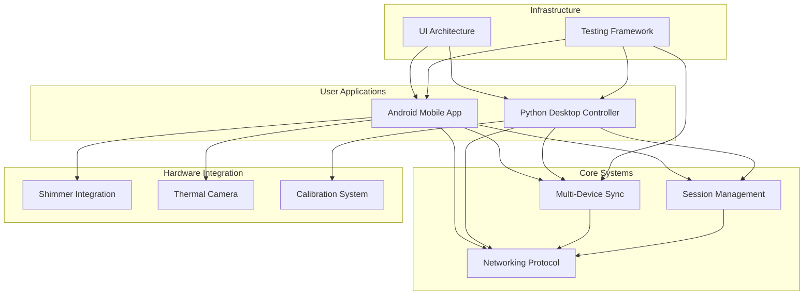

# Multi-Sensor Recording System - Module Documentation

This directory contains consolidated documentation organized by system modules. Each module has comprehensive documentation that consolidates all related scattered documents into a single authoritative source.

## System Modules

### Core Application Modules
- **[Android Mobile Application](android-mobile-application/README.md)** - Mobile data collection and sensor integration
- **[Python Desktop Controller](python-desktop-controller/README.md)** - Central coordination and control system

### Subsystem Modules  
- **[Multi-Device Synchronization](multi-device-synchronization/README.md)** - Temporal coordination across devices
- **[Calibration System](calibration-system/README.md)** - Camera and sensor calibration framework
- **[Shimmer Integration](shimmer-integration/README.md)** - Physiological sensor connectivity
- **[Networking Protocol](networking-protocol/README.md)** - Inter-device communication system
- **[Session Management](session-management/README.md)** - Recording session lifecycle management
- **[UI Architecture](ui-architecture/README.md)** - User interface design and implementation
- **[Thermal Camera Integration](thermal-camera-integration/README.md)** - Topdon TC001 thermal imaging system
- **[Testing Framework](testing-framework/README.md)** - Comprehensive validation and QA system

## Documentation Structure

Each module documentation includes:

### Protocol Specification
Technical specifications, data formats, and communication protocols

### Implementation Guide  
Detailed implementation details, architecture decisions, and technical considerations

### User Guide
Setup instructions, configuration options, and operational procedures

### API Reference
Complete API documentation with examples and parameter descriptions

### Testing Information
Test coverage, validation procedures, and troubleshooting guides

## Navigation

- **[Main Project README](../../README.md)** - Project overview and quick start
- **[Complete System Architecture](../thesis_report/Chapter_4_Design_and_Implementation.md)** - Comprehensive architectural documentation
- **[Legacy Documentation Archive](../archive/)** - Historical documentation (consolidated into modules)

## Module Relationship Overview

## Getting Started

1. **New Users**: Start with [Python Desktop Controller](python-desktop-controller/README.md) for system overview
2. **Mobile Developers**: Begin with [Android Mobile Application](android-mobile-application/README.md)
3. **System Integrators**: Review [Multi-Device Synchronization](multi-device-synchronization/README.md) and [Networking Protocol](networking-protocol/README.md)
4. **Researchers**: Focus on [Session Management](session-management/README.md) and [Calibration System](calibration-system/README.md)

## Consolidated Documentation Status

✅ **All 10 modules consolidated** - Complete documentation consolidation project
- Total documentation: ~250,000 characters across all modules
- Consistent structure with Overview, Architecture, Protocol, Implementation, User Guide, API, Testing, Troubleshooting
- Cross-references maintained between related modules
- Comprehensive coverage of all system components

## Contributing to Documentation

When updating documentation:
1. Update the relevant module documentation
2. Maintain consistency across modules
3. Update cross-references as needed
4. Follow the established structure within each module
5. Keep the main project README synchronized with module changes

---

*This modular documentation structure consolidates all previously scattered documentation into authoritative, comprehensive, and maintainable module-specific documents.*