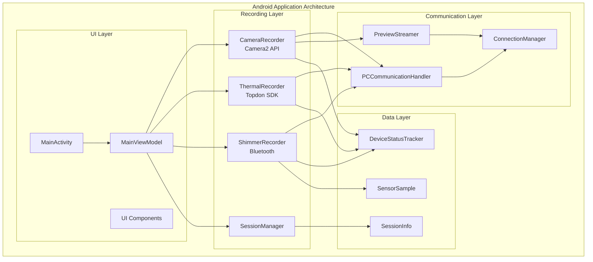

# Android Mobile Application Module

The Android Mobile Application serves as a sophisticated distributed mobile data collection node within the Multi-Sensor Recording System, responsible for capturing synchronized data from multiple sensor modalities and coordinating with the PC controller for precise temporal synchronization.

## Table of Contents

- [Overview](#overview)
- [Architecture](#architecture)
- [Protocol Specification](#protocol-specification)
- [Implementation Guide](#implementation-guide)
- [User Guide](#user-guide)
- [API Reference](#api-reference)
- [Testing](#testing)
- [Troubleshooting](#troubleshooting)

## Overview

### System Role and Responsibilities

The Android Mobile Application encompasses comprehensive mobile sensing capabilities designed for integration with multi-modal research systems. It operates as a coordinated node in a distributed architecture, communicating with a PC controller via WiFi socket connections to enable precise temporal synchronization across all data sources.

**Primary Functions:**
- **Multi-Modal Sensor Integration**: Coordinates RGB cameras, thermal imaging devices, accelerometers, gyroscopes, and external physiological sensors
- **Network-Based Synchronization**: Real-time coordination with PC master controllers through JSON-based protocols
- **Real-Time Data Processing**: Advanced data processing pipelines with immediate sensor data analysis
- **External Device Integration**: Seamless integration with Shimmer3 GSR+ physiological sensors and TopDon thermal cameras

### Sensor Capabilities

- **Phone's built-in camera**: 4K video recording with simultaneous RAW image capture using Camera2 API
- **Attached thermal camera**: Topdon TC001 integration via USB-C OTG for thermal imaging
- **Connected Shimmer physiological sensor**: Shimmer3 GSR+ via Bluetooth for galvanic skin response measurement
- **Hand segmentation**: MediaPipe-based hand landmark detection for region-of-interest analysis

### Research Contribution

The application provides significant contributions to mobile sensing research through:
- **Advanced Sensor Fusion Architecture**: Unified framework maintaining temporal consistency across diverse sensor modalities
- **Research-Grade Mobile Instrumentation**: Mobile sensing capabilities achieving research-grade precision and reliability
- **Scalable Multi-Device Coordination**: Network protocols enabling seamless integration of multiple mobile devices

## Architecture

### System Architecture Overview



### Component Architecture

#### UI Layer Components
- **MainActivity**: Main application interface with fragment-based navigation
- **MainViewModel**: MVVM pattern implementation with lifecycle-aware data management
- **UI Components**: Fragment-based modular interface components

#### Recording Layer Components
- **CameraRecorder**: Camera2 API integration for 4K video and RAW image capture
- **ThermalRecorder**: Topdon SDK integration for thermal imaging data collection
- **ShimmerRecorder**: Bluetooth communication with Shimmer3 GSR+ sensors
- **SessionManager**: Recording session lifecycle management and coordination

#### Communication Layer Components
- **PCCommunicationHandler**: JSON-based socket communication with PC controller
- **ConnectionManager**: Network connection management and error recovery
- **PreviewStreamer**: Real-time video preview streaming to PC controller

#### Data Layer Components
- **DeviceStatusTracker**: Real-time device status monitoring and reporting
- **SessionInfo**: Session metadata and configuration management
- **SensorSample**: Sensor data processing and synchronization

### Technical Implementation

#### Development Framework
- **Language**: Kotlin with Android Views and ViewBinding
- **Architecture Pattern**: Clean Architecture with Repository pattern and MVVM
- **Camera Integration**: Camera2 API for low-level camera control and dual capture modes
- **Networking**: OkHttp for socket communication with automatic reconnection
- **Dependency Injection**: Hilt for component management and testing
- **Concurrency**: Kotlin Coroutines for asynchronous operations

#### Key Technical Features
- **DngCreator RAW processing** with API compatibility fixes for Android 21+ support
- **Enhanced UI feedback** with session status indicators and improved error handling
- **Real-time preview streaming** to PC controller for monitoring with adaptive frame rates
- **Socket-based remote control** interface for synchronized operation across multiple devices
- **Local data storage** with comprehensive session management and metadata tracking

## Protocol Specification

### Network Communication Protocol

#### Socket-based Communication

The Android mobile application communicates with the PC controller using TCP socket connections with JSON message protocol.

**Connection Parameters:**
- **Protocol**: TCP/IP
- **Default Port**: 8080 (configurable)
- **Message Format**: JSON
- **Encoding**: UTF-8
- **Timeout**: 30 seconds
- **Keep-Alive**: Enabled

#### Message Structure

All messages follow a standardized JSON format:

```json
{
  "type": "command|response|status|data|error",
  "timestamp": 1640995200000,
  "session_id": "session_20220101_120000",
  "device_id": "android_device_01",
  "sequence_number": 12345,
  "payload": {
    // Message-specific data
  }
}
```

**Field Descriptions:**

| Field | Type | Required | Description |
|-------|------|----------|-------------|
| `type` | String | Yes | Message type classification |
| `timestamp` | Long | Yes | Unix timestamp in milliseconds |
| `session_id` | String | No | Current recording session identifier |
| `device_id` | String | Yes | Unique Android device identifier |
| `sequence_number` | Integer | Yes | Message sequence for ordering |
| `payload` | Object | Yes | Message-specific data content |

### Command Messages

#### Recording Control Commands

**Start Recording Command:**
```json
{
  "type": "command",
  "timestamp": 1640995200000,
  "device_id": "pc_controller",
  "sequence_number": 1,
  "payload": {
    "command": "start_recording",
    "session_config": {
      "session_id": "session_20220101_120000",
      "duration": 300,
      "recording_modes": ["camera", "thermal", "shimmer"],
      "video_resolution": "4K",
      "fps": 30,
      "thermal_fps": 25,
      "shimmer_sampling_rate": 512
    }
  }
}
```

**Stop Recording Command:**
```json
{
  "type": "command",
  "timestamp": 1640995260000,
  "device_id": "pc_controller",
  "sequence_number": 2,
  "payload": {
    "command": "stop_recording",
    "session_id": "session_20220101_120000"
  }
}
```

#### Status Messages

**Device Status Response:**
```json
{
  "type": "status",
  "timestamp": 1640995200500,
  "session_id": "session_20220101_120000",
  "device_id": "android_device_01",
  "sequence_number": 1001,
  "payload": {
    "status": "recording",
    "battery_level": 85,
    "storage_available": 2048,
    "sensors": {
      "camera": {"status": "active", "fps": 30},
      "thermal": {"status": "active", "fps": 25, "temperature": 36.5},
      "shimmer": {"status": "connected", "signal_quality": "good"}
    }
  }
}
```

## Implementation Guide

### Project Structure

```
AndroidApp/src/main/java/com/multisensor/recording/
├── MainActivity.kt                    # Main application entry point
├── MultiSensorApplication.kt          # Application class and dependency injection
├── calibration/                       # Camera calibration components
│   ├── CalibrationCaptureManager.kt  # Calibration image capture
│   └── SyncClockManager.kt           # Time synchronization
├── controllers/                       # UI controllers and coordinators
├── di/                               # Dependency injection modules
├── handsegmentation/                 # MediaPipe hand segmentation
├── managers/                         # Service and resource managers
├── network/                          # Network communication components
├── recording/                        # Data recording components
│   ├── CameraRecorder.kt            # Camera2 API integration
│   ├── ThermalRecorder.kt           # Topdon thermal camera
│   ├── ShimmerRecorder.kt           # Shimmer3 GSR+ integration
│   └── SessionManager.kt            # Session lifecycle management
├── streaming/                        # Real-time data streaming
├── ui/                              # User interface components
└── util/                            # Utility classes and helpers
```

### Build Configuration

The Android module uses the following key configurations:

**Module Settings (`AndroidApp/build.gradle`):**
- **Compile SDK**: 34 (Android 14)
- **Min SDK**: 24 (Android 7.0)
- **Target SDK**: 34 (Android 14)
- **Namespace**: `com.multisensor.recording`

**Key Dependencies:**
```gradle
dependencies {
    implementation 'androidx.camera:camera-camera2:1.3.0'
    implementation 'androidx.camera:camera-lifecycle:1.3.0'
    implementation 'com.squareup.okhttp3:okhttp:4.11.0'
    implementation 'com.google.dagger:hilt-android:2.47'
    implementation 'org.jetbrains.kotlinx:kotlinx-coroutines-android:1.7.3'
}
```

### Integration Setup

#### Shimmer3 GSR+ Integration

The application integrates with Shimmer3 GSR+ sensors via Bluetooth:

```kotlin
class ShimmerRecorder {
    private val shimmerHandler = ShimmerHandler()
    
    fun connectToShimmer(deviceAddress: String) {
        shimmerHandler.connectShimmerDevice(deviceAddress)
        shimmerHandler.enableGSRSensor()
        shimmerHandler.setSamplingRate(512.0) // 512 Hz
    }
    
    fun startRecording() {
        shimmerHandler.startStreaming()
    }
}
```

#### Thermal Camera Integration

Integration with Topdon TC001 thermal cameras via USB-C OTG:

```kotlin
class ThermalRecorder {
    private val thermalDevice = TopdonDevice()
    
    fun initializeThermal(): Boolean {
        return thermalDevice.connect() && 
               thermalDevice.setFrameRate(25) &&
               thermalDevice.setResolution(320, 240)
    }
    
    fun captureFrame(): ThermalFrame {
        return thermalDevice.captureFrame()
    }
}
```

### Data Flow Implementation

#### Recording Workflow

1. **Session Initialization**: PC controller sends start recording command
2. **Sensor Activation**: All sensors initialized and configured
3. **Synchronization**: Temporal alignment with PC master clock
4. **Data Collection**: Continuous multi-modal data capture
5. **Quality Monitoring**: Real-time quality assessment and reporting
6. **Session Completion**: Coordinated shutdown and data finalization

#### Data Storage Organization

```
/storage/emulated/0/MultiSensorRecordings/
├── session_20220101_120000/
│   ├── metadata/
│   │   ├── session_info.json
│   │   ├── device_status.json
│   │   └── calibration_data.json
│   ├── video/
│   │   ├── camera_4k.mp4
│   │   └── raw_images/
│   ├── thermal/
│   │   ├── thermal_frames.bin
│   │   └── thermal_metadata.json
│   └── physiological/
│       ├── shimmer_gsr.csv
│       └── sensor_timestamps.json
```

## User Guide

### Quick Start Guide

#### Pre-flight Checklist

Before starting a recording session, ensure the following prerequisites are met:

**✅ Hardware Setup**
- [ ] Samsung S22 smartphone with sufficient battery (>50%)
- [ ] Topdon TC001 thermal camera connected via USB-C
- [ ] Shimmer3 GSR+ sensor paired via Bluetooth
- [ ] WiFi network connection established
- [ ] Minimum 2GB available storage space

**✅ Software Configuration**
- [ ] Android app installed and permissions granted
- [ ] PC controller running and accessible on network
- [ ] Network configuration verified (IP address and port)
- [ ] All sensors calibrated and tested
- [ ] Session parameters configured

### Recording Procedures

#### 1. Initial App Launch

1. **Launch Application**: Tap the Multi-Sensor Recording icon
2. **Grant Permissions**: Allow camera, storage, and location permissions
3. **Network Connection**: Verify WiFi connection status
4. **Device Detection**: Confirm thermal camera and Shimmer sensor detection

#### 2. Main Interface Overview

The main interface provides access to four primary functions:

- **📱 Record Tab**: Recording controls and session management
- **🔧 Devices Tab**: Device connection and status monitoring
- **🎯 Calibration Tab**: Camera calibration and system synchronization
- **📁 Files Tab**: Session data management and export

#### 3. Preparing for Recording

1. **Connect to PC Controller**:
   - Navigate to Settings → Network Configuration
   - Enter PC controller IP address and port
   - Test connection with "Ping Controller" button

2. **Verify Sensor Status**:
   - Check Devices tab for sensor connectivity
   - Ensure all sensors show "Connected" status
   - Verify battery levels and storage availability

3. **Configure Recording Parameters**:
   - Set video resolution (1080p, 4K)
   - Configure frame rates for camera and thermal
   - Set Shimmer sampling rate (256Hz, 512Hz, 1024Hz)

#### 4. Recording Session Workflow

1. **Start Recording**: Recording sessions are initiated from the PC controller
2. **Monitor Progress**: Real-time status updates during recording
3. **Quality Indicators**: Visual feedback for data quality and sensor status
4. **Session Completion**: Automatic data finalization and upload preparation

### Sensor Configuration

#### 5. Camera Setup and Configuration

**Video Recording Settings:**
- **Resolution Options**: 1920x1080, 3840x2160 (4K)
- **Frame Rate**: 24, 30, 60 fps
- **Format**: H.264/AVC encoding
- **Quality**: High bitrate for research applications

**RAW Image Capture:**
- **Format**: DNG (Digital Negative)
- **Capture Timing**: Synchronized with video frames
- **Processing**: Minimal in-camera processing for maximum data fidelity

#### 6. Thermal Camera Integration

**Topdon TC001 Configuration:**
- **Connection**: USB-C OTG cable required
- **Resolution**: 320x240 thermal pixels
- **Frame Rate**: 25 fps typical
- **Temperature Range**: -20°C to 550°C
- **Accuracy**: ±2°C or ±2% of reading

**Usage Instructions:**
1. Connect thermal camera via USB-C OTG adapter
2. Launch application and navigate to Devices tab
3. Verify thermal camera detection
4. Test thermal imaging with live preview

#### 7. Shimmer3 GSR+ Sensor

**Bluetooth Configuration:**
- **Pairing**: Use standard Android Bluetooth settings
- **Connection**: Automatic detection within application
- **Range**: 10 meters typical operation
- **Battery**: Monitor sensor battery level

**GSR Measurement Setup:**
1. Attach GSR electrodes to participant
2. Pair Shimmer device via Bluetooth
3. Configure sampling rate in application
4. Verify signal quality before recording

### Calibration Procedures

#### 8. Camera Calibration

**Intrinsic Calibration:**
1. Navigate to Calibration tab
2. Select "Camera Calibration" mode
3. Capture chessboard pattern from multiple angles
4. Review calibration quality metrics
5. Save calibration parameters

**Stereo Calibration (RGB-Thermal):**
1. Use simultaneous calibration mode
2. Capture synchronized RGB and thermal images
3. Process stereo calibration parameters
4. Validate alignment accuracy

#### 9. System Synchronization

**Clock Synchronization:**
1. Ensure stable network connection to PC controller
2. Initiate synchronization from Calibration tab
3. Monitor synchronization accuracy metrics
4. Verify temporal alignment across all sensors

## API Reference

### Core Classes

#### MainActivity
Main application entry point providing fragment-based navigation and lifecycle management.

```kotlin
class MainActivity : AppCompatActivity() {
    fun navigateToFragment(fragment: Fragment)
    fun updateConnectionStatus(isConnected: Boolean)
    fun showStatusMessage(message: String, level: MessageLevel)
}
```

#### SessionManager
Central coordinator for recording session lifecycle and multi-sensor data collection.

```kotlin
class SessionManager {
    fun startRecordingSession(config: SessionConfig): Result<SessionInfo>
    fun stopRecordingSession(sessionId: String): Result<SessionSummary>
    fun getSessionStatus(sessionId: String): SessionStatus
    fun configureRecordingParameters(params: RecordingParameters)
}
```

#### CameraRecorder
Camera2 API integration for 4K video recording and RAW image capture.

```kotlin
class CameraRecorder {
    fun initializeCamera(surfaceView: SurfaceView): Boolean
    fun startRecording(outputPath: String): Result<RecordingSession>
    fun captureRawImage(): Result<DngImage>
    fun configureRecordingParameters(params: CameraParameters)
}
```

#### ThermalRecorder
Topdon thermal camera integration for thermal imaging data collection.

```kotlin
class ThermalRecorder {
    fun connectThermalCamera(): Result<ThermalDevice>
    fun startThermalRecording(outputPath: String): Result<ThermalSession>
    fun getCurrentTemperature(): Temperature
    fun configureThermalParameters(params: ThermalParameters)
}
```

#### ShimmerRecorder
Shimmer3 GSR+ sensor integration for physiological data collection.

```kotlin
class ShimmerRecorder {
    fun connectShimmerDevice(address: String): Result<ShimmerConnection>
    fun startDataStreaming(): Result<DataStream>
    fun configureGSRSensor(samplingRate: Double)
    fun getSignalQuality(): SignalQuality
}
```

### Data Models

#### SessionInfo
Comprehensive session metadata and configuration.

```kotlin
data class SessionInfo(
    val sessionId: String,
    val startTimestamp: Long,
    val recordingModes: List<RecordingMode>,
    val deviceConfiguration: DeviceConfig,
    val participants: List<Participant>,
    val sessionParameters: SessionParameters
)
```

#### SensorSample
Standardized sensor data sample with temporal information.

```kotlin
data class SensorSample(
    val sensorType: SensorType,
    val timestamp: Long,
    val data: ByteArray,
    val metadata: SensorMetadata,
    val qualityIndicators: QualityMetrics
)
```

### Network Protocol

#### PCCommunicationHandler
JSON-based socket communication with PC controller.

```kotlin
class PCCommunicationHandler {
    fun connectToController(address: String, port: Int): Result<Connection>
    fun sendCommand(command: JsonCommand): Result<JsonResponse>
    fun registerStatusCallback(callback: (JsonStatus) -> Unit)
    fun startPreviewStreaming(previewConfig: PreviewConfig)
}
```

## Testing

### Testing Framework

The Android application includes comprehensive testing with 25+ unit tests covering all UI management scenarios and core functionality.

#### Unit Testing
```bash
# Run Android unit tests
./gradlew AndroidApp:testDebugUnitTest

# Run with coverage
./gradlew AndroidApp:testDebugUnitTestCoverage
```

#### Integration Testing
```bash
# Run instrumented tests (requires connected device)
./gradlew AndroidApp:connectedDebugAndroidTest
```

#### Key Test Categories

**UI Component Testing:**
- Fragment navigation and lifecycle
- Status indicator accuracy
- Error state management
- User interaction handling

**Recording System Testing:**
- Session lifecycle management
- Multi-sensor coordination
- Data quality validation
- Error recovery mechanisms

**Network Communication Testing:**
- Socket connection reliability
- Message protocol validation
- Reconnection and recovery
- Latency and throughput testing

**Sensor Integration Testing:**
- Camera functionality validation
- Thermal camera communication
- Shimmer Bluetooth connectivity
- Data synchronization accuracy

### Test Configuration

```kotlin
@RunWith(AndroidJUnit4::class)
class SessionManagerTest {
    @Test
    fun testSessionLifecycle() {
        // Test session creation, execution, and cleanup
    }
    
    @Test
    fun testMultiSensorCoordination() {
        // Test synchronized sensor data collection
    }
}
```

## Troubleshooting

### Common Issues and Solutions

#### Connection Issues

**Problem**: Cannot connect to PC controller
**Solutions**:
1. Verify network connectivity (WiFi connected, same network)
2. Check PC controller IP address and port configuration
3. Ensure PC controller application is running
4. Test with ping command from Settings

**Problem**: Thermal camera not detected
**Solutions**:
1. Verify USB-C OTG adapter connection
2. Check camera power status
3. Restart application
4. Try different USB-C port/adapter

**Problem**: Shimmer sensor connection fails
**Solutions**:
1. Verify Bluetooth pairing in Android settings
2. Check sensor battery level
3. Clear Bluetooth cache
4. Re-pair device if necessary

#### Recording Issues

**Problem**: Video recording fails to start
**Solutions**:
1. Check available storage space (minimum 2GB)
2. Verify camera permissions granted
3. Close other camera applications
4. Restart application

**Problem**: Data synchronization errors
**Solutions**:
1. Verify stable network connection
2. Check system clock synchronization
3. Restart recording session
4. Contact technical support

#### Performance Issues

**Problem**: Application performance degradation
**Solutions**:
1. Close unnecessary background applications
2. Ensure sufficient battery level (>30%)
3. Check device temperature (avoid overheating)
4. Restart device if necessary

### Advanced Troubleshooting

#### Debug Logging

Enable debug logging for detailed troubleshooting:

1. Navigate to Settings → Advanced
2. Enable "Debug Logging"
3. Reproduce the issue
4. Export logs via Files tab

#### Network Diagnostics

Use built-in network diagnostic tools:

1. Settings → Network Configuration
2. Run "Network Diagnostics"
3. Review connectivity and latency reports
4. Test with different network configurations

#### Support Resources

**Technical Support**:
- GitHub Issues: [Repository Issues](https://github.com/buccancs/bucika_gsr/issues)
- Documentation: [Project Documentation](../../README.md)
- Development Guide: [Implementation Documentation](../python-desktop-controller/README.md)

**Community Resources**:
- Discussion Forums: [GitHub Discussions](https://github.com/buccancs/bucika_gsr/discussions)
- User Community: Research community forums
- Academic Support: Research methodology consultation

---

*This comprehensive documentation consolidates all Android Mobile Application information from multiple sources into a single authoritative reference. For related modules, see the [Python Desktop Controller](../python-desktop-controller/README.md) and [Multi-Device Synchronization](../multi-device-synchronization/README.md) documentation.*