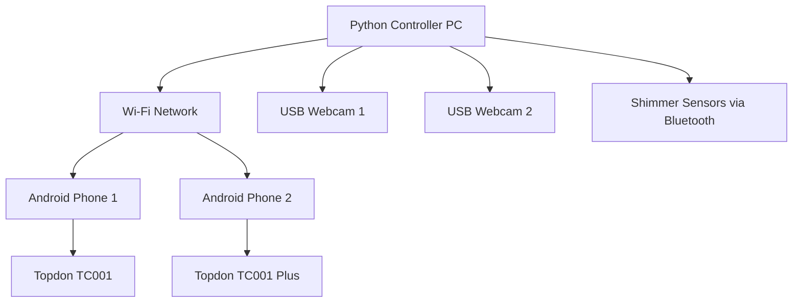

# Multi-Device Troubleshooting Guide

## Multi-Sensor Recording System - Troubleshooting and Diagnostics

This guide provides comprehensive troubleshooting information for the Multi-Sensor Recording System, covering common issues, diagnostic procedures, and solutions for multi-device synchronization problems.

## Table of Contents

1. [System Overview](#system-overview)
2. [Common Issues and Solutions](#common-issues-and-solutions)
3. [Network Connectivity Problems](#network-connectivity-problems)
4. [Device Synchronization Issues](#device-synchronization-issues)
5. [Hardware Integration Problems](#hardware-integration-problems)
6. [Performance Issues](#performance-issues)
7. [Calibration Problems](#calibration-problems)
8. [Data Collection Issues](#data-collection-issues)
9. [Diagnostic Tools](#diagnostic-tools)
10. [Recovery Procedures](#recovery-procedures)

## System Overview

The Multi-Sensor Recording System consists of:

- **Python Controller**: Master application running on Windows PC
- **Android Devices**: Two Samsung S22 phones with thermal cameras
- **Shimmer Sensors**: Bluetooth-connected physiological sensors
- **USB Webcams**: Logitech Brio 4K cameras connected to PC
- **Network Infrastructure**: Wi-Fi network for device communication

### System Architecture



## Common Issues and Solutions

### 1. Application Startup Problems

#### Issue: Python application fails to start

**Symptoms:**
- ImportError messages
- Missing dependencies
- Qt application errors

**Diagnosis:**
```bash
# Check Python environment
python --version
pip list | grep -E "(PyQt5|opencv|numpy|pandas)"

# Test individual components
cd PythonApp/src
python shimmer_manager.py
python ntp_time_server.py
python stimulus_manager.py
```

**Solutions:**
1. **Install missing dependencies:**
   ```bash
   pip install PyQt5 opencv-python numpy pandas pyserial ntplib
   ```

2. **Fix Qt display issues:**
   ```bash
   # On Windows, set display environment
   set QT_QPA_PLATFORM=windows
   
   # On Linux with no display
   export DISPLAY=:0
   xvfb-run python main_backup.py
   ```

3. **Verify pyshimmer installation:**
   ```bash
   cd AndroidApp/libs/pyshimmer
   pip install -e .
   ```

#### Issue: Android application crashes on startup

**Symptoms:**
- App closes immediately after launch
- Permission denied errors
- Camera initialization failures

**Diagnosis:**
```bash
# Check device logs
adb logcat | grep -E "(MultiSensor|ERROR|FATAL)"

# Verify permissions
adb shell dumpsys package com.multisensor.recording | grep permission
```

**Solutions:**
1. **Grant required permissions:**
   - Camera access
   - Microphone access
   - Storage access
   - Location access (for Bluetooth)

2. **Check USB OTG support:**
   ```bash
   # Verify OTG capability
   adb shell getprop sys.usb.config
   ```

3. **Restart ADB service:**
   ```bash
   adb kill-server
   adb start-server
   ```

### 2. Device Discovery Problems

#### Issue: Android devices not appearing in Python controller

**Symptoms:**
- No devices shown in device list
- Connection timeout errors
- Network unreachable messages

**Diagnosis:**
```python
# Test network connectivity
import socket
try:
    socket.create_connection(("192.168.1.100", 8888), timeout=5)
    print("Network connection successful")
except Exception as e:
    print(f"Network error: {e}")
```

**Solutions:**
1. **Check network configuration:**
   - Ensure all devices on same Wi-Fi network
   - Verify IP addresses are in same subnet
   - Check firewall settings

2. **Verify port availability:**
   ```bash
   # On PC, check if ports are open
   netstat -an | findstr :8888
   netstat -an | findstr :8889
   
   # Test port connectivity
   telnet 192.168.1.100 8888
   ```

3. **Restart network services:**
   ```bash
   # On Windows
   ipconfig /release
   ipconfig /renew
   
   # On Android
   # Settings > Wi-Fi > Forget network > Reconnect
   ```

## Network Connectivity Problems

### Wi-Fi Connection Issues

#### Issue: Intermittent network disconnections

**Symptoms:**
- Devices randomly disconnect
- Data transmission interruptions
- Synchronization failures

**Diagnosis:**
```python
# Monitor network stability
import time
import socket

def test_connectivity(host, port, duration=60):
    start_time = time.time()
    failures = 0
    
    while time.time() - start_time < duration:
        try:
            socket.create_connection((host, port), timeout=2)
        except:
            failures += 1
        time.sleep(1)
    
    print(f"Failures: {failures}/{duration}")

test_connectivity("192.168.1.100", 8888)
```

**Solutions:**
1. **Optimize Wi-Fi settings:**
   - Use 5GHz band for better performance
   - Set fixed channel to avoid interference
   - Increase router transmission power

2. **Configure device power management:**
   ```bash
   # Disable Wi-Fi power saving on Android
   adb shell settings put global wifi_sleep_policy 2
   ```

3. **Use dedicated network:**
   - Set up isolated Wi-Fi network for recording system
   - Limit other devices on network during recording

### Bandwidth Limitations

#### Issue: Video streaming quality degradation

**Symptoms:**
- Choppy video preview
- Frame drops
- Increased latency

**Diagnosis:**
```python
# Monitor bandwidth usage
import psutil
import time

def monitor_bandwidth(duration=30):
    start_stats = psutil.net_io_counters()
    time.sleep(duration)
    end_stats = psutil.net_io_counters()
    
    bytes_sent = end_stats.bytes_sent - start_stats.bytes_sent
    bytes_recv = end_stats.bytes_recv - start_stats.bytes_recv
    
    print(f"Sent: {bytes_sent / (1024*1024):.2f} MB")
    print(f"Received: {bytes_recv / (1024*1024):.2f} MB")
    print(f"Total: {(bytes_sent + bytes_recv) / (1024*1024):.2f} MB")

monitor_bandwidth()
```

**Solutions:**
1. **Reduce video quality:**
   - Lower resolution for preview streams
   - Reduce frame rate for non-critical streams
   - Use compression for network transmission

2. **Optimize network usage:**
   - Prioritize critical data streams
   - Use adaptive quality based on network conditions
   - Implement data buffering

## Device Synchronization Issues

### Time Synchronization Problems

#### Issue: Devices not synchronized properly

**Symptoms:**
- Timestamp misalignment in recorded data
- NTP synchronization failures
- Clock drift warnings

**Diagnosis:**
```python
# Check NTP server status
from ntp_time_server import TimeServerManager

time_server = TimeServerManager()
time_server.initialize()
time_server.start()

status = time_server.get_status()
print(f"Server running: {status.is_running}")
print(f"Synchronized: {status.is_synchronized}")
print(f"Accuracy: {status.time_accuracy_ms:.1f}ms")
print(f"Clients: {status.client_count}")
```

**Solutions:**
1. **Verify NTP server configuration:**
   ```python
   # Check NTP server accessibility
   import ntplib
   
   client = ntplib.NTPClient()
   try:
       response = client.request('pool.ntp.org')
       print(f"NTP offset: {response.offset * 1000:.2f}ms")
   except Exception as e:
       print(f"NTP error: {e}")
   ```

2. **Improve time synchronization:**
   - Increase synchronization frequency
   - Use multiple NTP sources
   - Implement drift compensation

3. **Manual time correction:**
   ```bash
   # On Android (requires root)
   adb shell su -c "date -s '2025-07-30 04:10:00'"
   
   # On Windows
   w32tm /resync
   ```

### Data Synchronization Issues

#### Issue: Sensor data not aligned across devices

**Symptoms:**
- Mismatched timestamps in CSV files
- Data gaps or overlaps
- Synchronization markers missing

**Diagnosis:**
```python
# Analyze timestamp alignment
import pandas as pd
import matplotlib.pyplot as plt

def analyze_sync(csv_files):
    data_frames = []
    for file in csv_files:
        df = pd.read_csv(file)
        df['source'] = file
        data_frames.append(df)
    
    combined = pd.concat(data_frames)
    combined['timestamp'] = pd.to_datetime(combined['timestamp'])
    
    # Plot timeline
    plt.figure(figsize=(12, 6))
    for source in combined['source'].unique():
        source_data = combined[combined['source'] == source]
        plt.scatter(source_data['timestamp'], [source] * len(source_data), alpha=0.6)
    
    plt.xlabel('Timestamp')
    plt.ylabel('Data Source')
    plt.title('Data Synchronization Analysis')
    plt.show()

# Usage
csv_files = ['shimmer_data.csv', 'android_data.csv', 'webcam_data.csv']
analyze_sync(csv_files)
```

**Solutions:**
1. **Implement synchronization markers:**
   - Add periodic sync pulses
   - Use common reference events
   - Cross-correlate data streams

2. **Post-processing alignment:**
   ```python
   # Align data streams using cross-correlation
   import numpy as np
   from scipy import signal
   
   def align_streams(stream1, stream2):
       correlation = signal.correlate(stream1, stream2, mode='full')
       lag = correlation.argmax() - len(stream2) + 1
       return lag
   ```

## Hardware Integration Problems

### Shimmer Sensor Issues

#### Issue: Shimmer sensors not connecting

**Symptoms:**
- Bluetooth pairing failures
- Device not found errors
- Connection timeouts

**Diagnosis:**
```python
# Test Shimmer connectivity
from shimmer_manager import ShimmerManager

shimmer = ShimmerManager()
shimmer.initialize()

# Scan for devices
devices = shimmer.scan_and_pair_devices()
print(f"Found devices: {devices}")

# Test connection
if devices:
    result = shimmer.connect_devices(devices)
    print(f"Connection result: {result}")
    
    # Check status
    status = shimmer.get_shimmer_status()
    for device_id, device_status in status.items():
        print(f"{device_id}: Connected={device_status.is_connected}")
```

**Solutions:**
1. **Bluetooth troubleshooting:**
   ```bash
   # Reset Bluetooth on Windows
   devcon disable *BTHENUM*
   devcon enable *BTHENUM*
   
   # Clear Bluetooth cache on Android
   adb shell pm clear com.android.bluetooth
   ```

2. **Shimmer device reset:**
   - Power cycle Shimmer devices
   - Clear pairing information
   - Update Shimmer firmware if available

3. **Alternative connection methods:**
   - Use USB-to-serial adapter
   - Try different Bluetooth adapters
   - Use Android as Bluetooth bridge

### Thermal Camera Problems

#### Issue: Topdon cameras not detected

**Symptoms:**
- USB device not recognized
- Camera initialization failures
- No thermal image data

**Diagnosis:**
```bash
# Check USB device recognition
adb shell lsusb
adb shell dmesg | grep -i usb

# Verify OTG functionality
adb shell cat /sys/class/power_supply/usb/online
```

**Solutions:**
1. **USB OTG troubleshooting:**
   - Use certified OTG cables
   - Check power requirements
   - Try different USB ports

2. **Driver issues:**
   - Install Topdon SDK properly
   - Update Android USB drivers
   - Check device permissions

3. **Hardware verification:**
   - Test cameras on different devices
   - Verify cable integrity
   - Check power supply adequacy

### USB Webcam Issues

#### Issue: Logitech Brio cameras not working

**Symptoms:**
- Device not recognized
- Poor video quality
- USB bandwidth errors

**Diagnosis:**
```python
# Test webcam availability
import cv2

def test_cameras():
    for i in range(4):  # Test first 4 camera indices
        cap = cv2.VideoCapture(i)
        if cap.isOpened():
            ret, frame = cap.read()
            if ret:
                print(f"Camera {i}: Working ({frame.shape})")
            else:
                print(f"Camera {i}: No frame")
            cap.release()
        else:
            print(f"Camera {i}: Not available")

test_cameras()
```

**Solutions:**
1. **USB bandwidth management:**
   - Connect cameras to separate USB controllers
   - Reduce resolution/frame rate
   - Use USB 3.0 ports

2. **Driver updates:**
   - Install latest Logitech drivers
   - Update Windows camera drivers
   - Check device manager for errors

## Performance Issues

### High CPU Usage

#### Issue: System performance degradation

**Symptoms:**
- Slow response times
- Frame drops
- System freezing

**Diagnosis:**
```python
# Monitor system performance
import psutil
import time

def monitor_performance(duration=60):
    start_time = time.time()
    cpu_samples = []
    memory_samples = []
    
    while time.time() - start_time < duration:
        cpu_samples.append(psutil.cpu_percent())
        memory_samples.append(psutil.virtual_memory().percent)
        time.sleep(1)
    
    print(f"Average CPU: {sum(cpu_samples)/len(cpu_samples):.1f}%")
    print(f"Average Memory: {sum(memory_samples)/len(memory_samples):.1f}%")
    print(f"Peak CPU: {max(cpu_samples):.1f}%")
    print(f"Peak Memory: {max(memory_samples):.1f}%")

monitor_performance()
```

**Solutions:**
1. **Optimize processing:**
   - Reduce thread count for CPU-intensive tasks
   - Use hardware acceleration where available
   - Implement adaptive quality control

2. **Resource management:**
   ```python
   # Configure resource limits
   shimmer_manager.max_worker_threads = 2
   stimulus_manager.reduce_quality_on_load = True
   ntp_server.max_concurrent_clients = 5
   ```

### Memory Issues

#### Issue: Memory leaks or excessive usage

**Symptoms:**
- Gradually increasing memory usage
- Out of memory errors
- System slowdown over time

**Diagnosis:**
```python
# Memory profiling
import tracemalloc
import gc

def profile_memory():
    tracemalloc.start()
    
    # Run your application code here
    # ... application operations ...
    
    current, peak = tracemalloc.get_traced_memory()
    print(f"Current memory usage: {current / 1024 / 1024:.1f} MB")
    print(f"Peak memory usage: {peak / 1024 / 1024:.1f} MB")
    
    # Get top memory consumers
    snapshot = tracemalloc.take_snapshot()
    top_stats = snapshot.statistics('lineno')
    
    for stat in top_stats[:10]:
        print(stat)
    
    tracemalloc.stop()

profile_memory()
```

**Solutions:**
1. **Memory optimization:**
   ```python
   # Implement periodic cleanup
   def cleanup_memory():
       gc.collect()
       # Clear old data buffers
       shimmer_manager.cleanup_old_data()
       # Reduce cache sizes
       calibration_manager.clear_cache()
   
   # Schedule regular cleanup
   timer = QTimer()
   timer.timeout.connect(cleanup_memory)
   timer.start(300000)  # Every 5 minutes
   ```

2. **Buffer management:**
   - Reduce buffer sizes
   - Implement circular buffers
   - Use memory-mapped files for large data

## Calibration Problems

### Pattern Detection Issues

#### Issue: Calibration patterns not detected

**Symptoms:**
- "Pattern not found" errors
- Poor calibration quality scores
- Inconsistent detection results

**Diagnosis:**
```python
# Test pattern detection
from calibration_quality_assessment import CalibrationQualityAssessment, PatternType
import cv2

assessment = CalibrationQualityAssessment()
image = cv2.imread("calibration_image.jpg")

result = assessment.assess_calibration_quality(image, PatternType.CHESSBOARD)
print(f"Pattern found: {result.pattern_detection.pattern_found}")
print(f"Pattern score: {result.pattern_detection.pattern_score:.3f}")
print(f"Corner count: {result.pattern_detection.corner_count}")

if not result.is_acceptable:
    print("Issues found:")
    for rec in result.recommendations:
        print(f"  - {rec}")
```

**Solutions:**
1. **Improve image quality:**
   - Ensure adequate lighting
   - Reduce motion blur
   - Check camera focus
   - Use high-contrast patterns

2. **Pattern optimization:**
   - Use appropriate pattern size
   - Ensure pattern is fully visible
   - Avoid reflections and shadows
   - Try different pattern types

### Cross-Device Calibration Issues

#### Issue: Multi-device calibration coordination fails

**Symptoms:**
- Devices not synchronizing calibration
- Inconsistent calibration results
- Network communication errors

**Diagnosis:**
```python
# Test calibration coordination
from cross_device_calibration_coordinator import CrossDeviceCalibrationCoordinator

coordinator = CrossDeviceCalibrationCoordinator()
coordinator.start_coordination_server()

# Monitor device connections
status = coordinator.get_server_status()
print(f"Connected devices: {status['connected_devices']}")
print(f"Active sessions: {status['active_sessions']}")
```

**Solutions:**
1. **Network troubleshooting:**
   - Verify all devices can reach coordination server
   - Check firewall settings
   - Ensure adequate bandwidth

2. **Synchronization improvements:**
   - Increase timeout values
   - Implement retry mechanisms
   - Use heartbeat monitoring

## Data Collection Issues

### Missing Data

#### Issue: Data gaps in recorded files

**Symptoms:**
- Incomplete CSV files
- Missing timestamps
- Sensor data interruptions

**Diagnosis:**
```python
# Analyze data completeness
import pandas as pd
import numpy as np

def analyze_data_gaps(csv_file):
    df = pd.read_csv(csv_file)
    df['timestamp'] = pd.to_datetime(df['timestamp'])
    df = df.sort_values('timestamp')
    
    # Calculate time differences
    time_diffs = df['timestamp'].diff().dt.total_seconds()
    
    # Find gaps (assuming 128Hz sampling rate)
    expected_interval = 1.0 / 128  # 7.8ms
    gaps = time_diffs[time_diffs > expected_interval * 2]
    
    print(f"Total samples: {len(df)}")
    print(f"Data gaps found: {len(gaps)}")
    print(f"Largest gap: {gaps.max():.3f}s")
    print(f"Data completeness: {(1 - len(gaps)/len(df)) * 100:.1f}%")

analyze_data_gaps("shimmer_data.csv")
```

**Solutions:**
1. **Improve data reliability:**
   - Increase buffer sizes
   - Implement data validation
   - Add redundant data paths

2. **Gap filling strategies:**
   ```python
   # Interpolate missing data
   def fill_gaps(df, method='linear'):
       df['timestamp'] = pd.to_datetime(df['timestamp'])
       df = df.set_index('timestamp')
       
       # Create complete time index
       full_index = pd.date_range(
           start=df.index.min(),
           end=df.index.max(),
           freq='7.8125ms'  # 128Hz
       )
       
       # Reindex and interpolate
       df_complete = df.reindex(full_index)
       df_complete = df_complete.interpolate(method=method)
       
       return df_complete
   ```

### File Corruption

#### Issue: Corrupted or unreadable data files

**Symptoms:**
- CSV parsing errors
- Truncated files
- Invalid data values

**Diagnosis:**
```python
# Validate file integrity
import csv
import os

def validate_csv_file(filename):
    try:
        file_size = os.path.getsize(filename)
        print(f"File size: {file_size} bytes")
        
        with open(filename, 'r') as f:
            reader = csv.reader(f)
            header = next(reader)
            print(f"Header: {header}")
            
            row_count = 0
            for row in reader:
                if len(row) != len(header):
                    print(f"Row {row_count}: Column count mismatch")
                row_count += 1
            
            print(f"Total rows: {row_count}")
            
    except Exception as e:
        print(f"File validation error: {e}")

validate_csv_file("shimmer_data.csv")
```

**Solutions:**
1. **File integrity measures:**
   - Implement checksums
   - Use atomic file operations
   - Create backup copies

2. **Recovery procedures:**
   ```python
   # Attempt file recovery
   def recover_csv_file(corrupted_file, output_file):
       recovered_rows = []
       
       with open(corrupted_file, 'r', errors='ignore') as f:
           for line_num, line in enumerate(f):
               try:
                   row = line.strip().split(',')
                   # Validate row format
                   if len(row) >= 8:  # Minimum expected columns
                       recovered_rows.append(row)
               except:
                   print(f"Skipping corrupted line {line_num}")
       
       # Write recovered data
       with open(output_file, 'w', newline='') as f:
           writer = csv.writer(f)
           writer.writerows(recovered_rows)
       
       print(f"Recovered {len(recovered_rows)} rows")
   ```

## Diagnostic Tools

### System Health Monitor

```python
# Comprehensive system health check
class SystemHealthMonitor:
    def __init__(self):
        self.checks = []
    
    def check_network_connectivity(self):
        """Test network connectivity to all devices"""
        devices = ["192.168.1.100", "192.168.1.101"]
        results = {}
        
        for device in devices:
            try:
                socket.create_connection((device, 8888), timeout=5)
                results[device] = "Connected"
            except:
                results[device] = "Failed"
        
        return results
    
    def check_hardware_status(self):
        """Check hardware device status"""
        status = {}
        
        # Check USB devices
        try:
            import subprocess
            result = subprocess.run(['lsusb'], capture_output=True, text=True)
            usb_devices = len(result.stdout.split('\n')) - 1
            status['usb_devices'] = usb_devices
        except:
            status['usb_devices'] = "Unknown"
        
        # Check Bluetooth
        try:
            # Platform-specific Bluetooth check
            status['bluetooth'] = "Available"
        except:
            status['bluetooth'] = "Not available"
        
        return status
    
    def check_disk_space(self):
        """Check available disk space"""
        import shutil
        
        total, used, free = shutil.disk_usage('.')
        free_gb = free / (1024**3)
        
        return {
            'free_space_gb': free_gb,
            'sufficient': free_gb > 10  # Require at least 10GB
        }
    
    def run_full_check(self):
        """Run all health checks"""
        results = {
            'network': self.check_network_connectivity(),
            'hardware': self.check_hardware_status(),
            'disk': self.check_disk_space(),
            'timestamp': time.time()
        }
        
        return results

# Usage
monitor = SystemHealthMonitor()
health = monitor.run_full_check()
print(json.dumps(health, indent=2))
```

### Log Analysis Tool

```python
# Automated log analysis
import re
from collections import defaultdict

class LogAnalyzer:
    def __init__(self, log_file):
        self.log_file = log_file
        self.patterns = {
            'error': re.compile(r'ERROR.*'),
            'warning': re.compile(r'WARNING.*'),
            'connection': re.compile(r'.*connect.*', re.IGNORECASE),
            'timeout': re.compile(r'.*timeout.*', re.IGNORECASE),
            'sync': re.compile(r'.*sync.*', re.IGNORECASE)
        }
    
    def analyze(self):
        """Analyze log file for common issues"""
        results = defaultdict(list)
        
        with open(self.log_file, 'r') as f:
            for line_num, line in enumerate(f, 1):
                for pattern_name, pattern in self.patterns.items():
                    if pattern.search(line):
                        results[pattern_name].append({
                            'line': line_num,
                            'content': line.strip()
                        })
        
        return dict(results)
    
    def generate_report(self):
        """Generate diagnostic report"""
        analysis = self.analyze()
        
        print("=== LOG ANALYSIS REPORT ===")
        for category, entries in analysis.items():
            print(f"\n{category.upper()}: {len(entries)} occurrences")
            for entry in entries[-5:]:  # Show last 5 entries
                print(f"  Line {entry['line']}: {entry['content']}")

# Usage
analyzer = LogAnalyzer('application.log')
analyzer.generate_report()
```

## Recovery Procedures

### Emergency Shutdown

```python
# Safe system shutdown procedure
def emergency_shutdown():
    """Safely shut down all system components"""
    print("Initiating emergency shutdown...")
    
    try:
        # Stop recording
        if hasattr(main_controller, 'shimmer_manager'):
            main_controller.shimmer_manager.stop_recording()
            main_controller.shimmer_manager.cleanup()
        
        # Stop network services
        if hasattr(main_controller, 'time_server_manager'):
            main_controller.time_server_manager.stop()
        
        # Close stimulus presentations
        if hasattr(main_controller, 'stimulus_manager'):
            main_controller.stimulus_manager.stop_all_stimuli()
            main_controller.stimulus_manager.cleanup()
        
        # Save current state
        save_system_state()
        
        print("Emergency shutdown completed")
        
    except Exception as e:
        print(f"Error during shutdown: {e}")
```

### Data Recovery

```python
# Recover data from interrupted sessions
def recover_session_data(session_id):
    """Attempt to recover data from interrupted session"""
    session_dir = f"recordings/{session_id}"
    
    if not os.path.exists(session_dir):
        print(f"Session directory not found: {session_dir}")
        return False
    
    print(f"Recovering session: {session_id}")
    
    # Find all data files
    data_files = []
    for root, dirs, files in os.walk(session_dir):
        for file in files:
            if file.endswith('.csv'):
                data_files.append(os.path.join(root, file))
    
    print(f"Found {len(data_files)} data files")
    
    # Validate and repair files
    recovered_files = []
    for file_path in data_files:
        try:
            # Attempt to read file
            df = pd.read_csv(file_path)
            print(f"✓ {file_path}: {len(df)} rows")
            recovered_files.append(file_path)
        except Exception as e:
            print(f"✗ {file_path}: {e}")
            # Attempt recovery
            backup_path = file_path + ".recovered"
            if recover_csv_file(file_path, backup_path):
                recovered_files.append(backup_path)
    
    print(f"Recovered {len(recovered_files)} files")
    return len(recovered_files) > 0
```

### System Reset

```python
# Complete system reset procedure
def reset_system():
    """Reset system to clean state"""
    print("Resetting system...")
    
    # Stop all processes
    emergency_shutdown()
    
    # Clear temporary data
    import shutil
    temp_dirs = ['temp', 'cache', 'logs']
    for temp_dir in temp_dirs:
        if os.path.exists(temp_dir):
            shutil.rmtree(temp_dir)
            os.makedirs(temp_dir)
    
    # Reset configuration to defaults
    reset_configuration()
    
    # Restart services
    restart_services()
    
    print("System reset completed")
```

## Best Practices for Troubleshooting

### 1. Systematic Approach

1. **Identify the problem**: Clearly define symptoms
2. **Gather information**: Collect logs, error messages, system status
3. **Isolate the issue**: Test individual components
4. **Apply solutions**: Start with simple fixes first
5. **Verify resolution**: Confirm the problem is solved
6. **Document findings**: Record solutions for future reference

### 2. Preventive Measures

1. **Regular health checks**: Monitor system status continuously
2. **Backup procedures**: Maintain regular backups of configuration and data
3. **Update management**: Keep software and drivers updated
4. **Resource monitoring**: Track CPU, memory, and network usage
5. **Log management**: Maintain detailed logs with appropriate retention

### 3. Emergency Preparedness

1. **Recovery procedures**: Have documented recovery steps
2. **Backup systems**: Maintain redundant systems where possible
3. **Contact information**: Keep vendor and support contacts readily available
4. **Testing procedures**: Regularly test recovery procedures
5. **Training**: Ensure operators know emergency procedures

## Conclusion

This troubleshooting guide provides comprehensive coverage of common issues and their solutions for the Multi-Sensor Recording System. Regular maintenance, monitoring, and following best practices will help prevent many issues and ensure reliable system operation.

For additional support:
- Check system logs for detailed error information
- Use diagnostic tools to identify specific problems
- Follow systematic troubleshooting procedures
- Maintain regular backups and recovery procedures
- Keep documentation updated with new issues and solutions

Remember that complex multi-device systems require patience and systematic approaches to troubleshooting. When in doubt, start with the basics: network connectivity, power, and permissions.
