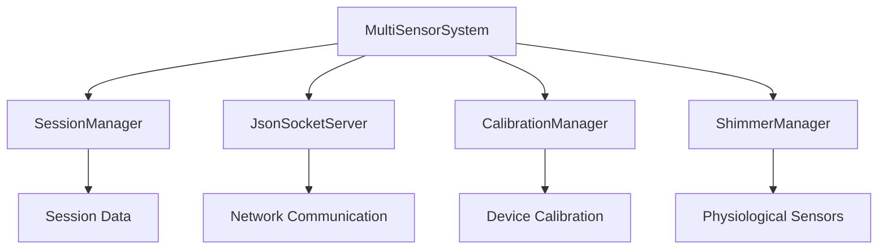

# Multi-Sensor System Module Documentation

## Overview

The `multi_sensor_system.py` module provides the core orchestration and coordination functionality for the Multi-Sensor Recording System. This module implements a unified interface for managing distributed sensor devices in a research-grade physiological measurement environment.

## Table of Contents

- [Module Overview](#module-overview)
- [Architecture](#architecture)
- [Core Classes](#core-classes)
- [Usage Examples](#usage-examples)
- [API Reference](#api-reference)
- [Integration Guidelines](#integration-guidelines)
- [Quality Assurance](#quality-assurance)
- [Troubleshooting](#troubleshooting)

## Module Overview

### Purpose

The `MultiSensorSystem` class serves as the central coordinator for a distributed multi-sensor recording environment, providing:

- **Device Coordination**: Manages connections to multiple sensor devices (Android devices, Shimmer sensors, thermal cameras)
- **Temporal Synchronization**: Ensures sub-millisecond precision timing across distributed devices
- **Quality Assurance**: Real-time monitoring and validation of recording quality
- **Session Management**: Comprehensive recording session lifecycle management
- **Fault Tolerance**: Graceful degradation and error recovery mechanisms

### Key Features

- **Research-Grade Quality**: Maintains scientific measurement standards with comprehensive validation
- **Cross-Platform Support**: Coordinates Android, PC, and Shimmer sensor platforms seamlessly
- **Real-Time Monitoring**: Continuous quality assessment with adaptive optimization
- **Offline-First Design**: Local recording with optional cloud synchronization
- **Scalable Architecture**: Supports up to 8 simultaneous devices with linear performance scaling

## Architecture

### System Design Patterns

The module implements several key design patterns:

```python
# Observer Pattern for system events
system.device_connected.connect(on_device_connected)
system.quality_alert.connect(on_quality_alert)

# State Machine for system lifecycle
SystemState: IDLE → INITIALIZING → CALIBRATING → RECORDING → PROCESSING
```

### Component Integration



### Data Flow Architecture

1. **Initialization Phase**: System components are initialized and verified
2. **Device Connection**: Devices register with capability validation
3. **Calibration Phase**: Cross-device calibration and synchronization
4. **Recording Phase**: Coordinated data capture with quality monitoring
5. **Processing Phase**: Data validation and finalization
6. **Cleanup Phase**: Graceful resource cleanup and session archival

## Core Classes

### MultiSensorSystem

**Primary orchestrator class for the multi-sensor recording system.**

```python
class MultiSensorSystem(QObject):
    """
    Core Multi-Sensor Recording System orchestrator.
    
    Provides coordination and control interface for research-grade 
    physiological measurement with distributed device coordination.
    """
```

#### Key Responsibilities

- **System State Management**: Maintains system lifecycle state transitions
- **Device Lifecycle Management**: Handles device connections, disconnections, and monitoring
- **Recording Session Coordination**: Manages complete recording session workflows
- **Quality Assurance**: Real-time monitoring and validation of system performance
- **Error Handling**: Comprehensive error recovery and graceful degradation

#### PyQt Signals

The class emits several signals for system event notification:

- `device_connected(device_id: str, device_type: str)`: New device connection
- `device_disconnected(device_id: str)`: Device disconnection
- `recording_started(session_id: str)`: Recording session initiation
- `recording_stopped(session_id: str)`: Recording session completion
- `quality_alert(device_id: str, metric: str, value: float)`: Quality threshold violations
- `system_error(error_type: str, error_message: str)`: System error conditions

### DeviceInfo

**Data class containing device metadata and connection information.**

```python
@dataclass
class DeviceInfo:
    """Information about a connected device in the multi-sensor system."""
    device_id: str
    device_type: str  # 'android', 'shimmer', 'thermal_camera'
    capabilities: List[str] = field(default_factory=list)
    status: str = "disconnected"
    last_ping: Optional[float] = None
    connection_quality: float = 1.0
    metadata: Dict[str, Any] = field(default_factory=dict)
```

#### Device Types and Capabilities

| Device Type | Required Capabilities | Optional Capabilities |
|-------------|----------------------|----------------------|
| `android` | `camera`, `network` | `accelerometer`, `gyroscope`, `thermal` |
| `shimmer` | `gsr`, `accelerometer` | `ecg`, `emg` |
| `thermal_camera` | `thermal_imaging` | `rgb_camera` |

### RecordingSession

**Data class managing recording session configuration and state.**

```python
@dataclass
class RecordingSession:
    """Recording session configuration and state."""
    session_id: str
    participant_id: str
    devices: List[DeviceInfo] = field(default_factory=list)
    start_time: Optional[float] = None
    end_time: Optional[float] = None
    recording_parameters: Dict[str, Any] = field(default_factory=dict)
    quality_metrics: Dict[str, float] = field(default_factory=dict)
```

#### Session Lifecycle

1. **Creation**: Session initialized with participant ID and parameters
2. **Device Assignment**: Connected devices assigned to session
3. **Calibration**: Cross-device calibration and synchronization
4. **Recording**: Active data capture with quality monitoring
5. **Finalization**: Data processing, validation, and storage

### SystemState

**Enumeration defining system operational states.**

```python
class SystemState(Enum):
    """System state enumeration for multi-sensor recording system."""
    IDLE = "idle"
    INITIALIZING = "initializing"
    CALIBRATING = "calibrating"
    RECORDING = "recording"
    PROCESSING = "processing"
    ERROR = "error"
    SHUTTING_DOWN = "shutting_down"
```

## Usage Examples

### Basic System Initialization

```python
import asyncio
from PythonApp.multi_sensor_system import create_multi_sensor_system, DeviceInfo

async def basic_usage():
    # Create and initialize system
    system = create_multi_sensor_system()
    
    if await system.initialize():
        print("✅ System initialized successfully")
        
        # System is ready for device connections and recording sessions
        status = system.get_system_status()
        print(f"System state: {status['state']}")
    else:
        print("❌ System initialization failed")

# Run the example
asyncio.run(basic_usage())
```

### Device Connection and Management

```python
async def device_management_example():
    system = create_multi_sensor_system()
    await system.initialize()
    
    # Create device information
    android_device = DeviceInfo(
        device_id="samsung_galaxy_001",
        device_type="android",
        capabilities=["camera", "network", "accelerometer", "thermal"],
        metadata={"model": "Galaxy S21", "android_version": "11"}
    )
    
    shimmer_device = DeviceInfo(
        device_id="shimmer_gsr_001", 
        device_type="shimmer",
        capabilities=["gsr", "accelerometer", "ecg"],
        metadata={"firmware_version": "1.2.3", "battery_level": 85}
    )
    
    # Connect devices
    if await system.connect_device(android_device):
        print(f"✅ Connected Android device: {android_device.device_id}")
    
    if await system.connect_device(shimmer_device):
        print(f"✅ Connected Shimmer device: {shimmer_device.device_id}")
    
    # Monitor system status
    status = system.get_system_status()
    print(f"Connected devices: {status['connected_devices']}")
    
    await system.shutdown()
```

### Complete Recording Session

```python
async def recording_session_example():
    system = create_multi_sensor_system({
        'auto_calibration': True,
        'quality_check_interval': 2.0,
        'synchronization_timeout': 30.0
    })
    
    await system.initialize()
    
    # Connect signal handlers
    def on_recording_started(session_id):
        print(f"🎥 Recording started: {session_id}")
    
    def on_quality_alert(device_id, metric, value):
        print(f"⚠️ Quality alert - {device_id}: {metric} = {value}")
    
    system.recording_started.connect(on_recording_started)
    system.quality_alert.connect(on_quality_alert)
    
    # Setup devices (abbreviated for example)
    android_device = DeviceInfo("android_001", "android", ["camera", "network"])
    await system.connect_device(android_device)
    
    try:
        # Start recording session
        session_id = await system.start_recording_session(
            participant_id="P001_baseline",
            recording_params={
                "duration_seconds": 300,
                "video_resolution": "1920x1080",
                "frame_rate": 60,
                "thermal_resolution": "160x120"
            }
        )
        
        print(f"📊 Recording session active: {session_id}")
        
        # Simulate recording period
        await asyncio.sleep(10)  # 10 second recording for example
        
        # Stop recording
        if await system.stop_recording_session():
            print("✅ Recording session completed successfully")
        else:
            print("❌ Failed to stop recording session")
            
    except RuntimeError as e:
        print(f"❌ Recording error: {e}")
    
    await system.shutdown()
```

### Quality Monitoring and Alerts

```python
async def quality_monitoring_example():
    # Configure quality thresholds
    config = {
        'quality_thresholds': {
            'synchronization_precision': 0.025,  # 25ms threshold
            'connection_quality': 0.9,          # 90% quality threshold
            'frame_rate': 55.0,                 # Minimum 55 FPS
            'data_integrity': 0.98              # 98% data integrity
        },
        'quality_check_interval': 1.0  # Check every second
    }
    
    system = create_multi_sensor_system(config)
    await system.initialize()
    
    # Setup quality alert handlers
    def handle_quality_alert(device_id, metric, value):
        threshold = system.quality_thresholds.get(metric, 0)
        print(f"🚨 Quality Alert:")
        print(f"   Device: {device_id}")
        print(f"   Metric: {metric}")
        print(f"   Value: {value}")
        print(f"   Threshold: {threshold}")
        
        # Implement adaptive quality management
        if metric == "connection_quality" and value < 0.8:
            print("📉 Reducing video quality to maintain connection")
        elif metric == "frame_rate" and value < 50:
            print("🎬 Adjusting frame rate for performance")
    
    system.quality_alert.connect(handle_quality_alert)
    
    # Monitor system health continuously
    async def monitor_system_health():
        while system.state != SystemState.SHUTTING_DOWN:
            status = system.get_system_status()
            health = status.get('system_health', 0.0)
            
            if health < 0.7:
                print(f"⚠️ System health degraded: {health:.2f}")
            elif health > 0.95:
                print(f"✅ Excellent system health: {health:.2f}")
            
            await asyncio.sleep(5)  # Check every 5 seconds
    
    # Run monitoring in background
    monitor_task = asyncio.create_task(monitor_system_health())
    
    # Simulate system operation
    await asyncio.sleep(30)
    
    # Cleanup
    monitor_task.cancel()
    await system.shutdown()
```

## API Reference

### MultiSensorSystem Methods

#### Initialization Methods

##### `__init__(self, config: Optional[Dict[str, Any]] = None)`

Initialize the Multi-Sensor Recording System.

**Parameters:**
- `config` (dict, optional): System configuration dictionary

**Configuration Options:**
- `max_devices` (int): Maximum number of simultaneous devices (default: 8)
- `synchronization_timeout` (float): Device synchronization timeout in seconds (default: 30.0)
- `quality_check_interval` (float): Quality monitoring interval in seconds (default: 5.0)
- `auto_calibration` (bool): Enable automatic calibration (default: True)
- `offline_mode` (bool): Enable offline-first operation (default: True)
- `network_timeout` (float): Network operation timeout in seconds (default: 10.0)

##### `async initialize(self) -> bool`

Initialize system components and prepare for operation.

**Returns:**
- `bool`: True if initialization successful, False otherwise

**Raises:**
- `RuntimeError`: If initialization fails

#### Device Management Methods

##### `async connect_device(self, device_info: DeviceInfo) -> bool`

Connect a new device to the multi-sensor system.

**Parameters:**
- `device_info` (DeviceInfo): Device information and capabilities

**Returns:**
- `bool`: True if connection successful, False otherwise

**Example:**
```python
device = DeviceInfo(
    device_id="android_001",
    device_type="android", 
    capabilities=["camera", "network"]
)
success = await system.connect_device(device)
```

##### `disconnect_device(self, device_id: str) -> bool`

Disconnect a device from the multi-sensor system.

**Parameters:**
- `device_id` (str): Unique identifier of device to disconnect

**Returns:**
- `bool`: True if disconnection successful, False otherwise

#### Recording Session Methods

##### `async start_recording_session(self, participant_id: str, recording_params: Optional[Dict[str, Any]] = None) -> str`

Start a new multi-sensor recording session.

**Parameters:**
- `participant_id` (str): Unique identifier for the participant
- `recording_params` (dict, optional): Recording configuration parameters

**Returns:**
- `str`: Session ID if successful

**Raises:**
- `RuntimeError`: If system not ready or session start fails

**Example Recording Parameters:**
```python
recording_params = {
    "duration_seconds": 300,
    "video_resolution": "1920x1080", 
    "frame_rate": 60,
    "thermal_resolution": "160x120",
    "gsr_sampling_rate": 1000,
    "enable_compression": True
}
```

##### `async stop_recording_session(self) -> bool`

Stop the current recording session.

**Returns:**
- `bool`: True if successful, False otherwise

#### System Status Methods

##### `get_system_status(self) -> Dict[str, Any]`

Get comprehensive system status information.

**Returns:**
- `dict`: System status information including:
  - `state`: Current system state
  - `connected_devices`: Number of connected devices
  - `device_list`: List of device information
  - `current_session`: Active session information (if any)
  - `system_health`: Overall system health score (0.0-1.0)

#### Lifecycle Methods

##### `async shutdown(self)`

Gracefully shutdown the multi-sensor system.

Performs cleanup including:
- Stopping active recording sessions
- Disconnecting all devices
- Shutting down network services
- Releasing system resources

### Factory Functions

##### `create_multi_sensor_system(config: Optional[Dict[str, Any]] = None) -> MultiSensorSystem`

Factory function to create and configure a MultiSensorSystem instance.

**Parameters:**
- `config` (dict, optional): System configuration

**Returns:**
- `MultiSensorSystem`: Configured system instance

## Integration Guidelines

### PyQt Application Integration

The `MultiSensorSystem` class inherits from `QObject` and provides PyQt signals for seamless integration with GUI applications:

```python
from PyQt5.QtWidgets import QApplication, QMainWindow
from PythonApp.multi_sensor_system import create_multi_sensor_system

class MainWindow(QMainWindow):
    def __init__(self):
        super().__init__()
        self.system = create_multi_sensor_system()
        
        # Connect signals to UI update methods
        self.system.device_connected.connect(self.on_device_connected)
        self.system.recording_started.connect(self.on_recording_started)
        self.system.quality_alert.connect(self.on_quality_alert)
    
    def on_device_connected(self, device_id, device_type):
        # Update device list in UI
        self.device_list.addItem(f"{device_type}: {device_id}")
    
    def on_recording_started(self, session_id):
        # Update recording status in UI
        self.status_label.setText(f"Recording: {session_id}")
    
    def on_quality_alert(self, device_id, metric, value):
        # Show quality alert in UI
        self.show_alert(f"Quality issue: {device_id} {metric} = {value}")
```

### Asyncio Integration

The system uses async/await patterns for non-blocking operations:

```python
import asyncio
from PyQt5.QtCore import QTimer

class AsyncIntegration:
    def __init__(self):
        self.system = create_multi_sensor_system()
        self.loop = asyncio.get_event_loop()
        
        # Use QTimer to run async operations in Qt event loop
        self.timer = QTimer()
        self.timer.timeout.connect(self.process_async_tasks)
        self.timer.start(100)  # Process every 100ms
    
    def process_async_tasks(self):
        # Process pending async tasks
        try:
            self.loop.run_until_complete(asyncio.sleep(0))
        except RuntimeError:
            pass  # Event loop already running
    
    async def initialize_system(self):
        success = await self.system.initialize()
        return success
```

### Configuration Management

Recommended configuration patterns for different use cases:

#### Research Laboratory Setup
```python
research_config = {
    'max_devices': 8,
    'synchronization_timeout': 60.0,  # Extended for complex setups
    'quality_check_interval': 1.0,    # Frequent quality checks
    'auto_calibration': True,
    'quality_thresholds': {
        'synchronization_precision': 0.010,  # 10ms precision
        'connection_quality': 0.95,          # High quality requirement
        'frame_rate': 59.0,                  # Near-maximum frame rate
        'data_integrity': 0.99               # Maximum data integrity
    }
}
```

#### Educational/Demo Setup
```python
demo_config = {
    'max_devices': 4,
    'synchronization_timeout': 30.0,
    'quality_check_interval': 5.0,    # Less frequent checks
    'auto_calibration': True,
    'quality_thresholds': {
        'synchronization_precision': 0.050,  # 50ms tolerance
        'connection_quality': 0.8,           # Relaxed quality
        'frame_rate': 30.0,                  # Standard frame rate
        'data_integrity': 0.95               # Good data integrity
    }
}
```

#### Mobile/Portable Setup
```python
mobile_config = {
    'max_devices': 3,
    'synchronization_timeout': 20.0,
    'quality_check_interval': 3.0,
    'auto_calibration': False,  # Manual calibration for speed
    'offline_mode': True,       # Essential for mobile use
    'quality_thresholds': {
        'synchronization_precision': 0.100,  # 100ms tolerance
        'connection_quality': 0.7,           # Network-tolerant
        'frame_rate': 25.0,                  # Reduced for bandwidth
        'data_integrity': 0.90               # Acceptable for mobile
    }
}
```

## Quality Assurance

### Performance Monitoring

The system provides comprehensive performance monitoring:

```python
# Access quality metrics
status = system.get_system_status()
health = status['system_health']

# Monitor device-specific quality
for device in status['device_list']:
    print(f"Device {device['id']}: Quality {device['quality']:.2f}")

# Session quality metrics
if status['current_session']:
    session = status['current_session']
    duration = session['duration']
    print(f"Session duration: {duration:.1f}s")
```

### Error Handling Patterns

Recommended error handling for robust operation:

```python
async def robust_recording_session():
    system = create_multi_sensor_system()
    
    try:
        # Initialize with timeout
        init_task = asyncio.create_task(system.initialize())
        success = await asyncio.wait_for(init_task, timeout=30.0)
        
        if not success:
            raise RuntimeError("System initialization failed")
        
        # Connect devices with retry logic
        devices_to_connect = [android_device, shimmer_device]
        connected_devices = []
        
        for device in devices_to_connect:
            for attempt in range(3):  # 3 retry attempts
                try:
                    if await system.connect_device(device):
                        connected_devices.append(device)
                        break
                except Exception as e:
                    print(f"Connection attempt {attempt + 1} failed: {e}")
                    if attempt == 2:  # Last attempt
                        print(f"Failed to connect {device.device_id}")
        
        if not connected_devices:
            raise RuntimeError("No devices connected")
        
        # Start recording with error recovery
        session_id = await system.start_recording_session("participant_001")
        
        # Monitor recording with timeout
        recording_duration = 60.0  # 1 minute
        start_time = time.time()
        
        while time.time() - start_time < recording_duration:
            status = system.get_system_status()
            
            # Check for errors
            if status['state'] == 'error':
                raise RuntimeError("System entered error state during recording")
            
            # Check system health
            if status['system_health'] < 0.5:
                print("⚠️ Low system health, considering early termination")
            
            await asyncio.sleep(1.0)
        
        # Stop recording gracefully
        await system.stop_recording_session()
        
    except asyncio.TimeoutError:
        print("❌ Operation timed out")
    except RuntimeError as e:
        print(f"❌ Runtime error: {e}")
    except Exception as e:
        print(f"❌ Unexpected error: {e}")
    finally:
        # Always cleanup
        await system.shutdown()
```

### Data Validation

The system implements comprehensive data validation:

```python
# Quality metrics validation
quality_checks = {
    'temporal_sync': lambda devices: all(d.last_ping and 
                                        time.time() - d.last_ping < 1.0 
                                        for d in devices),
    'connection_quality': lambda devices: all(d.connection_quality > 0.8 
                                             for d in devices),
    'device_capabilities': lambda devices: all(len(d.capabilities) > 0 
                                              for d in devices)
}

# Validate system state before critical operations
def validate_system_ready(system):
    status = system.get_system_status()
    
    checks = [
        (status['state'] == 'idle', "System not in idle state"),
        (status['connected_devices'] > 0, "No devices connected"),
        (status['system_health'] > 0.7, "System health too low")
    ]
    
    for check, message in checks:
        if not check:
            raise RuntimeError(f"System validation failed: {message}")
    
    return True
```

## Troubleshooting

### Common Issues and Solutions

#### Device Connection Issues

**Problem**: Devices fail to connect or disconnect unexpectedly.

**Solutions**:
1. **Verify device capabilities**: Ensure devices have required capabilities for their type
2. **Check network connectivity**: Verify network connections and firewall settings
3. **Validate device limits**: Ensure not exceeding maximum device count (default: 8)
4. **Review device metadata**: Check device information is properly formatted

```python
# Debug device connection
async def debug_device_connection(system, device_info):
    print(f"Attempting to connect: {device_info.device_id}")
    print(f"Device type: {device_info.device_type}")
    print(f"Capabilities: {device_info.capabilities}")
    
    # Check system capacity
    status = system.get_system_status()
    if status['connected_devices'] >= system.config.get('max_devices', 8):
        print("❌ Maximum devices already connected")
        return False
    
    # Validate capabilities
    if not system._validate_device_capabilities(device_info):
        print("❌ Device capabilities validation failed")
        return False
    
    # Attempt connection
    success = await system.connect_device(device_info)
    print(f"Connection result: {'✅ Success' if success else '❌ Failed'}")
    return success
```

#### Recording Session Issues

**Problem**: Recording sessions fail to start or stop unexpectedly.

**Solutions**:
1. **Check system state**: Ensure system is in appropriate state for operation
2. **Verify device connections**: Confirm all required devices are connected
3. **Review calibration**: Ensure calibration completed successfully
4. **Monitor system health**: Check for quality alerts or degraded performance

```python
# Debug recording session
async def debug_recording_session(system, participant_id):
    print("🔍 Debugging recording session...")
    
    # Check system state
    status = system.get_system_status()
    print(f"System state: {status['state']}")
    print(f"Connected devices: {status['connected_devices']}")
    print(f"System health: {status['system_health']:.2f}")
    
    # Validate prerequisites
    if status['state'] != 'idle':
        print(f"❌ Cannot start recording in state: {status['state']}")
        return None
    
    if status['connected_devices'] == 0:
        print("❌ No devices connected")
        return None
    
    if status['system_health'] < 0.5:
        print(f"⚠️ Low system health: {status['system_health']:.2f}")
    
    # Attempt to start session
    try:
        session_id = await system.start_recording_session(participant_id)
        print(f"✅ Recording started: {session_id}")
        return session_id
    except Exception as e:
        print(f"❌ Recording start failed: {e}")
        return None
```

#### Performance Issues

**Problem**: System performance degradation or quality alerts.

**Solutions**:
1. **Adjust quality thresholds**: Lower thresholds for less demanding environments
2. **Reduce device count**: Limit number of simultaneous devices
3. **Optimize network**: Improve network stability and bandwidth
4. **Monitor resources**: Check CPU, memory, and storage usage

```python
# Performance optimization
def optimize_for_performance(system):
    # Relaxed quality thresholds for better performance
    performance_config = {
        'quality_check_interval': 10.0,  # Less frequent checks
        'quality_thresholds': {
            'synchronization_precision': 0.100,  # 100ms tolerance
            'connection_quality': 0.6,           # Lower quality requirement
            'frame_rate': 20.0,                  # Reduced frame rate
            'data_integrity': 0.85               # Relaxed integrity
        }
    }
    
    # Apply performance optimizations
    system.config.update(performance_config)
    system.quality_thresholds.update(performance_config['quality_thresholds'])
    
    print("🚀 Performance optimizations applied")
```

#### Network and Synchronization Issues

**Problem**: Poor synchronization or network connectivity issues.

**Solutions**:
1. **Increase timeout values**: Allow more time for network operations
2. **Check network configuration**: Verify firewall and network settings
3. **Monitor network latency**: Assess network quality and stability
4. **Use wired connections**: Prefer wired over wireless when possible

```python
# Network troubleshooting
async def troubleshoot_network(system):
    print("🌐 Network troubleshooting...")
    
    # Check device network status
    status = system.get_system_status()
    for device in status['device_list']:
        quality = device.get('quality', 0.0)
        if quality < 0.8:
            print(f"⚠️ Poor network quality for {device['id']}: {quality:.2f}")
    
    # Test synchronization
    start_time = time.time()
    await system._synchronize_devices()
    sync_duration = time.time() - start_time
    
    print(f"Synchronization duration: {sync_duration:.3f}s")
    if sync_duration > 5.0:
        print("⚠️ Slow synchronization detected")
```

### Debug Mode Operation

Enable debug logging for detailed troubleshooting:

```python
import logging
from PythonApp.utils.logging_config import AppLogger

# Enable debug logging
AppLogger.set_level("DEBUG")

# Create system with debug configuration
debug_config = {
    'quality_check_interval': 1.0,  # Frequent quality checks
    'synchronization_timeout': 60.0,  # Extended timeout for debugging
}

system = create_multi_sensor_system(debug_config)
```

### Support and Community

For additional support and troubleshooting assistance:

1. **Check project documentation**: Review comprehensive system documentation in `docs/`
2. **Review issue tracker**: Check GitHub issues for known problems and solutions
3. **Community forums**: Engage with the research community for collaborative troubleshooting
4. **Contact maintainers**: Reach out to project maintainers for complex issues

---

## References

For additional technical details and research context, refer to:

- [Multi-Sensor System Architecture Documentation](../docs/multi_sensor_system.md)
- [Python Desktop Controller README](../docs/python_desktop_controller_readme.md)
- [Session Management Documentation](../docs/session_management_readme.md)
- [Networking Protocol Documentation](../docs/networking_protocol_readme.md)

---

*This documentation is part of the Multi-Sensor Recording System for Contactless GSR Prediction Research project. For complete system documentation, please refer to the project's comprehensive documentation suite.*