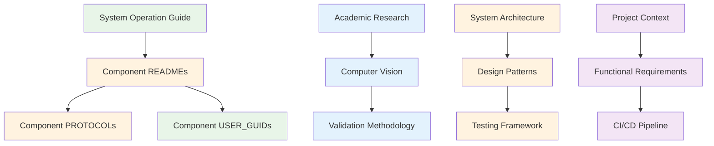

# Multi-Sensor Recording System - Comprehensive Documentation Index

## Introduction

This documentation suite provides comprehensive coverage of the Multi-Sensor Recording System, a sophisticated research platform for multi-modal physiological data collection. The documentation follows a component-first approach, organizing information into structured documents that address different user needs and technical requirements.

The system enables synchronized data collection from multiple sensor modalities including RGB cameras, thermal imaging, physiological sensors, and motion detection, providing researchers with a robust platform for contactless GSR prediction and psychophysiological studies.

## Documentation Structure

### Primary Documentation Components

The documentation is organized into comprehensive categories addressing different aspects of the system:

---

## 📚 Academic and Research Documentation

### [Academic Research](README_academic_research.md)
**Audience**: Researchers, Academics, Graduate Students  
**Purpose**: Comprehensive academic context and theoretical foundations

**Key Contents**:
- Literature review and research positioning
- Theoretical foundations (Beer-Lambert Law, signal processing theory)
- Research contributions in multi-sensor calibration
- Statistical analysis frameworks and validation methodologies
- Peer review criteria and academic validation standards

### [Project Context](README_project_context.md)
**Audience**: Project Managers, Stakeholders, Researchers  
**Purpose**: Complete project specification and strategic overview

**Key Contents**:
- Research problem definition and objectives
- Technical requirements and constraints
- Technology stack rationale and evaluation framework
- Implementation strategy and development roadmap
- Success metrics and risk management

### [Computer Vision](README_computer_vision.md)
**Audience**: Computer Vision Engineers, ML Researchers  
**Purpose**: Comprehensive computer vision pipeline for physiological monitoring

**Key Contents**:
- Optical foundations and image processing theory
- Signal processing with ROI detection algorithms
- Deep learning approaches for feature extraction
- Multi-modal feature fusion for GSR prediction
- Mobile optimization strategies and performance analysis

---

## 🏗️ System Architecture Documentation

### [System Architecture](README_system_architecture.md)
**Audience**: System Architects, Senior Developers  
**Purpose**: Complete system design and architectural patterns

**Key Contents**:
- Distributed system topology and design philosophy
- Component integration strategy and communication patterns
- Mobile and desktop architecture specifications
- Performance optimization and scalability considerations
- Security and privacy architecture

### [Design Patterns](README_design_patterns.md)
**Audience**: Software Architects, Senior Developers  
**Purpose**: Architectural design patterns analysis and implementation

**Key Contents**:
- Observer/Strategy/Command patterns implementation
- Mathematical performance models and optimization
- Scalability analysis with benchmarking results
- Memory management and resource optimization
- Pattern evolution and maintenance strategies

### [Validation Methodology](README_validation_methodology.md)
**Audience**: QA Engineers, Validation Specialists  
**Purpose**: Formal validation framework and testing methodologies

**Key Contents**:
- Component validation algebra and mathematical proofs
- Automated verification algorithms with statistical validation
- Accessibility verification (WCAG compliance)
- Continuous validation pipeline and quality assurance
- Performance validation and regression testing

---

## 🔧 Component Technical Documentation

### [Android Mobile Application](README_Android_Mobile_Application.md)
**Audience**: Android Developers, Mobile Engineers  
**Purpose**: Technical deep-dive into Android application architecture

### [Camera Recording System](README_CameraRecorder.md)
**Audience**: Computer Vision Engineers, Camera Specialists  
**Purpose**: Camera system implementation and optimization

### [Shimmer3 GSR+ Integration](README_shimmer3_gsr_plus.md)
**Audience**: Developers, System Architects  
**Purpose**: Physiological sensor integration and data processing

### [Python Desktop Controller](README_python_desktop_controller.md)
**Audience**: Python Developers, System Integrators  
**Purpose**: Desktop coordination system and data management

### [Multi-Device Synchronization](README_Multi_Device_Synchronization.md)
**Audience**: Distributed Systems Engineers  
**Purpose**: Device coordination and temporal synchronization

### [Master Clock Synchronizer](README_master_clock_synchronizer.md)
**Audience**: Developers, System Engineers  
**Purpose**: Core timing system for precise synchronization across all devices

**Extended Documentation**:
- [Advanced Configuration & Extensions](ADVANCED_master_clock_synchronizer.md) - Multi-environment deployment, custom device integration, security patterns
- [Performance Benchmarking Guide](BENCHMARKING_master_clock_synchronizer.md) - Comprehensive performance analysis, optimization strategies, real-world benchmarks
- [Troubleshooting & Diagnostics](TROUBLESHOOTING_master_clock_synchronizer.md) - Issue resolution, diagnostic tools, recovery procedures

**Key Contents**:
- High-precision timing algorithms implementation
- Clock drift compensation and detection mechanisms
- NTP integration architecture and network time synchronization
- Synchronization quality monitoring with real-time metrics
- PC master clock authority and device coordination protocols

### [Networking Protocol](README_networking_protocol.md)
**Audience**: Network Engineers, Protocol Developers  
**Purpose**: Communication protocol design and implementation

### [Session Management](README_session_management.md)
**Audience**: Developers, Data Engineers  
**Purpose**: Session lifecycle and data organization

### [Unified UI Architecture](UNIFIED_UI_ARCHITECTURE.md) 🆕
**Audience**: UI/UX Developers, Frontend Engineers, System Architects  
**Purpose**: Comprehensive UI architecture covering PC, Web, and Android platforms

**Key Features**:
- Unified cross-platform design principles and patterns
- Platform-specific implementation details for Android, Python Desktop, and Web
- State management and synchronization across all platforms
- Cross-platform communication protocols and integration patterns
- Performance optimization and security considerations
- Comprehensive testing strategies and troubleshooting guides

### [UI Architecture (Android-focused)](README_ui_architecture.md)
**Audience**: Android Developers  
**Purpose**: Detailed Android-specific UI architecture and patterns

### [Testing and QA Framework](README_testing_qa_framework.md)
**Audience**: QA Engineers, Test Automation Specialists  
**Purpose**: Comprehensive testing methodology and automation

### [Thermal Camera Integration](README_topdon_tc001.md)
**Audience**: Hardware Integration Engineers  
**Purpose**: Thermal imaging system integration and calibration

---

## 📋 Protocol and Data Contract Documentation

### [System API Reference](PROTOCOL_system_api_reference.md)
**Audience**: Developers, API Consumers  
**Purpose**: Complete API documentation for all system components

### [Data Models and File Organization](PROTOCOL_data_models_and_file_organization.md)
**Audience**: Data Engineers, System Administrators  
**Purpose**: Data storage architecture and file naming standards

### [Functional Requirements Specification](PROTOCOL_functional_requirements_specification.md)
**Audience**: Requirements Engineers, Stakeholders  
**Purpose**: Complete functional and non-functional requirements

### [CI/CD Pipeline Enhancement](PROTOCOL_cicd_pipeline_enhancement.md)
**Audience**: DevOps Engineers, CI/CD Specialists  
**Purpose**: Automated deployment and quality assurance pipeline

### Component-Specific Protocols

#### Device Integration Protocols
- [Android Mobile Application Protocol](PROTOCOL_Android_Mobile_Application.md)
- [Camera Recording Protocol](PROTOCOL_CameraRecorder.md)
- [Shimmer3 GSR+ Protocol](PROTOCOL_shimmer3_gsr_plus.md)
- [Python Desktop Controller Protocol](PROTOCOL_python_desktop_controller.md)
- [Thermal Camera Protocol](PROTOCOL_topdon_tc001.md)

#### System Protocols
- [Multi-Device Synchronization Protocol](PROTOCOL_Multi_Device_Synchronization.md)
- [Master Clock Synchronizer Protocol](PROTOCOL_master_clock_synchronizer.md)
- [Networking Protocol Specification](PROTOCOL_networking_protocol.md)
- [Session Management Protocol](PROTOCOL_session_management.md)
- [UI State Management Protocol](PROTOCOL_ui_state_management.md)
- [Testing Framework Protocol](PROTOCOL_testing_qa_framework.md)

---

## 👥 User Guide Documentation

### [System Operation Guide](USER_GUIDE_system_operation.md)
**Audience**: Researchers, End-Users, Operators  
**Purpose**: Comprehensive system operation and usage guide

**Key Contents**:
- Quick start guide and system setup
- Device management and configuration
- Recording session management
- Camera calibration procedures
- Data management and export options
- Troubleshooting and advanced features

### Component-Specific User Guides
- [Android Mobile Application Guide](USER_GUIDE_Android_Mobile_Application.md)
- [Camera Recording Guide](USER_GUIDE_CameraRecorder.md)
- [Shimmer3 GSR+ Guide](USER_GUIDE_shimmer3_gsr_plus.md)
- [Python Desktop Controller Guide](USER_GUIDE_python_desktop_controller.md)
- [Multi-Device Synchronization Guide](USER_GUIDE_Multi_Device_Synchronization.md)
- [Master Clock Synchronizer Guide](USER_GUIDE_master_clock_synchronizer.md)
- [Networking Protocol Guide](USER_GUIDE_networking_protocol.md)
- [Session Management Guide](USER_GUIDE_session_management.md)
- [UI Navigation Guide](USER_GUIDE_ui_navigation.md)
- [Testing Framework Guide](USER_GUIDE_testing_qa_framework.md)
- [Thermal Camera Guide](USER_GUIDE_topdon_tc001.md)

---

## 🧪 Testing and Validation Documentation

### [Testing Framework Index](TESTING_FRAMEWORK_INDEX.md)
**Audience**: QA Engineers, Developers  
**Purpose**: Complete testing strategy and framework overview

### Schema Definitions
- [Session Metadata Schema](session_metadata_schema.json)
- [Session Log Schema](session_log_schema.json)
- [Calibration Session Schema](calibration_session_schema.json)

### Quick Reference Guides
---

## 📍 Navigation Guide

### For New Users

**🚀 Getting Started**:
1. Start with [System Operation Guide](USER_GUIDE_system_operation.md) for complete setup and usage
2. Review [Project Context](README_project_context.md) to understand system capabilities
3. Follow [Quick Start Guide](USER_GUIDE_system_operation.md#quick-start-guide) for immediate setup

### For Researchers

**📊 Research Focus**:
1. [Academic Research](README_academic_research.md) - Literature review and theoretical foundations
2. [Validation Methodology](README_validation_methodology.md) - Statistical validation and quality assurance
3. [Computer Vision](README_computer_vision.md) - Physiological monitoring techniques

### For Developers

**⚙️ Technical Implementation**:
1. [System Architecture](README_system_architecture.md) - Overall system design
2. [System API Reference](PROTOCOL_system_api_reference.md) - Complete API documentation
3. Component-specific README files for detailed implementation

### For System Administrators

**🔧 Operations and Maintenance**:
1. [Data Models and File Organization](PROTOCOL_data_models_and_file_organization.md) - Data management
2. [CI/CD Pipeline Enhancement](PROTOCOL_cicd_pipeline_enhancement.md) - Deployment and automation
3. [Functional Requirements](PROTOCOL_functional_requirements_specification.md) - System requirements

---

## 🎯 Quick Start Recommendations

| User Role | Recommended Starting Point | Next Steps |
|-----------|---------------------------|------------|
| **Researcher** | [System Operation Guide](USER_GUIDE_system_operation.md) | → [Academic Research](README_academic_research.md) |
| **Android Developer** | [Android App README](README_Android_Mobile_Application.md) | → [Android App Protocol](PROTOCOL_Android_Mobile_Application.md) |
| **Python Developer** | [Desktop Controller README](README_python_desktop_controller.md) | → [System API Reference](PROTOCOL_system_api_reference.md) |
| **Computer Vision Engineer** | [Computer Vision README](README_computer_vision.md) | → [Camera Recording](README_CameraRecorder.md) |
| **System Architect** | [System Architecture](README_system_architecture.md) | → [Design Patterns](README_design_patterns.md) |
| **QA Engineer** | [Testing Framework](README_testing_qa_framework.md) | → [Validation Methodology](README_validation_methodology.md) |

---

## 🔍 Document Relationships

---

## 📝 Version Information

- **Documentation Version**: 2.0.0
- **Last Updated**: January 2025
- **System Version**: Multi-Sensor Recording System v1.0
- **Compatible Platforms**: Windows, macOS, Linux, Android API 24+

---

## 🤝 Support and Contributing

### Getting Help
1. Check component-specific troubleshooting sections
2. Review [System Operation Guide troubleshooting](USER_GUIDE_system_operation.md#troubleshooting)
3. Consult [Testing Framework](README_testing_qa_framework.md) for validation procedures

### Contributing
Documentation improvements are welcome:
- Error corrections and technical accuracy
- Usage examples and practical guides  
- Integration scenarios and best practices
- Performance optimizations and tips

This comprehensive documentation suite provides complete coverage of the Multi-Sensor Recording System, enabling successful implementation and operation across diverse research and development scenarios.