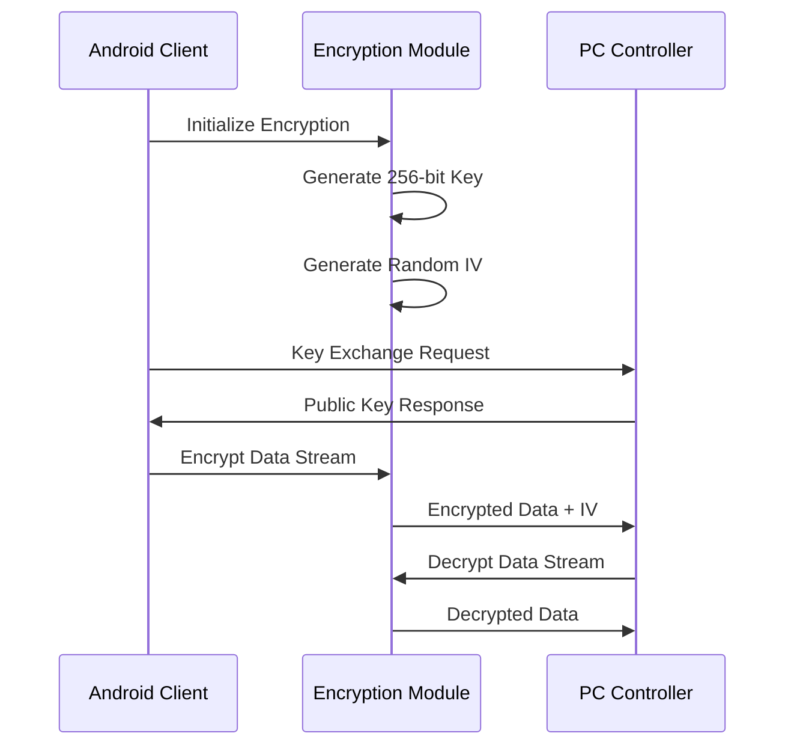

# Protocol Documentation: Android Mobile Data Collection Node

## Table of Contents

- [Communication Protocols](#communication-protocols)
  - [1. Network Communication Protocol](#1-network-communication-protocol)
  - [2. Command Messages](#2-command-messages)
  - [3. Status Messages](#3-status-messages)

## Communication Protocols

### 1. Network Communication Protocol

#### 1.1 Socket-based Communication

The Android mobile application communicates with the PC controller using TCP socket connections with JSON message protocol.

**Connection Parameters:**
- **Protocol**: TCP/IP
- **Default Port**: 8080 (configurable)
- **Message Format**: JSON
- **Encoding**: UTF-8
- **Timeout**: 30 seconds
- **Keep-Alive**: Enabled

#### 1.2 Message Structure

All messages follow a standardized JSON format:

```json
{
  "type": "command|response|status|data|error",
  "timestamp": 1640995200000,
  "session_id": "session_20220101_120000",
  "device_id": "android_device_01",
  "sequence_number": 12345,
  "payload": {
    // Message-specific data
  }
}
```

**Field Descriptions:**

| Field | Type | Required | Description |
|-------|------|----------|-------------|
| `type` | String | Yes | Message type classification |
| `timestamp` | Long | Yes | Unix timestamp in milliseconds |
| `session_id` | String | No | Current recording session identifier |
| `device_id` | String | Yes | Unique Android device identifier |
| `sequence_number` | Integer | Yes | Message sequence for ordering |
| `payload` | Object | No | Message-specific data content |

---

### 2. Command Messages

#### 2.1 Connection Commands

**CONNECT - Establish Communication**
```json
{
  "type": "command",
  "timestamp": 1640995200000,
  "device_id": "android_device_01",
  "sequence_number": 1,
  "payload": {
    "command": "CONNECT",
    "app_version": "1.0.0",
    "device_info": {
      "model": "Samsung S22",
      "android_version": "13",
      "capabilities": ["camera", "thermal", "shimmer"]
    }
  }
}
```

**DISCONNECT - Terminate Communication**
```json
{
  "type": "command",
  "timestamp": 1640995200000,
  "device_id": "android_device_01",
  "sequence_number": 999,
  "payload": {
    "command": "DISCONNECT",
    "reason": "user_initiated"
  }
}
```

#### 2.2 Synchronization Commands

**SYNC_CLOCK - Time Synchronization**
```json
{
  "type": "command",
  "timestamp": 1640995200000,
  "device_id": "android_device_01",
  "sequence_number": 2,
  "payload": {
    "command": "SYNC_CLOCK",
    "local_timestamp": 1640995200000,
    "sync_request_id": "sync_001"
  }
}
```

**SYNC_RESPONSE - Clock Synchronization Response**
```json
{
  "type": "response",
  "timestamp": 1640995200050,
  "device_id": "android_device_01",
  "sequence_number": 3,
  "payload": {
    "command": "SYNC_CLOCK",
    "sync_request_id": "sync_001",
    "pc_timestamp": 1640995200025,
    "android_timestamp": 1640995200050,
    "round_trip_time": 50
  }
}
```

#### 2.3 Recording Commands

**START_RECORDING - Begin Recording Session**
```json
{
  "type": "command",
  "timestamp": 1640995200000,
  "device_id": "android_device_01",
  "sequence_number": 10,
  "payload": {
    "command": "START_RECORDING",
    "session_id": "session_20220101_120000",
    "parameters": {
      "duration_seconds": 300,
      "video_resolution": "4K",
      "frame_rate": 30,
      "thermal_enabled": true,
      "shimmer_enabled": true,
      "preview_streaming": true
    }
  }
}
```

**STOP_RECORDING - End Recording Session**
```json
{
  "type": "command",
  "timestamp": 1640995500000,
  "device_id": "android_device_01",
  "sequence_number": 50,
  "payload": {
    "command": "STOP_RECORDING",
    "session_id": "session_20220101_120000",
    "immediate": false
  }
}
```

#### 2.4 Control Commands

**GET_STATUS - Request Device Status**
```json
{
  "type": "command",
  "timestamp": 1640995200000,
  "device_id": "android_device_01",
  "sequence_number": 5,
  "payload": {
    "command": "GET_STATUS",
    "details": ["sensors", "storage", "network"]
  }
}
```

**START_PREVIEW - Enable Preview Streaming**
```json
{
  "type": "command",
  "timestamp": 1640995200000,
  "device_id": "android_device_01",
  "sequence_number": 8,
  "payload": {
    "command": "START_PREVIEW",
    "stream_port": 8081,
    "quality": "medium",
    "frame_rate": 15
  }
}
```

**STOP_PREVIEW - Disable Preview Streaming**
```json
{
  "type": "command",
  "timestamp": 1640995200000,
  "device_id": "android_device_01",
  "sequence_number": 9,
  "payload": {
    "command": "STOP_PREVIEW"
  }
}
```

---

### 3. Status Messages

#### 3.1 Device Status Reports

**DEVICE_STATUS - Sensor Connection Status**
```json
{
  "type": "status",
  "timestamp": 1640995200000,
  "device_id": "android_device_01",
  "sequence_number": 20,
  "payload": {
    "status_type": "DEVICE_STATUS",
    "sensors": {
      "camera": {
        "connected": true,
        "resolution": "4K",
        "frame_rate": 30,
        "focus_mode": "auto",
        "exposure_mode": "auto"
      },
      "thermal": {
        "connected": true,
        "model": "Topdon TC001",
        "temperature_range": [-20, 400],
        "emissivity": 0.95,
        "calibration_status": "valid"
      },
      "shimmer": {
        "connected": true,
        "device_id": "shimmer_001",
        "sampling_rate": 128,
        "sensors_enabled": ["GSR", "Internal ADC"],
        "battery_level": 85,
        "signal_quality": "good"
      }
    },
    "storage": {
      "total_space_gb": 128,
      "available_space_gb": 45,
      "sessions_count": 12
    },
    "network": {
      "wifi_connected": true,
      "signal_strength": -45,
      "bandwidth_mbps": 150,
      "latency_ms": 12
    }
  }
}
```

#### 3.2 Recording Status Reports

**RECORDING_STATUS - Active Recording Information**
```json
{
  "type": "status",
  "timestamp": 1640995200000,
  "session_id": "session_20220101_120000",
  "device_id": "android_device_01",
  "sequence_number": 25,
  "payload": {
    "status_type": "RECORDING_STATUS",
    "session_info": {
      "session_id": "session_20220101_120000",
      "start_time": 1640995200000,
      "duration_seconds": 120,
      "status": "recording"
    },
    "recording_stats": {
      "video_frames_captured": 3600,
      "thermal_frames_captured": 1200,
      "gsr_samples_captured": 15360,
      "dropped_frames": 2,
      "data_rate_mbps": 12.5,
      "storage_used_mb": 1500
    },
    "performance": {
      "cpu_usage_percent": 45,
      "memory_usage_mb": 512,
      "battery_level": 78,
      "temperature_celsius": 35
    }
  }
}
```

#### 3.3 Error Status Reports

**ERROR_STATUS - Error Conditions**
```json
{
  "type": "error",
  "timestamp": 1640995200000,
  "device_id": "android_device_01",
  "sequence_number": 30,
  "payload": {
    "error_type": "SENSOR_ERROR",
    "error_code": "THERMAL_DISCONNECTED",
    "message": "Thermal camera disconnected during recording",
    "severity": "warning",
    "affected_sensors": ["thermal"],
    "recovery_action": "attempting_reconnection",
    "session_impact": "thermal_data_gap"
  }
}
```

---

### 4. Data Messages

#### 4.1 Sensor Data Streams

**SENSOR_DATA - Real-time Sensor Measurements**
```json
{
  "type": "data",
  "timestamp": 1640995200000,
  "session_id": "session_20220101_120000",
  "device_id": "android_device_01",
  "sequence_number": 100,
  "payload": {
    "data_type": "SENSOR_DATA",
    "timestamp": 1640995200000,
    "sensors": {
      "shimmer": {
        "timestamp": 1640995200000,
        "gsr_resistance": 125.5,
        "internal_adc": [512, 523, 511],
        "battery_voltage": 3.7,
        "signal_quality": 0.95
      },
      "thermal": {
        "timestamp": 1640995200000,
        "center_temperature": 36.5,
        "min_temperature": 22.1,
        "max_temperature": 37.2,
        "average_temperature": 28.7
      }
    }
  }
}
```

#### 4.2 Preview Data

**PREVIEW_FRAME - Video Preview Information**
```json
{
  "type": "data",
  "timestamp": 1640995200000,
  "device_id": "android_device_01",
  "sequence_number": 150,
  "payload": {
    "data_type": "PREVIEW_FRAME",
    "frame_number": 3600,
    "timestamp": 1640995200000,
    "resolution": {
      "width": 1920,
      "height": 1080
    },
    "encoding": "JPEG",
    "quality": 75,
    "frame_size_bytes": 125000
  }
}
```

---

### 5. Data Formats and Schemas

#### 5.1 Session Metadata Schema

**metadata.json - Session Information**
```json
{
  "session_info": {
    "session_id": "session_20220101_120000",
    "start_time": "2022-01-01T12:00:00.000Z",
    "end_time": "2022-01-01T12:05:00.000Z",
    "duration_seconds": 300,
    "participant_id": "P001",
    "experiment_id": "EXP_2022_001",
    "researcher": "Dr. Smith"
  },
  "device_info": {
    "device_id": "android_device_01",
    "model": "Samsung S22",
    "android_version": "13",
    "app_version": "1.0.0",
    "build_number": "1001"
  },
  "recording_parameters": {
    "video": {
      "resolution": "4K",
      "frame_rate": 30,
      "codec": "H.264",
      "bitrate_mbps": 20
    },
    "thermal": {
      "enabled": true,
      "model": "Topdon TC001",
      "temperature_range": [-20, 400],
      "emissivity": 0.95
    },
    "shimmer": {
      "enabled": true,
      "device_id": "shimmer_001",
      "sampling_rate": 128,
      "sensors": ["GSR", "Internal ADC"]
    }
  },
  "calibration_data": {
    "camera": {
      "calibration_date": "2022-01-01T10:00:00.000Z",
      "intrinsic_matrix": [[1000, 0, 960], [0, 1000, 540], [0, 0, 1]],
      "distortion_coefficients": [0.1, -0.2, 0.0, 0.0, 0.0],
      "rms_error": 0.45
    },
    "stereo": {
      "calibration_date": "2022-01-01T10:30:00.000Z",
      "rotation_matrix": [[0.99, -0.01, 0.02], [0.01, 0.99, -0.01], [-0.02, 0.01, 0.99]],
      "translation_vector": [-50.5, 2.1, 10.3],
      "rms_error": 0.82
    }
  },
  "sync_data": {
    "clock_sync_accuracy_ms": 2.5,
    "pc_master_clock": true,
    "sync_timestamps": [
      {
        "sync_time": "2022-01-01T12:00:00.000Z",
        "pc_timestamp": 1640995200000,
        "android_timestamp": 1640995200003,
        "offset_ms": 3
      }
    ]
  },
  "quality_metrics": {
    "video": {
      "total_frames": 9000,
      "dropped_frames": 5,
      "average_bitrate_mbps": 19.8,
      "quality_score": 0.98
    },
    "thermal": {
      "total_frames": 3000,
      "temperature_stability": 0.95,
      "calibration_drift": 0.2
    },
    "shimmer": {
      "total_samples": 38400,
      "dropped_samples": 12,
      "signal_quality_average": 0.93,
      "connection_stability": 0.99
    },
    "network": {
      "average_latency_ms": 15,
      "packet_loss_percent": 0.1,
      "bandwidth_utilization_percent": 45
    }
  }
}
```

#### 5.2 Camera Data Formats

**camera_params.json - Camera Configuration**
```json
{
  "capture_settings": {
    "resolution": {
      "width": 3840,
      "height": 2160
    },
    "frame_rate": 30,
    "codec": "H.264",
    "bitrate": 20000000,
    "keyframe_interval": 2
  },
  "camera_parameters": {
    "iso": 100,
    "exposure_time_ns": 33333333,
    "focus_distance": 0.0,
    "aperture": 1.8,
    "focal_length_mm": 26
  },
  "white_balance": {
    "mode": "auto",
    "color_temperature": 5500,
    "tint": 0
  },
  "image_processing": {
    "noise_reduction": "fast",
    "edge_enhancement": "off",
    "color_correction": "transform_matrix"
  }
}
```

#### 5.3 Thermal Data Formats

**thermal_metadata.json - Thermal Camera Configuration**
```json
{
  "device_info": {
    "model": "Topdon TC001",
    "serial_number": "TC001123456",
    "firmware_version": "1.3.7",
    "calibration_date": "2022-01-01"
  },
  "capture_settings": {
    "resolution": {
      "width": 256,
      "height": 192
    },
    "frame_rate": 10,
    "temperature_range": {
      "min_celsius": -20,
      "max_celsius": 400
    },
    "emissivity": 0.95,
    "distance_meters": 1.0
  },
  "calibration_data": {
    "reference_temperature": 25.0,
    "calibration_matrix": "4x4_matrix_data",
    "nonlinearity_correction": "polynomial_coefficients"
  },
  "color_palette": {
    "name": "iron",
    "range_mapping": "linear",
    "brightness": 50,
    "contrast": 50
  }
}
```

**thermal_data.bin - Binary Thermal Data Format**
```
Binary Format Structure:
- Header (64 bytes):
  - Magic number (4 bytes): 0x54484D4C ("THML")
  - Version (4 bytes): Format version number
  - Frame count (4 bytes): Total number of frames
  - Width (4 bytes): Image width in pixels
  - Height (4 bytes): Image height in pixels
  - Data type (4 bytes): Temperature data type
  - Reserved (40 bytes): Future use

- Frame Data (repeated for each frame):
  - Timestamp (8 bytes): Unix timestamp in microseconds
  - Frame number (4 bytes): Sequential frame number
  - Temperature data (width × height × 4 bytes): Float32 temperatures in Celsius
  - Checksum (4 bytes): CRC32 of frame data
```

#### 5.4 Shimmer Data Formats

**shimmer_config.json - Shimmer Sensor Configuration**
```json
{
  "device_info": {
    "device_id": "shimmer_001",
    "device_name": "Shimmer3 GSR+",
    "serial_number": "SH001123456",
    "firmware_version": "3.2.1",
    "battery_type": "lithium"
  },
  "sampling_configuration": {
    "sampling_rate_hz": 128,
    "buffer_size": 1000,
    "sensors_enabled": ["GSR", "Internal ADC", "Battery Voltage"],
    "timestamp_source": "shimmer_clock"
  },
  "sensor_settings": {
    "gsr": {
      "range": "auto",
      "calibration_parameters": {
        "offset": 0.0,
        "vRef": 3.0,
        "gain": 1.0
      }
    },
    "internal_adc": {
      "channels": [0, 1, 2],
      "range": "2.5V",
      "resolution": "12bit"
    }
  },
  "bluetooth_settings": {
    "connection_interval_ms": 7.5,
    "transmission_power": "0dBm",
    "packet_size": 20
  }
}
```

**gsr_data.csv - GSR Measurement Data**
```csv
timestamp_unix_ms,timestamp_shimmer,gsr_resistance_kohm,internal_adc_0,internal_adc_1,internal_adc_2,battery_voltage,signal_quality
1640995200000,0,125.5,512,523,511,3.7,0.95
1640995200008,1,126.1,515,521,509,3.7,0.94
1640995200016,2,125.9,513,522,510,3.7,0.96
...
```

---

### 6. Enhanced State Persistence and Recovery Protocols

#### 6.1 JSON-based State Persistence

All controllers implement standardized JSON-based state persistence using Android SharedPreferences:

**State Persistence Structure:**
```json
{
  "controller_name": {
    "state_version": "1.0",
    "last_updated": 1640995200000,
    "state_data": {
      // Controller-specific state data
    },
    "recovery_info": {
      "session_id": "session_20220101_120000",
      "recovery_attempts": 0,
      "last_recovery_timestamp": 1640995200000
    }
  }
}
```

#### 6.2 CalibrationController State Protocol

**Calibration Session State:**
```json
{
  "calibration_session": {
    "isSessionActive": true,
    "sessionId": "cal_session_20220101_120000",
    "currentPattern": "STEREO_CHECKERBOARD",
    "completedPoints": 8,
    "totalPoints": 15,
    "startTimestamp": 1640995200000,
    "lastUpdateTimestamp": 1640995205000,
    "pattern_data": {
      "pattern_size": [9, 6],
      "square_size_mm": 25.0,
      "detection_parameters": {
        "adaptive_threshold": true,
        "corner_refinement": "CORNER_REFINE_RT"
      }
    },
    "captured_images": [
      {
        "image_id": "cal_img_001",
        "timestamp": 1640995201000,
        "corners_detected": 54,
        "reprojection_error": 0.34
      }
    ]
  }
}
```

#### 6.3 NetworkController Encryption Protocol

**AES-256 Encryption Configuration:**
```json
{
  "encryption_config": {
    "algorithm": "AES-256-CBC",
    "key_length": 256,
    "iv_length": 16,
    "key_derivation": "PBKDF2",
    "iterations": 10000,
    "salt_length": 32
  }
}
```

**Encrypted Message Structure:**
```json
{
  "type": "encrypted_data",
  "timestamp": 1640995200000,
  "encryption": {
    "algorithm": "AES-256-CBC",
    "iv": "base64_encoded_initialization_vector",
    "salt": "base64_encoded_salt",
    "key_id": "encryption_key_identifier"
  },
  "payload": "base64_encoded_encrypted_data"
}
```

#### 6.4 Machine Learning Bandwidth Prediction

**Bandwidth Prediction Model Data:**
```json
{
  "ml_bandwidth_model": {
    "model_type": "linear_regression",
    "last_trained": 1640995200000,
    "training_samples": 1000,
    "accuracy_score": 0.87,
    "features": [
      "signal_strength_dbm",
      "network_type",
      "time_of_day",
      "data_usage_mb",
      "connected_devices"
    ],
    "coefficients": [0.45, -0.23, 0.12, -0.08, 0.34],
    "intercept": 15.6,
    "prediction_confidence": 0.92
  }
}
```

**Real-time Signal Strength Data:**
```json
{
  "signal_monitoring": {
    "wifi": {
      "ssid": "network_name",
      "rssi_dbm": -45,
      "frequency_mhz": 5180,
      "link_speed_mbps": 866,
      "signal_quality": "excellent"
    },
    "cellular": {
      "network_operator": "carrier_name",
      "signal_strength_dbm": -78,
      "network_type": "5G",
      "signal_quality": "good",
      "data_usage_mb": 124.5
    }
  }
}
```

#### 6.5 Device Management Protocol

**Device Prioritization Configuration:**
```json
{
  "device_priority_config": {
    "prioritization_rules": [
      {
        "rule_id": "thermal_priority",
        "device_type": "thermal_camera",
        "priority_weight": 0.9,
        "criteria": ["temperature_accuracy", "frame_rate", "usb_speed"]
      },
      {
        "rule_id": "shimmer_priority", 
        "device_type": "shimmer_sensor",
        "priority_weight": 0.8,
        "criteria": ["battery_level", "signal_strength", "data_quality"]
      }
    ],
    "hot_swap_config": {
      "detection_interval_ms": 1000,
      "grace_period_ms": 5000,
      "auto_reconnect": true,
      "fallback_device_id": "backup_device_001"
    }
  }
}
```

#### 6.6 UI State and Theme Management

**UI Controller State Protocol:**
```json
{
  "ui_state": {
    "theme_config": {
      "current_theme": "DARK",
      "auto_theme_enabled": true,
      "theme_switch_time": "sunset",
      "custom_colors": {
        "primary": "#2196F3",
        "secondary": "#FF9800",
        "accent": "#4CAF50"
      }
    },
    "accessibility_config": {
      "increased_touch_targets": true,
      "high_contrast_mode": false,
      "audio_feedback": true,
      "haptic_feedback": true,
      "font_scale": 1.2
    },
    "menu_state": {
      "dynamic_items": [
        {
          "item_id": "advanced_settings",
          "enabled": true,
          "visibility": "visible",
          "position": 3
        }
      ],
      "context_menu_config": {
        "trigger_type": "long_press",
        "show_icons": true,
        "max_items": 8
      }
    }
  }
}
```

---

### 7. Error Handling and Recovery

#### 7.1 Error Code Classifications

**Connection Errors (1000-1099)**
- 1001: Network connection lost
- 1002: PC controller unreachable
- 1003: Authentication failed
- 1004: Protocol version mismatch

**Sensor Errors (1100-1199)**
- 1101: Camera initialization failed
- 1102: Thermal camera disconnected
- 1103: Shimmer sensor connection lost
- 1104: Sensor calibration invalid

**Recording Errors (1200-1299)**
- 1201: Insufficient storage space
- 1202: Recording initialization failed
- 1203: Data corruption detected
- 1204: Session synchronization lost

**System Errors (1300-1399)**
- 1301: Low battery warning
- 1302: High temperature warning
- 1303: Memory allocation failed
- 1304: Permission denied

#### 7.2 Recovery Protocols

**Automatic Recovery Actions:**
- Network reconnection with exponential backoff
- Sensor reinitialization on disconnection
- Data buffering during temporary failures
- Graceful degradation of non-critical features

**Manual Recovery Procedures:**
- User notification of critical errors
- Guided troubleshooting steps
- Safe session termination options
- Data salvage operations

---

### 8. Security and Privacy

#### 8.1 Enhanced Data Protection

**AES-256 Encryption Implementation:**
- **Algorithm**: AES-256-CBC with PBKDF2 key derivation
- **Key Management**: Secure key generation with 256-bit entropy
- **Initialization Vectors**: Cryptographically secure random IV generation
- **Key Exchange**: Diffie-Hellman key exchange with PC controller
- **Performance**: Hardware-accelerated encryption when available

**Encryption Workflow:**


**Advanced Security Features:**
- **Perfect Forward Secrecy**: Session keys never reused
- **Authentication**: HMAC-SHA256 message authentication
- **Integrity Verification**: CRC32 checksums for data validation
- **Secure Storage**: Android Keystore integration for key protection

#### 8.2 Network Security Enhancements

**Signal Strength-based Security:**
- **Adaptive Security Levels**: Encryption strength based on signal quality
- **Network Quality Assessment**: Real-time evaluation of connection security
- **Automatic Fallback**: Degraded functionality on unsecure networks
- **Connection Validation**: Continuous monitoring of network integrity

**ML-Enhanced Security:**
- **Anomaly Detection**: Machine learning models detect unusual network patterns
- **Bandwidth Protection**: Predictive models prevent data overflow attacks
- **Quality Assurance**: AI-driven validation of encryption effectiveness
- **Adaptive Algorithms**: Self-tuning security parameters based on usage patterns

#### 8.3 Privacy Compliance

**Data Minimization:**
- Collect only necessary sensor data
- Configurable data retention policies
- Automatic cleanup of temporary files
- User consent for data collection

**Anonymization:**
- Remove personally identifiable information
- Generate anonymous session identifiers
- Configurable metadata collection
- Export controls for sensitive data

---

This protocol documentation provides comprehensive technical specifications for all communication and data formats used by the Android Mobile Data Collection Node. It ensures standardized, reliable, and secure data collection and transmission within the distributed multi-sensor recording system.