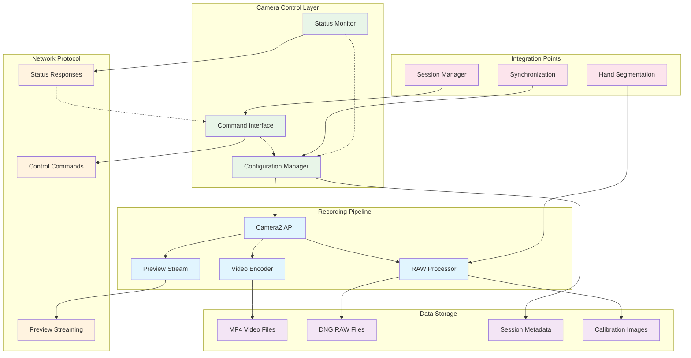

# Camera Recording System - Protocol and Data Contract

## Overview

This document defines the data contracts, APIs, and communication protocols used by the Camera Recording System (CameraRecorder). It serves as the definitive reference for developers integrating with the camera system and for understanding the data structures and interfaces provided.

## Table of Contents

- [Core Data Structures](#core-data-structures)
- [API Interfaces](#api-interfaces)
- [Configuration Parameters](#configuration-parameters)
- [Output File Formats](#output-file-formats)
- [Network Protocol](#network-protocol)
- [Error Handling](#error-handling)
- [Integration APIs](#integration-apis)
- [Samsung S21/S22 Protocol Extensions](#samsung-s21s22-protocol-extensions)

## Core Data Structures

### SessionInfo

Primary data container for camera recording sessions.

```kotlin
data class SessionInfo(
    val sessionId: String,
    val videoEnabled: Boolean,
    val rawEnabled: Boolean,
    val startTime: Long,
    var endTime: Long? = null,
    var videoFilePath: String? = null,
    var rawFilePaths: MutableList<String> = mutableListOf(),
    val cameraId: String? = null,
    val videoResolution: String? = null,
    val rawResolution: String? = null,
    var errors: MutableList<String> = mutableListOf(),
    var completed: Boolean = false
)
```

#### Field Specifications

| Field Name | Data Type | Required | Description |
|------------|-----------|----------|-------------|
| `sessionId` | String | Yes | Unique identifier in format "Session_[timestamp]" |
| `videoEnabled` | Boolean | Yes | True if 4K video recording is enabled |
| `rawEnabled` | Boolean | Yes | True if RAW image capture is enabled |
| `startTime` | Long | Yes | Unix timestamp (milliseconds) of session start |
| `endTime` | Long? | No | Unix timestamp (milliseconds) of session end |
| `videoFilePath` | String? | No | Absolute path to MP4 video file |
| `rawFilePaths` | MutableList\<String> | No | List of absolute paths to DNG files |
| `cameraId` | String? | No | Camera identifier (e.g., "0" for back camera) |
| `videoResolution` | String? | No | Video resolution in format "widthxheight" |
| `rawResolution` | String? | No | RAW resolution in format "widthxheight" |
| `errors` | MutableList\<String> | No | List of error messages encountered |
| `completed` | Boolean | No | True when session is successfully completed |

#### JSON Serialization Example

```json
{
  "sessionId": "Session_1709123456789",
  "videoEnabled": true,
  "rawEnabled": true,
  "startTime": 1709123456789,
  "endTime": 1709123556789,
  "videoFilePath": "/storage/emulated/0/Android/data/com.multisensor.recording/files/Movies/Session_1709123456789.mp4",
  "rawFilePaths": [
    "/storage/emulated/0/Android/data/com.multisensor.recording/files/Pictures/Session_1709123456789_RAW_1.dng",
    "/storage/emulated/0/Android/data/com.multisensor.recording/files/Pictures/Session_1709123456789_RAW_2.dng"
  ],
  "cameraId": "0",
  "videoResolution": "3840x2160",
  "rawResolution": "4032x3024",
  "errors": [],
  "completed": true
}
```

### CameraConfiguration

Configuration parameters for camera initialization and operation.

```kotlin
data class CameraConfiguration(
    val videoSize: Size = Size(3840, 2160),
    val videoFrameRate: Int = 30,
    val videoBitRate: Int = 10_000_000,
    val previewSize: Size? = null,
    val enableRawCapture: Boolean = false,
    val enablePreviewStreaming: Boolean = false,
    val samsungOptimization: Boolean = false,
    val dngQuality: DngQuality = DngQuality.MAXIMUM,
    val orientationHint: Int = 90
)

enum class DngQuality {
    STANDARD, HIGH, MAXIMUM
}
```

#### Configuration Field Specifications

| Field Name | Data Type | Required | Default | Description |
|------------|-----------|----------|---------|-------------|
| `videoSize` | Size | No | Size(3840, 2160) | Video recording resolution |
| `videoFrameRate` | Int | No | 30 | Frames per second for video |
| `videoBitRate` | Int | No | 10_000_000 | Video encoding bitrate (bps) |
| `previewSize` | Size? | No | null | Preview resolution (auto-selected if null) |
| `enableRawCapture` | Boolean | No | false | Enable RAW DNG image capture |
| `enablePreviewStreaming` | Boolean | No | false | Enable network preview streaming |
| `samsungOptimization` | Boolean | No | false | Enable Samsung S21/S22 optimizations |
| `dngQuality` | DngQuality | No | MAXIMUM | DNG compression quality level |
| `orientationHint` | Int | No | 90 | Video orientation hint in degrees |

## API Interfaces

### Primary CameraRecorder Interface

```kotlin
interface CameraRecorderInterface {
    
    /**
     * Initialize camera with TextureView for preview
     * @param textureView TextureView for live preview display
     * @return true if initialization successful, false otherwise
     */
    suspend fun initialize(textureView: TextureView): Boolean
    
    /**
     * Start camera recording session
     * @param recordVideo Enable 4K video recording
     * @param captureRaw Enable RAW image capture
     * @return SessionInfo object with session details, or null if failed
     */
    suspend fun startSession(recordVideo: Boolean, captureRaw: Boolean): SessionInfo?
    
    /**
     * Stop current recording session
     * @return SessionInfo of stopped session, or null if no active session
     */
    suspend fun stopSession(): SessionInfo?
    
    /**
     * Capture RAW image during active session
     * @return true if RAW capture triggered successfully, false otherwise
     */
    suspend fun captureRawImage(): Boolean
    
    /**
     * Capture calibration image
     * @param outputPath Absolute path for calibration image output
     * @return true if calibration image captured successfully, false otherwise
     */
    suspend fun captureCalibrationImage(outputPath: String): Boolean
    
    /**
     * Trigger LED flash synchronization
     * @param durationMs Flash duration in milliseconds
     * @return true if flash sync triggered successfully, false otherwise
     */
    suspend fun triggerFlashSync(durationMs: Long = 200): Boolean
    
    /**
     * Check if flash is available on device
     * @return true if flash available, false otherwise
     */
    fun isFlashAvailable(): Boolean
    
    /**
     * Set preview streamer for network streaming
     * @param streamer PreviewStreamer instance
     */
    fun setPreviewStreamer(streamer: PreviewStreamer)
}
```

### Camera Status Interface

```kotlin
interface CameraStatusInterface {
    
    /**
     * Get current camera status
     * @return CameraStatus object with current state
     */
    fun getCurrentStatus(): CameraStatus
    
    /**
     * Check if camera is initialized
     * @return true if camera is ready for use
     */
    fun isInitialized(): Boolean
    
    /**
     * Check if recording session is active
     * @return true if session is currently recording
     */
    fun isSessionActive(): Boolean
    
    /**
     * Get current session information
     * @return SessionInfo of active session, or null if no active session
     */
    fun getCurrentSession(): SessionInfo?
}

data class CameraStatus(
    val isInitialized: Boolean,
    val isSessionActive: Boolean,
    val currentSession: SessionInfo?,
    val selectedCameraId: String?,
    val hardwareLevel: String,
    val samsungOptimized: Boolean,
    val availableFeatures: List<String>
)
```

### Camera Recording Data Flow Architecture



## Configuration Parameters

### Video Recording Parameters

```kotlin
object VideoConfiguration {
    // Resolution presets
    val RESOLUTION_4K_UHD = Size(3840, 2160)
    val RESOLUTION_1080P = Size(1920, 1080)
    val RESOLUTION_720P = Size(1280, 720)
    
    // Frame rate options
    const val FRAME_RATE_15 = 15
    const val FRAME_RATE_24 = 24
    const val FRAME_RATE_30 = 30
    const val FRAME_RATE_60 = 60
    
    // Bitrate presets (bps)
    const val BITRATE_LOW = 5_000_000      // 5 Mbps
    const val BITRATE_MEDIUM = 10_000_000  // 10 Mbps
    const val BITRATE_HIGH = 20_000_000    // 20 Mbps
    
    // Encoding options
    const val ENCODER_H264 = MediaRecorder.VideoEncoder.H264
    const val OUTPUT_FORMAT_MP4 = MediaRecorder.OutputFormat.MPEG_4
}
```

### RAW Capture Parameters

```kotlin
object RawConfiguration {
    // Image formats
    const val RAW_FORMAT = ImageFormat.RAW_SENSOR
    const val DNG_FORMAT = "image/x-adobe-dng"
    
    // Quality levels
    enum class DngQuality(val value: Int) {
        STANDARD(85),
        HIGH(90),
        MAXIMUM(95)
    }
    
    // Metadata options
    data class DngMetadata(
        val includeGps: Boolean = true,
        val includeOrientation: Boolean = true,
        val includeThumbnail: Boolean = true,
        val includeColorProfile: Boolean = true,
        val samsungExtensions: Boolean = false
    )
}
```

### Samsung S21/S22 Specific Parameters

```kotlin
object SamsungConfiguration {
    // Device detection patterns
    val SUPPORTED_MODELS = listOf(
        "SM-G991", "SM-G996", "SM-G998",  // S21 series
        "SM-S901", "SM-S906", "SM-S908"   // S22 series
    )
    
    // Hardware requirements
    const val REQUIRED_HARDWARE_LEVEL = CameraCharacteristics.INFO_SUPPORTED_HARDWARE_LEVEL_3
    const val REQUIRED_RAW_CAPABILITY = CameraCharacteristics.REQUEST_AVAILABLE_CAPABILITIES_RAW
    const val REQUIRED_MANUAL_SENSOR = CameraCharacteristics.REQUEST_AVAILABLE_CAPABILITIES_MANUAL_SENSOR
    
    // Optimization flags
    data class SamsungOptimizations(
        val preferLevel3Hardware: Boolean = true,
        val validateColorFilterArray: Boolean = true,
        val enhancedDngMetadata: Boolean = true,
        val noiseProfileProcessing: Boolean = true,
        val concurrentRecordingOptimization: Boolean = true
    )
}
```

## Output File Formats

### Video File Format (MP4)

```json
{
  "format": "MP4",
  "container": "MPEG-4",
  "videoCodec": "H.264",
  "audioCodec": "None",
  "specifications": {
    "resolution": "3840x2160",
    "frameRate": 30,
    "bitrate": "10 Mbps",
    "colorSpace": "YUV 4:2:0",
    "profile": "High Profile",
    "level": "5.1"
  },
  "metadata": {
    "creation_time": "ISO 8601 timestamp",
    "location": "GPS coordinates (if available)",
    "orientation": "Rotation matrix",
    "device_info": "Device model and camera ID"
  },
  "file_structure": {
    "header": "MP4 header with metadata",
    "video_track": "H.264 encoded video stream",
    "no_audio_track": "Audio recording disabled"
  }
}
```

#### MP4 File Properties

| Property | Value | Description |
|----------|-------|-------------|
| **Extension** | `.mp4` | Standard MP4 container |
| **MIME Type** | `video/mp4` | Standard video MIME type |
| **Size** | ~75MB/minute | Approximate file size for 4K@30fps |
| **Compatibility** | Universal | Playable on all modern devices |
| **Streaming** | Yes | Suitable for network streaming |

### RAW File Format (DNG)

```json
{
  "format": "DNG",
  "container": "Adobe Digital Negative",
  "specifications": {
    "resolution": "4032x3024 (typical Samsung S21/S22)",
    "bitDepth": "16-bit per channel",
    "colorSpace": "RGGB Bayer pattern",
    "compression": "Lossless",
    "byteOrder": "Little Endian"
  },
  "embedded_metadata": {
    "camera_characteristics": {
      "sensor_info": "Physical sensor dimensions",
      "color_filter_array": "RGGB pattern specification",
      "active_array_size": "Active sensor area",
      "pixel_array_size": "Total sensor pixels"
    },
    "capture_settings": {
      "iso_sensitivity": "ISO value used",
      "exposure_time": "Shutter speed in nanoseconds",
      "aperture": "f-stop value",
      "focal_length": "Lens focal length"
    },
    "samsung_extensions": {
      "noise_profile": "Samsung-specific noise characteristics",
      "lens_shading": "Vignetting correction data",
      "color_correction": "Samsung color matrix",
      "tonemap_curve": "Samsung tone mapping"
    }
  }
}
```

#### DNG File Properties

| Property | Value | Description |
|----------|-------|-------------|
| **Extension** | `.dng` | Adobe Digital Negative format |
| **MIME Type** | `image/x-adobe-dng` | DNG MIME type |
| **Size** | 12-15MB | Typical size for Samsung S21/S22 |
| **Compatibility** | Professional | Adobe Lightroom, Photoshop, etc. |
| **Quality** | Lossless | No quality degradation |

### Calibration Image Format (JPEG)

```json
{
  "format": "JPEG",
  "specifications": {
    "resolution": "3840x2160",
    "quality": "95%",
    "colorSpace": "sRGB",
    "subsampling": "4:2:0"
  },
  "metadata": {
    "exif_data": "Complete EXIF information",
    "gps_data": "Location if available",
    "orientation": "Image orientation",
    "timestamp": "Capture timestamp"
  },
  "usage": "Camera calibration and system alignment"
}
```

## Network Protocol

### Preview Streaming Protocol

The camera system provides real-time preview streaming using a custom protocol.

#### Stream Configuration

```json
{
  "stream_config": {
    "format": "JPEG",
    "resolution": "640x480",
    "frame_rate": "15-30 fps (adaptive)",
    "quality": "80%",
    "transport": "TCP socket",
    "port": "8080 (configurable)"
  }
}
```

#### Frame Transmission Protocol

```json
{
  "frame_packet": {
    "header": {
      "magic_bytes": "0x12345678",
      "packet_type": "FRAME_DATA",
      "frame_number": "uint32",
      "timestamp": "uint64 (milliseconds)",
      "frame_size": "uint32 (bytes)",
      "frame_format": "JPEG",
      "checksum": "uint32 (CRC32)"
    },
    "payload": {
      "jpeg_data": "Raw JPEG bytes",
      "padding": "Byte alignment to 4-byte boundary"
    }
  }
}
```

#### Status Messages

```json
{
  "status_message": {
    "type": "CAMERA_STATUS",
    "timestamp": 1709123456789,
    "data": {
      "session_active": true,
      "recording_video": true,
      "capturing_raw": false,
      "current_session": "Session_1709123456789",
      "battery_level": 85,
      "storage_available": "4.2GB",
      "temperature": "normal"
    }
  }
}
```

### Command Protocol

#### Camera Control Commands

```json
{
  "command": {
    "type": "CAMERA_CONTROL",
    "action": "START_RECORDING",
    "parameters": {
      "video_enabled": true,
      "raw_enabled": false,
      "session_id": "Session_1709123456789"
    },
    "response_required": true,
    "timeout_ms": 5000
  }
}
```

#### Command Response Format

```json
{
  "response": {
    "command_id": "cmd_12345",
    "status": "SUCCESS",
    "timestamp": 1709123456789,
    "data": {
      "session_info": {
        "sessionId": "Session_1709123456789",
        "videoEnabled": true,
        "rawEnabled": false
      }
    },
    "error_message": null
  }
}
```

## Error Handling

### Error Code Specification

```kotlin
enum class CameraErrorCode(val code: String, val description: String) {
    // Initialization errors (CAM_0xx)
    CAMERA_INIT_FAILED("CAM_001", "Camera initialization failed"),
    PERMISSION_DENIED("CAM_002", "Camera permission not granted"),
    HARDWARE_UNAVAILABLE("CAM_003", "Camera hardware unavailable"),
    
    // Configuration errors (CAM_1xx)
    INVALID_CONFIGURATION("CAM_101", "Invalid camera configuration"),
    UNSUPPORTED_RESOLUTION("CAM_102", "Unsupported video resolution"),
    UNSUPPORTED_FORMAT("CAM_103", "Unsupported image format"),
    
    // Recording errors (CAM_2xx)
    RECORDING_START_FAILED("CAM_201", "Failed to start recording"),
    RECORDING_STOP_FAILED("CAM_202", "Failed to stop recording"),
    INSUFFICIENT_STORAGE("CAM_203", "Insufficient storage space"),
    
    // RAW capture errors (CAM_3xx)
    RAW_NOT_SUPPORTED("CAM_301", "RAW capture not supported"),
    DNG_CREATION_FAILED("CAM_302", "DNG file creation failed"),
    RAW_CAPTURE_TIMEOUT("CAM_303", "RAW capture timeout"),
    
    // Samsung-specific errors (CAM_4xx)
    SAMSUNG_OPTIMIZATION_FAILED("CAM_401", "Samsung optimization failed"),
    LEVEL3_NOT_AVAILABLE("CAM_402", "LEVEL_3 hardware not available"),
    SAMSUNG_METADATA_ERROR("CAM_403", "Samsung metadata processing error"),
    
    // Network errors (CAM_5xx)
    STREAMING_FAILED("CAM_501", "Preview streaming failed"),
    NETWORK_CONNECTION_LOST("CAM_502", "Network connection lost"),
    COMMAND_TIMEOUT("CAM_503", "Network command timeout")
}
```

### Error Response Format

```json
{
  "error_response": {
    "error_code": "CAM_201",
    "error_message": "Failed to start recording",
    "timestamp": 1709123456789,
    "session_id": "Session_1709123456789",
    "details": {
      "cause": "Insufficient storage space",
      "available_storage": "500MB",
      "required_storage": "2GB",
      "suggested_action": "Free storage space and retry"
    },
    "recovery_options": [
      "free_storage",
      "lower_quality",
      "retry_operation"
    ]
  }
}
```

## Integration APIs

### Hand Segmentation Integration

```kotlin
interface HandSegmentationIntegration {
    /**
     * Process camera frame for hand segmentation
     * @param image Camera frame image
     * @param timestamp Frame timestamp
     */
    fun processFrame(image: Image, timestamp: Long)
    
    /**
     * Get hand segmentation status
     * @return HandSegmentationStatus object
     */
    fun getStatus(): HandSegmentationStatus
}

data class HandSegmentationStatus(
    val isEnabled: Boolean,
    val isRealTimeProcessing: Boolean,
    val lastProcessedFrame: Long,
    val processingLatency: Long
)
```

### Preview Streaming Integration

```kotlin
interface PreviewStreamerIntegration {
    /**
     * Handle RGB frame for network streaming
     * @param image JPEG or YUV frame from camera
     */
    fun onRgbFrameAvailable(image: Image)
    
    /**
     * Configure streaming parameters
     * @param config StreamingConfiguration object
     */
    fun configure(config: StreamingConfiguration)
}

data class StreamingConfiguration(
    val targetResolution: Size,
    val targetFrameRate: Int,
    val jpegQuality: Int,
    val networkAddress: String,
    val networkPort: Int
)
```

### Session Management Integration

```kotlin
interface SessionManagerIntegration {
    /**
     * Register camera session with session manager
     * @param sessionInfo Session information to register
     */
    fun registerSession(sessionInfo: SessionInfo)
    
    /**
     * Update session status
     * @param sessionId Session identifier
     * @param status Updated session status
     */
    fun updateSessionStatus(sessionId: String, status: SessionStatus)
    
    /**
     * Complete session registration
     * @param sessionId Session identifier
     * @param finalInfo Final session information
     */
    fun completeSession(sessionId: String, finalInfo: SessionInfo)
}
```

## Samsung S21/S22 Protocol Extensions

### Enhanced Metadata Protocol

Samsung S21/S22 devices provide extended metadata in DNG files:

```json
{
  "samsung_extensions": {
    "device_info": {
      "model": "SM-G991B",
      "build_version": "S21 Android 13",
      "camera_module": "Samsung ISOCELL GN2",
      "firmware_version": "1.0.4"
    },
    "sensor_characteristics": {
      "active_array": "4032x3024",
      "pixel_array": "4032x3024",
      "physical_size": "7.04x5.28mm",
      "pixel_size": "1.75μm",
      "cfa_pattern": "RGGB",
      "color_filter_arrangement": 0
    },
    "calibration_data": {
      "noise_profile": [
        [0.000123, 0.000456],
        [0.000234, 0.000567],
        [0.000345, 0.000678],
        [0.000456, 0.000789]
      ],
      "lens_shading_map": "Base64 encoded lens shading data",
      "color_correction_matrix": [
        [1.2, -0.3, 0.1],
        [-0.2, 1.4, -0.2],
        [0.05, -0.25, 1.2]
      ]
    },
    "capture_optimization": {
      "level3_hardware": true,
      "manual_sensor_control": true,
      "manual_post_processing": true,
      "concurrent_streams": 4,
      "stage3_raw_extraction": true
    }
  }
}
```

### Samsung Command Extensions

Additional commands available for Samsung S21/S22 devices:

```json
{
  "samsung_commands": {
    "enable_enhanced_raw": {
      "command": "SAMSUNG_ENHANCED_RAW",
      "parameters": {
        "noise_processing": true,
        "lens_correction": true,
        "color_optimization": true
      }
    },
    "configure_concurrent_mode": {
      "command": "SAMSUNG_CONCURRENT_CONFIG",
      "parameters": {
        "video_priority": "balanced",
        "raw_quality": "maximum",
        "thermal_management": "auto"
      }
    },
    "get_sensor_status": {
      "command": "SAMSUNG_SENSOR_STATUS",
      "response": {
        "temperature": "normal",
        "performance_level": "optimal",
        "available_features": [
          "stage3_raw",
          "concurrent_recording",
          "enhanced_metadata"
        ]
      }
    }
  }
}
```

### Performance Monitoring Protocol

Samsung devices provide detailed performance metrics:

```json
{
  "performance_metrics": {
    "timestamp": 1709123456789,
    "device_model": "SM-G991B",
    "metrics": {
      "camera_performance": {
        "frame_rate_actual": 29.8,
        "frame_rate_target": 30.0,
        "dropped_frames": 2,
        "processing_latency": "45ms"
      },
      "raw_processing": {
        "dng_creation_time": "2.1s",
        "dng_file_size": "14.2MB",
        "processing_queue_depth": 1,
        "success_rate": "99.5%"
      },
      "thermal_status": {
        "cpu_temperature": "42°C",
        "camera_sensor_temperature": "38°C",
        "thermal_state": "normal",
        "throttling_active": false
      },
      "memory_usage": {
        "camera_buffers": "85MB",
        "dng_processing": "120MB",
        "total_allocated": "205MB",
        "available_heap": "1.2GB"
      }
    }
  }
}
```

---

*This protocol specification ensures consistent integration and interoperability across all components of the multi-sensor recording system. For implementation details, refer to [README_CameraRecorder.md](README_CameraRecorder.md).*