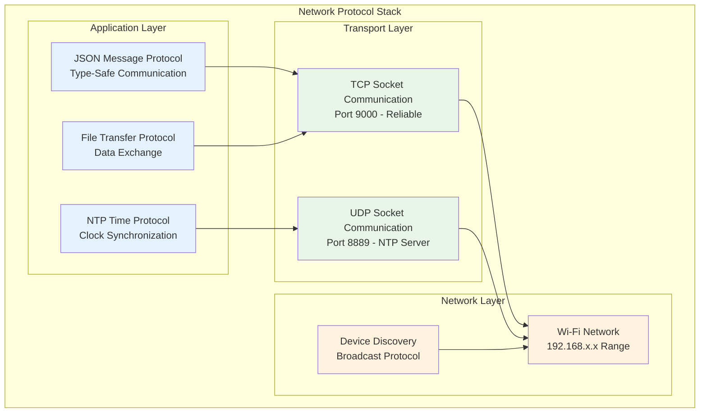

# Multi-Device Synchronization System - Protocol Specification

## Overview

This document defines the data contracts, APIs, and network message formats used by the Multi-Device Synchronization System. It serves as the authoritative reference for developers implementing synchronization clients, extending the protocol, or integrating new device types.

## Network Architecture

The synchronization system uses a hierarchical client-server architecture with the PC acting as the master coordinator:



## Communication Ports and Protocols

| Protocol | Port | Transport | Purpose | Direction |
|----------|------|-----------|---------|-----------|
| JSON Socket | 9000 | TCP | Command & control messages | Bidirectional |
| NTP Time Server | 8889 | UDP | Time synchronization queries | Client → Server |
| Device Discovery | 8080 | UDP | Device discovery broadcasts | Bidirectional |
| File Transfer | 9001 | TCP | Data file transfers | Android → PC |

## JSON Message Protocol

### Message Structure

All JSON messages follow a standardized structure with common fields:

```json
{
    "type": "message_type",
    "timestamp": 1641024045123,
    "sequence": 12345,
    "payload": {
        // Message-specific data
    }
}
```

**Common Fields:**

| Field | Type | Required | Description |
|-------|------|----------|-------------|
| `type` | String | Yes | Message type identifier |
| `timestamp` | Long | Yes | Timestamp in milliseconds since epoch |
| `sequence` | Integer | No | Sequence number for ordering |
| `payload` | Object | No | Message-specific data |

### Command Messages (PC → Android)

#### StartRecordCommand

Initiates synchronized recording across all devices.

```json
{
    "type": "start_record",
    "timestamp": 1641024045123,
    "session_id": "session_20240315_143022",
    "record_video": true,
    "record_thermal": true,
    "record_shimmer": false,
    "sync_timestamp": 1641024047000
}
```

**Fields:**

| Field | Type | Required | Description |
|-------|------|----------|-------------|
| `session_id` | String | Yes | Unique session identifier |
| `record_video` | Boolean | No | Enable RGB video recording (default: true) |
| `record_thermal` | Boolean | No | Enable thermal camera recording (default: true) |
| `record_shimmer` | Boolean | No | Enable Shimmer sensor recording (default: false) |
| `sync_timestamp` | Long | No | Exact timestamp to start recording |

#### StopRecordCommand

Terminates synchronized recording across all devices.

```json
{
    "type": "stop_record",
    "timestamp": 1641024145123,
    "sync_timestamp": 1641024147000
}
```

**Fields:**

| Field | Type | Required | Description |
|-------|------|----------|-------------|
| `sync_timestamp` | Long | No | Exact timestamp to stop recording |

#### SyncTimeCommand

Synchronizes device clock with PC master clock.

```json
{
    "type": "sync_time",
    "timestamp": 1641024045123,
    "pc_timestamp": 1641024045123,
    "ntp_accuracy_ms": 2.5,
    "sync_id": "sync_001"
}
```

**Fields:**

| Field | Type | Required | Description |
|-------|------|----------|-------------|
| `pc_timestamp` | Long | Yes | PC reference timestamp |
| `ntp_accuracy_ms` | Float | No | Estimated time accuracy |
| `sync_id` | String | No | Synchronization session identifier |

#### CaptureCalibrationCommand

Triggers synchronized calibration image capture.

```json
{
    "type": "capture_calibration",
    "timestamp": 1641024045123,
    "calibration_id": "cal_001",
    "capture_rgb": true,
    "capture_thermal": true,
    "high_resolution": true,
    "sync_timestamp": 1641024047000
}
```

**Fields:**

| Field | Type | Required | Description |
|-------|------|----------|-------------|
| `calibration_id` | String | No | Calibration session identifier |
| `capture_rgb` | Boolean | No | Capture RGB camera image (default: true) |
| `capture_thermal` | Boolean | No | Capture thermal camera image (default: true) |
| `high_resolution` | Boolean | No | Use maximum resolution (default: true) |
| `sync_timestamp` | Long | No | Exact timestamp for capture |

#### FlashSyncCommand

Triggers LED flash synchronization signal.

```json
{
    "type": "flash_sync",
    "timestamp": 1641024045123,
    "duration_ms": 200,
    "intensity": 100,
    "sync_id": "flash_001"
}
```

**Fields:**

| Field | Type | Required | Description |
|-------|------|----------|-------------|
| `duration_ms` | Long | No | Flash duration in milliseconds (default: 200) |
| `intensity` | Integer | No | Flash intensity 0-100 (default: 100) |
| `sync_id` | String | No | Synchronization event identifier |

#### BeepSyncCommand

Triggers audio beep synchronization signal.

```json
{
    "type": "beep_sync",
    "timestamp": 1641024045123,
    "frequency_hz": 1000,
    "duration_ms": 200,
    "volume": 0.8,
    "sync_id": "beep_001"
}
```

**Fields:**

| Field | Type | Required | Description |
|-------|------|----------|-------------|
| `frequency_hz` | Integer | No | Beep frequency in Hz (default: 1000) |
| `duration_ms` | Long | No | Beep duration in milliseconds (default: 200) |
| `volume` | Float | No | Volume level 0.0-1.0 (default: 0.8) |
| `sync_id` | String | No | Synchronization event identifier |

### Status Messages (Android → PC)

#### HelloMessage

Device introduction and capability announcement.

```json
{
    "type": "hello",
    "timestamp": 1641024045123,
    "device_id": "samsung_s22_001",
    "device_type": "android",
    "capabilities": ["video", "thermal", "shimmer"],
    "app_version": "1.2.3",
    "android_version": "13",
    "hardware_info": {
        "model": "Samsung Galaxy S22",
        "camera_resolution": "3840x2160",
        "thermal_camera": "Topdon TC001"
    }
}
```

**Fields:**

| Field | Type | Required | Description |
|-------|------|----------|-------------|
| `device_id` | String | Yes | Unique device identifier |
| `device_type` | String | Yes | Device type ("android", "ios", etc.) |
| `capabilities` | Array[String] | Yes | Supported recording capabilities |
| `app_version` | String | No | Application version |
| `android_version` | String | No | Android OS version |
| `hardware_info` | Object | No | Hardware specifications |

#### StatusMessage

Periodic device status updates.

```json
{
    "type": "status",
    "timestamp": 1641024045123,
    "device_id": "samsung_s22_001",
    "battery_level": 85,
    "storage_available_gb": 12.5,
    "temperature_celsius": 32.1,
    "recording_active": true,
    "connected_sensors": ["thermal", "shimmer"],
    "network_quality": {
        "signal_strength": -45,
        "latency_ms": 12.3,
        "bandwidth_mbps": 50.2
    }
}
```

**Fields:**

| Field | Type | Required | Description |
|-------|------|----------|-------------|
| `device_id` | String | Yes | Device identifier |
| `battery_level` | Integer | No | Battery percentage (0-100) |
| `storage_available_gb` | Float | No | Available storage in GB |
| `temperature_celsius` | Float | No | Device temperature |
| `recording_active` | Boolean | No | Recording status |
| `connected_sensors` | Array[String] | No | Connected sensor types |
| `network_quality` | Object | No | Network performance metrics |

#### AckMessage

Command acknowledgment and response.

```json
{
    "type": "ack",
    "timestamp": 1641024045123,
    "device_id": "samsung_s22_001",
    "command_type": "start_record",
    "status": "ok",
    "message": "Recording started successfully",
    "execution_timestamp": 1641024047000
}
```

**Fields:**

| Field | Type | Required | Description |
|-------|------|----------|-------------|
| `device_id` | String | Yes | Device identifier |
| `command_type` | String | Yes | Acknowledged command type |
| `status` | String | Yes | "ok", "error", or "warning" |
| `message` | String | No | Human-readable status message |
| `execution_timestamp` | Long | No | Actual command execution time |

#### SensorDataMessage

Real-time sensor data streaming.

```json
{
    "type": "sensor_data",
    "timestamp": 1641024045123,
    "device_id": "samsung_s22_001",
    "sensor_type": "shimmer_gsr",
    "data": {
        "gsr_value": 2.45,
        "skin_temperature": 32.1,
        "heart_rate": 72,
        "sample_rate": 128
    },
    "quality_metrics": {
        "signal_quality": 0.95,
        "noise_level": 0.02
    }
}
```

**Fields:**

| Field | Type | Required | Description |
|-------|------|----------|-------------|
| `device_id` | String | Yes | Device identifier |
| `sensor_type` | String | Yes | Type of sensor data |
| `data` | Object | Yes | Sensor measurements |
| `quality_metrics` | Object | No | Data quality indicators |

### Data Streaming Messages

#### PreviewFrameMessage

Live video/thermal preview frames.

```json
{
    "type": "preview_frame",
    "timestamp": 1641024045123,
    "device_id": "samsung_s22_001",
    "camera_type": "rgb",
    "frame_number": 1234,
    "resolution": "1920x1080",
    "format": "jpeg",
    "compression_quality": 80,
    "image_data": "base64_encoded_image_data...",
    "metadata": {
        "exposure_time": 0.016,
        "iso": 100,
        "focal_length": 26.0
    }
}
```

**Fields:**

| Field | Type | Required | Description |
|-------|------|----------|-------------|
| `device_id` | String | Yes | Device identifier |
| `camera_type` | String | Yes | "rgb", "thermal", "depth" |
| `frame_number` | Integer | Yes | Sequential frame number |
| `resolution` | String | Yes | Frame resolution (WxH) |
| `format` | String | Yes | Image format ("jpeg", "png", "raw") |
| `compression_quality` | Integer | No | JPEG quality 1-100 |
| `image_data` | String | Yes | Base64 encoded image |
| `metadata` | Object | No | Camera settings and EXIF data |

## NTP Time Synchronization Protocol

### Time Sync Request

Android devices query the PC's NTP server for time synchronization:

```json
{
    "type": "time_sync_request",
    "client_id": "samsung_s22_001",
    "timestamp": 1641024045123,
    "sequence": 1
}
```

### Time Sync Response

PC responds with high-precision timestamp information:

```json
{
    "type": "time_sync_response",
    "server_timestamp": 1641024045125,
    "request_timestamp": 1641024045123,
    "receive_timestamp": 1641024045124,
    "response_timestamp": 1641024045125,
    "server_precision_ms": 2.1,
    "sequence": 1,
    "server_time_ms": 1641024045125
}
```

**Time Synchronization Algorithm:**

```python
def calculate_time_offset(request_time, receive_time, transmit_time, response_time):
    """Calculate time offset using NTP algorithm"""
    offset = ((receive_time - request_time) + (transmit_time - response_time)) / 2
    delay = (response_time - request_time) - (transmit_time - receive_time)
    return offset, delay
```

## File Transfer Protocol

### File Transfer Messages

#### FileInfoMessage

Announces file transfer initiation.

```json
{
    "type": "file_info",
    "timestamp": 1641024045123,
    "device_id": "samsung_s22_001",
    "file_name": "rgb_video_20240315_143022.mp4",
    "file_size": 524288000,
    "file_type": "video/mp4",
    "checksum": "sha256:abc123...",
    "chunk_size": 65536,
    "total_chunks": 8000
}
```

#### FileChunkMessage

Transfers file data in chunks.

```json
{
    "type": "file_chunk",
    "timestamp": 1641024045123,
    "device_id": "samsung_s22_001",
    "file_name": "rgb_video_20240315_143022.mp4",
    "chunk_number": 1234,
    "chunk_data": "base64_encoded_chunk_data...",
    "chunk_checksum": "md5:def456..."
}
```

#### FileEndMessage

Signals completion of file transfer.

```json
{
    "type": "file_end",
    "timestamp": 1641024045123,
    "device_id": "samsung_s22_001",
    "file_name": "rgb_video_20240315_143022.mp4",
    "transfer_status": "complete",
    "total_chunks_sent": 8000,
    "final_checksum": "sha256:abc123..."
}
```

## Session State Synchronization

### Session State Message

Synchronizes session state between PC and Android devices:

```json
{
    "type": "session_state",
    "timestamp": 1641024045123,
    "device_id": "samsung_s22_001",
    "session_id": "session_20240315_143022",
    "recording_active": true,
    "recording_start_time": "2024-03-15T14:30:22.045Z",
    "recording_duration_seconds": 180.5,
    "files_recorded": [
        {
            "type": "video",
            "path": "/storage/recordings/rgb_video.mp4",
            "size_bytes": 524288000,
            "start_timestamp": 1641024045000,
            "end_timestamp": 1641024225500
        },
        {
            "type": "thermal",
            "path": "/storage/recordings/thermal_data.bin",
            "size_bytes": 102400000,
            "start_timestamp": 1641024045000,
            "end_timestamp": 1641024225500
        }
    ],
    "devices_connected": {
        "shimmer_001": true,
        "thermal_camera": true
    },
    "calibration_status": {
        "rgb_camera": "complete",
        "thermal_camera": "pending"
    },
    "sync_quality_metrics": {
        "average_offset_ms": 3.2,
        "sync_quality_percent": 96.3,
        "message_delivery_rate": 99.8
    }
}
```

## Device Discovery Protocol

### Discovery Broadcast

PC broadcasts discovery message to find Android devices:

```json
{
    "type": "device_discovery",
    "timestamp": 1641024045123,
    "requester_id": "pc_controller_001",
    "protocol_version": "1.0",
    "supported_capabilities": ["recording", "calibration", "sync"]
}
```

### Discovery Response

Android devices respond with their capabilities:

```json
{
    "type": "discovery_response",
    "timestamp": 1641024045123,
    "device_id": "samsung_s22_001",
    "device_type": "android",
    "ip_address": "192.168.1.105",
    "port": 9000,
    "capabilities": ["video", "thermal", "shimmer"],
    "protocol_version": "1.0",
    "ready_for_connection": true
}
```

## Error Handling and Recovery

### Error Message Format

Standardized error reporting across all message types:

```json
{
    "type": "error",
    "timestamp": 1641024045123,
    "device_id": "samsung_s22_001",
    "error_code": "SYNC_FAILURE",
    "error_message": "Time synchronization failed",
    "error_details": {
        "attempted_sync_count": 3,
        "last_offset_ms": 150.5,
        "network_latency_ms": 75.2
    },
    "recovery_suggestions": [
        "Check network connectivity",
        "Restart time synchronization",
        "Verify NTP server status"
    ]
}
```

### Error Codes

| Code | Description | Severity | Recovery Action |
|------|-------------|----------|-----------------|
| `SYNC_FAILURE` | Time synchronization failed | High | Restart sync process |
| `NETWORK_TIMEOUT` | Network communication timeout | Medium | Retry with backoff |
| `INVALID_MESSAGE` | Malformed message received | Low | Log and continue |
| `STORAGE_FULL` | Insufficient storage space | High | Stop recording |
| `SENSOR_ERROR` | Sensor hardware failure | High | Disable sensor |
| `PROTOCOL_VERSION_MISMATCH` | Incompatible protocol versions | High | Update software |

## Quality of Service Parameters

### Message Priorities

| Priority | Message Types | Delivery Requirements |
|----------|---------------|----------------------|
| Critical | Time sync, recording control | <50ms delivery, guaranteed |
| High | Status updates, acknowledgments | <200ms delivery, reliable |
| Normal | Sensor data, preview frames | <500ms delivery, best effort |
| Low | File transfers, logs | No time requirement |

### Network Quality Metrics

```json
{
    "network_quality": {
        "latency_ms": 12.3,
        "jitter_ms": 2.1,
        "packet_loss_percent": 0.1,
        "bandwidth_mbps": 50.2,
        "signal_strength_dbm": -45,
        "quality_score": 0.95
    }
}
```

### Traffic Classification and Management

The protocol implements intelligent traffic classification for optimal performance:

```python
class QoSManager:
    def __init__(self):
        self.traffic_classes = {
            'CRITICAL': {'priority': 1, 'bandwidth_percent': 20},
            'REALTIME': {'priority': 2, 'bandwidth_percent': 40},
            'DATA': {'priority': 3, 'bandwidth_percent': 30},
            'BACKGROUND': {'priority': 4, 'bandwidth_percent': 10}
        }
        self.bandwidth_monitor = BandwidthMonitor()
        self.packet_scheduler = PacketScheduler()
    
    def classify_traffic(self, message):
        """Classify network traffic by type and priority"""
        if message.message_type in [MessageType.TIME_SYNC_REQUEST, 
                                   MessageType.EVENT_TRIGGER]:
            return 'CRITICAL'
        elif message.message_type in [MessageType.SENSOR_DATA,
                                     MessageType.VIDEO_FRAME]:
            return 'REALTIME'
        elif message.message_type in [MessageType.SESSION_STATUS,
                                     MessageType.CONFIGURATION]:
            return 'DATA'
        else:
            return 'BACKGROUND'
```

### Adaptive Quality Strategies

Network adaptation algorithms automatically adjust protocol behavior:

| Network Condition | Adaptation Strategy | Parameters |
|------------------|-------------------|------------|
| High latency (>50ms) | Increase buffer size, enable prediction | Buffer: 2x, Prediction: ON |
| Low bandwidth (<10Mbps) | Enable compression, reduce quality | Compression: HIGH, Quality: 75% |
| Packet loss (>1%) | Enable error correction, reduce rate | FEC: ON, Rate: 80% |
| Poor signal (<-70dBm) | Increase retries, extend timeouts | Retries: 5, Timeout: 2x |

### Fault Tolerance Mechanisms

The protocol includes comprehensive fault tolerance capabilities:

```python
class FaultToleranceManager:
    def __init__(self):
        self.connection_monitor = ConnectionMonitor()
        self.recovery_strategies = RecoveryStrategyDatabase()
        self.failure_history = FailureHistory()
    
    def handle_device_disconnection(self, device_id, status):
        """Handle device disconnection with automatic recovery"""
        # Log failure event
        failure_event = {
            'timestamp': time.time(),
            'device_id': device_id,
            'failure_type': 'disconnection',
            'status': status
        }
        self.failure_history.log_failure(failure_event)
        
        # Attempt automatic reconnection
        recovery_strategy = self.recovery_strategies.get_strategy('device_disconnection')
        for attempt in range(recovery_strategy.max_attempts):
            if self.attempt_device_reconnection(device_id):
                self.failure_history.log_recovery(failure_event)
                return True
            time.sleep(recovery_strategy.retry_delay)
        
        # Escalate to manual intervention if automatic recovery fails
        self.escalate_failure(device_id, failure_event)
        return False
```

**Error Recovery Strategies:**

| Error Type | Recovery Action | Retry Policy | Escalation |
|-----------|----------------|--------------|------------|
| Connection timeout | Reconnect with backoff | 3 attempts, 2^n seconds | Alert user |
| Message corruption | Request retransmission | 5 attempts, immediate | Log error |
| Clock drift excessive | Reinitialize sync | 1 attempt, immediate | Reset device |
| Network congestion | Reduce data rate | Adaptive, continuous | QoS adjustment |

## Protocol Versioning

### Version Negotiation

The protocol supports version negotiation for backward compatibility:

```json
{
    "type": "protocol_negotiation",
    "timestamp": 1641024045123,
    "supported_versions": ["1.0", "1.1", "1.2"],
    "preferred_version": "1.2",
    "features": {
        "1.0": ["basic_sync", "recording"],
        "1.1": ["enhanced_sync", "file_transfer"],
        "1.2": ["adaptive_quality", "error_recovery"]
    }
}
```

### Version History

| Version | Release Date | Key Features |
|---------|-------------|--------------|
| 1.0 | 2024-01-01 | Basic synchronization and recording |
| 1.1 | 2024-02-01 | File transfer and enhanced error handling |
| 1.2 | 2024-03-01 | Adaptive quality control and recovery |

## Implementation Guidelines

### Message Validation

All implementations must validate:
- Required fields presence
- Data type correctness
- Value range constraints
- Message size limits (max 10MB)
- Timestamp freshness (within 30 seconds)

### Connection Management

- Maintain persistent TCP connections
- Implement heartbeat messages every 5 seconds
- Handle connection drops gracefully
- Implement exponential backoff for reconnection

### Security Considerations

The protocol implements comprehensive security measures for research-grade data protection:

#### Device Authentication Framework

```python
class NetworkSecurityManager:
    def __init__(self):
        self.device_certificates = DeviceCertificateStore()
        self.session_keys = SessionKeyManager()
        self.encryption_engine = AESEncryptionEngine()
    
    def authenticate_device(self, device_id, certificate):
        """Authenticate device using certificate-based authentication"""
        # Validate certificate integrity and authenticity
        if not self.device_certificates.validate_certificate(certificate):
            return False
        
        # Check certificate expiration
        if self.device_certificates.is_expired(certificate):
            return False
        
        # Generate session key for encrypted communication
        session_key = self.session_keys.generate_session_key()
        
        # Establish encrypted communication session
        encrypted_session = self.encryption_engine.create_session(
            device_id, session_key
        )
        
        return encrypted_session
    
    def encrypt_message(self, message, device_id):
        """Encrypt message for secure transmission"""
        session_key = self.session_keys.get_session_key(device_id)
        
        if session_key:
            encrypted_payload = self.encryption_engine.encrypt(
                message.payload, session_key
            )
            message.payload = encrypted_payload
            message.encrypted = True
        
        return message
```

#### Security Protocol Requirements:

| Security Layer | Implementation | Purpose |
|---------------|---------------|---------|
| Transport Security | TLS 1.3 for TCP connections | Encrypt data in transit |
| Device Authentication | Certificate-based validation | Verify device identity |
| Message Integrity | SHA-256 checksums | Detect data corruption |
| Session Management | Encrypted session keys | Secure communication |
| Access Control | Device capability validation | Authorize operations |
| Rate Limiting | 1000 messages/second max | Prevent DoS attacks |

#### Data Protection Measures:

- **Input Validation**: All incoming messages undergo strict validation
- **Message Authentication**: Digital signatures for critical commands
- **Replay Protection**: Timestamp-based nonce validation
- **Data Sanitization**: Remove sensitive information from logs
- **Secure Key Storage**: Hardware security modules when available
- **Audit Logging**: Comprehensive security event logging

This protocol specification provides the complete data contract for implementing and extending the Multi-Device Synchronization System.