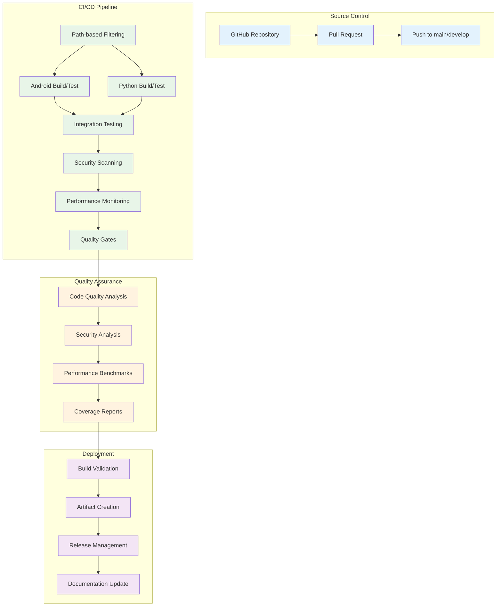
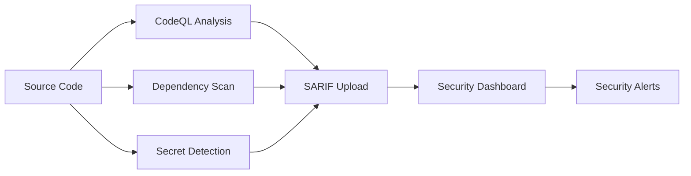

# CI/CD Pipeline Enhancement Protocol

## Table of Contents

1. [Pipeline Architecture Overview](#pipeline-architecture-overview)
2. [Core CI/CD Workflows](#core-cicd-workflows)
3. [Quality Assurance Integration](#quality-assurance-integration)
4. [Security Scanning Framework](#security-scanning-framework)
5. [Performance Monitoring](#performance-monitoring)
6. [Deployment Strategies](#deployment-strategies)
7. [Best Practices and Guidelines](#best-practices-and-guidelines)
8. [Troubleshooting and Maintenance](#troubleshooting-and-maintenance)

---

## Pipeline Architecture Overview

The CI/CD pipeline implements industry-standard practices for the Multi-Sensor Recording System, providing automated testing, security scanning, performance monitoring, and quality assurance for both Android and Python components.



### Technology Stack

#### Android Components
| Component | Technology | Version | Purpose |
|-----------|------------|---------|---------|
| **Build System** | Gradle with Kotlin DSL | 8.11.1 | Project compilation and dependency management |
| **Language** | Kotlin | Latest stable | Primary development language |
| **Java Support** | OpenJDK | 17, 21 | Runtime environment compatibility |
| **Testing Framework** | JUnit, Espresso, Robolectric | Latest | Unit and integration testing |
| **Mocking** | Mockk | Latest | Test doubles and mocking |
| **Code Quality** | Detekt, ktlint, Android Lint | Latest | Static analysis and linting |
| **Coverage** | Kover, JaCoCo | Latest | Code coverage analysis |

#### Python Components
| Component | Technology | Version | Purpose |
|-----------|------------|---------|---------|
| **Environment** | Conda | Latest | Environment management |
| **Python Versions** | Python | 3.9, 3.10, 3.11 | Multi-version compatibility |
| **Testing** | pytest with plugins | Latest | Testing framework |
| **Code Quality** | Black, isort, flake8, mypy | Latest | Code formatting and analysis |
| **Security** | Bandit | Latest | Security vulnerability scanning |
| **Coverage** | pytest-cov | Latest | Coverage reporting |
| **Performance** | pytest-benchmark | Latest | Performance testing |

---

## Core CI/CD Workflows

### 1. Main CI/CD Pipeline (`ci-cd.yml`)

**Triggers:**
- Push to `main` or `develop` branches
- Pull request creation and updates
- Manual workflow dispatch
- Weekly scheduled runs

**Key Features:**
- Path-based job filtering for optimization
- Matrix testing across Java versions (17, 21) and Python versions (3.9, 3.10, 3.11)
- Enhanced caching strategies for dependencies
- Build scans and performance monitoring
- Comprehensive artifact collection

**Workflow Jobs:**

```yaml
Jobs:
  changes:
    - Analyzes changed files to optimize workflow execution
    - Determines which components need testing
    - Reduces unnecessary build time
  
  android-build-test:
    - Gradle compilation with caching
    - Unit test execution
    - Linting and static analysis
    - APK generation and validation
  
  android-integration-test:
    - Instrumented testing on multiple API levels
    - UI testing with Espresso
    - Device compatibility testing
  
  python-build-test:
    - Cross-platform testing (Windows, macOS, Linux)
    - Multi-version Python testing
    - Dependency validation
    - Package building
  
  security-scan:
    - Multi-layered security analysis
    - Vulnerability detection
    - Dependency security scanning
  
  performance-monitoring:
    - Build time analysis
    - Test execution performance
    - Memory usage profiling
  
  build-validation:
    - Cross-platform build verification
    - Documentation generation
    - Release artifact preparation
```

### 2. Code Quality Analysis (`qodana_code_quality.yml`)

**Analysis Tools:**
- **Qodana:** JetBrains comprehensive code analysis
- **Multi-language support:** Kotlin, Python, and configuration files
- **Integration:** GitHub Security tab and PR comments
- **Baseline support:** For progressive quality improvement

**Quality Metrics:**
- Code duplication detection
- Complexity analysis
- Security vulnerability identification
- Code style compliance
- Documentation coverage

### 3. Security Scanning Framework

**Security Tools Integration:**

| Tool | Language | Purpose | Output Format |
|------|----------|---------|---------------|
| **CodeQL** | Multi-language | GitHub native SAST | SARIF |
| **Trivy** | Dependencies | Vulnerability scanning | JSON/SARIF |
| **Bandit** | Python | Security linting | JSON |
| **Snyk** | Dependencies | Vulnerability database | JSON |
| **Semgrep** | Multi-language | Custom security rules | SARIF |

**Security Pipeline Flow:**


---

## Quality Assurance Integration

### Code Coverage Requirements

| Component | Minimum Coverage | Target Coverage | Enforcement |
|-----------|------------------|-----------------|-------------|
| **Android Kotlin** | 80% | 90% | Quality gates |
| **Python Core** | 85% | 95% | Quality gates |
| **Integration Tests** | 70% | 85% | Quality gates |

### Quality Gates

**Automated Quality Checks:**
1. **Code Coverage:** Must meet minimum thresholds
2. **Security Scan:** No high/critical vulnerabilities
3. **Performance:** No significant regression
4. **Build Success:** All platforms build successfully
5. **Test Pass Rate:** 100% test success required

**Quality Gate Configuration:**
```yaml
quality_gates:
  coverage:
    android: 80%
    python: 85%
  security:
    critical: 0
    high: 0
    medium: <=5
  performance:
    regression_threshold: 10%
  build:
    success_rate: 100%
```

---

## Performance Monitoring

### Metrics Collection

**Android Performance Metrics:**
- Build time analysis with Gradle build scans
- APK size monitoring and optimization alerts
- Test execution time tracking
- Memory usage during testing

**Python Performance Metrics:**
- pytest-benchmark integration for test performance
- Memory profiling with memory_profiler
- Package installation time monitoring
- Cross-platform performance comparison

### Regression Detection

**Performance Regression Analysis:**
```python
# Performance comparison workflow
def analyze_performance_regression(baseline, current):
    regression_threshold = 0.10  # 10% regression tolerance
    
    for metric in performance_metrics:
        regression = (current[metric] - baseline[metric]) / baseline[metric]
        if regression > regression_threshold:
            create_performance_alert(metric, regression)
```

**Performance Dashboard:**
- Automated HTML dashboard generation
- Trend analysis across builds
- Performance comparison for pull requests
- Resource utilization tracking

---

## Deployment Strategies

### Artifact Management

**Build Artifacts:**
- Android APK files with debug and release variants
- Python wheel packages for distribution
- Documentation artifacts (HTML, PDF)
- Test reports and coverage data
- Performance benchmark results

**Release Automation:**
```yaml
release_strategy:
  triggers:
    - tag_push: "v*"
    - manual_dispatch: true
  
  artifacts:
    android:
      - app-debug.apk
      - app-release.apk
      - mapping.txt (ProGuard)
    
    python:
      - wheel packages
      - source distributions
      - documentation
  
  validation:
    - smoke_tests: required
    - security_scan: required
    - performance_check: required
```

### Environment Management

**Deployment Environments:**
1. **Development:** Continuous deployment from `develop` branch
2. **Staging:** Release candidate validation
3. **Production:** Tagged release deployment
4. **Research:** Specialized research environment configuration

---

## Best Practices and Guidelines

### Workflow Optimization

**Caching Strategies:**
- Gradle build cache for Android components
- Conda package cache for Python dependencies
- Docker layer caching for containerized builds
- Artifact caching between workflow runs

**Parallel Execution:**
- Matrix builds for multi-platform testing
- Concurrent job execution where possible
- Resource optimization for runner efficiency

### Code Quality Standards

**Pre-commit Hooks:**
```yaml
pre_commit_hooks:
  - code_formatting: black, ktlint
  - linting: flake8, detekt
  - security_scan: bandit
  - test_execution: quick_tests
```

**Review Requirements:**
- Automated code review via bots
- Security review for sensitive changes
- Performance review for optimization changes
- Documentation review for API changes

### Security Best Practices

**Secret Management:**
- GitHub Secrets for sensitive data
- Environment-specific secret isolation
- Automated secret rotation where possible
- Secret scanning in all commits

**Access Control:**
- Role-based access to workflow management
- Protected branch policies
- Required status checks before merge
- Automated security policy enforcement

---

## Troubleshooting and Maintenance

### Common Issues and Solutions

#### Build Failures

**Gradle Build Issues:**
```bash
# Common solutions
./gradlew clean build --refresh-dependencies
./gradlew build --no-daemon --no-build-cache
./gradlew dependencies --configuration implementation
```

**Python Environment Issues:**
```bash
# Environment troubleshooting
conda env create -f environment.yml --force
conda clean --all
pip install --upgrade --force-reinstall -r requirements.txt
```

#### Performance Issues

**Slow Build Times:**
- Enable Gradle build cache
- Optimize dependency resolution
- Use parallel execution where possible
- Monitor resource usage and adjust runner specifications

**Test Execution Slowdowns:**
- Identify slow tests with profiling
- Optimize test data setup/teardown
- Use test parallelization
- Implement test categorization for faster feedback

### Monitoring and Alerting

**Pipeline Health Monitoring:**
- Build success rate tracking
- Performance trend analysis
- Security vulnerability alerts
- Resource usage monitoring

**Alert Configuration:**
```yaml
alerts:
  build_failure:
    threshold: 1
    notification: slack, email
  
  security_vulnerability:
    severity: [critical, high]
    notification: security_team
  
  performance_regression:
    threshold: 15%
    notification: dev_team
```

### Maintenance Schedule

**Regular Maintenance Tasks:**
- Weekly dependency updates with security scanning
- Monthly performance baseline updates
- Quarterly security policy reviews
- Annual infrastructure optimization reviews

**Update Procedures:**
1. **Dependency Updates:** Automated with security validation
2. **Tool Updates:** Staged rollout with validation
3. **Infrastructure Updates:** Planned maintenance windows
4. **Security Updates:** Immediate deployment for critical vulnerabilities