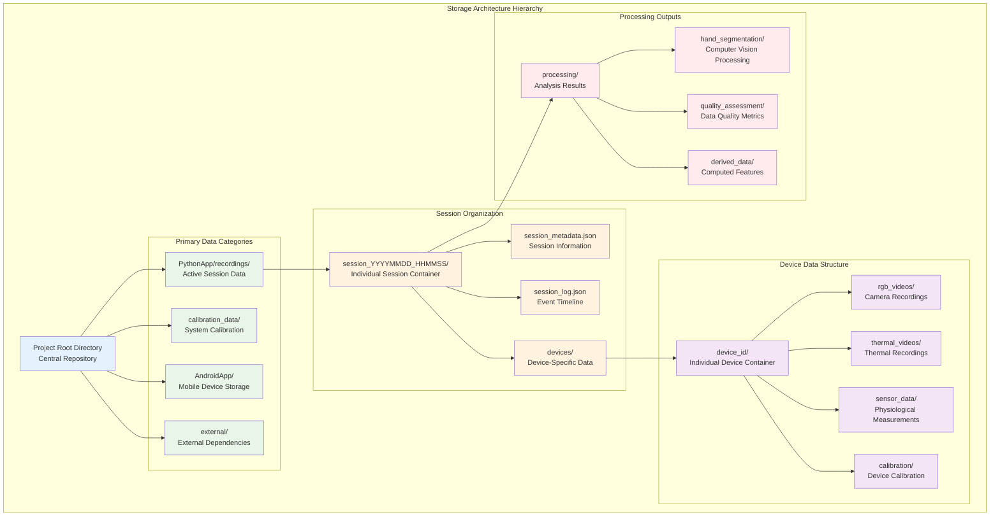

# Data Models and File Organization Protocol

## Table of Contents

1. [Storage Architecture Overview](#storage-architecture-overview)
2. [Directory Structure Standards](#directory-structure-standards)
3. [File Naming Conventions](#file-naming-conventions)
4. [Data Schema Specifications](#data-schema-specifications)
5. [Device Identifier Standards](#device-identifier-standards)
6. [Timestamp Standards](#timestamp-standards)
7. [Implementation Guidelines](#implementation-guidelines)
8. [Validation and Quality Assurance](#validation-and-quality-assurance)

---

## Storage Architecture Overview

The storage architecture implements a hierarchical, session-based organization pattern that provides logical separation between different data collection activities while maintaining clear relationships between related data elements.



---

## Directory Structure Standards

### Root Data Organization

```
project-root/
├── PythonApp/
│   ├── recordings/                    # Primary session recordings
│   │   ├── session_YYYYMMDD_HHMMSS/   # Individual timestamped sessions
│   │   ├── session_YYYYMMDD_HHMMSS/   # Each session contains complete data
│   │   └── ...                        # Multiple sessions organized chronologically
│   ├── test_recordings/               # Development and validation sessions
│   │   ├── unit_test_sessions/        # Automated testing data
│   │   ├── integration_test_data/     # System integration validation
│   │   └── performance_benchmarks/    # Performance testing results
│   ├── test_videos/                   # Video processing validation outputs
│   │   ├── algorithm_validation/      # Computer vision algorithm testing
│   │   ├── quality_assessment/        # Video quality validation results
│   │   └── processing_benchmarks/     # Performance analysis outputs
│   └── test_logs/                     # Development and debugging logs
│       ├── system_diagnostics/        # System health monitoring
│       ├── error_analysis/            # Error pattern analysis
│       └── performance_metrics/       # System performance tracking
├── calibration_data/                  # System calibration and validation
│   ├── camera_calibration/            # RGB camera calibration sessions
│   │   ├── intrinsic_parameters/      # Camera intrinsic calibration
│   │   ├── extrinsic_parameters/      # Camera positioning calibration
│   │   └── stereo_calibration/        # Multi-camera system calibration
│   ├── thermal_calibration/           # Thermal camera calibration
│   │   ├── temperature_validation/    # Temperature accuracy validation
│   │   ├── spatial_calibration/       # Thermal-RGB alignment
│   │   └── temporal_calibration/      # Thermal camera timing calibration
│   └── sensor_calibration/            # Physiological sensor calibration
│       ├── gsr_calibration/           # GSR sensor accuracy validation
│       ├── ppg_calibration/           # Heart rate sensor validation
│       └── motion_calibration/        # Accelerometer calibration
├── AndroidApp/                        # Mobile application data storage
│   ├── device_storage/                # Device-specific temporary storage
│   ├── local_processing/              # On-device processing results
│   └── sync_buffers/                  # Data synchronization buffers
└── external/                          # External dependencies and libraries
```

### Session Internal Structure

**Standard layout for every session:**
```
session_YYYYMMDD_HHMMSS/
├── session_metadata.json         # Required: Session information
├── session_YYYYMMDD_HHMMSS_log.json  # Required: Event log
├── devices/                      # Device-specific data
│   └── [device_id]/              # One folder per device
├── webcam/                       # PC webcam recordings
├── processing/                   # Post-processing outputs
├── exports/                      # Data exports
└── stimulus/                     # Stimulus-related files
```

---

## File Naming Conventions

### Core Principles

1. **Predictability:** All file names follow consistent patterns
2. **Sortability:** Files sort chronologically when listed alphabetically
3. **Human Readability:** Descriptive and self-documenting names
4. **System Compatibility:** Safe across Windows, macOS, and Linux

### Session Directory Naming

**Pattern:** `[custom_name_]YYYYMMDD_HHMMSS/`

**Examples:**
```
session_20250731_143022/           # Default session
experiment_A_20250731_143022/      # Named experiment
pilot_study_20250731_143022/       # Custom study name
stress_test_run_20250731_143022/   # Multi-word name with underscores
```

### Video Files

| Pattern | Purpose | Example |
|---------|---------|---------|
| `[device_id]_rgb_YYYYMMDD_HHMMSS.mp4` | RGB video recordings | `phone_1_rgb_20250731_143022.mp4` |
| `[device_id]_thermal_YYYYMMDD_HHMMSS.mp4` | Thermal video recordings | `phone_1_thermal_20250731_143022.mp4` |
| `webcam_[id]_YYYYMMDD_HHMMSS.mp4` | PC webcam recordings | `webcam_1_20250731_143022.mp4` |

### Sensor Data Files

| Pattern | Purpose | Example |
|---------|---------|---------|
| `[device_id]_gsr_YYYYMMDD_HHMMSS.csv` | GSR sensor data | `shimmer_01_gsr_20250731_143022.csv` |
| `[device_id]_motion_YYYYMMDD_HHMMSS.csv` | Accelerometer data | `phone_1_motion_20250731_143022.csv` |
| `[device_id]_heart_rate_YYYYMMDD_HHMMSS.csv` | Heart rate data | `phone_1_heart_rate_20250731_143022.csv` |

### Calibration Files

| Pattern | Purpose | Example |
|---------|---------|---------|
| `[device_id]_calib_[type]_[sequence]_YYYYMMDD_HHMMSS.jpg` | Calibration images | `phone_1_calib_chessboard_001_20250731_143022.jpg` |
| `[device_id]_calib_result_[type]_YYYYMMDD_HHMMSS.json` | Calibration results | `phone_1_calib_result_intrinsic_20250731_143022.json` |

### Processing Output Files

| Location | Pattern | Purpose | Example |
|----------|---------|---------|---------|
| `processing/hand_segmentation/` | `[source_name]_hands_cropped_YYYYMMDD_HHMMSS.mp4` | Hand cropped videos | `phone_1_rgb_hands_cropped_20250731_143022.mp4` |
| `processing/hand_segmentation/` | `[source_name]_hands_mask_YYYYMMDD_HHMMSS.mp4` | Hand mask videos | `phone_1_rgb_hands_mask_20250731_143022.mp4` |
| `processing/synchronization/` | `sync_data_YYYYMMDD_HHMMSS.json` | Synchronization data | `sync_data_20250731_143022.json` |

---

## Data Schema Specifications

### Session Metadata Schema

```json
{
  "session_id": "session_20250731_143022",
  "created_timestamp": "2025-07-31T14:30:22.123456+00:00",
  "researcher_id": "researcher_001",
  "experiment_type": "gsr_prediction",
  "participants": [
    {
      "participant_id": "P001",
      "age": 25,
      "gender": "M",
      "consent_timestamp": "2025-07-31T14:25:00.000000+00:00"
    }
  ],
  "devices": [
    {
      "device_id": "phone_1",
      "device_type": "android_smartphone",
      "model": "Samsung Galaxy S22",
      "capabilities": ["rgb_camera", "thermal_camera", "motion_sensors"]
    }
  ],
  "session_parameters": {
    "duration_seconds": 1800,
    "recording_quality": "4K",
    "sampling_rates": {
      "gsr": 51.2,
      "video": 30,
      "motion": 100
    }
  }
}
```

### Session Event Log Schema

```json
{
  "session_id": "session_20250731_143022",
  "log_format_version": "1.0",
  "events": [
    {
      "timestamp": "2025-07-31T14:30:22.123456+00:00",
      "event_type": "session_start",
      "event_source": "python_controller",
      "event_data": {
        "session_id": "session_20250731_143022",
        "researcher_id": "researcher_001"
      }
    },
    {
      "timestamp": "2025-07-31T14:30:25.456789+00:00",
      "event_type": "device_connected",
      "event_source": "device_manager",
      "event_data": {
        "device_id": "phone_1",
        "connection_type": "wifi",
        "ip_address": "192.168.1.101"
      }
    }
  ]
}
```

### Sensor Data Schema (CSV)

#### GSR Data Format
```csv
timestamp,timestamp_iso,device_id,gsr_raw,gsr_filtered,skin_conductance,temperature
1627747822.123456,2025-07-31T14:30:22.123456+00:00,shimmer_01,2048,2.15,15.2,32.1
1627747822.143456,2025-07-31T14:30:22.143456+00:00,shimmer_01,2050,2.17,15.3,32.1
```

#### Motion Data Format
```csv
timestamp,timestamp_iso,device_id,accel_x,accel_y,accel_z,gyro_x,gyro_y,gyro_z
1627747822.123456,2025-07-31T14:30:22.123456+00:00,phone_1,-0.12,0.98,9.76,0.01,0.02,-0.01
1627747822.133456,2025-07-31T14:30:22.133456+00:00,phone_1,-0.11,0.97,9.75,0.01,0.03,-0.01
```

---

## Device Identifier Standards

### Device Naming Convention

**Pattern:** `[device_type]_[identifier]`

| Device Type | Purpose | Examples |
|-------------|---------|----------|
| `phone` | Android smartphones | `phone_1`, `phone_2`, `phone_3` |
| `webcam` | PC webcams | `webcam_1`, `webcam_left`, `webcam_right` |
| `shimmer` | Shimmer sensor devices | `shimmer_01`, `shimmer_02` |
| `thermal` | Standalone thermal cameras | `thermal_handheld`, `thermal_fixed` |

**Identifier Rules:**
- Use numbers (1, 2, 3...) for multiple devices of same type
- Use descriptive names for positioned devices (left, right, center)
- Maximum length: 20 characters
- Only alphanumeric characters and underscores

---

## Timestamp Standards

### Format Specification

| Context | Format | Example |
|---------|--------|---------|
| File names | `YYYYMMDD_HHMMSS` | `20250731_143022` |
| JSON metadata | ISO 8601 with timezone | `2025-07-31T14:30:22.123456+00:00` |

### Timezone Handling

- All timestamps in file names use local system time
- All timestamps in JSON metadata include timezone information
- Processing scripts handle timezone conversion automatically

---

## Implementation Guidelines

### Code Integration

```python
from datetime import datetime

def generate_timestamp():
    """Generate standardized timestamp for file names."""
    return datetime.now().strftime("%Y%m%d_%H%M%S")

def generate_filename(device_id, file_type, extension):
    """Generate standardized filename."""
    timestamp = generate_timestamp()
    return f"{device_id}_{file_type}_{timestamp}.{extension}"

# Example usage
filename = generate_filename("phone_1", "rgb", "mp4")
# Returns: "phone_1_rgb_20250731_143022.mp4"
```

### Validation Functions

```python
import re

def validate_session_folder_name(folder_name):
    """Validate session folder naming convention."""
    pattern = r'^[a-zA-Z0-9_-]*_\d{8}_\d{6}$'
    return re.match(pattern, folder_name) is not None

def validate_device_file_name(filename):
    """Validate device file naming convention."""
    pattern = r'^[a-zA-Z0-9_]+_[a-zA-Z0-9_]+_\d{8}_\d{6}\.[a-zA-Z0-9]+$'
    return re.match(pattern, filename) is not None
```

---

## Validation and Quality Assurance

### Automated Validation Commands

```bash
# Validate all sessions
python tools/validate_data_schemas.py --all-sessions

# Validate specific session
python tools/validate_data_schemas.py --session PythonApp/recordings/session_20250731_143022

# Check naming conventions
python tools/check_naming_conventions.py --directory PythonApp/recordings
```

### Manual Verification Checklist

For each session, verify:

- [ ] Session folder follows naming convention
- [ ] `session_metadata.json` exists and validates
- [ ] Session log file exists with matching timestamp
- [ ] All device files follow naming patterns
- [ ] Processing outputs use consistent naming
- [ ] No files with invalid characters or spaces

### Storage Management Guidelines

- **Typical session sizes:** 100MB - 10GB per session
- **Backup strategy:** Archive entire session folders
- **Data retention:** Use timestamp patterns for automated cleanup
- **Monitoring:** Track session folder sizes and growth patterns