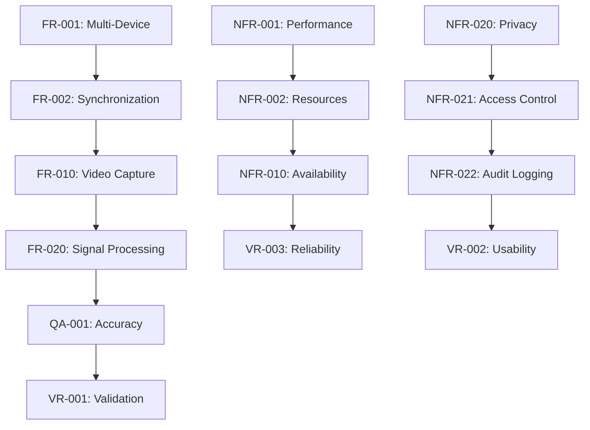

# Functional Requirements Specification Protocol

## Table of Contents

1. [Requirements Engineering Methodology](#requirements-engineering-methodology)
2. [System Overview and Scope](#system-overview-and-scope)
3. [Functional Requirements](#functional-requirements)
4. [Non-Functional Requirements](#non-functional-requirements)
5. [System Integration Requirements](#system-integration-requirements)
6. [Quality Assurance Requirements](#quality-assurance-requirements)
7. [Validation and Verification Requirements](#validation-and-verification-requirements)
8. [Requirements Traceability Matrix](#requirements-traceability-matrix)

---

## Requirements Engineering Methodology

Requirements analysis represents the critical foundational process that transforms high-level research objectives, user needs, and stakeholder expectations into specific, measurable, verifiable, and implementable system specifications. For the contactless GSR prediction system, this analysis addresses the complex interplay between research requirements, technical constraints, user needs, and regulatory considerations.

### Stakeholder Analysis

| Stakeholder Group | Primary Interests | Success Criteria |
|------------------|-------------------|------------------|
| **Research Scientists** | Data accuracy, experimental flexibility | 95%+ correlation with reference measurements |
| **Clinical Investigators** | Regulatory compliance, patient safety | Full HIPAA compliance, audit trails |
| **Technology Developers** | System maintainability, scalability | <5% technical debt, 90%+ test coverage |
| **Study Participants** | Privacy protection, ease of use | Zero privacy breaches, <10min setup |
| **Regulatory Bodies** | Compliance, safety standards | 100% regulatory compliance |

---

## System Overview and Scope

The Multi-Sensor Recording System scope encompasses:

- **Primary Function:** Contactless GSR prediction from multi-modal sensor data
- **Data Sources:** RGB cameras, thermal imaging, reference GSR sensors
- **Processing Requirements:** Real-time analysis with sub-second latency
- **Output Deliverables:** Research-grade data with statistical validation
- **Deployment Environment:** Research laboratories and clinical settings

### System Boundaries

**Included in Scope:**
- Multi-device data acquisition and synchronization
- Real-time signal processing and feature extraction
- Machine learning-based GSR prediction
- Data storage, export, and analysis tools
- User interfaces for researchers and operators

**Excluded from Scope:**
- Clinical decision support systems
- Real-time medical alerting
- Cloud-based data processing
- Third-party device integration beyond specified sensors

---

## Functional Requirements

### Core System Functions

#### FR-001: Multi-Device Coordination
- **Requirement:** System shall coordinate data collection from 4+ simultaneous devices
- **Priority:** Critical
- **Verification:** Multi-device integration testing
- **Dependencies:** Network communication, device management

#### FR-002: Data Synchronization
- **Requirement:** System shall maintain temporal synchronization with ≤5ms accuracy
- **Priority:** Critical
- **Verification:** Timestamp precision validation against reference clock
- **Dependencies:** Network latency compensation, clock synchronization

#### FR-003: Session Management
- **Requirement:** System shall provide complete session lifecycle management
- **Priority:** High
- **Verification:** Session creation, execution, and termination testing
- **Dependencies:** File system access, metadata management

### Data Acquisition Requirements

#### FR-010: Video Data Capture
- **Requirement:** System shall capture RGB video at ≥30 fps with resolution ≥1920×1080
- **Priority:** Critical
- **Verification:** Video quality assessment and frame rate validation
- **Dependencies:** Camera hardware, device performance

| Parameter | Minimum | Target | Maximum |
|-----------|---------|---------|---------|
| **Frame Rate** | 30 fps | 60 fps | 120 fps |
| **Resolution** | 1920×1080 | 3840×2160 | 7680×4320 |
| **Color Depth** | 8 bits | 10 bits | 12 bits |

#### FR-011: Thermal Data Capture
- **Requirement:** System shall capture thermal imagery at ≥25 fps with ≤0.1°C resolution
- **Priority:** High
- **Verification:** Thermal accuracy validation against reference measurements
- **Dependencies:** Thermal camera integration, calibration procedures

#### FR-012: Physiological Sensor Integration
- **Requirement:** System shall integrate Shimmer3 GSR+ sensors with ≥50 Hz sampling
- **Priority:** Critical
- **Verification:** Data integrity and temporal synchronization verification
- **Dependencies:** Bluetooth communication, device drivers

### Data Processing Requirements

#### FR-020: Signal Processing Pipeline
- **Requirement:** System shall extract physiological features with SNR ≥20 dB
- **Priority:** Critical
- **Verification:** Signal quality assessment and feature extraction validation
- **Dependencies:** Computer vision algorithms, filtering techniques

#### FR-021: Machine Learning Inference
- **Requirement:** System shall perform GSR prediction with ≤100ms inference time
- **Priority:** High
- **Verification:** Performance benchmarking and accuracy validation
- **Dependencies:** Model optimization, hardware acceleration

#### FR-022: Quality Assessment
- **Requirement:** System shall provide real-time quality metrics updated every second
- **Priority:** High
- **Verification:** Quality metric validation and reliability testing
- **Dependencies:** Signal analysis algorithms, quality standards

### User Interface Requirements

#### FR-030: Research Interface
- **Requirement:** System shall provide comprehensive research interface for protocol configuration
- **Priority:** High
- **Verification:** Usability testing with research stakeholders
- **Dependencies:** GUI framework, visualization libraries

#### FR-031: Real-Time Monitoring
- **Requirement:** System shall display real-time measurements with ≥10 Hz update rate
- **Priority:** Medium
- **Verification:** Interface responsiveness testing under system loads
- **Dependencies:** Rendering performance, data streaming

#### FR-032: Data Export and Analysis
- **Requirement:** System shall support export in standard formats (CSV, JSON, HDF5)
- **Priority:** High
- **Verification:** Data integrity validation and format compliance testing
- **Dependencies:** File management, metadata systems

---

## Non-Functional Requirements

### Performance Requirements

#### NFR-001: System Throughput
- **Requirement:** Process video streams from 4+ devices without degradation
- **Priority:** High
- **Measurement:** Concurrent device testing with performance monitoring
- **Acceptance:** <5% degradation with 4 devices vs single device

#### NFR-002: Resource Utilization
- **Requirement:** Operate within limits: CPU ≤80%, Memory ≤4GB, Storage ≤10GB/hour
- **Priority:** Medium
- **Measurement:** Resource monitoring during extended operation
- **Acceptance:** Sustained operation within limits for 8+ hours

| Resource | Baseline | Target | Maximum |
|----------|----------|---------|---------|
| **CPU Usage** | <50% | <70% | <80% |
| **Memory** | <2GB | <3GB | <4GB |
| **Storage Rate** | <5GB/hr | <7GB/hr | <10GB/hr |
| **Network** | <100Mbps | <200Mbps | <500Mbps |

#### NFR-003: Scalability
- **Requirement:** Support scaling to 8+ concurrent users without architectural changes
- **Priority:** Low
- **Measurement:** Load testing with multiple concurrent users
- **Acceptance:** Linear performance scaling with user count

### Reliability Requirements

#### NFR-010: System Availability
- **Requirement:** Maintain 99.5% availability during scheduled operations
- **Priority:** High
- **Measurement:** Uptime monitoring and failure tracking
- **Acceptance:** <4 hours downtime per month during operation

#### NFR-011: Data Integrity
- **Requirement:** Ensure 100% data integrity with comprehensive validation
- **Priority:** Critical
- **Measurement:** Data validation testing and corruption detection
- **Acceptance:** Zero undetected data corruption events

#### NFR-012: Fault Recovery
- **Requirement:** Recover from transient failures within 30 seconds without data loss
- **Priority:** High
- **Measurement:** Fault injection testing and recovery time measurement
- **Acceptance:** Successful recovery in 95% of test scenarios

### Security Requirements

#### NFR-020: Data Privacy
- **Requirement:** Implement comprehensive privacy protection with encryption
- **Priority:** Critical
- **Measurement:** Security audit and penetration testing
- **Acceptance:** No privacy vulnerabilities in security assessment

#### NFR-021: Access Control
- **Requirement:** Implement role-based access control with authentication
- **Priority:** High
- **Measurement:** Access control testing and privilege escalation assessment
- **Acceptance:** No unauthorized access in testing scenarios

#### NFR-022: Audit Logging
- **Requirement:** Maintain comprehensive audit logs of all actions and events
- **Priority:** Medium
- **Measurement:** Log completeness assessment and integrity validation
- **Acceptance:** 100% of security-relevant events logged with integrity

---

## System Integration Requirements

### Research Infrastructure Integration

#### IR-001: Research Data Management
- **Requirement:** Integrate with research systems (REDCap, BIDS)
- **Priority:** Medium
- **Verification:** Integration testing with target research platforms

#### IR-002: Analysis Tool Compatibility
- **Requirement:** Export data compatible with MATLAB, R, Python environments
- **Priority:** High
- **Verification:** Data import testing in target analysis environments

#### IR-003: Hardware Platform Support
- **Requirement:** Support deployment on Windows, macOS, and Linux
- **Priority:** Medium
- **Verification:** Cross-platform testing and validation

### External System Interfaces

| System Interface | Protocol | Data Format | Frequency |
|------------------|----------|-------------|-----------|
| **REDCap Integration** | REST API | JSON | On-demand |
| **MATLAB Export** | File I/O | .mat format | Per session |
| **R Integration** | CSV/JSON | Standard formats | Per session |
| **Python Analytics** | Direct import | HDF5/Parquet | Real-time |

---

## Quality Assurance Requirements

### Measurement Accuracy

#### QA-001: GSR Prediction Accuracy
- **Requirement:** GSR predictions achieve ≥75% correlation with reference measurements
- **Priority:** Critical
- **Verification:** Validation studies with diverse subject groups

#### QA-002: Temporal Precision
- **Requirement:** All timestamps accurate to ≤5 milliseconds
- **Priority:** High
- **Verification:** Time synchronization validation against precision references

#### QA-003: Signal Quality
- **Requirement:** Extracted features maintain SNR ≥20 dB
- **Priority:** High
- **Verification:** Signal analysis with controlled noise injection

### Data Quality Standards

| Quality Metric | Threshold | Measurement Method | Validation Frequency |
|----------------|-----------|-------------------|---------------------|
| **Temporal Accuracy** | ±5ms | Reference clock comparison | Per session |
| **Signal Integrity** | SNR ≥20dB | Spectral analysis | Continuous |
| **Data Completeness** | ≥99% | Missing data analysis | Per session |
| **Prediction Accuracy** | r ≥0.75 | Correlation analysis | Per study |

---

## Validation and Verification Requirements

### Verification Testing

#### Component Verification
- **Unit Testing:** Individual component functionality validation
- **Integration Testing:** Component interaction verification
- **System Testing:** End-to-end system functionality validation
- **Performance Testing:** Non-functional requirement verification

#### Validation Studies

#### VR-001: Accuracy Validation
- **Objective:** Validate GSR prediction accuracy across populations
- **Method:** Controlled studies with reference measurements
- **Sample Size:** Minimum 100 subjects across demographic groups
- **Success Criteria:** r ≥0.75 correlation with reference GSR

#### VR-002: Usability Validation
- **Objective:** Validate system usability for research applications
- **Method:** User studies with research personnel
- **Participants:** 20+ researchers across experience levels
- **Success Criteria:** ≥4.0/5.0 usability rating, <10min setup time

#### VR-003: Reliability Validation
- **Objective:** Validate system reliability in operational conditions
- **Method:** Extended operation testing in research environments
- **Duration:** 100+ hours of operation across conditions
- **Success Criteria:** 99.5% availability, zero data loss events

---

## Requirements Traceability Matrix

### Critical Requirements Traceability

| Requirement ID | Source | Design Element | Implementation | Test Case | Validation |
|----------------|--------|----------------|----------------|-----------|------------|
| **FR-001** | Stakeholder Need | Device Manager | Multi-device coordinator | TC-001 | VS-001 |
| **FR-010** | Performance Need | Camera Interface | Video capture pipeline | TC-010 | VS-002 |
| **NFR-001** | Performance Goal | Processing Pipeline | Parallel processing | TC-101 | VS-003 |
| **QA-001** | Accuracy Goal | ML Pipeline | GSR prediction model | TC-201 | VS-004 |

### Requirement Dependencies

### Change Management

**Requirement Changes:**
- All changes require stakeholder approval
- Impact analysis mandatory for critical requirements
- Traceability updates required for all modifications
- Regression testing required for affected components

**Version Control:**
- Requirements versioned with system releases
- Change history maintained with rationale
- Stakeholder sign-off required for major revisions
- Automated traceability validation in CI/CD pipeline