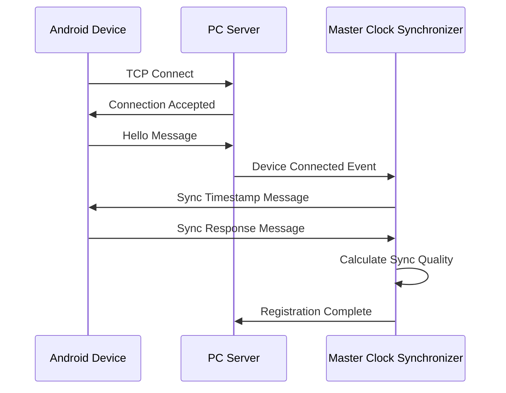

# Master Clock Synchronizer - Protocol Specification

## Table of Contents

- [Overview](#overview)
- [Data Structures](#data-structures)
  - [Core Synchronization Classes](#core-synchronization-classes)
    - [SyncStatus](#syncstatus)
    - [SyncCommand](#synccommand)
    - [RecordingSession](#recordingsession)
  - [Device Status Models](#device-status-models)
    - [ConnectedDevice](#connecteddevice)
    - [DeviceCapabilities](#devicecapabilities)
  - [Session Management Models](#session-management-models)
    - [SessionConfiguration](#sessionconfiguration)
- [JSON Message Protocol](#json-message-protocol)
  - [Synchronization Messages](#synchronization-messages)
    - [Sync Timestamp Message](#sync-timestamp-message)
    - [Sync Response Message](#sync-response-message)
  - [Recording Control Messages](#recording-control-messages)
    - [Start Record Command](#start-record-command)
    - [Stop Record Command](#stop-record-command)
  - [Status and Monitoring Messages](#status-and-monitoring-messages)
    - [Device Status Message](#device-status-message)
    - [Heartbeat Message](#heartbeat-message)
- [API Reference](#api-reference)
  - [MasterClockSynchronizer Public Interface](#masterclocksynchronizer-public-interface)
    - [Constructor](#constructor)
    - [Core Methods](#core-methods)
      - [start() -> bool](#start---bool)
      - [stop() -> None](#stop---none)
      - [get_master_timestamp() -> float](#get_master_timestamp---float)
      - [start_synchronized_recording()](#start_synchronized_recording)
      - [stop_synchronized_recording()](#stop_synchronized_recording)
      - [get_connected_devices()](#get_connected_devices)
      - [get_active_sessions()](#get_active_sessions)
  - [Callback Interfaces](#callback-interfaces)
    - [Webcam Sync Callback](#webcam-sync-callback)
    - [Session Event Callback](#session-event-callback)
    - [Sync Status Callback](#sync-status-callback)
  - [Utility Functions](#utility-functions)
    - [initialize_master_synchronizer()](#initialize_master_synchronizer)
    - [get_master_synchronizer()](#get_master_synchronizer)
    - [shutdown_master_synchronizer()](#shutdown_master_synchronizer)
- [Network Protocol Specifications](#network-protocol-specifications)
  - [NTP Server Protocol](#ntp-server-protocol)
    - [Time Sync Request](#time-sync-request)
    - [Time Sync Response](#time-sync-response)
  - [PC Server Communication](#pc-server-communication)
    - [Connection Handshake](#connection-handshake)
    - [Message Format](#message-format)
  - [Device Registration Protocol](#device-registration-protocol)
    - [Registration Sequence](#registration-sequence)
    - [Hello Message Structure](#hello-message-structure)
- [Integration Contracts](#integration-contracts)
  - [Webcam Controller Integration](#webcam-controller-integration)
  - [Android Device Integration](#android-device-integration)
  - [Session Manager Integration](#session-manager-integration)
- [Configuration Schema](#configuration-schema)
  - [Synchronization Parameters](#synchronization-parameters)
  - [Quality Thresholds](#quality-thresholds)
  - [Network Configuration](#network-configuration)
- [Event Schemas](#event-schemas)
  - [Device Events](#device-events)
    - [Device Connected Event](#device-connected-event)
    - [Device Disconnected Event](#device-disconnected-event)
  - [Session Events](#session-events)
    - [Session Started Event](#session-started-event)
    - [Session Quality Change Event](#session-quality-change-event)
  - [Quality Events](#quality-events)
    - [Sync Quality Alert](#sync-quality-alert)
- [Error Handling Protocol](#error-handling-protocol)
  - [Error Classifications](#error-classifications)
    - [Network Errors](#network-errors)
    - [Synchronization Errors](#synchronization-errors)
    - [Session Errors](#session-errors)
  - [Recovery Procedures](#recovery-procedures)
    - [Automatic Recovery](#automatic-recovery)
    - [Manual Recovery](#manual-recovery)
  - [Logging Standards](#logging-standards)
    - [Log Levels](#log-levels)
    - [Log Format](#log-format)
- [Advanced Integration Patterns](#advanced-integration-patterns)
  - [Custom Device Integration](#custom-device-integration)
  - [Advanced Callback Patterns](#advanced-callback-patterns)
  - [High-Availability Configuration](#high-availability-configuration)
  - [Performance Monitoring Integration](#performance-monitoring-integration)
- [Extended Configuration Schema](#extended-configuration-schema)
  - [Complete Configuration Reference](#complete-configuration-reference)

## Overview

This document defines the complete protocol specification for the Master Clock Synchronizer component, including data contracts, API interfaces, network protocols, and integration requirements. All components interacting with the synchronization system must adhere to these specifications.

## Data Structures

### Core Synchronization Classes

#### SyncStatus

Represents the synchronization status of a connected device.

| Field Name | Data Type | Required | Description |
|------------|-----------|----------|-------------|
| `device_id` | `str` | Yes | Unique identifier for the device |
| `device_type` | `str` | Yes | Type of device ('android', 'webcam1', 'webcam2') |
| `is_synchronized` | `bool` | Yes | Whether device is currently synchronized |
| `time_offset_ms` | `float` | Yes | Time offset from master clock in milliseconds |
| `last_sync_time` | `float` | Yes | Unix timestamp of last successful synchronization |
| `sync_quality` | `float` | Yes | Synchronization quality score (0.0 to 1.0) |
| `recording_active` | `bool` | Yes | Whether device is currently recording |
| `frame_count` | `int` | Yes | Current frame count for validation |

**Example JSON:**
```json
{
  "device_id": "Samsung_Galaxy_S21",
  "device_type": "android",
  "is_synchronized": true,
  "time_offset_ms": 12.3,
  "last_sync_time": 1644859200.123456,
  "sync_quality": 0.92,
  "recording_active": true,
  "frame_count": 1250
}
```

#### SyncCommand

Command structure for coordinated synchronization operations.

| Field Name | Data Type | Required | Description |
|------------|-----------|----------|-------------|
| `command_type` | `str` | Yes | Command type ('start_record', 'stop_record', 'sync_timestamp') |
| `session_id` | `str` | Yes | Unique session identifier |
| `master_timestamp` | `float` | Yes | Master clock timestamp for coordination |
| `target_devices` | `List[str]` | Yes | List of device IDs to target |
| `sync_tolerance_ms` | `float` | No | Maximum allowed synchronization difference (default: 50.0) |

**Example JSON:**
```json
{
  "command_type": "start_record",
  "session_id": "experiment_1644859200",
  "master_timestamp": 1644859200.123456,
  "target_devices": ["Samsung_Galaxy_S21", "Pixel_6_Pro"],
  "sync_tolerance_ms": 25.0
}
```

#### RecordingSession

Information about an active or completed recording session.

| Field Name | Data Type | Required | Description |
|------------|-----------|----------|-------------|
| `session_id` | `str` | Yes | Unique session identifier |
| `start_timestamp` | `float` | Yes | Unix timestamp when session started |
| `devices` | `Set[str]` | Yes | Set of device IDs participating in session |
| `webcam_files` | `Dict[str, str]` | Yes | Mapping of webcam ID to output file path |
| `android_files` | `Dict[str, List[str]]` | Yes | Mapping of device ID to list of output files |
| `is_active` | `bool` | Yes | Whether session is currently active |
| `sync_quality` | `float` | Yes | Overall session synchronization quality |

**Example JSON:**
```json
{
  "session_id": "experiment_1644859200",
  "start_timestamp": 1644859200.123456,
  "devices": ["Samsung_Galaxy_S21", "Pixel_6_Pro", "webcam1"],
  "webcam_files": {
    "webcam1": "/recordings/webcam1_1644859200.mp4"
  },
  "android_files": {
    "Samsung_Galaxy_S21": [
      "/recordings/samsung_video_1644859200.mp4",
      "/recordings/samsung_thermal_1644859200.bin"
    ]
  },
  "is_active": true,
  "sync_quality": 0.89
}
```

### Device Status Models

#### ConnectedDevice

Extended device information for network-connected devices.

| Field Name | Data Type | Required | Description |
|------------|-----------|----------|-------------|
| `device_id` | `str` | Yes | Unique device identifier |
| `capabilities` | `List[str]` | Yes | List of device capabilities |
| `connection_time` | `float` | Yes | Unix timestamp when device connected |
| `last_heartbeat` | `float` | Yes | Last heartbeat/ping timestamp |
| `status` | `Dict[str, Any]` | Yes | Current device status information |
| `network_info` | `Dict[str, str]` | No | Network connection information |

#### DeviceCapabilities

Standardized capability identifiers for devices.

| Capability | Description | Applicable Devices |
|------------|-------------|-------------------|
| `video_recording` | RGB video recording capability | Android devices |
| `thermal_recording` | Thermal camera recording | Android devices with thermal camera |
| `shimmer_recording` | Shimmer sensor data collection | Android devices with Shimmer |
| `audio_recording` | Audio recording capability | Android devices |
| `webcam_sync` | Webcam synchronization support | PC webcams |

### Session Management Models

#### SessionConfiguration

Configuration parameters for recording sessions.

| Field Name | Data Type | Required | Default | Description |
|------------|-----------|----------|---------|-------------|
| `record_video` | `bool` | No | `true` | Enable video recording |
| `record_thermal` | `bool` | No | `true` | Enable thermal recording |
| `record_shimmer` | `bool` | No | `false` | Enable Shimmer sensor recording |
| `record_audio` | `bool` | No | `false` | Enable audio recording |
| `video_resolution` | `str` | No | `"1080p"` | Video recording resolution |
| `video_fps` | `int` | No | `30` | Video frames per second |
| `thermal_fps` | `int` | No | `30` | Thermal camera frames per second |

## JSON Message Protocol

### Synchronization Messages

#### Sync Timestamp Message

Initiates time synchronization with a device.

**Message Type:** `sync_timestamp`

| Field Name | Data Type | Required | Description |
|------------|-----------|----------|-------------|
| `type` | `str` | Yes | Always "sync_timestamp" |
| `timestamp` | `float` | Yes | Master clock timestamp |
| `sequence_number` | `int` | No | Sequence number for tracking |
| `precision_ms` | `float` | No | Estimated timestamp precision |

**Example:**
```json
{
  "type": "sync_timestamp",
  "timestamp": 1644859200.123456,
  "sequence_number": 42,
  "precision_ms": 1.0
}
```

#### Sync Response Message

Response from device acknowledging timestamp synchronization.

**Message Type:** `sync_response`

| Field Name | Data Type | Required | Description |
|------------|-----------|----------|-------------|
| `type` | `str` | Yes | Always "sync_response" |
| `timestamp` | `float` | Yes | Device timestamp when received |
| `master_timestamp` | `float` | Yes | Received master timestamp |
| `sequence_number` | `int` | No | Matching sequence number |
| `device_time` | `float` | Yes | Device's current time |

**Example:**
```json
{
  "type": "sync_response",
  "timestamp": 1644859200.125890,
  "master_timestamp": 1644859200.123456,
  "sequence_number": 42,
  "device_time": 1644859200.125123
}
```

### Recording Control Messages

#### Start Record Command

Initiates synchronized recording on target devices.

**Message Type:** `start_record`

| Field Name | Data Type | Required | Description |
|------------|-----------|----------|-------------|
| `type` | `str` | Yes | Always "start_record" |
| `session_id` | `str` | Yes | Unique session identifier |
| `timestamp` | `float` | Yes | Master timestamp for recording start |
| `record_video` | `bool` | No | Enable video recording (default: true) |
| `record_thermal` | `bool` | No | Enable thermal recording (default: true) |
| `record_shimmer` | `bool` | No | Enable Shimmer recording (default: false) |
| `config` | `Dict` | No | Additional recording configuration |

**Example:**
```json
{
  "type": "start_record",
  "session_id": "experiment_1644859200",
  "timestamp": 1644859200.123456,
  "record_video": true,
  "record_thermal": true,
  "record_shimmer": false,
  "config": {
    "video_resolution": "1080p",
    "video_fps": 30
  }
}
```

#### Stop Record Command

Stops synchronized recording on target devices.

**Message Type:** `stop_record`

| Field Name | Data Type | Required | Description |
|------------|-----------|----------|-------------|
| `type` | `str` | Yes | Always "stop_record" |
| `session_id` | `str` | No | Session identifier (if applicable) |
| `timestamp` | `float` | Yes | Master timestamp for recording stop |
| `save_files` | `bool` | No | Whether to save recorded files (default: true) |

**Example:**
```json
{
  "type": "stop_record",
  "session_id": "experiment_1644859200",
  "timestamp": 1644859202.654321,
  "save_files": true
}
```

### Status and Monitoring Messages

#### Device Status Message

Regular status update from connected devices.

**Message Type:** `device_status`

| Field Name | Data Type | Required | Description |
|------------|-----------|----------|-------------|
| `type` | `str` | Yes | Always "device_status" |
| `device_id` | `str` | Yes | Device identifier |
| `timestamp` | `float` | Yes | Device timestamp |
| `battery_level` | `float` | No | Battery percentage (0.0-1.0) |
| `cpu_usage` | `float` | No | CPU usage percentage |
| `memory_usage` | `float` | No | Memory usage percentage |
| `recording_status` | `Dict` | No | Current recording status |
| `sync_status` | `Dict` | No | Synchronization status |

#### Heartbeat Message

Periodic connectivity check message.

**Message Type:** `heartbeat`

| Field Name | Data Type | Required | Description |
|------------|-----------|----------|-------------|
| `type` | `str` | Yes | Always "heartbeat" |
| `timestamp` | `float` | Yes | Device timestamp |
| `sequence_number` | `int` | Yes | Incremental sequence number |

## API Reference

### MasterClockSynchronizer Public Interface

#### Constructor

```python
def __init__(self, 
             ntp_port: int = 8889,
             pc_server_port: int = 9000,
             sync_interval: float = 5.0,
             logger_instance: Optional[logging.Logger] = None)
```

**Parameters:**
- `ntp_port`: Port number for NTP time server
- `pc_server_port`: Port number for PC server communication
- `sync_interval`: Interval between synchronization checks (seconds)
- `logger_instance`: Optional logger instance

#### Core Methods

##### start() -> bool

Starts the master clock synchronization system.

**Returns:** `bool` - True if started successfully, False otherwise

**Raises:** `Exception` - If startup fails

##### stop() -> None

Stops the master clock synchronization system and cleans up resources.

##### get_master_timestamp() -> float

Returns the current master clock timestamp.

**Returns:** `float` - Unix timestamp with microsecond precision

##### start_synchronized_recording(session_id: str, target_devices: Optional[List[str]] = None, record_video: bool = True, record_thermal: bool = True, record_shimmer: bool = False) -> bool

Initiates synchronized recording across specified devices.

**Parameters:**
- `session_id`: Unique identifier for the recording session
- `target_devices`: List of device IDs to include (None = all connected)
- `record_video`: Enable video recording
- `record_thermal`: Enable thermal camera recording
- `record_shimmer`: Enable Shimmer sensor recording

**Returns:** `bool` - True if recording started successfully

##### stop_synchronized_recording(session_id: str) -> bool

Stops synchronized recording for the specified session.

**Parameters:**
- `session_id`: Session identifier to stop

**Returns:** `bool` - True if recording stopped successfully

##### get_connected_devices() -> Dict[str, SyncStatus]

Returns current connected devices and their synchronization status.

**Returns:** `Dict[str, SyncStatus]` - Device status dictionary

##### get_active_sessions() -> Dict[str, RecordingSession]

Returns currently active recording sessions.

**Returns:** `Dict[str, RecordingSession]` - Active sessions dictionary

### Callback Interfaces

#### Webcam Sync Callback

```python
def webcam_sync_callback(master_timestamp: float) -> None:
    """
    Called when synchronized recording starts/stops.
    
    Args:
        master_timestamp: Master clock timestamp for synchronization
    """
    pass
```

#### Session Event Callback

```python
def session_callback(session_id: str, session: RecordingSession) -> None:
    """
    Called when session state changes.
    
    Args:
        session_id: Session identifier
        session: Current session state
    """
    pass
```

#### Sync Status Callback

```python
def sync_status_callback(device_status: Dict[str, SyncStatus]) -> None:
    """
    Called when device synchronization status updates.
    
    Args:
        device_status: Current status of all connected devices
    """
    pass
```

### Utility Functions

#### initialize_master_synchronizer(ntp_port: int = 8889, pc_server_port: int = 9000) -> bool

Initializes and starts the global master synchronizer instance.

#### get_master_synchronizer() -> MasterClockSynchronizer

Returns the global master synchronizer instance (singleton pattern).

#### shutdown_master_synchronizer() -> None

Shuts down and cleans up the global master synchronizer instance.

## Network Protocol Specifications

### NTP Server Protocol

The Master Clock Synchronizer includes an embedded NTP server for Android device time synchronization.

**Protocol:** NTP (Network Time Protocol)
**Port:** 8889 (configurable)
**Transport:** UDP

#### Time Sync Request

| Field | Size | Description |
|-------|------|-------------|
| LI | 2 bits | Leap indicator |
| VN | 3 bits | Version number (4) |
| Mode | 3 bits | Protocol mode (3 = client) |
| Stratum | 8 bits | Stratum level |
| Poll | 8 bits | Poll interval |
| Precision | 8 bits | Clock precision |
| Root Delay | 32 bits | Round-trip delay to reference |
| Root Dispersion | 32 bits | Dispersion to reference |
| Reference ID | 32 bits | Reference clock identifier |
| Reference Timestamp | 64 bits | Reference timestamp |
| Origin Timestamp | 64 bits | Client transmission time |
| Receive Timestamp | 64 bits | Server reception time |
| Transmit Timestamp | 64 bits | Server transmission time |

#### Time Sync Response

Standard NTP response format with server timestamps providing precise time reference.

### PC Server Communication

**Protocol:** TCP with JSON messages
**Port:** 9000 (configurable)
**Transport:** TCP

#### Connection Handshake

1. **Client Connect:** Android device establishes TCP connection
2. **Hello Message:** Device sends identification and capabilities
3. **Welcome Response:** Server acknowledges and provides session info
4. **Sync Initiation:** Server initiates time synchronization

#### Message Format

All messages use length-prefixed JSON format:

```
[4-byte length][JSON message payload]
```

Length is sent as big-endian 32-bit integer indicating payload size.

### Device Registration Protocol

#### Registration Sequence



#### Hello Message Structure

```json
{
  "type": "hello",
  "device_id": "Samsung_Galaxy_S21",
  "capabilities": ["video_recording", "thermal_recording"],
  "timestamp": 1644859200.123456,
  "app_version": "1.2.3",
  "os_version": "Android 12"
}
```

## Integration Contracts

### Webcam Controller Integration

Webcam controllers must implement the following interface for synchronization:

```python
class WebcamSyncInterface:
    def on_sync_timestamp(self, timestamp: float) -> None:
        """
        Called when synchronized recording should start.
        
        Args:
            timestamp: Master timestamp for synchronization
        """
        pass
    
    def start_recording(self, session_id: str, timestamp: float) -> bool:
        """
        Start recording with synchronized timestamp.
        
        Args:
            session_id: Recording session identifier
            timestamp: Synchronized start timestamp
            
        Returns:
            bool: True if recording started successfully
        """
        pass
    
    def stop_recording(self, session_id: str, timestamp: float) -> bool:
        """
        Stop recording with synchronized timestamp.
        
        Args:
            session_id: Recording session identifier
            timestamp: Synchronized stop timestamp
            
        Returns:
            bool: True if recording stopped successfully
        """
        pass
```

### Android Device Integration

Android devices must implement the SyncClockManager interface:

```kotlin
interface SyncClockManager {
    fun startTimeSync(ntpServer: String, port: Int): Boolean
    fun getCurrentSyncedTime(): Long
    fun getSyncQuality(): Float
    fun onSyncCommand(command: SyncCommand)
    fun onRecordCommand(command: RecordCommand)
}
```

### Session Manager Integration

Session managers must implement event handling for coordination:

```python
class SessionManagerInterface:
    def on_session_started(self, session: RecordingSession) -> None:
        """Called when synchronized recording session starts"""
        pass
    
    def on_session_stopped(self, session: RecordingSession) -> None:
        """Called when synchronized recording session stops"""
        pass
    
    def on_session_quality_change(self, session_id: str, quality: float) -> None:
        """Called when session sync quality changes significantly"""
        pass
```

## Configuration Schema

### Synchronization Parameters

```json
{
  "synchronization": {
    "sync_tolerance_ms": 50.0,
    "sync_interval": 5.0,
    "quality_threshold": 0.8,
    "max_retry_attempts": 3,
    "retry_delay_ms": 1000,
    "drift_detection_threshold": 5.0,
    "auto_recovery_enabled": true
  }
}
```

### Quality Thresholds

```json
{
  "quality_thresholds": {
    "excellent": 0.9,
    "good": 0.7,
    "acceptable": 0.5,
    "poor": 0.0
  }
}
```

### Network Configuration

```json
{
  "network": {
    "ntp_port": 8889,
    "pc_server_port": 9000,
    "max_connections": 10,
    "connection_timeout_ms": 30000,
    "heartbeat_interval_ms": 5000,
    "message_timeout_ms": 10000
  }
}
```

## Event Schemas

### Device Events

#### Device Connected Event

```json
{
  "event_type": "device_connected",
  "timestamp": 1644859200.123456,
  "device_id": "Samsung_Galaxy_S21",
  "device_info": {
    "capabilities": ["video_recording", "thermal_recording"],
    "ip_address": "192.168.1.100",
    "app_version": "1.2.3"
  }
}
```

#### Device Disconnected Event

```json
{
  "event_type": "device_disconnected",
  "timestamp": 1644859200.123456,
  "device_id": "Samsung_Galaxy_S21",
  "reason": "connection_lost"
}
```

### Session Events

#### Session Started Event

```json
{
  "event_type": "session_started",
  "timestamp": 1644859200.123456,
  "session_id": "experiment_1644859200",
  "devices": ["Samsung_Galaxy_S21", "Pixel_6_Pro"],
  "configuration": {
    "record_video": true,
    "record_thermal": true,
    "record_shimmer": false
  }
}
```

#### Session Quality Change Event

```json
{
  "event_type": "session_quality_change",
  "timestamp": 1644859200.123456,
  "session_id": "experiment_1644859200",
  "previous_quality": 0.92,
  "current_quality": 0.73,
  "threshold_crossed": "good_to_acceptable"
}
```

### Quality Events

#### Sync Quality Alert

```json
{
  "event_type": "sync_quality_alert",
  "timestamp": 1644859200.123456,
  "device_id": "Samsung_Galaxy_S21",
  "sync_quality": 0.45,
  "time_offset_ms": 67.3,
  "alert_level": "warning"
}
```

## Error Handling Protocol

### Error Classifications

#### Network Errors

| Error Code | Description | Recovery Action |
|------------|-------------|-----------------|
| `NET_001` | Connection timeout | Retry connection |
| `NET_002` | Message parsing error | Request retransmission |
| `NET_003` | Protocol version mismatch | Update client/server |
| `NET_004` | Authentication failure | Re-authenticate |

#### Synchronization Errors

| Error Code | Description | Recovery Action |
|------------|-------------|-----------------|
| `SYNC_001` | Sync quality below threshold | Re-initiate synchronization |
| `SYNC_002` | Time offset too large | Force clock resync |
| `SYNC_003` | Device clock drift detected | Adjust sync parameters |
| `SYNC_004` | NTP server unavailable | Use system time fallback |

#### Session Errors

| Error Code | Description | Recovery Action |
|------------|-------------|-----------------|
| `SES_001` | Session start failure | Retry with subset of devices |
| `SES_002` | Recording initialization failed | Check device capabilities |
| `SES_003` | Session quality degraded | Alert user, continue recording |
| `SES_004` | Device dropped from session | Continue with remaining devices |

### Recovery Procedures

#### Automatic Recovery

```python
def auto_recovery_procedure(error_code: str, context: Dict) -> bool:
    """
    Automatic recovery based on error type.
    
    Args:
        error_code: Error classification code
        context: Error context information
        
    Returns:
        bool: True if recovery successful
    """
    if error_code.startswith("NET_"):
        return handle_network_error(error_code, context)
    elif error_code.startswith("SYNC_"):
        return handle_sync_error(error_code, context)
    elif error_code.startswith("SES_"):
        return handle_session_error(error_code, context)
    
    return False
```

#### Manual Recovery

For errors requiring manual intervention, the system provides detailed diagnostic information and recommended actions.

### Logging Standards

#### Log Levels

- **DEBUG**: Detailed synchronization timing information
- **INFO**: Normal operation events (device connect/disconnect, session start/stop)
- **WARNING**: Quality degradation, recoverable errors
- **ERROR**: Failed operations, configuration issues
- **CRITICAL**: System failures requiring immediate attention

#### Log Format

```
[TIMESTAMP] [LEVEL] [COMPONENT] [DEVICE_ID] - MESSAGE
```

Example:
```
[2022-02-14 12:00:00.123] [INFO] [MasterClockSync] [Samsung_Galaxy_S21] - Device synchronized with quality 0.92
```

---

## Advanced Integration Patterns

### Custom Device Integration

**Device Adapter Interface:**
```python
class CustomDeviceAdapter:
    """Base adapter for integrating custom devices with synchronization system."""
    
    def __init__(self, device_id: str, device_type: str):
        self.device_id = device_id
        self.device_type = device_type
        self.last_sync_time = 0.0
        self.sync_quality = 0.0
    
    def register_with_synchronizer(self, synchronizer: MasterClockSynchronizer):
        """Register custom device with the synchronization system."""
        sync_status = SyncStatus(
            device_id=self.device_id,
            device_type=self.device_type,
            is_synchronized=False,
            time_offset_ms=0.0,
            last_sync_time=time.time(),
            sync_quality=0.0,
            recording_active=False,
            frame_count=0
        )
        synchronizer.connected_devices[self.device_id] = sync_status
        
        # Add callback for sync events
        synchronizer.add_sync_status_callback(self._on_sync_status_update)
    
    def _on_sync_status_update(self, device_status: Dict[str, SyncStatus]):
        """Handle synchronization status updates."""
        if self.device_id in device_status:
            status = device_status[self.device_id]
            self.sync_quality = status.sync_quality
            self.last_sync_time = status.last_sync_time
            
            # Custom device-specific sync handling
            self.handle_sync_update(status)
    
    def handle_sync_update(self, status: SyncStatus):
        """Override in subclass for device-specific sync handling."""
        pass
    
    def send_timestamp_update(self, synchronizer: MasterClockSynchronizer):
        """Send timestamp update to synchronizer."""
        timestamp_msg = JsonMessage(type="timestamp_update")
        timestamp_msg.timestamp = time.time()
        timestamp_msg.device_id = self.device_id
        timestamp_msg.device_type = self.device_type
        
        # Send via appropriate communication channel
        return synchronizer.pc_server.send_message(self.device_id, timestamp_msg)
```

**Example: Physiological Sensor Integration:**
```python
class ShimmerSensorAdapter(CustomDeviceAdapter):
    """Adapter for Shimmer physiological sensors."""
    
    def __init__(self, device_id: str, serial_port: str):
        super().__init__(device_id, "shimmer_sensor")
        self.serial_port = serial_port
        self.sensor_connection = None
        self.recording_active = False
    
    def connect_sensor(self):
        """Connect to Shimmer sensor via serial."""
        try:
            import serial
            self.sensor_connection = serial.Serial(self.serial_port, 115200)
            return True
        except Exception as e:
            logger.error(f"Failed to connect to Shimmer sensor: {e}")
            return False
    
    def handle_sync_update(self, status: SyncStatus):
        """Handle sync updates for Shimmer sensor."""
        if status.sync_quality > 0.8 and self.sensor_connection:
            # Send timestamp calibration to sensor
            calibration_command = f"TIMESTAMP:{status.last_sync_time}\n"
            self.sensor_connection.write(calibration_command.encode())
    
    def start_recording(self, session_id: str):
        """Start recording with synchronized timestamp."""
        if self.sensor_connection and not self.recording_active:
            start_command = f"START_RECORD:{session_id}:{time.time()}\n"
            self.sensor_connection.write(start_command.encode())
            self.recording_active = True
    
    def stop_recording(self):
        """Stop recording."""
        if self.sensor_connection and self.recording_active:
            stop_command = f"STOP_RECORD:{time.time()}\n"
            self.sensor_connection.write(stop_command.encode())
            self.recording_active = False
```

### Advanced Callback Patterns

**Synchronization Event Handler:**
```python
class SyncEventHandler:
    """Advanced event handling for synchronization events."""
    
    def __init__(self):
        self.event_history = []
        self.quality_alerts = []
        self.performance_metrics = {}
    
    def handle_device_connected(self, device_id: str, device_info: dict):
        """Handle device connection events."""
        event = {
            'timestamp': time.time(),
            'event_type': 'device_connected',
            'device_id': device_id,
            'device_info': device_info
        }
        self.event_history.append(event)
        
        # Initialize performance tracking for new device
        self.performance_metrics[device_id] = {
            'connection_time': time.time(),
            'sync_attempts': 0,
            'successful_syncs': 0,
            'quality_history': []
        }
    
    def handle_sync_quality_change(self, device_id: str, old_quality: float, new_quality: float):
        """Handle significant sync quality changes."""
        quality_change = abs(new_quality - old_quality)
        
        if quality_change > 0.2:  # Significant change threshold
            alert = {
                'timestamp': time.time(),
                'device_id': device_id,
                'old_quality': old_quality,
                'new_quality': new_quality,
                'change_magnitude': quality_change,
                'alert_level': 'high' if quality_change > 0.4 else 'medium'
            }
            self.quality_alerts.append(alert)
            
            # Update performance metrics
            if device_id in self.performance_metrics:
                self.performance_metrics[device_id]['quality_history'].append({
                    'timestamp': time.time(),
                    'quality': new_quality,
                    'change_from_previous': quality_change
                })
    
    def generate_performance_report(self) -> dict:
        """Generate comprehensive performance report."""
        report = {
            'total_devices': len(self.performance_metrics),
            'total_events': len(self.event_history),
            'quality_alerts': len(self.quality_alerts),
            'device_performance': {}
        }
        
        for device_id, metrics in self.performance_metrics.items():
            quality_history = metrics['quality_history']
            if quality_history:
                avg_quality = np.mean([q['quality'] for q in quality_history])
                quality_stability = 1.0 - np.std([q['quality'] for q in quality_history])
            else:
                avg_quality = 0.0
                quality_stability = 0.0
            
            report['device_performance'][device_id] = {
                'average_quality': avg_quality,
                'quality_stability': quality_stability,
                'sync_success_rate': (metrics['successful_syncs'] / 
                                    max(metrics['sync_attempts'], 1)),
                'uptime_hours': (time.time() - metrics['connection_time']) / 3600
            }
        
        return report
```

### High-Availability Configuration

**Redundant Synchronization Setup:**
```python
class RedundantSynchronizer:
    """High-availability synchronizer with redundancy."""
    
    def __init__(self, primary_ports: dict, backup_ports: dict):
        self.primary_sync = MasterClockSynchronizer(
            ntp_port=primary_ports['ntp'],
            pc_server_port=primary_ports['pc_server']
        )
        self.backup_sync = MasterClockSynchronizer(
            ntp_port=backup_ports['ntp'],
            pc_server_port=backup_ports['pc_server']
        )
        
        self.active_synchronizer = self.primary_sync
        self.failover_threshold = 0.5  # Quality threshold for failover
        self.monitoring_active = False
    
    def start_with_redundancy(self):
        """Start primary synchronizer with backup ready."""
        if not self.primary_sync.start():
            logger.warning("Primary synchronizer failed, starting backup")
            if self.backup_sync.start():
                self.active_synchronizer = self.backup_sync
                return True
            return False
        
        # Start monitoring for failover conditions
        self.monitoring_active = True
        threading.Thread(target=self._monitor_health, daemon=True).start()
        return True
    
    def _monitor_health(self):
        """Monitor synchronizer health and trigger failover if needed."""
        while self.monitoring_active:
            try:
                # Check overall sync quality
                devices = self.active_synchronizer.get_connected_devices()
                if devices:
                    avg_quality = np.mean([d.sync_quality for d in devices.values()])
                    
                    if avg_quality < self.failover_threshold:
                        logger.warning(f"Quality degraded to {avg_quality:.2f}, initiating failover")
                        self._initiate_failover()
                
                time.sleep(5.0)  # Check every 5 seconds
                
            except Exception as e:
                logger.error(f"Health monitoring error: {e}")
                time.sleep(1.0)
    
    def _initiate_failover(self):
        """Switch to backup synchronizer."""
        if self.active_synchronizer == self.primary_sync:
            logger.info("Failing over to backup synchronizer")
            
            # Stop primary
            self.primary_sync.stop()
            
            # Start backup
            if self.backup_sync.start():
                self.active_synchronizer = self.backup_sync
                logger.info("Failover completed successfully")
            else:
                logger.error("Backup synchronizer failed to start")
                # Attempt to restart primary
                if self.primary_sync.start():
                    logger.info("Primary synchronizer restarted")
```

### Performance Monitoring Integration

**Metrics Collection System:**
```python
class SyncMetricsCollector:
    """Collect and analyze synchronization performance metrics."""
    
    def __init__(self, synchronizer: MasterClockSynchronizer):
        self.synchronizer = synchronizer
        self.metrics_history = []
        self.collection_interval = 1.0  # Collect metrics every second
        self.is_collecting = False
        
        # Performance counters
        self.counters = {
            'sync_attempts': 0,
            'successful_syncs': 0,
            'failed_syncs': 0,
            'quality_degradations': 0,
            'device_reconnections': 0
        }
    
    def start_collection(self):
        """Start metrics collection."""
        self.is_collecting = True
        threading.Thread(target=self._collect_metrics, daemon=True).start()
    
    def stop_collection(self):
        """Stop metrics collection."""
        self.is_collecting = False
    
    def _collect_metrics(self):
        """Continuous metrics collection loop."""
        while self.is_collecting:
            try:
                current_metrics = self._gather_current_metrics()
                self.metrics_history.append(current_metrics)
                
                # Keep only last hour of metrics (3600 samples)
                if len(self.metrics_history) > 3600:
                    self.metrics_history = self.metrics_history[-3600:]
                
                time.sleep(self.collection_interval)
                
            except Exception as e:
                logger.error(f"Metrics collection error: {e}")
                time.sleep(1.0)
    
    def _gather_current_metrics(self) -> dict:
        """Gather current system metrics."""
        devices = self.synchronizer.get_connected_devices()
        sessions = self.synchronizer.get_active_sessions()
        
        return {
            'timestamp': time.time(),
            'device_count': len(devices),
            'active_sessions': len(sessions),
            'avg_sync_quality': np.mean([d.sync_quality for d in devices.values()]) if devices else 0.0,
            'min_sync_quality': min([d.sync_quality for d in devices.values()]) if devices else 0.0,
            'max_sync_quality': max([d.sync_quality for d in devices.values()]) if devices else 0.0,
            'total_frame_count': sum([d.frame_count for d in devices.values()]),
            'cpu_usage': self._get_cpu_usage(),
            'memory_usage': self._get_memory_usage(),
            'network_latency': self._measure_network_latency()
        }
    
    def generate_performance_analysis(self, time_window_minutes: int = 60) -> dict:
        """Generate performance analysis for specified time window."""
        cutoff_time = time.time() - (time_window_minutes * 60)
        recent_metrics = [m for m in self.metrics_history if m['timestamp'] > cutoff_time]
        
        if not recent_metrics:
            return {'error': 'No metrics available for specified time window'}
        
        return {
            'time_window_minutes': time_window_minutes,
            'sample_count': len(recent_metrics),
            'avg_device_count': np.mean([m['device_count'] for m in recent_metrics]),
            'avg_sync_quality': np.mean([m['avg_sync_quality'] for m in recent_metrics]),
            'quality_stability': 1.0 - np.std([m['avg_sync_quality'] for m in recent_metrics]),
            'peak_frame_count': max([m['total_frame_count'] for m in recent_metrics]),
            'avg_cpu_usage': np.mean([m['cpu_usage'] for m in recent_metrics]),
            'avg_memory_usage': np.mean([m['memory_usage'] for m in recent_metrics]),
            'avg_network_latency': np.mean([m['network_latency'] for m in recent_metrics]),
            'performance_trend': self._calculate_performance_trend(recent_metrics)
        }
    
    def _get_cpu_usage(self) -> float:
        """Get current CPU usage percentage."""
        try:
            import psutil
            return psutil.cpu_percent(interval=0.1)
        except ImportError:
            return 0.0
    
    def _get_memory_usage(self) -> float:
        """Get current memory usage in MB."""
        try:
            import psutil
            process = psutil.Process()
            return process.memory_info().rss / 1024 / 1024  # Convert to MB
        except ImportError:
            return 0.0
    
    def _measure_network_latency(self) -> float:
        """Measure current network latency."""
        # Simplified latency measurement
        start_time = time.time()
        # Simulate network test (replace with actual network ping)
        time.sleep(0.001)  # 1ms simulated latency
        return (time.time() - start_time) * 1000  # Return in milliseconds
    
    def _calculate_performance_trend(self, metrics: list) -> str:
        """Calculate performance trend over time."""
        if len(metrics) < 10:
            return "insufficient_data"
        
        quality_values = [m['avg_sync_quality'] for m in metrics]
        
        # Simple trend calculation using linear regression
        x = np.arange(len(quality_values))
        slope = np.polyfit(x, quality_values, 1)[0]
        
        if slope > 0.01:
            return "improving"
        elif slope < -0.01:
            return "degrading"
        else:
            return "stable"
```

---

## Extended Configuration Schema

### Complete Configuration Reference

```python
COMPLETE_CONFIG_SCHEMA = {
    "synchronization": {
        "sync_tolerance_ms": {
            "type": "float",
            "default": 50.0,
            "min": 5.0,
            "max": 200.0,
            "description": "Maximum allowed time difference for synchronization"
        },
        "sync_interval": {
            "type": "float", 
            "default": 5.0,
            "min": 0.5,
            "max": 30.0,
            "description": "Interval between synchronization checks in seconds"
        },
        "quality_threshold": {
            "type": "float",
            "default": 0.8,
            "min": 0.0,
            "max": 1.0,
            "description": "Minimum sync quality for recording"
        }
    },
    "networking": {
        "ntp_port": {
            "type": "int",
            "default": 8889,
            "min": 1024,
            "max": 65535,
            "description": "Port for NTP time server"
        },
        "pc_server_port": {
            "type": "int",
            "default": 9000,
            "min": 1024,
            "max": 65535,
            "description": "Port for Android device communication"
        },
        "connection_timeout": {
            "type": "float",
            "default": 10.0,
            "min": 1.0,
            "max": 60.0,
            "description": "Timeout for device connections"
        },
        "max_retry_attempts": {
            "type": "int",
            "default": 3,
            "min": 1,
            "max": 10,
            "description": "Maximum retry attempts for failed operations"
        }
    },
    "performance": {
        "thread_pool_size": {
            "type": "int",
            "default": 5,
            "min": 2,
            "max": 20,
            "description": "Size of thread pool for concurrent operations"
        },
        "max_device_count": {
            "type": "int",
            "default": 10,
            "min": 1,
            "max": 50,
            "description": "Maximum number of connected devices"
        },
        "enable_performance_monitoring": {
            "type": "bool",
            "default": True,
            "description": "Enable performance monitoring and metrics collection"
        }
    },
    "logging": {
        "log_level": {
            "type": "string",
            "default": "INFO",
            "options": ["DEBUG", "INFO", "WARNING", "ERROR", "CRITICAL"],
            "description": "Logging level for synchronizer"
        },
        "enable_detailed_logging": {
            "type": "bool",
            "default": False,
            "description": "Enable detailed logging for compliance/debugging"
        },
        "log_rotation_size_mb": {
            "type": "int",
            "default": 100,
            "min": 10,
            "max": 1000,
            "description": "Log file rotation size in MB"
        }
    },
    "security": {
        "enable_device_authentication": {
            "type": "bool",
            "default": False,
            "description": "Require device authentication for connections"
        },
        "allowed_device_list": {
            "type": "list",
            "default": [],
            "description": "List of allowed device IDs (empty = allow all)"
        },
        "enable_encryption": {
            "type": "bool",
            "default": False,
            "description": "Enable encryption for device communication"
        }
    }
}
```

This protocol specification provides the complete technical contract for all interactions with the Master Clock Synchronizer component, ensuring consistent and reliable integration across the entire Bucika GSR system.