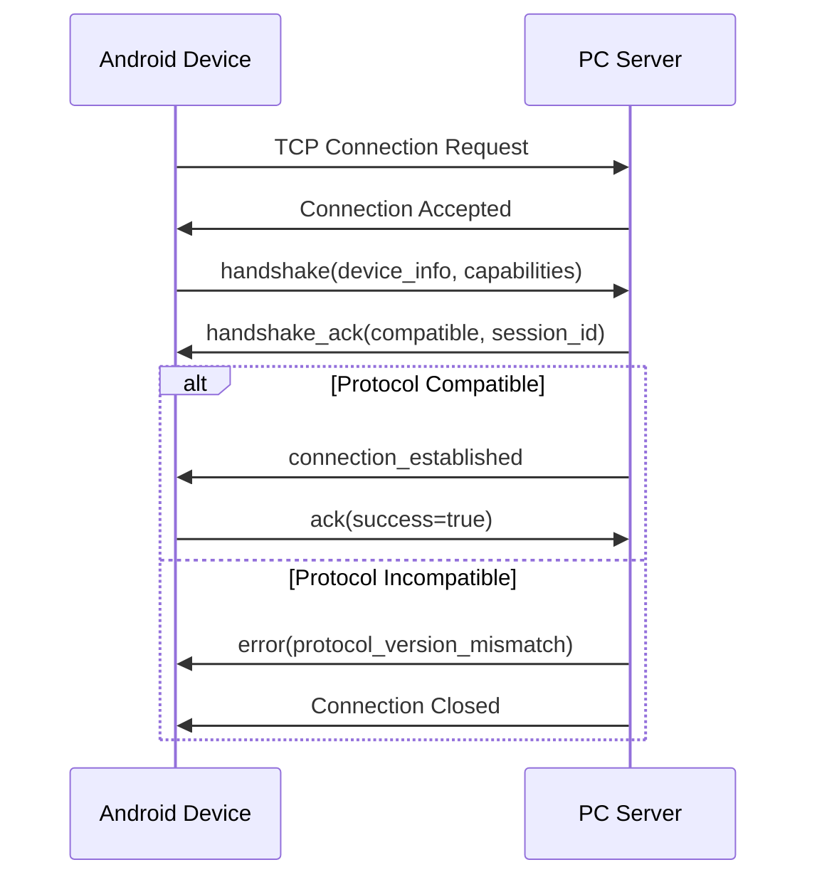
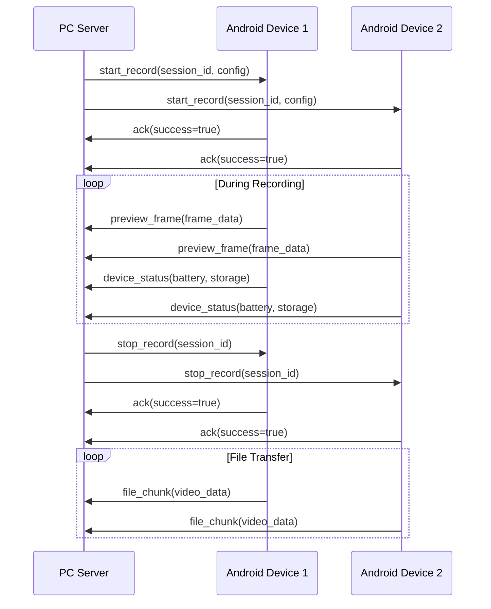
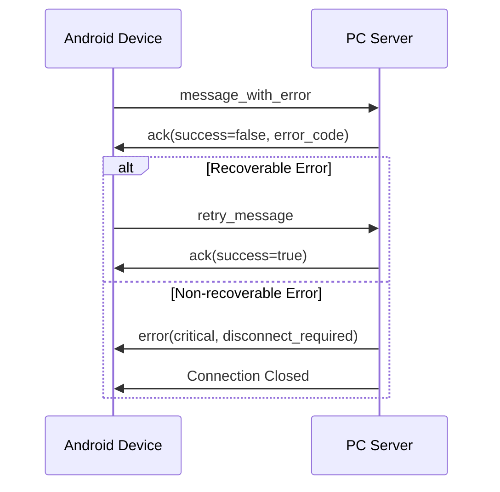

# Networking and Communication Protocol - Data Contracts and Message Specifications

## Table of Contents

- [Overview](#overview)
- [Protocol Foundation](#protocol-foundation)
- [Core Message Types](#core-message-types)
- [Protocol Flow Patterns](#protocol-flow-patterns)
- [Data Format Specifications](#data-format-specifications)
- [Configuration Parameters](#configuration-parameters)

## Overview

This document defines the comprehensive data contracts, message formats, and network protocols used for communication between the PC controller and Android devices in the Multi-Sensor Recording System. All communication follows a standardized JSON-based protocol with strict schema validation and versioning support.

## Protocol Foundation

### Transport Layer
- **Primary Protocol**: TCP sockets with length-prefixed framing
- **Secondary Protocol**: WebSocket support for web-based interfaces
- **Message Format**: JSON with UTF-8 encoding
- **Framing**: 4-byte length header (big-endian) followed by JSON payload
- **Port Configuration**: Default port 9000 (configurable)
- **Connection Model**: Multi-client server architecture

### Message Structure
All messages follow a consistent base structure with mandatory fields:

```json
{
  "type": "message_type",
  "timestamp": 1638360000123,
  "protocol_version": 1,
  "message_id": "uuid-string",
  "data": { ... }
}
```

## Core Message Types

### 1. Connection Management Messages

#### Handshake Request
**Direction**: Android Device → PC Server  
**Purpose**: Establish connection and negotiate capabilities

| Field Name | Data Type | Required | Description |
|------------|-----------|----------|-------------|
| type | string | ✓ | Always "handshake" |
| timestamp | number | ✓ | Unix timestamp in milliseconds |
| protocol_version | integer | ✓ | Protocol version number (current: 1) |
| device_name | string | ✓ | Unique device identifier |
| app_version | string | ✓ | Android application version |
| device_type | string | ✓ | Always "android" |
| device_info | object | ✓ | Device hardware and OS information |
| capabilities | array | ✓ | List of supported device capabilities |

**Example**:
```json
{
  "type": "handshake",
  "timestamp": 1638360000123,
  "protocol_version": 1,
  "device_name": "Samsung_Galaxy_S21_001",
  "app_version": "1.2.3",
  "device_type": "android",
  "device_info": {
    "model": "Samsung Galaxy S21",
    "os_version": "Android 12",
    "build_number": "SP1A.210812.016",
    "api_level": 31,
    "total_memory_mb": 8192,
    "available_storage_gb": 64.5
  },
  "capabilities": [
    "recording",
    "streaming", 
    "thermal_imaging",
    "sensor_fusion",
    "calibration"
  ]
}
```

#### Handshake Acknowledgment
**Direction**: PC Server → Android Device  
**Purpose**: Confirm connection and provide server information

| Field Name | Data Type | Required | Description |
|------------|-----------|----------|-------------|
| type | string | ✓ | Always "handshake_ack" |
| timestamp | number | ✓ | Unix timestamp in milliseconds |
| protocol_version | integer | ✓ | Server protocol version |
| server_name | string | ✓ | Server identifier |
| server_version | string | ✓ | Server application version |
| compatible | boolean | ✓ | Protocol compatibility status |
| message | string | ○ | Compatibility message or warnings |
| session_id | string | ✓ | Assigned session identifier |
| server_capabilities | array | ✓ | List of server-supported features |

**Example**:
```json
{
  "type": "handshake_ack",
  "timestamp": 1638360000150,
  "protocol_version": 1,
  "server_name": "MultiSensor_PC_Controller",
  "server_version": "2.1.0",
  "compatible": true,
  "message": "Connection established successfully",
  "session_id": "session_20240131_143022_001",
  "server_capabilities": [
    "multi_device_coordination",
    "real_time_streaming",
    "file_transfer",
    "calibration_management",
    "time_synchronization"
  ]
}
```

### 2. Recording Control Messages

#### Start Recording Command
**Direction**: PC Server → Android Device  
**Purpose**: Initiate synchronized recording across devices

| Field Name | Data Type | Required | Description |
|------------|-----------|----------|-------------|
| type | string | ✓ | Always "start_record" |
| timestamp | number | ✓ | Unix timestamp in milliseconds |
| session_id | string | ✓ | Unique recording session identifier |
| sync_timestamp | number | ✓ | Precise synchronization timestamp |
| recording_config | object | ✓ | Recording parameters and settings |
| output_directory | string | ✓ | Target directory for recorded files |
| estimated_duration | number | ○ | Expected recording duration in seconds |

**Recording Configuration Object**:
```json
{
  "recording_config": {
    "video": {
      "resolution": {
        "width": 1920,
        "height": 1080
      },
      "frame_rate": 30,
      "bitrate": 5000000,
      "codec": "h264",
      "quality": "high"
    },
    "audio": {
      "sample_rate": 44100,
      "channels": 2,
      "bit_depth": 16,
      "codec": "aac",
      "bitrate": 128000
    },
    "sensors": {
      "accelerometer": true,
      "gyroscope": true,
      "magnetometer": true,
      "ambient_light": true,
      "proximity": true,
      "sample_rate_hz": 100
    }
  }
}
```

#### Stop Recording Command
**Direction**: PC Server → Android Device  
**Purpose**: End recording session and initiate file transfer

| Field Name | Data Type | Required | Description |
|------------|-----------|----------|-------------|
| type | string | ✓ | Always "stop_record" |
| timestamp | number | ✓ | Unix timestamp in milliseconds |
| session_id | string | ✓ | Session identifier from start command |
| finalize_immediately | boolean | ○ | Whether to finalize files immediately |
| transfer_files | boolean | ✓ | Whether to initiate file transfer |

### 3. Data Streaming Messages

#### Preview Frame Data
**Direction**: Android Device → PC Server  
**Purpose**: Real-time video preview streaming

| Field Name | Data Type | Required | Description |
|------------|-----------|----------|-------------|
| type | string | ✓ | Always "preview_frame" |
| timestamp | number | ✓ | Frame capture timestamp |
| frame_id | integer | ✓ | Sequential frame counter |
| image_data | string | ✓ | Base64 encoded JPEG image data |
| width | integer | ✓ | Frame width in pixels |
| height | integer | ✓ | Frame height in pixels |
| compression_quality | integer | ○ | JPEG compression quality (1-100) |
| capture_metadata | object | ○ | Additional capture information |

**Example**:
```json
{
  "type": "preview_frame",
  "timestamp": 1638360001234,
  "frame_id": 1234,
  "image_data": "/9j/4AAQSkZJRgABAQAAAQ...", 
  "width": 1920,
  "height": 1080,
  "compression_quality": 85,
  "capture_metadata": {
    "exposure_time": "1/60",
    "iso": 400,
    "focal_length": "4.25mm",
    "white_balance": "auto"
  }
}
```

#### File Chunk Transfer
**Direction**: Android Device → PC Server  
**Purpose**: Transfer recorded files in chunks

| Field Name | Data Type | Required | Description |
|------------|-----------|----------|-------------|
| type | string | ✓ | Always "file_chunk" |
| timestamp | number | ✓ | Unix timestamp in milliseconds |
| file_id | string | ✓ | Unique file identifier |
| filename | string | ✓ | Original filename |
| chunk_index | integer | ✓ | Sequential chunk number (0-based) |
| total_chunks | integer | ✓ | Total number of chunks for file |
| chunk_data | string | ✓ | Base64 encoded binary data |
| chunk_size | integer | ✓ | Size of chunk before encoding |
| file_type | string | ✓ | Type: "video", "audio", "sensor", "metadata" |
| file_metadata | object | ○ | File properties and information |
| checksum | string | ✓ | CRC32 checksum for chunk integrity |

**File Metadata Object**:
```json
{
  "file_metadata": {
    "total_size": 15728640,
    "duration_seconds": 120.5,
    "creation_time": 1638360000000,
    "codec": "h264",
    "bitrate": 5000000,
    "mime_type": "video/mp4"
  }
}
```

### 4. Status and Monitoring Messages

#### Device Status Update
**Direction**: Android Device → PC Server  
**Purpose**: Regular device health and status reporting

| Field Name | Data Type | Required | Description |
|------------|-----------|----------|-------------|
| type | string | ✓ | Always "device_status" |
| timestamp | number | ✓ | Unix timestamp in milliseconds |
| device_id | string | ✓ | Device identifier |
| status | string | ✓ | Current status: "idle", "recording", "processing", "error" |
| battery_level | number | ✓ | Battery percentage (0-100) |
| storage_available | number | ✓ | Available storage in MB |
| temperature | number | ○ | Device temperature in Celsius |
| memory_usage | object | ○ | Memory utilization information |
| network_quality | object | ○ | Network performance metrics |
| active_sensors | array | ○ | List of currently active sensors |

**Example**:
```json
{
  "type": "device_status",
  "timestamp": 1638360002000,
  "device_id": "Samsung_Galaxy_S21_001",
  "status": "recording",
  "battery_level": 85.5,
  "storage_available": 24576,
  "temperature": 35.2,
  "memory_usage": {
    "total_mb": 8192,
    "available_mb": 3840,
    "app_usage_mb": 512
  },
  "network_quality": {
    "signal_strength": -45,
    "link_speed_mbps": 150,
    "latency_ms": 12
  },
  "active_sensors": [
    "accelerometer",
    "camera",
    "microphone"
  ]
}
```

#### Network Performance Metrics
**Direction**: Bidirectional  
**Purpose**: Monitor and optimize network performance

| Field Name | Data Type | Required | Description |
|------------|-----------|----------|-------------|
| type | string | ✓ | Always "network_metrics" |
| timestamp | number | ✓ | Unix timestamp in milliseconds |
| sender_id | string | ✓ | Identifier of sending device |
| latency_ms | number | ✓ | Round-trip latency in milliseconds |
| jitter_ms | number | ✓ | Latency variance in milliseconds |
| packet_loss_rate | number | ✓ | Packet loss percentage (0-1) |
| throughput_mbps | number | ✓ | Current throughput in Mbps |
| connection_quality | string | ✓ | Quality: "excellent", "good", "fair", "poor" |
| recommended_quality | string | ○ | Suggested streaming quality level |

### 5. Calibration Messages

#### Calibration Start Command
**Direction**: PC Server → Android Device  
**Purpose**: Initiate synchronized calibration process

| Field Name | Data Type | Required | Description |
|------------|-----------|----------|-------------|
| type | string | ✓ | Always "calibration_start" |
| timestamp | number | ✓ | Unix timestamp in milliseconds |
| calibration_id | string | ✓ | Unique calibration session identifier |
| pattern_type | string | ✓ | "chessboard", "circles", "asymmetric_circles" |
| pattern_size | object | ✓ | Pattern dimensions |
| capture_count | integer | ✓ | Number of calibration images to capture |
| capture_interval | number | ✓ | Time between captures in seconds |

**Pattern Size Object**:
```json
{
  "pattern_size": {
    "rows": 7,
    "cols": 6,
    "square_size_mm": 24.5
  }
}
```

#### Calibration Result
**Direction**: Android Device → PC Server  
**Purpose**: Report calibration completion and results

| Field Name | Data Type | Required | Description |
|------------|-----------|----------|-------------|
| type | string | ✓ | Always "calibration_result" |
| timestamp | number | ✓ | Unix timestamp in milliseconds |
| calibration_id | string | ✓ | Calibration session identifier |
| success | boolean | ✓ | Whether calibration was successful |
| rms_error | number | ○ | RMS reprojection error in pixels |
| camera_matrix | array | ○ | 3x3 camera intrinsic matrix |
| distortion_coefficients | array | ○ | Lens distortion coefficients |
| images_used | integer | ○ | Number of images used in calibration |
| error_message | string | ○ | Error description if success=false |

### 6. Enhanced Command Protocol with Acknowledgments

#### Extended Command Message Format
**Direction**: Bidirectional  
**Purpose**: Enhanced command execution with reliable delivery and priority support

| Field Name | Data Type | Required | Description |
|------------|-----------|----------|-------------|
| type | string | ✓ | Always "command" |
| command | string | ✓ | Command name (START, STOP, CALIBRATE, STATUS, PING, SYNC_TIME, SET_QUALITY, EMERGENCY_STOP) |
| parameters | object | ○ | Command-specific parameters |
| timestamp | number | ✓ | Unix timestamp in milliseconds |
| message_id | string | ✓ | UUID for acknowledgment tracking |
| require_ack | boolean | ○ | Whether acknowledgment is required (default: false) |
| timeout_seconds | integer | ○ | Acknowledgment timeout (default: 30) |
| priority | string | ○ | Message priority (EMERGENCY, HIGH, NORMAL, LOW) |
| retry_count | integer | ○ | Number of retry attempts (default: 3) |

**Enhanced Command Types**:

| Command | Description | Parameters | Priority | Use Case |
|---------|-------------|------------|----------|-----------|
| `START` | Start recording session | `mode`, `duration`, `sensors`, `quality`, `sync_devices` | HIGH | Begin data collection |
| `STOP` | Stop current recording | `finalize_immediately`, `transfer_files` | HIGH | End data collection |
| `CALIBRATE` | Calibrate sensors | `sensor`, `type`, `target_values`, `pattern_config` | NORMAL | Sensor calibration |
| `STATUS` | Request device status | `include_performance`, `include_sensors` | LOW | Health monitoring |
| `PING` | Connection test | `payload_size`, `sequence_number` | LOW | Latency measurement |
| `SYNC_TIME` | Time synchronization | `server_timestamp`, `ntp_offset`, `drift_correction` | HIGH | Clock alignment |
| `SET_QUALITY` | Adjust streaming quality | `quality_level`, `adaptive_mode`, `bandwidth_limit` | NORMAL | Performance tuning |
| `EMERGENCY_STOP` | Emergency session halt | `reason`, `preserve_data` | EMERGENCY | Crisis response |

**Example Enhanced Command**:
```json
{
  "type": "command",
  "command": "START",
  "parameters": {
    "mode": "multi_modal_recording",
    "duration": 300,
    "sensors": ["GSR", "thermal", "accelerometer", "gyroscope"],
    "quality": "high",
    "sync_devices": true,
    "output_format": "h264",
    "compression_level": 0.85
  },
  "timestamp": 1638360000123,
  "message_id": "550e8400-e29b-41d4-a716-446655440000",
  "require_ack": true,
  "timeout_seconds": 45,
  "priority": "HIGH",
  "retry_count": 3
}
```

#### Enhanced Acknowledgment Response
**Direction**: Response to Command  
**Purpose**: Detailed command execution status and results

| Field Name | Data Type | Required | Description |
|------------|-----------|----------|-------------|
| type | string | ✓ | Always "acknowledgment" |
| ack_message_id | string | ✓ | Original command message ID |
| status | string | ✓ | Execution status (success, error, partial, timeout) |
| timestamp | number | ✓ | Response timestamp |
| execution_time_ms | number | ○ | Command execution duration |
| result | object | ○ | Command-specific result data |
| error_details | object | ○ | Detailed error information |
| performance_metrics | object | ○ | Execution performance data |

**Example Enhanced Acknowledgment**:
```json
{
  "type": "acknowledgment",
  "ack_message_id": "550e8400-e29b-41d4-a716-446655440000",
  "status": "success",
  "timestamp": 1638360000234,
  "execution_time_ms": 78,
  "result": {
    "recording_started": true,
    "session_id": "rec_20240131_143022_001",
    "active_sensors": ["GSR", "thermal", "accelerometer", "gyroscope"],
    "estimated_file_size_mb": 245,
    "recording_path": "/storage/emulated/0/recordings/",
    "sync_status": "synchronized"
  },
  "performance_metrics": {
    "memory_allocated_mb": 156,
    "cpu_usage_percent": 18.5,
    "storage_write_speed_mbps": 23.4
  }
}
```

### 7. Security and Authentication Messages

#### SSL/TLS Handshake Enhancement
**Direction**: Bidirectional  
**Purpose**: Negotiate encryption parameters and security features

| Field Name | Data Type | Required | Description |
|------------|-----------|----------|-------------|
| type | string | ✓ | Always "ssl_negotiation" |
| tls_version | string | ✓ | Minimum TLS version (1.2, 1.3) |
| cipher_suites | array | ✓ | Supported cipher suites |
| certificate_required | boolean | ✓ | Whether client certificate is required |
| compression_enabled | boolean | ○ | Whether to enable TLS compression |
| perfect_forward_secrecy | boolean | ○ | Require PFS cipher suites |
| certificate_fingerprint | string | ○ | Expected certificate fingerprint |

**Example SSL Negotiation**:
```json
{
  "type": "ssl_negotiation",
  "tls_version": "1.2",
  "cipher_suites": [
    "ECDHE-RSA-AES256-GCM-SHA384",
    "ECDHE-RSA-CHACHA20-POLY1305",
    "ECDHE-RSA-AES128-GCM-SHA256"
  ],
  "certificate_required": false,
  "compression_enabled": false,
  "perfect_forward_secrecy": true,
  "certificate_fingerprint": "sha256:1A2B3C4D5E..."
}
```

#### Rate Limit Status
**Direction**: PC Server → Android Device  
**Purpose**: Inform device about rate limiting status

| Field Name | Data Type | Required | Description |
|------------|-----------|----------|-------------|
| type | string | ✓ | Always "rate_limit_status" |
| timestamp | number | ✓ | Unix timestamp in milliseconds |
| device_id | string | ✓ | Target device identifier |
| current_requests | integer | ✓ | Current request count in window |
| max_requests | integer | ✓ | Maximum allowed requests per window |
| window_size_seconds | integer | ✓ | Rate limiting window size |
| reset_time | number | ✓ | Timestamp when limit resets |
| warning_threshold | number | ○ | Percentage threshold for warnings |

**Example Rate Limit Status**:
```json
{
  "type": "rate_limit_status",
  "timestamp": 1638360003000,
  "device_id": "samsung_galaxy_s21_001",
  "current_requests": 45,
  "max_requests": 60,
  "window_size_seconds": 60,
  "reset_time": 1638360060000,
  "warning_threshold": 0.8
}
```

### 8. Performance Monitoring and Analytics

#### Comprehensive Network Metrics
**Direction**: Android Device → PC Server  
**Purpose**: Detailed network performance analytics

| Field Name | Data Type | Required | Description |
|------------|-----------|----------|-------------|
| type | string | ✓ | Always "network_analytics" |
| timestamp | number | ✓ | Measurement timestamp |
| reporting_period_ms | integer | ✓ | Metrics collection period |
| bandwidth_metrics | object | ✓ | Bandwidth measurement data |
| latency_metrics | object | ✓ | Latency and timing data |
| reliability_metrics | object | ✓ | Connection reliability data |
| quality_assessment | object | ✓ | Overall quality evaluation |

**Bandwidth Metrics Object**:
```json
{
  "bandwidth_metrics": {
    "available_mbps": 45.2,
    "utilized_mbps": 12.8,
    "peak_mbps": 48.1,
    "minimum_mbps": 8.3,
    "average_mbps": 28.5,
    "measurement_method": "active_probing"
  }
}
```

**Latency Metrics Object**:
```json
{
  "latency_metrics": {
    "rtt_ms": 12.5,
    "jitter_ms": 2.1,
    "min_latency_ms": 8.2,
    "max_latency_ms": 24.7,
    "p50_latency_ms": 11.8,
    "p95_latency_ms": 18.9,
    "p99_latency_ms": 23.4,
    "sample_count": 100
  }
}
```

**Reliability Metrics Object**:
```json
{
  "reliability_metrics": {
    "packet_loss_percent": 0.05,
    "connection_drops": 0,
    "timeout_count": 2,
    "successful_transmissions": 9847,
    "failed_transmissions": 5,
    "retransmission_rate": 0.001,
    "uptime_percent": 99.98
  }
}
```

### 9. Advanced Error Handling

#### Detailed Error Message
**Direction**: Bidirectional  
**Purpose**: Comprehensive error reporting with context and recovery suggestions

| Field Name | Data Type | Required | Description |
|------------|-----------|----------|-------------|
| type | string | ✓ | Always "error" |
| timestamp | number | ✓ | Error occurrence timestamp |
| error_code | string | ✓ | Standardized error code |
| error_category | string | ✓ | Error category (NETWORK, PROTOCOL, DEVICE, SECURITY) |
| severity | string | ✓ | Error severity (CRITICAL, HIGH, MEDIUM, LOW) |
| message | string | ✓ | Human-readable error description |
| context | object | ○ | Additional error context |
| suggested_actions | array | ○ | Recommended recovery actions |
| related_message_id | string | ○ | ID of message that caused error |

**Error Code Classification**:

| Category | Code Range | Examples |
|----------|------------|----------|
| NETWORK | NET_001-NET_999 | NET_001: Connection timeout, NET_002: DNS resolution failed |
| PROTOCOL | PROT_001-PROT_999 | PROT_001: Invalid message format, PROT_002: Unsupported protocol version |
| DEVICE | DEV_001-DEV_999 | DEV_001: Insufficient storage, DEV_002: Sensor initialization failed |
| SECURITY | SEC_001-SEC_999 | SEC_001: Certificate validation failed, SEC_002: Rate limit exceeded |

**Example Detailed Error**:
```json
{
  "type": "error",
  "timestamp": 1638360004000,
  "error_code": "NET_005",
  "error_category": "NETWORK",
  "severity": "HIGH",
  "message": "Network connection unstable: high packet loss detected",
  "context": {
    "packet_loss_percent": 15.2,
    "connection_type": "WiFi",
    "signal_strength_dbm": -78,
    "affected_operations": ["streaming", "file_transfer"]
  },
  "suggested_actions": [
    "Move closer to WiFi access point",
    "Switch to mobile data if available",
    "Reduce streaming quality",
    "Retry connection in 30 seconds"
  ],
  "related_message_id": "msg_789012"
}
```

### 10. Acknowledgment and Error Messages

#### Generic Acknowledgment
**Direction**: Bidirectional  
**Purpose**: Confirm message receipt and processing status

| Field Name | Data Type | Required | Description |
|------------|-----------|----------|-------------|
| type | string | ✓ | Always "ack" |
| timestamp | number | ✓ | Unix timestamp in milliseconds |
| message_id | string | ✓ | ID of acknowledged message |
| original_type | string | ✓ | Type of original message |
| success | boolean | ✓ | Processing success status |
| error_code | string | ○ | Error code if success=false |
| error_message | string | ○ | Human-readable error description |
| processing_time_ms | number | ○ | Time taken to process message |

#### Error Report
**Direction**: Bidirectional  
**Purpose**: Report errors and exception conditions

| Field Name | Data Type | Required | Description |
|------------|-----------|----------|-------------|
| type | string | ✓ | Always "error" |
| timestamp | number | ✓ | Unix timestamp in milliseconds |
| error_type | string | ✓ | Error category: "network", "hardware", "software", "protocol" |
| error_code | string | ✓ | Specific error identifier |
| error_message | string | ✓ | Detailed error description |
| severity | string | ✓ | Severity: "critical", "error", "warning", "info" |
| context | object | ○ | Additional error context information |
| stack_trace | string | ○ | Stack trace for debugging |
| recovery_suggestion | string | ○ | Suggested recovery action |

## Protocol Flow Patterns

### Connection Establishment Flow



### Recording Session Flow



### Error Handling Flow



## Data Format Specifications

### Timestamp Format
All timestamps use Unix time in milliseconds (UTC):
- **Format**: 64-bit integer
- **Example**: 1638360000123 (2021-12-01 12:00:00.123 UTC)
- **Precision**: Millisecond level
- **Timezone**: Always UTC

### Binary Data Encoding
Binary data (images, files) is encoded using Base64:
- **Encoding**: RFC 4648 Base64
- **Padding**: Required
- **Line Breaks**: Not allowed
- **Chunk Size**: Maximum 1MB before encoding

### Checksum Calculation
File integrity verification uses CRC32:
- **Algorithm**: CRC-32 (IEEE 802.3)
- **Format**: 8-character hexadecimal string
- **Scope**: Applied to raw binary data before Base64 encoding

## Configuration Parameters

### Network Configuration

```json
{
  "network": {
    "host": "192.168.0.100",
    "port": 9000,
    "protocol": "TCP",
    "timeout_seconds": 30,
    "buffer_size": 8192,
    "max_connections": 10,
    "heartbeat_interval": 5,
    "reconnect_attempts": 3,
    "use_ssl": false,
    "ssl_cert_path": "",
    "ssl_key_path": ""
  }
}
```

### Message Validation Rules

1. **Required Fields**: All required fields must be present
2. **Data Types**: Strict type checking enforced
3. **String Length**: Maximum 1MB for string fields
4. **Array Size**: Maximum 1000 elements in arrays
5. **Nesting Depth**: Maximum 10 levels of object nesting
6. **Timestamp Range**: Must be within ±24 hours of current time
7. **Message Size**: Maximum 10MB total message size

### Error Codes Reference

| Error Code | Category | Description | Recovery Action |
|------------|----------|-------------|-----------------|
| NET_001 | Network | Connection timeout | Retry connection |
| NET_002 | Network | Connection refused | Check server status |
| NET_003 | Network | Data corruption | Resend message |
| PROTO_001 | Protocol | Invalid message format | Fix message structure |
| PROTO_002 | Protocol | Unsupported protocol version | Update application |
| PROTO_003 | Protocol | Missing required field | Add missing field |
| HW_001 | Hardware | Camera access denied | Grant camera permission |
| HW_002 | Hardware | Insufficient storage | Free storage space |
| HW_003 | Hardware | Low battery | Charge device |
| SW_001 | Software | Processing timeout | Retry operation |
| SW_002 | Software | Memory allocation failure | Restart application |

This protocol specification provides a comprehensive framework for reliable, high-performance communication between PC and Android components in the Multi-Sensor Recording System. All implementations must adhere to these specifications to ensure compatibility and interoperability.