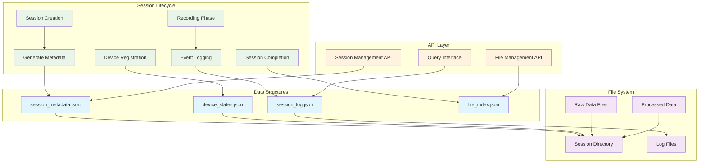

# Session Management and Data Storage - Protocol Documentation

## Table of Contents

- [Overview](#overview)
- [Session Metadata Schema](#session-metadata-schema)
- [Session Event Log Schema](#session-event-log-schema)
- [File Naming Conventions](#file-naming-conventions)
- [Directory Structure Protocol](#directory-structure-protocol)
- [Session Management API](#session-management-api)
- [Network Protocol Messages](#network-protocol-messages)
- [Data Format Specifications](#data-format-specifications)

## Overview

This document defines the data contracts, file formats, network protocols, and APIs used by the Session Management and Data Storage System. It serves as the authoritative reference for developers implementing integrations or extending the system functionality.

## Session Metadata Schema

### Session Management Data Flow



### session_metadata.json Format

The session metadata file follows a standardized JSON schema that ensures consistency across all recording sessions:

```json
{
  "$schema": "http://json-schema.org/draft-07/schema#",
  "title": "Session Metadata",
  "type": "object",
  "required": ["session_id", "session_name", "folder_path", "start_time", "status", "devices", "files"],
  "properties": {
    "session_id": {
      "type": "string",
      "pattern": "^[a-zA-Z0-9_-]+_\\d{8}_\\d{6}$",
      "description": "Unique session identifier with timestamp"
    },
    "session_name": {
      "type": "string",
      "minLength": 1,
      "description": "Human-readable session name"
    },
    "folder_path": {
      "type": "string",
      "description": "Full path to session folder"
    },
    "start_time": {
      "type": "string",
      "format": "date-time",
      "description": "Session start timestamp in ISO 8601 format"
    },
    "end_time": {
      "type": ["string", "null"],
      "format": "date-time",
      "description": "Session end timestamp in ISO 8601 format"
    },
    "duration": {
      "type": ["number", "null"],
      "minimum": 0,
      "description": "Session duration in seconds"
    },
    "status": {
      "type": "string",
      "enum": ["active", "completed", "error"],
      "description": "Current session status"
    }
  }
}
```

### Device Registration Schema

```json
{
  "devices": {
    "type": "object",
    "patternProperties": {
      "^[a-zA-Z0-9_-]+$": {
        "type": "object",
        "required": ["device_type", "capabilities", "added_time", "status"],
        "properties": {
          "device_type": {
            "type": "string",
            "enum": ["android_phone", "pc_webcam", "shimmer_gsr", "thermal_camera"]
          },
          "capabilities": {
            "type": "array",
            "items": {
              "type": "string",
              "enum": ["rgb_video", "thermal_video", "gsr_data", "webcam_video", "motion_data", "audio_recording"]
            }
          },
          "added_time": {
            "type": "string",
            "format": "date-time"
          },
          "status": {
            "type": "string",
            "enum": ["connected", "disconnected", "error"]
          }
        }
      }
    }
  }
}
```

### File Tracking Schema

```json
{
  "files": {
    "type": "object",
    "patternProperties": {
      "^[a-zA-Z0-9_-]+$": {
        "type": "array",
        "items": {
          "type": "object",
          "required": ["file_type", "file_path", "created_time"],
          "properties": {
            "file_type": {
              "type": "string",
              "enum": ["rgb_video", "thermal_video", "webcam_video", "gsr_data", "motion_data", "audio_recording", "calibration_image"]
            },
            "file_path": {
              "type": "string",
              "description": "Relative path from session folder"
            },
            "file_size": {
              "type": ["number", "null"],
              "minimum": 0
            },
            "created_time": {
              "type": "string",
              "format": "date-time"
            }
          }
        }
      }
    }
  }
}
```

## Session Event Log Schema

### Event Log Structure

The session event log uses a structured JSON format to capture all session activities:

```json
{
  "session": "string",
  "session_name": "string", 
  "start_time": "ISO 8601 timestamp",
  "end_time": "ISO 8601 timestamp",
  "duration": "number in seconds",
  "devices": ["array of device IDs"],
  "events": ["array of event objects"],
  "calibration_files": ["array of filenames"],
  "status": "active|completed|error"
}
```

### Event Object Schema

Each event in the log follows this standardized structure:

```json
{
  "event": "string - event type",
  "time": "HH:MM:SS.mmm - human readable time",
  "timestamp": "ISO 8601 full timestamp",
  "additional_fields": "event-specific data"
}
```

### Standard Event Types

#### Session Lifecycle Events

**session_start**
```json
{
  "event": "session_start",
  "time": "14:30:22.123",
  "timestamp": "2025-07-31T14:30:22.123456",
  "session_id": "experiment_A_20250731_143022",
  "devices": ["phone_1", "webcam_1"]
}
```

**session_end**
```json
{
  "event": "session_end",
  "time": "14:32:45.789",
  "timestamp": "2025-07-31T14:32:45.789012"
}
```

#### Device Events

**device_connected**
```json
{
  "event": "device_connected",
  "time": "14:30:15.456",
  "timestamp": "2025-07-31T14:30:15.456789",
  "device": "phone_1",
  "device_type": "android_phone",
  "capabilities": ["rgb_video", "thermal_video", "gsr_data"]
}
```

**device_disconnected**
```json
{
  "event": "device_disconnected",
  "time": "14:32:50.123",
  "timestamp": "2025-07-31T14:32:50.123456",
  "device": "phone_1",
  "reason": "user_initiated"
}
```

**device_ack**
```json
{
  "event": "device_ack",
  "time": "14:30:26.789",
  "timestamp": "2025-07-31T14:30:26.789012",
  "device": "phone_1",
  "command": "start_record"
}
```

#### Recording Events

**start_record**
```json
{
  "event": "start_record",
  "time": "14:30:25.456",
  "timestamp": "2025-07-31T14:30:25.456789",
  "devices": ["phone_1", "webcam_1"],
  "session": "experiment_A_20250731_143022"
}
```

**stop_record**
```json
{
  "event": "stop_record",
  "time": "14:32:42.012",
  "timestamp": "2025-07-31T14:32:42.012345"
}
```

#### File Events

**file_received**
```json
{
  "event": "file_received",
  "time": "14:32:45.234",
  "timestamp": "2025-07-31T14:32:45.234567",
  "device": "phone_1",
  "filename": "phone_1_rgb_20250731_143022.mp4",
  "file_type": "rgb_video",
  "size": 157286400
}
```

#### Stimulus Events

**stimulus_play**
```json
{
  "event": "stimulus_play",
  "time": "14:31:10.789",
  "timestamp": "2025-07-31T14:31:10.789012",
  "media": "stress_video.mp4",
  "media_path": "/stimuli/stress_video.mp4"
}
```

**stimulus_stop**
```json
{
  "event": "stimulus_stop",
  "time": "14:31:45.012",
  "timestamp": "2025-07-31T14:31:45.012345",
  "media": "stress_video.mp4"
}
```

#### Marker Events

**marker**
```json
{
  "event": "marker",
  "time": "14:31:10.789",
  "timestamp": "2025-07-31T14:31:10.789012",
  "label": "stimulus_start",
  "stim_time": "00:00:45.333"
}
```

#### Calibration Events

**calibration_capture**
```json
{
  "event": "calibration_capture",
  "time": "14:29:45.123",
  "timestamp": "2025-07-31T14:29:45.123456",
  "device": "phone_1",
  "file": "phone_1_calibration_001.jpg"
}
```

**calibration_done**
```json
{
  "event": "calibration_done",
  "time": "14:29:55.789",
  "timestamp": "2025-07-31T14:29:55.789012",
  "result_file": "calibration_results.json"
}
```

#### Error Events

**error**
```json
{
  "event": "error",
  "time": "14:31:30.456",
  "timestamp": "2025-07-31T14:31:30.456789",
  "error_type": "connection_lost",
  "message": "Device phone_1 connection timeout",
  "device": "phone_1"
}
```

## File Naming Conventions

### Session Directory Naming

**Format:** `[custom_name_]YYYYMMDD_HHMMSS`

**Rules:**
- Custom names are sanitized: only alphanumeric, hyphens, and underscores
- Spaces converted to underscores
- Maximum length: 50 characters for custom name
- Timestamp always appended for uniqueness

**Examples:**
```
session_20250731_143022
experiment_A_20250731_143022
stress_study_baseline_20250731_143022
```

### Device File Naming

**Format:** `[device_id]_[file_type]_YYYYMMDD_HHMMSS.[extension]`

**Device ID Patterns:**
- `phone_1`, `phone_2`, ... for mobile devices
- `webcam_1`, `webcam_2`, ... for PC webcams
- `shimmer_1`, `shimmer_2`, ... for GSR sensors

**File Type Identifiers:**
- `rgb` - Standard color video
- `thermal` - Thermal imaging video
- `gsr` - Galvanic skin response data
- `motion` - Accelerometer/gyroscope data
- `audio` - Audio recordings
- `calibration` - Calibration images

**Examples:**
```
phone_1_rgb_20250731_143022.mp4
phone_1_thermal_20250731_143022.mp4
phone_1_gsr_20250731_143022.csv
webcam_1_20250731_143022.mp4
shimmer_1_gsr_20250731_143022.csv
```

## Directory Structure Protocol

### Standard Session Structure

Every session follows this mandatory directory structure:

```
session_YYYYMMDD_HHMMSS/
├── session_metadata.json                    # Required: Session metadata
├── session_YYYYMMDD_HHMMSS_log.json        # Required: Event log
├── devices/                                 # Required: Device data folder
│   ├── phone_1/                            # Device-specific folder
│   │   ├── rgb_videos/                     # Video files by type
│   │   ├── thermal_videos/
│   │   └── sensor_data/                    # Sensor data files
│   └── phone_2/                            # Additional devices
├── webcam/                                  # PC webcam recordings
├── processing/                              # Optional: Post-processing results
│   ├── hand_segmentation/
│   └── synchronized_data/
└── exports/                                 # Optional: Export formats
    ├── csv/
    └── matlab/
```

### Folder Creation Rules

1. **Base Structure**: Always created during session initialization
2. **Device Folders**: Created when devices are added to session
3. **Type Folders**: Created when first file of that type is recorded
4. **Processing Folders**: Created during post-processing operations
5. **Export Folders**: Created during data export operations

### File Path Resolution

All file paths in metadata are relative to the session folder:

```json
{
  "file_path": "devices/phone_1/rgb_videos/phone_1_rgb_20250731_143022.mp4"
}
```

Absolute path construction:
```
{session_folder_path} + "/" + {relative_file_path}
```

## Session Management API

### SessionManager Class Interface

```python
class SessionManager:
    def __init__(self, base_recordings_dir: str = "recordings")
    
    def create_session(self, session_name: Optional[str] = None) -> Dict
    def end_session(self) -> Optional[Dict]
    def get_current_session(self) -> Optional[Dict]
    
    def add_device_to_session(self, device_id: str, device_type: str, capabilities: List[str])
    def add_file_to_session(self, device_id: str, file_type: str, file_path: str, file_size: Optional[int] = None)
    
    def get_session_folder(self, session_id: Optional[str] = None) -> Optional[Path]
    
    @staticmethod
    def validate_session_name(session_name: str) -> bool
    @staticmethod
    def generate_device_filename(device_id: str, file_type: str, extension: str, timestamp: Optional[datetime] = None) -> str
```

### SessionLogger Class Interface

```python
class SessionLogger(QObject):
    # Qt Signals
    log_entry_added = pyqtSignal(str)
    session_started = pyqtSignal(str)
    session_ended = pyqtSignal(str, float)
    error_logged = pyqtSignal(str, str)
    
    def __init__(self, base_sessions_dir: str = "recordings")
    
    def start_session(self, session_name: Optional[str] = None, devices: Optional[List[Dict]] = None) -> Dict
    def end_session(self) -> Optional[Dict]
    
    def log_event(self, event_type: str, details: Optional[Dict] = None)
    
    # Convenience methods for common events
    def log_device_connected(self, device_id: str, device_type: str = "unknown", capabilities: Optional[List[str]] = None)
    def log_device_disconnected(self, device_id: str, reason: str = "unknown")
    def log_recording_start(self, devices: List[str], session_id: Optional[str] = None)
    def log_recording_stop(self)
    def log_device_ack(self, device_id: str, command: str = "start_record")
    def log_stimulus_play(self, media_name: str, media_path: Optional[str] = None)
    def log_stimulus_stop(self, media_name: str)
    def log_marker(self, label: str, stim_time: Optional[str] = None)
    def log_file_received(self, device_id: str, filename: str, file_size: Optional[int] = None, file_type: str = "unknown")
    def log_calibration_capture(self, device_id: str, filename: str)
    def log_calibration_completed(self, result_file: Optional[str] = None)
    def log_error(self, error_type: str, message: str, device_id: Optional[str] = None)
    
    def get_current_session(self) -> Optional[Dict]
    def is_session_active(self) -> bool
```

## Network Protocol Messages

### Device Communication Protocol

Communication between the main controller and devices uses JSON messages over TCP sockets:

#### Session Management Messages

**START_SESSION**
```json
{
  "command": "START_SESSION",
  "session_id": "experiment_A_20250731_143022",
  "timestamp": "2025-07-31T14:30:22.123456",
  "recording_params": {
    "video_resolution": "1920x1080",
    "video_fps": 30,
    "audio_enabled": true
  }
}
```

**END_SESSION**
```json
{
  "command": "END_SESSION",
  "session_id": "experiment_A_20250731_143022",
  "timestamp": "2025-07-31T14:32:45.789012"
}
```

**SESSION_ACK**
```json
{
  "command": "SESSION_ACK", 
  "session_id": "experiment_A_20250731_143022",
  "device_id": "phone_1",
  "status": "ready|error",
  "message": "Session initialized successfully"
}
```

#### Recording Control Messages

**START_RECORDING**
```json
{
  "command": "START_RECORDING",
  "session_id": "experiment_A_20250731_143022",
  "sync_timestamp": "2025-07-31T14:30:25.456789",
  "countdown": 3
}
```

**STOP_RECORDING**
```json
{
  "command": "STOP_RECORDING",
  "session_id": "experiment_A_20250731_143022",
  "timestamp": "2025-07-31T14:32:42.012345"
}
```

**RECORDING_ACK**
```json
{
  "command": "RECORDING_ACK",
  "session_id": "experiment_A_20250731_143022", 
  "device_id": "phone_1",
  "action": "start|stop",
  "status": "success|error",
  "timestamp": "2025-07-31T14:30:26.789012"
}
```

#### File Transfer Messages

**FILE_TRANSFER_START**
```json
{
  "command": "FILE_TRANSFER_START",
  "session_id": "experiment_A_20250731_143022",
  "device_id": "phone_1",
  "filename": "phone_1_rgb_20250731_143022.mp4",
  "file_size": 157286400,
  "file_type": "rgb_video",
  "checksum": "sha256:abc123..."
}
```

**FILE_TRANSFER_COMPLETE**
```json
{
  "command": "FILE_TRANSFER_COMPLETE",
  "session_id": "experiment_A_20250731_143022",
  "device_id": "phone_1", 
  "filename": "phone_1_rgb_20250731_143022.mp4",
  "status": "success|error",
  "checksum": "sha256:abc123..."
}
```

### Stimulus Synchronization Messages

**STIMULUS_PLAY**
```json
{
  "command": "STIMULUS_PLAY",
  "session_id": "experiment_A_20250731_143022",
  "stimulus_id": "stress_video",
  "media_path": "/stimuli/stress_video.mp4",
  "sync_timestamp": "2025-07-31T14:31:10.789012"
}
```

**STIMULUS_STOP**
```json
{
  "command": "STIMULUS_STOP",
  "session_id": "experiment_A_20250731_143022",
  "stimulus_id": "stress_video",
  "timestamp": "2025-07-31T14:31:45.012345"
}
```

**MARKER**
```json
{
  "command": "MARKER",
  "session_id": "experiment_A_20250731_143022",
  "label": "stimulus_start",
  "timestamp": "2025-07-31T14:31:10.789012",
  "stim_time": "00:00:45.333"
}
```

## Data Format Specifications

### Video File Format

**Standard Parameters:**
- **Container**: MP4 (H.264)
- **Resolution**: 1920x1080 (configurable)
- **Frame Rate**: 30 fps (configurable)
- **Color Space**: YUV420P
- **Audio**: AAC 44.1kHz (if enabled)

**Thermal Video Parameters:**
- **Container**: MP4 (H.264)
- **Resolution**: Device-dependent (typically 640x480)
- **Frame Rate**: 30 fps
- **Color Map**: Embedded temperature data
- **Metadata**: Temperature calibration parameters

### Sensor Data Format

**GSR Data (CSV):**
```csv
timestamp,gsr_value,resistance,conductance,temperature
2025-07-31T14:30:25.000,2.45,408163.27,2.45e-06,23.5
2025-07-31T14:30:25.008,2.46,406504.07,2.46e-06,23.5
```

**Motion Data (CSV):**
```csv
timestamp,accel_x,accel_y,accel_z,gyro_x,gyro_y,gyro_z,mag_x,mag_y,mag_z
2025-07-31T14:30:25.000,0.123,-9.801,0.456,0.012,-0.003,0.008,45.2,-12.8,38.9
```

**Column Specifications:**
- **timestamp**: ISO 8601 format with millisecond precision
- **gsr_value**: Microsiemens (μS)
- **resistance**: Ohms (Ω)
- **conductance**: Siemens (S)
- **temperature**: Celsius (°C)
- **accel_***: m/s² acceleration values
- **gyro_***: rad/s angular velocity values
- **mag_***: μT magnetic field values

### Calibration Data Format

**Calibration Images:**
- **Format**: JPEG or PNG
- **Resolution**: Native device resolution
- **Naming**: `[device_id]_calibration_[sequence].jpg`
- **Metadata**: EXIF data preserved

**Calibration Results:**
```json
{
  "calibration_type": "stereo_camera",
  "device_id": "phone_1",
  "timestamp": "2025-07-31T14:29:55.789012",
  "parameters": {
    "camera_matrix": [[fx, 0, cx], [0, fy, cy], [0, 0, 1]],
    "distortion_coefficients": [k1, k2, p1, p2, k3],
    "reprojection_error": 0.234
  },
  "images_used": ["phone_1_calibration_001.jpg", "phone_1_calibration_002.jpg"],
  "success": true
}
```

## Post-Processing Data Contracts

### Hand Segmentation Results

**Directory Structure:**
```
processing/hand_segmentation/
├── segmentation_metadata.json
├── cropped_videos/
│   ├── phone_1_rgb_hands_20250731_143022.mp4
│   └── webcam_1_hands_20250731_143022.mp4
├── masks/
│   ├── phone_1_rgb_masks_20250731_143022.mp4
│   └── frame_masks/
│       ├── frame_0001.png
│       └── frame_0002.png
└── analysis/
    ├── hand_tracking_data.csv
    └── gesture_classification.json
```

**Segmentation Metadata:**
```json
{
  "processing_type": "hand_segmentation",
  "method": "mediapipe",
  "timestamp": "2025-07-31T14:35:00.123456",
  "input_files": ["devices/phone_1/rgb_videos/phone_1_rgb_20250731_143022.mp4"],
  "output_files": {
    "cropped_video": "processing/hand_segmentation/cropped_videos/phone_1_rgb_hands_20250731_143022.mp4",
    "mask_video": "processing/hand_segmentation/masks/phone_1_rgb_masks_20250731_143022.mp4",
    "tracking_data": "processing/hand_segmentation/analysis/hand_tracking_data.csv"
  },
  "parameters": {
    "confidence_threshold": 0.7,
    "max_hands": 2,
    "crop_margin": 50
  },
  "statistics": {
    "total_frames": 3600,
    "hands_detected": 3456,
    "detection_rate": 0.96
  }
}
```

### Synchronized Data Format

**Synchronization Metadata:**
```json
{
  "processing_type": "synchronization",
  "timestamp": "2025-07-31T14:35:30.456789",
  "devices": ["phone_1", "webcam_1"],
  "sync_method": "ntp_offset",
  "time_adjustments": {
    "phone_1": -0.123,
    "webcam_1": 0.045
  },
  "output_files": {
    "synchronized_timeline": "processing/synchronized_data/timeline.json",
    "aligned_data": "processing/synchronized_data/aligned_sensor_data.csv"
  }
}
```

## Error Handling Protocols

### Error Categories

**Session Errors:**
- `session_creation_failed`
- `session_termination_failed`
- `metadata_corruption`

**Device Errors:**
- `device_connection_lost`
- `device_communication_timeout`
- `device_capability_mismatch`

**File Errors:**
- `file_transfer_failed`
- `file_corruption_detected`
- `insufficient_storage`

**System Errors:**
- `resource_exhaustion`
- `permission_denied`
- `network_unavailable`

### Error Message Format

```json
{
  "event": "error",
  "time": "HH:MM:SS.mmm",
  "timestamp": "ISO 8601 timestamp",
  "error_type": "error_category",
  "error_code": "numeric_code",
  "message": "human_readable_description",
  "device": "device_id_if_applicable",
  "context": {
    "additional": "context_specific_data"
  },
  "recovery_actions": ["suggested", "recovery", "steps"]
}
```

### Recovery Protocols

**Automatic Recovery:**
- Connection retry with exponential backoff
- File integrity verification and re-transfer
- Session state reconstruction from logs

**Manual Recovery:**
- User intervention prompts with clear instructions
- Session recovery wizard for incomplete sessions
- Data validation and repair tools

## Validation and Integrity

### Schema Validation

All JSON files are validated against their respective schemas:
- Session metadata validation during creation and updates
- Event log validation during logging operations
- File manifest validation during transfers

### Data Integrity Checks

**File Integrity:**
- SHA256 checksums for all transferred files
- File size verification
- Format validation for video and data files

**Session Integrity:**
- Metadata consistency checks
- Timeline validation in event logs
- Device capability verification

**Cross-Reference Validation:**
- File existence verification against metadata
- Event log consistency with file records
- Device status consistency across logs

## Extension Points

### Custom Event Types

Developers can add custom event types following the standard schema:

```python
def log_custom_event(self, custom_type: str, custom_data: Dict):
    """Log a custom event type with arbitrary data"""
    self.log_event(custom_type, custom_data)
```

### Custom File Types

New file types can be registered with the system:

```python
# Add new file type to enum
FILE_TYPES = ["rgb_video", "thermal_video", "gsr_data", "custom_sensor_data"]

# Use in file tracking
session_manager.add_file_to_session("device_1", "custom_sensor_data", "custom_data.bin")
```

### Custom Processing Modules

Post-processing modules can integrate with the session system:

```python
def register_processing_module(module_name: str, module_handler: Callable):
    """Register a custom post-processing module"""
    pass

def trigger_custom_processing(session_id: str, module_name: str, parameters: Dict):
    """Trigger custom processing on a session"""
    pass
```

This protocol documentation serves as the complete reference for all data formats, communication protocols, and integration interfaces in the Session Management and Data Storage System.