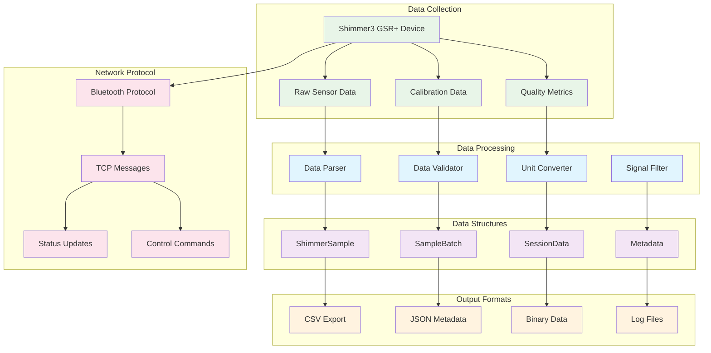

# Shimmer3 GSR+ Device: Protocol and Data Contract Documentation

## Table of Contents

- [Overview](#overview)
- [Data Structures and Formats](#data-structures-and-formats)
- [Network Communication Protocols](#network-communication-protocols)
- [API Specifications](#api-specifications)
- [File Format Specifications](#file-format-specifications)
- [Error Codes and Status Messages](#error-codes-and-status-messages)

## Overview

This document defines the comprehensive data formats, API specifications, and network message protocols for Shimmer3 GSR+ device integration within the Multi-Sensor Recording System. The protocol specifications ensure consistent data exchange, interoperability, and reliable communication across all system components.

The protocol architecture supports multiple communication pathways including direct Bluetooth connections, Android-mediated connections, and network-based coordination, providing flexibility for diverse research and deployment scenarios.

## Data Structures and Formats

### Shimmer3 GSR+ Data Architecture



### Core Data Types

#### ShimmerSample Data Structure

The `ShimmerSample` represents the fundamental data unit for all Shimmer3 GSR+ sensor measurements:

```python
@dataclass
class ShimmerSample:
    """
    Comprehensive data sample from Shimmer3 GSR+ sensor
    
    This structure provides a standardized format for representing
    all sensor data with complete metadata and quality information.
    """
    
    # Temporal information
    timestamp: float              # Unix timestamp (seconds since epoch)
    system_time: str             # ISO 8601 formatted system time
    device_timestamp: Optional[float]  # Device-local timestamp
    session_timestamp: Optional[float] # Session-relative timestamp
    
    # Device identification
    device_id: str               # Unique device identifier
    mac_address: Optional[str]   # Bluetooth MAC address
    firmware_version: Optional[str] # Device firmware version
    
    # Connection metadata
    connection_type: ConnectionType    # Connection method used
    android_device_id: Optional[str]   # Associated Android device ID
    session_id: Optional[str]          # Recording session identifier
    
    # Primary physiological sensors
    gsr_conductance: Optional[float]   # GSR conductance (microsiemens)
    gsr_resistance: Optional[float]    # GSR resistance (ohms)
    gsr_range: Optional[int]           # GSR range setting (0-4)
    
    # Photoplethysmography data
    ppg_a13: Optional[float]           # PPG analog channel 13
    ppg_raw: Optional[float]           # Raw PPG signal
    heart_rate: Optional[float]        # Derived heart rate (BPM)
    
    # 3-axis accelerometer data (g units)
    accel_x: Optional[float]           # X-axis acceleration
    accel_y: Optional[float]           # Y-axis acceleration  
    accel_z: Optional[float]           # Z-axis acceleration
    accel_magnitude: Optional[float]   # Acceleration magnitude
    
    # 3-axis gyroscope data (degrees/second)
    gyro_x: Optional[float]            # X-axis angular velocity
    gyro_y: Optional[float]            # Y-axis angular velocity
    gyro_z: Optional[float]            # Z-axis angular velocity
    
    # 3-axis magnetometer data (gauss)
    mag_x: Optional[float]             # X-axis magnetic field
    mag_y: Optional[float]             # Y-axis magnetic field
    mag_z: Optional[float]             # Z-axis magnetic field
    
    # Additional physiological sensors
    ecg: Optional[float]               # Electrocardiogram (mV)
    emg: Optional[float]               # Electromyogram (mV)
    
    # Device status information
    battery_percentage: Optional[int]   # Battery level (0-100%)
    signal_strength: Optional[float]   # Bluetooth signal strength
    temperature: Optional[float]       # Device temperature (Celsius)
    
    # Data quality metrics
    sample_number: Optional[int]       # Sequential sample number
    packet_loss: Optional[float]       # Estimated packet loss rate
    signal_quality: Optional[str]      # Qualitative signal assessment
    
    # Raw data preservation
    raw_data: Optional[Dict[str, Any]] # Original sensor readings
    calibration_applied: bool = True   # Calibration status flag
```

#### DeviceConfiguration Structure

Device configuration parameters for comprehensive sensor setup:

```python
@dataclass
class DeviceConfiguration:
    """
    Complete configuration specification for Shimmer3 GSR+ device
    """
    
    # Device identification
    device_id: str                     # Unique device identifier
    mac_address: str                   # Bluetooth MAC address
    device_name: Optional[str]         # Human-readable device name
    
    # Connection parameters
    connection_type: ConnectionType    # Connection method
    android_device_id: Optional[str]   # Associated Android device
    auto_reconnect: bool = True        # Automatic reconnection
    connection_timeout: float = 30.0   # Connection timeout (seconds)
    
    # Sampling configuration
    sampling_rate: float = 51.2        # Sampling rate (Hz)
    enabled_sensors: Set[str]          # Active sensor channels
    
    # GSR-specific settings
    gsr_range: int = 1                 # GSR measurement range (0-4)
    gsr_calibration: Dict[str, float] = None  # Calibration parameters
    
    # Accelerometer configuration
    accel_range: int = 2               # Accelerometer range (±g)
    accel_low_power: bool = False      # Low-power mode
    
    # PPG configuration
    ppg_gain: int = 1                  # PPG amplifier gain
    ppg_led_current: int = 50          # LED current (mA)
    
    # Data processing options
    real_time_processing: bool = True  # Enable real-time processing
    data_validation: bool = True       # Enable data validation
    buffer_size: int = 1000           # Data buffer size
    
    # Storage settings
    sd_logging: bool = False          # On-device SD card logging
    csv_export: bool = True           # CSV file export
    json_streaming: bool = False      # JSON network streaming
```

## Network Communication Protocols

### JSON Message Formats

#### Device Discovery Messages

**Device Discovery Request**:
```json
{
    "message_type": "device_discovery_request",
    "timestamp": "2023-12-01T14:30:22.125Z",
    "source": "pc_controller",
    "session_id": "discovery_session_001",
    "parameters": {
        "scan_duration": 30,
        "device_types": ["shimmer3_gsr"],
        "connection_methods": ["bluetooth_classic", "bluetooth_le"],
        "discovery_mode": "active"
    }
}
```

**Device Discovery Response**:
```json
{
    "message_type": "device_discovery_response",
    "timestamp": "2023-12-01T14:30:45.250Z",
    "source": "android_device_001",
    "session_id": "discovery_session_001",
    "devices_found": [
        {
            "device_id": "shimmer_00_06_66_66_66_66",
            "mac_address": "00:06:66:66:66:66",
            "device_name": "Shimmer3-GSR-4455",
            "firmware_version": "0.7.0",
            "battery_level": 85,
            "signal_strength": -45,
            "capabilities": [
                "gsr", "ppg", "accelerometer", 
                "gyroscope", "magnetometer"
            ],
            "available_ranges": {
                "gsr": [0, 1, 2, 3, 4],
                "accelerometer": [2, 4, 8, 16]
            }
        }
    ]
}
```

#### Connection Management Messages

**Connection Request**:
```json
{
    "message_type": "connection_request",
    "timestamp": "2023-12-01T14:31:00.000Z",
    "source": "pc_controller",
    "target_device": "shimmer_00_06_66_66_66_66",
    "connection_parameters": {
        "connection_type": "android_mediated",
        "android_device_id": "android_device_001",
        "timeout_seconds": 30,
        "retry_attempts": 3,
        "priority": "high"
    }
}
```

**Connection Response**:
```json
{
    "message_type": "connection_response",
    "timestamp": "2023-12-01T14:31:15.500Z",
    "source": "android_device_001",
    "target_device": "shimmer_00_06_66_66_66_66",
    "connection_status": "connected",
    "connection_details": {
        "established_at": "2023-12-01T14:31:12.200Z",
        "connection_type": "bluetooth_classic",
        "signal_strength": -42,
        "firmware_version": "0.7.0",
        "device_capabilities": ["gsr", "ppg", "accelerometer"]
    },
    "error_message": null
}
```

#### Configuration Messages

**Configuration Update Request**:
```json
{
    "message_type": "configuration_update",
    "timestamp": "2023-12-01T14:32:00.000Z",
    "source": "pc_controller",
    "target_device": "shimmer_00_06_66_66_66_66",
    "configuration_changes": {
        "sampling_rate": 128.0,
        "gsr_range": 2,
        "enabled_sensors": ["gsr", "ppg", "accel_x", "accel_y", "accel_z"],
        "accel_range": 4,
        "ppg_gain": 2
    },
    "apply_immediately": true,
    "validate_settings": true
}
```

**Configuration Update Response**:
```json
{
    "message_type": "configuration_response",
    "timestamp": "2023-12-01T14:32:05.250Z",
    "source": "android_device_001",
    "target_device": "shimmer_00_06_66_66_66_66",
    "configuration_status": "success",
    "applied_settings": {
        "sampling_rate": 128.0,
        "gsr_range": 2,
        "enabled_sensors": ["gsr", "ppg", "accel_x", "accel_y", "accel_z"],
        "accel_range": 4,
        "ppg_gain": 2
    },
    "validation_results": {
        "all_sensors_available": true,
        "sampling_rate_supported": true,
        "battery_impact": "moderate",
        "estimated_runtime": "18_hours"
    }
}
```

#### Data Streaming Messages

**Real-Time Data Sample**:
```json
{
    "message_type": "sensor_data",
    "timestamp": "2023-12-01T14:35:22.125Z",
    "source": "android_device_001",
    "device_id": "shimmer_00_06_66_66_66_66",
    "session_id": "session_20231201_143022",
    "sample_data": {
        "device_timestamp": 1701435322.125,
        "system_timestamp": 1701435322.125,
        "session_timestamp": 300.125,
        "sample_number": 15360,
        "sensor_values": {
            "gsr_conductance": 2.347,
            "gsr_resistance": 426578.2,
            "ppg_a13": 1024.5,
            "heart_rate": 72.3,
            "accel_x": 0.12,
            "accel_y": -0.05,
            "accel_z": 9.78,
            "battery_percentage": 85
        },
        "quality_metrics": {
            "signal_quality": "good",
            "electrode_contact": "excellent",
            "motion_artifact": "minimal",
            "data_completeness": 1.0
        }
    }
}
```

#### Session Management Messages

**Session Start Request**:
```json
{
    "message_type": "session_start",
    "timestamp": "2023-12-01T14:30:00.000Z",
    "source": "pc_controller",
    "session_parameters": {
        "session_id": "session_20231201_143000",
        "participant_id": "P001",
        "condition": "baseline",
        "expected_duration": 600,
        "recording_devices": [
            "shimmer_00_06_66_66_66_66",
            "shimmer_00_06_66_66_66_67"
        ],
        "synchronization_enabled": true,
        "data_validation": true
    }
}
```

**Session Status Update**:
```json
{
    "message_type": "session_status",
    "timestamp": "2023-12-01T14:35:00.000Z",
    "source": "pc_controller",
    "session_id": "session_20231201_143000",
    "status_information": {
        "session_state": "recording",
        "elapsed_time": 300,
        "total_samples_collected": 76800,
        "device_status": {
            "shimmer_00_06_66_66_66_66": {
                "status": "streaming",
                "samples_collected": 38400,
                "battery_level": 85,
                "signal_quality": "excellent"
            },
            "shimmer_00_06_66_66_66_67": {
                "status": "streaming",
                "samples_collected": 38400,
                "battery_level": 82,
                "signal_quality": "good"
            }
        },
        "quality_assessment": {
            "overall_quality": "excellent",
            "data_completeness": 99.8,
            "synchronization_accuracy": "< 1ms",
            "artifact_percentage": 1.2
        }
    }
}
```

## API Specifications

### Python API (PC-Based Integration)

#### ShimmerManager API

```python
class ShimmerManager:
    """
    Primary interface for Shimmer3 GSR+ device management
    """
    
    def __init__(self, 
                 session_manager=None, 
                 logger=None, 
                 enable_android_integration=True) -> None:
        """
        Initialize Shimmer Manager
        
        Args:
            session_manager: Session management instance
            logger: Logging interface
            enable_android_integration: Enable Android device coordination
        """
    
    def initialize(self) -> bool:
        """
        Initialize the Shimmer manager and all subsystems
        
        Returns:
            bool: True if initialization successful
        """
    
    def scan_and_pair_devices(self) -> Dict[str, List[str]]:
        """
        Scan for available Shimmer devices through all connection methods
        
        Returns:
            Dict[str, List[str]]: Device lists by connection type
                {
                    'direct': ['mac_address_1', 'mac_address_2'],
                    'android': ['android_device_id_1'],
                    'simulated': ['simulated_device_1']
                }
        """
    
    def connect_devices(self, 
                       device_info: Union[List[str], Dict[str, List[str]]]) -> bool:
        """
        Connect to specified Shimmer devices
        
        Args:
            device_info: Either list of MAC addresses or dict with connection types
            
        Returns:
            bool: True if all connections successful
        """
    
    def set_enabled_channels(self, 
                           device_id: str, 
                           channels: Set[str]) -> bool:
        """
        Configure enabled sensor channels for a device
        
        Args:
            device_id: Target device identifier
            channels: Set of channel names to enable
            
        Returns:
            bool: True if configuration successful
        """
    
    def start_recording(self, session_id: str) -> bool:
        """
        Start recording data to files
        
        Args:
            session_id: Session identifier for data organization
            
        Returns:
            bool: True if recording started successfully
        """
    
    def stop_recording(self) -> bool:
        """
        Stop recording and close all files
        
        Returns:
            bool: True if recording stopped successfully
        """
    
    def get_shimmer_status(self) -> Dict[str, ShimmerStatus]:
        """
        Get comprehensive status of all Shimmer devices
        
        Returns:
            Dict[str, ShimmerStatus]: Status information for each device
        """
    
    def add_data_callback(self, 
                         callback: Callable[[ShimmerSample], None]) -> None:
        """
        Register callback for real-time data processing
        
        Args:
            callback: Function to call for each data sample
        """
```

#### Data Processing API

```python
class ShimmerDataProcessor:
    """
    Advanced data processing and analysis for Shimmer3 GSR+ data
    """
    
    def __init__(self, sampling_rate: float = 51.2):
        """
        Initialize data processor
        
        Args:
            sampling_rate: Expected sampling rate for processing
        """
    
    def process_gsr_sample(self, 
                          sample: ShimmerSample) -> ProcessedGSRSample:
        """
        Process individual GSR sample with quality assessment
        
        Args:
            sample: Raw GSR sample data
            
        Returns:
            ProcessedGSRSample: Processed sample with quality metrics
        """
    
    def decompose_gsr_signal(self, 
                           gsr_samples: List[float]) -> Tuple[List[float], List[float]]:
        """
        Decompose GSR signal into tonic and phasic components
        
        Args:
            gsr_samples: List of GSR conductance values
            
        Returns:
            Tuple[List[float], List[float]]: (tonic_component, phasic_component)
        """
    
    def detect_skin_conductance_responses(self, 
                                        phasic_gsr: List[float]) -> List[SCREvent]:
        """
        Detect skin conductance response events in phasic GSR
        
        Args:
            phasic_gsr: Phasic GSR component
            
        Returns:
            List[SCREvent]: Detected SCR events with timing and amplitude
        """
    
    def calculate_signal_quality(self, 
                               samples: List[ShimmerSample]) -> SignalQualityMetrics:
        """
        Calculate comprehensive signal quality metrics
        
        Args:
            samples: List of sensor samples for analysis
            
        Returns:
            SignalQualityMetrics: Quality assessment results
        """
```

### Android API Integration

#### Shimmer Android SDK Wrapper

```kotlin
class ShimmerAndroidManager @Inject constructor(
    @ApplicationContext private val context: Context
) {
    /**
     * Initialize Shimmer Android SDK integration
     */
    fun initialize(): Boolean
    
    /**
     * Scan for available Shimmer devices
     */
    suspend fun scanForDevices(
        scanDuration: Long = 30_000L
    ): List<ShimmerDevice>
    
    /**
     * Connect to specific Shimmer device
     */
    suspend fun connectDevice(
        macAddress: String,
        connectionType: BluetoothConnectionType
    ): ConnectionResult
    
    /**
     * Configure device sensors and parameters
     */
    suspend fun configureDevice(
        deviceId: String,
        configuration: DeviceConfiguration
    ): ConfigurationResult
    
    /**
     * Start data streaming from connected devices
     */
    fun startStreaming(deviceIds: List<String>): Boolean
    
    /**
     * Stop data streaming
     */
    fun stopStreaming(): Boolean
    
    /**
     * Register callback for real-time data
     */
    fun setDataCallback(callback: (ObjectCluster) -> Unit)
    
    /**
     * Get current device status
     */
    fun getDeviceStatus(deviceId: String): DeviceStatus?
}
```

#### ObjectCluster Data Extraction

```kotlin
/**
 * Extract standardized sensor data from Shimmer ObjectCluster
 */
fun ObjectCluster.toShimmerSample(deviceId: String): ShimmerSample {
    return ShimmerSample(
        timestamp = this.systemTimeStamp.toDouble() / 1000.0,
        systemTime = Instant.ofEpochMilli(this.systemTimeStamp).toString(),
        deviceId = deviceId,
        connectionType = ConnectionType.ANDROID_MEDIATED,
        
        // Extract GSR data
        gsrConductance = this.getFormatClusterValue(
            Configuration.Shimmer3.ObjectClusterSensorName.GSR_CONDUCTANCE,
            "CAL"
        )?.toFloat(),
        
        // Extract PPG data
        ppgA13 = this.getFormatClusterValue(
            Configuration.Shimmer3.ObjectClusterSensorName.PPG_A13,
            "CAL"
        )?.toFloat(),
        
        // Extract accelerometer data
        accelX = this.getFormatClusterValue(
            Configuration.Shimmer3.ObjectClusterSensorName.LSM303DLHC_ACCEL_X,
            "CAL"
        )?.toFloat(),
        
        accelY = this.getFormatClusterValue(
            Configuration.Shimmer3.ObjectClusterSensorName.LSM303DLHC_ACCEL_Y,
            "CAL"
        )?.toFloat(),
        
        accelZ = this.getFormatClusterValue(
            Configuration.Shimmer3.ObjectClusterSensorName.LSM303DLHC_ACCEL_Z,
            "CAL"
        )?.toFloat(),
        
        // Extract device status
        batteryPercentage = extractBatteryLevel(this)
    )
}
```

## File Format Specifications

### CSV Export Format

The CSV export format provides comprehensive sensor data with standardized column headers:

```csv
# Header row (required)
timestamp,system_time,device_id,mac_address,connection_type,session_id,
gsr_conductance,gsr_resistance,gsr_range,
ppg_a13,ppg_raw,heart_rate,
accel_x,accel_y,accel_z,accel_magnitude,
gyro_x,gyro_y,gyro_z,
mag_x,mag_y,mag_z,
ecg,emg,
battery_percentage,signal_strength,temperature,
sample_number,packet_loss,signal_quality

# Data rows (example)
1701435322.125,2023-12-01T14:35:22.125Z,shimmer_00_06_66_66_66_66,00:06:66:66:66:66,android_mediated,session_20231201_143022,
2.347,426578.2,1,
1024.5,2048.3,72.3,
0.12,-0.05,9.78,9.79,
1.2,-0.8,0.3,
-12.5,45.2,-8.7,
0.0,0.0,
85,-42.5,24.3,
15360,0.0,good
```

**Column Specifications**:

| Column Name | Data Type | Unit | Range | Description |
|-------------|-----------|------|-------|-------------|
| timestamp | float64 | seconds | > 0 | Unix timestamp |
| system_time | string | ISO 8601 | - | System time |
| device_id | string | - | - | Device identifier |
| mac_address | string | - | - | Bluetooth MAC |
| connection_type | string | - | enum | Connection method |
| session_id | string | - | - | Session identifier |
| gsr_conductance | float32 | μS | 0-100 | GSR conductance |
| gsr_resistance | float32 | Ω | > 0 | GSR resistance |
| gsr_range | int8 | - | 0-4 | GSR range setting |
| ppg_a13 | float32 | - | 0-4095 | PPG analog signal |
| ppg_raw | float32 | - | 0-65535 | Raw PPG data |
| heart_rate | float32 | BPM | 30-200 | Derived heart rate |
| accel_x | float32 | g | -16 to 16 | X acceleration |
| accel_y | float32 | g | -16 to 16 | Y acceleration |
| accel_z | float32 | g | -16 to 16 | Z acceleration |
| accel_magnitude | float32 | g | 0-27.7 | Acceleration magnitude |
| gyro_x | float32 | °/s | -2000 to 2000 | X angular velocity |
| gyro_y | float32 | °/s | -2000 to 2000 | Y angular velocity |
| gyro_z | float32 | °/s | -2000 to 2000 | Z angular velocity |
| mag_x | float32 | gauss | -8 to 8 | X magnetic field |
| mag_y | float32 | gauss | -8 to 8 | Y magnetic field |
| mag_z | float32 | gauss | -8 to 8 | Z magnetic field |
| ecg | float32 | mV | -5 to 5 | ECG signal |
| emg | float32 | mV | -5 to 5 | EMG signal |
| battery_percentage | int8 | % | 0-100 | Battery level |
| signal_strength | float32 | dBm | -100 to 0 | Bluetooth RSSI |
| temperature | float32 | °C | -20 to 60 | Device temperature |
| sample_number | uint32 | - | 0+ | Sequential sample |
| packet_loss | float32 | % | 0-100 | Estimated packet loss |
| signal_quality | string | - | enum | Quality assessment |

### JSON Session Metadata Format

```json
{
    "session_metadata": {
        "format_version": "1.2.0",
        "generated_by": "ShimmerManager v2.1.0",
        "generation_timestamp": "2023-12-01T14:40:22.125Z",
        
        "session_information": {
            "session_id": "session_20231201_143022",
            "participant_id": "P001",
            "researcher_id": "R001",
            "study_name": "Stress Response Study",
            "condition": "baseline",
            "start_time": "2023-12-01T14:30:22.125Z",
            "end_time": "2023-12-01T14:35:22.125Z",
            "duration_seconds": 300.0,
            "notes": "Baseline recording before stress induction"
        },
        
        "device_configurations": {
            "shimmer_00_06_66_66_66_66": {
                "device_info": {
                    "mac_address": "00:06:66:66:66:66",
                    "device_name": "Shimmer3-GSR-4455",
                    "firmware_version": "0.7.0",
                    "hardware_revision": "Rev3",
                    "connection_type": "android_mediated",
                    "android_device_id": "android_device_001"
                },
                "sensor_configuration": {
                    "sampling_rate": 51.2,
                    "enabled_sensors": ["GSR", "PPG_A13", "ACCEL_X", "ACCEL_Y", "ACCEL_Z"],
                    "gsr_range": 1,
                    "gsr_calibration": {
                        "offset": 0.0,
                        "gain": 1.0,
                        "last_calibration": "2023-11-15T10:30:00.000Z"
                    },
                    "accelerometer_range": 2,
                    "ppg_configuration": {
                        "gain": 1,
                        "led_current": 50
                    }
                },
                "session_statistics": {
                    "total_samples": 15360,
                    "samples_per_second": 51.2,
                    "data_completeness": 99.95,
                    "battery_start": 95,
                    "battery_end": 87,
                    "average_signal_strength": -42.3
                }
            }
        },
        
        "data_quality_assessment": {
            "overall_quality": "excellent",
            "quality_metrics": {
                "signal_to_noise_ratio": 28.5,
                "electrode_contact_quality": "excellent",
                "motion_artifact_percentage": 1.2,
                "data_gaps_count": 0,
                "synchronization_accuracy": 0.5
            },
            "quality_issues": [],
            "recommendations": [
                "Data quality is excellent for analysis",
                "No significant artifacts detected",
                "Electrode contact remained stable throughout session"
            ]
        },
        
        "file_inventory": {
            "data_files": [
                {
                    "filename": "shimmer_00_06_66_66_66_66_data.csv",
                    "file_type": "sensor_data",
                    "file_size_bytes": 1875432,
                    "checksum_md5": "a1b2c3d4e5f6g7h8i9j0k1l2m3n4o5p6",
                    "row_count": 15361,
                    "column_count": 25
                }
            ],
            "metadata_files": [
                {
                    "filename": "session_metadata.json",
                    "file_type": "metadata",
                    "file_size_bytes": 3247,
                    "checksum_md5": "z9y8x7w6v5u4t3s2r1q0p9o8n7m6l5k4"
                }
            ]
        },
        
        "synchronization_information": {
            "time_sources": [
                {
                    "source": "pc_controller",
                    "clock_accuracy": "ntp_synchronized",
                    "offset_ms": 0.0
                },
                {
                    "source": "android_device_001", 
                    "clock_accuracy": "cellular_synchronized",
                    "offset_ms": 2.3
                }
            ],
            "synchronization_events": [
                {
                    "timestamp": "2023-12-01T14:30:22.125Z",
                    "event_type": "session_start",
                    "sync_accuracy": "< 1ms"
                },
                {
                    "timestamp": "2023-12-01T14:32:30.000Z",
                    "event_type": "sync_flash",
                    "devices_affected": ["android_device_001"],
                    "sync_accuracy": "< 1ms"
                }
            ]
        }
    }
}
```

## Error Codes and Status Messages

### Error Classification System

```python
class ShimmerErrorCodes:
    """
    Standardized error codes for Shimmer3 GSR+ operations
    """
    
    # Connection errors (1000-1099)
    CONNECTION_TIMEOUT = 1001
    DEVICE_NOT_FOUND = 1002
    BLUETOOTH_UNAVAILABLE = 1003
    PAIRING_FAILED = 1004
    AUTHENTICATION_ERROR = 1005
    
    # Configuration errors (1100-1199)
    INVALID_SAMPLING_RATE = 1101
    UNSUPPORTED_SENSOR = 1102
    INVALID_GSR_RANGE = 1103
    CONFIGURATION_FAILED = 1104
    CALIBRATION_ERROR = 1105
    
    # Data errors (1200-1299)
    DATA_VALIDATION_FAILED = 1201
    PACKET_LOSS_EXCEEDED = 1202
    TIMESTAMP_ERROR = 1203
    CHECKSUM_MISMATCH = 1204
    BUFFER_OVERFLOW = 1205
    
    # Device errors (1300-1399)
    LOW_BATTERY = 1301
    DEVICE_MALFUNCTION = 1302
    SENSOR_FAILURE = 1303
    MEMORY_ERROR = 1304
    FIRMWARE_ERROR = 1305
    
    # System errors (1400-1499)
    PERMISSION_DENIED = 1401
    RESOURCE_UNAVAILABLE = 1402
    STORAGE_FULL = 1403
    NETWORK_ERROR = 1404
    INTERNAL_ERROR = 1405
```

### Status Message Format

```json
{
    "status_message": {
        "timestamp": "2023-12-01T14:35:22.125Z",
        "source": "shimmer_manager",
        "message_type": "error",
        "error_code": 1201,
        "error_category": "data_validation",
        "error_message": "GSR conductance value outside expected range",
        "error_details": {
            "device_id": "shimmer_00_06_66_66_66_66",
            "expected_range": [0.0, 100.0],
            "actual_value": 150.3,
            "sensor_type": "gsr_conductance",
            "sample_number": 15360
        },
        "suggested_actions": [
            "Check electrode contact quality",
            "Verify GSR range setting",
            "Inspect sensor calibration parameters"
        ],
        "recovery_attempted": false,
        "severity": "warning"
    }
}
```

This comprehensive protocol documentation provides the complete data contract and communication specifications necessary for reliable integration and interoperability of Shimmer3 GSR+ devices within the Multi-Sensor Recording System. The standardized formats ensure consistent data exchange across all system components while maintaining flexibility for diverse research requirements.