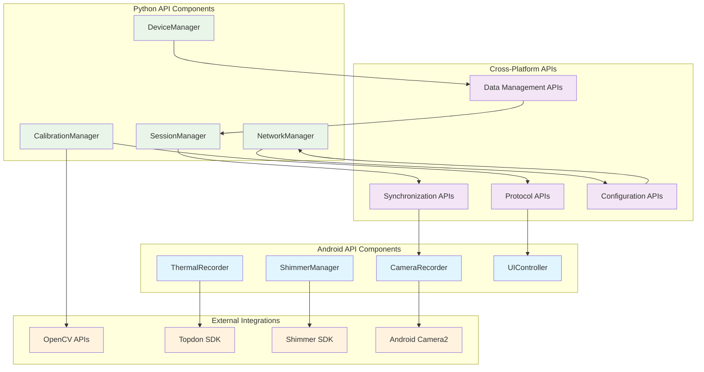

# System API Reference - Multi-Sensor Recording System

## Table of Contents

1. [Python API Components](#python-api-components)
   - 1.1 [CalibrationManager API](#calibrationmanager-api)
   - 1.2 [ShimmerManager API](#shimmermanager-api)
2. [Android API Components](#android-api-components)
   - 2.1 [Enhanced CameraRecorder](#enhanced-camerarecorder)
   - 2.2 [Enhanced ShimmerRecorder](#enhanced-shimmerrecorder)
   - 2.3 [Enhanced MainActivity](#enhanced-mainactivity)
3. [Testing APIs](#testing-apis)
4. [Configuration Options](#configuration-options)
5. [Error Handling](#error-handling)
6. [Dependencies](#dependencies)

---

## System API Architecture Overview



## Python API Components

### CalibrationManager API

The `CalibrationManager` class provides comprehensive camera calibration functionality with OpenCV integration.

#### Class Overview

```python
from calibration.calibration import CalibrationManager

# Initialize calibration manager
calibration_manager = CalibrationManager()
```

#### Core Methods

| Method | Parameters | Returns | Description |
|--------|------------|---------|-------------|
| `capture_calibration_images` | `device_client=None`, `num_images: int = 20` | `bool` | Captures calibration images from connected devices |
| `detect_calibration_pattern` | `image: np.ndarray`, `pattern_type: str = "chessboard"` | `Tuple[bool, Optional[np.ndarray]]` | Detects calibration patterns with sub-pixel accuracy |
| `calibrate_single_camera` | `images: List[np.ndarray]`, `image_points: List[np.ndarray]`, `image_size: Tuple[int, int]` | `Dict` | Performs single camera intrinsic calibration |
| `calibrate_stereo_cameras` | `rgb_images: List[np.ndarray]`, `thermal_images: List[np.ndarray]`, `rgb_points: List[np.ndarray]`, `thermal_points: List[np.ndarray]`, `image_size: Tuple[int, int]` | `Dict` | Performs stereo calibration between RGB and thermal cameras |
| `assess_calibration_quality` | `images: List[np.ndarray]`, `image_points: List[np.ndarray]`, `camera_matrix: np.ndarray`, `distortion_coeffs: np.ndarray` | `Dict` | Assesses calibration quality with comprehensive metrics |
| `save_calibration_data` | `filename: str` | `bool` | Saves calibration data to JSON file |
| `load_calibration_data` | `filename: str` | `bool` | Loads calibration data from JSON file |

#### Usage Example

```python
from calibration.calibration import CalibrationManager
import cv2

# Initialize calibration manager
calibration_manager = CalibrationManager()

# Load calibration images
images = [cv2.imread(f"calib_{i:03d}.jpg") for i in range(20)]

# Detect patterns in all images
image_points = []
for image in images:
    success, corners = calibration_manager.detect_calibration_pattern(image)
    if success:
        image_points.append(corners)

# Perform single camera calibration
if image_points:
    result = calibration_manager.calibrate_single_camera(
        images, image_points, (1920, 1080)
    )
    print(f"Calibration RMS error: {result['rms_error']}")

# Save calibration data
calibration_manager.save_calibration_data("camera_calibration.json")
```

### ShimmerManager API

The `ShimmerManager` class provides comprehensive Shimmer sensor integration with multi-library support.

#### Class Overview

```python
from shimmer_manager import ShimmerManager

# Initialize Shimmer manager
shimmer_manager = ShimmerManager()
```

#### Core Methods

| Method | Parameters | Returns | Description |
|--------|------------|---------|-------------|
| `discover_devices` | None | `List[Dict[str, Any]]` | Discovers available Shimmer devices via Bluetooth |
| `connect_device` | `device_address: str`, `connection_type: ConnectionType = ConnectionType.PYSHIMMER` | `bool` | Connects to a specific Shimmer device |
| `start_streaming` | `device_address: str`, `channels: List[str]`, `sampling_rate: float = 51.2` | `bool` | Starts real-time data streaming from device |
| `stop_streaming` | `device_address: str` | `bool` | Stops data streaming from device |
| `start_recording_session` | `session_name: str`, `output_directory: str` | `bool` | Starts a new recording session |
| `stop_recording_session` | None | `bool` | Stops the current recording session |
| `get_device_info` | `device_address: str` | `Dict[str, Any]` | Gets detailed information about a connected device |

#### Usage Example

```python
from shimmer_manager import ShimmerManager, ConnectionType

# Initialize Shimmer manager
shimmer_manager = ShimmerManager()

# Discover available devices
devices = shimmer_manager.discover_devices()
print(f"Found {len(devices)} Shimmer devices")

# Connect to first device
if devices:
    device_address = devices[0]['address']
    success = shimmer_manager.connect_device(device_address)
    
    if success:
        # Start streaming GSR and PPG data
        shimmer_manager.start_streaming(
            device_address, 
            channels=['GSR', 'PPG'], 
            sampling_rate=51.2
        )
        
        # Start recording session
        shimmer_manager.start_recording_session(
            "test_session", 
            "./recordings"
        )
        
        # ... recording occurs ...
        
        # Stop recording and streaming
        shimmer_manager.stop_recording_session()
        shimmer_manager.stop_streaming(device_address)
```

---

## Android API Components

### Enhanced CameraRecorder

The Android `CameraRecorder` includes enhanced DngCreator support with API compatibility fixes.

#### Key Improvements

**DngCreator API Compatibility:**
- Reflection-based implementation for handling DngCreator availability across API levels
- Proper API level checking with detection and handling of API 21+ requirements
- Resource management with comprehensive cleanup and error handling
- Graceful degradation with informative error messages when DngCreator is unavailable

#### Usage in Kotlin

```kotlin
// DngCreator is now handled automatically with API compatibility
cameraRecorder.startSession(
    sessionInfo = sessionInfo,
    recordVideo = true,
    captureRaw = true  // Automatically handles API availability
)
```

### Enhanced ShimmerRecorder

The Android `ShimmerRecorder` includes improved sampling rate configuration.

#### Key Improvements

**Sampling Rate Configuration:**
- Reflection-based method detection for handling variations in Shimmer SDK versions
- SDK version compatibility with automatic method availability checking
- Error recovery with proper exception handling for missing SDK methods

#### Usage in Kotlin

```kotlin
// Sampling rate configuration with automatic compatibility handling
shimmerRecorder.configureSamplingRate(
    deviceId = "shimmer_device_1",
    samplingRate = 51.2  // Automatically detects and uses appropriate SDK method
)
```

### Enhanced MainActivity

The `MainActivity` includes improved UI feedback and error handling.

#### Key Improvements

**Enhanced SessionInfo Display:**
- Status indicators with emojis for visual feedback
- Detailed session information with comprehensive metadata
- Real-time updates during recording operations

**Error State Management:**
- Proper error clearing after user acknowledgment
- Improved user feedback during operations
- Better connection status indicators

---

## Testing APIs

### CalibrationTesting

```python
# Run comprehensive calibration testing
python PythonApp/test_calibration_implementation.py

# Test specific calibration features
from test_calibration_implementation import test_pattern_detection
test_pattern_detection()
```

### ShimmerTesting

```python
# Run comprehensive Shimmer testing
python PythonApp/test_shimmer_implementation.py

# Test specific Shimmer features
from test_shimmer_implementation import test_device_discovery
test_device_discovery()
```

---

## Configuration Options

### Calibration Configuration

```python
# Configure calibration parameters
calibration_manager = CalibrationManager()
calibration_manager.chessboard_size = (9, 6)  # Pattern size
calibration_manager.square_size = 25.0        # Square size in mm
calibration_manager.calibration_flags = cv2.CALIB_RATIONAL_MODEL
```

### Shimmer Configuration

```python
# Configure Shimmer connection preferences
shimmer_manager = ShimmerManager()
shimmer_manager.set_connection_preference(ConnectionType.PYSHIMMER)
shimmer_manager.set_fallback_libraries(['bluetooth', 'pybluez'])
```

---

## Error Handling

All APIs include comprehensive error handling:

- **Graceful degradation** when optional dependencies are missing
- **Informative error messages** for debugging and user feedback
- **Automatic fallbacks** for alternative implementation methods
- **Resource cleanup** to prevent memory leaks and resource conflicts

---

## Dependencies

### Required Dependencies

| Component | Version | Purpose |
|-----------|---------|---------|
| OpenCV | 4.8.0.74+ | Calibration functionality |
| PyQt5 | 5.15.7+ | GUI integration |
| NumPy | 1.24.3+ | Numerical computations |

### Optional Dependencies

| Component | Purpose |
|-----------|---------|
| pyshimmer | Direct Shimmer connections |
| bluetooth/pybluez | Alternative Bluetooth support |
| Additional OpenCV modules | Advanced computer vision |

For complete setup instructions, see the main README.md file.