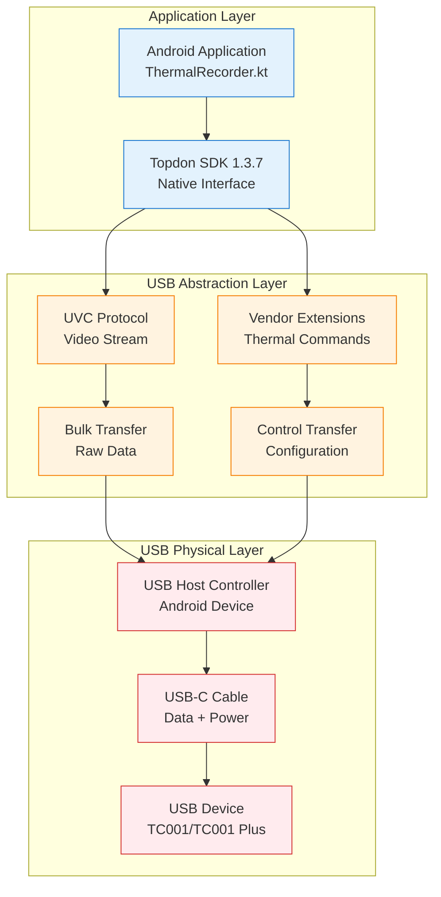
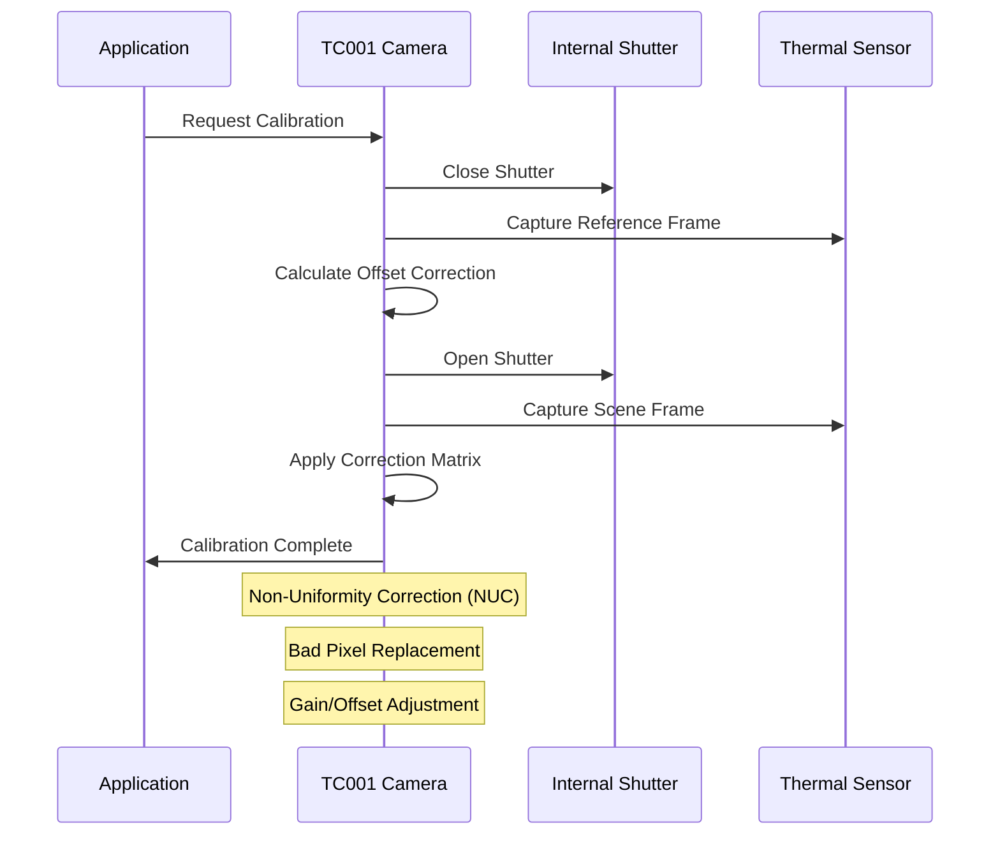
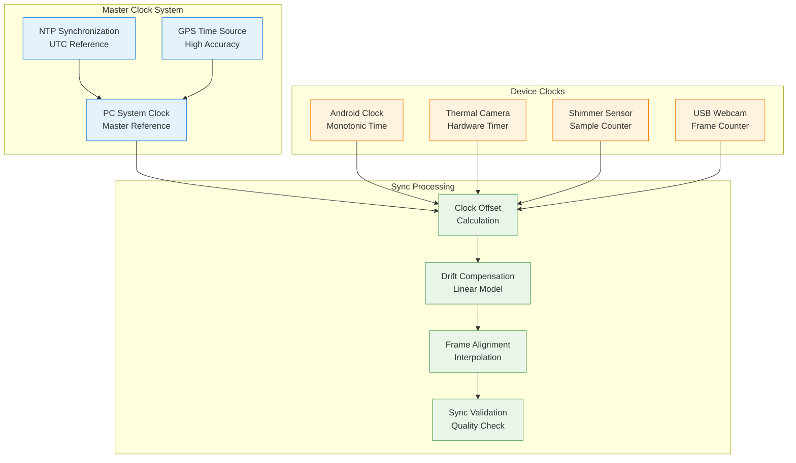
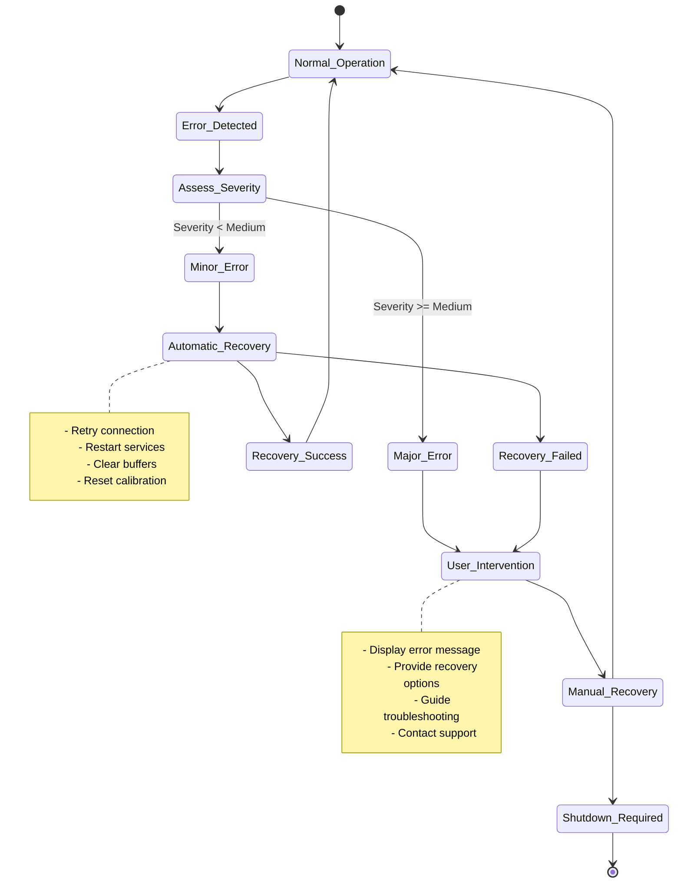

# Topdon TC001 and TC001 Plus Protocol Documentation

## Table of Contents

- [1. Communication Protocols](#1-communication-protocols)
- [2. Data Format Specifications](#2-data-format-specifications)
- [3. API Reference](#3-api-reference)
- [4. Network Messaging](#4-network-messaging)
- [5. File Format Standards](#5-file-format-standards)
- [6. Calibration Protocols](#6-calibration-protocols)
- [7. Synchronization Protocols](#7-synchronization-protocols)
- [8. Error Handling and Status Codes](#8-error-handling-and-status-codes)

## 1. Communication Protocols

### 1.1 USB Communication Protocol

The Topdon TC001/TC001 Plus cameras communicate via USB using the UVC (USB Video Class) standard with vendor-specific extensions for thermal data access.

**Protocol Stack:**


**USB Endpoints Configuration:**
| Endpoint | Type | Direction | Max Packet Size | Purpose |
|----------|------|-----------|-----------------|---------|
| **EP0** | Control | Bidirectional | 64 bytes | Device enumeration, configuration |
| **EP1** | Bulk | IN (Device→Host) | 512 bytes | Thermal frame data |
| **EP2** | Interrupt | IN (Device→Host) | 64 bytes | Status notifications |
| **EP3** | Bulk | OUT (Host→Device) | 512 bytes | Command interface |

### 1.2 Command Interface Protocol

The thermal camera supports a comprehensive command interface for configuration and control.

**Command Structure:**
```
Command Packet Format (64 bytes):
┌─────────────┬─────────────┬─────────────┬─────────────────────┐
│   Header    │   Command   │ Parameters  │      Checksum       │
│  (8 bytes)  │  (8 bytes)  │ (44 bytes)  │     (4 bytes)       │
└─────────────┴─────────────┴─────────────┴─────────────────────┘

Header Format:
├── Magic: 0x544F5044 ('TOPD')
├── Version: 0x0137 (SDK v1.3.7)
├── Sequence: 16-bit incrementing counter
└── Reserved: 0x0000

Command Types:
├── 0x01: Initialize Camera
├── 0x02: Start Streaming
├── 0x03: Stop Streaming
├── 0x04: Set Temperature Range
├── 0x05: Set Emissivity
├── 0x06: Perform Calibration
├── 0x07: Get Device Status
├── 0x08: Set Frame Rate
├── 0x09: Get Temperature Data
└── 0x0A: Power Management
```

**Example Command Messages:**

**Initialize Camera Command:**
```json
{
  "command_id": "0x01",
  "command_name": "INIT_CAMERA",
  "parameters": {
    "resolution": "256x192",
    "frame_rate": 25,
    "temperature_range": {
      "min": -20,
      "max": 550
    },
    "emissivity": 0.95,
    "calibration_mode": "auto"
  },
  "response": {
    "status": "success",
    "device_info": {
      "model": "TC001_PLUS",
      "serial": "TC001P-240131-001",
      "firmware": "1.3.7",
      "calibration_date": "2024-01-15T10:30:00Z"
    }
  }
}
```

**Set Temperature Range Command:**
```json
{
  "command_id": "0x04",
  "command_name": "SET_TEMP_RANGE",
  "parameters": {
    "range_mode": "manual",
    "min_temp": 20.0,
    "max_temp": 40.0,
    "auto_range": false
  },
  "response": {
    "status": "success",
    "actual_range": {
      "min": 20.0,
      "max": 40.0,
      "sensitivity": 0.1
    }
  }
}
```

## 2. Data Format Specifications

### 2.1 Raw Thermal Frame Format

Raw thermal frames are transmitted as binary data with specific structure for radiometric information.

**Frame Data Structure:**
```
Raw Thermal Frame (Total: 98,320 bytes)
┌─────────────────────────────────────────────────────────────┐
│                    Frame Header (16 bytes)                  │
├─────────────┬─────────────┬─────────────┬─────────────────────┤
│Frame Magic  │Frame Counter│  Timestamp  │      Reserved       │
│  (4 bytes)  │  (4 bytes)  │  (8 bytes)  │      (0 bytes)      │
├─────────────┴─────────────┴─────────────┴─────────────────────┤
│                 Pixel Data (98,304 bytes)                   │
│              256×192 pixels × 2 bytes/pixel                 │
│                   (Little-endian 16-bit)                    │
└─────────────────────────────────────────────────────────────┘
```

**Pixel Data Encoding:**
```
16-bit Pixel Value Interpretation:
┌───────────────────────────────────────────┐
│  Raw ADC Count (0-65535)                  │
├─────────────┬─────────────────────────────┤
│   Bits      │         Purpose             │
├─────────────┼─────────────────────────────┤
│   15-0      │ Raw sensor measurement      │
│             │ (requires calibration)      │
└─────────────┴─────────────────────────────┘

Temperature Conversion:
T(°C) = a₀ + a₁×Raw + a₂×Raw² + a₃×Raw³

Where aₙ are camera-specific calibration coefficients
```

### 2.2 Processed Frame Format

Processed frames contain calibrated temperature data and additional metadata.

**Processed Frame Structure:**
```json
{
  "frame_header": {
    "frame_id": 12345,
    "timestamp_us": 1706694600000000,
    "sequence_number": 12345,
    "capture_mode": "radiometric"
  },
  "temperature_data": {
    "format": "float32",
    "width": 256,
    "height": 192,
    "units": "celsius",
    "min_temp": 18.5,
    "max_temp": 37.2,
    "mean_temp": 22.8,
    "data_offset": 64
  },
  "calibration_info": {
    "emissivity": 0.95,
    "ambient_temp": 22.0,
    "distance": 1.0,
    "atmospheric_transmission": 0.98,
    "calibration_status": "valid"
  },
  "quality_metrics": {
    "noise_level": 0.1,
    "uniformity": 0.95,
    "stability": 0.98,
    "frame_completeness": 1.0
  }
}
```

### 2.3 Metadata Format

Comprehensive metadata accompanies each recording session for research reproducibility.

**Session Metadata Schema:**
```json
{
  "session_metadata": {
    "session_id": "THERMAL_20240131_103000",
    "created_timestamp": "2024-01-31T10:30:00.000Z",
    "device_info": {
      "model": "TC001_PLUS",
      "serial_number": "TC001P-240131-001",
      "firmware_version": "1.3.7",
      "sdk_version": "1.3.7",
      "last_calibration": "2024-01-15T10:30:00Z"
    },
    "recording_parameters": {
      "resolution": {
        "width": 256,
        "height": 192
      },
      "frame_rate": 25.0,
      "duration_seconds": 600,
      "total_frames": 15000,
      "temperature_range": {
        "min": -20.0,
        "max": 550.0,
        "actual_min": 18.5,
        "actual_max": 37.2
      }
    },
    "environmental_conditions": {
      "ambient_temperature": 22.0,
      "relative_humidity": 45,
      "atmospheric_pressure": 1013.25,
      "measurement_distance": 1.0,
      "emissivity_setting": 0.95
    },
    "synchronization": {
      "master_clock": "PC_COORDINATOR",
      "sync_accuracy_us": 100,
      "drift_compensation": true,
      "reference_timestamps": []
    }
  }
}
```

## 3. API Reference

### 3.1 ThermalRecorder API

The main API interface for thermal camera control and data access.

**Core Methods:**

| Method | Parameters | Return Type | Description |
|--------|------------|-------------|-------------|
| `initializeCamera()` | `config: CameraConfig` | `Result<DeviceInfo>` | Initialize thermal camera connection |
| `startRecording()` | `session: SessionConfig` | `Result<Boolean>` | Begin thermal data recording |
| `stopRecording()` | None | `Result<SessionSummary>` | End recording and finalize data |
| `getCurrentFrame()` | None | `ThermalFrame?` | Get latest thermal frame |
| `setEmissivity()` | `value: Float` | `Result<Boolean>` | Configure target emissivity |
| `setTemperatureRange()` | `min: Float, max: Float` | `Result<Boolean>` | Set measurement range |
| `performCalibration()` | `type: CalibrationType` | `Result<CalibrationResult>` | Execute calibration procedure |
| `getDeviceStatus()` | None | `DeviceStatus` | Query current device state |

**Data Classes:**

```kotlin
data class CameraConfig(
    val frameRate: Int = 25,
    val temperatureRange: TemperatureRange = TemperatureRange(-20f, 550f),
    val emissivity: Float = 0.95f,
    val calibrationMode: CalibrationMode = CalibrationMode.AUTO,
    val processungMode: ProcessingMode = ProcessingMode.RADIOMETRIC
)

data class ThermalFrame(
    val frameId: Long,
    val timestamp: Long,
    val width: Int = 256,
    val height: Int = 192,
    val temperatureData: FloatArray,
    val rawData: ByteArray,
    val metadata: FrameMetadata
)

data class DeviceStatus(
    val isConnected: Boolean,
    val isRecording: Boolean,
    val temperature: Float,
    val calibrationStatus: CalibrationStatus,
    val batteryLevel: Int?,
    val frameRate: Float,
    val lastError: String?
)
```

### 3.2 Frame Processing API

Methods for thermal frame processing and analysis.

**Processing Pipeline:**

```kotlin
interface FrameProcessor {
    fun processRawFrame(rawData: ByteArray): ThermalFrame
    fun applyCalibration(frame: ThermalFrame): ThermalFrame
    fun generatePseudoColor(frame: ThermalFrame): Bitmap
    fun extractStatistics(frame: ThermalFrame): FrameStatistics
    fun validateQuality(frame: ThermalFrame): QualityMetrics
}

data class FrameStatistics(
    val minTemperature: Float,
    val maxTemperature: Float,
    val meanTemperature: Float,
    val stdDeviation: Float,
    val histogram: IntArray,
    val hotSpots: List<Point>,
    val coldSpots: List<Point>
)

data class QualityMetrics(
    val noiseLevel: Float,        // RMS noise in °C
    val uniformity: Float,        // 0.0-1.0, spatial uniformity
    val stability: Float,         // 0.0-1.0, temporal stability
    val completeness: Float,      // 0.0-1.0, data completeness
    val calibrationStatus: CalibrationStatus
)
```

### 3.3 USB Management API

Low-level USB device management and communication interface.

**USB Device Interface:**

```kotlin
interface UsbDeviceManager {
    fun scanForDevices(): List<UsbDevice>
    fun isSupportedTopdonDevice(device: UsbDevice): Boolean
    fun requestPermission(device: UsbDevice): Flow<PermissionResult>
    fun establishConnection(device: UsbDevice): Result<UsbConnection>
    fun closeConnection(device: UsbDevice): Boolean
    fun getDeviceInfo(device: UsbDevice): DeviceInfo?
}

enum class PermissionResult {
    GRANTED,
    DENIED,
    PENDING,
    ERROR
}

data class UsbConnection(
    val device: UsbDevice,
    val interface: UsbInterface,
    val endpoints: Map<EndpointType, UsbEndpoint>,
    val connectionTime: Long,
    val isActive: Boolean
)

### 3.4 Buffer Management and Performance Optimization

Advanced buffer management ensures optimal performance for real-time thermal streaming:

**Thermal Data Buffer Implementation:**
```kotlin
class ThermalDataBuffer {
    companion object {
        const val OPTIMAL_BUFFER_SIZE = 10
        const val MAX_FRAME_RETENTION_MS = 1000
    }
    
    private val frameBuffer = ArrayDeque<ThermalFrame>(OPTIMAL_BUFFER_SIZE)
    private val bufferLock = Mutex()
    
    suspend fun addFrame(frame: ThermalFrame) {
        bufferLock.withLock {
            // Remove old frames if buffer is full
            while (frameBuffer.size >= OPTIMAL_BUFFER_SIZE) {
                frameBuffer.removeFirst()
            }
            
            // Remove frames older than retention period
            val cutoffTime = System.currentTimeMillis() - MAX_FRAME_RETENTION_MS
            frameBuffer.removeAll { it.timestamp < cutoffTime }
            
            frameBuffer.addLast(frame)
        }
    }
    
    suspend fun getLatestFrame(): ThermalFrame? {
        return bufferLock.withLock { frameBuffer.lastOrNull() }
    }
    
    suspend fun getFrameHistory(count: Int): List<ThermalFrame> {
        return bufferLock.withLock { 
            frameBuffer.takeLast(count).toList() 
        }
    }
}
```

**Threading Architecture for Optimal Performance:**
```kotlin
class ThermalProcessingThreads {
    private val acquisitionScope = CoroutineScope(
        Dispatchers.IO + SupervisorJob()
    )
    
    private val processingScope = CoroutineScope(
        Dispatchers.Default + SupervisorJob()
    )
    
    private val uiScope = CoroutineScope(
        Dispatchers.Main + SupervisorJob()
    )
    
    fun startProcessingPipeline(thermalDevice: ThermalDevice) {
        // Acquisition thread - highest priority
        acquisitionScope.launch {
            thermalDevice.frameStream
                .flowOn(Dispatchers.IO)
                .collect { rawFrame ->
                    processingChannel.send(rawFrame)
                }
        }
        
        // Processing thread - CPU intensive work
        processingScope.launch {
            processingChannel.consumeAsFlow()
                .map { frame -> processFrame(frame) }
                .flowOn(Dispatchers.Default)
                .collect { processedFrame ->
                    uiChannel.send(processedFrame)
                }
        }
        
        // UI thread - lightweight display updates
        uiScope.launch {
            uiChannel.consumeAsFlow()
                .flowOn(Dispatchers.Main)
                .collect { frame -> updateUI(frame) }
        }
    }
}
```
```

## 4. Network Messaging

### 4.1 JSON Message Protocol Specifications

All thermal camera messages follow standardized JSON protocols with specific field requirements for integration with the multi-sensor recording system.

#### Standard Message Fields

Every thermal camera message must include these required fields:

| Field Name | Data Type | Required | Description |
|------------|-----------|----------|-------------|
| `message_type` | String | Yes | Type identifier for thermal messages |
| `timestamp` | Long | Yes | Unix timestamp in microseconds |
| `sequence_id` | Integer | Yes | Sequential message identifier |
| `device_id` | String | Yes | Unique thermal camera device ID |
| `frame_data` | Object | No | Thermal frame information (for data messages) |
| `metadata` | Object | No | Additional message-specific metadata |

### 4.2 Inter-Device Communication

For multi-sensor synchronization, thermal data is shared via JSON messages over TCP/UDP.

**Message Types:**

| Message Type | Purpose | Frequency | Priority |
|--------------|---------|-----------|----------|
| `THERMAL_FRAME` | Real-time frame data | 25 Hz | High |
| `SYNC_MARKER` | Synchronization timestamps | 1 Hz | Critical |
| `STATUS_UPDATE` | Device status information | 0.2 Hz | Medium |
| `CALIBRATION_DATA` | Calibration coefficients | On demand | High |
| `ERROR_NOTIFICATION` | Error and warning messages | Event-driven | Critical |

**Frame Data Message:**
```json
{
  "message_type": "THERMAL_FRAME",
  "timestamp": 1706694600000000,
  "sequence_id": 12345,
  "device_id": "TC001P-240131-001",
  "frame_data": {
    "frame_id": 12345,
    "capture_timestamp": 1706694600000000,
    "temperature_summary": {
      "min": 18.5,
      "max": 37.2,
      "mean": 22.8,
      "hotspot_count": 3
    },
    "data_encoding": "base64_compressed",
    "data_payload": "eJztnQd4FdX2x+eee55nnnf..."
  },
  "metadata": {
    "emissivity": 0.95,
    "ambient_temp": 22.0,
    "calibration_valid": true
  }
}
```

**Synchronization Message:**
```json
{
  "message_type": "SYNC_MARKER",
  "timestamp": 1706694600000000,
  "sync_data": {
    "master_clock": 1706694600000000,
    "local_clock": 1706694599999950,
    "drift_correction": 50,
    "sync_accuracy": 25,
    "frame_alignment": {
      "thermal_frame_id": 12345,
      "video_frame_id": 45678,
      "sensor_sample_id": 78901
    }
  }
}
```

### 4.2 Status Reporting Protocol

Regular status updates maintain system coordination and enable remote monitoring.

**Status Update Message:**
```json
{
  "message_type": "STATUS_UPDATE",
  "timestamp": 1706694600000000,
  "device_status": {
    "device_id": "TC001P-240131-001",
    "connection_status": "ACTIVE",
    "recording_status": "RECORDING",
    "performance_metrics": {
      "frame_rate": 24.8,
      "dropped_frames": 0,
      "processing_latency": 35,
      "memory_usage": 78.6,
      "cpu_usage": 45.2
    },
    "thermal_status": {
      "device_temperature": 35.2,
      "calibration_status": "VALID",
      "last_calibration": "2024-01-31T09:45:00Z",
      "measurement_accuracy": "±1.2°C"
    },
    "warnings": [],
    "errors": []
  }
}
```

## 5. File Format Standards

### 5.1 Raw Data File Format

Binary files containing raw thermal data for research applications.

**Binary File Structure:**
```
Thermal Recording File (.thr format)
┌─────────────────────────────────────────────────────────────┐
│                    File Header (1024 bytes)                 │
├─────────────────────────────────────────────────────────────┤
│                  Session Metadata (Variable)                │
├─────────────────────────────────────────────────────────────┤
│                   Frame Index (Variable)                    │
├─────────────────────────────────────────────────────────────┤
│                    Frame Data Blocks                        │
│                      (Variable)                             │
└─────────────────────────────────────────────────────────────┘

File Header Structure:
├── Magic Number: 'THERM001' (8 bytes)
├── Version: 0x0001 (2 bytes)
├── Header Size: 1024 (4 bytes)
├── Frame Count: Variable (4 bytes)
├── Frame Size: 98,320 (4 bytes)
├── Sampling Rate: 25.0 Hz (4 bytes)
├── Total Duration: Seconds (4 bytes)
├── Device Serial: String (32 bytes)
├── Calibration Data: (256 bytes)
├── Session ID: String (64 bytes)
├── Creation Time: Unix timestamp (8 bytes)
└── Reserved: (636 bytes)
```

### 5.2 Export Formats

**MATLAB Export (.mat):**
```matlab
% MATLAB data structure
thermal_data = struct(...
    'frames', thermal_frames,           % 256x192xN double array
    'timestamps', frame_timestamps,     % Nx1 double array (seconds)
    'metadata', session_metadata,       % struct with recording info
    'calibration', calibration_data,    % struct with calibration coefficients
    'statistics', frame_statistics      % struct with per-frame statistics
);
```

**Python/NumPy Export (.npz):**
```python
# NumPy compressed archive
numpy.savez_compressed('thermal_data.npz',
    frames=thermal_frames,              # shape: (N, 192, 256)
    timestamps=frame_timestamps,        # shape: (N,)
    metadata=session_metadata,          # dictionary
    calibration=calibration_data,       # dictionary
    statistics=frame_statistics         # dictionary
)
```

**CSV Export (Frame Statistics):**
```csv
frame_id,timestamp,min_temp,max_temp,mean_temp,std_temp,hotspot_count,quality_score
1,0.000,18.5,37.2,22.8,3.4,2,0.95
2,0.040,18.6,37.1,22.9,3.3,2,0.96
3,0.080,18.4,37.3,22.7,3.5,3,0.94
...
```

## 6. Calibration Protocols

### 6.1 Automatic Calibration

The thermal camera performs periodic automatic calibration to maintain accuracy.

**Calibration Sequence:**


**Calibration Data Structure:**
```json
{
  "calibration_result": {
    "timestamp": "2024-01-31T10:30:00Z",
    "calibration_type": "AUTOMATIC_NUC",
    "status": "SUCCESS",
    "accuracy": "±1.2°C",
    "coefficients": {
      "gain_matrix": "base64_encoded_256x192_float32",
      "offset_matrix": "base64_encoded_256x192_float32",
      "bad_pixel_map": "base64_encoded_256x192_uint8",
      "reference_temperature": 22.5
    },
    "validation": {
      "uniformity_score": 0.95,
      "noise_level": 0.08,
      "stability_test": "PASSED",
      "linearity_error": 0.02
    }
  }
}
```

### 6.2 Manual Calibration

For research applications requiring maximum accuracy, manual calibration procedures are available.

**Blackbody Calibration Protocol:**
```json
{
  "manual_calibration": {
    "procedure": "BLACKBODY_REFERENCE",
    "reference_points": [
      {
        "target_temperature": 30.0,
        "measured_values": {
          "mean": 30.1,
          "std_dev": 0.1,
          "pixel_count": 1024
        }
      },
      {
        "target_temperature": 40.0,
        "measured_values": {
          "mean": 39.9,
          "std_dev": 0.1,
          "pixel_count": 1024
        }
      }
    ],
    "calibration_curve": {
      "polynomial_order": 3,
      "coefficients": [0.0012, 0.9995, 0.0001, -0.0000],
      "r_squared": 0.9998,
      "max_error": 0.15
    }
  }
}
```

## 7. Synchronization Protocols

### 7.1 Multi-Modal Synchronization

Precise temporal alignment with other sensors in the recording system.

**Synchronization Architecture:**


**Synchronization Message Protocol:**
```json
{
  "sync_protocol": {
    "master_timestamp": 1706694600000000,
    "sync_accuracy_target": 100,
    "devices": [
      {
        "device_id": "TC001P-240131-001",
        "local_timestamp": 1706694599999950,
        "offset_us": 50,
        "drift_rate": 0.0001,
        "last_sync": "2024-01-31T10:29:00Z"
      },
      {
        "device_id": "SHIMMER_GSR_001",
        "local_timestamp": 1706694599999975,
        "offset_us": 25,
        "drift_rate": 0.0002,
        "last_sync": "2024-01-31T10:29:00Z"
      }
    ],
    "alignment_markers": [
      {
        "marker_id": "START_RECORDING",
        "master_time": 1706694600000000,
        "device_times": {
          "TC001P-240131-001": 1706694599999950,
          "SHIMMER_GSR_001": 1706694599999975
        }
      }
    ]
  }
}
```

## 8. Error Handling and Status Codes

### 8.1 Error Classification

Comprehensive error handling ensures robust operation and meaningful diagnostics.

**Error Categories:**

| Category | Code Range | Severity | Examples |
|----------|------------|----------|----------|
| **Hardware** | 1000-1999 | Critical | USB disconnection, camera failure |
| **Communication** | 2000-2999 | High | Data transmission errors, timeouts |
| **Calibration** | 3000-3999 | Medium | Calibration drift, accuracy degradation |
| **Data Quality** | 4000-4999 | Medium | Frame corruption, quality metrics |
| **Configuration** | 5000-5999 | Low | Invalid parameters, range limits |
| **System** | 6000-6999 | Variable | Memory pressure, storage space |

**Error Code Definitions:**
```json
{
  "error_codes": {
    "1001": {
      "name": "USB_DEVICE_DISCONNECTED",
      "severity": "CRITICAL",
      "description": "Thermal camera USB connection lost",
      "recovery": "Reconnect device and restart recording",
      "user_message": "Camera disconnected. Please check USB connection."
    },
    "1002": {
      "name": "CAMERA_INITIALIZATION_FAILED",
      "severity": "CRITICAL",
      "description": "Failed to initialize camera hardware",
      "recovery": "Check device compatibility and permissions",
      "user_message": "Cannot initialize camera. Check device compatibility."
    },
    "2001": {
      "name": "FRAME_TRANSMISSION_TIMEOUT",
      "severity": "HIGH",
      "description": "Frame data not received within timeout period",
      "recovery": "Reduce frame rate or check USB bandwidth",
      "user_message": "Data transmission issue. Check USB connection quality."
    },
    "3001": {
      "name": "CALIBRATION_ACCURACY_DEGRADED",
      "severity": "MEDIUM",
      "description": "Temperature accuracy below specified threshold",
      "recovery": "Perform manual calibration or device maintenance",
      "user_message": "Calibration accuracy reduced. Recommend recalibration."
    }
  }
}
```

### 8.2 Status Monitoring

Real-time status monitoring provides operational visibility and preventive diagnostics.

**System Status Structure:**
```json
{
  "system_status": {
    "timestamp": "2024-01-31T10:30:00Z",
    "overall_health": "GOOD",
    "components": {
      "thermal_camera": {
        "status": "ACTIVE",
        "health": "GOOD",
        "metrics": {
          "frame_rate": 24.8,
          "temperature": 35.2,
          "calibration_age_hours": 4.5,
          "data_quality": 0.95
        },
        "alerts": []
      },
      "usb_connection": {
        "status": "CONNECTED",
        "health": "GOOD",
        "metrics": {
          "bandwidth_utilization": 0.65,
          "error_rate": 0.001,
          "latency_ms": 12,
          "stability": 0.98
        },
        "alerts": []
      },
      "data_storage": {
        "status": "ACTIVE",
        "health": "GOOD",
        "metrics": {
          "available_space_gb": 45.2,
          "write_speed_mbps": 125,
          "compression_ratio": 0.35,
          "integrity_check": "PASSED"
        },
        "alerts": []
      }
    },
    "performance_summary": {
      "recording_duration": 300,
      "frames_captured": 7500,
      "frames_dropped": 0,
      "average_quality": 0.95,
      "sync_accuracy_us": 75
    }
  }
}
```

### 8.3 Recovery Procedures

Automated recovery procedures minimize data loss and ensure continued operation.

**Recovery State Machine:**


**Recovery Action Map:**
```json
{
  "recovery_actions": {
    "USB_DISCONNECTION": [
      "pause_recording",
      "preserve_current_data",
      "attempt_reconnection",
      "notify_user",
      "wait_for_device"
    ],
    "CALIBRATION_DRIFT": [
      "trigger_auto_calibration",
      "validate_results",
      "update_correction_matrix",
      "log_calibration_event"
    ],
    "FRAME_LOSS": [
      "reduce_frame_rate",
      "clear_buffers",
      "restart_streaming",
      "monitor_recovery"
    ],
    "MEMORY_PRESSURE": [
      "flush_completed_data",
      "reduce_buffer_size",
      "enable_compression",
      "free_unused_resources"
    ]
  }
}
```

---

*This protocol documentation provides comprehensive specification of data formats, communication protocols, and API interfaces for the Topdon TC001 and TC001 Plus thermal camera integration. This documentation ensures interoperability and facilitates third-party development and research applications.*

**Document Version**: 1.0  
**Last Updated**: January 31, 2024  
**Compatibility**: Topdon SDK 1.3.7, Multi-Sensor Recording System v1.0+