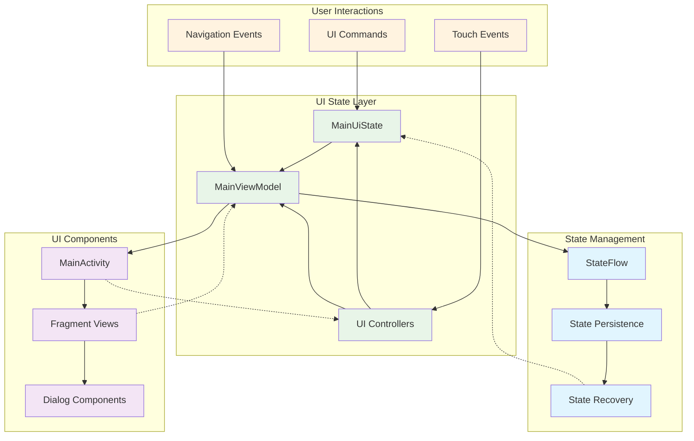

# UI State Management Protocol

## Table of Contents

- [Data Contract and API Specification](#data-contract-and-api-specification)
  - [Overview](#overview)

## Data Contract and API Specification

### Overview

This document defines the formal data contracts, APIs, and state management protocols for the Multi-Sensor Recording System's UI architecture. It serves as the authoritative reference for developers working with UI state, navigation events, and controller interactions.

### State Management Architecture



#### Core State Object: MainUiState

The `MainUiState` data class serves as the single source of truth for all UI-related state:

```kotlin
data class MainUiState(
    // Status and messaging
    val statusText: String = "Ready",
    val errorMessage: String? = null,
    val showErrorDialog: Boolean = false,
    
    // Recording state
    val isRecording: Boolean = false,
    val canStartRecording: Boolean = true,
    val canStopRecording: Boolean = false,
    val canRunCalibration: Boolean = true,
    
    // Device connectivity
    val isPcConnected: Boolean = false,
    val isShimmerConnected: Boolean = false,
    val isThermalConnected: Boolean = false,
    
    // System status
    val batteryLevel: Int = -1,
    val isStreaming: Boolean = false,
    val streamingFrameRate: Int = 0,
    val streamingDataSize: String = "0KB/s",
    
    // UI controls
    val showPermissionsButton: Boolean = false,
    
    // Session information
    val currentSessionInfo: SessionDisplayInfo? = null,
    val recordingSessionId: String? = null,
    val shimmerDeviceInfo: ShimmerDeviceInfo? = null
)
```

#### State Field Specifications

| Field Name | Data Type | Required | Description | Valid Values |
|------------|-----------|----------|-------------|--------------|
| `statusText` | String | Yes | Current system status message | Any non-empty string |
| `errorMessage` | String? | No | Error message when applicable | String or null |
| `showErrorDialog` | Boolean | Yes | Whether to display error dialog | true, false |
| `isRecording` | Boolean | Yes | Current recording state | true, false |
| `canStartRecording` | Boolean | Yes | Whether start recording is enabled | true, false |
| `canStopRecording` | Boolean | Yes | Whether stop recording is enabled | true, false |
| `canRunCalibration` | Boolean | Yes | Whether calibration is available | true, false |
| `isPcConnected` | Boolean | Yes | PC network connection status | true, false |
| `isShimmerConnected` | Boolean | Yes | Shimmer device connection status | true, false |
| `isThermalConnected` | Boolean | Yes | Thermal camera connection status | true, false |
| `batteryLevel` | Int | Yes | Device battery percentage | -1 (unknown) or 0-100 |
| `isStreaming` | Boolean | Yes | Data streaming status | true, false |
| `streamingFrameRate` | Int | Yes | Current streaming frame rate | >= 0 (frames per second) |
| `streamingDataSize` | String | Yes | Data throughput display | Format: "XKB/s" or "XMB/s" |
| `showPermissionsButton` | Boolean | Yes | Permission button visibility | true, false |
| `currentSessionInfo` | SessionDisplayInfo? | No | Active session information | Object or null |
| `recordingSessionId` | String? | No | Current session identifier | UUID string or null |
| `shimmerDeviceInfo` | ShimmerDeviceInfo? | No | Shimmer device details | Object or null |

#### State Validation Rules

**Invariants that must be maintained:**

1. **Recording State Consistency**:
   ```kotlin
   // When recording is active, start must be disabled and stop enabled
   if (isRecording) {
       require(!canStartRecording && canStopRecording)
   }
   
   // When not recording, start must be enabled and stop disabled
   if (!isRecording) {
       require(canStartRecording && !canStopRecording)
   }
   ```

2. **Calibration Availability**:
   ```kotlin
   // Calibration should not be available during recording
   if (isRecording) {
       require(!canRunCalibration)
   }
   ```

3. **Battery Level Constraints**:
   ```kotlin
   // Battery level must be valid range or unknown
   require(batteryLevel == -1 || batteryLevel in 0..100)
   ```

4. **Streaming Consistency**:
   ```kotlin
   // Streaming implies positive frame rate
   if (isStreaming) {
       require(streamingFrameRate > 0)
   }
   ```

### Navigation Protocol

#### NavigationUtils API

The `NavigationUtils` object provides standardized navigation operations:

##### Fragment Navigation

```kotlin
fun navigateToFragment(fragment: Fragment, destinationId: Int)
```

**Parameters:**
- `fragment: Fragment` - Source fragment initiating navigation
- `destinationId: Int` - Target destination resource ID

**Behavior:**
- Validates current destination before navigation
- Handles navigation exceptions gracefully
- Logs navigation events for debugging

**Example Usage:**
```kotlin
NavigationUtils.navigateToFragment(this, R.id.nav_recording)
```

##### Activity Launch

```kotlin
fun launchActivity(context: Context, activityClass: Class<*>, extras: Map<String, String>? = null)
```

**Parameters:**
- `context: Context` - Activity context for launching
- `activityClass: Class<*>` - Target activity class
- `extras: Map<String, String>?` - Optional intent extras

**Example Usage:**
```kotlin
NavigationUtils.launchActivity(
    this, 
    SettingsActivity::class.java,
    mapOf("section" to "network")
)
```

##### Drawer Navigation

```kotlin
fun handleDrawerNavigation(navController: NavController, itemId: Int): Boolean
```

**Parameters:**
- `navController: NavController` - Navigation controller instance
- `itemId: Int` - Selected menu item ID

**Returns:** `Boolean` - true if navigation handled, false otherwise

**Supported Navigation Items:**

| Item ID | Destination | Description |
|---------|-------------|-------------|
| `R.id.nav_recording` | RecordingFragment | Recording controls and camera |
| `R.id.nav_devices` | DevicesFragment | Device management |
| `R.id.nav_calibration` | CalibrationFragment | Calibration procedures |
| `R.id.nav_files` | FilesFragment | File management |

### Controller Communication Protocol

#### UIController Callback Interface

The `UIController.UICallback` interface defines the communication contract between the UI controller and UI layer:

```kotlin
interface UICallback {
    // Component lifecycle
    fun onUIComponentsInitialized()
    fun onUIStateUpdated(state: MainUiState)
    fun onUIError(message: String)
    
    // Status updates
    fun updateStatusText(text: String)
    fun showToast(message: String, duration: Int = Toast.LENGTH_SHORT)
    fun runOnUiThread(action: () -> Unit)
    
    // Component access
    fun getContext(): Context
    fun getStatusText(): TextView?
    fun getStartRecordingButton(): View?
    fun getStopRecordingButton(): View?
    fun getCalibrationButton(): View?
    
    // Status indicators
    fun getPcConnectionIndicator(): View?
    fun getShimmerConnectionIndicator(): View?
    fun getThermalConnectionIndicator(): View?
    fun getPcConnectionStatus(): TextView?
    fun getShimmerConnectionStatus(): TextView?
    fun getThermalConnectionStatus(): TextView?
    fun getBatteryLevelText(): TextView?
    
    // Recording indicators
    fun getRecordingIndicator(): View?
    fun getStreamingIndicator(): View?
    fun getStreamingLabel(): View?
    fun getStreamingDebugOverlay(): TextView?
    
    // Permission UI
    fun getRequestPermissionsButton(): View?
    fun getShimmerStatusText(): TextView?
}
```

#### PermissionController Callback Interface

The `PermissionController.PermissionCallback` interface manages permission-related events:

```kotlin
interface PermissionCallback {
    // Permission state notifications
    fun onAllPermissionsGranted()
    fun onPermissionsTemporarilyDenied(
        deniedPermissions: List<String>, 
        grantedCount: Int, 
        totalCount: Int
    )
    fun onPermissionsPermanentlyDenied(deniedPermissions: List<String>)
    
    // Process notifications
    fun onPermissionCheckStarted()
    fun onPermissionRequestCompleted()
    
    // UI updates
    fun updateStatusText(text: String)
    fun showPermissionButton(show: Boolean)
}
```

### State Persistence Protocol

#### UIController State Persistence

The `UIController` persists UI state using SharedPreferences:

**Storage Keys:**

| Key | Type | Description |
|-----|------|-------------|
| `last_battery_level` | Int | Last known battery percentage |
| `pc_connection_status` | Boolean | PC connection state |
| `shimmer_connection_status` | Boolean | Shimmer connection state |
| `thermal_connection_status` | Boolean | Thermal camera connection state |
| `recording_state` | Boolean | Last recording state |
| `streaming_state` | Boolean | Last streaming state |
| `ui_theme_mode` | String | Selected theme ("light", "dark", "auto") |
| `accessibility_mode` | Boolean | Accessibility features enabled |
| `high_contrast_mode` | Boolean | High contrast mode enabled |

**Persistence Operations:**

```kotlin
// Save state
fun saveUIState(state: MainUiState) {
    sharedPreferences?.edit()?.apply {
        putInt(KEY_LAST_BATTERY_LEVEL, state.batteryLevel)
        putBoolean(KEY_PC_CONNECTION_STATUS, state.isPcConnected)
        putBoolean(KEY_SHIMMER_CONNECTION_STATUS, state.isShimmerConnected)
        putBoolean(KEY_THERMAL_CONNECTION_STATUS, state.isThermalConnected)
        putBoolean(KEY_RECORDING_STATE, state.isRecording)
        putBoolean(KEY_STREAMING_STATE, state.isStreaming)
        apply()
    }
}

// Restore state
fun getSavedUIState(): SavedUIState {
    return sharedPreferences?.let { prefs ->
        SavedUIState(
            lastBatteryLevel = prefs.getInt(KEY_LAST_BATTERY_LEVEL, -1),
            isPcConnected = prefs.getBoolean(KEY_PC_CONNECTION_STATUS, false),
            isShimmerConnected = prefs.getBoolean(KEY_SHIMMER_CONNECTION_STATUS, false),
            isThermalConnected = prefs.getBoolean(KEY_THERMAL_CONNECTION_STATUS, false),
            wasRecording = prefs.getBoolean(KEY_RECORDING_STATE, false),
            wasStreaming = prefs.getBoolean(KEY_STREAMING_STATE, false),
            themeMode = prefs.getString(KEY_UI_THEME_MODE, "default") ?: "default",
            accessibilityMode = prefs.getBoolean(KEY_ACCESSIBILITY_MODE, false),
            highContrastMode = prefs.getBoolean(KEY_HIGH_CONTRAST_MODE, false)
        )
    } ?: SavedUIState()
}
```

### Event Messaging Protocol

#### UI Events

UI events are communicated through structured message objects:

##### Recording Events

```kotlin
// Recording state change events
data class RecordingEvent(
    val action: RecordingAction,
    val sessionId: String? = null,
    val timestamp: Long = System.currentTimeMillis()
)

enum class RecordingAction {
    START_REQUESTED,
    STARTED,
    STOP_REQUESTED,
    STOPPED,
    ERROR,
    PAUSED,
    RESUMED
}
```

##### Device Events

```kotlin
// Device connection events
data class DeviceEvent(
    val deviceType: DeviceType,
    val connectionStatus: ConnectionStatus,
    val deviceInfo: Map<String, String> = emptyMap(),
    val timestamp: Long = System.currentTimeMillis()
)

enum class DeviceType {
    PC_NETWORK,
    SHIMMER_GSR,
    THERMAL_CAMERA,
    VISIBLE_CAMERA
}

enum class ConnectionStatus {
    CONNECTED,
    DISCONNECTED,
    CONNECTING,
    ERROR,
    UNKNOWN
}
```

##### Navigation Events

```kotlin
// Navigation tracking events
data class NavigationEvent(
    val fromDestination: String,
    val toDestination: String,
    val navigationType: NavigationType,
    val timestamp: Long = System.currentTimeMillis()
)

enum class NavigationType {
    TAB_SELECTION,
    FRAGMENT_NAVIGATION,
    ACTIVITY_LAUNCH,
    DRAWER_NAVIGATION,
    BACK_NAVIGATION
}
```

### Validation and Error Handling

#### State Validation Protocol

```kotlin
// State validation result
data class StateValidationResult(
    val isValid: Boolean,
    val violations: List<String>,
    val warnings: List<String>,
    val timestamp: Long = System.currentTimeMillis()
)

// UI validation result
data class UIValidationResult(
    val isValid: Boolean,
    val errors: List<String>,
    val warnings: List<String>,
    val componentCount: Int,
    val validationTimestamp: Long
)
```

#### Error Recovery Protocol

```kotlin
// Recovery attempt result
data class UIRecoveryResult(
    val success: Boolean,
    val recoveryActions: List<String>,
    val recoveryTimestamp: Long
)

// Recovery strategies
enum class RecoveryStrategy {
    REINITIALIZE_COMPONENTS,
    RESTORE_FROM_PERSISTENCE,
    RESET_TO_DEFAULT_STATE,
    DELEGATE_TO_FALLBACK,
    REQUEST_USER_INTERVENTION
}
```

### Performance Monitoring

#### State Update Metrics

```kotlin
// Performance metrics for state updates
data class StateUpdateMetrics(
    val updateDuration: Long, // milliseconds
    val componentCount: Int,
    val stateSize: Int, // bytes
    val validationTime: Long, // milliseconds
    val persistenceTime: Long, // milliseconds
    val timestamp: Long = System.currentTimeMillis()
)
```

#### Navigation Performance

```kotlin
// Navigation timing metrics
data class NavigationMetrics(
    val navigationDuration: Long, // milliseconds
    val destinationId: Int,
    val fragmentCreationTime: Long, // milliseconds
    val stateRestoreTime: Long, // milliseconds
    val timestamp: Long = System.currentTimeMillis()
)
```

### Threading and Concurrency

#### Thread Safety Requirements

1. **UI Thread Operations**:
   - All UI updates must occur on the main thread
   - State observation callbacks run on main thread
   - Navigation operations execute on main thread

2. **Background Thread Operations**:
   - State persistence operations
   - Validation computations
   - Performance metric calculations

3. **Synchronization Protocol**:
   ```kotlin
   // StateFlow provides thread-safe state emission
   class MainViewModel : ViewModel() {
       private val _uiState = MutableStateFlow(MainUiState())
       val uiState: StateFlow<MainUiState> = _uiState.asStateFlow()
       
       fun updateState(updater: (MainUiState) -> MainUiState) {
           _uiState.update(updater)
       }
   }
   ```

### API Versioning and Compatibility

#### Version Information

```kotlin
// API version tracking
data class UIProtocolVersion(
    val major: Int = 1,
    val minor: Int = 0,
    val patch: Int = 0,
    val build: String = "stable"
) {
    override fun toString(): String = "$major.$minor.$patch-$build"
}
```

#### Backward Compatibility

1. **State Migration**: Automatic migration of persisted state between versions
2. **API Deprecation**: Graceful deprecation of obsolete callback methods
3. **Fallback Support**: Legacy navigation support for older fragment implementations

### Security Considerations

#### State Data Protection

1. **Sensitive Data Handling**:
   - No credentials stored in UI state
   - Session IDs encrypted in persistence layer
   - Device information sanitized before logging

2. **Permission Boundaries**:
   - UI state access restricted to authenticated controllers
   - Navigation validation prevents unauthorized access
   - State modification audit trail maintained

### Integration Examples

#### ViewModel Integration

```kotlin
class MainViewModel : ViewModel() {
    private val _uiState = MutableStateFlow(MainUiState())
    val uiState: StateFlow<MainUiState> = _uiState.asStateFlow()
    
    fun startRecording() {
        _uiState.update { currentState ->
            currentState.copy(
                isRecording = true,
                canStartRecording = false,
                canStopRecording = true,
                canRunCalibration = false,
                statusText = "Recording in progress..."
            )
        }
    }
}
```

#### Fragment State Observation

```kotlin
class RecordingFragment : Fragment() {
    private fun observeViewModel() {
        lifecycleScope.launch {
            repeatOnLifecycle(Lifecycle.State.STARTED) {
                viewModel.uiState.collect { state ->
                    updateRecordingUI(state)
                }
            }
        }
    }
    
    private fun updateRecordingUI(state: MainUiState) {
        binding.startButton.isEnabled = state.canStartRecording
        binding.stopButton.isEnabled = state.canStopRecording
        binding.statusText.text = state.statusText
    }
}
```

### Testing Protocol

#### State Testing

```kotlin
@Test
fun `state invariants maintained during recording transition`() {
    val initialState = MainUiState()
    val recordingState = initialState.copy(
        isRecording = true,
        canStartRecording = false,
        canStopRecording = true,
        canRunCalibration = false
    )
    
    // Validate state invariants
    assertTrue(!recordingState.canStartRecording)
    assertTrue(recordingState.canStopRecording)
    assertFalse(recordingState.canRunCalibration)
}
```

#### Navigation Testing

```kotlin
@Test
fun `navigation to recording fragment updates current destination`() {
    val navController = TestNavHostController(ApplicationProvider.getApplicationContext())
    
    NavigationUtils.navigateToFragment(mockFragment, R.id.nav_recording)
    
    assertEquals(R.id.nav_recording, navController.currentDestination?.id)
}
```

### Enhanced State Persistence and Recovery

#### JSON-based State Persistence Protocol

All UI controllers implement standardized JSON-based state persistence:

```json
{
  "ui_controller_state": {
    "version": "1.0",
    "last_updated": 1640995200000,
    "theme_config": {
      "current_theme": "DARK",
      "auto_theme_enabled": true,
      "theme_switch_time": "sunset",
      "custom_colors": {
        "primary": "#2196F3",
        "secondary": "#FF9800",
        "accent": "#4CAF50"
      }
    },
    "accessibility_config": {
      "increased_touch_targets": true,
      "high_contrast_mode": false,
      "audio_feedback": true,
      "haptic_feedback": true,
      "font_scale": 1.2
    },
    "component_states": {
      "status_indicators": {
        "pc_connection": {
          "visible": true,
          "status": "connected",
          "last_update": 1640995200000
        },
        "shimmer_connection": {
          "visible": true,
          "status": "disconnected",
          "last_update": 1640995195000
        }
      },
      "action_buttons": {
        "recording_controls": {
          "start_enabled": true,
          "stop_enabled": false,
          "calibration_enabled": true
        }
      }
    }
  }
}
```

#### Enhanced Theme Management Protocol

**Theme Configuration API:**

| Field Name | Data Type | Required | Description | Valid Values |
|------------|-----------|----------|-------------|--------------|
| `current_theme` | String | Yes | Active theme mode | "LIGHT", "DARK", "AUTO" |
| `auto_theme_enabled` | Boolean | Yes | Automatic theme switching | true, false |
| `theme_switch_time` | String | No | Auto switch trigger | "sunset", "sunrise", "schedule" |
| `custom_colors` | Object | No | Custom color overrides | Color hex values |

**Theme Validation Rules:**
```kotlin
// Theme consistency validation
fun validateThemeConfig(config: ThemeConfig): ThemeValidationResult {
    val errors = mutableListOf<String>()
    
    // Validate theme mode
    if (config.currentTheme !in listOf("LIGHT", "DARK", "AUTO")) {
        errors.add("Invalid theme mode: ${config.currentTheme}")
    }
    
    // Validate custom colors if present
    config.customColors?.let { colors ->
        colors.values.forEach { color ->
            if (!isValidHexColor(color)) {
                errors.add("Invalid color format: $color")
            }
        }
    }
    
    return ThemeValidationResult(
        isValid = errors.isEmpty(),
        errors = errors
    )
}
```

#### Accessibility Configuration Protocol

**Accessibility State Structure:**
```json
{
  "accessibility_config": {
    "is_enabled": true,
    "features": {
      "increased_touch_targets": {
        "enabled": true,
        "target_size_dp": 48,
        "minimum_spacing_dp": 8
      },
      "high_contrast_mode": {
        "enabled": false,
        "contrast_ratio": 4.5,
        "background_adjustment": true
      },
      "audio_feedback": {
        "enabled": true,
        "voice_guidance": true,
        "sound_effects": true,
        "volume_level": 0.8
      },
      "haptic_feedback": {
        "enabled": true,
        "intensity": "medium",
        "pattern": "standard"
      }
    },
    "screen_reader": {
      "enabled": false,
      "reading_speed": "normal",
      "content_descriptions": true
    }
  }
}
```

#### Dynamic Menu System Protocol

**Menu Configuration API:**

```json
{
  "menu_config": {
    "dynamic_items": [
      {
        "item_id": "advanced_settings",
        "title": "Advanced Settings",
        "icon_resource": "ic_advanced_settings",
        "enabled": true,
        "visibility": "VISIBLE",
        "position": 3,
        "group_id": "settings_group",
        "action_type": "ACTIVITY_LAUNCH",
        "action_data": {
          "target_activity": "AdvancedSettingsActivity",
          "extras": {
            "source": "main_menu"
          }
        }
      }
    ],
    "context_menu_config": {
      "trigger_type": "LONG_PRESS",
      "show_icons": true,
      "max_items": 8,
      "animation_enabled": true,
      "background_dim": true
    },
    "menu_analytics": {
      "track_usage": true,
      "track_performance": true,
      "track_accessibility": true
    }
  }
}
```

**Menu Item Validation:**
```kotlin
data class MenuItemValidationResult(
    val isValid: Boolean,
    val errors: List<String> = emptyList(),
    val warnings: List<String> = emptyList()
)

fun validateMenuItem(item: DynamicMenuItem): MenuItemValidationResult {
    val errors = mutableListOf<String>()
    val warnings = mutableListOf<String>()
    
    // Required field validation
    if (item.itemId.isBlank()) {
        errors.add("Menu item ID cannot be empty")
    }
    
    if (item.title.isBlank()) {
        errors.add("Menu item title cannot be empty")
    }
    
    // Accessibility validation
    if (item.icon == null && item.title.length > 20) {
        warnings.add("Long title without icon may affect accessibility")
    }
    
    return MenuItemValidationResult(
        isValid = errors.isEmpty(),
        errors = errors,
        warnings = warnings
    )
}
```

#### Status Display Controller Protocol

**Custom Status Configuration:**
```json
{
  "status_display_config": {
    "indicators": [
      {
        "indicator_id": "network_quality",
        "type": "REAL_TIME",
        "update_interval_ms": 1000,
        "display_format": "ICON_WITH_TEXT",
        "data_source": "NetworkController",
        "threshold_config": {
          "excellent": 80,
          "good": 60,
          "fair": 40,
          "poor": 20
        },
        "visual_config": {
          "show_percentage": true,
          "show_units": false,
          "color_coding": true,
          "animation_enabled": true
        }
      }
    ],
    "performance_monitoring": {
      "enabled": true,
      "metrics_collection": [
        "update_frequency",
        "render_time",
        "memory_usage",
        "cpu_usage"
      ],
      "alert_thresholds": {
        "slow_update_ms": 100,
        "high_memory_mb": 50,
        "high_cpu_percent": 20
      }
    }
  }
}
```

### Enhanced Error Recovery and Validation

#### UI Component Recovery Protocol

```kotlin
// Component recovery configuration
data class ComponentRecoveryConfig(
    val maxRecoveryAttempts: Int = 3,
    val recoveryDelayMs: Long = 1000,
    val fallbackToDefault: Boolean = true,
    val notifyUser: Boolean = false
)

// Recovery action results
data class RecoveryActionResult(
    val action: RecoveryAction,
    val success: Boolean,
    val errorMessage: String? = null,
    val recoveryTime: Long
)

enum class RecoveryAction {
    REINITIALIZE_COMPONENT,
    RESTORE_FROM_PERSISTENCE,
    RESET_TO_DEFAULT,
    REQUEST_USER_INPUT,
    FALLBACK_MODE
}
```

#### Validation Pipeline Protocol

```kotlin
// Multi-stage validation pipeline
interface UIValidationPipeline {
    fun validateComponent(component: View): ValidationResult
    fun validateState(state: MainUiState): ValidationResult
    fun validateAccessibility(config: AccessibilityConfig): ValidationResult
    fun validateTheme(theme: ThemeConfig): ValidationResult
}

// Comprehensive validation result
data class ValidationResult(
    val isValid: Boolean,
    val componentResults: Map<String, ComponentValidationResult>,
    val globalErrors: List<ValidationError>,
    val warnings: List<ValidationWarning>,
    val validationTime: Long = System.currentTimeMillis()
)
```

### Conclusion

This protocol document provides the comprehensive data contract for the Multi-Sensor Recording System's UI architecture. By adhering to these specifications, developers can ensure consistent, reliable, and maintainable UI state management throughout the application lifecycle.

The formal API definitions, state validation rules, and communication protocols establish a solid foundation for scalable UI development while maintaining system integrity and user experience quality.