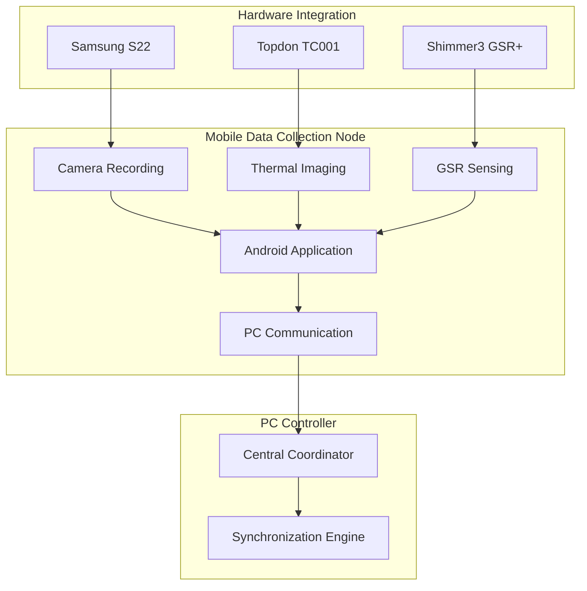

# Android Mobile Application Documentation Index

## Overview

This directory contains comprehensive documentation for the **Android Mobile Data Collection Node** - a sophisticated distributed mobile application that captures synchronized data from multiple sensor modalities including camera, thermal imaging, and physiological sensors.

## Documentation Structure

### 📱 Core Documentation

#### [README_Android_Mobile_Application.md](README_Android_Mobile_Application.md)
**Comprehensive Technical Overview**
- Complete architecture documentation
- Multi-sensor integration details
- Distributed communication protocols
- Performance characteristics
- Development and testing framework

#### [USER_GUIDE_Android_Mobile_Application.md](USER_GUIDE_Android_Mobile_Application.md)
**Researcher and User Manual**
- Step-by-step operational procedures
- Pre-flight checklists and setup guides
- Recording session workflows
- Sensor configuration instructions
- Calibration procedures
- Troubleshooting and best practices

#### [PROTOCOL_Android_Mobile_Application.md](PROTOCOL_Android_Mobile_Application.md)
**Technical Protocol Specifications**
- Network communication protocols
- JSON message formats and schemas
- Data export formats and structures
- Error handling and recovery procedures
- Security and privacy specifications

## Application Overview

### 🎯 Primary Function
The Android Mobile Application serves as a **distributed mobile data collection node** that:

- Captures synchronized data from phone's built-in camera (4K video + RAW images)
- Integrates attached thermal camera (Topdon TC001) via USB-C OTG
- Connects to Shimmer3 GSR+ physiological sensors via Bluetooth
- Communicates with PC controller for coordinated multi-device recording
- Provides real-time preview streaming and status monitoring

### 🏗️ Architecture Highlights

### 🔧 Key Features

#### Multi-Sensor Recording
- **4K Video Recording**: High-quality video capture with Camera2 API
- **RAW Image Capture**: Simultaneous DNG format images for calibration
- **Thermal Imaging**: Real-time thermal capture with temperature measurement
- **Physiological Sensing**: GSR data collection with configurable sampling rates

#### Distributed Architecture
- **Socket Communication**: JSON-based protocol with PC controller
- **Real-time Synchronization**: Microsecond-precision timing coordination
- **Preview Streaming**: Live video transmission for monitoring
- **Session Management**: Coordinated recording across multiple devices

#### Advanced Capabilities
- **Camera Calibration**: Intrinsic and stereo calibration procedures
- **Quality Assurance**: Real-time monitoring and error recovery
- **Data Export**: Structured session data with comprehensive metadata
- **Performance Optimization**: Resource management and battery optimization

## Getting Started

### 🚀 Quick Start for Researchers

1. **Read the User Guide**: Start with [USER_GUIDE_Android_Mobile_Application.md](USER_GUIDE_Android_Mobile_Application.md)
2. **Hardware Setup**: Ensure Samsung S22, Topdon TC001, and Shimmer3 GSR+ are available
3. **Software Installation**: Install Android APK and configure permissions
4. **Network Configuration**: Connect to PC controller via WiFi
5. **Sensor Calibration**: Perform camera and sensor calibration procedures
6. **Test Recording**: Execute test session to verify functionality

### 🔧 Quick Start for Developers

1. **Technical Overview**: Review [README_Android_Mobile_Application.md](README_Android_Mobile_Application.md)
2. **Protocol Understanding**: Study [PROTOCOL_Android_Mobile_Application.md](PROTOCOL_Android_Mobile_Application.md)
3. **Source Code**: Examine Android application source code in `/AndroidApp/`
4. **Build System**: Use Gradle build configuration
5. **Testing Framework**: Run comprehensive test suite
6. **Integration**: Integrate with PC controller system

## Technical Specifications

### 📊 System Requirements

#### Hardware Requirements
- **Android Device**: Samsung S22 or compatible (Android 7.0+)
- **Thermal Camera**: Topdon TC001 USB-C thermal camera
- **Physiological Sensor**: Shimmer3 GSR+ Bluetooth sensor
- **Network**: WiFi network for PC communication
- **Storage**: Minimum 8GB available storage

#### Software Requirements
- **Android Version**: 7.0+ (API level 24+)
- **Build Tools**: Gradle 8.11.1, Kotlin 2.0.20
- **Dependencies**: Camera2 API, Topdon SDK, Shimmer Android API
- **Permissions**: Camera, microphone, storage, location, Bluetooth

### 🌐 Communication Protocol

#### Network Protocol
- **Transport**: TCP Socket connections
- **Format**: JSON message protocol
- **Ports**: 8080 (command), 8081 (preview streaming)
- **Security**: Optional AES-256 encryption
- **Quality**: Automatic bandwidth adaptation

#### Data Formats
- **Video**: H.264 MP4, 4K resolution
- **Images**: Adobe DNG (RAW format)
- **Thermal**: Binary temperature data + metadata
- **Physiological**: CSV format with timestamps
- **Metadata**: JSON session information

## Use Cases and Applications

### 🔬 Research Applications

#### Psychological Research
- Multi-modal emotion recognition studies
- Stress response measurement with physiological correlation
- Behavioral analysis with synchronized video and GSR data

#### Medical Research
- Patient monitoring with thermal and physiological sensors
- Treatment effectiveness assessment with objective measurements
- Rehabilitation progress tracking with multi-sensor data

#### Human-Computer Interaction
- User experience studies with physiological feedback
- Interface usability testing with stress measurement
- Accessibility research with comprehensive sensor data

### 🏭 Industrial Applications

#### Quality Control
- Product inspection with thermal imaging
- Worker safety monitoring with environmental sensors
- Process optimization with synchronized data collection

#### Research and Development
- Product testing with multi-modal data collection
- User testing with physiological feedback
- Performance evaluation with objective measurements

## Development and Maintenance

### 🧪 Testing and Validation

#### Automated Testing
- Unit tests for individual components
- Integration tests for sensor coordination
- Performance tests for resource utilization
- Network tests for communication reliability

#### Manual Testing
- End-to-end recording session validation
- Multi-device synchronization testing
- Error condition simulation and recovery
- User interface usability testing

### 🔄 Continuous Integration

#### Build Pipeline
- Automated builds on code changes
- Comprehensive test suite execution
- Code quality analysis and reporting
- Deployment artifact generation

#### Quality Assurance
- Code review requirements
- Documentation updates
- Version control and tagging
- Release notes and changelog

### 📈 Performance Monitoring

#### Key Metrics
- Recording session success rate
- Sensor connection reliability
- Network communication quality
- Battery life and resource usage

#### Optimization
- Memory usage optimization
- Network bandwidth efficiency
- Storage space management
- User interface responsiveness

## Support and Community

### 📚 Learning Resources

#### Documentation
- Comprehensive technical documentation
- Step-by-step user guides
- Protocol specifications and examples
- Troubleshooting and FAQ sections

#### Training Materials
- Video tutorials for common procedures
- Hands-on training sessions for new users
- Best practices guides for research applications
- Case studies and example implementations

### 🤝 Community Support

#### Development Community
- Source code repository access
- Issue tracking and bug reports
- Feature requests and enhancement proposals
- Developer discussion forums

#### Research Community
- User experience sharing
- Research application examples
- Collaborative development opportunities
- Academic paper references and citations

## Future Development

### 🚀 Planned Enhancements

#### Feature Additions
- Additional sensor type support
- Enhanced calibration procedures
- Advanced data analysis tools
- Cloud integration capabilities

#### Performance Improvements
- Reduced latency communication
- Enhanced battery life optimization
- Improved error recovery mechanisms
- Streamlined user interface design

#### Platform Expansion
- iOS application development
- Web-based control interface
- Cloud-based data processing
- Integration with analysis platforms

---

## Summary

The Android Mobile Data Collection Node represents a sophisticated, research-grade mobile application that enables synchronized multi-sensor data collection for a wide range of scientific and industrial applications. Through its comprehensive documentation, robust architecture, and extensive testing framework, it provides researchers and developers with a powerful tool for multi-modal data collection and analysis.

For technical support, feature requests, or contribution opportunities, please refer to the project repository and community resources.