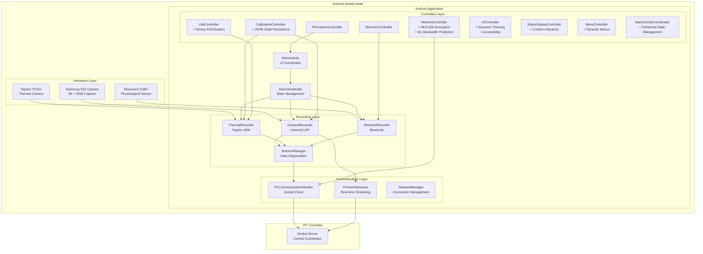
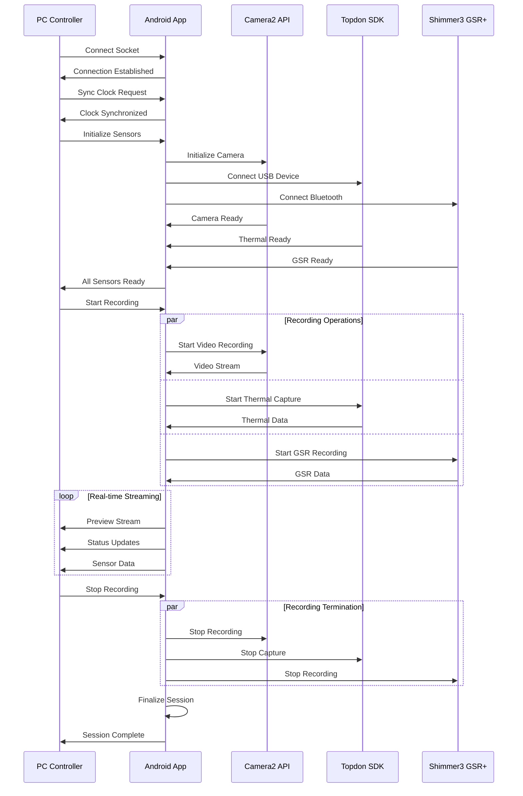

# Android Mobile Application: Distributed Mobile Data Collection Node

## Overview

The Android Mobile Application serves as a sophisticated **distributed mobile data collection node** within the Multi-Sensor Recording System. It is responsible for capturing synchronized data from multiple sensor modalities:

- **Phone's built-in camera** (4K video recording with RAW image capture)
- **Attached thermal camera** (Topdon TC001 via USB-C OTG)
- **Connected Shimmer physiological sensor** (Shimmer3 GSR+ via Bluetooth)

The application operates as a coordinated node in a distributed architecture, communicating with a PC controller via WiFi socket connections to enable precise temporal synchronization across all data sources.

## Architecture Overview



## Core Features

### 📱 Multi-Sensor Data Collection

#### 1. Camera Recording (Camera2 API)
- **4K Video Recording**: High-quality video capture at configurable frame rates
- **RAW Image Capture**: Simultaneous DNG/RAW image capture for calibration
- **Dual Capture Mode**: Video and still image capture in parallel
- **Manual Camera Controls**: ISO, exposure time, focus distance configuration
- **Preview Streaming**: Real-time video preview transmission to PC controller

#### 2. Thermal Imaging (Topdon SDK Integration)
- **Real-time Thermal Capture**: Live thermal imaging via USB-C OTG
- **Temperature Measurement**: Accurate temperature readings across the frame
- **Thermal Data Export**: Binary thermal data with metadata preservation
- **Device Management**: Automatic USB device detection and initialization
- **Calibration Support**: Thermal-RGB alignment for synchronized recording

#### 3. Physiological Sensing (Shimmer3 GSR+)
- **Bluetooth Communication**: Wireless connection to Shimmer3 GSR+ sensors
- **Real-time GSR Data**: Galvanic skin response measurement and streaming
- **Sampling Rate Control**: Configurable data collection frequencies
- **Session-based Recording**: Organized data collection with timestamps
- **Multiple Sensor Support**: Simultaneous connection to multiple Shimmer devices

### 🔧 Enhanced Controller Architecture

The application features a comprehensive controller architecture with advanced state management, security, and user experience enhancements:

#### State Persistence & Recovery
- **JSON-based State Persistence**: All controllers implement SharedPreferences-based state persistence with structured JSON storage
- **Session Recovery**: Automatic restoration of interrupted recording and calibration sessions
- **Configuration Resilience**: UI state and device configurations survive app restarts and configuration changes
- **Cross-Controller Synchronization**: Coordinated state management across all system components

#### Advanced Networking & Security
- **AES-256 Encryption**: Secure data transmission with proper key management and initialization vectors
- **Real-time Signal Strength**: WiFi RSSI and cellular signal strength monitoring for connection optimization
- **Machine Learning Bandwidth Prediction**: Linear regression models for adaptive streaming quality
- **Advanced Protocol Support**: RTMP, WebRTC, HLS, DASH, UDP, and TCP streaming protocols

#### Enhanced Device Management
- **Device Prioritization**: Intelligent device selection for multi-device recording scenarios
- **Hot-swap Detection**: Automatic device replacement handling with seamless transitions
- **Per-device Configuration Profiles**: Persistent settings and calibration states for each device
- **Network-based Status Reporting**: Remote monitoring and diagnostics capabilities

#### User Interface & Accessibility
- **Dynamic Theming**: Light, dark, and auto modes with persistent theme selection
- **Comprehensive Accessibility**: Touch target adjustment, high contrast mode, and audio feedback
- **UI Component Validation**: Automatic error detection and recovery for UI inconsistencies
- **Advanced Menu System**: Dynamic menu items, context menus, and keyboard navigation

#### Production-Ready Features
- **Enhanced Error Handling**: Automatic recovery mechanisms with fallback strategies
- **Thread Safety**: Concurrent operation support with proper synchronization
- **Resource Management**: Automatic cleanup and memory optimization
- **Comprehensive Logging**: Structured logging for debugging and system monitoring

### 🌐 Distributed Architecture

#### Network Communication
- **Socket-based Protocol**: JSON message communication with PC controller
- **Real-time Synchronization**: Microsecond-precision timing coordination
- **Preview Streaming**: Live video transmission for monitoring
- **Command Interface**: Remote control of recording operations
- **Status Reporting**: Continuous device health and status updates

#### Session Management
- **Coordinated Recording**: Synchronized start/stop across all sensors
- **Session Metadata**: Comprehensive recording session information
- **File Organization**: Automatic directory structure and naming
- **Data Validation**: Integrity checking and error recovery
- **Export Functions**: Standardized data export for analysis

### 🔧 Technical Implementation

#### Modern Android Development
- **Language**: Kotlin with Android Views and ViewBinding
- **Architecture**: Clean Architecture with MVVM pattern
- **Dependency Injection**: Hilt for component management
- **Concurrency**: Kotlin Coroutines for asynchronous operations
- **Database**: Room for local data persistence
- **Networking**: OkHttp for socket communication

#### Permission Management
- **Runtime Permissions**: Dynamic permission handling for all sensors
- **Background Execution**: Foreground service for continuous recording
- **Battery Optimization**: Power management for extended recording sessions
- **USB Permissions**: Automatic thermal camera access management

## User Interface

### 🎛️ Main Activity Interface

The MainActivity provides a comprehensive control interface for multi-sensor recording:

#### Navigation Structure
- **Navigation Drawer**: Organized access to all functional areas
  - Main Functions: Recording, Devices, Calibration, Files
  - Settings: Network Config, Shimmer Config, App Settings
  - Tools: Sync Tests, About, Diagnostics

- **Bottom Navigation**: Quick access to frequently used functions
  - Record: Start/stop recording operations
  - Monitor: Real-time sensor status monitoring
  - Calibrate: Camera and sensor calibration

#### Status Monitoring
- **Device Status Indicators**: Real-time connection status for all sensors
- **Recording Progress**: Session duration, data rates, storage usage
- **Network Status**: PC connection, bandwidth, latency information
- **Error Reporting**: Clear error messages and recovery guidance

#### Control Functions
- **Session Control**: Start/stop recording with synchronized timing
- **Preview Control**: Toggle real-time preview streaming
- **Calibration Control**: Initiate camera and sensor calibration
- **File Management**: Session review, export, and sharing

### 📊 Fragment-based Architecture

#### RecordingFragment
- **Recording Controls**: Start/stop buttons with session management
- **Real-time Monitoring**: Live sensor data display and status indicators
- **Session Information**: Current recording parameters and progress
- **Error Handling**: Recording issue detection and recovery

#### DevicesFragment
- **Connection Management**: Individual sensor connection controls
- **Device Discovery**: Automatic detection of available sensors
- **Status Monitoring**: Health indicators for all connected devices
- **Configuration Access**: Direct access to sensor-specific settings

#### CalibrationFragment
- **Calibration Workflows**: Step-by-step calibration procedures
- **Quality Assessment**: Calibration accuracy validation and recommendations
- **Pattern Detection**: Automatic calibration target recognition
- **Results Management**: Calibration data storage and retrieval

#### FilesFragment
- **Session Browser**: Navigate recorded sessions with preview
- **Data Export**: Export functions for analysis software
- **Storage Management**: Storage usage monitoring and cleanup
- **Sharing Functions**: Share session data via standard Android methods

## Data Flow Architecture

### 📈 Recording Workflow



### 💾 Data Storage Organization

```
/Android/data/com.multisensor.recording/files/
├── sessions/
│   ├── session_YYYYMMDD_HHMMSS/
│   │   ├── metadata.json                 # Session information
│   │   ├── camera/
│   │   │   ├── video.mp4                # 4K video recording
│   │   │   ├── frames/                   # RAW image captures
│   │   │   │   ├── frame_001.dng
│   │   │   │   ├── frame_002.dng
│   │   │   │   └── ...
│   │   │   └── camera_params.json        # Camera settings
│   │   ├── thermal/
│   │   │   ├── thermal_data.bin          # Binary thermal data
│   │   │   ├── thermal_metadata.json     # Temperature calibration
│   │   │   └── thermal_preview.mp4       # Thermal video preview
│   │   ├── shimmer/
│   │   │   ├── gsr_data.csv             # GSR measurements
│   │   │   ├── shimmer_config.json       # Sensor configuration
│   │   │   └── timestamps.json           # Synchronization data
│   │   └── logs/
│   │       ├── session.log               # Session event log
│   │       ├── errors.log                # Error tracking
│   │       └── performance.log           # Performance metrics
├── calibration/
│   ├── camera_calibration.json           # Camera intrinsic parameters
│   ├── thermal_calibration.json          # Thermal camera parameters
│   └── stereo_calibration.json           # RGB-Thermal alignment
└── temp/
    ├── preview_frames/                   # Temporary preview data
    └── processing/                       # Temporary processing files
```

## Integration Protocols

### 🔌 PC Communication Protocol

#### JSON Message Format
```json
{
  "type": "command|response|status|data",
  "timestamp": 1640995200000,
  "session_id": "session_20220101_120000",
  "device_id": "android_device_01",
  "payload": {
    // Message-specific data
  }
}
```

#### Command Messages
- `CONNECT`: Establish communication with PC controller
- `SYNC_CLOCK`: Synchronize timing with master clock
- `START_RECORDING`: Begin synchronized recording session
- `STOP_RECORDING`: End recording session
- `START_PREVIEW`: Enable real-time preview streaming
- `STOP_PREVIEW`: Disable preview streaming
- `GET_STATUS`: Request device status information
- `CALIBRATE`: Initiate calibration procedures

#### Status Reporting
- `DEVICE_STATUS`: Current sensor connection status
- `RECORDING_STATUS`: Active recording information
- `NETWORK_STATUS`: Communication quality metrics
- `ERROR_STATUS`: Error conditions and recovery status
- `SENSOR_DATA`: Real-time sensor measurements

### 📡 Network Configuration

#### Connection Parameters
- **Protocol**: TCP Socket communication
- **Default Port**: 8080 (configurable)
- **Preview Port**: 8081 (video streaming)
- **Timeout**: 30 seconds for commands
- **Retry Policy**: Automatic reconnection with exponential backoff

#### Quality of Service
- **Bandwidth Adaptation**: Dynamic quality adjustment based on network conditions
- **Compression**: Configurable preview stream compression
- **Buffering**: Intelligent buffering for network resilience
- **Prioritization**: Critical commands prioritized over data streams

## Performance Characteristics

### ⚡ System Performance

#### Recording Capabilities
- **Simultaneous Sensors**: 3+ sensors recording concurrently
- **Recording Duration**: Extended sessions (hours) with stable performance
- **Data Throughput**: High-bandwidth data collection and transmission
- **Memory Management**: Efficient resource usage with automatic cleanup
- **Battery Optimization**: Extended recording with minimal battery drain

#### Real-time Processing
- **Preview Generation**: Low-latency video preview streaming
- **Data Processing**: Real-time sensor data validation and formatting
- **Network Streaming**: Continuous data transmission with quality adaptation
- **Error Recovery**: Automatic recovery from temporary failures

### 🔧 Resource Utilization

#### Memory Management
- **Efficient Buffering**: Circular buffers for continuous data streams
- **Garbage Collection**: Optimized object lifecycle management
- **Memory Monitoring**: Real-time memory usage tracking and alerts
- **Resource Cleanup**: Automatic resource release on session termination
- **Object Pooling**: Sophisticated memory management strategies to minimize garbage collection overhead
- **Efficient Data Structures**: Optimized for computationally intensive image processing operations
- **Large Data Array Management**: Careful management for high-resolution video processing

#### Storage Management
- **Local Storage**: Organized session data storage with metadata
- **Compression**: Efficient data compression for storage optimization
- **Cleanup Policies**: Automatic cleanup of temporary and old data
- **Export Functions**: Streamlined data export for external analysis

#### Power Management Strategies
- **Adaptive Algorithms**: Balance measurement quality against battery life requirements
- **Dynamic Complexity Adjustment**: Automatic processing complexity adjustment based on power levels
- **Thermal Condition Monitoring**: Maintains adequate measurement quality during thermal constraints
- **Extended Operation Support**: Optimized for extended recording sessions

#### Thermal Management Integration
- **Android Integration**: Coordinates with Android's thermal management capabilities
- **Overheating Prevention**: Adaptive algorithms prevent device overheating during extended operation
- **Processing Load Adaptation**: Temporarily reduces processing load when device temperature approaches critical levels
- **Data Collection Continuity**: Maintains continuous data collection despite thermal constraints

## Development and Testing

### 🧪 Testing Framework

The Android application employs a comprehensive modern testing architecture following Android testing best practices:

#### Test Architecture Overview

```mermaid
graph TB
    subgraph "Android Test Architecture"
        subgraph "Test Framework"
            JUNIT[JUnit 5]
            ESPRESSO[Espresso UI Testing]
            MOCKK[MockK Advanced Mocking]
            HILT[Hilt Testing Framework]
        end
        
        subgraph "Test Types"
            UNIT_A[Unit Tests (JVM)]
            INST[Instrumentation Tests]
            UI_A[UI Tests]
            INTEG_A[Integration Tests]
            HARDWARE[Hardware Integration Tests]
        end
        
        subgraph "Test Infrastructure"
            HILT_TEST[Hilt Testing]
            ROOM_TEST[Room Database Testing]
            NETWORK_TEST[Network Layer Testing]
            CAMERA_TEST[Camera2 API Testing]
            THERMAL_TEST[Thermal Camera Testing]
            SENSOR_TEST[Sensor Integration Testing]
        end
    end
    
    JUNIT --> UNIT_A
    ESPRESSO --> UI_A
    MOCKK --> UNIT_A
    HILT --> INST
    UNIT_A --> HILT_TEST
    INST --> ROOM_TEST
    UI_A --> NETWORK_TEST
    INTEG_A --> CAMERA_TEST
    HARDWARE --> THERMAL_TEST
    HARDWARE --> SENSOR_TEST
```

#### Base Test Classes

**BaseUnitTest**
- Foundation for pure unit tests without Android dependencies
- Features: MockK setup, coroutine test dispatcher, Logger mocking
- Usage: `class MyTest : BaseUnitTest()`

**BaseRobolectricTest**
- Android component tests requiring Android context
- Features: Robolectric environment, application context, MockK setup
- Usage: `class MyAndroidTest : BaseRobolectricTest()`

**BaseInstrumentedTest**
- Instrumented tests with Hilt dependency injection
- Features: Hilt testing setup, Android instrumentation context
- Usage: `class MyInstrumentedTest : BaseInstrumentedTest()`

**BaseUiIntegrationTest**
- UI integration tests with Espresso
- Features: UI testing utilities, view interactions, Hilt integration
- Usage: `class MyUITest : BaseUiIntegrationTest()`

**BaseHardwareIntegrationTest**
- Hardware integration tests for devices and sensors
- Features: Hardware mocking, device simulation, sensor testing
- Usage: `class MyHardwareTest : BaseHardwareIntegrationTest()`

#### Unit Testing
- **Component Testing**: Individual sensor and controller validation
- **Mock Testing**: Isolated testing with sensor simulation
- **Performance Testing**: Resource usage and timing validation
- **Error Testing**: Failure condition simulation and recovery

#### Integration Testing
- **Sensor Integration**: Multi-sensor coordination testing
- **Network Testing**: PC communication protocol validation
- **Session Testing**: Complete recording workflow validation
- **Stress Testing**: Extended operation and resource stress testing

#### Test Data Factories

**SessionInfoTestFactory**: Creates consistent `SessionInfo` test data
**UiStateTestFactory**: Creates UI state test scenarios
**RecordingTestFactory**: Creates recording statistics and network quality data

#### Test Organization Structure
```
src/test/java/com/multisensor/recording/
├── testbase/           # Base test classes
├── testfixtures/       # Test data factories
├── testsuite/          # Test suite definitions
├── recording/          # Recording component tests
├── ui/                 # UI component tests
├── network/            # Network component tests
├── service/            # Service layer tests
└── util/               # Utility tests
```

### 🔨 Build Configuration

#### Android Configuration
- **Compile SDK**: 34 (Android 14)
- **Min SDK**: 24 (Android 7.0)
- **Target SDK**: 34 (Android 14)
- **Build Tools**: Gradle 8.11.1 with Kotlin 2.0.20

#### Dependencies
- **Core Libraries**: AndroidX libraries for modern Android development
- **Sensor SDKs**: Topdon SDK, Shimmer Android API
- **Networking**: OkHttp for socket communication
- **Database**: Room for local data persistence
- **Testing**: Comprehensive test framework with mocking

## Deployment and Configuration

### 📱 Installation Requirements

#### Hardware Requirements
- **Android Device**: Samsung S22 or compatible (Android 7.0+)
- **Thermal Camera**: Topdon TC001 or compatible USB-C thermal camera
- **Physiological Sensor**: Shimmer3 GSR+ or compatible Bluetooth sensor
- **Network**: WiFi network for PC communication
- **Storage**: Minimum 8GB available storage for session data

#### Software Configuration
- **Permissions**: Camera, microphone, location, storage, Bluetooth permissions
- **Network**: PC controller IP address and port configuration
- **Sensors**: Sensor-specific configuration and calibration
- **Storage**: Session data storage location and cleanup policies

### ⚙️ Configuration Management

#### Application Settings
- **Recording Parameters**: Resolution, frame rate, quality settings
- **Network Configuration**: PC connection settings and timeout values
- **Sensor Configuration**: Individual sensor settings and calibration
- **Storage Configuration**: Data storage location and retention policies
- **Performance Settings**: Resource usage and optimization settings

#### Calibration Configuration
- **Camera Calibration**: Intrinsic and extrinsic parameter configuration
- **Thermal Calibration**: Temperature calibration and alignment settings
- **Synchronization**: Timing synchronization and offset configuration
- **Quality Settings**: Calibration quality thresholds and validation

## Troubleshooting and Support

### 🔍 Common Issues and Solutions

#### Connection Issues
- **PC Communication**: Network configuration and firewall settings
- **Sensor Connection**: Bluetooth pairing and USB device permissions
- **Permission Errors**: Runtime permission management and recovery
- **Battery Optimization**: Power management and background execution

#### Recording Issues
- **Storage Space**: Automatic storage monitoring and cleanup
- **Sensor Failures**: Error detection and automatic recovery
- **Network Issues**: Connection resilience and data buffering
- **Performance Issues**: Resource optimization and monitoring

### 📞 Support Resources

#### Documentation
- **User Guides**: Step-by-step operational procedures
- **Technical Documentation**: Detailed implementation specifications
- **API Reference**: Complete interface and protocol documentation
- **Troubleshooting**: Common issues and resolution procedures

#### Development Support
- **Source Code**: Complete Android application source code
- **Build Instructions**: Detailed build and deployment procedures
- **Testing Framework**: Comprehensive testing and validation tools
- **Example Configurations**: Sample configurations for common use cases

---

## Security and Privacy Implementation

### 🔒 Research-Grade Security

#### Local Data Processing
- **Privacy Protection**: Sensitive raw data is processed locally on the capture device before transmission
- **Reduced Privacy Risks**: Significantly reduces privacy risks by minimizing raw data transmission
- **Performance Benefits**: Improves system performance by reducing network bandwidth requirements for high-resolution video data

#### Encryption and Data Protection
- **Industry-Standard Encryption**: All data transmission protected using industry-standard encryption protocols
- **Physiological Data Protection**: Additional protection mechanisms for particularly sensitive physiological data
- **Comprehensive Audit Trails**: Documents all data access and processing activities for research compliance

#### Research Compliance
- **Human Subjects Research**: Security mechanisms specifically designed for human subjects research applications
- **Data Integrity**: Comprehensive validation throughout the entire pipeline from collection to storage
- **Compliance Documentation**: Detailed audit trails and access logs for regulatory compliance

## Summary

The Android Mobile Application represents a sophisticated **distributed mobile data collection node** that successfully integrates multiple sensor modalities into a coordinated recording system. Through its robust architecture, comprehensive sensor integration, and seamless PC communication, it enables researchers to collect synchronized multi-modal data with research-grade precision and reliability.

The application's modern Android development practices, comprehensive error handling, and extensive documentation make it a valuable tool for experimental research requiring precise temporal synchronization across diverse sensor types. Its distributed architecture allows for scalable deployment across multiple mobile devices, creating a powerful platform for multi-participant and multi-location data collection scenarios.