# Camera Recording System (CameraRecorder) - Technical Deep-Dive

## Table of Contents

- [Overview](#overview)
- [Component Purpose and Role](#component-purpose-and-role)
- [Architecture Overview](#architecture-overview)
- [Key Classes and Responsibilities](#key-classes-and-responsibilities)
  - [CameraRecorder (Main Class)](#camerarecorder-main-class)
  - [SessionInfo (Data Container)](#sessioninfo-data-container)
  - [Camera Selection Algorithm](#camera-selection-algorithm)
- [Stage 3 RAW Extraction Workflow](#stage-3-raw-extraction-workflow)
  - [RAW Processing Pipeline](#raw-processing-pipeline)
  - [Samsung-Specific RAW Characteristics](#samsung-specific-raw-characteristics)
- [Integration with System Components](#integration-with-system-components)
  - [Hand Segmentation Integration](#hand-segmentation-integration)
  - [Network Streaming Integration](#network-streaming-integration)
  - [Calibration System Integration](#calibration-system-integration)
- [Multi-Stream Configuration](#multi-stream-configuration)
  - [Simultaneous Capture Capabilities](#simultaneous-capture-capabilities)
  - [Performance Characteristics](#performance-characteristics)
- [Error Handling and Recovery](#error-handling-and-recovery)
  - [Comprehensive Error Management](#comprehensive-error-management)
- [Configuration Parameters](#configuration-parameters)
  - [Camera Settings](#camera-settings)
  - [Samsung S21/S22 Optimization Flags](#samsung-s21s22-optimization-flags)
- [Testing and Validation](#testing-and-validation)
  - [Comprehensive Test Coverage](#comprehensive-test-coverage)
- [Development Guidelines](#development-guidelines)
  - [Best Practices](#best-practices)
  - [Integration Considerations](#integration-considerations)
- [Future Enhancements](#future-enhancements)
  - [Planned Improvements](#planned-improvements)
  - [Research Opportunities](#research-opportunities)
- [Conclusion](#conclusion)

## Overview

The Camera Recording System (CameraRecorder) is a sophisticated component that manages the phone's native camera using the Camera2 API, optimized for advanced features like Stage 3 RAW image extraction. This component is highly specialized, supporting hardware-specific optimizations for Samsung S21/S22 devices and providing professional-grade camera capabilities within the multi-sensor recording platform.

## Component Purpose and Role

The CameraRecorder serves as the central component for:
- **4K Video Recording**: High-quality video capture with H.264 encoding
- **Stage 3 RAW Image Extraction**: Professional-grade RAW sensor data capture
- **Live Preview Streaming**: Real-time camera feed for monitoring and network streaming  
- **Multi-Stream Management**: Simultaneous video, RAW, and preview capture
- **Device-Specific Optimization**: Samsung S21/S22 hardware acceleration and optimization
- **Integration Hub**: Seamless integration with hand segmentation, calibration, and network streaming

## Architecture Overview


## Key Classes and Responsibilities

### CameraRecorder (Main Class)
**Location**: `com.multisensor.recording.recording.CameraRecorder`
**Responsibility**: Core camera management and session coordination

**Key Methods**:
- `initialize(TextureView)`: Camera setup and TextureView binding
- `startSession(recordVideo, captureRaw)`: Multi-stream session initiation
- `stopSession()`: Resource cleanup and session finalization
- `captureRawImage()`: On-demand RAW image capture
- `captureCalibrationImage(outputPath)`: High-quality calibration capture
- `triggerFlashSync(durationMs)`: LED synchronization for multi-device recording

**Samsung S21/S22 Optimizations**:
- Device detection via `Build.MODEL` analysis
- LEVEL_3 hardware capability prioritization
- Enhanced RAW sensor validation (12MP+ requirement)
- Color Filter Array (CFA) pattern validation (RGGB preferred)
- Manual sensor and post-processing capability checks

### SessionInfo (Data Container)
**Location**: `com.multisensor.recording.recording.SessionInfo`
**Responsibility**: Session metadata and file tracking

**Key Properties**:
- `sessionId`: Unique session identifier
- `videoEnabled`/`rawEnabled`: Feature flags
- `videoFilePath`: 4K video output location
- `rawFilePaths`: List of DNG file locations
- `startTime`/`endTime`: Temporal boundaries
- `cameraId`: Selected camera identifier
- `videoResolution`/`rawResolution`: Capture specifications

### Camera Selection Algorithm


## Stage 3 RAW Extraction Workflow

### RAW Processing Pipeline


### Samsung-Specific RAW Characteristics

The Stage 3 RAW extraction for Samsung S21/S22 devices includes comprehensive validation:

**Sensor Validation**:
- Active array size verification (typically 4000x3000+ pixels)
- Pixel array size confirmation
- Physical sensor size validation (in millimeters)
- Color Filter Array (CFA) pattern verification (RGGB standard)

**Capture Parameters**:
- ISO sensitivity logging and validation
- Exposure time recording (nanosecond precision)
- Frame duration measurement
- Noise profile coefficient extraction

**File Integrity Checks**:
- DNG file size validation (expected: 12-15MB for Samsung S21/S22)
- RAW data plane verification (pixel stride, row stride, buffer size)
- Timestamp correlation between image and capture result
- Metadata completeness verification

## Integration with System Components

### Hand Segmentation Integration

```mermaid
graph LR
    subgraph "Camera Pipeline"
        PIR[Preview ImageReader<br/>640x480 JPEG]
        Frame[Camera Frame]
    end
    
    subgraph "Processing"
        Convert[Image to Bitmap<br/>Converter]
        HSM[Hand Segmentation<br/>Manager]
    end
    
    subgraph "Output"
        Results[Segmentation<br/>Results]
        Overlay[UI Overlay<br/>Rendering]
    end
    
    PIR --> Frame
    Frame --> Convert
    Convert --> HSM
    HSM --> Results
    Results --> Overlay
    
    Note1[Real-time processing<br/>JPEG → Bitmap conversion<br/>YUV support included]
    Note2[Async processing<br/>Non-blocking pipeline<br/>Error resilient]
    
    Convert -.-> Note1
    HSM -.-> Note2
```



### Network Streaming Integration

The CameraRecorder provides preview frames to the PreviewStreamer component for real-time network transmission:

- **Format**: 640x480 JPEG frames
- **Frame Rate**: Configurable (typically 15-30 fps)
- **Compression**: Optimized for network efficiency
- **Buffer Management**: Latest frame acquisition to prevent backlog

### Calibration System Integration

- **High-Quality Capture**: Uses `TEMPLATE_STILL_CAPTURE` for calibration images
- **Resolution**: Full video resolution (3840x2160) for maximum detail
- **Quality**: 95% JPEG quality for calibration accuracy
- **Metadata**: Complete camera characteristics embedded

## Multi-Stream Configuration

### Simultaneous Capture Capabilities

The CameraRecorder supports sophisticated multi-stream configurations:

**LEVEL_3 Hardware (Samsung S21/S22)**:
- 4K Video (3840x2160) @ 30fps
- RAW Images (4000x3000+) on-demand
- Preview Stream (640x480) @ 25fps
- Live TextureView (1920x1080) real-time

**Stream Combination Validation**:
```kotlin
// Guaranteed combinations for LEVEL_3 hardware:
// 1. Preview + Video + RAW (Samsung S21/S22 optimized)
// 2. Preview + Video (all LEVEL_3 devices)
// 3. Preview + RAW (all RAW-capable devices)
```

### Performance Characteristics

**Samsung S21/S22 Performance Metrics**:
- **RAW Capture Latency**: 2-3 seconds per DNG creation
- **Video Recording**: Sustained 4K @ 30fps, 10Mbps bitrate
- **Memory Usage**: Optimized background processing (< 100MB peak)
- **File Output**: 12-15MB DNG files, MP4 video files
- **Concurrent Operation**: No impact on video quality during RAW capture

## Error Handling and Recovery

### Comprehensive Error Management


**Error Categories**:
1. **Hardware Errors**: Camera unavailable, permission denied
2. **Configuration Errors**: Unsupported resolution, invalid stream combination
3. **Runtime Errors**: MediaRecorder failures, storage issues
4. **Samsung-Specific Errors**: DNG creation failures, LEVEL_3 capability issues

**Recovery Strategies**:
- Automatic resource cleanup and session reset
- Graceful degradation to lower-capability modes
- Comprehensive logging for debugging and support
- User-friendly error reporting with actionable guidance

## Configuration Parameters

### Camera Settings

```kotlin
// Video Configuration
val VIDEO_SIZE = Size(3840, 2160)        // 4K UHD
val VIDEO_FRAME_RATE = 30                // fps
val VIDEO_BIT_RATE = 10_000_000         // 10 Mbps

// Preview Configuration  
val PREVIEW_SIZE = Size(1920, 1080)      // 1080p for efficiency
val STREAM_SIZE = Size(640, 480)         // Network streaming

// RAW Configuration
val RAW_FORMAT = ImageFormat.RAW_SENSOR  // 16-bit RAW data
// RAW size determined by sensor (Samsung S21/S22: ~4000x3000)
```

### Samsung S21/S22 Optimization Flags

```kotlin
// Device Detection
val isSamsungS21S22 = deviceModel.contains("SM-G99") || 
                     deviceModel.contains("S21") || 
                     deviceModel.contains("S22")

// Capability Requirements
val requiresLevel3 = isSamsungS21S22  // Prefer LEVEL_3 for Samsung
val requiresManualSensor = isSamsungS21S22  // Enhanced RAW control
val requiresManualPostProcessing = isSamsungS21S22  // Advanced RAW quality
```

## Testing and Validation

### Comprehensive Test Coverage

**Samsung Device-Specific Tests**:
- `SamsungS21S22CameraRawExtractionTest.kt`: 6 comprehensive test scenarios
- Device detection and optimization validation
- Stage 3 RAW extraction verification
- DNG file integrity and metadata validation
- Concurrent video + RAW recording tests
- Camera characteristics and sensor property validation

**Test Scenarios**:
1. **Device Detection**: Samsung S21/S22 identification accuracy
2. **Camera Initialization**: Hardware capability validation
3. **RAW Extraction**: DNG file creation and quality verification
4. **Concurrent Recording**: Multi-stream performance validation
5. **Error Handling**: Recovery mechanism verification
6. **Resource Management**: Memory leak and cleanup validation

## Development Guidelines

### Best Practices

1. **Resource Management**: Always use try-finally blocks for camera resources
2. **Background Processing**: Process DNG creation on IO dispatcher
3. **Error Handling**: Provide meaningful error messages and recovery options
4. **Samsung Optimization**: Check device model for Samsung-specific enhancements
5. **Performance**: Use `acquireLatestImage()` to prevent frame backlog

### Integration Considerations

1. **Dependency Injection**: CameraRecorder uses Hilt for dependency management
2. **Coroutine Usage**: All camera operations run on dedicated dispatcher
3. **Lifecycle Management**: Proper cleanup in Activity/Fragment lifecycle
4. **Permission Handling**: Camera and storage permissions required
5. **Thread Safety**: Camera operations must run on background thread

## Future Enhancements

### Planned Improvements

1. **Additional Device Support**: Extend Samsung optimizations to S23/S24 series
2. **HDR Video Recording**: High dynamic range video capture
3. **Advanced RAW Processing**: On-device RAW preview and adjustment
4. **AI-Enhanced Features**: Automatic scene detection and optimization
5. **Cloud Integration**: Direct upload of RAW files to cloud storage

### Research Opportunities

1. **Multi-Camera Support**: Simultaneous front/back camera recording
2. **Computational Photography**: Real-time RAW processing algorithms
3. **Machine Learning**: Predictive focus and exposure optimization
4. **Sensor Fusion**: Integration with other device sensors for enhanced metadata

## Conclusion

The Camera Recording System represents a sophisticated implementation of professional-grade camera capabilities optimized for Samsung S21/S22 devices. Through the Camera2 API and advanced RAW processing, it provides researchers and professionals with access to high-quality imaging data suitable for scientific analysis and professional applications.

The component's modular architecture, comprehensive error handling, and Samsung-specific optimizations make it a robust foundation for multi-sensor recording applications requiring precise camera control and professional-grade output quality.