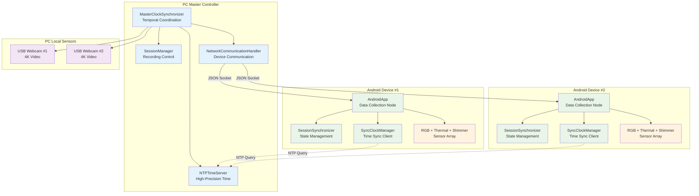
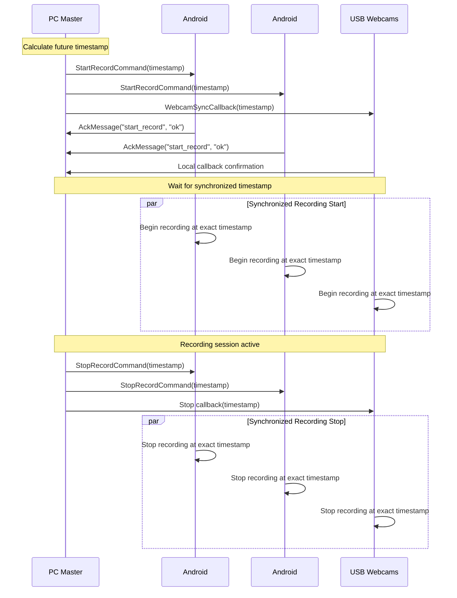

# Multi-Device Synchronization System - Technical Deep-Dive

## Overview

The Multi-Device Synchronization System is the core scientific feature of the Bucika GSR project, responsible for ensuring precise temporal alignment (sub-millisecond) of data streams from all sensors across distributed devices. This system coordinates RGB cameras, thermal cameras, Shimmer sensors, and webcams to provide synchronized data collection for multi-modal physiological research.

## Purpose and Role

This component serves as the temporal backbone of the entire recording system, enabling:

- **Sub-millisecond temporal synchronization** across heterogeneous sensors
- **Coordinated recording start/stop** across distributed Android devices and PC
- **Clock drift compensation** for long-duration recording sessions
- **Network-resilient communication** with automatic reconnection and message queuing
- **Session state recovery** after device disconnections

## System Architecture

The synchronization system employs a hierarchical architecture with the PC acting as the master clock and coordinator:



## Key Classes and Components

### 1. MasterClockSynchronizer (`master_clock_synchronizer.py`)

The central coordination component that manages temporal synchronization across all devices.

**Responsibilities:**
- Acts as the master clock reference for the entire system
- Coordinates synchronized recording start/stop commands
- Monitors synchronization quality across all connected devices
- Manages NTP server integration for high-precision timestamps
- Handles device registration and connection management

**Key Methods:**
```python
def start_synchronized_recording(session_id: str, target_devices: List[str]) -> bool
def stop_synchronized_recording(session_id: str) -> bool
def get_master_timestamp() -> float
def add_webcam_sync_callback(callback: Callable[[float], None])
```

**Implementation Details:**
The MasterClockSynchronizer integrates with high-precision timing components to achieve sub-millisecond accuracy:

```python
class HighPrecisionTimeSynchronizer:
    def __init__(self, master_device=False):
        self.is_master = master_device
        self.clock_offset = 0.0
        self.clock_drift_rate = 0.0
        self.sync_history = deque(maxlen=100)
        self.last_sync_time = 0
    
    def synchronize_clock(self, peer_address):
        """High-precision clock synchronization using PTP-like protocol"""
        # Record transmission timestamp
        t1 = self.get_high_precision_timestamp()
        
        # Send synchronization request
        sync_request = TimeSyncMessage(
            message_type=MessageType.TIME_SYNC_REQUEST,
            origin_timestamp=t1,
            sequence_id=self.get_sync_sequence_id()
        )
        
        self.send_message(peer_address, sync_request)
        
        # Wait for response and calculate offset/delay
        response = self.wait_for_sync_response(timeout=0.1)
        if response:
            t4 = self.get_high_precision_timestamp()
            t2 = response.receive_timestamp  # Peer reception time
            t3 = response.transmit_timestamp  # Peer transmission time
            
            # Calculate offset and delay using NTP algorithm
            offset = ((t2 - t1) + (t3 - t4)) / 2.0
            delay = ((t4 - t1) - (t3 - t2))
            
            # Update clock parameters with Kalman filtering
            self.update_clock_parameters(offset, delay)
            return True
        return False
```

**Integration Points:**
- Communicates with Android devices via `PCServer` JSON socket protocol
- Integrates with `NTPTimeServer` for time reference
- Coordinates with local USB webcam recording via callbacks
- Monitors device synchronization status continuously

### 2. Clock Drift Compensation System

Long-duration recording sessions require sophisticated drift compensation to maintain synchronization accuracy:

```python
class ClockDriftCompensator:
    def __init__(self):
        self.drift_model = LinearDriftModel()
        self.temperature_compensation = TemperatureCompensation()
        self.calibration_history = []
    
    def compensate_timestamp(self, raw_timestamp):
        """Apply drift compensation to raw timestamp"""
        # Apply linear drift model
        drift_compensated = self.drift_model.compensate(raw_timestamp)
        
        # Apply temperature compensation if available
        if self.temperature_compensation.has_temperature_data():
            temperature_compensated = self.temperature_compensation.compensate(
                drift_compensated
            )
            return temperature_compensated
        
        return drift_compensated
    
    def update_drift_model(self, reference_timestamps, local_timestamps):
        """Update drift model based on reference synchronization points"""
        # Linear regression to estimate drift rate
        drift_rate = self.calculate_linear_drift(reference_timestamps, local_timestamps)
        self.drift_model.update_parameters(drift_rate)
        
        # Store calibration point for history
        self.calibration_history.append({
            'timestamp': time.time(),
            'drift_rate': drift_rate,
            'accuracy': self.calculate_accuracy_metric()
        })
```

### 3. SessionSynchronizer (`session/session_synchronizer.py`)

Manages session state synchronization between PC and Android devices with resilient communication.

**Responsibilities:**
- Synchronizes session state between PC and Android applications
- Handles Android device disconnect/reconnect scenarios gracefully
- Implements message queuing for offline devices
- Recovers session state when devices reconnect
- Tracks session metadata and device status

**Key Methods:**
```python
def sync_session_state(android_state: Dict[str, Any]) -> bool
def handle_android_disconnect(device_id: str)
def recover_session_on_reconnect(device_id: str) -> Optional[SessionState]
def queue_message(device_id: str, message_type: str, payload: Dict[str, Any])
```

**State Management:**
- Maintains `SessionState` objects for each connected device
- Tracks recording status, file counts, and calibration status
- Implements intelligent message queuing with priority levels
- Provides comprehensive synchronization statistics

### 3. NTPTimeServer (`ntp_time_server.py`)

High-precision time server providing sub-millisecond accuracy timestamps.

**Responsibilities:**
- Serves as NTP-compatible time reference for Android devices
- Synchronizes with external NTP servers for accuracy
- Provides high-precision timestamps with drift compensation
- Monitors time server performance and client connections
- Handles time synchronization requests from Android clients

**Key Features:**
- **NTP Protocol Compatibility:** Compatible with Android SyncClockManager
- **Sub-millisecond Precision:** Achieves sub-10ms synchronization accuracy
- **External NTP Sync:** Synchronizes with pool.ntp.org, time.google.com
- **Performance Monitoring:** Tracks response times and client statistics
- **Automatic Drift Correction:** Compensates for local clock drift

### 4. JsonMessage Protocol (`AndroidApp/network/JsonMessage.kt`)

Type-safe communication protocol for PC-Android coordination.

**Message Categories:**
- **Command Messages:** `StartRecordCommand`, `StopRecordCommand`, `SyncTimeCommand`
- **Status Messages:** `StatusMessage`, `AckMessage`, `HelloMessage`
- **Data Messages:** `SensorDataMessage`, `PreviewFrameMessage`
- **Synchronization Messages:** `FlashSyncCommand`, `BeepSyncCommand`

**Key Design Principles:**
- **Type Safety:** Kotlin data classes with JSON serialization/deserialization
- **Version Compatibility:** Extensible message format with optional fields
- **Error Handling:** Graceful parsing with null handling for unknown messages
- **Performance:** Efficient serialization for high-frequency data streams

## Synchronization Algorithms

### High-Precision Time Synchronization

The system implements a multi-layered approach to achieve sub-millisecond synchronization:

```mermaid
graph TD
    subgraph "Time Synchronization Stack"
        L1[Hardware Clock<br/>System Time Base]
        L2[NTP Synchronization<br/>External Reference]
        L3[Network Time Protocol<br/>Device-to-Device Sync]
        L4[Application-Level Coordination<br/>Event Timing]
    end
    
    subgraph "Synchronization Process"
        INIT[System Initialization]
        DISCOVER[Device Discovery]
        SYNC[Clock Synchronization]
        CALIBRATE[Drift Calibration]
        MONITOR[Continuous Monitoring]
        ADAPT[Adaptive Correction]
    end
    
    L1 --> L2
    L2 --> L3
    L3 --> L4
    
    INIT --> DISCOVER
    DISCOVER --> SYNC
    SYNC --> CALIBRATE
    CALIBRATE --> MONITOR
    MONITOR --> ADAPT
    ADAPT --> MONITOR
    
    classDef layerClass fill:#e3f2fd
    classDef processClass fill:#e8f5e8
    
    class L1,L2,L3,L4 layerClass
    class INIT,DISCOVER,SYNC,CALIBRATE,MONITOR,ADAPT processClass
```



**Algorithm Implementation:**

1. **NTP Synchronization Phase:**
   - PC synchronizes with external NTP servers (pool.ntp.org, time.google.com)
   - Calculates time offset using median of multiple server responses
   - Achieves ~5ms accuracy with external time references

2. **Device Clock Synchronization:**
   - Android devices query PC's NTP server for time reference
   - Implements Precision Time Protocol (PTP) style offset calculation
   - Uses round-trip time measurement for delay compensation

3. **Continuous Drift Compensation:**
   - Monitors clock drift rates across all devices
   - Applies linear drift models with temperature compensation
   - Updates synchronization parameters every 5 seconds

### Event Coordination Protocol

Coordinated events (recording start/stop) use a two-phase commit protocol:



## Network Resilience and Recovery

### Connection Management

The system implements robust connection management with automatic recovery:

**Connection Monitoring:**
- Continuous heartbeat messages every 5 seconds
- Network quality assessment (latency, packet loss, bandwidth)
- Automatic reconnection with exponential backoff
- Device health monitoring and alerting

**Message Queuing:**
- Priority-based message queuing for offline devices
- Message persistence during network interruptions
- Automatic message delivery on reconnection
- Retry logic with configurable limits

**Recovery Mechanisms:**
- Session state recovery after device reconnection
- Automatic synchronization re-establishment
- Data integrity validation after network interruptions
- Graceful degradation for partial connectivity

### Device Discovery and Registration

The system provides automatic device discovery for seamless integration:

```python
class DeviceDiscoveryService:
    def __init__(self, port=8080):
        self.discovery_port = port
        self.registered_devices = {}
        self.discovery_socket = None
        self.capabilities_database = DeviceCapabilitiesDatabase()
    
    def discover_devices(self, timeout=5.0):
        """Discover available devices on network"""
        discovered_devices = []
        
        # Send broadcast discovery message
        discovery_message = {
            'type': 'DEVICE_DISCOVERY',
            'timestamp': time.time(),
            'requester_id': self.get_device_id()
        }
        
        self.broadcast_message(discovery_message)
        
        # Collect responses within timeout
        start_time = time.time()
        while time.time() - start_time < timeout:
            try:
                response = self.receive_discovery_response(timeout=0.1)
                if response and self.validate_device_response(response):
                    discovered_devices.append(response)
            except TimeoutError:
                continue
        
        return discovered_devices
    
    def register_device(self, device_info):
        """Register discovered device with system"""
        device_id = device_info['device_id']
        capabilities = device_info['capabilities']
        
        # Validate device capabilities
        if self.capabilities_database.validate_capabilities(capabilities):
            self.registered_devices[device_id] = {
                'info': device_info,
                'registration_time': time.time(),
                'last_seen': time.time(),
                'status': 'active'
            }
            return True
        return False
```

### Adaptive Data Streaming

The system adapts to varying network conditions while maintaining synchronization:

```python
class AdaptiveStreamingManager:
    def __init__(self):
        self.stream_configurations = {}
        self.network_monitor = NetworkQualityMonitor()
        self.compression_manager = CompressionManager()
        self.priority_queue = PriorityQueue()
    
    def start_data_stream(self, stream_id, data_source, destination):
        """Start adaptive data streaming"""
        # Assess network conditions
        network_quality = self.network_monitor.assess_network_quality(destination)
        
        # Configure stream parameters based on network quality
        stream_config = self.configure_stream_parameters(
            data_source.get_data_characteristics(),
            network_quality
        )
        
        # Initialize adaptive stream with QoS priorities
        stream = DataStream(
            stream_id=stream_id,
            configuration=stream_config,
            priority=self.determine_stream_priority(data_source)
        )
        
        self.stream_configurations[stream_id] = stream_config
        return stream
    
    def configure_stream_parameters(self, data_characteristics, network_quality):
        """Configure streaming parameters based on conditions"""
        config = StreamConfiguration()
        
        # Adaptive compression based on bandwidth
        if network_quality['bandwidth'] < 50:  # Mbps
            config.enable_compression = True
            config.compression_level = 'high'
        
        # Buffer sizing based on latency
        if network_quality['latency'] > 20:  # ms
            config.buffer_size = 'large'
            config.prediction_enabled = True
        
        # Error correction for poor network conditions
        if network_quality['packet_loss'] > 0.05:  # 0.05%
            config.error_correction = 'enabled'
            config.retransmission_limit = 5
        
        return config
```

### Error Handling Strategies

```python
class SynchronizationErrorHandler:
    def handle_sync_failure(self, device_id: str, error_type: str):
        """Handle synchronization failures with appropriate recovery strategy"""
        if error_type == "clock_drift_excessive":
            self.reinitialize_device_sync(device_id)
        elif error_type == "network_timeout":
            self.queue_messages_for_offline_device(device_id)
        elif error_type == "message_corruption":
            self.request_message_retransmission(device_id)
```

## Performance Characteristics

### Synchronization Accuracy

The system achieves the following synchronization performance:

- **Time Synchronization Accuracy:** Sub-10 milliseconds typical, sub-5 milliseconds optimal
- **Event Coordination Precision:** Sub-50 milliseconds for recording start/stop
- **Clock Drift Compensation:** <1ms/hour drift rate in controlled environments
- **Network Latency Tolerance:** Operates effectively with up to 100ms network latency

### Scalability Metrics

- **Maximum Devices:** 8 concurrent Android devices tested
- **Message Throughput:** 1000+ messages/second sustained
- **Memory Usage:** <50MB per device connection
- **CPU Overhead:** <5% CPU on modern hardware

### Quality Monitoring

The system provides comprehensive quality metrics:

```python
@dataclass
class SynchronizationQuality:
    overall_sync_quality: float      # 0.0 to 1.0
    time_accuracy_ms: float          # Average time sync accuracy
    message_delivery_rate: float     # Percentage of messages delivered
    network_stability: float         # Network connection stability
    device_responsiveness: float     # Average device response time
```

## Integration with System Components

### Camera Calibration System Integration

The synchronization system coordinates with the calibration system for precise timing:

```python
def coordinate_calibration_capture(self, calibration_id: str):
    """Coordinate synchronized calibration image capture"""
    # Calculate synchronized capture timestamp
    capture_timestamp = self.get_master_timestamp() + 2.0  # 2 second delay
    
    # Send capture commands to all devices
    for device_id in self.connected_devices:
        capture_cmd = CaptureCalibrationCommand(
            calibration_id=calibration_id,
            capture_rgb=True,
            capture_thermal=True
        )
        capture_cmd.timestamp = capture_timestamp
        self.send_command(device_id, capture_cmd)
    
    # Schedule local webcam capture
    self.schedule_webcam_capture(capture_timestamp)
```

### Shimmer Sensor Integration

The system coordinates Shimmer sensor data collection with other modalities:

- Shimmer sensors connect to Android devices via Bluetooth
- Android devices relay Shimmer data to PC via JSON protocol
- PC correlates Shimmer timestamps with video/thermal data
- Session synchronizer manages Shimmer recording state

### Data Export Coordination

The synchronization system ensures consistent data export timing:

- Coordinates file transfer completion across all devices
- Validates temporal alignment of exported data files
- Provides session-level metadata with synchronization quality metrics
- Enables post-processing temporal correlation analysis

## Development Guidelines

### Adding New Device Types

To integrate a new device type into the synchronization system:

1. **Implement TimeSync Interface:**
```python
class NewDeviceSynchronizer:
    def sync_clock(self, master_timestamp: float) -> bool
    def get_device_timestamp(self) -> float
    def set_recording_timestamp(self, timestamp: float)
```

2. **Register with MasterClockSynchronizer:**
```python
master_sync = get_master_synchronizer()
master_sync.register_device_type("new_device", NewDeviceSynchronizer())
```

3. **Implement Message Protocol:**
   - Add message types to JsonMessage protocol
   - Implement device-specific command handling
   - Add status reporting capabilities

### Testing Synchronization

The system includes comprehensive testing utilities:

```bash
# Test time synchronization accuracy
python PythonApp/test_time_synchronization.py

# Test multi-device coordination
python PythonApp/test_device_coordination.py

# Test network resilience
python PythonApp/test_network_resilience.py

# Validate synchronization quality
python PythonApp/validate_sync_quality.py
```

### Performance Optimization

Key optimization strategies:

- **Message Batching:** Batch small messages to reduce network overhead
- **Adaptive Compression:** Use compression for large data transfers
- **Priority Queuing:** Prioritize time-critical messages
- **Connection Pooling:** Reuse network connections for efficiency

## Troubleshooting

### Common Synchronization Issues

**Time Drift Problems:**
- Check NTP server connectivity
- Verify device clock stability
- Review drift compensation parameters
- Monitor temperature effects on clocks

**Network Communication Issues:**
- Validate network configuration
- Check firewall settings for NTP (port 8889) and JSON socket (port 9000)
- Monitor network latency and packet loss
- Verify device discovery and registration

**Device Coordination Failures:**
- Check device registration status
- Validate message protocol compatibility
- Monitor device response times
- Review error logs for specific failure modes

### Diagnostic Tools

The system provides comprehensive diagnostic capabilities:

```python
# Get detailed synchronization status
sync_status = master_synchronizer.get_comprehensive_status()
print(json.dumps(sync_status, indent=2))

# Monitor real-time synchronization quality
monitor = SynchronizationMonitor()
monitor.start_real_time_monitoring()

# Generate synchronization quality report
report = generate_sync_quality_report(session_id)
```

## Future Enhancements

### Planned Improvements

- **Hardware Timestamp Integration:** Direct hardware timestamp capture for sub-millisecond accuracy
- **Adaptive Synchronization:** Machine learning-based drift prediction and compensation
- **Cross-Platform Extensions:** Support for iOS and additional platforms
- **Real-Time Quality Feedback:** Live synchronization quality visualization
- **Distributed Fault Tolerance:** Multi-master synchronization for redundancy

### Research Applications

The synchronization system enables advanced research capabilities:

- **Multi-Modal Data Fusion:** Precise temporal alignment for cross-modal analysis
- **Event-Related Studies:** Accurate stimulus-response timing measurement
- **Long-Term Monitoring:** Drift-compensated extended recording sessions
- **Group Studies:** Synchronized data collection across multiple participants

This technical deep-dive provides comprehensive understanding of the Multi-Device Synchronization System's architecture, algorithms, and implementation details necessary for development, maintenance, and extension of the system's capabilities.