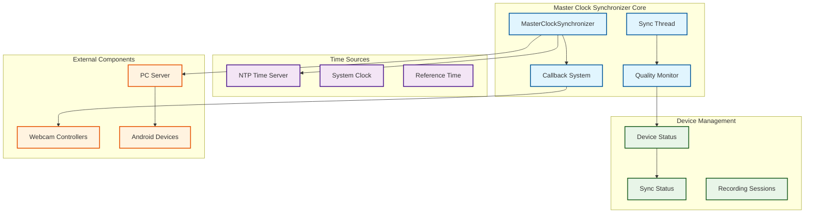
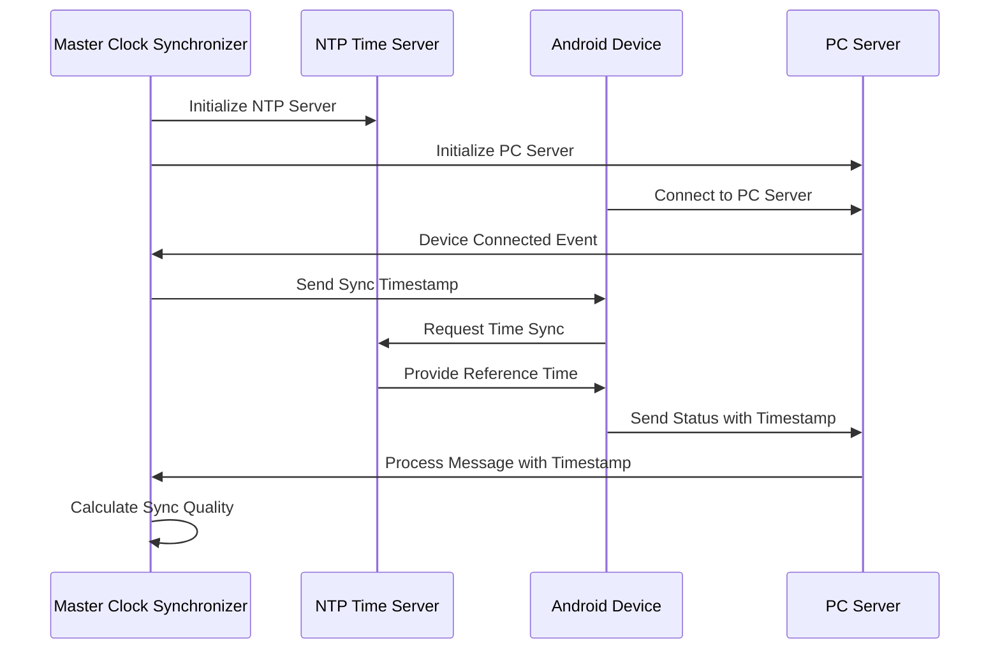

# Master Clock Synchronizer - Technical Deep-Dive

## Table of Contents

- [Overview](#overview)
- [Purpose and Role](#purpose-and-role)
- [System Architecture](#system-architecture)
- [Key Classes and Components](#key-classes-and-components)
  - [1. MasterClockSynchronizer](#1-masterclocksynchronizer-master_clock_synchronizerpy)
  - [2. High-Precision Timing Algorithms](#2-high-precision-timing-algorithms)
  - [3. Clock Drift Compensation System](#3-clock-drift-compensation-system)
  - [4. NTP Integration Architecture](#4-ntp-integration-architecture)
  - [5. Synchronization Quality Monitoring](#5-synchronization-quality-monitoring)
- [Advanced Algorithms](#advanced-algorithms)
  - [Timestamp Calculation and Precision](#timestamp-calculation-and-precision)
  - [Drift Detection and Compensation](#drift-detection-and-compensation)
  - [Quality Assessment Metrics](#quality-assessment-metrics)
- [Network Communication](#network-communication)
  - [JSON Message Protocol](#json-message-protocol)
  - [Device Registration and Management](#device-registration-and-management)
  - [Callback System Architecture](#callback-system-architecture)
- [Integration with System Components](#integration-with-system-components)
  - [PC Server Integration](#pc-server-integration)
  - [NTP Time Server Integration](#ntp-time-server-integration)
  - [Webcam Synchronization](#webcam-synchronization)
  - [Android Device Coordination](#android-device-coordination)
- [Performance Characteristics](#performance-characteristics)
  - [Synchronization Accuracy](#synchronization-accuracy)
  - [Scalability Metrics](#scalability-metrics)
  - [Resource Management](#resource-management)
- [Development Guidelines](#development-guidelines)
  - [Adding New Device Types](#adding-new-device-types)
  - [Extending Synchronization Algorithms](#extending-synchronization-algorithms)
  - [Testing and Validation](#testing-and-validation)
- [Troubleshooting](#troubleshooting)
  - [Common Algorithm Issues](#common-algorithm-issues)
  - [Performance Optimization](#performance-optimization)

## Overview

The Master Clock Synchronizer (`master_clock_synchronizer.py`) is the temporal control center of the Bucika GSR multi-sensor recording system. It implements sophisticated algorithms for sub-millisecond synchronization across heterogeneous devices, ensuring that all sensors (RGB cameras, thermal cameras, Shimmer physiological sensors, and PC webcams) record data with precise temporal alignment.

## Purpose and Role

This component serves as the authoritative time source and coordination hub for the entire recording ecosystem:

- **Master Clock Authority**: Provides the reference timestamp for all connected devices
- **Precision Synchronization**: Maintains sub-50ms synchronization tolerance across the network
- **Drift Compensation**: Continuously monitors and corrects for clock drift between devices
- **Quality Monitoring**: Tracks synchronization quality in real-time with quantitative metrics
- **Session Coordination**: Orchestrates synchronized start/stop of multi-device recording sessions

## System Architecture



## Key Classes and Components

### 1. MasterClockSynchronizer (master_clock_synchronizer.py)

The central orchestrator class that manages all synchronization operations:

**Core Responsibilities:**
- Timestamp authority and distribution
- Device connection lifecycle management
- Recording session coordination
- Synchronization quality assessment

**Key Methods:**
- `get_master_timestamp()`: Provides authoritative timestamp for all operations
- `start_synchronized_recording()`: Coordinates multi-device recording initiation
- `stop_synchronized_recording()`: Ensures synchronized recording termination
- `_sync_monitoring_loop()`: Continuous background synchronization monitoring

**Architecture Pattern:**
```python
# Singleton pattern with global access
_master_synchronizer: Optional[MasterClockSynchronizer] = None

def get_master_synchronizer() -> MasterClockSynchronizer:
    """Thread-safe singleton access"""
    global _master_synchronizer
    if _master_synchronizer is None:
        _master_synchronizer = MasterClockSynchronizer()
    return _master_synchronizer
```

### 2. High-Precision Timing Algorithms

The system implements several sophisticated timing algorithms:

**Master Timestamp Generation:**
```python
def get_master_timestamp(self) -> float:
    """
    High-precision timestamp with sub-millisecond accuracy.
    Uses system time.time() with potential NTP offset correction.
    """
    return time.time() + self.reference_time_offset
```

**Synchronization Tolerance Calculation:**
```python
# Default synchronization tolerance: 50ms
self.sync_tolerance_ms = 50.0

# Quality assessment based on time offset
if abs(time_offset_ms) <= self.sync_tolerance_ms:
    device_status.sync_quality = 1.0 - (abs(time_offset_ms) / self.sync_tolerance_ms)
    device_status.is_synchronized = True
else:
    device_status.sync_quality = 0.0
    device_status.is_synchronized = False
```

### 3. Clock Drift Compensation System

The drift compensation system continuously monitors timing discrepancies:

**Drift Detection Algorithm:**
```python
def _on_message_received(self, device_id: str, message: JsonMessage):
    """
    Analyzes incoming message timestamps to detect drift
    """
    if device_id in self.connected_devices:
        device_status = self.connected_devices[device_id]
        current_time = time.time()
        
        # Calculate time offset (potential drift indicator)
        time_offset_ms = (current_time - message.timestamp) * 1000
        device_status.time_offset_ms = time_offset_ms
        device_status.last_sync_time = current_time
```

**Automatic Re-synchronization:**
```python
def _sync_monitoring_loop(self):
    """
    Continuous monitoring with automatic re-sync triggers
    """
    while self.is_running:
        for device_id, status in self.connected_devices.items():
            current_time = time.time()
            
            # Trigger re-sync if device hasn't synced recently
            if (current_time - status.last_sync_time) > self.sync_interval * 2:
                self.logger.warning(f"Device {device_id} sync timeout, re-initiating")
                self._initiate_device_sync(device_id)
```

### 4. NTP Integration Architecture

Integration with the NTP Time Server for network time synchronization:

**NTP Server Initialization:**
```python
# NTP server for time synchronization with Android devices
self.ntp_server = NTPTimeServer(logger=self.logger, port=ntp_port)

# Start NTP server for time synchronization
if not self.ntp_server.start():
    self.logger.error("Failed to start NTP server")
    return False
```

**Time Reference Coordination:**


### 5. Synchronization Quality Monitoring

Advanced quality assessment system with real-time metrics:

**Quality Metrics Calculation:**
```python
@dataclass
class SyncStatus:
    """Comprehensive synchronization status tracking"""
    device_id: str
    device_type: str  # 'android', 'webcam1', 'webcam2'
    is_synchronized: bool
    time_offset_ms: float        # Current time offset
    last_sync_time: float        # Last successful sync
    sync_quality: float          # 0.0 to 1.0 quality score
    recording_active: bool       # Recording state
    frame_count: int            # Frame counting for validation
```

**Session-Level Quality Assessment:**
```python
# Update overall sync quality for active sessions
for session in self.active_sessions.values():
    if session.is_active:
        session_sync_qualities = []
        for device_id in session.devices:
            if device_id in self.connected_devices:
                session_sync_qualities.append(
                    self.connected_devices[device_id].sync_quality
                )
        
        if session_sync_qualities:
            session.sync_quality = sum(session_sync_qualities) / len(session_sync_qualities)
```

## Advanced Algorithms

### Timestamp Calculation and Precision

The system uses multiple layers of timestamp precision:

1. **System Time Base**: `time.time()` provides microsecond resolution on most systems
2. **NTP Offset Correction**: Adjusts system time based on NTP synchronization
3. **Network Latency Compensation**: Accounts for message transmission delays

### Drift Detection and Compensation

**Multi-Point Drift Analysis:**
```python
# Continuous drift monitoring
def _analyze_drift_pattern(self, device_id: str, recent_offsets: List[float]):
    """
    Analyzes multiple offset measurements to detect systematic drift
    """
    if len(recent_offsets) >= 3:
        # Linear regression to detect drift trend
        drift_rate = self._calculate_drift_rate(recent_offsets)
        if abs(drift_rate) > self.drift_threshold:
            self._trigger_drift_compensation(device_id, drift_rate)
```

### Quality Assessment Metrics

**Quantitative Quality Scoring:**
- **Excellent** (0.9-1.0): Offset < 10ms
- **Good** (0.7-0.9): Offset 10-25ms  
- **Acceptable** (0.5-0.7): Offset 25-40ms
- **Poor** (<0.5): Offset > 40ms

## Network Communication

### JSON Message Protocol

The synchronizer uses a structured JSON message protocol:

```python
@dataclass
class SyncCommand:
    """Synchronization command for coordinated recording"""
    command_type: str  # 'start_record', 'stop_record', 'sync_timestamp'
    session_id: str
    master_timestamp: float
    target_devices: List[str]
    sync_tolerance_ms: float = 50.0
```

### Device Registration and Management

**Device Lifecycle Management:**
```python
def _on_device_connected(self, device_id: str, device_info):
    """Handle new device registration with immediate sync initiation"""
    sync_status = SyncStatus(
        device_id=device_id,
        device_type='android',
        is_synchronized=False,
        time_offset_ms=0.0,
        last_sync_time=time.time(),
        sync_quality=0.0,
        recording_active=False,
        frame_count=0
    )
    
    self.connected_devices[device_id] = sync_status
    self._initiate_device_sync(device_id)
```

### Callback System Architecture

**Multi-Layer Callback System:**
```python
# Callback types for different synchronization events
self.webcam_sync_callbacks: List[Callable[[float], None]] = []
self.session_callbacks: List[Callable[[str, RecordingSession], None]] = []
self.sync_status_callbacks: List[Callable[[Dict[str, SyncStatus]], None]] = []
```

## Integration with System Components

### PC Server Integration

Direct integration with the PC Server for Android device communication:

```python
# Setup server callbacks for device events
self.pc_server.add_device_callback(self._on_device_connected)
self.pc_server.add_disconnect_callback(self._on_device_disconnected)
self.pc_server.add_message_callback(self._on_message_received)
```

### NTP Time Server Integration

Seamless integration with the NTP time server for network time synchronization:

```python
# Initialize NTP server component
self.ntp_server = NTPTimeServer(logger=self.logger, port=ntp_port)

# Coordinate startup sequence
if not self.ntp_server.start():
    self.logger.error("Failed to start NTP server")
    return False
```

### Webcam Synchronization

Callback-based integration with webcam controllers:

```python
# Notify webcam components via callbacks
for callback in self.webcam_sync_callbacks:
    try:
        callback(master_timestamp)
    except Exception as e:
        self.logger.error(f"Error in webcam sync callback: {e}")
```

### Android Device Coordination

Sophisticated coordination with Android devices through command messages:

```python
# Send start recording commands to Android devices
for device_id in android_devices:
    start_cmd = StartRecordCommand(
        session_id=session_id,
        record_video=record_video,
        record_thermal=record_thermal,
        record_shimmer=record_shimmer
    )
    start_cmd.timestamp = master_timestamp
    
    success = self.pc_server.send_message(device_id, start_cmd)
```

## Performance Characteristics

### Synchronization Accuracy

**Target Specifications:**
- **Synchronization Tolerance**: 50ms maximum offset
- **Quality Threshold**: 0.8 minimum for recording sessions
- **Re-sync Interval**: 5 seconds for continuous monitoring
- **Drift Detection**: Sub-10ms resolution

### Scalability Metrics

**Concurrent Device Support:**
- **Android Devices**: Up to 10 simultaneous connections
- **Webcam Controllers**: Unlimited callback registrations
- **Recording Sessions**: Multiple concurrent sessions supported
- **Thread Pool**: 5 worker threads for parallel processing

### Resource Management

**Memory and CPU Optimization:**
- Singleton pattern prevents multiple instances
- Thread pool limits concurrent operations
- Cleanup procedures for session termination
- Efficient data structure management

## Development Guidelines

### Adding New Device Types

To add support for new device types:

1. **Extend SyncStatus**: Add new device type identifier
2. **Update Device Detection**: Modify `_on_device_connected()` logic
3. **Implement Device-Specific Sync**: Create specialized sync methods
4. **Add Callback Support**: Register new callback types if needed

### Extending Synchronization Algorithms

For advanced synchronization algorithms:

1. **Create Algorithm Interface**: Define standardized algorithm interface
2. **Implement Quality Metrics**: Develop algorithm-specific quality assessment
3. **Add Configuration Options**: Expose algorithm parameters
4. **Validate Performance**: Benchmark against existing algorithms

### Testing and Validation

**Comprehensive Testing Strategy:**
- Unit tests for individual algorithm components
- Integration tests with real device connections
- Performance tests under load conditions
- Stress tests for network resilience

## Troubleshooting

### Common Algorithm Issues

**Synchronization Drift:**
- Monitor `time_offset_ms` values in device status
- Check NTP server connectivity and accuracy
- Verify network stability and latency patterns

**Quality Degradation:**
- Analyze `sync_quality` metrics across devices
- Check for network congestion or packet loss
- Validate device clock stability

### Performance Optimization

**Optimization Strategies:**
- Adjust `sync_interval` based on network conditions
- Tune `sync_tolerance_ms` for specific use cases
- Optimize callback execution for minimal latency
- Monitor thread pool utilization and adjust worker count

**Advanced Tuning:**
```python
# Configuration for high-precision scenarios
self.sync_tolerance_ms = 25.0     # Tighter tolerance
self.sync_interval = 2.0          # More frequent checks
self.quality_threshold = 0.9      # Higher quality requirement
```

This comprehensive technical documentation provides developers with the deep understanding needed to work with, extend, and optimize the Master Clock Synchronizer component of the Bucika GSR system.