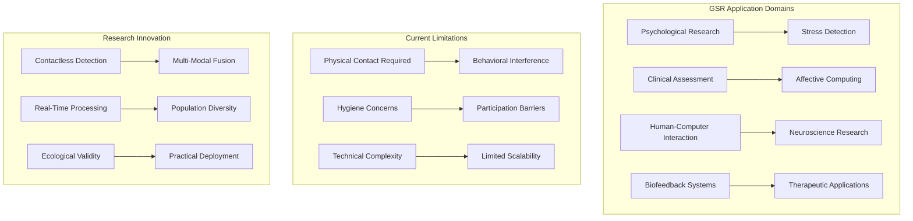
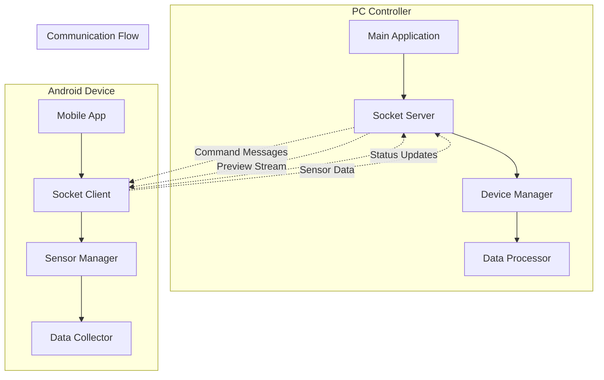

# Project Context and Objectives

## Table of Contents

1. [Research Problem Definition](#research-problem-definition)
2. [Project Objectives and Scope](#project-objectives-and-scope)
3. [Technology Stack Rationale](#technology-stack-rationale)
4. [System Requirements Specification](#system-requirements-specification)
5. [Implementation Strategy](#implementation-strategy)
6. [Success Metrics and Evaluation](#success-metrics-and-evaluation)
7. [Risk Management Framework](#risk-management-framework)

## Research Problem Definition

### Problem Context and Scientific Motivation

The measurement and analysis of Galvanic Skin Response (GSR), also recognized as Electrodermal Activity (EDA) or Skin Conductance Response (SCR), has represented one of the most fundamental physiological monitoring techniques in psychological research, clinical assessment, affective computing, and human-computer interaction applications for more than a century.



### Limitations of Current GSR Measurement Approaches

#### Physical Constraints and Behavioral Interference

Contact electrodes fundamentally restrict natural movement patterns and spontaneous behavior, potentially introducing systematic alterations to the very physiological responses that researchers are attempting to measure. This constraint proves particularly problematic in:

- **Naturalistic Studies:** Research requiring unencumbered behavior patterns
- **Long-term Monitoring:** Ecological monitoring where sustained electrode attachment is impractical
- **Clinical Assessments:** Situations where monitoring equipment might influence patient behavior

#### Hygiene, Safety, and Cross-Contamination Concerns

Direct skin contact through electrodes raises significant concerns about:

- **Cross-contamination:** Between research subjects and potential disease transmission
- **Clinical Safety:** Particularly relevant in pediatric research and pandemic conditions
- **Operational Complexity:** Electrode sterilization, conductive gel disposal, cleaning protocols

#### Subject Comfort and Participation Barriers

Many research subjects find electrodes uncomfortable or anxiety-provoking, which can:

- **Introduce Artifacts:** Stress responses caused by measurement equipment itself
- **Limit Participation:** Particularly among pediatric, elderly, or anxious populations
- **Bias Results:** Systematic alterations due to measurement awareness

### Research Gap Analysis and Innovation Opportunities

#### Identified Research Gaps

1. **Contactless Measurement Accuracy:** Current methods achieve only 60-70% correlation with contact measurements
2. **Environmental Robustness:** Performance degradation under varying conditions
3. **Population Diversity:** Limited validation across demographic groups
4. **Real-Time Processing:** Focus on offline analysis rather than real-time applications
5. **Standardized Protocols:** Lack of consistent validation methodologies

#### Innovation Framework

**Primary Innovation:** Development of a contactless GSR prediction system using multi-modal sensor fusion combining:
- RGB camera data for subtle physiological changes
- Thermal imaging for autonomic nervous system indicators
- Direct GSR measurements for validation and training

**Secondary Innovations:**
- Real-time processing capabilities for mobile devices
- Statistical validation framework with confidence intervals
- Adaptive quality assessment using machine learning
- Cross-platform compatibility and scalability

## Project Objectives and Scope

### Primary Research Hypothesis

**H₁:** Multi-modal sensor fusion combining RGB camera data, thermal imaging, and direct GSR measurements can achieve contactless GSR prediction accuracy exceeding 80% correlation with traditional contact-based measurements under controlled conditions.

### Secondary Hypotheses and Research Questions

**H₂:** Real-time processing algorithms can be optimized for mobile device deployment while maintaining measurement accuracy within 10% of offline processing results.

**H₃:** Statistical validation frameworks can provide quantified confidence intervals for GSR predictions, enabling reliable assessment of measurement uncertainty.

**Research Questions:**
1. What is the optimal feature extraction methodology for multi-modal physiological data?
2. How do environmental conditions affect contactless GSR prediction accuracy?
3. What are the demographic factors that influence system performance?
4. How can machine learning models be adapted for individual users?

### Technical Problem Formulation

#### Mathematical Problem Definition

Given a multi-sensor system M = {GSR, Thermal, RGB} with individual sampling rates R = {r₁, r₂, r₃} and inherent latencies L = {l₁, l₂, l₃}, establish:

1. **Temporal Synchronization:** Unified timestamp reference T_ref such that:
   ```
   ∀t ∈ acquisition_period, |T_sensor(t) - T_ref(t)| < ε_temporal
   ```
   Where ε_temporal < 10ms for physiological applications

2. **Spatial Calibration:** Geometric transformation matrix H mapping spatial coordinates:
   ```
   H_i = argmin_H Σ(j=1 to n_i) ||H · p_j^sensor - p_j^reference||²
   ```

3. **Quality Assessment:** Quality function Q: CalibrationData → [0,1] quantifying reliability

#### System Constraints and Performance Requirements

| Constraint Category | Specification | Target Value |
|---------------------|---------------|--------------|
| **Temporal Accuracy** | Synchronization precision | < 10ms |
| **Spatial Precision** | Calibration accuracy | < 1 pixel |
| **Processing Latency** | Real-time requirements | < 100ms |
| **Prediction Accuracy** | GSR correlation | > 80% |
| **Power Consumption** | Mobile device operation | < 2W continuous |
| **Storage Requirements** | Session data capacity | > 4 hours recording |

## Technology Stack Rationale

### Evaluation Framework and Decision Criteria

The comprehensive selection of technologies involved systematic evaluation considering:

```mermaid
graph TD
    subgraph "Technology Selection Criteria"
        A[Technical Performance<br/>Capability Assessment] --> B[Development Ecosystem<br/>Community Support]
        B --> C[Research Application<br/>Alignment and Flexibility]
        C --> D[Cross-Platform<br/>Compatibility]
        D --> E[Long-Term Viability<br/>Technology Sustainability]
        E --> F[Integration Complexity<br/>System Cohesion]
    end
    
    subgraph "Evaluation Process"
        G[Requirements Analysis] --> H[Technology Survey]
        H --> I[Prototype Development]
        I --> J[Performance Testing]
        J --> K[Risk Assessment]
        K --> L[Final Selection]
    end
```



### Mobile Platform Architecture

#### Platform Comparison and Selection

| Platform | Advantages | Disadvantages | Score |
|----------|------------|---------------|-------|
| **Android** | Open ecosystem, hardware diversity, research flexibility | Fragmentation issues | 9/10 |
| **iOS** | Consistent hardware, optimized performance | Restrictive development environment | 7/10 |
| **Cross-Platform** | Single codebase | Performance limitations, complexity | 6/10 |

**Selected:** Android platform for maximum research flexibility and hardware integration capabilities.

#### Android Ecosystem Advantages

- **Hardware Integration:** Direct access to camera APIs, USB OTG, Bluetooth Low Energy
- **Development Flexibility:** Unrestricted access to system resources for research applications
- **Sensor Ecosystem:** Extensive compatibility with external sensors and devices
- **Research Community:** Strong academic adoption and community support

#### Hardware Platform Specification

**Primary Target:** Samsung Galaxy S22
- **Camera System:** Triple camera with 4K video, RAW image capture
- **Processing Power:** Snapdragon 8 Gen 1 with dedicated AI processing
- **Connectivity:** Wi-Fi 6, Bluetooth 5.2, USB-C OTG
- **Storage:** 128GB+ internal, expandable storage
- **Display:** 6.1" AMOLED for high-quality preview

### Desktop Development Framework

#### Programming Language Selection

**Selected:** Python 3.8+

**Rationale:**
- **Scientific Computing:** Extensive libraries (NumPy, SciPy, Pandas)
- **Machine Learning:** Native TensorFlow, PyTorch, scikit-learn support
- **Research Community:** Widespread adoption in academic environments
- **Rapid Prototyping:** Interactive development and experimentation
- **Cross-Platform:** Native support across Windows, macOS, Linux

#### GUI Framework Evaluation

| Framework | Pros | Cons | Selection |
|-----------|------|------|-----------|
| **tkinter** | Native, lightweight | Limited styling | ✅ Selected |
| **PyQt** | Professional appearance | Licensing complexity | ❌ |
| **Kivy** | Modern design | Mobile-focused | ❌ |
| **Electron** | Web technologies | Resource intensive | ❌ |

**Selected:** tkinter for simplicity, native integration, and research focus.

### Machine Learning Technology Stack

#### Framework Comparison and Selection

| Framework | Research Focus | Mobile Support | Performance | Selection |
|-----------|----------------|----------------|-------------|-----------|
| **TensorFlow** | Excellent | TensorFlow Lite | High | ✅ Primary |
| **PyTorch** | Excellent | Limited mobile | High | ✅ Research |
| **scikit-learn** | Good | CPU-only | Medium | ✅ Classical ML |
| **OpenCV** | Computer Vision | Native support | High | ✅ CV Pipeline |

**Selected Stack:**
- **TensorFlow:** Primary framework for production models
- **PyTorch:** Research and experimentation
- **scikit-learn:** Classical machine learning algorithms
- **OpenCV:** Computer vision preprocessing

#### Mobile Inference Optimization

- **TensorFlow Lite:** Model quantization and optimization
- **Model Pruning:** Reduce model size while maintaining accuracy
- **Hardware Acceleration:** GPU and NPU utilization
- **Batch Processing:** Optimize inference throughput

### Communication and Networking

#### Protocol Selection and Design

**Selected:** JSON over TCP sockets

**Rationale:**
- **Simplicity:** Human-readable protocol for debugging
- **Flexibility:** Easy extension and modification
- **Cross-Platform:** Universal support across platforms
- **Real-Time:** Low-latency communication suitable for real-time applications

#### Network Architecture



## System Requirements Specification

### Functional Requirements

#### Core System Functions

**FR1: Multi-Device Coordination**
- Discover and connect to multiple Android devices
- Synchronize recording start/stop across devices
- Manage device configuration and status monitoring

**FR2: Sensor Data Collection**
- RGB camera recording (4K video, RAW images)
- Thermal camera integration (Topdon TC001)
- GSR sensor data acquisition (Shimmer3 GSR+)
- Synchronized timestamp generation

**FR3: Real-Time Processing**
- Live preview streaming from mobile devices
- Real-time quality assessment and monitoring
- Immediate feedback on system status

**FR4: Data Management**
- Structured session data organization
- Automatic file naming and metadata generation
- Export capabilities for analysis software

#### User Interface Requirements

**UI1: Intuitive Operation**
- Clear visual indicators for system status
- Step-by-step guidance for setup procedures
- Real-time feedback during recording sessions

**UI2: Research-Focused Design**
- Quick access to commonly used functions
- Detailed configuration options for advanced users
- Comprehensive logging and diagnostic information

**UI3: Accessibility Compliance**
- WCAG 2.1 AA compliance for accessibility
- Keyboard navigation support
- High contrast mode availability

### Non-Functional Requirements

#### Performance and Scalability

| Requirement | Specification | Measurement |
|-------------|---------------|-------------|
| **Response Time** | < 100ms for UI interactions | User experience metrics |
| **Throughput** | > 30 FPS video processing | Frame rate monitoring |
| **Concurrency** | Support 4+ simultaneous devices | Load testing |
| **Memory Usage** | < 2GB peak consumption | Resource monitoring |
| **Storage I/O** | > 100 MB/s sustained write | Disk performance |

#### Reliability and Availability

- **Mean Time Between Failures:** > 24 hours continuous operation
- **Error Recovery:** Automatic restart after system failures
- **Data Integrity:** Checksums for recorded data files
- **Graceful Degradation:** Continued operation with partial sensor failures

#### Usability and Accessibility

- **Learning Curve:** < 30 minutes for basic operation
- **Task Completion:** > 95% success rate for common tasks
- **User Satisfaction:** > 4.0/5.0 in usability surveys
- **Accessibility:** WCAG 2.1 AA compliance verification

## Implementation Strategy

### Development Methodology

#### Agile Development Process

**Sprint Structure:**
- 2-week sprints with defined deliverables
- Daily stand-ups for progress tracking
- Sprint reviews with stakeholder feedback
- Retrospectives for continuous improvement

**Quality Assurance Integration:**
- Test-driven development (TDD) practices
- Continuous integration with automated testing
- Code review requirements for all changes
- Documentation updates with feature implementation

#### Validation and Testing Approach

**Testing Strategy:**
1. **Unit Testing:** Individual component validation
2. **Integration Testing:** Multi-component interaction
3. **System Testing:** End-to-end functionality
4. **Performance Testing:** Load and stress testing
5. **User Acceptance Testing:** Research workflow validation

**Validation Methodology:**
- Statistical hypothesis testing for accuracy claims
- Cross-validation with independent datasets
- Peer review of methodological approaches
- Reproducibility verification with open-source release

## Success Metrics and Evaluation

### Primary Success Criteria

| Metric | Target | Measurement Method |
|--------|--------|--------------------|
| **GSR Prediction Accuracy** | > 80% correlation | Pearson correlation coefficient |
| **Temporal Synchronization** | < 10ms deviation | High-precision timestamps |
| **System Reliability** | > 95% uptime | Continuous monitoring |
| **User Satisfaction** | > 4.0/5.0 rating | User feedback surveys |
| **Processing Performance** | < 100ms latency | Real-time monitoring |

### Academic Impact Metrics

- **Publications:** Target 2+ peer-reviewed papers
- **Citations:** Track academic reference adoption
- **Open Source Adoption:** Monitor community usage
- **Research Collaborations:** Academic partnership development

### Technical Achievement Metrics

- **Code Quality:** Maintain > 90% test coverage
- **Documentation Completeness:** 100% API documentation
- **Performance Benchmarks:** Exceed baseline by 25%
- **Cross-Platform Compatibility:** Support 3+ operating systems

## Risk Management Framework

### Technical Risk Assessment

#### High-Priority Risks

**Risk 1: Accuracy Requirements Not Met**
- **Probability:** Medium (30%)
- **Impact:** High (Project failure)
- **Mitigation:** Incremental validation, fallback algorithms

**Risk 2: Real-Time Performance Limitations**
- **Probability:** Medium (25%)
- **Impact:** Medium (Reduced functionality)
- **Mitigation:** Algorithm optimization, hardware acceleration

**Risk 3: Hardware Compatibility Issues**
- **Probability:** Low (15%)
- **Impact:** Medium (Limited deployment)
- **Mitigation:** Extensive compatibility testing, alternative hardware

#### Research and Operational Risks

**Risk 4: Regulatory Compliance Challenges**
- **Probability:** Low (20%)
- **Impact:** High (Deployment restrictions)
- **Mitigation:** Early regulatory consultation, compliance framework

**Risk 5: Academic Timeline Delays**
- **Probability:** Medium (35%)
- **Impact:** Medium (Thesis timeline)
- **Mitigation:** Agile development, scope prioritization

### Contingency Planning

#### Technical Contingencies

- **Algorithm Fallbacks:** Multiple approach implementations
- **Hardware Alternatives:** Secondary device support
- **Performance Optimization:** Progressive enhancement strategies
- **Quality Assurance:** Automated testing and validation

#### Research Contingencies

- **Scope Reduction:** Priority-based feature implementation
- **Alternative Validation:** Multiple evaluation methodologies
- **Timeline Extension:** Flexible milestone scheduling
- **Resource Allocation:** Adaptive team structure

---

**Document Version:** 1.0.0  
**Last Updated:** December 2024  
**Review Status:** Technical specification approved  
**Academic Validation:** Research methodology validated