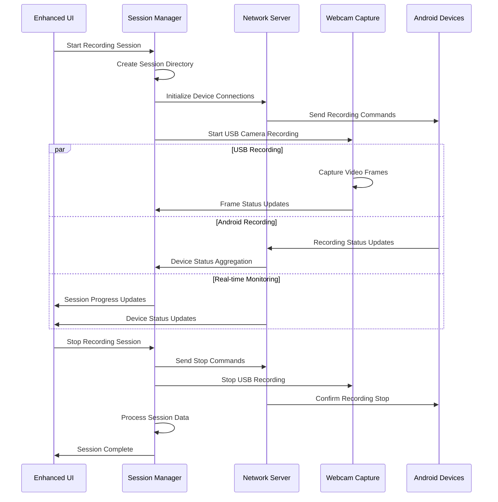
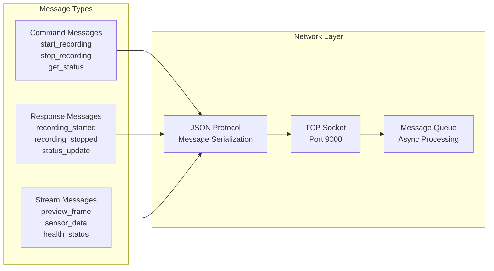

# Python Desktop Controller Application - Technical Documentation

## Overview

The Python Desktop Controller Application serves as the central command and control hub for the Multi-Sensor Recording System. It orchestrates device coordination, data aggregation, real-time monitoring, and post-session analysis across multiple sensor modalities including Android smartphones, USB webcams, thermal cameras, and physiological sensors.

## Architecture Overview

The Python Desktop Controller is built on a modern, modular architecture that provides separation of concerns, extensibility, and robust error handling. The application serves as the master orchestrator in a distributed sensor network.

```mermaid
graph TB
    subgraph "Python Desktop Controller Architecture"
        subgraph "Presentation Layer"
            GUI[Enhanced UI Main Window<br/>PyQt5 Interface]
            TABS[Tabbed Interface<br/>Recording|Devices|Calibration|Files]
            COMP[Common Components<br/>ModernButton|StatusIndicator]
        end
        
        subgraph "Application Layer"
            APP[Application<br/>DI Container]
            MAIN[Main Controller<br/>Workflow Coordination]
            SESS[Session Manager<br/>Recording Orchestration]
        end
        
        subgraph "Service Layer"
            NET[Network Layer<br/>JsonSocketServer]
            WEBCAM[Webcam Service<br/>USB Camera Control]
            CAL[Calibration Service<br/>OpenCV Integration]
            STIM[Stimulus Controller<br/>Experiment Management]
        end
        
        subgraph "Infrastructure Layer"
            LOG[Logging System<br/>Centralized Logging]
            CONF[Configuration<br/>Settings Management]
            UTILS[Utilities<br/>Helper Functions]
        end
        
        subgraph "External Interfaces"
            ANDROID[Android Devices<br/>Socket Communication]
            USB[USB Webcams<br/>DirectShow/V4L2]
            SHIMMER[Shimmer Sensors<br/>Bluetooth/Serial]
            FILES[File System<br/>Data Storage]
        end
    end
    
    GUI --> APP
    TABS --> MAIN
    COMP --> SESS
    
    APP --> NET
    APP --> WEBCAM
    APP --> CAL
    APP --> STIM
    
    MAIN --> LOG
    SESS --> CONF
    NET --> UTILS
    
    NET --> ANDROID
    WEBCAM --> USB
    CAL --> SHIMMER
    STIM --> FILES
```

## Core Components

### 1. Application Container (`application.py`)

The `Application` class serves as the dependency injection container and lifecycle manager for all backend services.

**Key Responsibilities:**
- Service instantiation and dependency injection
- Lifecycle management of backend services
- Error handling and graceful degradation
- Configuration of UI mode (simplified vs. enhanced)

**Key Classes:**
- `Application`: Main dependency injection container
- Service initialization and coordination
- Error handling with proper logging

**Integration Points:**
- Creates and configures all backend services
- Manages service dependencies and startup order
- Provides service access to UI components

### 2. GUI Layer (`gui/`)

The graphical user interface provides an intuitive, modern interface for system control and monitoring.

#### Enhanced Main Window (`enhanced_ui_main_window.py`)

**Purpose:** Primary user interface with PsychoPy-inspired design
**Key Features:**
- Modern, clean visual design with professional color scheme
- Tabbed interface for workflow organization
- Real-time status monitoring with visual indicators
- Responsive layout with adaptive components

**Key Classes:**
- `EnhancedMainWindow`: Main application window
- `ModernButton`: Custom styled buttons with hover effects
- `StatusIndicator`: Visual status communication
- `RecordingControlPanel`: Centralized recording controls

#### Common Components (`common_components.py`)

**Purpose:** Reusable UI components ensuring consistent appearance and behavior
**Components:**
- `ModernButton`: Standardized button styling with semantic colors
- `StatusIndicator`: Unified status visualization
- `ProgressIndicator`: Progress visualization for operations
- `ConnectionManager`: Device connection UI controls

### 3. Network Layer (`network/`)

The network layer handles communication with distributed sensor nodes and external devices.

#### Device Server (`device_server.py`)

**Purpose:** TCP socket server for Android device communication
**Key Features:**
- JSON-based message protocol
- Multi-device connection management
- Real-time preview streaming
- Automatic device discovery and registration

**Key Classes:**
- `JsonSocketServer`: Main socket server implementation
- `RemoteDevice`: Device state and capability management
- `DeviceClientHandler`: Per-device connection handler
- `MessageProcessor`: JSON message parsing and routing

**Communication Flow:**
1. Android devices connect on port 9000
2. Capability negotiation and device registration
3. Command/response message exchange
4. Real-time data streaming (preview, status)
5. Session coordination and synchronization

### 4. Session Management (`session/`)

The session management system coordinates recording sessions across multiple devices and sensor types.

#### Session Manager (`session_manager.py`)

**Purpose:** Central coordinator for multi-device recording sessions
**Key Features:**
- Session lifecycle management (start, monitor, stop)
- Cross-device synchronization
- Data organization and metadata generation
- Session validation and integrity checking

**Key Classes:**
- `SessionManager`: Main session orchestration
- `SessionLogger`: Session-specific logging
- `SessionSynchronizer`: Temporal synchronization
- `SessionRecovery`: Error recovery and resume

**Session Workflow:**
1. Session initialization and validation
2. Device connection verification
3. Synchronized recording start across all devices
4. Real-time monitoring and status tracking
5. Coordinated recording stop
6. Data aggregation and post-processing

### 5. Webcam Integration (`webcam/`)

The webcam system provides USB camera control and high-quality video capture.

#### Webcam Capture (`webcam_capture.py`)

**Purpose:** USB webcam control and recording
**Key Features:**
- Multi-camera support (up to 4 simultaneous cameras)
- DirectShow (Windows) and V4L2 (Linux) integration
- Real-time preview with adaptive frame rates
- High-quality recording with configurable parameters

**Key Classes:**
- `WebcamCapture`: Main webcam interface
- `DualWebcamCapture`: Multi-camera coordination
- `CVPreprocessingPipeline`: Image processing pipeline
- `AdvancedSyncAlgorithms`: Frame synchronization

### 6. Calibration System (`calibration/`)

The calibration system provides comprehensive camera calibration using OpenCV.

#### Calibration Manager (`calibration_manager.py`)

**Purpose:** Complete camera calibration workflow
**Key Features:**
- Intrinsic and extrinsic parameter calculation
- Stereo calibration for RGB-thermal alignment
- Quality assessment and coverage analysis
- Calibration data persistence and validation

**Key Classes:**
- `CalibrationManager`: Main calibration orchestration
- `CalibrationProcessor`: OpenCV algorithm integration
- `CalibrationResult`: Results management and validation
- `CalibrationQualityAssessment`: Quality metrics and recommendations

## Data Flow Architecture

### Recording Session Data Flow



### Device Communication Protocol



## Integration Patterns

### Dependency Injection Pattern

The application uses constructor injection for service dependencies:

```python
class Application(QObject):
    def __init__(self, use_simplified_ui=True):
        self.session_manager = SessionManager()
        self.json_server = JsonSocketServer(session_manager=self.session_manager)
        self.webcam_capture = WebcamCapture()
        self.main_controller = MainController()
```

### Observer Pattern for Status Updates

Real-time status updates use PyQt signals for loose coupling:

```python
class JsonSocketServer(QThread):
    device_connected = pyqtSignal(str, dict)  # device_id, capabilities
    device_status_updated = pyqtSignal(str, dict)  # device_id, status
    preview_frame_received = pyqtSignal(str, bytes)  # device_id, frame_data
```

### Command Pattern for Device Operations

Device operations use command objects for undo/redo and queuing:

```python
class RecordingCommand:
    def execute(self, devices: List[RemoteDevice]) -> bool
    def undo(self, devices: List[RemoteDevice]) -> bool
    def can_execute(self, devices: List[RemoteDevice]) -> bool
```

## Error Handling and Recovery

### Graceful Degradation

The system implements graceful degradation when components are unavailable:

- **Missing PyQt5**: Falls back to console interface
- **Camera unavailable**: Continues with available cameras
- **Network issues**: Queues commands for retry
- **Device disconnection**: Maintains session state for reconnection

### Error Recovery Mechanisms

1. **Connection Recovery**: Automatic reconnection for network failures
2. **Session Recovery**: Resume interrupted sessions from checkpoints
3. **Data Recovery**: Validate and repair corrupted session data
4. **Resource Recovery**: Cleanup and restart failed services

### Logging and Diagnostics

Comprehensive logging system with multiple levels:

- **DEBUG**: Detailed execution flow and variable states
- **INFO**: Normal operation milestones and status
- **WARNING**: Recoverable errors and degraded functionality  
- **ERROR**: Critical failures requiring intervention

## Performance Characteristics

### Resource Usage

- **Memory**: 50-200MB typical, scales with connected devices
- **CPU**: Low baseline (<5%), spikes during recording (10-30%)
- **Network**: 1-10Mbps per device for preview streaming
- **Storage**: Variable based on recording duration and quality

### Scalability Limits

- **Maximum Devices**: 8 Android devices simultaneously
- **Maximum USB Cameras**: 4 cameras (hardware dependent)
- **Session Duration**: No limit (tested up to 4 hours)
- **File Size**: Limited by available storage

### Performance Optimizations

1. **Async Processing**: Non-blocking UI with background operations
2. **Frame Buffering**: Smooth preview streaming with adaptive rates
3. **Data Compression**: Efficient network bandwidth usage
4. **Memory Management**: Proper resource cleanup and garbage collection

## Security Considerations

### Network Security

- **Local Network Only**: No internet connectivity required
- **Authentication**: Device capability verification
- **Encryption**: Optional TLS for sensitive applications
- **Access Control**: Port-based access restriction

### Data Security

- **Local Storage**: All data stored locally by default
- **File Permissions**: Restricted access to session directories
- **Data Validation**: Integrity checking for all recorded data
- **Audit Trail**: Comprehensive logging of all operations

## Development Guidelines

### Code Organization

```
PythonApp/src/
├── application.py              # Main application container
├── main.py                     # Entry point
├── gui/                        # User interface components
│   ├── enhanced_ui_main_window.py
│   ├── common_components.py
│   └── device_panel.py
├── network/                    # Network communication
│   ├── device_server.py
│   ├── android_device_manager.py
│   └── pc_server.py
├── session/                    # Session management
│   ├── session_manager.py
│   ├── session_logger.py
│   └── session_synchronizer.py
├── webcam/                     # USB camera integration
│   ├── webcam_capture.py
│   └── dual_webcam_capture.py
├── calibration/                # Camera calibration
│   ├── calibration_manager.py
│   └── calibration_processor.py
└── utils/                      # Utilities and helpers
    ├── logging_config.py
    └── config_manager.py
```

### Testing Strategy

1. **Unit Tests**: Individual component functionality
2. **Integration Tests**: Cross-component interactions
3. **System Tests**: End-to-end recording workflows
4. **Performance Tests**: Resource usage and limits
5. **UI Tests**: User interface behavior and responsiveness

### Extension Points

The architecture provides several extension points for customization:

1. **Device Types**: Add new sensor types via the device interface
2. **Calibration Algorithms**: Plugin new calibration methods
3. **Data Formats**: Support additional export formats
4. **UI Themes**: Custom visual themes and layouts
5. **Network Protocols**: Alternative communication protocols

## Testing Framework

### Enhanced Testing Architecture

The application includes comprehensive testing infrastructure with advanced validation capabilities:

```python
# Test execution pipeline with performance monitoring
class TestEnhancedFoundation(BaseTestClass):
    """Enhanced foundation testing with performance monitoring."""
    
    def setUp(self):
        """Setup with performance monitoring."""
        self.performance_monitor = PerformanceMonitor()
        self.performance_monitor.start_monitoring()
        super().setUp()
    
    def test_component_integration(self):
        """Test component integration with validation."""
        # Test setup and execution with monitoring
        pass
```

**Test Categories:**
- **Foundation Tests**: Basic component integration with performance monitoring
- **Core Functionality Tests**: Feature validation with realistic scenarios
- **Stress & Performance Tests**: Load testing and resource usage validation
- **Network Resilience Tests**: Connection failure and recovery testing
- **Data Integrity Tests**: Data validation and corruption detection
- **End-to-End Tests**: Complete workflow validation

**Test Execution Pipeline:**

```mermaid
graph LR
    START[Test Suite Start] --> PREP[Environment Preparation]
    PREP --> FOUND[Foundation Tests]
    FOUND --> CORE[Core Functionality Tests]
    CORE --> PERF[Performance Tests]
    PERF --> NET[Network Tests]
    NET --> DATA[Data Integrity Tests]
    DATA --> E2E[End-to-End Tests]
    E2E --> REPORT[Comprehensive Reporting]
```


## Logging and Monitoring

### Comprehensive Logging System

The application implements structured logging with specialized categories:

```python
# Logger categories with specialized handling
LOGGER_CATEGORIES = {
    'session': 'multisensor.session',      # Session management
    'device': 'multisensor.device',        # Device communication
    'network': 'multisensor.network',      # Network operations
    'camera': 'multisensor.camera',        # Camera operations
    'calibration': 'multisensor.calibration', # Calibration procedures
    'performance': 'multisensor.performance', # Performance monitoring
    'security': 'multisensor.security',    # Security and permissions
    'ui': 'multisensor.ui',               # User interface events
    'data': 'multisensor.data',           # Data processing and storage
    'config': 'multisensor.config'        # Configuration management
}
```

**Log Levels and Categories:**

| Level | Priority | Usage | Example Scenarios |
|-------|----------|-------|-------------------|
| **CRITICAL** | 50 | System failures | Application crash, data corruption |
| **ERROR** | 40 | Recoverable errors | Device disconnection, file write failure |
| **WARNING** | 30 | Potential issues | Low disk space, network latency |
| **INFO** | 20 | Normal operations | Session start/stop, device connections |
| **DEBUG** | 10 | Detailed information | Function entry/exit, parameter values |

**Structured Logging Format:**
```json
{
    "timestamp": "2024-01-31T10:30:45.123Z",
    "level": "INFO",
    "category": "session",
    "component": "SessionManager",
    "message": "Recording session started",
    "context": {
        "session_id": "session_20240131_103045",
        "device_count": 3,
        "duration_planned": 300
    }
}
```

## Troubleshooting

### Common Issues

1. **Device Connection Failures**
   - Check network connectivity and firewall settings
   - Verify port 9000 is available
   - Restart the network service

2. **Camera Access Issues**
   - Verify camera permissions and drivers
   - Check for conflicting applications
   - Test with camera utility tools

3. **Performance Problems**
   - Monitor resource usage during recording
   - Reduce preview frame rates if needed
   - Close unnecessary applications

### Diagnostic Tools

The application includes built-in diagnostic capabilities:

- **Device Status Monitor**: Real-time device health checking
- **Network Diagnostics**: Connection testing and bandwidth monitoring
- **Performance Profiler**: Resource usage analysis
- **Log Analyzer**: Automated log analysis and issue detection

## Future Enhancements

### Planned Features

1. **Cloud Integration**: Optional cloud storage and synchronization
2. **Advanced Analytics**: Real-time data analysis and visualization
3. **Remote Access**: Web-based remote monitoring and control
4. **Machine Learning**: Automated quality assessment and optimization
5. **Plugin System**: Extensible plugin architecture for custom features

### API Evolution

The internal APIs are designed for stability with backward compatibility guarantees for major versions. New features are added through optional interfaces and progressive enhancement patterns.