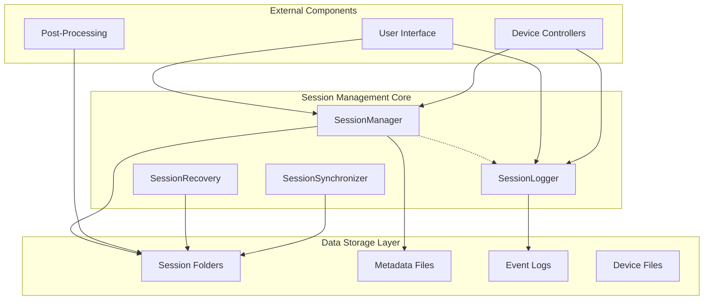
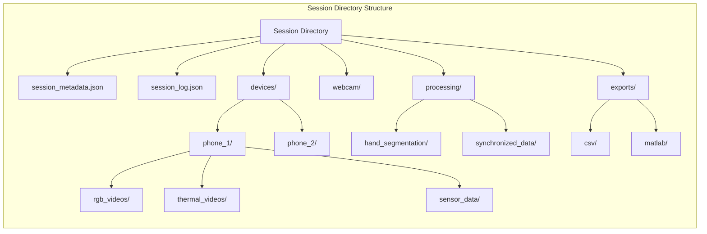
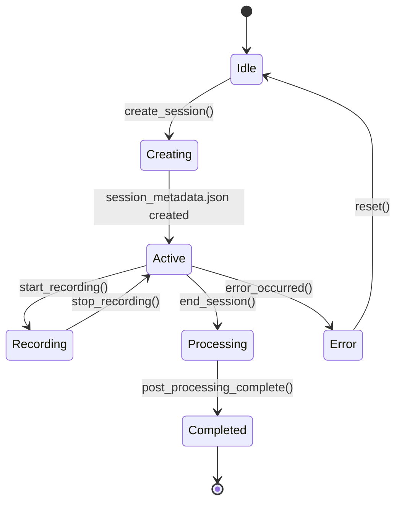

# Session Management and Data Storage System - Technical Documentation

## Overview

The Session Management and Data Storage System is the foundational framework responsible for defining, managing, and storing recording sessions in the Multi-Sensor Recording System. This system enforces a standardized directory structure and file-naming convention to ensure data integrity and facilitate post-processing workflows.

## Architecture

The session management system is built around two core components that work together to provide comprehensive session lifecycle management and event tracking:



### Core Classes

#### SessionManager
The `SessionManager` class (`session/session_manager.py`) serves as the central coordinator for all session operations. It manages the complete session lifecycle from creation to completion, handles device registration, file tracking, and maintains session metadata.

**Key Responsibilities:**
- Session creation and termination
- Directory structure enforcement
- Device and file registration
- Metadata maintenance
- Post-processing coordination

**Design Patterns:**
- **Singleton Pattern**: Global session state management
- **Observer Pattern**: UI notification through Qt signals
- **Factory Pattern**: Session folder and file creation
- **Command Pattern**: Session operations encapsulation

#### SessionLogger
The `SessionLogger` class (`session/session_logger.py`) provides comprehensive event logging with structured JSON format. It captures all key events, timestamps, and relevant details for both live feedback and post-session analysis.

**Key Responsibilities:**
- Real-time event logging
- Structured JSON event format
- Thread-safe logging operations
- UI feedback signals
- Session timeline tracking

### Data Architecture

The system implements a hierarchical data organization strategy that separates concerns while maintaining data relationships:



## Implementation Details

### Session Lifecycle Management

The session management system follows a well-defined lifecycle with clear state transitions:



#### Session Creation Process

1. **Timestamp Generation**: Creates unique session identifier using `YYYYMMDD_HHMMSS` format
2. **Name Sanitization**: Cleans custom session names for filesystem compatibility
3. **Directory Creation**: Establishes standardized folder hierarchy
4. **Metadata Initialization**: Creates `session_metadata.json` with initial state
5. **Logger Initialization**: Sets up event logging infrastructure

```python
def create_session(self, session_name: Optional[str] = None) -> Dict:
    timestamp = datetime.now()
    session_id = self._generate_session_id(session_name, timestamp)
    session_folder = self.base_recordings_dir / session_id
    session_folder.mkdir(parents=True, exist_ok=True)
    
    session_info = {
        "session_id": session_id,
        "start_time": timestamp.isoformat(),
        "status": "active",
        "devices": {},
        "files": {}
    }
    
    self._write_metadata(session_folder, session_info)
    return session_info
```

### Directory Structure Enforcement

The system enforces a strict directory structure that ensures consistency across all sessions:

**Root Session Structure:**
```
recordings/
├── session_20250731_143022/
│   ├── session_metadata.json          # Primary session metadata
│   ├── session_20250731_143022_log.json  # Event timeline log
│   ├── devices/                       # Device-specific recordings
│   │   ├── phone_1/                   # First mobile device
│   │   │   ├── rgb_videos/            # Standard camera recordings
│   │   │   ├── thermal_videos/        # Thermal camera recordings
│   │   │   └── sensor_data/           # GSR, motion, other sensors
│   │   └── phone_2/                   # Additional devices follow same pattern
│   ├── webcam/                        # PC-based camera recordings
│   ├── processing/                    # Post-processing results
│   │   ├── hand_segmentation/         # Computer vision analysis
│   │   └── synchronized_data/         # Multi-device time alignment
│   └── exports/                       # Data export formats
│       ├── csv/                       # Spreadsheet-compatible exports
│       └── matlab/                    # MATLAB-compatible exports
```

### File Naming Conventions

The system implements standardized file naming patterns to ensure predictable file identification:

**Session Naming Pattern:**
```
Format: [custom_name_]YYYYMMDD_HHMMSS
Examples:
- session_20250731_143022              # Default naming
- experiment_A_20250731_143022         # Custom session name
- calibration_run_20250731_143022      # Specific use case
```

**Device File Naming Pattern:**
```
Format: [device_id]_[file_type]_YYYYMMDD_HHMMSS.[extension]
Examples:
- phone_1_rgb_20250731_143022.mp4      # RGB video from phone 1
- phone_1_thermal_20250731_143022.mp4  # Thermal video from phone 1
- phone_1_gsr_20250731_143022.csv      # GSR sensor data from phone 1
- webcam_1_20250731_143022.mp4         # PC webcam recording
```

### Device Management

The session manager provides comprehensive device lifecycle management:

```python
def add_device_to_session(self, device_id: str, device_type: str, capabilities: List[str]):
    device_info = {
        "device_type": device_type,
        "capabilities": capabilities,
        "added_time": datetime.now().isoformat(),
        "status": "connected"
    }
    
    self.current_session["devices"][device_id] = device_info
    self._update_session_metadata()
```

**Device Types:**
- `android_phone`: Mobile devices with multiple sensors
- `pc_webcam`: Computer-attached cameras
- `shimmer_gsr`: Dedicated GSR sensor devices
- `thermal_camera`: Thermal imaging devices

**Device Capabilities:**
- `rgb_video`: Standard color video recording
- `thermal_video`: Thermal imaging video
- `gsr_data`: Galvanic skin response measurements
- `motion_data`: Accelerometer and gyroscope data
- `audio_recording`: Audio capture capability

### File Tracking and Management

The system maintains comprehensive file tracking throughout the session lifecycle:

```python
def add_file_to_session(self, device_id: str, file_type: str, file_path: str, file_size: Optional[int] = None):
    file_info = {
        "file_type": file_type,
        "file_path": file_path,
        "file_size": file_size,
        "created_time": datetime.now().isoformat()
    }
    
    if device_id not in self.current_session["files"]:
        self.current_session["files"][device_id] = []
    
    self.current_session["files"][device_id].append(file_info)
    self._update_session_metadata()
```

### Event Logging System

The session logger implements a comprehensive event tracking system with structured JSON format:

**Event Categories:**
- **Session Events**: `session_start`, `session_end`
- **Device Events**: `device_connected`, `device_disconnected`, `device_ack`
- **Recording Events**: `start_record`, `stop_record`
- **File Events**: `file_received`, `calibration_capture`
- **Stimulus Events**: `stimulus_play`, `stimulus_stop`, `marker`
- **Error Events**: `error` with categorized error types

**Event Structure:**
```json
{
  "event": "start_record",
  "time": "14:30:25.456",
  "timestamp": "2025-07-31T14:30:25.456789",
  "devices": ["phone_1", "webcam_1"],
  "session": "experiment_A_20250731_143022"
}
```

### Post-Processing Integration

The session manager provides built-in integration with post-processing workflows:

```python
def trigger_post_session_processing(self, session_id: Optional[str] = None, 
                                  enable_hand_segmentation: bool = True) -> Dict[str, any]:
    results = {
        'session_id': session_id,
        'hand_segmentation': {
            'enabled': enable_hand_segmentation,
            'available': self.has_hand_segmentation_available(),
            'success': False,
            'results': None
        }
    }
    
    if enable_hand_segmentation and self.has_hand_segmentation_available():
        processor = create_session_post_processor(str(self.base_recordings_dir))
        segmentation_results = processor.process_session(session_id)
        results['hand_segmentation']['success'] = True
        results['hand_segmentation']['results'] = segmentation_results
    
    return results
```

## Data Integrity Features

### Atomic Operations
All session operations are designed to be atomic, ensuring data consistency even in case of unexpected termination:

- **Metadata Updates**: Use temporary files with atomic rename operations
- **Event Logging**: Immediate disk flushing with file synchronization
- **Directory Creation**: Transactional folder structure creation

### Recovery Mechanisms
The system includes robust recovery capabilities:

- **Session Recovery**: Detect and recover incomplete sessions
- **File Validation**: Verify file integrity and completeness
- **Metadata Repair**: Reconstruct missing metadata from available data

### Thread Safety
All session operations are thread-safe using appropriate locking mechanisms:

```python
def log_event(self, event_type: str, details: Optional[Dict] = None) -> None:
    with self.lock:
        # Thread-safe event logging
        event_entry = self._create_event_entry(event_type, details)
        self.events.append(event_entry)
        self._flush_to_disk()
```

## Performance Considerations

### Memory Management
- **Lazy Loading**: Session metadata loaded on-demand
- **Streaming Operations**: Large file operations use streaming
- **Cache Management**: LRU cache for frequently accessed sessions

### Disk I/O Optimization
- **Batch Operations**: Group multiple operations where possible
- **Asynchronous Writing**: Non-blocking disk operations for UI responsiveness
- **Compression**: Optional compression for large data files

### Scalability
- **Concurrent Sessions**: Support for multiple simultaneous sessions
- **Large File Handling**: Efficient management of multi-gigabyte recordings
- **Device Scaling**: Support for numerous connected devices

## Integration Points

### UI Integration
The session management system integrates with the user interface through Qt signals:

```python
# Qt signals for UI updates
log_entry_added = pyqtSignal(str)      # Real-time log updates
session_started = pyqtSignal(str)       # Session creation notification
session_ended = pyqtSignal(str, float)  # Session completion notification
error_logged = pyqtSignal(str, str)     # Error event notification
```

### Device Controller Integration
Device controllers interact with session management through standardized interfaces:

- **Device Registration**: Controllers register capabilities and status
- **File Reporting**: Controllers report generated files for tracking
- **Event Logging**: Controllers log significant events through session logger

### Post-Processing Integration
The system provides hooks for automated post-processing workflows:

- **Hand Segmentation**: Automatic computer vision processing
- **Data Synchronization**: Multi-device timestamp alignment
- **Export Generation**: Automated data format conversion

## Error Handling and Logging

### Error Categories
- **Session Errors**: Creation, termination, or state management failures
- **Device Errors**: Connection, communication, or capability issues
- **File Errors**: Creation, writing, or validation problems
- **System Errors**: Resource exhaustion or permission issues

### Error Recovery Strategies
- **Graceful Degradation**: Continue operation with reduced functionality
- **Automatic Retry**: Retry failed operations with exponential backoff
- **User Notification**: Clear error reporting with actionable guidance
- **State Recovery**: Restore consistent state after error resolution

## Testing Strategy

### Unit Testing
- **Session Manager Tests**: Verify core functionality and edge cases
- **Session Logger Tests**: Validate event logging and formatting
- **File Operations Tests**: Test directory and file management
- **Error Handling Tests**: Verify error scenarios and recovery

### Integration Testing
- **Multi-Device Sessions**: Test with multiple connected devices
- **Long-Running Sessions**: Validate system stability over time
- **Concurrent Operations**: Test thread safety and resource contention
- **Recovery Testing**: Verify system recovery from various failure modes

### Performance Testing
- **Large Session Testing**: Sessions with numerous devices and files
- **Memory Usage Testing**: Monitor memory consumption over time
- **Disk I/O Testing**: Measure and optimize file operation performance
- **Concurrent Session Testing**: Multiple simultaneous sessions

## Testing and Validation

### Comprehensive Session Testing Framework

The system includes extensive testing capabilities for validating session management functionality:

#### Core Test Features
- **PC and Android Simulation**: Complete startup simulation and device coordination
- **Communication Protocol Testing**: JSON message validation and network stability
- **Data Persistence Validation**: File integrity and metadata consistency checking
- **Performance Monitoring**: Resource utilization and system health tracking
- **Error Recovery Testing**: Failure simulation and recovery mechanism validation

#### Test Execution
```bash
# Quick validation test
cd PythonApp
python run_quick_recording_session_test.py

# Comprehensive session testing
python run_recording_session_test.py --duration 60 --devices 2 --save-logs --verbose

# Stress testing with multiple devices
python run_recording_session_test.py --stress-test --devices 8 --duration 300
```

#### Validation Coverage
The testing framework validates:
- Session creation and metadata management
- Device coordination and communication protocols
- File organization and naming convention compliance
- Data integrity and format consistency
- Error handling and recovery mechanisms
- Performance metrics and resource utilization
- Real-time monitoring and health checking

## Future Enhancements

### Planned Features
- **Distributed Sessions**: Multi-computer session coordination
- **Cloud Integration**: Remote session storage and synchronization
- **Advanced Analytics**: Real-time session quality metrics
- **Automated Quality Control**: Intelligent error detection and correction
- **Enhanced Testing**: Real hardware integration and advanced simulation

### Extensibility Points
- **Plugin Architecture**: Support for custom post-processing modules
- **Event Hooks**: Custom event handlers for specialized workflows
- **Storage Backends**: Support for different storage systems
- **Metadata Extensions**: Custom metadata fields for specific research needs
- **Testing Extensions**: Custom validation modules and performance benchmarks

## Conclusion

The Session Management and Data Storage System provides a robust, scalable foundation for multi-sensor recording operations. Its comprehensive approach to data organization, integrity enforcement, and lifecycle management ensures reliable operation while maintaining flexibility for diverse research requirements. The extensive testing framework validates all system components and provides confidence in system reliability for critical research applications.

The system's design emphasizes data integrity, user experience, and maintainability, making it suitable for both casual use and intensive research applications. The modular architecture and well-defined interfaces facilitate future enhancements and customization while preserving backward compatibility.