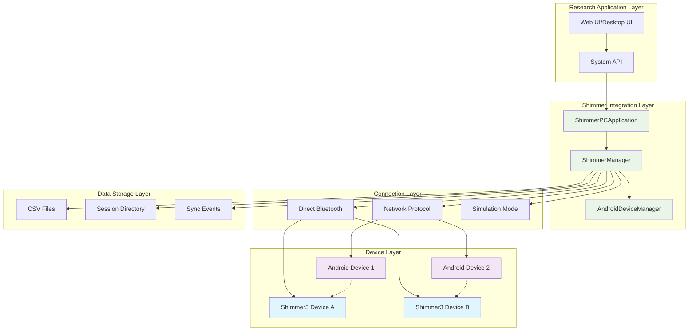
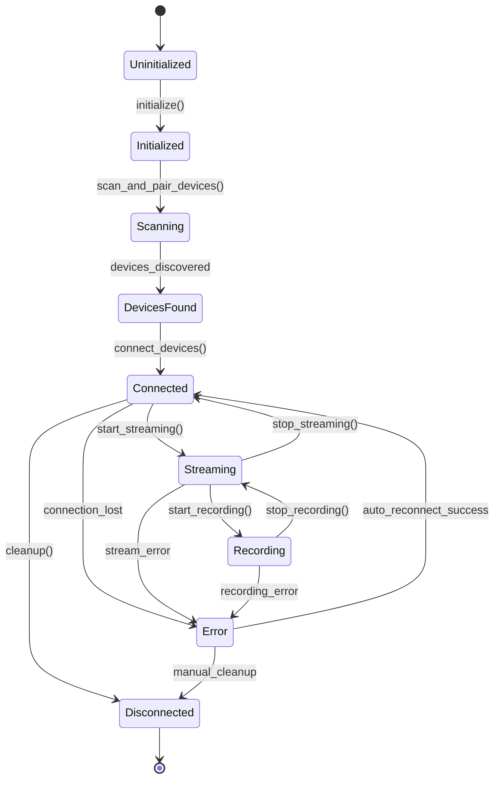
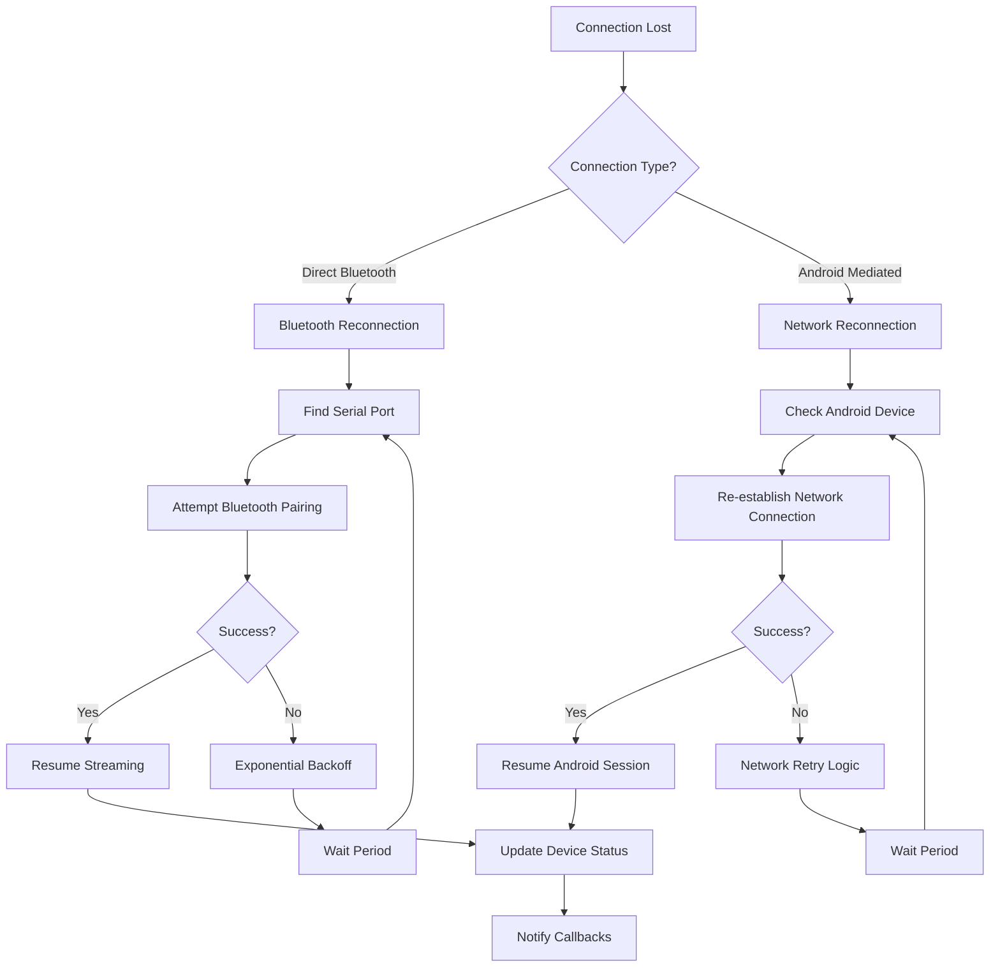
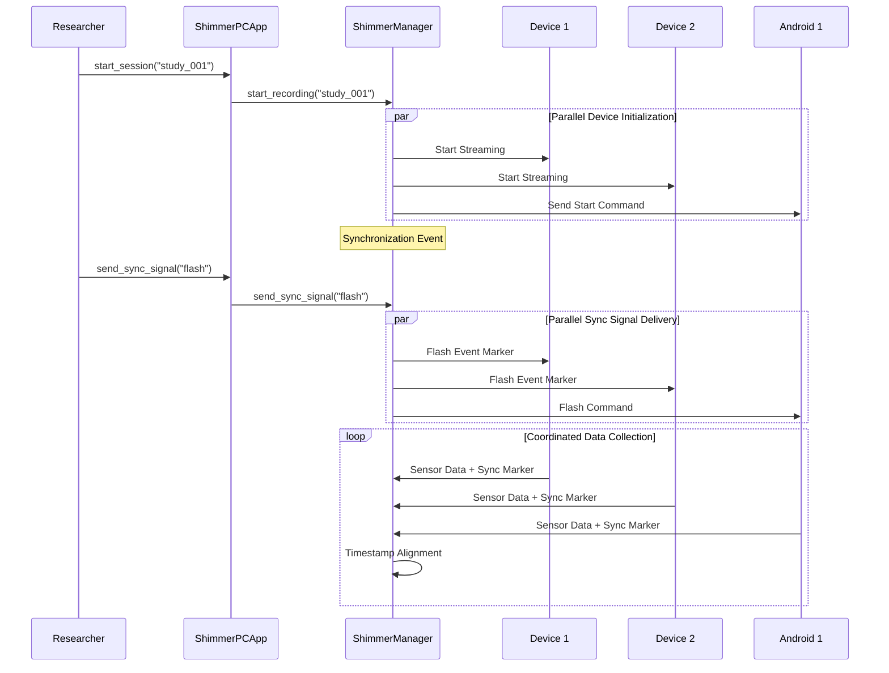

# Shimmer Manager and PC Application: Technical Deep-Dive

## Table of Contents

- [Overview](#overview)
- [Architecture Overview](#architecture-overview)
  - [System Integration Architecture](#system-integration-architecture)
  - [Dual Connection Architecture](#dual-connection-architecture)
  - [Data Flow Architecture](#data-flow-architecture)
- [Key Classes and Components](#key-classes-and-components)
  - [ShimmerManager Core Implementation](#shimmermanager-core-implementation)
  - [ShimmerPCApplication Integration Layer](#shimmerpcapplication-integration-layer)
  - [Connection Type Management](#connection-type-management)
  - [Data Structure Design](#data-structure-design)
- [Complex Algorithms and Logic](#complex-algorithms-and-logic)
  - [Device Discovery and Connection Algorithm](#device-discovery-and-connection-algorithm)
  - [Data Validation Framework](#data-validation-framework)
  - [Intelligent Reconnection Algorithm](#intelligent-reconnection-algorithm)
  - [Real-time Data Processing Pipeline](#real-time-data-processing-pipeline)
- [System Integration Details](#system-integration-details)
  - [Android Integration Components](#android-integration-components)
  - [PC Server Integration](#pc-server-integration)
  - [Bluetooth Communication Protocols](#bluetooth-communication-protocols)
- [Session Management and Data Export](#session-management-and-data-export)
  - [Session-Based Recording Architecture](#session-based-recording-architecture)
  - [CSV Export Format and Structure](#csv-export-format-and-structure)
  - [Multi-Device Coordination](#multi-device-coordination)
- [Performance Optimization and Scalability](#performance-optimization-and-scalability)
  - [Threading Architecture](#threading-architecture)
  - [Memory Management](#memory-management)
  - [Real-time Streaming Optimization](#real-time-streaming-optimization)
- [Error Handling and Recovery](#error-handling-and-recovery)
  - [Comprehensive Error Classification](#comprehensive-error-classification)
  - [Graceful Cleanup and Resource Management](#graceful-cleanup-and-resource-management)
- [Integration with Overall System](#integration-with-overall-system)
  - [Network Protocol Integration](#network-protocol-integration)
  - [Session Management Integration](#session-management-integration)
  - [UI Integration Points](#ui-integration-points)

## Overview

The Shimmer Manager and PC Application represents the core physiological sensor integration subsystem within the Multi-Sensor Recording System. This comprehensive solution provides unified access to Shimmer3 GSR+ devices through multiple connection paradigms, enabling high-precision galvanic skin response (GSR), photoplethysmography (PPG), and motion sensor data collection for research applications.

The implementation demonstrates advanced sensor integration patterns, supporting both direct PC-based Bluetooth connections via the pyshimmer library and Android-mediated connections through the network protocol. This dual-connection architecture maximizes deployment flexibility while maintaining data quality and real-time performance requirements.

**Core Purpose**: Enable researchers to collect high-quality physiological data from Shimmer3 devices in diverse experimental configurations, from simple single-device studies to complex multi-participant, multi-device research protocols.

**Role within System**: Acts as the primary interface between physiological sensors and the broader multi-sensor recording infrastructure, providing data standardization, session management, and real-time streaming capabilities.

## Architecture Overview

### System Integration Architecture



### Dual Connection Architecture

The system implements a sophisticated dual-connection architecture that enables flexible device integration patterns:

**Direct Connection Path**:
- PC ↔ Bluetooth ↔ Shimmer3 Device
- Uses pyshimmer library for low-level device communication
- Provides minimum latency and maximum data throughput
- Ideal for laboratory settings with stable Bluetooth infrastructure

**Android-Mediated Connection Path**:
- PC ↔ Network Protocol ↔ Android Device ↔ Shimmer Android API ↔ Shimmer3 Device
- Leverages official Shimmer Android SDK capabilities
- Enables mobile and field research scenarios
- Provides additional sensor fusion capabilities (Android device sensors + Shimmer sensors)

### Data Flow Architecture

```mermaid
sequenceDiagram
    participant R as Researcher
    participant SPC as ShimmerPCApplication
    participant SM as ShimmerManager
    participant S3 as Shimmer3 Device
    participant AND as Android Device
    participant CSV as CSV Storage
    
    R->>SPC: Initialize Session
    SPC->>SM: initialize()
    SM->>SM: Start Background Threads
    
    Note over SM: Device Discovery Phase
    SM->>S3: Bluetooth Scan
    SM->>AND: Network Discovery
    
    R->>SPC: Start Recording
    SPC->>SM: start_recording(session_id)
    SM->>S3: Start Streaming
    SM->>AND: Send Start Command
    
    loop Real-time Data Collection
        S3->>SM: Sensor Data (Direct)
        AND->>SM: Sensor Data (Network)
        SM->>SM: Data Validation
        SM->>CSV: Write Sample
        SM->>SPC: Data Callback
    end
    
    R->>SPC: Stop Recording
    SPC->>SM: stop_recording()
    SM->>S3: Stop Streaming
    SM->>AND: Send Stop Command
    SM->>CSV: Close Files
```

## Key Classes and Components

### ShimmerManager Core Implementation

The `ShimmerManager` class serves as the central orchestration component for all Shimmer device interactions. Its architecture follows a comprehensive state management pattern with clear separation of concerns:

**Core Responsibilities**:
- **Device Lifecycle Management**: Discovery, connection, configuration, streaming, and disconnection
- **Data Pipeline Orchestration**: Real-time data processing, validation, and export
- **Session Coordination**: Multi-device session management and synchronization
- **Error Recovery**: Intelligent reconnection and graceful degradation

**Key Design Patterns**:

```python
class ShimmerManager:
    def __init__(self, session_manager=None, logger=None, enable_android_integration=True):
        # Device management collections
        self.connected_devices: Dict[str, Union[ShimmerBluetooth, str]] = {}
        self.device_configurations: Dict[str, DeviceConfiguration] = {}
        self.device_status: Dict[str, ShimmerStatus] = {}
        
        # Android integration layer
        self.android_device_manager: Optional[AndroidDeviceManager] = None
        self.android_shimmer_mapping: Dict[str, str] = {}
        
        # Data processing infrastructure
        self.data_queues: Dict[str, queue.Queue] = {}
        self.thread_pool = ThreadPoolExecutor(max_workers=8)
        
        # Callback registration system
        self.data_callbacks: List[Callable[[ShimmerSample], None]] = []
        self.status_callbacks: List[Callable[[str, ShimmerStatus], None]] = []
```

**State Management Architecture**:
The ShimmerManager implements a sophisticated state machine for device lifecycle management:



### ShimmerPCApplication Integration Layer

The `ShimmerPCApplication` provides a high-level application interface that abstracts the complexity of multi-device Shimmer management for end-user applications:

**Architecture Philosophy**:
- **Unified Device Interface**: Single API for both direct and Android-mediated connections
- **Session-Centric Design**: All operations organized around research session concepts
- **Real-time Monitoring**: Continuous device health and data quality assessment
- **Command-Line Ready**: Complete CLI interface for automated research workflows

**Integration Patterns**:

```python
class ShimmerPCApplication:
    def __init__(self, android_port: int = 9000, enable_gui: bool = False):
        # Core component composition
        self.shimmer_manager: Optional[ShimmerManager] = None
        self.android_manager: Optional[AndroidDeviceManager] = None
        
        # Application state management
        self.current_session_id: Optional[str] = None
        self.connected_devices: Dict[str, Dict[str, Any]] = {}
        self.device_stats: Dict[str, Dict[str, Any]] = {}
        
        # Monitoring infrastructure
        self.monitor_thread: Optional[threading.Thread] = None
        self.stats_thread: Optional[threading.Thread] = None
```

### Connection Type Management

The system implements a comprehensive connection type abstraction that enables seamless switching between connection methods:

```python
class ConnectionType(Enum):
    """Types of Shimmer device connections"""
    DIRECT_BLUETOOTH = "direct_bluetooth"     # PC ↔ Bluetooth ↔ Shimmer3
    ANDROID_MEDIATED = "android_mediated"     # PC ↔ Network ↔ Android ↔ Shimmer3
    SIMULATION = "simulation"                 # Software simulation for testing

class DeviceState(Enum):
    """Shimmer device states"""
    DISCONNECTED = "disconnected"
    CONNECTING = "connecting"
    CONNECTED = "connected"
    STREAMING = "streaming"
    ERROR = "error"
```

This abstraction enables transparent operation regardless of the underlying connection mechanism, critical for research reproducibility across different experimental setups.

### Data Structure Design

The system employs rich data structures that capture comprehensive device information and sensor readings:

**ShimmerStatus - Device Health Monitoring**:
```python
@dataclass
class ShimmerStatus:
    # Connection information
    is_available: bool = False
    is_connected: bool = False
    is_recording: bool = False
    connection_type: ConnectionType = ConnectionType.SIMULATION
    device_state: DeviceState = DeviceState.DISCONNECTED
    
    # Device configuration
    sampling_rate: int = 0
    enabled_channels: Set[str] = None
    device_name: Optional[str] = None
    mac_address: Optional[str] = None
    
    # Runtime status
    battery_level: Optional[int] = None
    samples_recorded: int = 0
    last_data_timestamp: Optional[float] = None
    
    # Android integration
    android_device_id: Optional[str] = None
```

**ShimmerSample - Standardized Sensor Data**:
```python
@dataclass
class ShimmerSample:
    timestamp: float
    system_time: str
    device_id: str
    connection_type: ConnectionType = ConnectionType.SIMULATION
    
    # Core physiological sensors
    gsr_conductance: Optional[float] = None    # microsiemens
    ppg_a13: Optional[float] = None           # ADC units
    
    # Motion sensors
    accel_x: Optional[float] = None           # g
    accel_y: Optional[float] = None           # g
    accel_z: Optional[float] = None           # g
    gyro_x: Optional[float] = None            # degrees/sec
    gyro_y: Optional[float] = None            # degrees/sec
    gyro_z: Optional[float] = None            # degrees/sec
    
    # Device metadata
    battery_percentage: Optional[int] = None
    session_id: Optional[str] = None
```

## Complex Algorithms and Logic

### Device Discovery and Connection Algorithm

The device discovery system implements a multi-phase approach that maximizes device detection reliability across different connection types:

**Phase 1: Direct Bluetooth Discovery**
```python
def _scan_direct_bluetooth_devices(self) -> List[str]:
    """Multi-method Bluetooth scanning for maximum device detection"""
    discovered_devices = []
    
    # Method 1: pyshimmer native scanning
    if PYSHIMMER_AVAILABLE:
        try:
            # Native Shimmer device scanning with library integration
            devices = ShimmerBluetooth.scan_devices(timeout=10.0)
            for device in devices:
                if device.name and 'shimmer' in device.name.lower():
                    discovered_devices.append(device.address)
        except ImportError:
            pass
    
    # Method 2: Generic Bluetooth scanning fallback
    if len(discovered_devices) == 0:
        discovered_devices = self._generic_bluetooth_scan()
    
    return discovered_devices
```

**Phase 2: Android Device Network Discovery**
```python
def scan_and_pair_devices(self) -> Dict[str, List[str]]:
    """Comprehensive device discovery across all connection types"""
    discovered_devices = {
        'direct': [],
        'android': [],
        'simulated': []
    }
    
    # Parallel discovery operations
    with ThreadPoolExecutor(max_workers=3) as executor:
        # Direct Bluetooth scanning
        bluetooth_future = executor.submit(self._scan_direct_bluetooth_devices)
        
        # Android device discovery
        android_future = executor.submit(self._discover_android_devices)
        
        # Wait for all discovery methods
        discovered_devices['direct'] = bluetooth_future.result()
        discovered_devices['android'] = android_future.result()
    
    return discovered_devices
```

### Data Validation Framework

The system implements comprehensive data validation to ensure research data quality:

```python
def _validate_sample_data(self, sample: ShimmerSample) -> bool:
    """Multi-layer data validation for research quality assurance"""
    try:
        # Temporal validation
        if sample.timestamp <= 0:
            return False
        
        # Sensor range validation
        sensor_checks = [
            ('gsr_conductance', sample.gsr_conductance, (0.0, 100.0)),
            ('ppg_a13', sample.ppg_a13, (0.0, 4095.0)),
            ('accel_x', sample.accel_x, (-16.0, 16.0)),
            ('battery_percentage', sample.battery_percentage, (0, 100))
        ]
        
        for sensor_name, value, (min_val, max_val) in sensor_checks:
            if value is not None:
                if not (min_val <= value <= max_val):
                    self.logger.warning(f"Invalid {sensor_name}: {value}")
                    return False
        
        return True
    except Exception as e:
        self.logger.error(f"Validation error: {e}")
        return False
```

### Intelligent Reconnection Algorithm

The system implements sophisticated reconnection logic to handle real-world connection instabilities:



### Real-time Data Processing Pipeline

The data processing pipeline is designed for high-throughput, low-latency operation:

```python
def _data_processing_loop(self) -> None:
    """High-performance data processing with minimal latency"""
    while not self.stop_event.is_set():
        try:
            # Process data from all device queues concurrently
            for device_id, data_queue in self.data_queues.items():
                try:
                    # Non-blocking queue processing
                    sample = data_queue.get_nowait()
                    
                    # Parallel validation and processing
                    if self._validate_sample_data(sample):
                        # Immediate callback notification
                        for callback in self.data_callbacks:
                            self.thread_pool.submit(callback, sample)
                        
                        # Asynchronous file writing
                        if self.is_recording:
                            self.thread_pool.submit(self._write_sample_to_file, device_id, sample)
                            
                except queue.Empty:
                    continue
                    
            time.sleep(0.01)  # Prevent CPU saturation
            
        except Exception as e:
            self.logger.error(f"Data processing error: {e}")
            time.sleep(1.0)
```

## System Integration Details

### Android Integration Components

The Android integration layer provides seamless coordination between PC-based research control and mobile device sensor capabilities:

**AndroidDeviceManager Integration**:
```python
def _on_android_shimmer_data(self, sample: ShimmerDataSample) -> None:
    """Process Shimmer data received from Android devices"""
    try:
        # Map Android device to Shimmer device
        if sample.android_device_id not in self.android_shimmer_mapping:
            self.logger.warning(f"Unmapped Android device: {sample.android_device_id}")
            return
        
        shimmer_device_id = self.android_shimmer_mapping[sample.android_device_id]
        
        # Convert to standardized format
        shimmer_sample = ShimmerSample(
            timestamp=sample.timestamp,
            system_time=datetime.fromtimestamp(sample.timestamp).isoformat(),
            device_id=shimmer_device_id,
            connection_type=ConnectionType.ANDROID_MEDIATED,
            android_device_id=sample.android_device_id,
            session_id=sample.session_id
        )
        
        # Map sensor values with validation
        for sensor_name, value in sample.sensor_values.items():
            if sensor_name == 'gsr_conductance':
                shimmer_sample.gsr_conductance = value
            elif sensor_name == 'ppg_a13':
                shimmer_sample.ppg_a13 = value
            # ... additional sensor mappings
        
        # Integrate into standard processing pipeline
        if self._validate_sample_data(shimmer_sample):
            self.data_queues[shimmer_device_id].put_nowait(shimmer_sample)
            
    except Exception as e:
        self.logger.error(f"Android data processing error: {e}")
```

### PC Server Integration

The system integrates with the broader network infrastructure through the PC server component:

**Network Protocol Integration**:
- JSON message-based communication with Android devices
- Automatic device discovery and capability negotiation
- Session synchronization across multiple devices
- File transfer coordination for post-session data collection

### Bluetooth Communication Protocols

The direct Bluetooth integration implements low-level communication protocols for maximum performance:

**Serial Port Management**:
```python
def _find_serial_port_for_device(self, mac_address: str) -> Optional[str]:
    """Cross-platform serial port discovery for Bluetooth devices"""
    try:
        import serial.tools.list_ports
        
        ports = serial.tools.list_ports.comports()
        for port in ports:
            description = port.description.lower()
            if ('bluetooth' in description or 'shimmer' in description):
                if hasattr(port, 'hwid') and mac_address.replace(':', '').lower() in port.hwid.lower():
                    return port.device
        
        # Platform-specific fallback logic
        import platform
        system = platform.system().lower()
        
        if system == 'windows':
            # Windows COM port enumeration
            for i in range(1, 20):
                port_name = f'COM{i}'
                try:
                    test_port = serial.Serial(port_name, timeout=1)
                    test_port.close()
                    return port_name
                except:
                    continue
                    
        elif system == 'linux':
            # Linux Bluetooth port patterns
            import glob
            bt_ports = glob.glob('/dev/rfcomm*') + glob.glob('/dev/ttyUSB*')
            return bt_ports[0] if bt_ports else None
            
    except Exception as e:
        self.logger.error(f"Serial port discovery error: {e}")
        return None
```

## Session Management and Data Export

### Session-Based Recording Architecture

The system implements comprehensive session management that coordinates multi-device data collection:

**Session Lifecycle Management**:
```python
def start_recording(self, session_id: str) -> bool:
    """Initialize comprehensive recording session"""
    try:
        self.current_session_id = session_id
        self.session_start_time = datetime.now()
        
        # Create hierarchical session directory
        session_dir = self._create_session_directory(session_id)
        
        # Initialize CSV files for each connected device
        for device_id in self.device_status:
            csv_path = session_dir / f"{device_id}_data.csv"
            self._initialize_csv_file(device_id, csv_path)
        
        # Coordinate Android device session start
        if self.android_device_manager:
            self.android_device_manager.start_session(session_id, 
                                                      record_shimmer=True,
                                                      record_video=True,
                                                      record_thermal=True)
        
        # Start streaming if not already active
        if not self.is_streaming:
            self.start_streaming()
        
        self.is_recording = True
        return True
        
    except Exception as e:
        self.logger.error(f"Session start error: {e}")
        return False
```

### CSV Export Format and Structure

The system exports data in standardized CSV format optimized for research analysis:

**CSV Schema**:
```python
def _initialize_csv_file(self, device_id: str, session_dir: Path) -> bool:
    """Initialize research-grade CSV export file"""
    fieldnames = [
        # Temporal information
        "timestamp",           # Unix timestamp (float)
        "system_time",         # ISO 8601 formatted time
        
        # Device identification
        "device_id",           # Unique device identifier
        "connection_type",     # Connection method used
        "android_device_id",   # Associated Android device (if applicable)
        "session_id",          # Research session identifier
        
        # Physiological sensors
        "gsr_conductance",     # Galvanic skin response (microsiemens)
        "ppg_a13",            # Photoplethysmography (ADC units)
        
        # Motion sensors
        "accel_x", "accel_y", "accel_z",  # Acceleration (g)
        "gyro_x", "gyro_y", "gyro_z",     # Angular velocity (deg/s)
        "mag_x", "mag_y", "mag_z",        # Magnetometer (units)
        
        # Additional sensors
        "ecg",                # Electrocardiography (if available)
        "emg",                # Electromyography (if available)
        
        # Device status
        "battery_percentage", # Battery level (0-100%)
        "signal_strength",    # Connection quality indicator
    ]
    
    writer = csv.DictWriter(csv_file, fieldnames=fieldnames)
    writer.writeheader()
    return True
```

### Multi-Device Coordination

The system implements sophisticated coordination mechanisms for multi-device research scenarios:

**Synchronization Architecture**:


## Performance Optimization and Scalability

### Threading Architecture

The system implements a sophisticated multi-threading architecture designed for high-throughput data processing:

**Thread Pool Design**:
```python
class ShimmerManager:
    def __init__(self):
        # High-performance thread pool for concurrent operations
        self.thread_pool = ThreadPoolExecutor(max_workers=8)
        
        # Dedicated threads for different processing stages
        self.data_processing_thread: Optional[threading.Thread] = None
        self.file_writing_thread: Optional[threading.Thread] = None
        
        # Thread synchronization
        self.stop_event = threading.Event()
```

**Processing Pipeline Threads**:
1. **Data Collection Thread**: Manages incoming sensor data from all devices
2. **Validation Thread**: Performs real-time data quality assessment
3. **File Writing Thread**: Handles asynchronous CSV export
4. **Callback Thread Pool**: Processes user-defined data callbacks
5. **Network Communication Thread**: Manages Android device communication

### Memory Management

The system implements intelligent memory management to handle continuous data streams:

**Queue-Based Buffer Management**:
```python
def _configure_data_queues(self):
    """Configure memory-efficient data buffering"""
    for device_id in self.device_status:
        # Bounded queues prevent memory exhaustion
        self.data_queues[device_id] = queue.Queue(maxsize=self.data_buffer_size)
        
def _handle_queue_overflow(self, device_id: str, sample: ShimmerSample):
    """Intelligent queue overflow handling"""
    try:
        self.data_queues[device_id].put_nowait(sample)
    except queue.Full:
        # Remove oldest sample to make room for new data
        try:
            self.data_queues[device_id].get_nowait()  # Discard oldest
            self.data_queues[device_id].put_nowait(sample)  # Add newest
            self.logger.warning(f"Queue overflow handled for {device_id}")
        except queue.Empty:
            pass
```

### Real-time Streaming Optimization

The system is optimized for real-time performance with minimal latency:

**Low-Latency Data Path**:
- Non-blocking queue operations
- Asynchronous callback processing
- Parallel device handling
- Minimal data copying
- Efficient serialization for network communication

## Error Handling and Recovery

### Comprehensive Error Classification

The system implements a comprehensive error taxonomy for robust operation:

```python
class ShimmerError(Exception):
    """Base exception for Shimmer-related errors"""
    pass

class DeviceConnectionError(ShimmerError):
    """Device connection establishment failures"""
    pass

class DataValidationError(ShimmerError):
    """Data quality and validation failures"""
    pass

class SessionError(ShimmerError):
    """Session management and coordination failures"""
    pass

class NetworkError(ShimmerError):
    """Android device network communication failures"""
    pass
```

**Error Recovery Strategies**:
1. **Connection Errors**: Exponential backoff reconnection with circuit breaker pattern
2. **Data Errors**: Validation failure logging with data stream continuation
3. **Session Errors**: Graceful session cleanup with partial data preservation
4. **Network Errors**: Android device reconnection with session state recovery

### Graceful Cleanup and Resource Management

The system implements comprehensive resource cleanup to prevent memory leaks and ensure data integrity:

```python
def cleanup(self) -> None:
    """Comprehensive system cleanup with resource management"""
    try:
        self.logger.info("Initiating Shimmer system cleanup...")
        
        # Stop all recording and streaming operations
        if self.is_recording:
            self.stop_recording()
        if self.is_streaming:
            self.stop_streaming()
        
        # Signal all threads to stop
        self.stop_event.set()
        
        # Wait for thread completion with timeout
        if self.data_processing_thread and self.data_processing_thread.is_alive():
            self.data_processing_thread.join(timeout=5.0)
        if self.file_writing_thread and self.file_writing_thread.is_alive():
            self.file_writing_thread.join(timeout=5.0)
        
        # Cleanup Android integration
        if self.android_device_manager:
            self.android_device_manager.shutdown()
        
        # Close all device connections
        for device_id, device in self.connected_devices.items():
            try:
                if hasattr(device, 'disconnect'):
                    device.disconnect()
                elif hasattr(device, 'close'):
                    device.close()
            except Exception as e:
                self.logger.error(f"Device cleanup error {device_id}: {e}")
        
        # Shutdown thread pool
        self.thread_pool.shutdown(wait=True)
        
        # Clear all data structures
        self.connected_devices.clear()
        self.device_configurations.clear()
        self.device_status.clear()
        self.data_queues.clear()
        
        self.is_initialized = False
        self.logger.info("Shimmer system cleanup completed")
        
    except Exception as e:
        self.logger.error(f"Cleanup error: {e}")
```

## Integration with Overall System

### Network Protocol Integration

The Shimmer Manager integrates seamlessly with the broader network protocol infrastructure:

**Message Protocol Integration**:
- Supports JSON-based device communication
- Implements standardized message formats
- Provides automatic message routing and acknowledgment
- Enables distributed session coordination

### Session Management Integration

Integration with the system-wide session management provides:

**Session Coordination Features**:
- Hierarchical session directory creation
- Cross-device session synchronization
- Metadata preservation and export
- Integration with calibration systems

### UI Integration Points

The system provides well-defined integration points for user interfaces:

**Callback-Based Integration**:
```python
# Real-time data callbacks for UI updates
manager.add_data_callback(lambda sample: ui.update_realtime_display(sample))

# Device status callbacks for connection monitoring
manager.add_status_callback(lambda device_id, status: ui.update_device_status(device_id, status))

# Android device callbacks for mobile device coordination
manager.add_android_device_callback(lambda device_id, status: ui.update_android_status(device_id, status))
```

This comprehensive technical implementation enables researchers to collect high-quality physiological data in diverse experimental configurations while maintaining the flexibility and robustness required for scientific research applications.