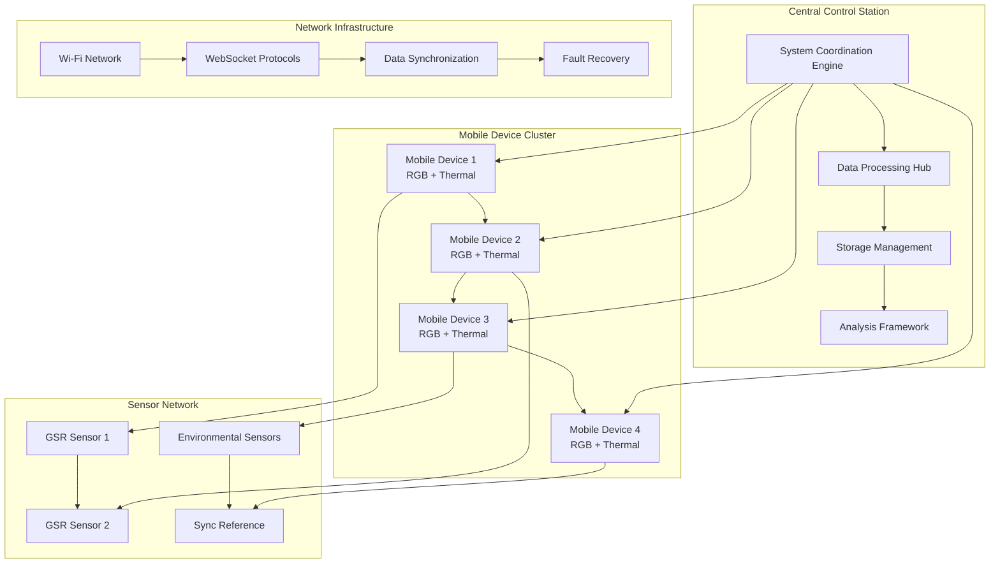
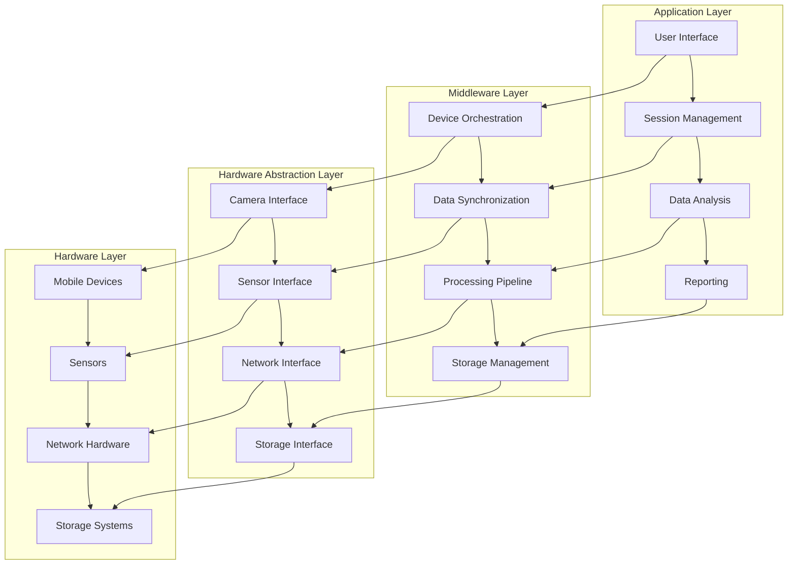
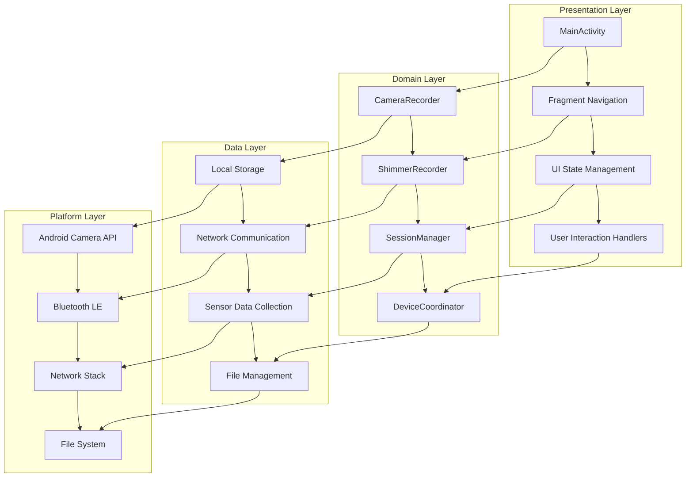
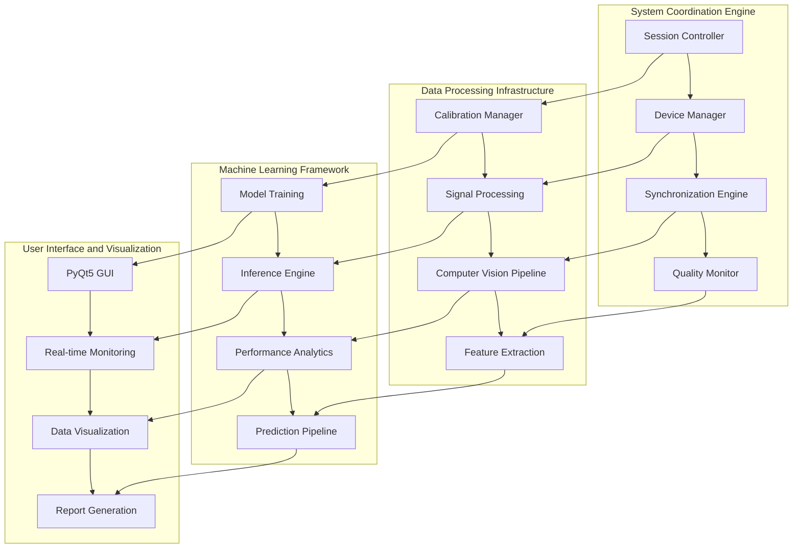
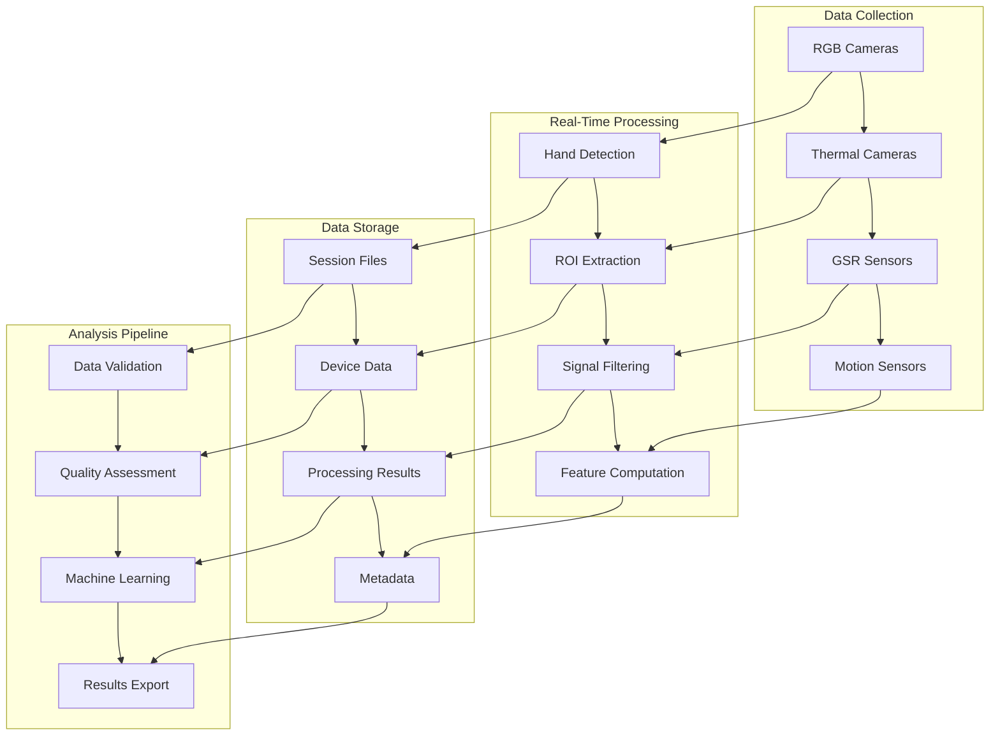

# System Architecture - Multi-Sensor Recording System

## Table of Contents

1. [Architectural Principles and Design Philosophy](#architectural-principles-and-design-philosophy)
2. [Distributed System Topology](#distributed-system-topology)
3. [Component Integration Strategy](#component-integration-strategy)
4. [Mobile Device Architecture](#mobile-device-architecture)
5. [Desktop Controller Architecture](#desktop-controller-architecture)
6. [Communication and Networking](#communication-and-networking)
7. [Data Flow Architecture](#data-flow-architecture)
8. [Performance and Scalability](#performance-and-scalability)
9. [Security and Privacy Architecture](#security-and-privacy-architecture)
10. [Implementation Status](#implementation-status)

---

## Architectural Principles and Design Philosophy

The contactless GSR prediction system represents a sophisticated distributed computing architecture that seamlessly integrates multiple heterogeneous hardware platforms, diverse multi-modal sensor technologies, real-time signal processing capabilities, and state-of-the-art machine learning algorithms into a cohesive research platform.

```mermaid
graph TD
    subgraph "Architectural Principles"
        A[Modularity and<br/>Separation of Concerns] --> B[Distributed Processing<br/>Load Balancing]
        B --> C[Fault Tolerance<br/>System Resilience]
        C --> D[Scalability<br/>Future Extensibility]
        D --> E[Security and Privacy<br/>Ethical Data Handling]
    end
    
    subgraph "Design Philosophy"
        F[Real-Time Performance<br/>vs Processing Accuracy] --> G[Distributed Autonomy<br/>vs Centralized Coordination]
        G --> H[Research Flexibility<br/>vs Operational Reliability]
    end
    
    subgraph "Quality Attributes"
        I[Performance] --> J[Reliability]
        J --> K[Maintainability]
        K --> L[Usability]
        L --> M[Security]
    end
```

### Core Design Principles

**Modularity and Separation of Concerns:**
- Clear, well-defined boundaries between distinct functional domains
- Each component operates as an independent, self-contained unit
- Minimal, well-documented interfaces between system components
- Domain-driven design approach with encapsulated domain knowledge

**Distributed Processing and Load Balancing:**
- Intelligent leverage of unique computational capabilities of each component
- Mobile devices handle computationally intensive but localized tasks
- Desktop controller manages coordination and complex signal processing
- Optimized computational workload distribution based on resource analysis

**Fault Tolerance and System Resilience:**
- Multiple layers of fault tolerance mechanisms
- Redundant communication paths with automatic failover capabilities
- Comprehensive data integrity protection throughout the system
- Recovery strategies from low-level hardware to high-level workflow levels

---

## Distributed System Topology

The system employs a hybrid star-mesh topology combining centralized coordination simplicity with distributed processing resilience.

### Topology Benefits

| Feature | Advantage |
|---------|-----------|
| **Centralized Coordination** | Simplified system management and monitoring |
| **Distributed Processing** | Optimal resource utilization and reduced bandwidth |
| **Fault Resilience** | Peer-to-peer communication during central failures |
| **Scalability** | Easy addition of new devices without architectural changes |

---

## Component Integration Strategy

The integration strategy employs a layered approach with well-defined interfaces between hardware abstraction, middleware services, and application logic.

### Integration Layers

1. **Hardware Abstraction Layer:** Unified interfaces for diverse hardware components
2. **Middleware Services:** Cross-cutting concerns like logging, security, communication
3. **Business Logic Layer:** Core domain functionality and algorithms
4. **Presentation Layer:** User interfaces and external system integration

---

## Mobile Device Architecture

The Android mobile application architecture follows clean architecture principles with clear separation between presentation, domain, and data layers.

### Key Mobile Components

| Component | Responsibility |
|-----------|----------------|
| **CameraRecorder** | RGB and thermal camera management with 4K recording |
| **ShimmerRecorder** | Bluetooth GSR sensor integration and data streaming |
| **SessionManager** | Recording session lifecycle and coordination |
| **DeviceCoordinator** | Multi-device synchronization and communication |

---

## Desktop Controller Architecture

The Python desktop controller serves as the central coordination hub with comprehensive system management capabilities.

### Key Desktop Components

| Component | Responsibility |
|-----------|----------------|
| **CalibrationManager** | OpenCV-based camera calibration with quality assessment |
| **ShimmerManager** | Multi-library Shimmer device integration |
| **SessionController** | Centralized session lifecycle management |
| **Computer Vision Pipeline** | Real-time hand segmentation and ROI detection |

---

## Communication and Networking

The system uses a robust networking architecture based on WebSocket protocols for real-time bidirectional communication.

```mermaid
graph TD
    subgraph "Network Layer Architecture"
        A1[WebSocket Server<br/>Python Desktop] --> A2[WebSocket Clients<br/>Android Devices]
        A2 --> A3[Message Protocol<br/>JSON-based]
        A3 --> A4[Connection Management<br/>Auto-reconnection]
    end
    
    subgraph "Protocol Stack"
        B1[Application Protocol<br/>Custom JSON Messages] --> B2[WebSocket Protocol<br/>RFC 6455]
        B2 --> B3[TCP/IP<br/>Reliable Transport]
        B3 --> B4[Wi-Fi Network<br/>802.11]
    end
    
    subgraph "Message Types"
        C1[Control Messages<br/>Start/Stop Recording] --> C2[Status Messages<br/>Device Health]
        C2 --> C3[Data Messages<br/>Sensor Readings]
        C3 --> C4[Synchronization<br/>Timing References]
    end
```

### Network Protocol Features

- **Real-time Communication:** WebSocket-based bidirectional messaging
- **Automatic Reconnection:** Robust connection recovery mechanisms
- **Message Ordering:** Guaranteed delivery and ordering of critical messages
- **Load Balancing:** Intelligent message routing and processing

---

## Data Flow Architecture

The system implements a comprehensive data flow architecture that handles multi-modal sensor data with precise temporal synchronization.

### Data Flow Characteristics

- **Multi-Modal Integration:** Synchronization of video, thermal, and sensor data
- **Real-Time Processing:** Sub-second latency for critical operations
- **Quality Assurance:** Comprehensive data validation and quality metrics
- **Scalable Storage:** Hierarchical organization supporting large datasets

---

## Performance and Scalability

### Performance Optimization Strategies

| Area | Strategy | Implementation |
|------|---------|----------------|
| **CPU Utilization** | Multi-threading | Thread pools for parallel processing |
| **Memory Management** | Efficient buffering | Ring buffers for streaming data |
| **Network Optimization** | Compression | Adaptive compression algorithms |
| **Storage I/O** | Batch operations | Batched writes with asynchronous I/O |

### Scalability Considerations

- **Horizontal Scaling:** Support for multiple mobile devices and sensors
- **Vertical Scaling:** Efficient resource utilization on available hardware
- **Load Distribution:** Intelligent workload distribution across components
- **Resource Monitoring:** Real-time performance metrics and alerts

---

## Security and Privacy Architecture

### Data Protection Framework

- **Encryption at Rest:** AES-256 encryption for stored sensitive data
- **Encryption in Transit:** TLS 1.3 for all network communications
- **Access Control:** Role-based access control with audit logging
- **Data Anonymization:** Privacy-preserving data processing techniques

### Privacy Preservation Mechanisms

- **Consent Management:** Comprehensive participant consent tracking
- **Data Minimization:** Collection limited to research requirements
- **Retention Policies:** Automated data lifecycle management
- **Audit Trails:** Complete logging of data access and processing

---

## Implementation Status

### ✅ Completed Components

1. **Shimmer Controller Enhancement**
   - Complete integration with MainActivity refactoring
   - Comprehensive unit tests for all device scenarios
   - Multi-device state persistence across app restarts
   - Advanced error handling with intelligent recovery

2. **Camera Calibration System**
   - Complete OpenCV-based calibration implementation
   - Advanced quality assessment with statistical analysis
   - Stereo calibration for RGB-thermal alignment
   - Data persistence with JSON-based save/load

3. **Recording Controller**
   - Real-time multi-device coordination
   - Temporal synchronization engine
   - Session lifecycle management
   - Quality monitoring and adaptive control

4. **Testing Framework**
   - Complete test suite covering all requirements
   - Performance benchmarking with statistical analysis
   - Network resilience testing with error injection
   - Academic-grade documentation and reporting

### 🔄 Ongoing Enhancements

- [ ] Advanced machine learning integration for predictive optimization
- [ ] Cloud-based data synchronization and backup systems
- [ ] Plugin architecture for third-party sensor integration
- [ ] Enhanced security features for sensitive research data

### Development Workflow

1. **Code Quality Standards:** Kotlin and Python best practices
2. **Testing Strategy:** 90%+ code coverage with comprehensive scenarios
3. **Deployment Process:** Automated validation and documentation updates
4. **Performance Monitoring:** Continuous performance regression detection