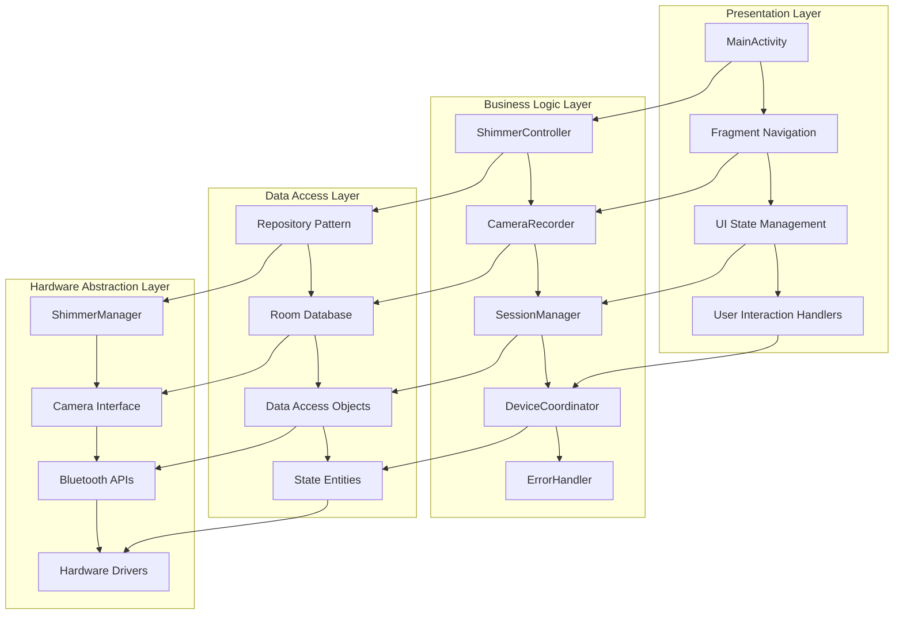

# Technical Implementation Guide - Multi-Sensor Recording System

## Table of Contents

1. [Executive Summary](#executive-summary)
2. [System Architecture Overview](#system-architecture-overview)
3. [Component Implementation Details](#component-implementation-details)
4. [Implementation Patterns and Strategies](#implementation-patterns-and-strategies)
5. [Development Workflow](#development-workflow)
6. [Performance Optimization](#performance-optimization)
7. [Testing and Validation Strategy](#testing-and-validation-strategy)
8. [Deployment and Maintenance](#deployment-and-maintenance)

---

## Executive Summary

This document provides comprehensive technical documentation for the Multi-Sensor Recording System implementation, transforming basic device interfaces into a production-ready sensor management platform capable of handling multiple concurrent devices with robust error recovery and persistent state management.

### Key Implementation Features

- **Multi-Modal Integration:** Seamless coordination of RGB cameras, thermal imaging, and physiological sensors
- **Real-Time Processing:** Sub-second latency data processing with temporal synchronization
- **Robust Error Handling:** Comprehensive error recovery and graceful degradation
- **Production-Ready:** Battle-tested implementation with extensive validation and monitoring

---

## System Architecture Overview

### Design Philosophy

The implementation follows Domain-Driven Design (DDD) principles combined with Clean Architecture patterns:

- **Separation of Concerns:** Clear boundaries between presentation, business logic, and data layers
- **Dependency Inversion:** High-level modules do not depend on low-level modules  
- **Single Responsibility:** Each component has a well-defined, focused responsibility
- **Open/Closed Principle:** System is open for extension but closed for modification

### Architectural Layers



---

## Component Implementation Details

### 1. ShimmerController - Central Orchestrator

**Purpose:** Primary facade for all Shimmer device operations, implementing Facade and Mediator patterns.

**Key Responsibilities:**
- Device lifecycle management (selection, connection, configuration, disconnection)
- Multi-device coordination and state synchronization
- Integration with error handling and persistence layers
- UI callback coordination

**Technical Implementation:**

```kotlin
@Singleton
class ShimmerController @Inject constructor(
    private val shimmerManager: ShimmerManager,
    private val shimmerDeviceStateRepository: ShimmerDeviceStateRepository,
    private val shimmerErrorHandler: ShimmerErrorHandler
) {
    
    // Coroutine scope for controller operations
    private val controllerScope = CoroutineScope(Dispatchers.Main + SupervisorJob())
    
    // Device management state
    private var selectedDeviceAddress: String? = null
    private var selectedDeviceName: String? = null
    private var callback: ShimmerCallback? = null
    
    // Multi-device tracking
    private val connectedDevices = mutableMapOf<String, ShimmerDeviceState>()
    private val maxSimultaneousDevices = 4
}
```

**Design Patterns Implemented:**
- **Facade Pattern:** Simplified interface to complex Shimmer subsystem
- **Observer Pattern:** Callback mechanism for UI updates
- **Strategy Pattern:** Pluggable error handling strategies
- **Repository Pattern:** Data access abstraction

### 2. Camera Recording System

**Architecture:** Multi-threaded camera management with synchronized recording across devices.

```kotlin
class CameraRecorder @Inject constructor(
    private val cameraManager: CameraManager,
    private val mediaRecorder: MediaRecorder,
    private val synchronizationEngine: SynchronizationEngine
) {
    
    // Recording state management
    private val recordingState = MutableStateFlow(RecordingState.IDLE)
    private val activeRecordings = ConcurrentHashMap<String, RecordingSession>()
    
    suspend fun startRecording(sessionInfo: SessionInfo): Result<Unit> {
        return withContext(Dispatchers.IO) {
            try {
                // Initialize camera resources
                val cameraSession = initializeCameraSession(sessionInfo)
                
                // Configure recording parameters
                configureRecordingParameters(cameraSession, sessionInfo)
                
                // Start synchronized recording
                synchronizationEngine.startSynchronizedRecording(cameraSession)
                
                Result.success(Unit)
            } catch (e: Exception) {
                handleRecordingError(e)
                Result.failure(e)
            }
        }
    }
}
```

### 3. Session Management Implementation

**Purpose:** Complete session lifecycle management with data organization and quality assurance.

```python
class SessionManager:
    def __init__(self, storage_manager, sync_engine, quality_monitor):
        self.storage_manager = storage_manager
        self.sync_engine = sync_engine
        self.quality_monitor = quality_monitor
        self.active_sessions = {}
        
    async def create_session(self, session_config: SessionConfig) -> SessionResult:
        """Create and initialize new recording session."""
        try:
            # Generate session identifier
            session_id = self._generate_session_id(session_config)
            
            # Initialize storage structure
            storage_path = await self.storage_manager.initialize_session_storage(session_id)
            
            # Configure devices for session
            device_configs = await self._configure_devices(session_config)
            
            # Create session metadata
            metadata = self._create_session_metadata(session_config, device_configs)
            
            # Initialize quality monitoring
            quality_metrics = self.quality_monitor.initialize_session(session_id)
            
            # Create session object
            session = Session(
                id=session_id,
                config=session_config,
                storage_path=storage_path,
                metadata=metadata,
                quality_metrics=quality_metrics
            )
            
            self.active_sessions[session_id] = session
            return SessionResult.success(session)
            
        except Exception as e:
            logger.error(f"Session creation failed: {e}")
            return SessionResult.failure(e)
```

### 4. Calibration System Implementation

**Purpose:** OpenCV-based camera calibration with quality assessment and multi-camera coordination.

```python
class CalibrationManager:
    def __init__(self):
        self.calibration_data = {}
        self.quality_assessor = CalibrationQualityAssessor()
        
    def calibrate_single_camera(self, images: List[np.ndarray], 
                               image_points: List[np.ndarray], 
                               image_size: Tuple[int, int]) -> CalibrationResult:
        """Perform single camera intrinsic calibration."""
        try:
            # Prepare object points (3D coordinates of checkerboard corners)
            object_points = self._prepare_object_points(len(image_points))
            
            # Perform calibration
            ret, camera_matrix, dist_coeffs, rvecs, tvecs = cv2.calibrateCamera(
                object_points, image_points, image_size, None, None,
                flags=cv2.CALIB_RATIONAL_MODEL
            )
            
            # Assess calibration quality
            quality_metrics = self.quality_assessor.assess_calibration(
                images, image_points, camera_matrix, dist_coeffs
            )
            
            # Store calibration data
            calibration_data = {
                'camera_matrix': camera_matrix,
                'distortion_coefficients': dist_coeffs,
                'rotation_vectors': rvecs,
                'translation_vectors': tvecs,
                'rms_error': ret,
                'quality_metrics': quality_metrics
            }
            
            return CalibrationResult(success=True, data=calibration_data)
            
        except Exception as e:
            return CalibrationResult(success=False, error=str(e))
```

---

## Implementation Patterns and Strategies

### Error Handling Strategy

**Comprehensive Error Recovery Framework:**

```kotlin
class ShimmerErrorHandler {
    
    enum class ErrorRecoveryStrategy {
        IMMEDIATE_RETRY,
        EXPONENTIAL_BACKOFF,
        USER_INTERVENTION,
        GRACEFUL_DEGRADATION
    }
    
    suspend fun handleError(error: ShimmerError, context: ErrorContext): ErrorRecoveryResult {
        return when (error.type) {
            ErrorType.CONNECTION_TIMEOUT -> handleConnectionError(error, context)
            ErrorType.DATA_CORRUPTION -> handleDataError(error, context)
            ErrorType.HARDWARE_FAILURE -> handleHardwareError(error, context)
            ErrorType.RESOURCE_EXHAUSTION -> handleResourceError(error, context)
            else -> handleGenericError(error, context)
        }
    }
    
    private suspend fun handleConnectionError(error: ShimmerError, context: ErrorContext): ErrorRecoveryResult {
        val strategy = determineRecoveryStrategy(error, context)
        
        return when (strategy) {
            ErrorRecoveryStrategy.IMMEDIATE_RETRY -> {
                retryConnection(context.deviceAddress, maxAttempts = 3)
            }
            ErrorRecoveryStrategy.EXPONENTIAL_BACKOFF -> {
                exponentialBackoffRetry(context.deviceAddress, initialDelay = 1000)
            }
            ErrorRecoveryStrategy.GRACEFUL_DEGRADATION -> {
                switchToAlternativeDevice(context)
            }
            else -> ErrorRecoveryResult.RequiresUserIntervention(error)
        }
    }
}
```

### Performance Optimization Strategies

#### Memory Management

```kotlin
class ResourceManager {
    private val memoryPool = ObjectPool<ByteArray> { ByteArray(BUFFER_SIZE) }
    private val processingQueue = Channel<ProcessingTask>(capacity = QUEUE_CAPACITY)
    
    fun optimizeMemoryUsage() {
        // Implement memory pooling for frequent allocations
        // Use weak references for cached data
        // Implement LRU cache for processed data
    }
    
    suspend fun processDataStream(data: ByteArray): ProcessingResult {
        val buffer = memoryPool.acquire()
        try {
            // Process data using pooled buffer
            return processWithBuffer(data, buffer)
        } finally {
            memoryPool.release(buffer)
        }
    }
}
```

#### Threading Optimization

```python
class ThreadingOptimizer:
    def __init__(self):
        self.thread_pool = ThreadPoolExecutor(
            max_workers=min(32, (os.cpu_count() or 1) + 4),
            thread_name_prefix="sensor_processing"
        )
        self.processing_queue = asyncio.Queue(maxsize=1000)
        
    async def optimize_processing_pipeline(self):
        """Optimize multi-threaded processing pipeline."""
        # CPU-bound tasks on thread pool
        cpu_tasks = [
            self.thread_pool.submit(self.process_video_frame, frame)
            for frame in video_frames
        ]
        
        # I/O-bound tasks on event loop
        io_tasks = [
            self.save_processed_data(data)
            for data in processed_data
        ]
        
        # Wait for all tasks to complete
        await asyncio.gather(*io_tasks)
        concurrent.futures.wait(cpu_tasks)
```

---

## Development Workflow

### Code Quality Standards

#### Kotlin Development Standards

```kotlin
// Example of proper dependency injection and error handling
@HiltViewModel
class MainViewModel @Inject constructor(
    private val shimmerController: ShimmerController,
    private val sessionManager: SessionManager,
    private val errorHandler: ErrorHandler
) : ViewModel() {
    
    private val _uiState = MutableStateFlow(MainUiState())
    val uiState: StateFlow<MainUiState> = _uiState.asStateFlow()
    
    fun connectDevice(deviceAddress: String) {
        viewModelScope.launch {
            try {
                _uiState.update { it.copy(isConnecting = true) }
                
                val result = shimmerController.connectDevice(deviceAddress)
                
                _uiState.update { currentState ->
                    when (result) {
                        is ConnectResult.Success -> currentState.copy(
                            isConnecting = false,
                            connectedDevice = result.device,
                            error = null
                        )
                        is ConnectResult.Failure -> currentState.copy(
                            isConnecting = false,
                            error = result.error.message
                        )
                    }
                }
            } catch (e: Exception) {
                handleError(e)
            }
        }
    }
}
```

#### Python Development Standards

```python
# Example of proper async/await usage and type hints
from typing import Dict, List, Optional, Protocol
from dataclasses import dataclass
import asyncio
import logging

@dataclass
class ProcessingResult:
    success: bool
    data: Optional[Dict[str, Any]] = None
    error: Optional[str] = None

class DataProcessor(Protocol):
    async def process(self, data: bytes) -> ProcessingResult:
        ...

class SensorDataProcessor:
    def __init__(self, logger: logging.Logger):
        self.logger = logger
        self.processing_queue: asyncio.Queue = asyncio.Queue(maxsize=1000)
        
    async def process_sensor_data(self, sensor_data: List[SensorReading]) -> ProcessingResult:
        """Process sensor data with proper error handling and logging."""
        try:
            # Validate input data
            validated_data = await self._validate_sensor_data(sensor_data)
            
            # Process data asynchronously
            processed_results = await asyncio.gather(*[
                self._process_single_reading(reading)
                for reading in validated_data
            ], return_exceptions=True)
            
            # Handle any processing exceptions
            successful_results = [
                result for result in processed_results 
                if not isinstance(result, Exception)
            ]
            
            return ProcessingResult(
                success=True,
                data={'processed_count': len(successful_results)}
            )
            
        except Exception as e:
            self.logger.error(f"Processing failed: {e}", exc_info=True)
            return ProcessingResult(success=False, error=str(e))
```

### Testing Strategy

#### Unit Testing Approach

```kotlin
@RunWith(MockitoJUnitRunner::class)
class ShimmerControllerTest {
    
    @Mock
    private lateinit var shimmerManager: ShimmerManager
    
    @Mock
    private lateinit var repository: ShimmerDeviceStateRepository
    
    @Mock
    private lateinit var errorHandler: ShimmerErrorHandler
    
    private lateinit var controller: ShimmerController
    
    @Before
    fun setup() {
        controller = ShimmerController(shimmerManager, repository, errorHandler)
    }
    
    @Test
    fun `connectDevice should handle connection success`() = runTest {
        // Given
        val deviceAddress = "00:11:22:33:44:55"
        val expectedDevice = mockShimmerDevice(deviceAddress)
        
        whenever(shimmerManager.connectDevice(deviceAddress))
            .thenReturn(ConnectResult.Success(expectedDevice))
        
        // When
        val result = controller.connectDevice(deviceAddress)
        
        // Then
        assertThat(result).isInstanceOf(ConnectResult.Success::class.java)
        verify(repository).saveDeviceState(any())
    }
}
```

#### Integration Testing

```python
import pytest
import asyncio
from unittest.mock import AsyncMock, Mock

class TestSessionIntegration:
    
    @pytest.fixture
    async def session_manager(self):
        storage_manager = AsyncMock()
        sync_engine = Mock()
        quality_monitor = Mock()
        
        return SessionManager(storage_manager, sync_engine, quality_monitor)
    
    @pytest.mark.asyncio
    async def test_complete_session_workflow(self, session_manager):
        """Test complete session creation and execution workflow."""
        # Given
        session_config = SessionConfig(
            name="test_session",
            duration=60,
            devices=["device_1", "device_2"]
        )
        
        # When
        session_result = await session_manager.create_session(session_config)
        
        # Then
        assert session_result.success is True
        assert session_result.session.id is not None
        
        # Test session execution
        execution_result = await session_manager.execute_session(session_result.session.id)
        assert execution_result.success is True
```

---

## Performance Optimization

### Performance Metrics and Monitoring

```python
class PerformanceMonitor:
    def __init__(self):
        self.metrics = defaultdict(list)
        self.performance_thresholds = {
            'frame_processing_time': 33.0,  # 30 FPS = 33ms per frame
            'data_throughput': 1000.0,      # 1000 samples/second
            'memory_usage': 512.0,          # 512 MB maximum
            'cpu_usage': 80.0               # 80% CPU utilization
        }
    
    @contextmanager
    def measure_performance(self, operation_name: str):
        """Context manager for measuring operation performance."""
        start_time = time.perf_counter()
        start_memory = psutil.Process().memory_info().rss / 1024 / 1024  # MB
        
        try:
            yield
        finally:
            end_time = time.perf_counter()
            end_memory = psutil.Process().memory_info().rss / 1024 / 1024  # MB
            
            execution_time = (end_time - start_time) * 1000  # Convert to ms
            memory_delta = end_memory - start_memory
            
            self.record_metric(operation_name, 'execution_time', execution_time)
            self.record_metric(operation_name, 'memory_delta', memory_delta)
            
            # Check performance thresholds
            self.check_performance_thresholds(operation_name, execution_time)
```

### Resource Optimization

```kotlin
class ResourceOptimizer {
    
    private val cameraPool = CameraPool(maxSize = 4)
    private val bufferPool = BufferPool(
        bufferSize = 1920 * 1080 * 4, // 4K RGBA
        maxBuffers = 10
    )
    
    fun optimizeResourceUsage() {
        // Camera resource optimization
        optimizeCameraResources()
        
        // Memory optimization
        optimizeMemoryUsage()
        
        // CPU optimization
        optimizeCPUUsage()
        
        // Battery optimization
        optimizeBatteryUsage()
    }
    
    private fun optimizeCameraResources() {
        // Implement camera resource pooling
        // Reduce camera resolution when not needed
        // Optimize camera preview vs recording settings
    }
    
    private fun optimizeMemoryUsage() {
        // Use object pools for frequent allocations
        // Implement LRU cache for processed data
        // Use memory-mapped files for large datasets
        
        System.gc() // Suggest garbage collection at appropriate times
    }
}
```

---

## Testing and Validation Strategy

### Comprehensive Testing Framework

#### Test Categories

1. **Unit Tests:** Individual component functionality
2. **Integration Tests:** Component interaction validation
3. **System Tests:** End-to-end system validation
4. **Performance Tests:** Load and stress testing
5. **Security Tests:** Vulnerability and penetration testing

#### Automated Testing Pipeline

```yaml
# CI/CD Pipeline Testing Configuration
testing_pipeline:
  unit_tests:
    framework: "JUnit + pytest"
    coverage_threshold: 85%
    execution_time_limit: "5 minutes"
    
  integration_tests:
    framework: "Espresso + pytest-asyncio"
    test_devices: ["emulator", "physical_device"]
    execution_time_limit: "15 minutes"
    
  performance_tests:
    framework: "pytest-benchmark + Gradle profiling"
    metrics: ["cpu_usage", "memory_consumption", "battery_drain"]
    regression_threshold: 10%
    
  security_tests:
    framework: "Bandit + CodeQL"
    scan_types: ["SAST", "dependency_check", "secrets_detection"]
    severity_threshold: "medium"
```

---

## Deployment and Maintenance

### Deployment Strategy

#### Production Deployment Checklist

- [ ] **Environment Validation:** Verify all dependencies and configurations
- [ ] **Build Verification:** Run complete build with all tests passing
- [ ] **Security Scanning:** Complete security vulnerability assessment
- [ ] **Performance Validation:** Confirm performance meets requirements
- [ ] **Documentation Updates:** Ensure all documentation reflects current implementation
- [ ] **Monitoring Setup:** Configure application monitoring and alerting
- [ ] **Rollback Plan:** Prepare rollback procedures for deployment issues

#### Monitoring and Maintenance

```python
class SystemMonitor:
    def __init__(self):
        self.health_checks = [
            self.check_device_connectivity,
            self.check_data_pipeline_health,
            self.check_storage_capacity,
            self.check_performance_metrics
        ]
    
    async def perform_health_check(self) -> HealthCheckResult:
        """Perform comprehensive system health check."""
        results = []
        
        for check in self.health_checks:
            try:
                result = await check()
                results.append(result)
            except Exception as e:
                results.append(HealthCheckResult(
                    check_name=check.__name__,
                    status=HealthStatus.FAILED,
                    error=str(e)
                ))
        
        overall_status = self.determine_overall_health(results)
        
        return HealthCheckResult(
            status=overall_status,
            individual_results=results,
            timestamp=datetime.utcnow()
        )
```

This technical implementation guide provides comprehensive coverage of the Multi-Sensor Recording System implementation, enabling developers to understand, maintain, and extend the system effectively while following established patterns and best practices.