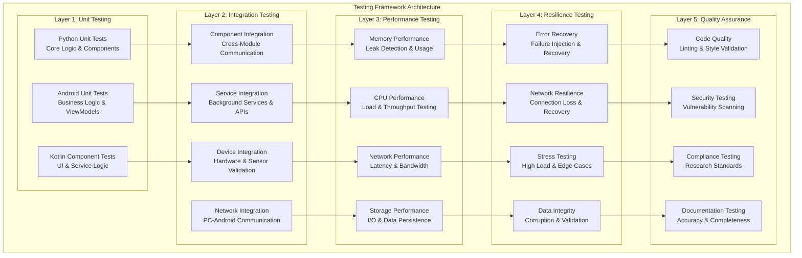
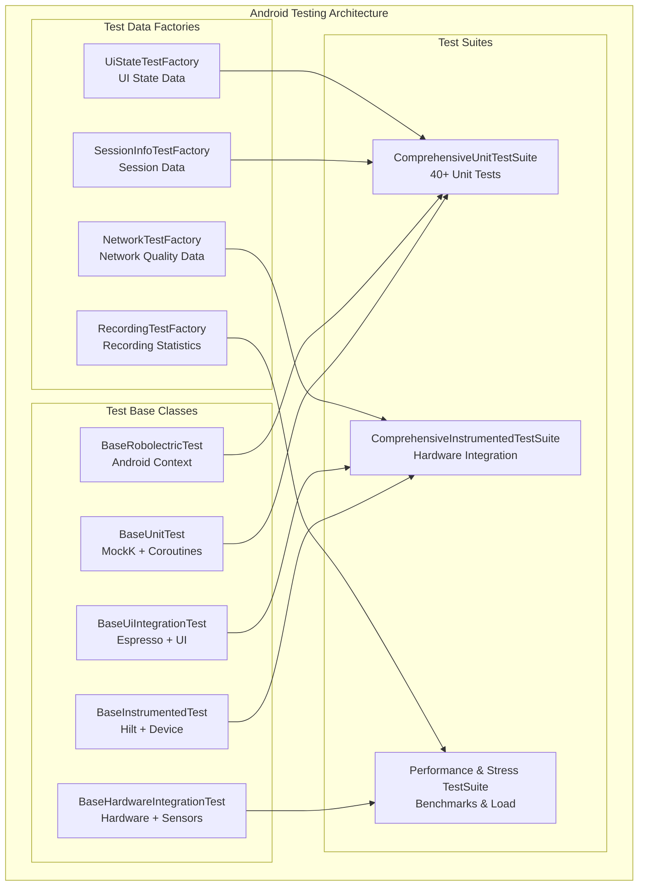
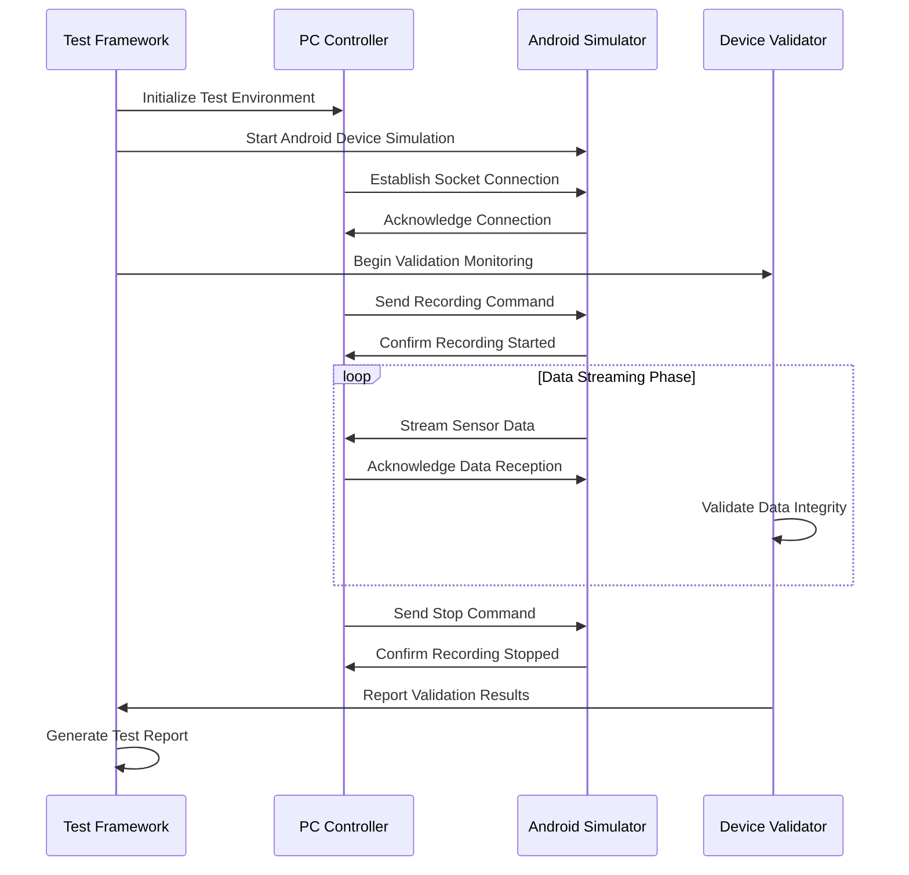
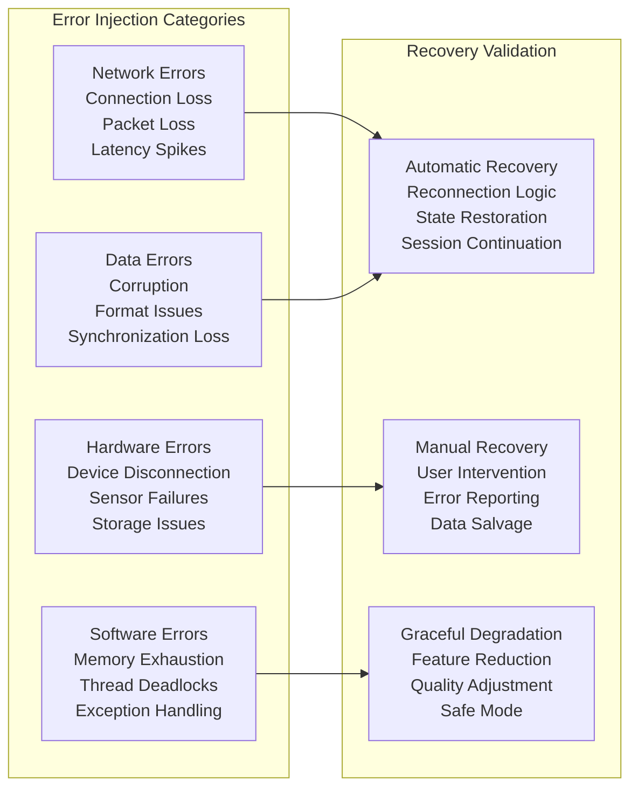

# Testing and Quality Assurance Framework - Technical Deep-Dive

## Table of Contents

- [Overview](#overview)
- [Architecture Overview](#architecture-overview)
- [Testing Strategy by Component](#testing-strategy-by-component)
  - [Python Application Testing](#python-application-testing)
  - [Android Application Testing](#android-application-testing)
- [Cross-Platform Integration Testing](#cross-platform-integration-testing)
  - [PC-Android Communication Validation](#pc-android-communication-validation)
  - [Multi-Device Coordination Testing](#multi-device-coordination-testing)
- [Performance and Resilience Testing](#performance-and-resilience-testing)
  - [Performance Validation Framework](#performance-validation-framework)
  - [Resilience Testing Framework](#resilience-testing-framework)
- [Quality Assurance Processes](#quality-assurance-processes)
  - [Code Quality Standards](#code-quality-standards)
  - [Continuous Integration Integration](#continuous-integration-integration)
  - [Research-Grade Reliability Standards](#research-grade-reliability-standards)
- [Testing Automation and Orchestration](#testing-automation-and-orchestration)
  - [Automated Test Execution](#automated-test-execution)
  - [Test Data Management](#test-data-management)
- [Cross-Platform Integration Testing](#cross-platform-integration-testing-1)
  - [PC-Android Communication Testing](#pc-android-communication-testing)
- [Integration with Development Workflow](#integration-with-development-workflow)
  - [Development Testing Workflow](#development-testing-workflow)
  - [Testing Documentation Standards](#testing-documentation-standards)

## Overview

The Multi-Sensor Recording System implements a comprehensive, multi-layered testing strategy designed to ensure research-grade reliability across both Python and Android components. This framework provides systematic validation of all system aspects, from individual component functionality to complete end-to-end workflows under various stress conditions.

## Architecture Overview

The testing framework employs a hierarchical architecture that validates system reliability at multiple levels:



## Testing Strategy by Component

### Python Application Testing

#### Core Testing Infrastructure

The Python testing framework utilizes pytest with comprehensive configuration for scientific computing requirements:

**Configuration Features:**
- **Test Discovery**: Automatic detection of test files using patterns `test_*.py` and `*_test.py`
- **Coverage Requirements**: Minimum 50% code coverage with detailed reporting
- **Parallel Execution**: Support for distributed testing using pytest-xdist
- **Performance Monitoring**: Integration with pytest-benchmark for performance regression detection
- **Quality Validation**: Integration with black, flake8, mypy for code quality assurance

**Test Categories:**

1. **Unit Tests** (`PythonApp/src/tests/test_unit_core.py`)
   - Individual component testing without external dependencies
   - Calibration algorithm validation with mathematical precision verification
   - Data processing pipeline validation with synthetic data sets
   - Network protocol parsing and message validation

2. **Integration Tests** (`PythonApp/test_integration_logging.py`)
   - Cross-component communication validation
   - Logging system integration with log analysis and validation
   - Configuration management across different system components
   - Database integration and session persistence

3. **Hardware Integration** (`PythonApp/test_hardware_sensor_simulation.py`)
   - Shimmer sensor integration with realistic data simulation
   - USB device management and connection handling
   - Camera calibration system with OpenCV integration
   - Multi-device coordination and synchronization

4. **Performance Testing** (`PythonApp/test_enhanced_stress_testing.py`)
   - Memory usage monitoring during extended recording sessions
   - CPU performance validation under high sensor data throughput
   - Network throughput testing with bandwidth optimization
   - Storage I/O performance with large file operations

5. **Resilience Testing** (`PythonApp/test_network_resilience.py`)
   - Network failure simulation and recovery validation
   - Device disconnection and reconnection testing
   - Data corruption detection and recovery mechanisms
   - Error injection testing for robustness validation

#### Advanced Testing Capabilities

**Comprehensive Recording Session Testing:**
```python
# Example from run_complete_test_suite.py
def run_comprehensive_test(duration=60, devices=2, stress_mode=False):
    """
    Validates complete PC-Android recording workflow with:
    - Multi-device coordination
    - Real-time data streaming
    - Error recovery mechanisms
    - Performance monitoring
    """
```

**Key Features:**
- **Multi-Device Simulation**: Tests with up to 8 simulated Android devices
- **Realistic Data Generation**: Physiologically accurate sensor data patterns
- **Error Injection**: Systematic failure simulation for robustness testing
- **Performance Monitoring**: Real-time resource usage tracking
- **Network Simulation**: Configurable latency and packet loss scenarios

### Android Application Testing

#### Modern Testing Architecture

The Android testing framework employs a hierarchical structure with modern testing tools:

**Base Test Classes:**
- **BaseUnitTest**: Foundation for pure unit tests without Android dependencies
- **BaseRobolectricTest**: Android component tests requiring context
- **BaseInstrumentedTest**: Hardware integration tests with real device dependencies
- **BaseUiIntegrationTest**: UI integration tests with Espresso framework
- **BaseHardwareIntegrationTest**: Hardware device and sensor testing

**Testing Framework Components:**



#### Testing Categories

1. **Unit Tests** (`src/test/java/`)
   - **Session Management**: Business logic validation for recording sessions
   - **UI State Management**: ViewModel testing with MockK and Coroutines
   - **Network Components**: Connection handling and protocol validation
   - **Recording Logic**: Device control and error handling validation

2. **Instrumented Tests** (`src/androidTest/java/`)
   - **UI Integration**: Activity lifecycle and user interaction flows
   - **Service Integration**: Background service testing and lifecycle management
   - **Hardware Integration**: Real device communication and sensor validation
   - **Storage Integration**: File operations and data persistence validation

3. **Performance Testing**
   - **Memory Analysis**: Heap usage tracking and memory leak detection
   - **CPU Performance**: Load testing with concurrent operations
   - **UI Responsiveness**: Animation and interaction performance validation
   - **Battery Impact**: Power consumption monitoring during extended operation

4. **Stress Testing**
   - **High Load Scenarios**: Multiple concurrent recording sessions
   - **Resource Constraints**: Low memory and storage testing
   - **Network Stress**: High latency and bandwidth limitations
   - **Device Limits**: Maximum sensor data throughput validation

## Cross-Platform Integration Testing

### PC-Android Communication Validation

The framework includes comprehensive testing of the distributed architecture:



### Multi-Device Coordination Testing

**Scalability Validation:**
- **Device Count Testing**: Validation with 2-8 simultaneous Android devices
- **Synchronization Accuracy**: Microsecond precision timing validation
- **Resource Scaling**: Memory and CPU usage with increasing device count
- **Network Bandwidth**: Throughput optimization with multiple data streams

**Error Recovery Testing:**
- **Device Disconnection**: Graceful handling of unexpected disconnections
- **Network Failures**: Automatic reconnection and session continuation
- **Data Corruption**: Detection and recovery mechanisms
- **Resource Exhaustion**: Behavior under memory and storage constraints

## Performance and Resilience Testing

### Performance Validation Framework

**Benchmarking Standards:**
- **Response Time**: 95th percentile response times under 500ms
- **Memory Usage**: Maximum heap usage under 500MB during operation
- **CPU Utilization**: Average CPU usage under 50% during recording
- **Network Throughput**: Minimum 10Mbps sustained throughput

**Performance Test Categories:**

1. **Baseline Performance Testing**
   - Single device operation benchmarks
   - Component-level performance validation
   - Memory usage patterns during normal operation
   - Network communication efficiency

2. **Load Testing**
   - Multiple device concurrent operation
   - High-frequency sensor data streaming
   - Extended recording session validation
   - Storage I/O performance under load

3. **Stress Testing**
   - Maximum device count validation
   - Resource exhaustion scenarios
   - Network bandwidth limitations
   - Storage capacity constraints

### Resilience Testing Framework

**Error Injection Testing:**


**Resilience Test Scenarios:**

1. **Network Resilience**
   - Gradual connection degradation (bandwidth reduction)
   - Intermittent connectivity (connection drops and recovery)
   - High latency environments (satellite or mobile networks)
   - Packet loss scenarios (unreliable network conditions)

2. **Hardware Resilience**
   - USB device hot-plugging and removal
   - Bluetooth connection stability testing
   - Camera disconnection and reconnection
   - Sensor calibration drift and correction

3. **Software Resilience**
   - Memory pressure scenarios
   - Thread synchronization under load
   - Exception handling in critical paths
   - Resource cleanup validation

## Quality Assurance Processes

### Code Quality Standards

**Python Code Quality:**
- **Linting**: flake8 validation for PEP 8 compliance
- **Type Checking**: mypy validation for type safety
- **Code Formatting**: black for consistent code style
- **Security**: bandit for security vulnerability scanning
- **Documentation**: sphinx for API documentation generation

**Android Code Quality:**
- **Linting**: detekt for Kotlin code quality validation
- **Static Analysis**: Android lint for Android-specific issues
- **Code Coverage**: JaCoCo for comprehensive coverage reporting
- **Performance**: Baseline profiles for runtime optimization
- **Security**: ProGuard/R8 for code obfuscation and optimization

### Continuous Integration Integration

**CI/CD Pipeline Integration:**

```yaml
# Example GitHub Actions workflow
testing_pipeline:
  - unit_tests: "Run all unit tests with coverage"
  - integration_tests: "Cross-component validation"
  - performance_tests: "Benchmark validation"
  - security_tests: "Vulnerability scanning"
  - documentation_tests: "Documentation accuracy validation"
```

**Quality Gates:**
- **Coverage Threshold**: Minimum 75% code coverage for new code
- **Performance Threshold**: No more than 10% performance regression
- **Security Threshold**: Zero high-severity security vulnerabilities
- **Documentation Threshold**: 100% public API documentation coverage

### Research-Grade Reliability Standards

**Validation Requirements:**
- **Data Integrity**: Cryptographic checksums for all recorded data
- **Temporal Accuracy**: Microsecond precision synchronization validation
- **Reproducibility**: Deterministic test scenarios for consistent results
- **Compliance**: Research data management standard compliance
- **Audit Trail**: Comprehensive logging for research compliance

**Quality Metrics:**
- **Reliability**: 99.9% uptime during recording sessions
- **Accuracy**: <1ms synchronization error across devices
- **Completeness**: <0.1% data loss during normal operation
- **Consistency**: Identical results across multiple test runs

## Testing Automation and Orchestration

### Automated Test Execution

**Test Suite Orchestration:**

```python
# Comprehensive test suite execution
def run_comprehensive_testing():
    """
    Orchestrates complete testing pipeline:
    1. Unit test validation
    2. Integration test execution
    3. Performance benchmark validation
    4. Resilience testing with error injection
    5. Quality assurance validation
    6. Report generation and analysis
    """
```

**Automation Features:**
- **Scheduled Testing**: Nightly comprehensive test runs
- **Trigger-Based Testing**: Test execution on code changes
- **Performance Monitoring**: Continuous performance regression detection
- **Alert System**: Automated notification for test failures
- **Report Generation**: Automated test report compilation and distribution

### Test Data Management

**Test Data Strategy:**
- **Synthetic Data**: Generated sensor data for consistent testing
- **Recorded Data**: Real sensor data for validation testing
- **Edge Case Data**: Boundary condition testing data
- **Corrupted Data**: Data integrity testing scenarios

**Data Validation:**
- **Format Validation**: File format compliance verification
- **Content Validation**: Data content accuracy verification
- **Metadata Validation**: Session metadata completeness verification
- **Synchronization Validation**: Cross-device timing accuracy verification

## Cross-Platform Integration Testing

### PC-Android Communication Testing

The framework includes sophisticated cross-platform testing capabilities that validate the complete PC-Android ecosystem under realistic conditions.

#### Recording Session Test Framework

**Comprehensive Session Validation:**
```bash
# Quick validation for CI/CD integration
python PythonApp/run_quick_recording_session_test.py

# Comprehensive testing with multiple devices
python PythonApp/run_recording_session_test.py --duration 90 --devices 3 --save-logs

# Stress testing with high device load
python PythonApp/run_recording_session_test.py --stress-test --devices 8 --duration 300

# Error condition and recovery testing
python PythonApp/run_recording_session_test.py --error-simulation --network-issues
```

**Test Capabilities:**
- **Multi-Device Coordination**: Tests synchronized operation across up to 8 Android devices
- **Realistic Sensor Simulation**: Generates physiologically accurate sensor data matching real Shimmer3 characteristics
- **Communication Protocol Validation**: Tests JSON socket communication with proper message formatting
- **Session Lifecycle Testing**: Validates complete recording workflow from initialization to completion

#### Enhanced Android Test Architecture

**Modern Testing Framework Components:**
```kotlin
// Base test classes for consistent testing patterns
class MyComponentTest : BaseUnitTest() {
    @RelaxedMockK
    private lateinit var mockDependency: MyDependency
    
    @InjectMockKs
    private lateinit var component: MyComponent
    
    @Test
    fun `should perform action correctly`() = runTest {
        // Given-When-Then testing pattern
        val input = SessionInfoTestFactory.createActiveSession()
        every { mockDependency.process(any()) } returns expectedResult
        
        val result = component.performAction(input)
        
        assertThat(result).isEqualTo(expectedResult)
        verify { mockDependency.process(input) }
    }
}
```

**Test Organization Structure:**
```
AndroidApp/src/test/java/com/multisensor/recording/
├── testbase/           # Base test classes and utilities
├── testfixtures/       # Test data factories and mock objects  
├── testsuite/          # Test suite definitions and runners
├── recording/session/  # Session management testing
├── ui/viewmodel/       # UI state and ViewModel validation
├── network/            # Network communication testing
├── managers/           # Manager class testing
└── calibration/        # Calibration system testing
```

#### Performance and Stress Testing

**Android Performance Testing:**
```bash
# Enhanced Android test suite with performance monitoring
./AndroidApp/run_comprehensive_android_tests.sh

# Performance benchmarking
./gradlew performanceTest

# Stress testing with high load
./AndroidApp/run_comprehensive_android_tests.sh --stress

# Coverage analysis with thresholds
./gradlew jacocoTestReport
```

**Performance Monitoring Features:**
- **Automatic Metrics Collection**: Execution time, memory usage, and resource utilization
- **Performance Thresholds**: Configurable limits for execution time (5s) and memory (100MB)
- **Coverage Requirements**: Minimum 75% code coverage with detailed reporting
- **Regression Detection**: Performance trend analysis over time

## Integration with Development Workflow

### Development Testing Workflow

1. **Pre-commit Testing**: Automated unit tests before code commits
2. **Feature Branch Testing**: Comprehensive testing on feature branches
3. **Integration Testing**: Cross-component validation on integration branches
4. **Release Testing**: Full test suite execution before releases
5. **Production Monitoring**: Continuous monitoring in production environments

### Testing Documentation Standards

**Test Documentation Requirements:**
- **Test Plans**: Detailed test scenario documentation
- **Test Cases**: Step-by-step test procedure documentation
- **Expected Results**: Clear success criteria documentation
- **Failure Analysis**: Systematic failure investigation procedures
- **Regression Testing**: Change impact analysis documentation

This comprehensive testing and quality assurance framework ensures that the Multi-Sensor Recording System maintains research-grade reliability while supporting rapid development and enhancement of system capabilities.