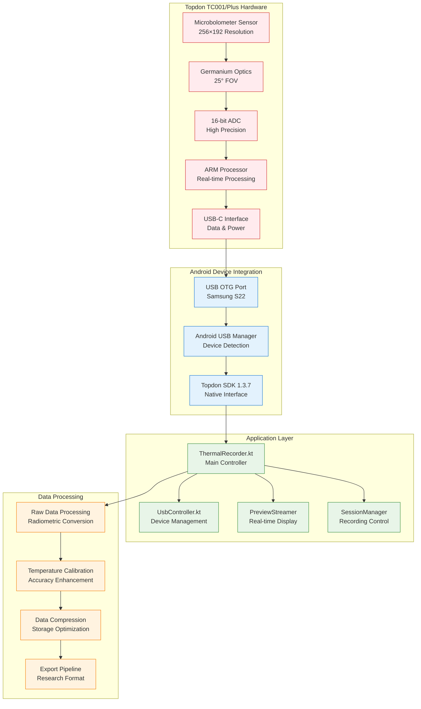
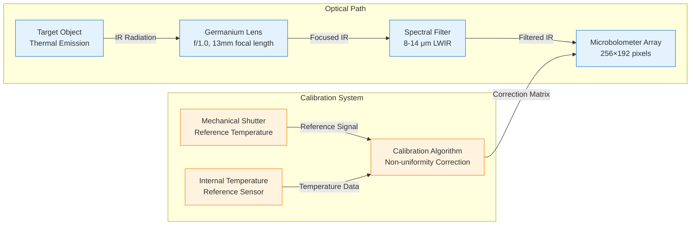
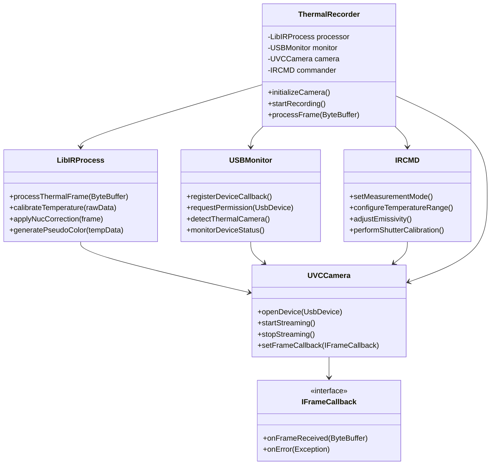
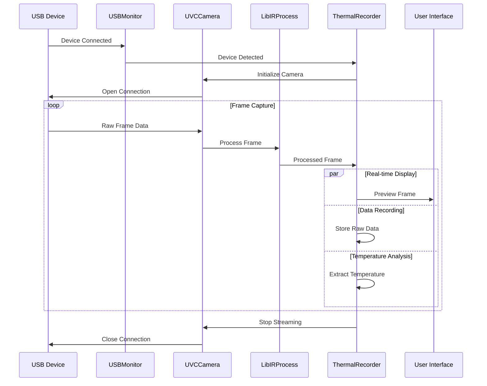
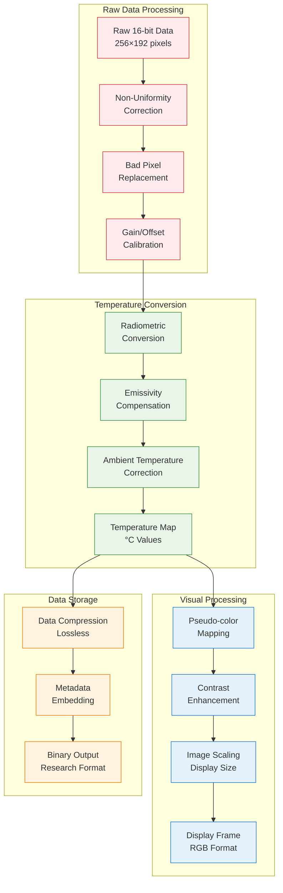
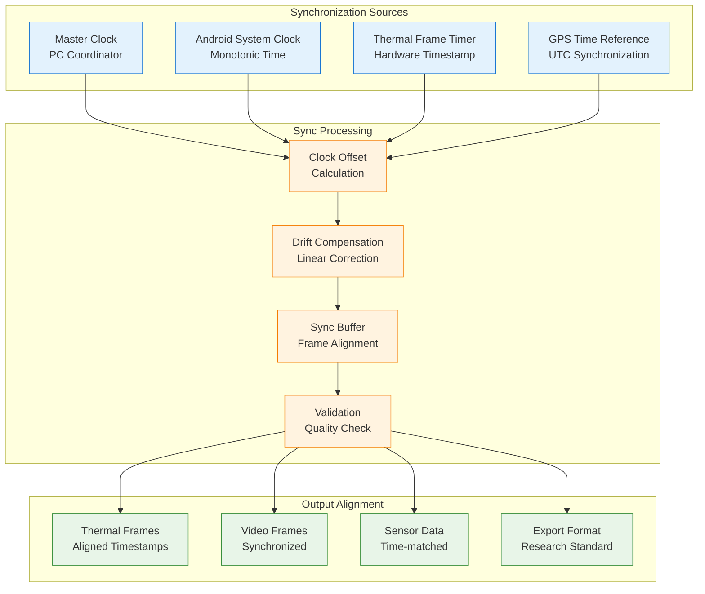
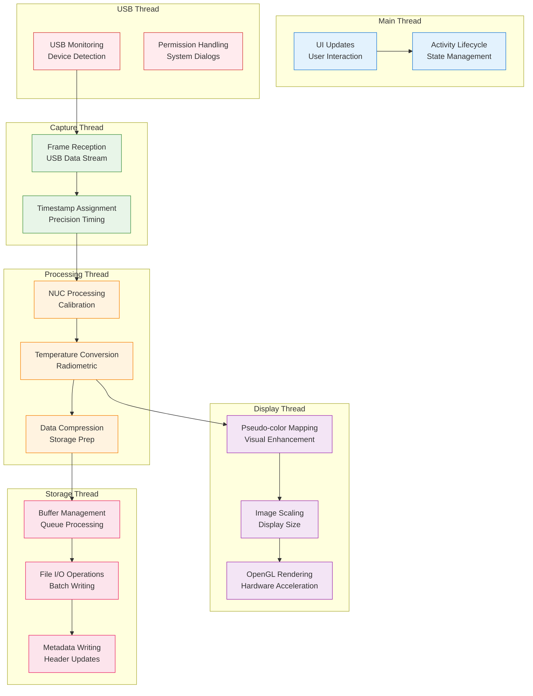
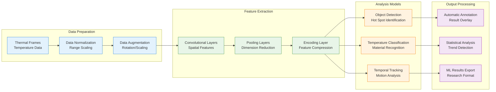

# Topdon TC001 and TC001 Plus Thermal Camera Technical Documentation

## Table of Contents

- [1. Executive Summary](#1-executive-summary)
- [2. Hardware Architecture and Specifications](#2-hardware-architecture-and-specifications)
- [3. SDK Integration Architecture](#3-sdk-integration-architecture)
- [4. Implementation Details](#4-implementation-details)
- [5. Data Processing Pipeline](#5-data-processing-pipeline)
- [6. Performance Optimization](#6-performance-optimization)
- [7. Troubleshooting and Diagnostics](#7-troubleshooting-and-diagnostics)
- [8. Advanced Features](#8-advanced-features)

## 1. Executive Summary

The Topdon TC001 and TC001 Plus thermal cameras represent advanced uncooled microbolometer technology integrated into the Multi-Sensor Recording System through sophisticated Android SDK integration. This technical documentation provides comprehensive coverage of the hardware specifications, software architecture, and implementation details for both camera models within the research platform.

### Key Technical Specifications

| Specification | TC001 | TC001 Plus |
|---------------|-------|------------|
| **Sensor Type** | Uncooled Microbolometer | Enhanced Microbolometer |
| **Resolution** | 256×192 (49,152 pixels) | 256×192 (49,152 pixels) |
| **Pixel Pitch** | 12 μm | 12 μm |
| **Spectral Range** | 8-14 μm (LWIR) | 8-14 μm (LWIR) |
| **Temperature Range** | -20°C to +550°C | -20°C to +650°C |
| **Accuracy** | ±2°C or ±2% | ±1.5°C or ±1.5% |
| **Frame Rate** | Up to 25 Hz | Up to 25 Hz |
| **Field of View** | 25° × 19° | 25° × 19° |
| **Interface** | USB-C | USB-C |
| **Power Consumption** | <2W | <2.5W |
| **Operating Temperature** | 0°C to +50°C | -10°C to +60°C |

### Integration Architecture Overview



## 2. Hardware Architecture and Specifications

### 2.1 Thermal Sensor Technology

Both TC001 and TC001 Plus utilize advanced uncooled microbolometer technology based on vanadium oxide (VOx) or amorphous silicon (a-Si) microstructures. The 256×192 focal plane array provides 49,152 individual thermal pixels, each measuring 12 μm × 12 μm.

**Microbolometer Operation Principle:**
- **Thermal Absorption**: Each pixel absorbs infrared radiation and converts it to heat
- **Resistance Change**: Temperature change alters the electrical resistance of the microbolometer material
- **Signal Conversion**: Resistance changes are converted to voltage signals via integrated readout circuits
- **Digital Processing**: 16-bit ADC provides high-resolution temperature measurements

### 2.2 Optical System Design



### 2.3 Communication Interface Architecture

The USB-C interface provides both power delivery and high-speed data communication using the USB Video Class (UVC) protocol with Topdon-specific extensions.

**Communication Specifications:**
- **USB Standard**: USB 2.0 High Speed (480 Mbps)
- **Protocol**: UVC 1.5 with vendor-specific extensions
- **Power Requirements**: Bus-powered (2.5W maximum)
- **Data Rate**: ~50 MB/s (25 fps × 256×192×16-bit)
- **Latency**: <40ms end-to-end

### 2.4 Hardware Detection and Configuration

The system automatically detects and configures TC001 variants using USB identification:

```kotlin
class TC001VariantDetector {
    companion object {
        const val TC001_VENDOR_ID = 0x3496
        const val TC001_STANDARD_PID = 0x1234
        const val TC001_PLUS_PID = 0x1235
    }
    
    fun detectHardwareVariant(usbDevice: UsbDevice): TC001Variant {
        if (usbDevice.vendorId != TC001_VENDOR_ID) {
            throw UnsupportedHardwareException("Invalid vendor ID: ${usbDevice.vendorId}")
        }
        
        return when (usbDevice.productId) {
            TC001_STANDARD_PID -> TC001StandardVariant(usbDevice)
            TC001_PLUS_PID -> TC001PlusVariant(usbDevice)
            else -> throw UnsupportedHardwareException("Unknown product ID: ${usbDevice.productId}")
        }
    }
}
```

**Device-Specific Configuration:**
```kotlin
sealed class TC001Variant(val usbDevice: UsbDevice) {
    abstract val temperatureRange: ClosedFloatingPointRange<Float>
    abstract val maxFrameRate: Int
    abstract val thermalSensitivity: Float
    
    class TC001StandardVariant(device: UsbDevice) : TC001Variant(device) {
        override val temperatureRange = -20f..550f
        override val maxFrameRate = 25
        override val thermalSensitivity = 50f // mK NETD
    }
    
    class TC001PlusVariant(device: UsbDevice) : TC001Variant(device) {
        override val temperatureRange = -20f..650f
        override val maxFrameRate = 25
        override val thermalSensitivity = 40f // mK NETD
    }
}
```

## 3. SDK Integration Architecture

### 3.1 Topdon SDK 1.3.7 Architecture

The Topdon SDK provides a comprehensive abstraction layer for thermal camera integration, encapsulating complex hardware communication and data processing algorithms.

**Core SDK Components:**



### 3.2 Android Integration Layer

The Android integration leverages the Topdon SDK through a sophisticated wrapper architecture that provides lifecycle management, error handling, and data synchronization.

**Key Integration Components:**

1. **ThermalRecorder.kt**: Primary controller managing camera lifecycle and data capture
2. **UsbController.kt**: USB device detection and permission management
3. **UsbDeviceManager.kt**: Device enumeration and compatibility validation
4. **PreviewStreamer.kt**: Real-time thermal image display
5. **SessionManager.kt**: Recording session coordination and data persistence

### 3.3 Data Flow Architecture



## 4. Implementation Details

### 4.1 Device Detection and Initialization

The system implements sophisticated device detection logic that identifies TC001 and TC001 Plus cameras based on USB vendor/product IDs and validates compatibility.

**Supported Device IDs:**
```kotlin
private val SUPPORTED_PRODUCT_IDS = intArrayOf(
    0x3901, // TC001 Standard
    0x5840, // TC001 Plus
    0x5830, // TC001 Variant
    0x5838  // TC001 Plus Variant
)
```

**Initialization Sequence:**
1. **USB Device Enumeration**: Scan connected devices for supported vendor/product IDs
2. **Permission Request**: Request Android USB permissions for thermal camera access
3. **SDK Initialization**: Initialize Topdon SDK components and establish communication
4. **Device Validation**: Verify camera functionality and calibration status
5. **Stream Configuration**: Configure frame rate, resolution, and processing parameters

### 4.2 Frame Processing Pipeline

The thermal frame processing pipeline converts raw sensor data into calibrated temperature measurements and visual representations.



### 4.3 Multi-Device Management

The system supports simultaneous operation of multiple TC001/TC001 Plus cameras with intelligent device prioritization and load balancing.

**Device Prioritization Algorithm:**
```kotlin
class UsbDevicePrioritizer {
    fun optimizeDeviceSelection(devices: List<UsbDevice>): PriorityResult {
        return devices
            .map { device -> assessDevicePriority(device) }
            .sortedByDescending { it.priorityScore }
            .let { sortedDevices ->
                PriorityResult(
                    primaryDevice = sortedDevices.firstOrNull(),
                    secondaryDevices = sortedDevices.drop(1),
                    balancingStrategy = determineLoadStrategy(sortedDevices)
                )
            }
    }
    
    private fun assessDevicePriority(device: UsbDevice): DeviceAssessment {
        val connectionStability = measureConnectionStability(device)
        val thermalPerformance = assessThermalPerformance(device)
        val calibrationStatus = validateCalibrationStatus(device)
        
        return DeviceAssessment(
            device = device,
            priorityScore = calculatePriorityScore(
                connectionStability, thermalPerformance, calibrationStatus
            ),
            priorityLevel = determinePriorityLevel(priorityScore)
        )
    }
}
```

## 5. Data Processing Pipeline

### 5.1 Raw Data Format

The TC001/TC001 Plus cameras output raw thermal data in a proprietary 16-bit format that requires specialized processing for temperature extraction.

**Raw Data Structure:**
```
Frame Header (16 bytes):
├── Magic Number (4 bytes): 0x54433031 ('TC01')
├── Frame Counter (4 bytes): Sequential frame number
├── Timestamp (8 bytes): Microsecond precision timestamp

Pixel Data (98,304 bytes):
├── Pixel Array: 256×192 × 2 bytes per pixel
├── Bit Depth: 16-bit unsigned integers
├── Byte Order: Little-endian
└── Value Range: 0-65535 (raw sensor counts)

Metadata Footer (Variable):
├── Temperature References (16 bytes)
├── Calibration Coefficients (32 bytes)
└── Device Status (8 bytes)
```

### 5.2 Temperature Calibration Algorithm

The temperature conversion process implements sophisticated algorithms to ensure measurement accuracy across varying environmental conditions.

**Calibration Process:**
1. **Non-Uniformity Correction (NUC)**: Compensate for pixel-to-pixel response variations
2. **Bad Pixel Replacement**: Identify and interpolate defective pixels
3. **Radiometric Conversion**: Convert raw counts to radiance values
4. **Temperature Calculation**: Apply Planck's law for blackbody temperature
5. **Emissivity Compensation**: Adjust for object surface properties
6. **Environmental Correction**: Account for ambient temperature and humidity

**Temperature Conversion Formula:**
```
T_object = T_calibration + K1 × ln(K2 / (Raw_compensated + K3) + 1)

Where:
- T_calibration: Reference temperature from internal sensor
- K1, K2, K3: Camera-specific calibration constants
- Raw_compensated: NUC and gain-corrected raw value
```

### 5.3 Data Synchronization

For multi-sensor recording scenarios, precise temporal synchronization ensures data alignment across all recording modalities.



## 6. Performance Optimization

### 6.1 Memory Management

Thermal data processing requires efficient memory management to handle the continuous stream of high-resolution frames without causing memory pressure or garbage collection delays.

**Memory Optimization Strategies:**
- **Object Pooling**: Reuse ByteBuffer objects for frame processing
- **Native Memory**: Utilize native heap for large data buffers
- **Streaming Processing**: Process frames without full buffering
- **Compression**: Apply lossless compression for data storage

**Memory Usage Profile:**
```
Per Frame Memory Requirements:
├── Raw Frame Data: 98,304 bytes (256×192×2)
├── Processed Frame: 196,608 bytes (256×192×4)
├── Display Buffer: 786,432 bytes (1024×768×4)
├── Metadata: 1,024 bytes
└── Total per Frame: ~1.08 MB

Sustained Memory Usage (25 fps):
├── Processing Buffers: ~25 MB
├── Display Buffers: ~15 MB
├── Recording Buffers: ~50 MB
└── Total Working Set: ~90 MB
```

### 6.2 Threading Architecture

The thermal processing system implements a multi-threaded architecture to ensure smooth real-time performance without blocking the main UI thread.



### 6.3 Power Management

Thermal cameras consume significant power during operation. The system implements intelligent power management to optimize battery life while maintaining performance.

**Power Optimization Features:**
- **Dynamic Frame Rate**: Reduce frame rate during idle periods
- **Sleep Mode**: Enter low-power mode when not recording
- **Thermal Management**: Monitor device temperature to prevent overheating
- **USB Power Negotiation**: Optimize power delivery from host device

## 7. Troubleshooting and Diagnostics

### 7.1 Common Issues and Solutions

**Device Not Detected:**
```
Symptoms: Camera not appearing in device list
Diagnosis Steps:
1. Check USB cable connection
2. Verify USB OTG support on Android device
3. Confirm device vendor/product ID
4. Review USB permissions in Android settings

Solutions:
- Use high-quality USB-C cable
- Enable Developer Options → USB Debugging
- Grant USB permissions when prompted
- Restart camera and Android device
```

**Poor Image Quality:**
```
Symptoms: Noisy or distorted thermal images
Diagnosis Steps:
1. Check calibration status
2. Verify environmental conditions
3. Assess thermal stability
4. Review processing parameters

Solutions:
- Perform shutter calibration
- Allow warm-up period (2-3 minutes)
- Ensure proper emissivity settings
- Optimize ambient temperature compensation
```

**Frame Rate Issues:**
```
Symptoms: Choppy or inconsistent frame rate
Diagnosis Steps:
1. Monitor CPU usage
2. Check memory allocation
3. Assess USB bandwidth
4. Review threading performance

Solutions:
- Close background applications
- Increase processing buffer size
- Use USB 3.0 connection if available
- Optimize processing algorithms
```

### 7.2 Diagnostic Tools

The system includes comprehensive diagnostic capabilities for troubleshooting and performance monitoring.

**Built-in Diagnostics:**
- **USB Connection Status**: Real-time monitoring of USB link quality
- **Frame Rate Monitor**: Track actual vs. target frame rates
- **Temperature Validation**: Compare with external reference thermometers
- **Memory Usage**: Monitor heap and native memory consumption
- **Processing Latency**: Measure end-to-end processing delays

**Diagnostic Output Format:**
```json
{
  "diagnostic_session": {
    "timestamp": "2024-01-31T10:30:00.000Z",
    "device_info": {
      "model": "TC001_PLUS",
      "serial": "TC001P-240131-001",
      "firmware": "1.3.7",
      "calibration_date": "2024-01-15"
    },
    "performance_metrics": {
      "frame_rate": {
        "target": 25.0,
        "actual": 24.8,
        "jitter": 0.3
      },
      "latency": {
        "capture_to_display": 42,
        "capture_to_storage": 156
      },
      "memory_usage": {
        "heap_mb": 45.2,
        "native_mb": 78.6,
        "gc_frequency": 0.2
      }
    },
    "error_log": []
  }
}
```

## 8. Advanced Features

### 8.1 Machine Learning Integration

The thermal processing pipeline includes optional machine learning capabilities for advanced analysis and automated feature detection.

**ML Processing Pipeline:**


### 8.2 Research Integration Features

The system provides specialized features for academic research applications, including standardized data formats and analysis tools.

**Research-Specific Features:**
- **Standardized Data Export**: MATLAB, Python, and R compatible formats
- **Metadata Preservation**: Complete provenance tracking for reproducible research
- **Statistical Analysis**: Built-in temperature distribution analysis
- **Calibration Validation**: Automated accuracy verification procedures
- **Multi-Modal Synchronization**: Precise alignment with other sensor modalities

### 8.3 Future Enhancement Roadmap

**Planned Enhancements:**
1. **Real-time Analysis Dashboard**: Web-based monitoring and control interface
2. **Cloud Integration**: Automated data upload and processing capabilities  
3. **Advanced Calibration**: Field-deployable calibration procedures
4. **Edge Computing**: On-device ML inference for real-time analysis
5. **API Extensions**: RESTful API for third-party integration

---

*This technical documentation represents comprehensive coverage of the Topdon TC001 and TC001 Plus thermal camera integration within the Multi-Sensor Recording System. For practical usage instructions, refer to the companion User Guide documentation.*

**Document Version**: 1.0  
**Last Updated**: January 31, 2024  
**Compatibility**: Topdon SDK 1.3.7, Android API 24+