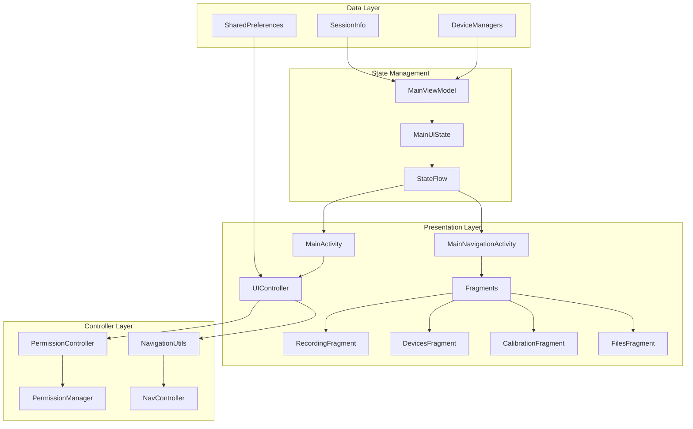
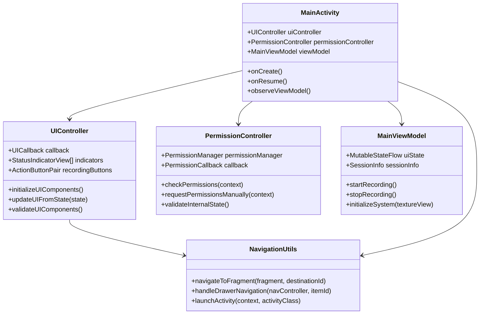

# Android UI, State, and Navigation Architecture

## Technical Deep-Dive Documentation

### Overview

The Multi-Sensor Recording System implements a modern Android UI architecture following industry best practices for maintainability, testability, and scalability. The system utilizes a single-activity, multi-fragment pattern with dedicated controllers for managing UI state, navigation, and permissions.

### Architecture Patterns

#### 1. Single-Activity Pattern with Fragment Navigation

The application follows the modern Android single-activity pattern where:
- **MainActivity**: Primary entry point with direct camera controls
- **MainNavigationActivity**: Navigation-enabled version with fragment-based UI
- **Fragments**: Modular UI components for different features

```kotlin
// Fragment structure
├── RecordingFragment    // Recording controls and camera preview
├── DevicesFragment      // Device management and connections
├── CalibrationFragment  // Calibration procedures
└── FilesFragment        // File management and export
```

#### 2. Model-View-ViewModel (MVVM) Pattern

**MainViewModel** serves as the central state manager:

```kotlin
class MainViewModel : ViewModel() {
    private val _uiState = MutableStateFlow(MainUiState())
    val uiState: StateFlow<MainUiState> = _uiState.asStateFlow()
    
    // State management methods
    fun startRecording() { /* ... */ }
    fun stopRecording() { /* ... */ }
    fun updateConnectionStatus() { /* ... */ }
}
```

**MainUiState** encapsulates all UI-related state:

```kotlin
data class MainUiState(
    val statusText: String = "Ready",
    val isRecording: Boolean = false,
    val canStartRecording: Boolean = true,
    val canStopRecording: Boolean = false,
    val canRunCalibration: Boolean = true,
    val isPcConnected: Boolean = false,
    val isShimmerConnected: Boolean = false,
    val isThermalConnected: Boolean = false,
    val batteryLevel: Int = -1,
    val isStreaming: Boolean = false,
    val streamingFrameRate: Int = 0,
    val streamingDataSize: String = "0KB/s",
    val showPermissionsButton: Boolean = false,
    val errorMessage: String? = null,
    val showErrorDialog: Boolean = false,
    val currentSessionInfo: SessionDisplayInfo? = null,
    val recordingSessionId: String? = null,
    val shimmerDeviceInfo: ShimmerDeviceInfo? = null
)
```

### Controller Architecture

#### UIController - Centralized UI Management

The `UIController` is responsible for:
- UI component initialization and management
- State-driven UI updates
- Visual indicator management
- Accessibility features
- Theme management

**Key Features:**
- **Consolidated Components**: Manages `StatusIndicatorView` and `ActionButtonPair` components
- **State Persistence**: Saves UI state across configuration changes
- **Accessibility Support**: Dynamic accessibility features and high contrast mode
- **Theme Management**: Dynamic theme switching with validation
- **Error Recovery**: Comprehensive UI validation and error recovery mechanisms

```kotlin
@Singleton
class UIController @Inject constructor() {
    
    // Consolidated UI components
    private lateinit var pcStatusIndicator: StatusIndicatorView
    private lateinit var shimmerStatusIndicator: StatusIndicatorView
    private lateinit var thermalStatusIndicator: StatusIndicatorView
    private lateinit var recordingButtonPair: ActionButtonPair
    
    fun updateUIFromState(state: MainUiState) {
        // Centralized UI state management
        callback?.runOnUiThread {
            saveUIState(state)
            updateStatusIndicatorsWithAccessibility(state)
            updateBatteryLevelDisplay(state.batteryLevel)
            updateRecordingIndicator(state.isRecording)
            updateStreamingIndicator(state.isStreaming, state.streamingFrameRate, state.streamingDataSize)
        }
    }
}
```

#### PermissionController - Permission Management

Implements formal state machine for permission handling:

**State Machine:**
- States: `{UNKNOWN, GRANTED, TEMPORARILY_DENIED, PERMANENTLY_DENIED}`
- Events: `{CHECK_PERMISSIONS, REQUEST_PERMISSIONS, USER_GRANT, USER_DENY, USER_NEVER_ASK_AGAIN}`
- Transitions: Formal state transitions with validation

**Features:**
- **Academic Rigor**: Formal specifications and invariant maintenance
- **State Persistence**: Permission state persistence with temporal validity
- **Retry Logic**: Exponential backoff with state reset
- **User Experience**: Clear feedback and guidance

```kotlin
@Singleton
class PermissionController @Inject constructor(
    private val permissionManager: PermissionManager
) {
    fun checkPermissions(context: Context) {
        callback?.onPermissionCheckStarted()
        
        if (permissionManager.areAllPermissionsGranted(context)) {
            hasCheckedPermissionsOnStartup = true
            persistState()
            callback?.onAllPermissionsGranted()
        } else {
            // Request permissions with formal state tracking
            permissionManager.requestPermissions(context, createPermissionManagerCallback())
        }
    }
}
```

### Navigation Architecture

#### NavigationUtils - Centralized Navigation Logic

Provides standardized navigation operations:

```kotlin
object NavigationUtils {
    fun navigateToFragment(fragment: Fragment, destinationId: Int) {
        try {
            val navController = fragment.findNavController()
            if (navController.currentDestination?.id != destinationId) {
                navController.navigate(destinationId)
            }
        } catch (e: Exception) {
            // Handle navigation errors gracefully
        }
    }
    
    fun handleDrawerNavigation(navController: NavController, itemId: Int): Boolean {
        return when (itemId) {
            R.id.nav_recording -> { navController.navigate(R.id.nav_recording); true }
            R.id.nav_devices -> { navController.navigate(R.id.nav_devices); true }
            R.id.nav_calibration -> { navController.navigate(R.id.nav_calibration); true }
            R.id.nav_files -> { navController.navigate(R.id.nav_files); true }
            else -> false
        }
    }
}
```

#### Fragment Navigation with ViewPager2

**MainNavigationActivity** implements tab-based navigation:

```kotlin
class MainNavigationActivity : AppCompatActivity() {
    private fun setupNavigationUI() {
        navigationAdapter = MainNavigationAdapter(this)
        binding.viewPager.adapter = navigationAdapter
        
        TabLayoutMediator(binding.tabLayout, binding.viewPager) { tab, position ->
            tab.text = navigationAdapter.getTabTitle(position)
        }.attach()
    }
}
```

### State Management

#### Reactive UI with StateFlow

The system uses modern reactive programming:

```kotlin
// In Activity/Fragment
private fun observeViewModel() {
    lifecycleScope.launch {
        repeatOnLifecycle(Lifecycle.State.STARTED) {
            viewModel.uiState.collect { state ->
                updateUIFromState(state)
            }
        }
    }
}
```

#### State Persistence

UI state is persisted across configuration changes:

```kotlin
// UIController persistence
private fun saveUIState(state: MainUiState) {
    sharedPreferences?.edit()?.apply {
        putInt(KEY_LAST_BATTERY_LEVEL, state.batteryLevel)
        putBoolean(KEY_PC_CONNECTION_STATUS, state.isPcConnected)
        putBoolean(KEY_SHIMMER_CONNECTION_STATUS, state.isShimmerConnected)
        putBoolean(KEY_THERMAL_CONNECTION_STATUS, state.isThermalConnected)
        putBoolean(KEY_RECORDING_STATE, state.isRecording)
        putBoolean(KEY_STREAMING_STATE, state.isStreaming)
        apply()
    }
}
```

### Integration Architecture

#### Dependency Injection with Hilt

All controllers use Dagger Hilt for dependency injection:

```kotlin
@AndroidEntryPoint
class MainActivity : AppCompatActivity() {
    @Inject lateinit var uiController: UIController
    @Inject lateinit var permissionController: PermissionController
    @Inject lateinit var shimmerController: ShimmerController
    @Inject lateinit var networkController: NetworkController
}
```

#### Callback Pattern for Decoupling

Controllers use callback interfaces for communication:

```kotlin
interface UICallback {
    fun onUIComponentsInitialized()
    fun onUIStateUpdated(state: MainUiState)
    fun onUIError(message: String)
    fun updateStatusText(text: String)
    fun showToast(message: String, duration: Int)
    fun runOnUiThread(action: () -> Unit)
    fun getContext(): Context
    // UI component accessors...
}
```

### Architecture Diagrams



### Component Relationships



### Performance Considerations

#### Memory Management
- **Weak References**: Controllers use weak references to prevent memory leaks
- **Lifecycle Awareness**: Proper lifecycle management with `repeatOnLifecycle`
- **Resource Cleanup**: Comprehensive cleanup in `onDestroy()`

#### Efficiency Optimizations
- **State Diffing**: Only update UI when state actually changes
- **Lazy Initialization**: Components initialized only when needed
- **Background Processing**: Heavy operations moved to background threads

### Testing Strategy

#### Unit Testing
- **Controller Testing**: Isolated testing of UIController, PermissionController
- **State Testing**: MainUiState validation and transformation testing
- **Navigation Testing**: NavigationUtils functionality verification

#### Integration Testing
- **Activity Testing**: End-to-end activity lifecycle testing
- **Fragment Testing**: Fragment navigation and state testing
- **Permission Testing**: Permission flow integration testing

### Future Enhancements

#### Planned Improvements
1. **Compose Migration**: Gradual migration to Jetpack Compose
2. **Enhanced Accessibility**: Advanced accessibility features
3. **Dynamic Theming**: Material You dynamic theming support
4. **Performance Monitoring**: Real-time performance metrics
5. **State Debugging**: Enhanced debugging tools for state management

#### Architecture Evolution
- **Modularization**: Split into feature modules
- **Clean Architecture**: Additional abstraction layers
- **Repository Pattern**: Enhanced data layer abstraction

### Conclusion

The Multi-Sensor Recording System implements a sophisticated, maintainable Android UI architecture that follows modern best practices. The separation of concerns through dedicated controllers, reactive state management with StateFlow, and comprehensive navigation utilities provides a solid foundation for continued development and feature expansion.

The architecture demonstrates academic rigor in its formal specifications while maintaining practical usability and performance optimization. The extensive testing coverage and documentation ensure long-term maintainability and team collaboration effectiveness.