# Session Management System - Comprehensive Documentation

## Table of Contents

- [Overview](#overview)
- [Quick Start Guide](#quick-start-guide)
- [System Architecture](#system-architecture)
  - [Core Components](#core-components)
  - [Data Architecture](#data-architecture)
  - [Session Lifecycle](#session-lifecycle)
- [Technical Implementation](#technical-implementation)
  - [SessionManager Class](#sessionmanager-class)
  - [SessionLogger Class](#sessionlogger-class)
  - [Session Recovery System](#session-recovery-system)
  - [Session Synchronization](#session-synchronization)
- [User Guide](#user-guide)
  - [Pre-flight Checklist](#pre-flight-checklist)
  - [Step-by-Step Workflow](#step-by-step-workflow)
  - [Device Management](#device-management)
  - [Data Organization](#data-organization)
- [Protocol Specifications](#protocol-specifications)
  - [Data Schemas](#data-schemas)
  - [File Naming Conventions](#file-naming-conventions)
  - [Network Protocol Messages](#network-protocol-messages)
  - [API Reference](#api-reference)
- [Advanced Features](#advanced-features)
  - [State Persistence and Recovery](#state-persistence-and-recovery)
  - [Multi-Device Synchronization](#multi-device-synchronization)
  - [Post-Processing Integration](#post-processing-integration)
- [Testing and Validation](#testing-and-validation)
- [Troubleshooting](#troubleshooting)
- [Best Practices](#best-practices)

## Overview

The Session Management System is the foundational framework responsible for defining, managing, and storing recording sessions in the Multi-Sensor Recording System. This comprehensive document consolidates all technical, user, and protocol documentation to provide a complete reference for researchers, developers, and system administrators.

### Key Capabilities

- **Unified Session Coordination**: Manages complete session lifecycle from creation to data export
- **Multi-Device Support**: Coordinates Android phones, webcams, thermal cameras, and GSR sensors
- **Automatic Data Organization**: Enforces standardized directory structure and file naming
- **Real-Time Event Logging**: Captures detailed timeline of all session activities
- **State Persistence**: Recovers from interruptions and maintains session integrity
- **Post-Processing Integration**: Automated hand segmentation and data synchronization

### System Benefits


## Quick Start Guide

### Immediate Setup (5 minutes)

1. **System Initialization**
   ```bash
   cd PythonApp
   python main.py  # Start the desktop controller
   ```

2. **Create Your First Session**
   - Click "New Session" in the main interface
   - Enter session name: "test_session_001"
   - Verify session folder creation in `recordings/`

3. **Connect a Device**
   - On Android device: Open companion app → "Connect to Session"
   - On PC: Verify webcam in "Device Manager"
   - Confirm device appears in "Connected Devices" list

4. **Record Test Data**
   - Click "Start Recording" → Wait for 3-2-1 countdown
   - Record for 30 seconds
   - Click "Stop Recording"
   - Check `recordings/test_session_001_YYYYMMDD_HHMMSS/` for files

### Expected Results
Your session folder should contain:
```
test_session_001_20250131_143022/
├── session_metadata.json      # Session information
├── session_log.json          # Event timeline
├── devices/phone_1/           # Device recordings
└── webcam/                    # PC camera data
```

## System Architecture

### Core Components

The session management system is built around four main components that work together to provide comprehensive session lifecycle management:


#### SessionManager
**Purpose**: Central coordinator for all session operations
**Responsibilities**:
- Session creation and termination
- Directory structure enforcement
- Device and file registration
- Metadata maintenance
- Post-processing coordination

**Design Patterns**:
- **Singleton Pattern**: Global session state management
- **Observer Pattern**: UI notification through Qt signals
- **Factory Pattern**: Session folder and file creation
- **Command Pattern**: Session operations encapsulation

#### SessionLogger
**Purpose**: Comprehensive event logging with structured JSON format
**Responsibilities**:
- Real-time event logging
- Structured JSON event format
- Thread-safe logging operations
- UI feedback signals
- Session timeline tracking

#### SessionRecovery
**Purpose**: Automatic recovery from interrupted operations
**Responsibilities**:
- State persistence across shutdowns
- Automatic session recovery detection
- Data integrity validation
- Graceful error recovery

#### SessionSynchronizer
**Purpose**: Multi-device coordination and timing
**Responsibilities**:
- Device clock synchronization
- Command coordination across devices
- Network latency compensation
- Data alignment processing

### Data Architecture

The system implements a hierarchical data organization strategy that separates concerns while maintaining data relationships:


### Session Lifecycle

The session management system follows a well-defined lifecycle with clear state transitions and validation at each step:


## Technical Implementation

### SessionManager Class

The SessionManager class serves as the central coordinator for all session operations, implementing a robust state management system with comprehensive error handling.

#### Core Methods and Implementation

```python
class SessionManager:
    """Central coordinator for multi-device recording sessions"""
    
    def __init__(self, base_recordings_dir: str = "recordings"):
        self.logger = get_logger(__name__)
        self.base_recordings_dir = Path(base_recordings_dir)
        self.current_session: Optional[Dict] = None
        self.session_history: List[Dict] = []
        self.base_recordings_dir.mkdir(parents=True, exist_ok=True)
        
    def create_session(self, session_name: Optional[str] = None) -> Dict:
        """Create new recording session with standardized structure"""
        timestamp = datetime.now()
        session_id = self._generate_session_id(session_name, timestamp)
        session_folder = self.base_recordings_dir / session_id
        
        # Create directory structure
        session_folder.mkdir(parents=True, exist_ok=True)
        (session_folder / "devices").mkdir(exist_ok=True)
        (session_folder / "webcam").mkdir(exist_ok=True)
        (session_folder / "processing").mkdir(exist_ok=True)
        (session_folder / "exports").mkdir(exist_ok=True)
        
        # Initialize session metadata
        session_info = {
            "session_id": session_id,
            "session_name": session_name or session_id,
            "folder_path": str(session_folder),
            "start_time": timestamp.isoformat(),
            "end_time": None,
            "duration": None,
            "status": "active",
            "devices": {},
            "files": {},
            "creation_timestamp": timestamp.timestamp()
        }
        
        # Write metadata and update state
        self._write_metadata(session_folder, session_info)
        self.current_session = session_info
        
        self.logger.info(f"Session created: {session_id}")
        return session_info
```

#### Device Management System

```python
def add_device_to_session(self, device_id: str, device_type: str, 
                         capabilities: List[str]) -> bool:
    """Register device with session and create required directories"""
    if not self.current_session:
        self.logger.error("No active session for device registration")
        return False
        
    # Validate device capabilities
    valid_capabilities = self._validate_device_capabilities(device_type, capabilities)
    if not valid_capabilities:
        return False
        
    # Create device directory structure
    device_folder = Path(self.current_session["folder_path"]) / "devices" / device_id
    device_folder.mkdir(parents=True, exist_ok=True)
    
    # Create capability-specific subdirectories
    for capability in capabilities:
        subfolder = self._get_capability_subfolder(capability)
        if subfolder:
            (device_folder / subfolder).mkdir(exist_ok=True)
    
    # Register device in session metadata
    device_info = {
        "device_type": device_type,
        "capabilities": capabilities,
        "added_time": datetime.now().isoformat(),
        "status": "connected",
        "folder_path": str(device_folder)
    }
    
    self.current_session["devices"][device_id] = device_info
    self._update_session_metadata()
    
    self.logger.info(f"Device {device_id} added to session")
    return True

def add_file_to_session(self, device_id: str, file_type: str, 
                       file_path: str, file_size: Optional[int] = None) -> bool:
    """Track file in session with validation and integrity checks"""
    if not self.current_session or device_id not in self.current_session["devices"]:
        return False
        
    # Validate file exists and is accessible
    full_path = Path(self.current_session["folder_path"]) / file_path
    if not full_path.exists():
        self.logger.error(f"File not found: {full_path}")
        return False
        
    # Calculate file size if not provided
    if file_size is None:
        file_size = full_path.stat().st_size
        
    # Create file record
    file_info = {
        "file_type": file_type,
        "file_path": file_path,
        "file_size": file_size,
        "created_time": datetime.now().isoformat(),
        "checksum": self._calculate_file_checksum(full_path)
    }
    
    # Add to session files
    if device_id not in self.current_session["files"]:
        self.current_session["files"][device_id] = []
    
    self.current_session["files"][device_id].append(file_info)
    self._update_session_metadata()
    
    return True
```

### SessionLogger Class

The SessionLogger implements comprehensive event tracking with real-time UI updates and structured JSON logging:

```python
class SessionLogger(QObject):
    """Thread-safe event logging with Qt signal integration"""
    
    # Qt Signals for real-time UI updates
    log_entry_added = pyqtSignal(str)
    session_started = pyqtSignal(str)
    session_ended = pyqtSignal(str, float)
    error_logged = pyqtSignal(str, str)
    
    def __init__(self, base_sessions_dir: str = "recordings"):
        super().__init__()
        self.base_sessions_dir = Path(base_sessions_dir)
        self.current_session: Optional[Dict] = None
        self.events: List[Dict] = []
        self.lock = threading.Lock()
        
    def log_event(self, event_type: str, details: Optional[Dict] = None) -> None:
        """Log structured event with timestamp and validation"""
        with self.lock:
            now = datetime.now()
            
            # Create standardized event entry
            event_entry = {
                "event": event_type,
                "time": now.strftime("%H:%M:%S.%f")[:-3],  # HH:MM:SS.mmm
                "timestamp": now.isoformat(),
                **(details or {})
            }
            
            # Add to events list
            self.events.append(event_entry)
            
            # Emit signal for UI update
            self.log_entry_added.emit(json.dumps(event_entry, indent=2))
            
            # Handle special event types
            if event_type == "error":
                self.error_logged.emit(
                    details.get("error_type", "unknown"),
                    details.get("message", "No message provided")
                )
            
            # Immediate disk write for critical events
            if event_type in ["session_start", "session_end", "error"]:
                self._flush_to_disk()
```

### Session Recovery System

The enhanced session recovery system provides comprehensive state persistence and automatic recovery from various failure scenarios:


### Session Synchronization

Multi-device coordination requires precise timing and robust error handling:

```python
class SessionSynchronizer:
    """Multi-device session coordination with enhanced synchronization"""
    
    def __init__(self, session_manager: SessionManager):
        self.session_manager = session_manager
        self.sync_precision_ms = 2.5
        self.device_clocks = {}
        self.network_latencies = {}
        
    async def coordinate_session_start(self, devices: List[str]) -> Dict:
        """Coordinate synchronized session start across devices"""
        coordination_result = {
            "success": False,
            "devices": {},
            "sync_quality": 0.0,
            "start_timestamp": None
        }
        
        try:
            # Step 1: Measure network latencies
            await self._measure_network_latencies(devices)
            
            # Step 2: Synchronize device clocks
            sync_results = await self._synchronize_device_clocks(devices)
            
            # Step 3: Calculate optimal start time
            start_time = self._calculate_synchronized_start_time()
            
            # Step 4: Send synchronized start commands
            await self._send_synchronized_commands(devices, start_time)
            
            # Step 5: Validate synchronization
            validation = await self._validate_synchronization(devices)
            
            coordination_result.update({
                "success": validation["success"],
                "devices": sync_results,
                "sync_quality": validation["quality_score"],
                "start_timestamp": start_time.isoformat()
            })
            
        except Exception as e:
            self.logger.error(f"Session coordination failed: {e}")
            coordination_result["error"] = str(e)
            
        return coordination_result
```

## User Guide

### Pre-flight Checklist

Before starting any recording session, ensure the following prerequisites are met:

#### System Requirements
- [ ] Multi-Sensor Recording System is installed and configured
- [ ] All devices (phones, webcams, sensors) are properly connected
- [ ] Sufficient disk space available (recommend 10GB+ per hour of recording)
- [ ] Network connections are stable for multi-device coordination
- [ ] Required permissions are granted for file system access

#### Device Preparation
- [ ] Mobile devices have the companion app installed and updated
- [ ] Webcams are functional and properly positioned
- [ ] Shimmer GSR sensors are charged and paired
- [ ] Thermal cameras are connected and calibrated
- [ ] All devices are visible in the device management interface

#### Data Storage Setup
- [ ] Base recordings directory is accessible and writable
- [ ] Backup storage is available if required
- [ ] Network storage is mounted if using shared storage
- [ ] Sufficient space for expected recording duration

### Step-by-Step Workflow

The session management system guides you through a complete workflow from session creation to data export:


#### Step 1: Creating a New Session

1. **Open the Multi-Sensor Recording System**
   - Launch the main application
   - Wait for system initialization to complete
   - Verify all components are loaded successfully

2. **Navigate to Session Management**
   - Click on "Session Manager" in the main interface
   - The session management panel will display current status

3. **Create a New Session**
   - Click the "New Session" button
   - **Option A - Default Naming**: Leave session name empty for automatic timestamp naming
     - Result: `session_20250131_143022`
   - **Option B - Custom Naming**: Enter a descriptive session name
     - Example input: "Stress Study Baseline"
     - Result: `Stress_Study_Baseline_20250131_143022`

4. **Verify Session Creation**
   - Confirm session folder appears in recordings directory
   - Check that `session_metadata.json` file is created
   - Verify session status shows as "Active"

#### Step 2: Device Connection and Management

1. **Connect Mobile Devices**
   - Ensure devices are on the same network
   - Open the companion app on each device
   - Tap "Connect to Session" in the mobile app
   - Verify device appears in the "Connected Devices" list
   - Note the device ID (e.g., `phone_1`, `phone_2`)

2. **Connect PC Webcams**
   - Check webcam availability in the "Device Manager"
   - Select desired webcams from the available list
   - Click "Add to Session" for each webcam
   - Test webcam functionality with preview window

3. **Connect Shimmer GSR Sensors** (if available)
   - Power on Shimmer devices
   - Use Bluetooth pairing interface
   - Verify sensor data streaming is active
   - Check signal quality indicators

4. **Verify All Devices**
   - Review the "Session Devices" panel
   - Confirm each device shows "Connected" status
   - Test device capabilities (camera preview, sensor data)
   - Resolve any connection issues before proceeding

### Device Management

#### Supported Device Types

The session management system supports multiple device types with specific capabilities:

| Device Type | Capabilities | Connection Method | Data Types |
|-------------|--------------|-------------------|------------|
| **android_phone** | RGB video, Thermal video, GSR data, Motion data | Wi-Fi network | MP4, CSV |
| **pc_webcam** | RGB video, Audio recording | USB/Built-in | MP4, WAV |
| **shimmer_gsr** | GSR data, Motion data | Bluetooth | CSV |
| **thermal_camera** | Thermal video, Temperature data | USB | MP4, CSV |

#### Device Status Monitoring

```mermaid
graph LR
    subgraph "Device Lifecycle"
        DS1[Discovery] --> DS2[Connection]
        DS2 --> DS3[Registration]
        DS3 --> DS4[Active]
        DS4 --> DS5[Recording]
        DS5 --> DS4
        DS4 --> DS6[Disconnection]
        DS6 --> DS7[Recovery]
        DS7 --> DS2
    end
    
    subgraph "Status Indicators"
        SI1[🔍 Discovering]
        SI2[🔄 Connecting]
        SI3[✅ Connected]
        SI4[🔴 Recording]
        SI5[⚠️ Error]
        SI6[💤 Disconnected]
    end
    
    DS1 -.-> SI1
    DS2 -.-> SI2
    DS3 -.-> SI3
    DS4 -.-> SI3
    DS5 -.-> SI4
    DS6 -.-> SI6
    DS7 -.-> SI5
```



### Data Organization

#### Automatic Directory Structure

Your data is automatically organized in a standardized structure that ensures consistency and facilitates analysis:

```
recordings/stress_study_baseline_20250131_143022/
├── 📄 session_metadata.json           # Complete session overview
├── 📄 stress_study_baseline_20250131_143022_log.json # Event timeline
├── 📁 devices/                        # Device-specific recordings
│   ├── 📁 phone_1/
│   │   ├── 📁 rgb_videos/
│   │   │   └── phone_1_rgb_20250131_143022.mp4
│   │   ├── 📁 thermal_videos/
│   │   │   └── phone_1_thermal_20250131_143022.mp4
│   │   └── 📁 sensor_data/
│   │       └── phone_1_gsr_20250131_143022.csv
│   └── 📁 phone_2/ (if multiple devices used)
├── 📁 webcam/
│   └── webcam_1_20250131_143022.mp4
├── 📁 processing/ (created during post-processing)
│   ├── 📁 hand_segmentation/
│   └── 📁 synchronized_data/
└── 📁 exports/ (created when exporting data)
    ├── 📁 csv/
    └── 📁 matlab/
```

#### File Naming Standards

All files follow standardized naming conventions that ensure predictable identification:

**Session Naming Pattern:**
```
Format: [custom_name_]YYYYMMDD_HHMMSS
Examples:
- session_20250131_143022              # Default naming
- stress_study_baseline_20250131_143022 # Custom session name
- calibration_run_20250131_143022      # Specific use case
```

**Device File Naming Pattern:**
```
Format: [device_id]_[file_type]_YYYYMMDD_HHMMSS.[extension]
Examples:
- phone_1_rgb_20250131_143022.mp4      # RGB video from phone 1
- phone_1_thermal_20250131_143022.mp4  # Thermal video from phone 1
- phone_1_gsr_20250131_143022.csv      # GSR sensor data from phone 1
- webcam_1_20250131_143022.mp4         # PC webcam recording
```

## Protocol Specifications

### Data Schemas

#### Session Metadata Schema

The session metadata file follows a standardized JSON schema that ensures consistency across all recording sessions:

```json
{
  "$schema": "http://json-schema.org/draft-07/schema#",
  "title": "Session Metadata",
  "type": "object",
  "required": ["session_id", "session_name", "folder_path", "start_time", "status", "devices", "files"],
  "properties": {
    "session_id": {
      "type": "string",
      "pattern": "^[a-zA-Z0-9_-]+_\\d{8}_\\d{6}$",
      "description": "Unique session identifier with timestamp"
    },
    "session_name": {
      "type": "string",
      "minLength": 1,
      "description": "Human-readable session name"
    },
    "folder_path": {
      "type": "string",
      "description": "Full path to session folder"
    },
    "start_time": {
      "type": "string",
      "format": "date-time",
      "description": "Session start timestamp in ISO 8601 format"
    },
    "end_time": {
      "type": ["string", "null"],
      "format": "date-time",
      "description": "Session end timestamp in ISO 8601 format"
    },
    "duration": {
      "type": ["number", "null"],
      "minimum": 0,
      "description": "Session duration in seconds"
    },
    "status": {
      "type": "string",
      "enum": ["active", "completed", "error"],
      "description": "Current session status"
    },
    "devices": {
      "type": "object",
      "description": "Connected devices and their capabilities"
    },
    "files": {
      "type": "object",
      "description": "Recorded files organized by device"
    }
  }
}
```

#### Session Event Log Schema

Each event in the session log follows this standardized structure:

```json
{
  "event": "string - event type",
  "time": "HH:MM:SS.mmm - human readable time",
  "timestamp": "ISO 8601 full timestamp",
  "additional_fields": "event-specific data"
}
```

**Standard Event Types:**

| Event Type | Description | Required Fields | Optional Fields |
|------------|-------------|-----------------|-----------------|
| `session_start` | Session initialization | `session_id`, `devices` | `session_name` |
| `session_end` | Session termination | `timestamp` | `duration` |
| `device_connected` | Device registration | `device`, `device_type` | `capabilities` |
| `device_disconnected` | Device removal | `device` | `reason` |
| `start_record` | Recording initiation | `devices`, `session` | `sync_timestamp` |
| `stop_record` | Recording termination | `timestamp` | `duration` |
| `marker` | Timeline marker | `label` | `stim_time` |
| `stimulus_play` | Stimulus presentation | `media` | `media_path` |
| `file_received` | File transfer completion | `device`, `filename` | `file_size`, `file_type` |
| `error` | Error occurrence | `error_type`, `message` | `device`, `context` |

### File Naming Conventions

#### Session Directory Naming

**Format:** `[custom_name_]YYYYMMDD_HHMMSS`

**Rules:**
- Custom names are sanitized: only alphanumeric, hyphens, and underscores
- Spaces converted to underscores
- Maximum length: 50 characters for custom name
- Timestamp always appended for uniqueness

#### Device File Naming

**Format:** `[device_id]_[file_type]_YYYYMMDD_HHMMSS.[extension]`

**Device ID Patterns:**
- `phone_1`, `phone_2`, ... for mobile devices
- `webcam_1`, `webcam_2`, ... for PC webcams
- `shimmer_1`, `shimmer_2`, ... for GSR sensors

**File Type Identifiers:**
- `rgb` - Standard color video
- `thermal` - Thermal imaging video
- `gsr` - Galvanic skin response data
- `motion` - Accelerometer/gyroscope data
- `audio` - Audio recordings
- `calibration` - Calibration images

### Network Protocol Messages

Communication between the main controller and devices uses JSON messages over TCP sockets:

#### Session Management Messages

**START_SESSION**
```json
{
  "command": "START_SESSION",
  "session_id": "stress_study_baseline_20250131_143022",
  "timestamp": "2025-01-31T14:30:22.123456",
  "recording_params": {
    "video_resolution": "1920x1080",
    "video_fps": 30,
    "audio_enabled": true
  }
}
```

**SESSION_ACK**
```json
{
  "command": "SESSION_ACK",
  "session_id": "stress_study_baseline_20250131_143022",
  "device_id": "phone_1",
  "status": "ready|error",
  "message": "Session initialized successfully"
}
```

#### Recording Control Messages

**START_RECORDING**
```json
{
  "command": "START_RECORDING",
  "session_id": "stress_study_baseline_20250131_143022",
  "sync_timestamp": "2025-01-31T14:30:25.456789",
  "countdown": 3
}
```

**RECORDING_ACK**
```json
{
  "command": "RECORDING_ACK",
  "session_id": "stress_study_baseline_20250131_143022",
  "device_id": "phone_1",
  "action": "start|stop",
  "status": "success|error",
  "timestamp": "2025-01-31T14:30:26.789012"
}
```

### API Reference

#### SessionManager API

```python
class SessionManager:
    def __init__(self, base_recordings_dir: str = "recordings")
    
    # Session lifecycle methods
    def create_session(self, session_name: Optional[str] = None) -> Dict
    def end_session(self) -> Optional[Dict]
    def get_current_session(self) -> Optional[Dict]
    
    # Device management methods
    def add_device_to_session(self, device_id: str, device_type: str, 
                             capabilities: List[str]) -> bool
    def remove_device_from_session(self, device_id: str) -> bool
    def get_session_devices(self) -> Dict[str, Dict]
    
    # File management methods
    def add_file_to_session(self, device_id: str, file_type: str, 
                           file_path: str, file_size: Optional[int] = None) -> bool
    def get_session_files(self) -> Dict[str, List[Dict]]
    
    # Utility methods
    def get_session_folder(self, session_id: Optional[str] = None) -> Optional[Path]
    def validate_session_integrity(self, session_id: str) -> Dict
    
    # Static methods
    @staticmethod
    def validate_session_name(session_name: str) -> bool
    @staticmethod
    def generate_device_filename(device_id: str, file_type: str, 
                                extension: str, timestamp: Optional[datetime] = None) -> str
```

#### SessionLogger API

```python
class SessionLogger(QObject):
    # Qt Signals
    log_entry_added = pyqtSignal(str)
    session_started = pyqtSignal(str)
    session_ended = pyqtSignal(str, float)
    error_logged = pyqtSignal(str, str)
    
    def __init__(self, base_sessions_dir: str = "recordings")
    
    # Core logging methods
    def start_session(self, session_name: Optional[str] = None, 
                     devices: Optional[List[Dict]] = None) -> Dict
    def end_session(self) -> Optional[Dict]
    def log_event(self, event_type: str, details: Optional[Dict] = None)
    
    # Convenience methods for common events
    def log_device_connected(self, device_id: str, device_type: str = "unknown", 
                           capabilities: Optional[List[str]] = None)
    def log_device_disconnected(self, device_id: str, reason: str = "unknown")
    def log_recording_start(self, devices: List[str], session_id: Optional[str] = None)
    def log_recording_stop(self)
    def log_device_ack(self, device_id: str, command: str = "start_record")
    def log_stimulus_play(self, media_name: str, media_path: Optional[str] = None)
    def log_stimulus_stop(self, media_name: str)
    def log_marker(self, label: str, stim_time: Optional[str] = None)
    def log_file_received(self, device_id: str, filename: str, 
                         file_size: Optional[int] = None, file_type: str = "unknown")
    def log_calibration_capture(self, device_id: str, filename: str)
    def log_calibration_completed(self, result_file: Optional[str] = None)
    def log_error(self, error_type: str, message: str, device_id: Optional[str] = None)
    
    # State methods
    def get_current_session(self) -> Optional[Dict]
    def is_session_active(self) -> bool
    def get_session_events(self) -> List[Dict]
```

## Advanced Features

### State Persistence and Recovery

The enhanced session management system implements comprehensive state persistence capabilities across all controllers with automatic recovery mechanisms:


### Multi-Device Synchronization

Advanced multi-device coordination with enhanced synchronization and hot-swap detection.

### Post-Processing Integration

The system provides built-in integration with automated post-processing workflows:

```python
def trigger_post_session_processing(self, session_id: Optional[str] = None,
                                  enable_hand_segmentation: bool = True,
                                  enable_synchronization: bool = True) -> Dict[str, any]:
    """Comprehensive post-processing with multiple analysis modules"""
    results = {
        'session_id': session_id,
        'hand_segmentation': {
            'enabled': enable_hand_segmentation,
            'available': self.has_hand_segmentation_available(),
            'success': False,
            'results': None
        },
        'synchronization': {
            'enabled': enable_synchronization,
            'success': False,
            'quality_score': 0.0
        },
        'data_validation': {
            'file_integrity': False,
            'metadata_consistency': False,
            'timeline_validation': False
        }
    }
    
    try:
        # Hand segmentation processing
        if enable_hand_segmentation and self.has_hand_segmentation_available():
            processor = create_session_post_processor(str(self.base_recordings_dir))
            segmentation_results = processor.process_session(session_id)
            results['hand_segmentation']['success'] = True
            results['hand_segmentation']['results'] = segmentation_results
            
        # Multi-device data synchronization
        if enable_synchronization:
            sync_processor = create_synchronization_processor()
            sync_results = sync_processor.synchronize_session_data(session_id)
            results['synchronization']['success'] = sync_results['success']
            results['synchronization']['quality_score'] = sync_results['quality_score']
            
        # Data validation and integrity checks
        validation_results = self._validate_session_data(session_id)
        results['data_validation'].update(validation_results)
        
    except Exception as e:
        self.logger.error(f"Post-processing failed: {e}")
        results['error'] = str(e)
        
    return results
```

## Testing and Validation

### Comprehensive Testing Framework

The system includes extensive testing capabilities for validating session management functionality:


#### Test Execution Commands

```bash
# Quick validation test
cd PythonApp
python run_quick_recording_session_test.py

# Comprehensive session testing
python run_recording_session_test.py --duration 60 --devices 2 --save-logs --verbose

# Stress testing with multiple devices
python run_recording_session_test.py --stress-test --devices 8 --duration 300

# Specific component testing
python -m pytest tests/test_session_manager.py -v
python -m pytest tests/test_session_logger.py -v
python -m pytest tests/test_session_recovery.py -v
```

#### Validation Coverage

The testing framework validates:
- Session creation and metadata management
- Device coordination and communication protocols
- File organization and naming convention compliance
- Data integrity and format consistency
- Error handling and recovery mechanisms
- Performance metrics and resource utilization
- Real-time monitoring and health checking

## Troubleshooting

### Common Issues and Solutions

#### Session Creation Problems

**Issue: Cannot create new session**
- **Check**: Available disk space (need 1GB+ minimum)
- **Check**: Write permissions to recordings directory
- **Solution**: Free up space or change recordings directory

**Issue: Session name contains invalid characters**
- **Cause**: Special characters not allowed in folder names
- **Solution**: Use only letters, numbers, spaces, hyphens, and underscores

#### Device Connection Issues

**Issue: Mobile device not appearing in device list**
- **Check**: Both devices on same network
- **Check**: Mobile app is updated to latest version
- **Solution**: Restart mobile app or reconnect to network

**Issue: Webcam not detected**
- **Check**: Webcam is connected and not used by other applications
- **Check**: Camera permissions are granted
- **Solution**: Close other applications using camera, restart system if needed

#### Recording Problems

**Issue: Recording starts on some devices but not others**
- **Check**: All devices show "Connected" status before starting
- **Solution**: Wait for all devices to connect, restart failed devices

**Issue: Files missing after recording**
- **Check**: Session log for file transfer errors
- **Check**: Available storage space during recording
- **Solution**: Verify network connections, ensure adequate storage

### Advanced Troubleshooting

#### Diagnostic Commands

```bash
# Check session health
python -c "
import json
with open('session_metadata.json', 'r') as f:
    data = json.load(f)
print(f'Session: {data[\"session_id\"]}')
print(f'Duration: {data.get(\"duration\", \"unknown\")} seconds')
print(f'Files recorded: {sum(len(files) for files in data[\"files\"].values())}')
"

# Find problems in session log
grep -i "error" session_log.json

# Check file integrity
find session_folder/ -name "*.mp4" -exec ls -lh {} \;
find session_folder/ -name "*.csv" -exec wc -l {} \;
```

#### Session Recovery Procedures

**For Incomplete Sessions:**
1. Navigate to session folder
2. Check `session_metadata.json` status field
3. If status is "active" but session ended:
   ```python
   from session.session_recovery import SessionRecovery
   recovery = SessionRecovery()
   result = recovery.recover_session("session_id")
   ```

**For Corrupted Metadata:**
1. Backup original files
2. Use recovery tools:
   ```python
   from session.session_recovery import MetadataRecovery
   recovery = MetadataRecovery()
   recovery.reconstruct_metadata("session_folder_path")
   ```

## Best Practices

### Before Each Session

- [ ] Verify all devices are connected and functional
- [ ] Check available storage space (session folders can be 50MB-2GB+)
- [ ] Test recording with a short trial session
- [ ] Prepare stimulus materials if needed
- [ ] Navigate to `PythonApp/recordings/` to verify write permissions

### During Sessions

- [ ] Monitor device connections continuously
- [ ] Add meaningful markers at important events
- [ ] Watch for error notifications and respond promptly
- [ ] Keep sessions to reasonable lengths (< 2 hours recommended)
- [ ] Monitor available disk space during long sessions

### After Sessions

- [ ] Verify all expected files are present in session folder
- [ ] Review session log for any errors: `grep -i "error" *_log.json`
- [ ] Check session_metadata.json shows status: "completed"
- [ ] Start post-processing if desired
- [ ] Backup important sessions
- [ ] Document session notes while memory is fresh

### Data Organization Best Practices

- [ ] Use consistent naming conventions for experiments
- [ ] Organize related sessions in groups
- [ ] Maintain external documentation of experimental conditions
- [ ] Regular backup of critical data (sessions can be large)
- [ ] Archive old sessions to free up space
- [ ] Remember: Every session creates its own folder with all data organized inside

### Quick Reference Summary

- **Session metadata**: Always start with `session_metadata.json` to understand what was recorded
- **Event timeline**: Check `session_YYYYMMDD_HHMMSS_log.json` for detailed chronological events
- **File formats**: Videos (.mp4), sensor data (.csv), calibration (.json)
- **Troubleshooting**: Check session logs first, then verify file sizes aren't 0 bytes

---

**Documentation Version**: 1.0.0  
**Last Updated**: January 2025  
**System Compatibility**: Multi-Sensor Recording System v1.0+

This comprehensive documentation provides complete coverage of the Session Management System, consolidating technical implementation details, user guidance, and protocol specifications into a single authoritative reference for successful multi-sensor data collection and analysis.