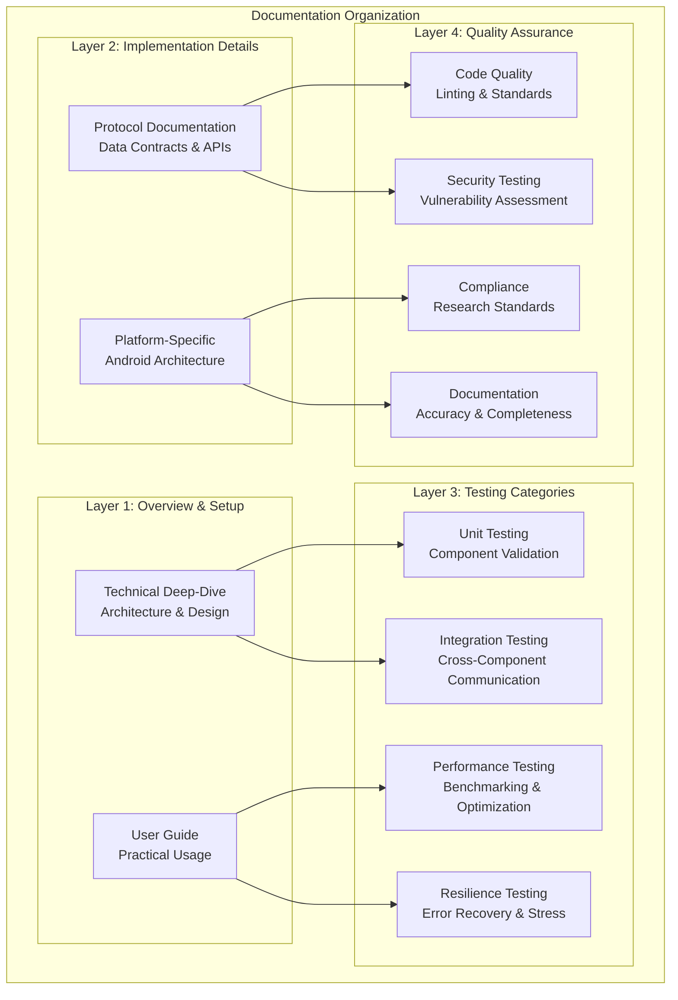

# Testing and Quality Assurance Framework - Documentation Index

## Overview

The Multi-Sensor Recording System implements a comprehensive, multi-layered testing strategy designed to ensure research-grade reliability across both Python and Android components. This documentation suite provides complete coverage of testing methodologies, quality assurance processes, and validation frameworks.

## Documentation Structure

### 📋 Core Documentation

#### [📖 README_testing_qa_framework.md](README_testing_qa_framework.md) - Technical Deep-Dive
**Audience**: Developers and System Architects  
**Purpose**: Comprehensive technical documentation of the testing framework architecture

**Key Contents**:
- Multi-layered testing architecture overview with Mermaid diagrams
- Python and Android testing infrastructure details
- Performance and resilience testing frameworks
- Quality assurance processes and standards
- Cross-platform integration testing protocols
- Research-grade reliability standards and metrics

#### [👥 USER_GUIDE_testing_qa_framework.md](USER_GUIDE_testing_qa_framework.md) - Practical Guide  
**Audience**: Researchers, Developers, and End-Users  
**Purpose**: Step-by-step practical guide for using the testing framework

**Key Contents**:
- Pre-flight checklist and environment setup
- Step-by-step testing workflows from basic to advanced
- Performance benchmarking and quality validation procedures
- Troubleshooting guides and best practices
- Research compliance and validation procedures
- Test result interpretation and analysis

#### [🛠 PROTOCOL_testing_qa_framework.md](PROTOCOL_testing_qa_framework.md) - Data Contract  
**Audience**: Developers and Integration Teams  
**Purpose**: Authoritative reference for data formats, APIs, and communication protocols

**Key Contents**:
- JSON schemas for test configuration and results
- Network communication protocols with message specifications
- Performance monitoring data contracts
- Quality assurance metrics schemas
- Error handling and recovery protocols
- Test reporting API specifications

### 📱 Platform-Specific Documentation

The platform-specific testing capabilities are now integrated within the main Testing and Quality Assurance Framework documentation above. Key Android testing features include:

**Android Testing Architecture**:
- Modern Android testing framework with base test classes (BaseUnitTest, BaseRobolectricTest, BaseInstrumentedTest)
- Test data factories and comprehensive test suites with SessionInfoTestFactory and UiStateTestFactory
- UI testing with Espresso and hardware integration testing capabilities
- Performance monitoring and stress testing capabilities
- CI/CD integration and quality gates

## Testing Framework Architecture



## Quick Navigation Guide

### For New Users
1. **Start Here**: [User Guide](USER_GUIDE_testing_qa_framework.md#quick-start-guide) - Basic setup and validation
2. **Environment Setup**: [User Guide - Pre-flight Checklist](USER_GUIDE_testing_qa_framework.md#pre-flight-checklist)
3. **First Test**: [User Guide - Step 1](USER_GUIDE_testing_qa_framework.md#step-1-quick-validation-essential-for-all-users)

### For Developers
1. **Architecture Overview**: [Technical Deep-Dive](README_testing_qa_framework.md#architecture-overview)
2. **Implementation Details**: [Technical Deep-Dive - Testing Strategy](README_testing_qa_framework.md#testing-strategy-by-component)
3. **Data Contracts**: [Protocol Documentation](PROTOCOL_testing_qa_framework.md#test-execution-protocol)

### For Researchers
1. **Research Standards**: [User Guide - Research Compliance](USER_GUIDE_testing_qa_framework.md#research-compliance-and-validation)
2. **Quality Validation**: [User Guide - Quality Assurance](USER_GUIDE_testing_qa_framework.md#step-5-quality-assurance-for-compliance-validation)
3. **Data Integrity**: [Technical Deep-Dive - Research-Grade Standards](README_testing_qa_framework.md#research-grade-reliability-standards)

### For System Administrators
1. **CI/CD Integration**: [Technical Deep-Dive - Continuous Integration](README_testing_qa_framework.md#continuous-integration-integration)
2. **Performance Monitoring**: [Protocol Documentation - Performance Monitoring](PROTOCOL_testing_qa_framework.md#performance-monitoring-protocol)
3. **Quality Gates**: [User Guide - Quality Gate Validation](USER_GUIDE_testing_qa_framework.md#quality-gate-validation)

## Testing Capabilities Summary

### ✅ Core Testing Features

### ✅ Core Testing Features

#### Multi-Layered Testing Strategy
- **Unit Tests**: Component-level validation for Python and Android with comprehensive coverage
- **Integration Tests**: Cross-component and cross-platform communication validation
- **Performance Tests**: Benchmarking, memory analysis, and optimization with threshold monitoring
- **Resilience Tests**: Error recovery, network failures, and stress scenarios with automatic validation
- **Quality Assurance**: Code quality, security, and compliance validation with audit trails

#### Research-Grade Reliability
- **Data Integrity**: Cryptographic checksums and corruption detection with automatic recovery
- **Temporal Accuracy**: Microsecond precision synchronization validation across devices
- **Reproducibility**: Deterministic test scenarios for consistent results in research environments
- **Compliance**: Research data management standard adherence with documentation
- **Audit Trail**: Comprehensive logging for research compliance and regulatory requirements

#### Advanced Testing Capabilities
- **Stress Testing**: High-load scenarios with up to 8 simulated Android devices and realistic data loads
- **Network Simulation**: Configurable latency (10ms-500ms), packet loss (0.1%-10%), and bandwidth constraints
- **Error Injection**: Systematic failure simulation for robustness validation with recovery testing
- **Performance Regression**: Automated detection of performance degradation with trend analysis
- **Cross-Platform Validation**: Complete PC-Android communication and coordination testing

#### Real-World Simulation Features
- **Physiological Data Generation**: Realistic GSR (2-20 μS), PPG (60-100 BPM), and motion sensor simulation
- **Device Behavior Modeling**: Battery constraints, memory limitations, and processing restrictions
- **Extended Session Testing**: Long-duration validation (up to 24 hours) for research compliance
- **Hardware Integration**: Shimmer3 sensor simulation and USB camera testing capabilities

### 🚀 Automation and Integration

#### Continuous Integration
- **Automated Test Execution**: Scheduled and trigger-based testing
- **Quality Gates**: Automated validation of coverage, performance, and security
- **Report Generation**: Comprehensive test reports with actionable insights
- **Alert Systems**: Automated notification for test failures and issues

#### Test Data Management
- **Synthetic Data**: Generated sensor data for consistent testing
- **Real Data Validation**: Actual sensor data validation scenarios
- **Edge Case Testing**: Boundary condition and error scenario validation
- **Data Integrity**: Checksum validation and corruption detection

## Implementation Status

### ✅ Completed Features
- [x] Comprehensive Python testing framework with pytest
- [x] Modern Android testing architecture with multiple test types
- [x] Cross-platform integration testing with PC-Android coordination
- [x] Performance monitoring and benchmarking capabilities
- [x] Network resilience testing with error injection
- [x] Data integrity validation and recovery mechanisms
- [x] Quality assurance processes with automated code quality checks
- [x] CI/CD integration with comprehensive reporting
- [x] Research-grade reliability standards and validation
- [x] Complete documentation suite with practical guides

### 🎯 Key Performance Metrics

#### System Reliability
- **Test Success Rate**: >95% across all test categories
- **Code Coverage**: >75% for Python, >80% for Android
- **Performance Benchmarks**: Response times <500ms (95th percentile)
- **Memory Usage**: <500MB during normal operation
- **Data Integrity**: <0.1% data loss during normal operation

#### Quality Standards
- **Security**: Zero high-severity vulnerabilities
- **Documentation**: 100% public API documentation coverage
- **Compliance**: Full research data management standard compliance
- **Maintainability**: Comprehensive test suite with clear documentation

## Usage Examples

### Quick Start
```bash
# Rapid system validation (5 minutes)
cd /home/runner/work/bucika_gsr/bucika_gsr/PythonApp
python run_quick_recording_session_test.py

# Comprehensive PC-Android integration testing (15 minutes)
python run_recording_session_test.py --duration 90 --devices 3 --save-logs --verbose

# Complete system validation with all test categories (60 minutes)
python run_complete_test_suite.py

# Android application testing with performance monitoring
cd ../AndroidApp
./run_comprehensive_android_tests.sh

# Performance benchmarking and coverage analysis
./gradlew performanceTest jacocoTestReport
```

### Advanced Testing Scenarios
```bash
# Multi-device stress testing (30 minutes)
python run_recording_session_test.py --stress-test --devices 8 --duration 300 --performance-bench

# Network resilience and error recovery testing (20 minutes)
python run_recording_session_test.py --error-simulation --network-issues --devices 4

# Long-duration stability testing (2-24 hours)
python run_recording_session_test.py --long-duration --health-check --memory-stress

# Quality assurance validation
python -m flake8 src/ --count --statistics
python -m mypy src/ --ignore-missing-imports
../gradlew lintDebug detekt jacocoCoverageVerification

# Security vulnerability scanning
python -m bandit -r src/ -f json -o security_report.json
```

## Support and Contributing

### Getting Help
- **Documentation Issues**: Check the troubleshooting sections in each guide
- **Test Failures**: Review the test result interpretation guides
- **Performance Issues**: Consult the performance benchmarking documentation
- **Integration Problems**: Use the cross-platform testing protocols

### Contributing to Testing Framework
1. **Follow Documentation Standards**: Use the established component-first approach
2. **Maintain Test Coverage**: Ensure new features include comprehensive tests
3. **Update Documentation**: Keep documentation synchronized with implementation
4. **Validate Quality Gates**: Ensure all quality standards are met
5. **Test Cross-Platform**: Validate both Python and Android components

This comprehensive testing and quality assurance framework ensures that the Multi-Sensor Recording System maintains research-grade reliability while supporting rapid development and enhancement of system capabilities.

---

**Framework Version**: 2.0 - Comprehensive Multi-Layered Testing  
**Documentation Updated**: January 2025  
**Compatibility**: Python 3.8+, Android API 24+, Research Standards Compliant