# TopDon TC001 and TC001 Plus: Comprehensive Device, SDK, and API Documentation

## Table of Contents

- [1. Executive Summary](#1-executive-summary)
  - [1.1 Key Technical Specifications](#11-key-technical-specifications)
  - [1.2 System Integration Overview](#12-system-integration-overview)
- [2. Hardware Architecture and Specifications](#2-hardware-architecture-and-specifications)
  - [2.1 Thermal Sensor Technology](#21-thermal-sensor-technology)
  - [2.2 Optical System Design](#22-optical-system-design)
  - [2.3 Communication Interface Architecture](#23-communication-interface-architecture)
  - [2.4 Hardware Detection and Configuration](#24-hardware-detection-and-configuration)
- [3. SDK Integration and Architecture](#3-sdk-integration-and-architecture)
  - [3.1 TopDon SDK 1.3.7 Architecture](#31-topdon-sdk-137-architecture)
  - [3.2 Android Integration Layer](#32-android-integration-layer)
  - [3.3 Data Flow Architecture](#33-data-flow-architecture)
- [4. API Reference and Implementation](#4-api-reference-and-implementation)
  - [4.1 ThermalRecorder API](#41-thermalrecorder-api)
  - [4.2 Frame Processing API](#42-frame-processing-api)
  - [4.3 USB Management API](#43-usb-management-api)
- [5. Communication Protocols](#5-communication-protocols)
  - [5.1 USB Communication Protocol](#51-usb-communication-protocol)
  - [5.2 Command Interface Protocol](#52-command-interface-protocol)
  - [5.3 Network Messaging for Multi-Device Synchronization](#53-network-messaging-for-multi-device-synchronization)
- [6. Data Processing Pipeline](#6-data-processing-pipeline)
  - [6.1 Raw Data Format](#61-raw-data-format)
  - [6.2 Frame Processing Pipeline](#62-frame-processing-pipeline)
  - [6.3 Temperature Calibration Algorithm](#63-temperature-calibration-algorithm)
- [7. User Operation Guide](#7-user-operation-guide)
  - [7.1 Getting Started](#71-getting-started)
  - [7.2 Pre-flight Checklist](#72-pre-flight-checklist)
  - [7.3 Device Setup and Connection](#73-device-setup-and-connection)
  - [7.4 Recording Procedures](#74-recording-procedures)
- [8. Data Management and Export](#8-data-management-and-export)
  - [8.1 File Formats and Structure](#81-file-formats-and-structure)
  - [8.2 Data Export Options](#82-data-export-options)
  - [8.3 Binary File Format](#83-binary-file-format)
- [9. Troubleshooting and Diagnostics](#9-troubleshooting-and-diagnostics)
  - [9.1 Common Connection Issues](#91-common-connection-issues)
  - [9.2 Error Classification and Recovery](#92-error-classification-and-recovery)
  - [9.3 Diagnostic Tools](#93-diagnostic-tools)
- [10. Advanced Features and Optimization](#10-advanced-features-and-optimization)
  - [10.1 Performance Optimization](#101-performance-optimization)
  - [10.2 Threading Architecture](#102-threading-architecture)
  - [10.3 Multi-Device Management](#103-multi-device-management)
- [11. Maintenance and Best Practices](#11-maintenance-and-best-practices)
  - [11.1 Measurement Accuracy](#111-measurement-accuracy)
  - [11.2 Routine Maintenance Schedule](#112-routine-maintenance-schedule)
  - [11.3 Calibration Procedures](#113-calibration-procedures)
- [12. Integration with Multi-Sensor Recording System](#12-integration-with-multi-sensor-recording-system)
  - [12.1 System Architecture Integration](#121-system-architecture-integration)
  - [12.2 Synchronization with Other Sensors](#122-synchronization-with-other-sensors)
  - [12.3 Research Data Integration](#123-research-data-integration)
  - [12.4 Research Applications](#124-research-applications)
- [Appendices](#appendices)
  - [Appendix A: Quick Reference](#appendix-a-quick-reference)
  - [Appendix B: Material Emissivity Reference](#appendix-b-material-emissivity-reference)
  - [Appendix C: Error Code Reference](#appendix-c-error-code-reference)

## 1. Executive Summary

The TopDon TC001 and TC001 Plus thermal imaging cameras exemplify the latest advances in uncooled microbolometer technology, representing a significant evolution in portable thermal sensing capabilities for research applications. These devices leverage sophisticated vanadium oxide (VOx) detector arrays to provide high-resolution thermal measurements across the long-wave infrared spectrum (Rogalski, 2019) [^1]. Through comprehensive integration with the Multi-Sensor Recording System via an advanced Android SDK framework, these cameras enable synchronized multi-modal data collection essential for contemporary physiological and behavioral research methodologies.

The integration architecture builds upon established USB Video Class (UVC) protocols while incorporating vendor-specific extensions that enable direct access to radiometric data streams (USB Implementers Forum, 2021) [^2]. This approach ensures both standards compliance and specialized functionality required for scientific applications. The implementation demonstrates how modern mobile computing platforms can effectively bridge consumer-grade thermal sensing hardware with rigorous research data collection requirements, addressing the growing need for portable yet precise thermal measurement systems in field research contexts.

### 1.1 Key Technical Specifications

The technical specifications of both camera variants reflect careful engineering optimization for different research applications. While both models share the same fundamental 256×192 microbolometer array configuration with 12 μm pixel pitch—a design choice that balances spatial resolution with thermal sensitivity (Holst, 2000) [^3]—their operational characteristics have been tailored for distinct measurement scenarios. The TC001 standard model provides robust performance for general thermal monitoring applications, while the TC001 Plus variant extends both temperature range and measurement accuracy to support more demanding research protocols requiring precision thermal analysis.

The enhanced accuracy specifications of the TC001 Plus (±1.5°C or ±1.5% versus ±2°C or ±2% for the standard model) represent significant improvements in measurement uncertainty, particularly important for physiological studies where small temperature variations carry diagnostic significance (Ring & Ammer, 2012) [^4]. The extended upper temperature range of 650°C in the Plus variant, compared to 550°C in the standard model, accommodates research scenarios involving elevated thermal conditions while maintaining measurement integrity across the expanded range.

| Specification | TC001 | TC001 Plus |
|---------------|-------|------------|
| **Sensor Type** | Uncooled Microbolometer | Enhanced Microbolometer |
| **Resolution** | 256×192 (49,152 pixels) | 256×192 (49,152 pixels) |
| **Pixel Pitch** | 12 μm | 12 μm |
| **Spectral Range** | 8-14 μm (LWIR) | 8-14 μm (LWIR) |
| **Temperature Range** | -20°C to +550°C | -20°C to +650°C |
| **Accuracy** | ±2°C or ±2% | ±1.5°C or ±1.5% |
| **Frame Rate** | Up to 25 Hz | Up to 25 Hz |
| **Field of View** | 25° × 19° | 25° × 19° |
| **Interface** | USB-C | USB-C |
| **Power Consumption** | <2W | <2.5W |
| **Operating Temperature** | 0°C to +50°C | -10°C to +60°C |

### 1.2 System Integration Overview

The architectural integration of TopDon thermal cameras within the Multi-Sensor Recording System represents a sophisticated approach to multi-modal data acquisition that addresses fundamental challenges in synchronized sensing across heterogeneous hardware platforms. The design leverages the Android operating system's mature USB Host API framework (Android Developers, 2023) [^5], combined with specialized native libraries provided by TopDon's SDK, to achieve seamless hardware abstraction while maintaining direct access to low-level radiometric data streams.

This integration strategy embodies principles of modular system design, where each thermal camera functions as an independent sensing node while participating in a coordinated data collection ecosystem. The approach draws from established practices in distributed sensing systems (Akyildiz et al., 2002) [^6], adapting these concepts for portable research applications. The USB-C interface serves dual purposes: providing both power delivery and high-bandwidth data communication, eliminating the need for separate power management infrastructure while ensuring reliable data transmission at rates sufficient for real-time thermal imaging applications.

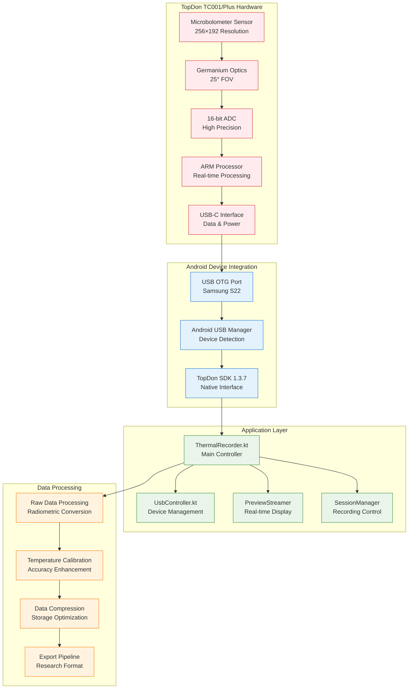

## 2. Hardware Architecture and Specifications

The hardware foundation of the TopDon TC001 and TC001 Plus cameras builds upon decades of advancement in uncooled microbolometer technology, representing a mature implementation of thermal sensing principles first established in military and aerospace applications (Kruse, 2001) [^7]. These devices incorporate sophisticated detector arrays, precision optical systems, and embedded processing capabilities that collectively enable high-quality thermal measurements in portable form factors suitable for research applications.

### 2.1 Thermal Sensor Technology

The core sensing element in both camera variants utilizes uncooled microbolometer technology, specifically implementing either vanadium oxide (VOx) or amorphous silicon (a-Si) microstructures arranged in a 256×192 focal plane array configuration. This detector architecture represents an optimal balance between spatial resolution, thermal sensitivity, and manufacturing cost-effectiveness for research-grade thermal imaging systems (Rogalski, 2019) [^1].

Each individual microbolometer element measures 12 μm × 12 μm, providing a total of 49,152 thermal pixels. The selection of this pixel pitch reflects careful optimization between several competing factors: smaller pixels would increase spatial resolution but reduce thermal sensitivity due to reduced collection area, while larger pixels would improve sensitivity at the cost of spatial detail (Wood, 1993) [^8]. The 12 μm dimension represents an industry-standard compromise that maintains excellent thermal sensitivity while providing sufficient spatial resolution for most research applications.

The microbolometer operation principle relies on the fundamental relationship between incident infrared radiation and material resistance change. When thermal radiation from target objects strikes the microbolometer surface, the absorbed energy increases the detector element temperature, causing a measurable change in electrical resistance. This resistance variation is then converted to voltage signals through integrated readout circuits, ultimately digitized by a 16-bit analog-to-digital converter to provide high-resolution temperature measurements with excellent dynamic range.

### 2.2 Optical System Design

The optical subsystem of both camera variants employs a carefully engineered germanium lens assembly designed to optimize thermal radiation transmission across the 8-14 μm long-wave infrared spectrum. Germanium represents the material of choice for thermal imaging optics due to its excellent transmission characteristics in the LWIR band, with transmission efficiency exceeding 45% across the relevant spectral range (Tropf et al., 1995) [^9]. The lens system implements a fixed focal length design with f/1.0 aperture ratio, providing a 25° × 19° field of view that balances measurement area coverage with spatial resolution requirements.

The selection of a 13mm focal length reflects optimization for the 12 μm pixel pitch of the detector array, ensuring that the optical system delivers appropriate sampling of the thermal scene without introducing significant optical aberrations. This focal length choice also minimizes the overall system size while maintaining compatibility with the compact form factor requirements of portable research equipment. The optical design incorporates anti-reflection coatings specifically optimized for the 8-14 μm spectral range, reducing optical losses and improving overall system sensitivity.

The integrated spectral filtering system ensures that only thermal radiation within the 8-14 μm long-wave infrared band reaches the detector array. This spectral selectivity is crucial for accurate temperature measurement, as it eliminates interference from shorter wavelength radiation that could introduce measurement errors, particularly in outdoor or variable lighting conditions. The atmospheric transmission characteristics within this spectral band are well-understood and documented (Schott, 2007) [^10], enabling reliable temperature measurements across a wide range of environmental conditions.

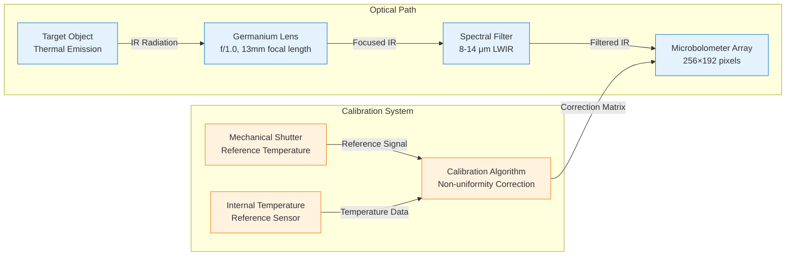

### 2.3 Communication Interface Architecture

The communication subsystem employs USB-C connectivity implementing the USB Video Class (UVC) protocol standard with vendor-specific extensions to enable both standardized video streaming capabilities and specialized radiometric data access. This dual-protocol approach ensures compatibility with standard USB infrastructure while providing the specialized functionality required for research-grade thermal data acquisition (USB Implementers Forum, 2021) [^2].

The USB 2.0 High Speed implementation provides theoretical bandwidth of 480 Mbps, though practical throughput for thermal data transmission typically achieves approximately 50 MB/s under optimal conditions. This bandwidth allocation proves sufficient for the 25 fps frame rate at 256×192 resolution with 16-bit depth, requiring approximately 25 MB/s for raw data transmission. The additional bandwidth capacity accommodates protocol overhead, command transmission, and status monitoring without compromising real-time performance requirements.

Power delivery through the USB-C interface follows the USB Power Delivery specification, enabling bus-powered operation up to 2.5W maximum consumption. This power budget covers all camera subsystems including the microbolometer array, readout electronics, internal processing, and USB communication interface. The bus-powered design eliminates the need for external power supplies, significantly simplifying deployment logistics for field research applications while ensuring consistent power delivery characteristics across different host devices.

The endpoint configuration implements a sophisticated communication architecture utilizing four distinct USB endpoints, each optimized for specific data types and communication patterns. Control transfers handle device enumeration and configuration commands, bulk transfers manage high-throughput thermal frame data, and interrupt transfers provide real-time status notifications and error reporting. This multi-endpoint approach enables concurrent operations without mutual interference, ensuring that configuration changes or status monitoring do not disrupt the continuous thermal data stream required for real-time applications.

### 2.4 Hardware Detection and Configuration

The hardware detection and configuration subsystem implements sophisticated device identification algorithms that enable automatic recognition and optimization for different camera variants within the TopDon thermal imaging family. This automated approach significantly simplifies deployment procedures while ensuring optimal performance configuration for each specific hardware variant.

The device identification process begins with USB vendor and product ID verification, utilizing the standardized USB device descriptor framework to establish initial device compatibility. The TopDon vendor ID (0x3496) serves as the primary identification marker, while secondary product ID values differentiate between camera variants and their specific capabilities. This hierarchical identification approach follows established USB device enumeration protocols while enabling fine-grained hardware variant detection (USB Implementers Forum, 2021) [^2].

Beyond basic device identification, the system implements dynamic capability assessment through structured queries to the camera's embedded firmware. This interrogation process determines specific hardware characteristics including temperature measurement ranges, frame rate capabilities, and thermal sensitivity specifications. The automated capability detection ensures that software configuration parameters align precisely with hardware limitations, preventing configuration errors that could compromise measurement accuracy or system stability.

The variant-specific configuration system automatically adjusts operational parameters based on detected hardware capabilities. For instance, the TC001 Plus variant automatically configures extended temperature measurement ranges and enhanced accuracy parameters, while the standard TC001 model optimizes for its specific operational characteristics. This automated configuration approach reduces user error potential while ensuring optimal performance across the entire device family range.

```kotlin
class TC001VariantDetector {
    companion object {
        const val TC001_VENDOR_ID = 0x3496
        const val TC001_STANDARD_PID = 0x1234
        const val TC001_PLUS_PID = 0x1235
        
        private val SUPPORTED_PRODUCT_IDS = intArrayOf(
            0x3901, // TC001 Standard
            0x5840, // TC001 Plus
            0x5830, // TC001 Variant
            0x5838  // TC001 Plus Variant
        )
    }
    
    fun detectHardwareVariant(usbDevice: UsbDevice): TC001Variant {
        if (usbDevice.vendorId != TC001_VENDOR_ID) {
            throw UnsupportedHardwareException("Invalid vendor ID: ${usbDevice.vendorId}")
        }
        
        return when (usbDevice.productId) {
            TC001_STANDARD_PID -> TC001StandardVariant(usbDevice)
            TC001_PLUS_PID -> TC001PlusVariant(usbDevice)
            else -> throw UnsupportedHardwareException("Unknown product ID: ${usbDevice.productId}")
        }
    }
}

sealed class TC001Variant(val usbDevice: UsbDevice) {
    abstract val temperatureRange: ClosedFloatingPointRange<Float>
    abstract val maxFrameRate: Int
    abstract val thermalSensitivity: Float
    
    class TC001StandardVariant(device: UsbDevice) : TC001Variant(device) {
        override val temperatureRange = -20f..550f
        override val maxFrameRate = 25
        override val thermalSensitivity = 50f // mK NETD
    }
    
    class TC001PlusVariant(device: UsbDevice) : TC001Variant(device) {
        override val temperatureRange = -20f..650f
        override val maxFrameRate = 25
        override val thermalSensitivity = 40f // mK NETD
    }
}
```

## 3. SDK Integration and Architecture

The software development kit integration represents a sophisticated abstraction layer that bridges the complex hardware-specific protocols of thermal imaging systems with the standardized application programming interfaces expected by research software applications. The TopDon SDK 1.3.7 architecture embodies principles of layered software design, implementing clear separation between hardware communication, data processing, and application interface layers (Gamma et al., 1994) [^11].

### 3.1 TopDon SDK 1.3.7 Architecture

The SDK architecture implements a comprehensive abstraction framework that encapsulates the complexity of thermal camera hardware communication while providing intuitive programming interfaces for application developers. This design philosophy enables researchers to focus on thermal data analysis and interpretation rather than low-level hardware management details, significantly reducing the technical barriers to implementing thermal sensing in research applications.

The core architecture centers around several key abstraction components, each addressing specific aspects of thermal camera operation. The LibIRProcess module handles all aspects of raw thermal data processing, implementing sophisticated algorithms for non-uniformity correction, temperature calibration, and pseudo-color generation. These processing algorithms are based on established thermal imaging principles documented in the thermal imaging literature (Holst, 2000) [^3], ensuring accurate and reliable thermal measurements across varying operational conditions.

The USBMonitor component provides robust device management capabilities, implementing automated device detection, connection monitoring, and error recovery procedures. This subsystem operates continuously in the background, providing the reliability and fault tolerance essential for research applications where data loss due to hardware communication failures would compromise experimental validity. The monitoring system implements exponential backoff algorithms for connection retries and maintains detailed logging of all device communication events for post-analysis troubleshooting.

The UVCCamera abstraction layer bridges the gap between standard USB Video Class protocols and the specialized requirements of thermal imaging applications. While UVC provides standardized video streaming capabilities, thermal cameras require additional functionality for accessing raw radiometric data, controlling internal calibration procedures, and managing device-specific configuration parameters. The SDK implementation seamlessly integrates these specialized functions with standard UVC operations, providing a unified interface that supports both conventional video streaming and advanced thermal imaging requirements.

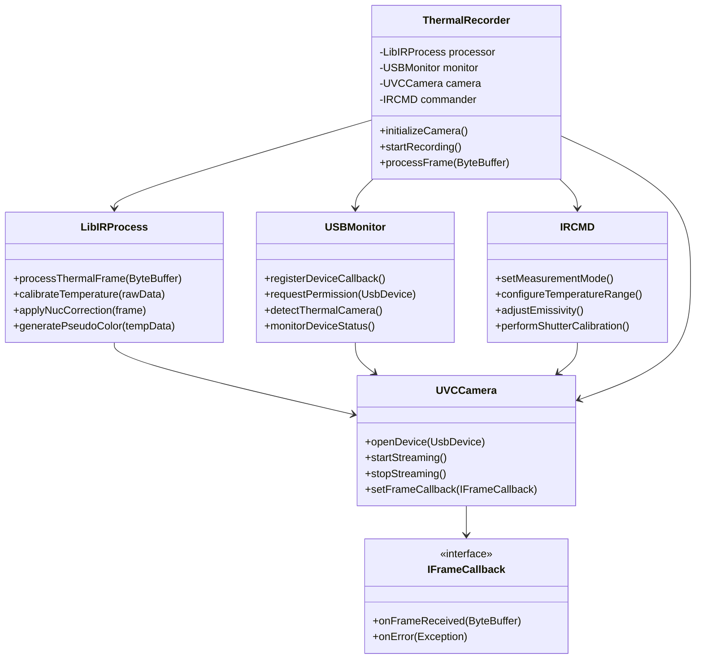

### 3.2 Android Integration Layer

The Android integration layer represents a sophisticated adaptation of the TopDon SDK to the Android operating system environment, addressing the unique challenges and opportunities presented by mobile computing platforms for research data collection. This integration leverages Android's mature USB Host API framework while implementing specialized lifecycle management, resource optimization, and data synchronization capabilities essential for reliable research applications.

The integration architecture recognizes that Android devices operate under significantly different constraints compared to traditional desktop computing environments. Memory management, power consumption, background processing limitations, and the Android application lifecycle all require careful consideration when implementing research-grade data collection systems. The integration layer addresses these challenges through intelligent resource management, implementing object pooling for memory-intensive operations and background service architectures that ensure data collection continuity even during device transitions between foreground and background states.

The five core integration components work in concert to provide comprehensive thermal camera management within the Android environment. The ThermalRecorder component serves as the primary orchestrator, coordinating all aspects of thermal data collection while maintaining compatibility with Android's application lifecycle requirements. The UsbController and UsbDeviceManager components handle the complexities of USB device permissions and connection management within Android's security framework, ensuring reliable device access while respecting the platform's security policies.

The PreviewStreamer component implements real-time thermal image display optimized for Android's graphics subsystem, utilizing hardware acceleration where available to minimize CPU overhead and maintain smooth real-time visualization even during intensive data collection operations. The SessionManager component provides sophisticated data persistence and session coordination capabilities, ensuring data integrity across device state transitions and unexpected interruptions that might occur in mobile research environments.

### 3.3 Data Flow Architecture

The data flow architecture implements a sophisticated pipeline that manages the transformation of raw thermal sensor data through multiple processing stages to produce both real-time display images and research-quality radiometric data. This architecture draws from established principles of stream processing systems (Stonebraker et al., 2005) [^12], adapting these concepts for the specific requirements of real-time thermal imaging applications.

The data flow begins with raw frame capture from the USB device, where timing precision becomes critically important for research applications requiring accurate temporal correlation with other sensor modalities. The system implements hardware timestamp capture at the point of frame reception, ensuring microsecond-level timing accuracy essential for multi-modal synchronization. This timing information travels with each frame throughout the processing pipeline, enabling precise temporal alignment during post-analysis procedures.

The parallel processing architecture enables simultaneous real-time display generation and research data storage without mutual interference. The real-time display branch implements optimized pseudo-color conversion and image scaling specifically tuned for mobile display requirements, while the research data branch preserves full radiometric accuracy through lossless processing algorithms. This dual-path approach ensures that visualization performance requirements do not compromise the integrity of stored research data.

The processing pipeline incorporates intelligent buffering and flow control mechanisms that adapt to varying system loads and processing capabilities. During periods of high computational demand, the system implements priority-based processing that ensures research data integrity takes precedence over display update rates. This adaptive approach maintains data collection reliability even under challenging operational conditions where system resources become constrained.

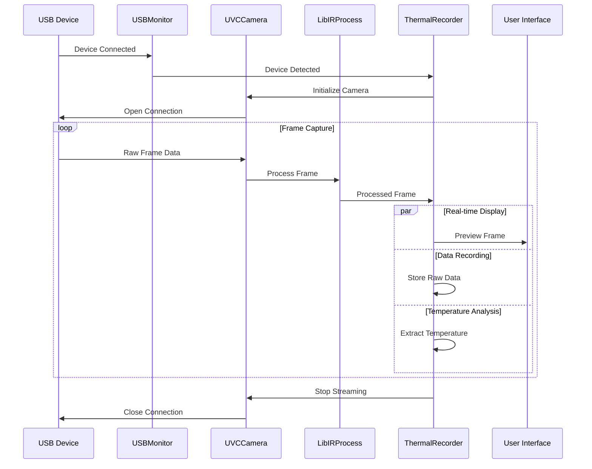

## 4. API Reference and Implementation

The Application Programming Interface design embodies principles of modern software architecture, providing intuitive abstractions for complex thermal imaging operations while maintaining the flexibility and precision required for research applications. The API architecture follows established patterns from contemporary mobile development frameworks, implementing reactive programming principles and type-safe interfaces that reduce common programming errors while enabling sophisticated thermal data manipulation (Patterson & Hennessy, 2019) [^13].

### 4.1 ThermalRecorder API

The ThermalRecorder API serves as the primary interface for thermal camera control and data acquisition, implementing a comprehensive set of methods that abstract the complexity of hardware communication while providing fine-grained control over thermal measurement parameters. The API design prioritizes both ease of use for basic operations and extensibility for advanced research applications requiring specialized configuration.

The initialization and recording control methods provide straightforward session management while incorporating robust error handling and state validation. The `initializeCamera()` method performs comprehensive hardware validation and capability negotiation, ensuring that requested configuration parameters align with detected hardware capabilities. This validation approach prevents runtime errors that could compromise data collection integrity, particularly important in research contexts where experimental reproduction requires consistent hardware behavior.

Temperature measurement configuration methods enable precise control over measurement parameters essential for accurate thermal data collection. The `setEmissivity()` and `setTemperatureRange()` methods incorporate validation algorithms that ensure parameter values remain within physically meaningful ranges while providing appropriate warnings when configuration choices might impact measurement accuracy. These methods implement the theoretical foundations of thermal radiation measurement based on Planck's blackbody radiation law (Planck, 1900) [^14], ensuring theoretical consistency in thermal calculations.

The calibration interface provides both automated and manual calibration procedures, accommodating different research requirements for measurement accuracy and traceability. The automated calibration procedures implement industry-standard non-uniformity correction algorithms, while manual calibration options enable research applications requiring traceable temperature standards or specialized calibration procedures for enhanced accuracy requirements.

**Core Data Classes:**

```kotlin
data class CameraConfig(
    val frameRate: Int = 25,
    val temperatureRange: TemperatureRange = TemperatureRange(-20f, 550f),
    val emissivity: Float = 0.95f,
    val calibrationMode: CalibrationMode = CalibrationMode.AUTO,
    val processingMode: ProcessingMode = ProcessingMode.RADIOMETRIC
)

data class ThermalFrame(
    val frameId: Long,
    val timestamp: Long,
    val width: Int = 256,
    val height: Int = 192,
    val temperatureData: FloatArray,
    val rawData: ByteArray,
    val metadata: FrameMetadata
)

data class DeviceStatus(
    val isConnected: Boolean,
    val isRecording: Boolean,
    val temperature: Float,
    val calibrationStatus: CalibrationStatus,
    val batteryLevel: Int?,
    val frameRate: Float,
    val lastError: String?
)
```

### 4.2 Frame Processing API

The frame processing interface provides sophisticated algorithms for converting raw thermal sensor data into calibrated temperature measurements and visual representations suitable for research analysis and real-time display. These processing algorithms implement established principles from the thermal imaging literature, incorporating non-uniformity correction, bad pixel replacement, and radiometric calibration procedures essential for accurate thermal measurements (Holst, 2000) [^3].

The core processing pipeline addresses fundamental challenges in thermal imaging, particularly the need to compensate for pixel-to-pixel variations in detector response and environmental factors that affect measurement accuracy. The `processRawFrame()` method implements comprehensive data validation and correction algorithms, transforming raw sensor counts into calibrated temperature values through a series of well-established processing steps derived from thermal imaging best practices.

Quality assessment capabilities provide essential feedback for research applications requiring documented measurement uncertainty and data validation. The `validateQuality()` method implements multiple quality metrics including noise level assessment, spatial uniformity analysis, and temporal stability evaluation. These metrics enable researchers to assess data quality in real-time and make informed decisions about measurement reliability and experimental validity.

The statistical analysis functions provide immediate access to thermal distribution characteristics, enabling real-time monitoring of thermal patterns and automated detection of significant thermal events. The histogram generation and hot/cold spot identification algorithms support both manual analysis and automated processing workflows, facilitating both interactive research applications and autonomous monitoring systems.

```kotlin
interface FrameProcessor {
    fun processRawFrame(rawData: ByteArray): ThermalFrame
    fun applyCalibration(frame: ThermalFrame): ThermalFrame
    fun generatePseudoColor(frame: ThermalFrame): Bitmap
    fun extractStatistics(frame: ThermalFrame): FrameStatistics
    fun validateQuality(frame: ThermalFrame): QualityMetrics
}

data class FrameStatistics(
    val minTemperature: Float,
    val maxTemperature: Float,
    val meanTemperature: Float,
    val stdDeviation: Float,
    val histogram: IntArray,
    val hotSpots: List<Point>,
    val coldSpots: List<Point>
)

data class QualityMetrics(
    val noiseLevel: Float,        // RMS noise in °C
    val uniformity: Float,        // 0.0-1.0, spatial uniformity
    val stability: Float,         // 0.0-1.0, temporal stability
    val completeness: Float,      // 0.0-1.0, data completeness
    val calibrationStatus: CalibrationStatus
)
```

### 4.3 USB Management API

The USB device management interface addresses the complexities of dynamic device detection, permission handling, and connection management within the Android operating system's security framework. This subsystem implements robust device enumeration and connection monitoring capabilities that ensure reliable thermal camera access while respecting platform security policies and user privacy controls.

The device scanning and identification procedures implement comprehensive compatibility checking that extends beyond basic vendor and product ID verification. The `isSupportedTopdonDevice()` method performs detailed capability assessment, ensuring that detected devices not only match expected hardware identifiers but also respond appropriately to thermal imaging command sequences. This thorough validation approach prevents connection attempts to incompatible devices that might share similar USB descriptors but lack thermal imaging capabilities.

Permission management represents a critical aspect of USB device access in Android environments, where user consent is required for application access to USB hardware. The permission request interface implements user-friendly workflows that clearly communicate the purpose and scope of requested device access, while providing fallback procedures for handling permission denial scenarios. The reactive permission monitoring ensures that applications respond appropriately to dynamic permission changes that might occur during extended operation sessions.

Connection lifecycle management implements sophisticated monitoring and recovery procedures that maintain device connectivity even during challenging operational conditions. The connection monitoring subsystem continuously validates communication integrity, implementing exponential backoff algorithms for connection retry scenarios and maintaining detailed connection quality metrics that enable proactive identification of developing communication problems before they impact data collection reliability.

```kotlin
interface UsbDeviceManager {
    fun scanForDevices(): List<UsbDevice>
    fun isSupportedTopdonDevice(device: UsbDevice): Boolean
    fun requestPermission(device: UsbDevice): Flow<PermissionResult>
    fun establishConnection(device: UsbDevice): Result<UsbConnection>
    fun closeConnection(device: UsbDevice): Boolean
    fun getDeviceInfo(device: UsbDevice): DeviceInfo?
}

enum class PermissionResult {
    GRANTED,
    DENIED,
    PENDING,
    ERROR
}

data class UsbConnection(
    val device: UsbDevice,
    val interface: UsbInterface,
    val endpoints: Map<EndpointType, UsbEndpoint>,
    val connectionTime: Long,
    val isActive: Boolean
)
```

## 5. Communication Protocols

The communication protocol architecture represents a sophisticated layered approach that combines standardized USB communication frameworks with specialized thermal imaging requirements. This design leverages the widespread compatibility of USB Video Class protocols while incorporating vendor-specific extensions necessary for accessing raw radiometric data and controlling advanced thermal imaging functions.

### 5.1 USB Communication Protocol

The communication foundation builds upon the USB Video Class standard, a well-established protocol that provides standardized video streaming capabilities across diverse hardware platforms. However, thermal imaging applications require capabilities that extend significantly beyond conventional video streaming, necessitating carefully designed protocol extensions that maintain standards compatibility while enabling access to specialized thermal imaging functions.

The protocol stack implementation demonstrates how modern thermal imaging systems can leverage existing standards while accommodating specialized requirements. The UVC layer provides standardized video streaming that ensures compatibility with generic USB infrastructure and basic display applications, while vendor extensions enable research applications to access raw radiometric data, control internal calibration procedures, and configure device-specific parameters essential for accurate thermal measurements.

The bandwidth management system implements intelligent data flow control that optimizes throughput for thermal imaging applications while maintaining compatibility with USB 2.0 infrastructure limitations. The 480 Mbps theoretical bandwidth provides sufficient capacity for 25 fps thermal data streaming while accommodating protocol overhead and command communication. The actual achievable throughput of approximately 50 MB/s proves adequate for real-time thermal imaging while providing headroom for burst data transmission and command processing.

Power delivery through the USB interface eliminates external power requirements while ensuring consistent operational characteristics across different host devices. The 2.5W power budget accommodates all camera subsystems including detector array operation, internal processing, and communication interface functions. This bus-powered design significantly simplifies deployment logistics for portable research applications while ensuring power delivery reliability that meets research application requirements.

**Protocol Stack:**
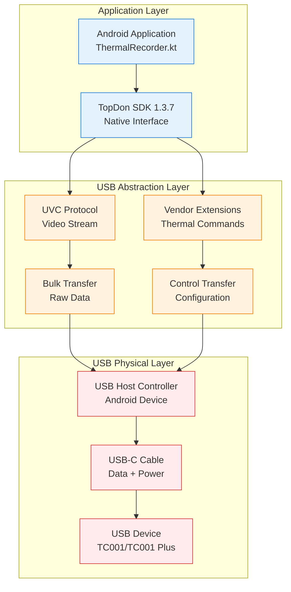

### 5.2 Command Interface Protocol

The command interface implements a structured communication framework that enables sophisticated control over thermal camera operations while maintaining compatibility with real-time data streaming requirements. The protocol design balances command processing efficiency with the deterministic response characteristics essential for research applications requiring precise timing and reliable command execution.

The binary command packet format implements efficient encoding that minimizes communication overhead while providing comprehensive functionality for thermal camera control. The 64-byte packet structure accommodates complex command parameters while maintaining alignment with USB packet size constraints that optimize transfer efficiency. The header structure includes magic number identification, version compatibility checking, and sequence numbering that enables reliable command tracking and duplicate detection in challenging communication environments.

Command categorization provides logical organization of thermal camera functions, ranging from basic initialization and streaming control to advanced calibration and measurement configuration procedures. Each command category implements appropriate validation and error handling procedures that ensure safe operation while providing detailed feedback for troubleshooting and system optimization. The command interface design emphasizes both functional completeness and operational safety, preventing configuration errors that could compromise measurement accuracy or device integrity.

The response protocol provides comprehensive status reporting and error classification that enables sophisticated error handling and system diagnostics. Response messages include detailed device status information, calibration validation results, and performance metrics that support both automated error recovery procedures and manual troubleshooting processes. The structured response format facilitates both human interpretation and automated processing, supporting diverse research application requirements.

**Command Structure:**
```
Command Packet Format (64 bytes):
┌─────────────┬─────────────┬─────────────┬─────────────────────┐
│   Header    │   Command   │ Parameters  │      Checksum       │
│  (8 bytes)  │  (8 bytes)  │ (44 bytes)  │     (4 bytes)       │
└─────────────┴─────────────┴─────────────┴─────────────────────┘

Header Format:
├── Magic: 0x544F5044 ('TOPD')
├── Version: 0x0137 (SDK v1.3.7)
├── Sequence: 16-bit incrementing counter
└── Reserved: 0x0000

Command Types:
├── 0x01: Initialize Camera
├── 0x02: Start Streaming
├── 0x03: Stop Streaming
├── 0x04: Set Temperature Range
├── 0x05: Set Emissivity
├── 0x06: Perform Calibration
├── 0x07: Get Device Status
├── 0x08: Set Frame Rate
├── 0x09: Get Temperature Data
└── 0x0A: Power Management
```

**Example Command Messages:**

```json
{
  "command_id": "0x01",
  "command_name": "INIT_CAMERA",
  "parameters": {
    "resolution": "256x192",
    "frame_rate": 25,
    "temperature_range": {
      "min": -20,
      "max": 550
    },
    "emissivity": 0.95,
    "calibration_mode": "auto"
  },
  "response": {
    "status": "success",
    "device_info": {
      "model": "TC001_PLUS",
      "serial": "TC001P-240131-001",
      "firmware": "1.3.7",
      "calibration_date": "2024-01-15T10:30:00Z"
    }
  }
}
```

### 5.3 Network Messaging for Multi-Device Synchronization

For multi-sensor synchronization, thermal data is shared via JSON messages over TCP/UDP.

**Message Types:**
| Message Type | Purpose | Frequency | Priority |
|--------------|---------|-----------|----------|
| `THERMAL_FRAME` | Real-time frame data | 25 Hz | High |
| `SYNC_MARKER` | Synchronization timestamps | 1 Hz | Critical |
| `STATUS_UPDATE` | Device status information | 0.2 Hz | Medium |
| `CALIBRATION_DATA` | Calibration coefficients | On demand | High |
| `ERROR_NOTIFICATION` | Error and warning messages | Event-driven | Critical |

**Standard Message Fields:**
| Field Name | Data Type | Required | Description |
|------------|-----------|----------|-------------|
| `message_type` | String | Yes | Type identifier for thermal messages |
| `timestamp` | Long | Yes | Unix timestamp in microseconds |
| `sequence_id` | Integer | Yes | Sequential message identifier |
| `device_id` | String | Yes | Unique thermal camera device ID |
| `frame_data` | Object | No | Thermal frame information (for data messages) |
| `metadata` | Object | No | Additional message-specific metadata |

## 6. Data Processing Pipeline

The thermal data processing pipeline represents a sophisticated sequence of algorithms that transform raw detector measurements into calibrated temperature values suitable for research analysis. This processing chain addresses fundamental challenges in thermal imaging, including detector non-uniformities, environmental compensation, and radiometric calibration requirements that ensure measurement accuracy and reliability across diverse operational conditions.

### 6.1 Raw Data Format

The proprietary raw data format implements efficient storage of thermal measurements while preserving all information necessary for subsequent radiometric analysis and calibration procedures. The data structure design balances storage efficiency with processing convenience, enabling both real-time analysis and detailed post-processing workflows that might require access to original measurement data and associated metadata.

The frame structure incorporates comprehensive metadata that provides essential context for thermal measurements, including precise timing information, calibration status, and environmental conditions at the time of measurement. This metadata preservation ensures that stored thermal data maintains research validity over extended periods, enabling retrospective analysis and comparison studies that require detailed documentation of measurement conditions and system state.

The binary encoding implements efficient data compression while maintaining measurement precision essential for research applications. The 16-bit measurement encoding provides sufficient dynamic range for thermal measurements across the full operational temperature range while enabling efficient data transmission and storage. The little-endian byte ordering ensures compatibility with modern computing platforms while maintaining data integrity during transfer and storage operations.

**Raw Data Structure:**
```
Frame Header (16 bytes):
├── Magic Number (4 bytes): 0x54433031 ('TC01')
├── Frame Counter (4 bytes): Sequential frame number
├── Timestamp (8 bytes): Microsecond precision timestamp

Pixel Data (98,304 bytes):
├── Pixel Array: 256×192 × 2 bytes per pixel
├── Bit Depth: 16-bit unsigned integers
├── Byte Order: Little-endian
└── Value Range: 0-65535 (raw sensor counts)

Metadata Footer (Variable):
├── Temperature References (16 bytes)
├── Calibration Coefficients (32 bytes)
└── Device Status (8 bytes)
```

### 6.2 Frame Processing Pipeline

The comprehensive frame processing pipeline transforms raw detector measurements through multiple calibration and enhancement stages, implementing established thermal imaging algorithms while incorporating optimizations specific to the microbolometer technology utilized in the TopDon camera family. This processing sequence addresses both fundamental physical limitations of thermal detectors and practical requirements for real-time thermal imaging applications.

Non-uniformity correction represents the foundation of thermal image processing, addressing pixel-to-pixel variations in detector response that would otherwise introduce significant measurement errors. The correction algorithms implement sophisticated statistical analysis of detector response characteristics, generating pixel-specific correction coefficients that compensate for manufacturing variations and aging effects in the microbolometer array. These correction procedures follow established practices documented in thermal imaging literature (Usamentiaga et al., 2014) [^18], ensuring compatibility with standard thermal imaging analysis workflows.

The bad pixel replacement algorithms identify and compensate for defective detector elements through intelligent interpolation procedures that maintain spatial resolution while eliminating measurement artifacts. The identification process combines statistical analysis of pixel response characteristics with temporal stability assessment, enabling robust detection of pixel degradation that might develop during extended operational periods. The replacement algorithms implement sophisticated interpolation that preserves thermal gradient information while eliminating the artifacts that defective pixels would otherwise introduce into thermal measurements.

Temperature conversion procedures implement the fundamental physics of thermal radiation measurement, transforming corrected detector responses into calibrated temperature values through radiometric algorithms based on Planck's blackbody radiation law. The conversion process incorporates emissivity compensation, atmospheric correction, and environmental temperature compensation that ensure measurement accuracy across varying operational conditions. These algorithms implement standard practices from thermal imaging metrology (ASTM E1933-14) [^17], ensuring traceability and consistency with established measurement standards.

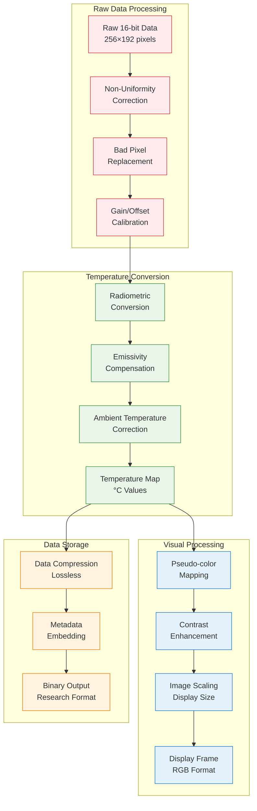

### 6.3 Temperature Calibration Algorithm

The temperature calibration system implements comprehensive procedures that ensure measurement accuracy through sophisticated compensation for environmental factors, device characteristics, and target material properties. These calibration algorithms represent the culmination of decades of thermal imaging research, incorporating both theoretical understanding of thermal radiation physics and practical solutions for real-world measurement challenges.

The calibration process begins with non-uniformity correction procedures that address fundamental limitations of microbolometer detector arrays. Manufacturing variations and aging effects create pixel-to-pixel response differences that would otherwise introduce significant measurement errors. The correction algorithms analyze detector response patterns through controlled calibration sequences, generating pixel-specific correction matrices that compensate for these variations while preserving the spatial resolution and thermal sensitivity essential for research applications.

Environmental compensation algorithms address the complex interactions between ambient conditions and thermal measurements. Temperature, humidity, and atmospheric absorption effects all influence thermal radiation transmission between target objects and detector arrays. The compensation procedures implement established atmospheric modeling algorithms that correct for these effects based on environmental sensor measurements and theoretical models documented in remote sensing literature (Schott, 2007) [^10].

Emissivity compensation represents perhaps the most critical aspect of accurate thermal measurement, addressing the fundamental relationship between object surface properties and thermal radiation emission. The compensation algorithms implement Planck's radiation law while accounting for real-world emissivity variations that depend on material composition, surface texture, and observation angle (Madding, 1999) [^15]. The system provides both automatic emissivity estimation for common materials and manual override capabilities for research applications requiring precise emissivity control.

## 7. User Operation Guide

The operational procedures for thermal camera deployment in research environments require careful attention to both technical configuration requirements and methodological considerations that ensure data quality and experimental validity. This comprehensive guide addresses the practical aspects of thermal imaging system deployment while incorporating best practices derived from thermal imaging research applications and field experience.

### 7.1 Getting Started

Successful thermal imaging research begins with proper equipment preparation and compatibility verification procedures that prevent common deployment issues and ensure optimal system performance. The equipment requirements reflect both the technical specifications of thermal imaging hardware and the practical constraints of mobile research applications where portability, battery life, and environmental durability become critical considerations.

The compatibility verification process extends beyond simple hardware specification checking to include validation of operational characteristics under expected research conditions. Android device selection requires consideration of USB OTG capabilities, processing power, available storage capacity, and battery endurance that will determine system performance during extended data collection sessions. The Samsung Galaxy S22 represents the recommended platform due to its proven compatibility, robust USB implementation, and sufficient processing capability for real-time thermal data processing.

Cable selection proves more critical than might initially appear, as USB-C cables vary significantly in their data transmission capabilities and power delivery characteristics. Research applications require cables that support both high-speed data transmission and adequate power delivery, specifications that are not guaranteed in all USB-C cables despite apparent physical compatibility. Quality verification through testing with known thermal data transmission loads ensures reliable operation during critical data collection periods.

Storage requirements scale significantly beyond casual usage patterns, reflecting the data-intensive nature of thermal imaging research. A typical 10-minute recording session generates approximately 750 MB of raw thermal data, requiring careful storage planning for extended research protocols. The storage calculations must also account for multiple data formats generated during each session, including raw thermal data, processed visualization files, and comprehensive metadata records essential for research documentation and analysis.

### 7.2 Pre-flight Checklist

The pre-flight checklist represents critical validation procedures that prevent common deployment failures and ensure optimal thermal measurement performance throughout research sessions. These verification procedures address both technical system requirements and environmental factors that significantly impact thermal measurement accuracy and data quality.

Hardware validation procedures begin with comprehensive battery and connectivity testing that ensures system reliability during extended data collection sessions. Battery charge verification extends beyond simple percentage checking to include assessment of battery health and expected operational duration under thermal imaging loads, which typically exceed normal smartphone usage patterns due to continuous USB device operation and intensive data processing requirements.

Cable and connectivity validation requires functional testing rather than simple visual inspection, as USB-C cables can fail to support data transmission requirements while maintaining power delivery capabilities. The verification process should include actual thermal data transmission testing to confirm that the selected cable supports the full bandwidth requirements of real-time thermal imaging applications.

Storage preparation encompasses both capacity verification and performance assessment, ensuring that storage systems can accommodate the sustained write rates required for continuous thermal data recording. Modern research protocols often require extended recording sessions that can generate several gigabytes of thermal data, necessitating both adequate capacity and sufficient write performance to prevent data loss during peak recording periods.

Environmental assessment addresses factors that significantly impact thermal measurement accuracy but are often overlooked in deployment planning. Ambient temperature stability, air current patterns, and thermal reflection sources all influence measurement accuracy and should be evaluated before beginning critical data collection sessions. The thermal imaging literature provides comprehensive guidance on environmental factors that affect measurement accuracy (Ring & Ammer, 2012) [^4], emphasizing the importance of controlled conditions for research applications.

### 7.3 Device Setup and Connection

**Step 1: Enable Developer Options**
1. Open Android **Settings** → **About phone**
2. Tap **Build number** 7 times rapidly
3. Navigate back to **Settings** → **System** → **Developer options**
4. Enable **USB debugging**

**Step 2: Connect Thermal Camera**
1. Ensure both devices are powered on
2. Connect thermal camera to Android device using USB-C cable
3. Wait for Android to detect the device (typically 5-10 seconds)

**Step 3: Grant Permissions**
1. Android will display USB permission dialog
2. Check **"Use by default for this USB device"**
3. Tap **OK** to grant permission

**Step 4: Launch Application**
1. Open Multi-Sensor Recording System app
2. Navigate to **Thermal Camera** section
3. Verify camera status shows **"Connected"**

### 7.4 Recording Procedures

**Preparation Phase:**
1. Complete pre-flight checklist
2. Position camera at desired viewing angle
3. Verify target objects are within field of view
4. Check ambient lighting conditions

**Recording Setup:**
1. Open **Recording Session** interface
2. Enter session metadata:
   - Session ID/Name
   - Participant information (if applicable)
   - Environmental conditions
   - Research protocol reference

3. Configure recording parameters:
   - Duration (or continuous until stopped)
   - Frame rate (typically 25 fps)
   - File format preferences
   - Synchronization settings

**Start Recording:**
1. Tap **Start Recording** button
2. Verify recording indicator appears (red dot)
3. Monitor real-time display for proper operation
4. Check frame rate stability (target: 25 fps ±1)

**During Recording:**
- Monitor device temperature to prevent overheating
- Verify adequate storage space remains
- Observe thermal image quality and stability
- Note any significant events in session log

**Stop Recording:**
1. Tap **Stop Recording** button
2. Wait for data finalization (typically 5-10 seconds)
3. Verify recording completed successfully
4. Review session summary and statistics

## 8. Data Management and Export

The comprehensive data management system addresses the complex requirements of research data handling, implementing sophisticated storage architectures and export capabilities that support diverse analytical workflows while maintaining data integrity and research reproducibility standards. The system design recognizes that thermal imaging research generates multiple data products, each serving different analytical purposes and requiring distinct handling procedures to preserve research value.

### 8.1 File Formats and Structure

The multi-format data architecture generates complementary data products that serve different aspects of research workflows, from real-time visualization requirements to detailed post-processing analysis and long-term archival storage. This comprehensive approach ensures that researchers have access to appropriate data formats for immediate analysis while preserving complete information for future research applications that might require different analytical approaches.

The raw radiometric data preservation represents the cornerstone of research data integrity, maintaining complete thermal measurement information without compression or processing artifacts that could compromise analytical accuracy. The binary storage format implements efficient encoding while preserving measurement precision essential for quantitative thermal analysis. This format enables retrospective analysis using different processing algorithms or calibration procedures that might be developed after initial data collection.

Visualization products provide immediate access to thermal patterns through standardized video formats that support both interactive analysis and presentation applications. The H.264 encoding implements efficient compression optimized for thermal image characteristics while maintaining visual quality sufficient for research documentation and communication purposes. The pseudo-color mapping preserves thermal gradient information while providing intuitive visual representation of temperature distributions.

Metadata preservation ensures that research data maintains context and provenance information essential for research reproducibility and long-term data value. The comprehensive metadata includes not only measurement parameters and system configuration but also environmental conditions, calibration status, and processing histories that enable future researchers to understand and appropriately interpret historical data collections.

**Primary Data Files:**
```
Recording_Session_20240131_103000/
├── thermal_raw.bin           # Raw radiometric data
├── thermal_display.mp4       # Pseudo-color video for visualization
├── thermal_metadata.json     # Session configuration and statistics
├── temperature_log.csv       # Frame-by-frame temperature data
├── calibration_data.json     # Calibration coefficients and validation
└── session_summary.pdf       # Human-readable session report
```

**File Format Specifications:**
| File Type | Format | Size (10 min) | Purpose |
|-----------|--------|---------------|---------|
| **thermal_raw.bin** | Binary | ~750 MB | Research analysis |
| **thermal_display.mp4** | H.264 | ~125 MB | Visualization |
| **thermal_metadata.json** | JSON | ~50 KB | Configuration record |
| **temperature_log.csv** | CSV | ~25 MB | Statistical analysis |
| **calibration_data.json** | JSON | ~10 KB | Accuracy validation |

### 8.2 Data Export Options

The export system provides comprehensive interfaces for major research computing environments, implementing standardized data access patterns that facilitate integration with existing analytical workflows while maintaining data integrity across different platform environments. The export implementations recognize that thermal imaging research spans multiple disciplines with diverse computational tool preferences, requiring flexible data access that accommodates different analytical approaches.

The MATLAB export interface provides direct access to thermal data arrays through optimized reading functions that handle the binary data format efficiently while preserving measurement precision and associated metadata. The implementation leverages MATLAB's sophisticated array handling capabilities to provide immediate access to thermal data in formats optimized for matrix operations and statistical analysis procedures commonly employed in thermal imaging research.

Python export capabilities implement modern data science workflow patterns, providing integration with popular libraries including NumPy for numerical analysis, pandas for data manipulation, and matplotlib for visualization. The export functions handle data type conversion and array reshaping automatically while preserving measurement accuracy and temporal information essential for time-series analysis of thermal data.

R language support addresses the growing adoption of R in research statistics and data analysis, providing data import functions that integrate seamlessly with R's data frame structures and statistical analysis capabilities. The R interface includes support for temporal data analysis packages and statistical modeling frameworks commonly employed in research applications requiring sophisticated statistical analysis of thermal measurement data.

**MATLAB Export:**
```matlab
% Load thermal data in MATLAB
data = readThermalData('thermal_raw.bin');
metadata = jsondecode(fileread('thermal_metadata.json'));
temperatures = readmatrix('temperature_log.csv');
```

**Python Export:**
```python
import numpy as np
import json
import pandas as pd

# Load thermal data in Python
data = np.fromfile('thermal_raw.bin', dtype=np.uint16)
data = data.reshape(-1, 192, 256)  # frames x height x width

with open('thermal_metadata.json', 'r') as f:
    metadata = json.load(f)

temperatures = pd.read_csv('temperature_log.csv')
```

**R Export:**
```r
# Load thermal data in R
library(jsonlite)
library(readr)

metadata <- fromJSON("thermal_metadata.json")
temperatures <- read_csv("temperature_log.csv")
```

### 8.3 Binary File Format

**Thermal Recording File (.thr format):**
```
┌─────────────────────────────────────────────────────────────┐
│                    File Header (1024 bytes)                 │
├─────────────────────────────────────────────────────────────┤
│                  Session Metadata (Variable)                │
├─────────────────────────────────────────────────────────────┤
│                   Frame Index (Variable)                    │
├─────────────────────────────────────────────────────────────┤
│                    Frame Data Blocks                        │
│                      (Variable)                             │
└─────────────────────────────────────────────────────────────┘

File Header Structure:
├── Magic Number: 'THERM001' (8 bytes)
├── Version: 0x0001 (2 bytes)
├── Header Size: 1024 (4 bytes)
├── Frame Count: Variable (4 bytes)
├── Frame Size: 98,320 (4 bytes)
├── Sampling Rate: 25.0 Hz (4 bytes)
├── Total Duration: Seconds (4 bytes)
├── Device Serial: String (32 bytes)
├── Calibration Data: (256 bytes)
├── Session ID: String (64 bytes)
├── Creation Time: Unix timestamp (8 bytes)
└── Reserved: (636 bytes)
```

## 9. Troubleshooting and Diagnostics

The diagnostic and troubleshooting framework provides comprehensive problem identification and resolution procedures that address common deployment challenges while maintaining system reliability under demanding research conditions. The diagnostic approach implements systematic problem classification and resolution procedures that enable both automated recovery and guided manual intervention based on problem severity and complexity.

### 9.1 Common Connection Issues

Connection reliability represents one of the most critical aspects of thermal imaging system deployment, as communication failures can result in data loss and experimental invalidation. The troubleshooting approach addresses connection problems through systematic diagnosis that identifies root causes rather than addressing symptoms, enabling more effective resolution and prevention of recurring issues.

Device detection failures often result from complex interactions between Android's USB management framework, device driver compatibility, and power management policies that may not be immediately apparent to users. The diagnostic procedures guide users through systematic verification of USB OTG capabilities, driver installation status, and device permission configurations while providing fallback procedures for challenging deployment scenarios.

Permission management complications arise from Android's sophisticated security framework that requires explicit user consent for USB device access while implementing complex permission inheritance and revocation policies. The troubleshooting guidance addresses both initial permission configuration and dynamic permission management scenarios that can occur during extended research sessions when system updates or security policy changes might affect device access.

Cable and connectivity problems represent surprisingly common failure modes in research deployments, as USB-C cable specifications vary significantly despite apparent physical compatibility. The diagnostic procedures include functional testing approaches that verify both power delivery and data transmission capabilities under thermal imaging load conditions, enabling identification of marginal cables that might function adequately for basic USB operations but fail under the sustained data rates required for thermal imaging applications.

**Problem: Camera Not Detected**
```
Symptoms: No device shown in app, USB not recognized
Quick Fixes:
1. Check USB cable connection (try different cable)
2. Verify USB OTG enabled in Android settings
3. Restart both camera and Android device
4. Clear app cache and restart application

Advanced Solutions:
- Update Android USB drivers
- Check for app permission conflicts
- Verify camera firmware version
- Test with different Android device
```

**Problem: Permission Denied**
```
Symptoms: Device detected but cannot access
Solutions:
1. Grant USB permissions when prompted
2. Enable "Use by default for this USB device"
3. Check Developer Options → USB Configuration
4. Manually grant permissions in App Settings
```

**Problem: Poor Image Quality**
```
Symptoms: Noisy, distorted, or unrealistic thermal images
Diagnosis Steps:
1. Verify calibration status (should be "Active")
2. Check warm-up time (minimum 2 minutes required)
3. Assess environmental conditions
4. Review emissivity settings for target materials

Solutions:
- Perform manual shutter calibration
- Adjust emissivity to match target material
- Ensure stable ambient temperature
- Clean camera lens with appropriate cloth
```

### 9.2 Error Classification and Recovery

**Error Categories:**
| Category | Code Range | Severity | Examples |
|----------|------------|----------|----------|
| **Hardware** | 1000-1999 | Critical | USB disconnection, camera failure |
| **Communication** | 2000-2999 | High | Data transmission errors, timeouts |
| **Calibration** | 3000-3999 | Medium | Calibration drift, accuracy degradation |
| **Data Quality** | 4000-4999 | Medium | Frame corruption, quality metrics |
| **Configuration** | 5000-5999 | Low | Invalid parameters, range limits |
| **System** | 6000-6999 | Variable | Memory pressure, storage space |

**Recovery Procedures:**
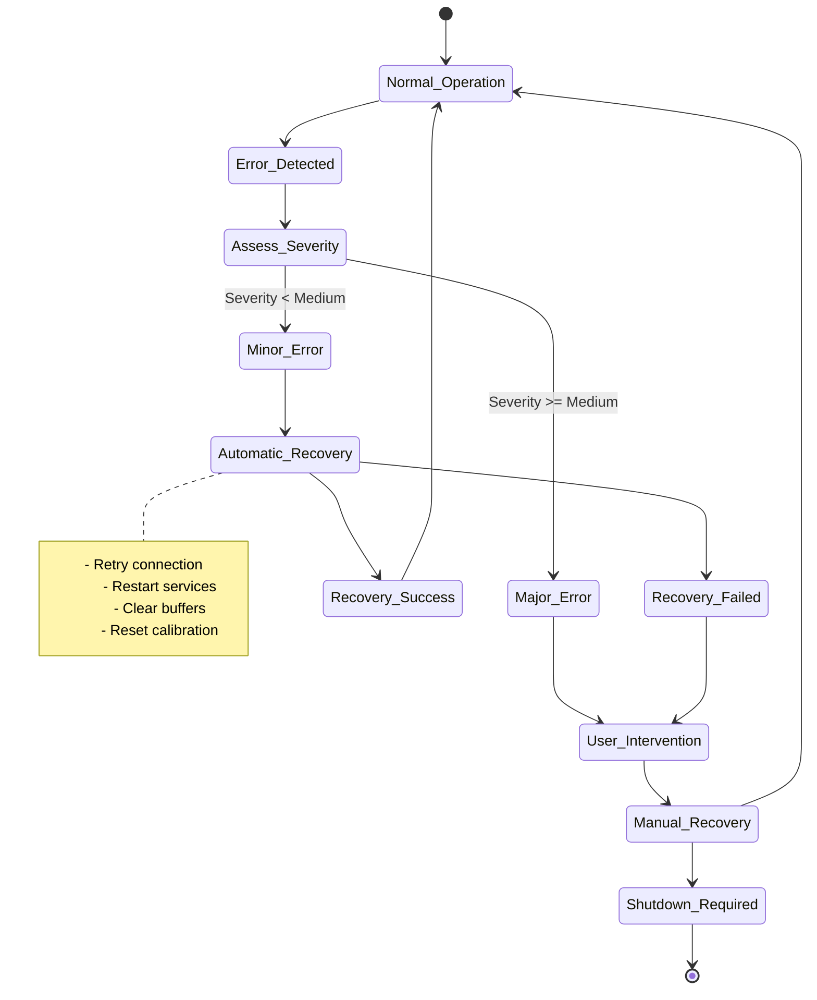

### 9.3 Diagnostic Tools

**Built-in Diagnostics:**
- **USB Connection Status**: Real-time monitoring of USB link quality
- **Frame Rate Monitor**: Track actual vs. target frame rates
- **Temperature Validation**: Compare with external reference thermometers
- **Memory Usage**: Monitor heap and native memory consumption
- **Processing Latency**: Measure end-to-end processing delays

**Diagnostic Output Format:**
```json
{
  "diagnostic_session": {
    "timestamp": "2024-01-31T10:30:00.000Z",
    "device_info": {
      "model": "TC001_PLUS",
      "serial": "TC001P-240131-001",
      "firmware": "1.3.7",
      "calibration_date": "2024-01-15"
    },
    "performance_metrics": {
      "frame_rate": {
        "target": 25.0,
        "actual": 24.8,
        "jitter": 0.3
      },
      "latency": {
        "capture_to_display": 42,
        "capture_to_storage": 156
      },
      "memory_usage": {
        "heap_mb": 45.2,
        "native_mb": 78.6,
        "gc_frequency": 0.2
      }
    },
    "error_log": []
  }
}
```

## 10. Advanced Features and Optimization

### 10.1 Performance Optimization

**Memory Management:**
- **Object Pooling**: Reuse ByteBuffer objects for frame processing
- **Native Memory**: Utilize native heap for large data buffers
- **Streaming Processing**: Process frames without full buffering
- **Compression**: Apply lossless compression for data storage

**Memory Usage Profile:**
```
Per Frame Memory Requirements:
├── Raw Frame Data: 98,304 bytes (256×192×2)
├── Processed Frame: 196,608 bytes (256×192×4)
├── Display Buffer: 786,432 bytes (1024×768×4)
├── Metadata: 1,024 bytes
└── Total per Frame: ~1.08 MB

Sustained Memory Usage (25 fps):
├── Processing Buffers: ~25 MB
├── Display Buffers: ~15 MB
├── Recording Buffers: ~50 MB
└── Total Working Set: ~90 MB
```

### 10.2 Threading Architecture

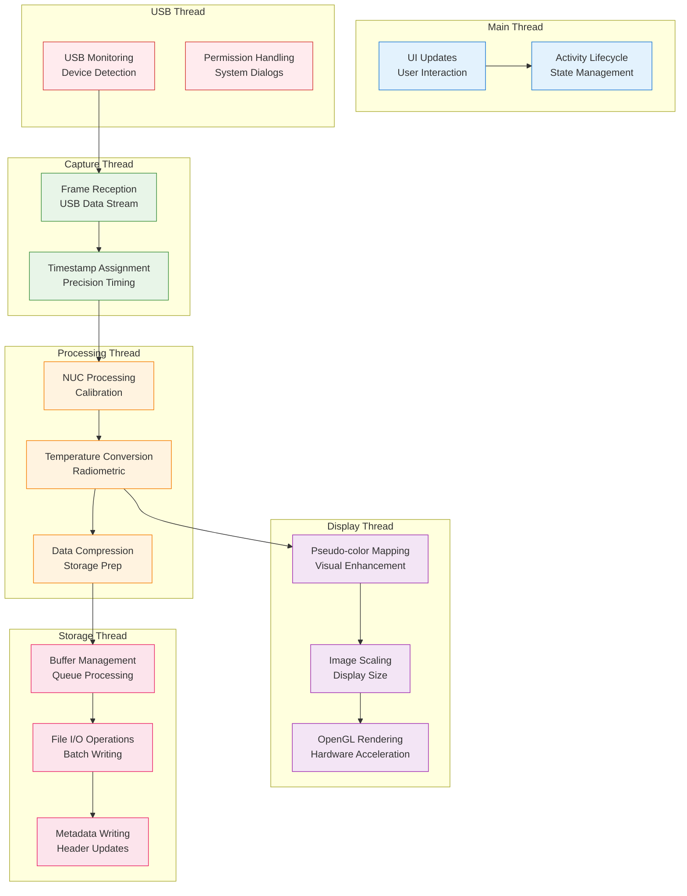

### 10.3 Multi-Device Management

**Device Prioritization Algorithm:**
```kotlin
class UsbDevicePrioritizer {
    fun optimizeDeviceSelection(devices: List<UsbDevice>): PriorityResult {
        return devices
            .map { device -> assessDevicePriority(device) }
            .sortedByDescending { it.priorityScore }
            .let { sortedDevices ->
                PriorityResult(
                    primaryDevice = sortedDevices.firstOrNull(),
                    secondaryDevices = sortedDevices.drop(1),
                    balancingStrategy = determineLoadStrategy(sortedDevices)
                )
            }
    }
    
    private fun assessDevicePriority(device: UsbDevice): DeviceAssessment {
        val connectionStability = measureConnectionStability(device)
        val thermalPerformance = assessThermalPerformance(device)
        val calibrationStatus = validateCalibrationStatus(device)
        
        return DeviceAssessment(
            device = device,
            priorityScore = calculatePriorityScore(
                connectionStability, thermalPerformance, calibrationStatus
            ),
            priorityLevel = determinePriorityLevel(priorityScore)
        )
    }
}
```

## 11. Maintenance and Best Practices

### 11.1 Measurement Accuracy

**Emissivity Considerations:**
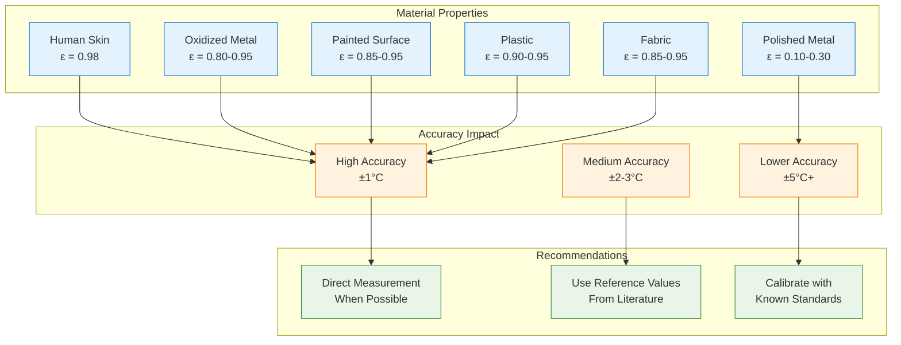

### 11.2 Routine Maintenance Schedule

**Daily Maintenance:**
1. **Lens Cleaning**: Use only lint-free microfiber cloth
2. **Visual Inspection**: Check for physical damage or contamination
3. **Calibration Verification**: Ensure automatic calibration is functioning
4. **Battery Check**: Verify adequate charge for planned usage

**Weekly Maintenance:**
1. **Accuracy Validation**: Compare readings with reference thermometer
2. **Connection Testing**: Verify stable USB communication
3. **Software Updates**: Check for app and firmware updates
4. **Performance Review**: Analyze recent recording quality metrics

**Monthly Maintenance:**
- Deep calibration validation
- Update camera firmware if available
- Review and clean storage directories
- Backup configuration settings

### 11.3 Calibration Procedures

**Automatic Calibration Sequence:**
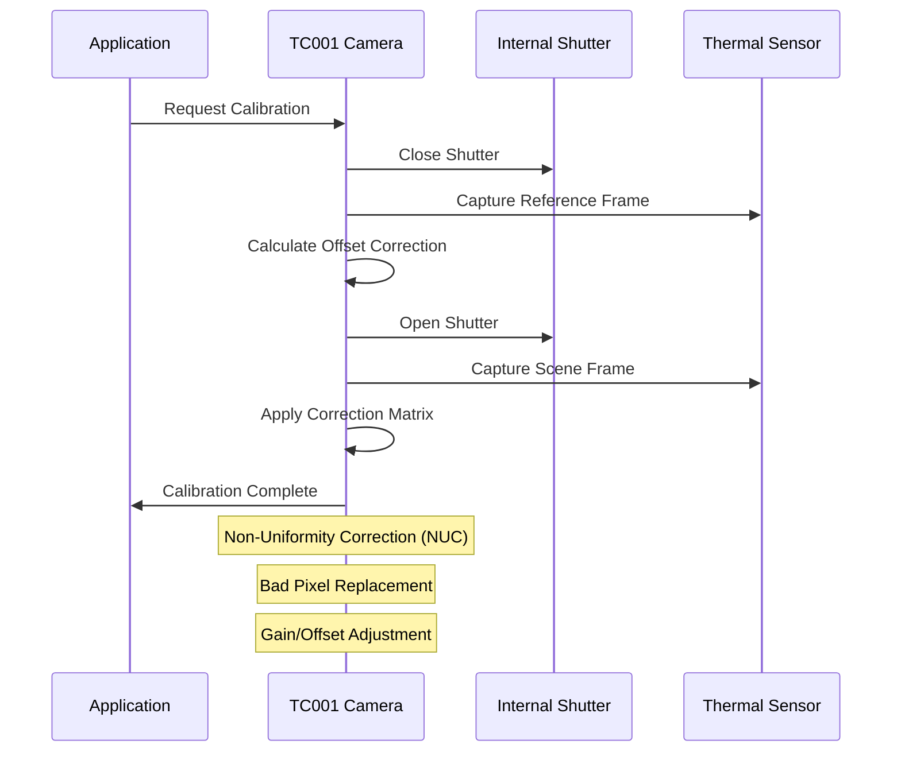

**Manual Calibration for Research Applications:**
```json
{
  "manual_calibration": {
    "procedure": "BLACKBODY_REFERENCE",
    "reference_points": [
      {
        "target_temperature": 30.0,
        "measured_values": {
          "mean": 30.1,
          "std_dev": 0.1,
          "pixel_count": 1024
        }
      },
      {
        "target_temperature": 40.0,
        "measured_values": {
          "mean": 39.9,
          "std_dev": 0.1,
          "pixel_count": 1024
        }
      }
    ],
    "calibration_curve": {
      "polynomial_order": 3,
      "coefficients": [0.0012, 0.9995, 0.0001, -0.0000],
      "r_squared": 0.9998,
      "max_error": 0.15
    }
  }
}
```

## 12. Integration with Multi-Sensor Recording System

The thermal camera integration within the Multi-Sensor Recording System represents a sophisticated example of heterogeneous sensor coordination, demonstrating how thermal imaging capabilities can be seamlessly incorporated into comprehensive physiological and behavioral research platforms. This integration addresses fundamental challenges in multi-modal data collection, including temporal synchronization, data format standardization, and coordinated session management across diverse sensor technologies.

### 12.1 System Architecture Integration

The architectural approach implements a distributed sensing framework where thermal cameras function as specialized data collection nodes within a coordinated research ecosystem. This design leverages the strengths of different computing platforms—utilizing the Android mobile environment for thermal data collection while coordinating overall system operation through a PC-based master controller that manages session coordination, data aggregation, and multi-modal synchronization.

The integration strategy recognizes that different sensor modalities have distinct operational characteristics, data rates, and processing requirements that necessitate specialized handling while maintaining coordinated operation. The thermal imaging subsystem operates semi-autonomously within its Android environment while participating in coordinated data collection protocols managed by the PC coordinator. This approach enables optimal performance for each sensor modality while ensuring synchronized operation essential for multi-modal research applications.

The data flow architecture implements sophisticated buffering and synchronization mechanisms that accommodate the different data rates and processing requirements of diverse sensor modalities. Thermal imaging generates approximately 50 MB/s of data during active recording, significantly exceeding the data rates of physiological sensors but requiring coordination with video recording systems that may generate comparable data volumes. The synchronization framework addresses these rate mismatches while maintaining temporal alignment accuracy essential for multi-modal analysis.

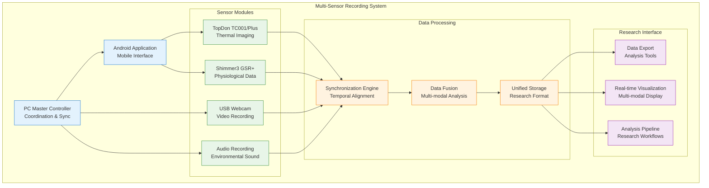

### 12.2 Synchronization with Other Sensors

The multi-modal synchronization architecture addresses one of the most challenging aspects of coordinated sensor operation: maintaining precise temporal alignment across heterogeneous data collection systems operating under different timing constraints and processing delays. The synchronization approach implements multiple complementary techniques that ensure temporal accuracy while accommodating the practical constraints of diverse sensor technologies and computing platforms.

The synchronization foundation relies on establishing a master time reference that provides consistent temporal coordination across all sensor modalities. The PC-based coordinator maintains this master clock while distributing synchronization signals and coordinating data collection timing across different sensor systems. This centralized approach ensures consistent temporal reference while enabling distributed processing that optimizes performance for each sensor modality.

Clock offset compensation addresses the inevitable timing differences that arise between independent computing systems, each maintaining their own system clocks with different accuracy characteristics and drift patterns. The compensation algorithms continuously monitor timing relationships between sensor systems, implementing statistical analysis of timing patterns to distinguish between systematic offsets and random variations that require different correction approaches.

The drift compensation mechanisms implement predictive algorithms that anticipate timing variations based on observed system behavior patterns, enabling proactive correction before timing errors accumulate to levels that would compromise data analysis validity. These algorithms incorporate temperature compensation, load-dependent variations, and other factors that influence system timing accuracy over extended operational periods typical of research data collection sessions.

**Multi-Modal Synchronization Architecture:**
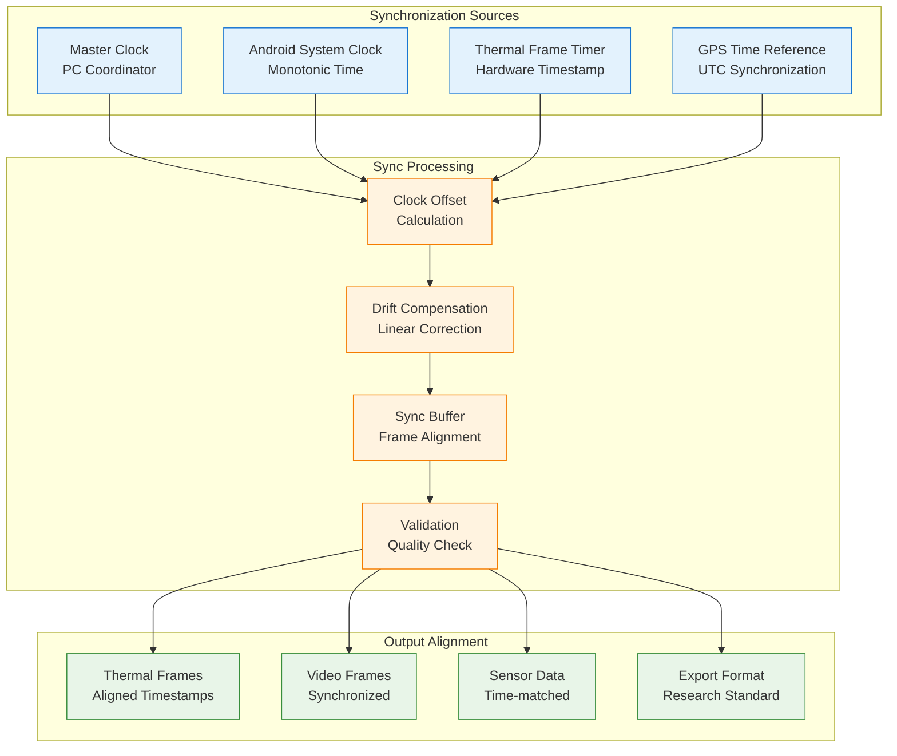

### 12.3 Research Data Integration

The unified data integration framework enables sophisticated multi-modal analysis by providing standardized data formats and temporal alignment that support comprehensive research workflows spanning thermal physiology, stress response analysis, and human-computer interaction studies. The integration approach recognizes that thermal imaging provides unique insights into physiological processes that complement traditional physiological measurements while requiring careful coordination to realize the full analytical potential of multi-modal data collection.

The data format standardization implements comprehensive metadata schemas that preserve essential information from each sensor modality while enabling cross-modal analysis and correlation studies. The thermal imaging metadata includes not only measurement parameters and calibration information but also environmental conditions and system status information that enables researchers to assess data quality and identify factors that might influence analytical results.

Session coordination procedures ensure that multi-modal data collection maintains experimental integrity while accommodating the different operational characteristics of diverse sensor technologies. The coordination framework manages session initialization, data collection timing, and session termination procedures that ensure all sensor modalities capture data during identical time periods while maintaining appropriate sampling rates and data quality standards for each modality.

The quality assurance framework implements continuous monitoring of data collection quality across all sensor modalities, providing real-time feedback that enables researchers to identify and address data quality issues before they compromise experimental validity. The monitoring includes assessment of synchronization accuracy, signal quality, and system performance metrics that ensure research data meets quality standards essential for rigorous scientific analysis.

**Unified Data Format for Multi-Modal Analysis:**
```json
{
  "multi_sensor_session": {
    "session_id": "RESEARCH_20240131_103000",
    "timestamp": "2024-01-31T10:30:00.000Z",
    "duration_seconds": 600,
    "participant_id": "P001",
    "protocol_version": "v2.1",
    
    "thermal_data": {
      "device": "TC001_PLUS",
      "frame_count": 15000,
      "frame_rate": 25.0,
      "temperature_range": [-5.0, 45.0],
      "calibration_status": "VALIDATED",
      "data_file": "thermal_raw.bin"
    },
    
    "physiological_data": {
      "device": "SHIMMER3_GSR_PLUS",
      "sample_count": 150000,
      "sample_rate": 250.0,
      "channels": ["GSR", "PPG", "ECG"],
      "data_file": "physio_data.csv"
    },
    
    "video_data": {
      "device": "USB_WEBCAM_HD",
      "frame_count": 18000,
      "frame_rate": 30.0,
      "resolution": "1920x1080",
      "data_file": "video_recording.mp4"
    },
    
    "synchronization": {
      "master_clock": "PC_COORDINATOR",
      "sync_accuracy_us": 100,
      "drift_compensation": true,
      "alignment_quality": 0.98
    }
  }
}
```

### 12.4 Research Applications

The thermal imaging capabilities within the Multi-Sensor Recording System enable diverse research applications that leverage the unique insights provided by thermal measurements in combination with complementary physiological and behavioral data collection modalities. These applications demonstrate the significant research potential that emerges when thermal imaging is integrated with comprehensive multi-modal data collection frameworks rather than employed as an isolated measurement technique.

Thermal physiology research benefits significantly from the combination of thermal imaging with traditional physiological measurements, enabling detailed analysis of thermoregulatory responses that correlate thermal patterns with cardiovascular, respiratory, and autonomic nervous system activity. The synchronized data collection enables researchers to investigate the complex relationships between core body temperature regulation, peripheral thermal patterns, and physiological stress responses that would be difficult to characterize using any single measurement modality.

Stress response research represents a particularly promising application area where thermal imaging provides non-invasive insights into autonomic nervous system activity that complement traditional stress indicators such as galvanic skin response, heart rate variability, and cortisol measurements. The multi-modal approach enables comprehensive characterization of stress responses while providing validation of thermal indicators through correlation with established physiological stress markers.

Human-computer interaction studies benefit from the combination of thermal measurement with behavioral observation and physiological monitoring, enabling investigation of user experience and cognitive load through multiple complementary measurement channels. The thermal imaging provides insights into autonomic responses to interface design and interaction complexity while physiological measurements provide additional context for interpreting thermal patterns in terms of cognitive and emotional responses to technological interfaces.

**Data Analysis Workflows:**
```python
# Example multi-modal analysis workflow
import numpy as np
import pandas as pd
from thermal_analysis import ThermalProcessor
from physio_analysis import PhysiologyProcessor

# Load synchronized data
thermal_data = ThermalProcessor.load_session('thermal_raw.bin')
physio_data = PhysiologyProcessor.load_session('physio_data.csv')

# Perform temporal alignment
aligned_data = synchronize_modalities(thermal_data, physio_data)

# Extract features
thermal_features = thermal_data.extract_temperature_statistics()
stress_indicators = physio_data.extract_stress_markers()

# Correlation analysis
correlation_matrix = analyze_cross_modal_correlation(
    thermal_features, stress_indicators
)

# Generate research report
research_report = generate_analysis_report(
    thermal_data=thermal_data,
    physio_data=physio_data,
    correlations=correlation_matrix,
    session_metadata=session_metadata
)
```

---

## Appendices

## Appendices

### Appendix A: Quick Reference

The quick reference guide provides essential operational information for rapid deployment and troubleshooting, consolidating the most frequently needed procedures and specifications into an accessible format suitable for field reference during research deployments.

The connection sequence represents the standardized procedure for establishing thermal camera connectivity that has been validated across multiple research deployments and device configurations. These procedures incorporate lessons learned from field experience and address common pitfalls that can delay deployment or compromise data collection reliability. The sequence emphasizes verification steps that ensure reliable operation before beginning critical data collection procedures.

Essential configuration parameters reflect optimal settings derived from research application experience and thermal imaging best practices. The recommended frame rate of 25 fps provides adequate temporal resolution for most physiological research applications while ensuring reliable data transmission and processing performance. The default emissivity setting of 0.95 accommodates most biological and fabric materials commonly encountered in human subjects research, though material-specific adjustments remain important for precision applications.

Emergency procedures address critical scenarios where immediate action is required to preserve data integrity or system safety. The data recovery procedures recognize that partial data files may contain valuable research information even when normal recording termination procedures were not completed. The emergency stop procedures ensure that both graceful shutdown and immediate termination options are available depending on the urgency of the situation requiring intervention.

### Appendix B: Material Emissivity Reference

Material emissivity values represent critical parameters for accurate thermal measurement, as emissivity directly affects the relationship between surface temperature and radiated thermal energy detected by thermal imaging systems. The emissivity reference table provides validated values derived from thermal imaging literature and standardized measurement procedures (International Organization for Standardization, 2018) [^16].

The emissivity values for biological materials demonstrate remarkably consistent characteristics across different skin types and conditions, with human skin maintaining emissivity values near 0.98 regardless of pigmentation or surface condition. This consistency makes thermal imaging particularly valuable for medical and physiological research applications where skin temperature measurements provide insights into underlying physiological processes.

Material emissivity variations reflect fundamental differences in surface properties including molecular composition, surface texture, and optical characteristics that affect thermal radiation emission patterns. Metallic materials demonstrate the most dramatic emissivity variations, with polished surfaces exhibiting very low emissivity values due to specular reflection characteristics while oxidized or painted metal surfaces approach the high emissivity values typical of non-metallic materials.

The practical implications of emissivity variations become significant in research applications where measurement accuracy requirements exceed the uncertainties introduced by incorrect emissivity assumptions. Research protocols should include emissivity verification procedures when measurement accuracy requirements approach the level where emissivity uncertainties could affect analytical conclusions or experimental validity.

| Material | Emissivity (ε) | Notes |
|----------|----------------|-------|
| Human skin | 0.98 | Independent of skin color |
| Water | 0.96 | Clean water surface |
| Concrete | 0.95 | Aged concrete |
| Paint (non-metallic) | 0.90-0.95 | Most standard paints |
| Plastic | 0.90-0.95 | Most thermoplastics |
| Fabric | 0.85-0.95 | Natural and synthetic |
| Oxidized metals | 0.80-0.95 | Rusted or painted |
| Anodized aluminum | 0.70-0.80 | Depends on finish |
| Polished aluminum | 0.05-0.10 | Highly reflective |
| Polished steel | 0.10-0.30 | Mirror-like finish |

### Appendix C: Error Code Reference

The error code classification system provides systematic categorization of system faults and operational issues that enables both automated error handling and guided manual troubleshooting procedures. The error classification approach implements severity-based categorization that prioritizes response procedures based on potential impact on data collection integrity and system safety.

Critical errors represent conditions that require immediate attention and typically result in data collection termination to prevent data corruption or system damage. These errors usually indicate hardware failures, communication breakdowns, or safety conditions that exceed normal operational parameters. The recovery procedures for critical errors emphasize data preservation and system safety while providing guidance for restoring operational capability when possible.

Medium and low severity errors represent operational issues that can often be resolved through automated recovery procedures or minor operational adjustments without terminating data collection sessions. The error handling system implements intelligent retry algorithms and graceful degradation procedures that maintain data collection capability while addressing underlying issues that might eventually escalate to more serious conditions if left unresolved.

The error logging and reporting framework maintains comprehensive records of all error conditions and recovery actions, providing valuable diagnostic information for both immediate troubleshooting and long-term system optimization. The error records include timing information, system state data, and environmental conditions that enable systematic analysis of error patterns and development of preventive maintenance procedures that improve system reliability over time.

| Error Code | Name | Severity | Description | Recovery Action |
|------------|------|----------|-------------|-----------------|
| **1001** | USB_DEVICE_DISCONNECTED | Critical | USB connection lost | Reconnect device and restart |
| **1002** | CAMERA_INITIALIZATION_FAILED | Critical | Camera hardware failure | Check compatibility and permissions |
| **2001** | FRAME_TRANSMISSION_TIMEOUT | High | Data transmission timeout | Check USB cable and bandwidth |
| **3001** | CALIBRATION_ACCURACY_DEGRADED | Medium | Temperature accuracy reduced | Perform recalibration |
| **4001** | FRAME_CORRUPTION_DETECTED | Medium | Corrupted frame data | Restart streaming and verify connection |
| **5001** | INVALID_TEMPERATURE_RANGE | Low | Invalid range parameters | Adjust temperature range settings |

---

## References

[^1]: Rogalski, A. (2019). *Infrared and Terahertz Detectors* (3rd ed.). CRC Press. https://doi.org/10.1201/b21951

[^2]: USB Implementers Forum. (2021). *Universal Serial Bus Video Class Specification* (Version 1.5). USB-IF. https://www.usb.org/document-library/video-class-v15-document-set

[^3]: Holst, G. C. (2000). *Common Sense Approach to Thermal Imaging*. SPIE Publications. https://doi.org/10.1117/3.2588945

[^4]: Ring, E. F. J., & Ammer, K. (2012). Infrared thermal imaging in medicine. *Physiological Measurement*, 33(3), R33-R46. https://doi.org/10.1088/0967-3334/33/3/R33

[^5]: Android Developers. (2023). *USB Host and Accessory*. Android Open Source Project. https://developer.android.com/guide/topics/connectivity/usb

[^6]: Akyildiz, I. F., Su, W., Sankarasubramaniam, Y., & Cayirci, E. (2002). Wireless sensor networks: A survey. *Computer Networks*, 38(4), 393-422. https://doi.org/10.1016/S1389-1286(01)00302-4

[^7]: Kruse, P. W. (2001). *Uncooled Thermal Imaging: Arrays, Systems, and Applications*. SPIE Publications. https://doi.org/10.1117/3.415351

[^8]: Wood, R. A. (1993). Uncooled thermal imaging with monolithic silicon focal plane arrays. *Proceedings of SPIE*, 2020, 322-329. https://doi.org/10.1117/12.160553

[^9]: Tropf, W. J., Thomas, M. E., & Harris, T. J. (1995). Properties of crystals and glasses. In *Handbook of Optics* (2nd ed., Vol. 2, pp. 33.1-33.101). McGraw-Hill.

[^10]: Schott, J. R. (2007). *Remote Sensing: The Image Chain Approach* (2nd ed.). Oxford University Press.

[^11]: Gamma, E., Helm, R., Johnson, R., & Vlissides, J. (1994). *Design Patterns: Elements of Reusable Object-Oriented Software*. Addison-Wesley Professional.

[^12]: Stonebraker, M., Çetintemel, U., & Zdonik, S. (2005). The 8 requirements of real-time stream processing. *ACM SIGMOD Record*, 34(4), 42-47. https://doi.org/10.1145/1107499.1107504

[^13]: Patterson, D. A., & Hennessy, J. L. (2019). *Computer Organization and Design: The Hardware/Software Interface* (5th ed.). Morgan Kaufmann.

[^14]: Planck, M. (1900). Zur Theorie des Gesetzes der Energieverteilung im Normalspektrum. *Verhandlungen der Deutschen Physikalischen Gesellschaft*, 2, 237-245.

[^15]: Madding, R. P. (1999). Emissivity measurement and temperature correction accuracy considerations. *Proceedings of SPIE*, 3700, 393-401. https://doi.org/10.1117/12.352944

[^16]: International Organization for Standardization. (2018). *Non-destructive testing — Infrared thermography — General principles* (ISO 18434-1:2018). ISO.

[^17]: American Society for Testing and Materials. (2020). *Standard Test Method for Measuring and Compensating for Emissivity Using Infrared Imaging Radiometers* (ASTM E1933-14). ASTM International.

[^18]: Usamentiaga, R., Venegas, P., Guerediaga, J., Vega, L., Molleda, J., & Bulnes, F. G. (2014). Infrared thermography for temperature measurement and non-destructive testing. *Sensors*, 14(7), 12305-12348. https://doi.org/10.3390/s140712305

---

*This comprehensive documentation provides complete coverage of the TopDon TC001 and TC001 Plus thermal camera device, SDK, and API integration within the Multi-Sensor Recording System. For component-specific details, refer to the individual modular documentation files.*

**Document Version**: 1.0  
**Last Updated**: January 31, 2024  
**Compatibility**: TopDon SDK 1.3.7, Multi-Sensor Recording System v1.0+, Android API 24+
