# TopDon TC001 and TC001 Plus: Comprehensive Device, SDK, and API Documentation

## Table of Contents

- [1. Executive Summary](#1-executive-summary)
  - [1.1 Key Technical Specifications](#11-key-technical-specifications)
  - [1.2 System Integration Overview](#12-system-integration-overview)
- [2. Hardware Architecture and Specifications](#2-hardware-architecture-and-specifications)
  - [2.1 Thermal Sensor Technology](#21-thermal-sensor-technology)
  - [2.2 Optical System Design](#22-optical-system-design)
  - [2.3 Communication Interface Architecture](#23-communication-interface-architecture)
  - [2.4 Hardware Detection and Configuration](#24-hardware-detection-and-configuration)
- [3. SDK Integration and Architecture](#3-sdk-integration-and-architecture)
  - [3.1 TopDon SDK 1.3.7 Architecture](#31-topdon-sdk-137-architecture)
  - [3.2 Android Integration Layer](#32-android-integration-layer)
  - [3.3 Data Flow Architecture](#33-data-flow-architecture)
- [4. API Reference and Implementation](#4-api-reference-and-implementation)
  - [4.1 ThermalRecorder API](#41-thermalrecorder-api)
  - [4.2 Frame Processing API](#42-frame-processing-api)
  - [4.3 USB Management API](#43-usb-management-api)
- [5. Communication Protocols](#5-communication-protocols)
  - [5.1 USB Communication Protocol](#51-usb-communication-protocol)
  - [5.2 Command Interface Protocol](#52-command-interface-protocol)
  - [5.3 Network Messaging for Multi-Device Synchronization](#53-network-messaging-for-multi-device-synchronization)
- [6. Data Processing Pipeline](#6-data-processing-pipeline)
  - [6.1 Raw Data Format](#61-raw-data-format)
  - [6.2 Frame Processing Pipeline](#62-frame-processing-pipeline)
  - [6.3 Temperature Calibration Algorithm](#63-temperature-calibration-algorithm)
- [7. User Operation Guide](#7-user-operation-guide)
  - [7.1 Getting Started](#71-getting-started)
  - [7.2 Pre-flight Checklist](#72-pre-flight-checklist)
  - [7.3 Device Setup and Connection](#73-device-setup-and-connection)
  - [7.4 Recording Procedures](#74-recording-procedures)
- [8. Data Management and Export](#8-data-management-and-export)
  - [8.1 File Formats and Structure](#81-file-formats-and-structure)
  - [8.2 Data Export Options](#82-data-export-options)
  - [8.3 Binary File Format](#83-binary-file-format)
- [9. Troubleshooting and Diagnostics](#9-troubleshooting-and-diagnostics)
  - [9.1 Common Connection Issues](#91-common-connection-issues)
  - [9.2 Error Classification and Recovery](#92-error-classification-and-recovery)
  - [9.3 Diagnostic Tools](#93-diagnostic-tools)
- [10. Advanced Features and Optimization](#10-advanced-features-and-optimization)
  - [10.1 Performance Optimization](#101-performance-optimization)
  - [10.2 Threading Architecture](#102-threading-architecture)
  - [10.3 Multi-Device Management](#103-multi-device-management)
- [11. Maintenance and Best Practices](#11-maintenance-and-best-practices)
  - [11.1 Measurement Accuracy](#111-measurement-accuracy)
  - [11.2 Routine Maintenance Schedule](#112-routine-maintenance-schedule)
  - [11.3 Calibration Procedures](#113-calibration-procedures)
- [12. Integration with Multi-Sensor Recording System](#12-integration-with-multi-sensor-recording-system)
  - [12.1 System Architecture Integration](#121-system-architecture-integration)
  - [12.2 Synchronization with Other Sensors](#122-synchronization-with-other-sensors)
  - [12.3 Research Data Integration](#123-research-data-integration)
  - [12.4 Research Applications](#124-research-applications)
- [Appendices](#appendices)
  - [Appendix A: Quick Reference](#appendix-a-quick-reference)
  - [Appendix B: Material Emissivity Reference](#appendix-b-material-emissivity-reference)
  - [Appendix C: Error Code Reference](#appendix-c-error-code-reference)

## 1. Executive Summary

The TopDon TC001 and TC001 Plus thermal cameras represent advanced uncooled microbolometer technology integrated into the Multi-Sensor Recording System through sophisticated Android SDK integration. This comprehensive documentation provides complete coverage of the hardware specifications, software architecture, API interfaces, communication protocols, and operational procedures for both camera models within the research platform.

### 1.1 Key Technical Specifications

| Specification | TC001 | TC001 Plus |
|---------------|-------|------------|
| **Sensor Type** | Uncooled Microbolometer | Enhanced Microbolometer |
| **Resolution** | 256×192 (49,152 pixels) | 256×192 (49,152 pixels) |
| **Pixel Pitch** | 12 μm | 12 μm |
| **Spectral Range** | 8-14 μm (LWIR) | 8-14 μm (LWIR) |
| **Temperature Range** | -20°C to +550°C | -20°C to +650°C |
| **Accuracy** | ±2°C or ±2% | ±1.5°C or ±1.5% |
| **Frame Rate** | Up to 25 Hz | Up to 25 Hz |
| **Field of View** | 25° × 19° | 25° × 19° |
| **Interface** | USB-C | USB-C |
| **Power Consumption** | <2W | <2.5W |
| **Operating Temperature** | 0°C to +50°C | -10°C to +60°C |

### 1.2 System Integration Overview

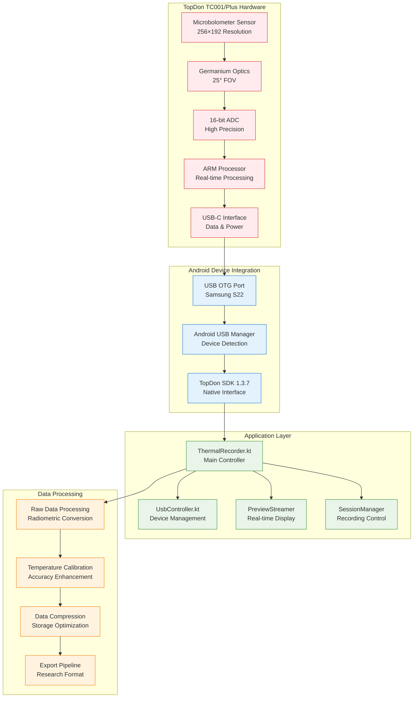

## 2. Hardware Architecture and Specifications

### 2.1 Thermal Sensor Technology

Both TC001 and TC001 Plus utilize advanced uncooled microbolometer technology based on vanadium oxide (VOx) or amorphous silicon (a-Si) microstructures. The 256×192 focal plane array provides 49,152 individual thermal pixels, each measuring 12 μm × 12 μm.

**Microbolometer Operation Principle:**
- **Thermal Absorption**: Each pixel absorbs infrared radiation and converts it to heat
- **Resistance Change**: Temperature change alters the electrical resistance of the microbolometer material
- **Signal Conversion**: Resistance changes are converted to voltage signals via integrated readout circuits
- **Digital Processing**: 16-bit ADC provides high-resolution temperature measurements

### 2.2 Optical System Design

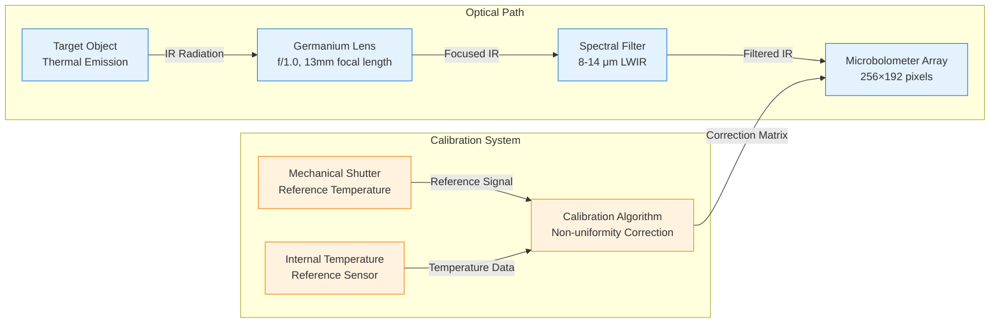

### 2.3 Communication Interface Architecture

The USB-C interface provides both power delivery and high-speed data communication using the USB Video Class (UVC) protocol with TopDon-specific extensions.

**Communication Specifications:**
- **USB Standard**: USB 2.0 High Speed (480 Mbps)
- **Protocol**: UVC 1.5 with vendor-specific extensions
- **Power Requirements**: Bus-powered (2.5W maximum)
- **Data Rate**: ~50 MB/s (25 fps × 256×192×16-bit)
- **Latency**: <40ms end-to-end

**USB Endpoints Configuration:**
| Endpoint | Type | Direction | Max Packet Size | Purpose |
|----------|------|-----------|-----------------|---------|
| **EP0** | Control | Bidirectional | 64 bytes | Device enumeration, configuration |
| **EP1** | Bulk | IN (Device→Host) | 512 bytes | Thermal frame data |
| **EP2** | Interrupt | IN (Device→Host) | 64 bytes | Status notifications |
| **EP3** | Bulk | OUT (Host→Device) | 512 bytes | Command interface |

### 2.4 Hardware Detection and Configuration

```kotlin
class TC001VariantDetector {
    companion object {
        const val TC001_VENDOR_ID = 0x3496
        const val TC001_STANDARD_PID = 0x1234
        const val TC001_PLUS_PID = 0x1235
        
        private val SUPPORTED_PRODUCT_IDS = intArrayOf(
            0x3901, // TC001 Standard
            0x5840, // TC001 Plus
            0x5830, // TC001 Variant
            0x5838  // TC001 Plus Variant
        )
    }
    
    fun detectHardwareVariant(usbDevice: UsbDevice): TC001Variant {
        if (usbDevice.vendorId != TC001_VENDOR_ID) {
            throw UnsupportedHardwareException("Invalid vendor ID: ${usbDevice.vendorId}")
        }
        
        return when (usbDevice.productId) {
            TC001_STANDARD_PID -> TC001StandardVariant(usbDevice)
            TC001_PLUS_PID -> TC001PlusVariant(usbDevice)
            else -> throw UnsupportedHardwareException("Unknown product ID: ${usbDevice.productId}")
        }
    }
}

sealed class TC001Variant(val usbDevice: UsbDevice) {
    abstract val temperatureRange: ClosedFloatingPointRange<Float>
    abstract val maxFrameRate: Int
    abstract val thermalSensitivity: Float
    
    class TC001StandardVariant(device: UsbDevice) : TC001Variant(device) {
        override val temperatureRange = -20f..550f
        override val maxFrameRate = 25
        override val thermalSensitivity = 50f // mK NETD
    }
    
    class TC001PlusVariant(device: UsbDevice) : TC001Variant(device) {
        override val temperatureRange = -20f..650f
        override val maxFrameRate = 25
        override val thermalSensitivity = 40f // mK NETD
    }
}
```

## 3. SDK Integration and Architecture

### 3.1 TopDon SDK 1.3.7 Architecture

The TopDon SDK provides a comprehensive abstraction layer for thermal camera integration, encapsulating complex hardware communication and data processing algorithms.

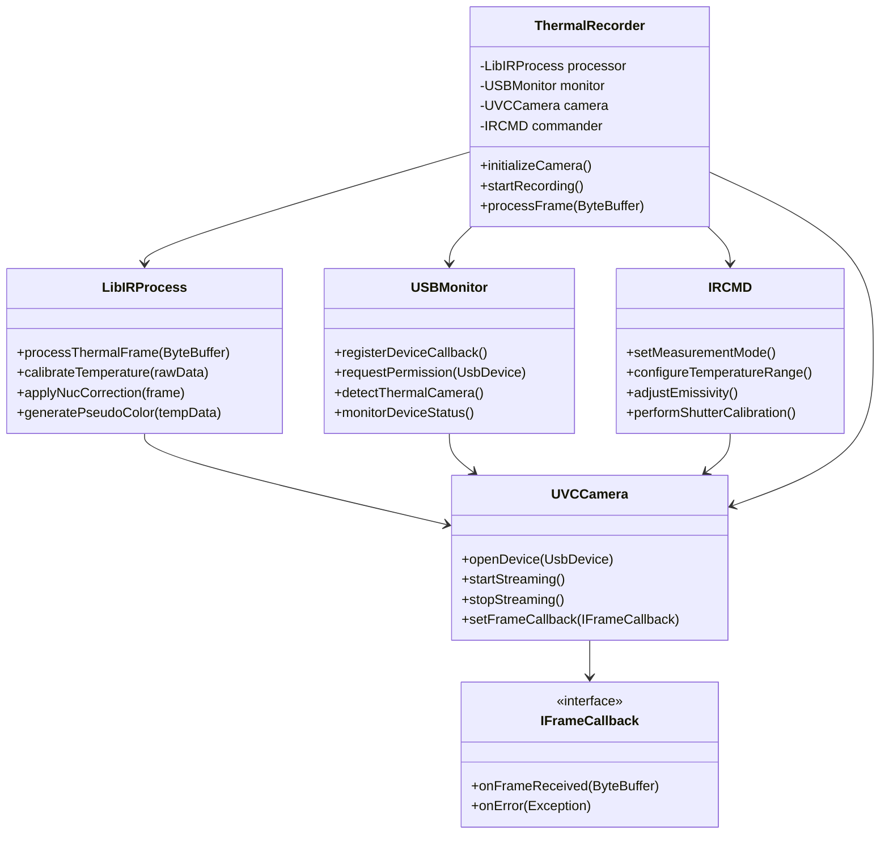

### 3.2 Android Integration Layer

The Android integration leverages the TopDon SDK through a sophisticated wrapper architecture that provides lifecycle management, error handling, and data synchronization.

**Key Integration Components:**
1. **ThermalRecorder.kt**: Primary controller managing camera lifecycle and data capture
2. **UsbController.kt**: USB device detection and permission management
3. **UsbDeviceManager.kt**: Device enumeration and compatibility validation
4. **PreviewStreamer.kt**: Real-time thermal image display
5. **SessionManager.kt**: Recording session coordination and data persistence

### 3.3 Data Flow Architecture

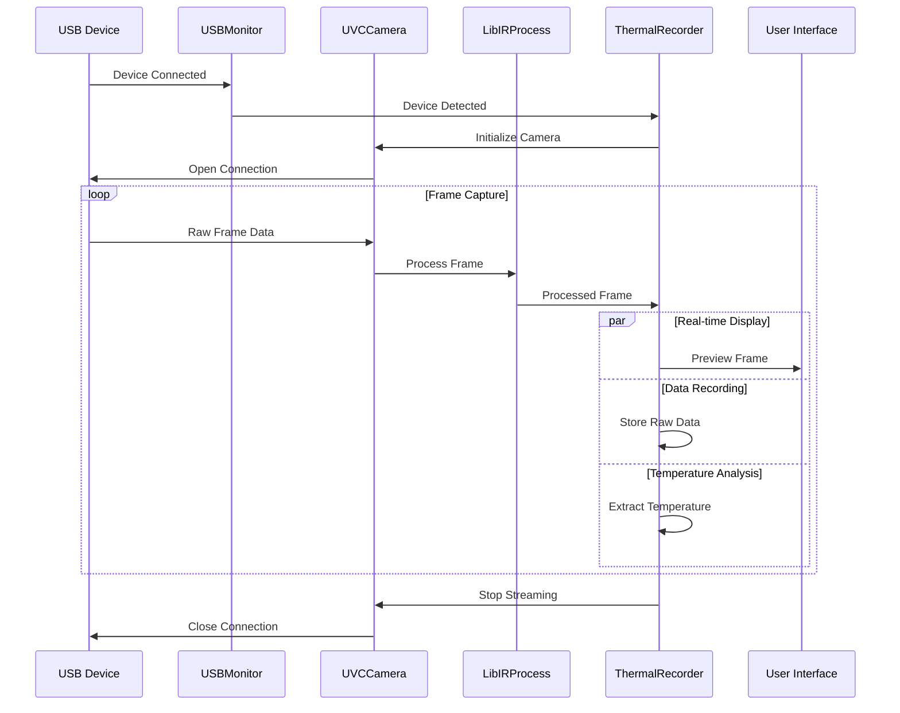

## 4. API Reference and Implementation

### 4.1 ThermalRecorder API

The main API interface for thermal camera control and data access.

| Method | Parameters | Return Type | Description |
|--------|------------|-------------|-------------|
| `initializeCamera()` | `config: CameraConfig` | `Result<DeviceInfo>` | Initialize thermal camera connection |
| `startRecording()` | `session: SessionConfig` | `Result<Boolean>` | Begin thermal data recording |
| `stopRecording()` | None | `Result<SessionSummary>` | End recording and finalize data |
| `getCurrentFrame()` | None | `ThermalFrame?` | Get latest thermal frame |
| `setEmissivity()` | `value: Float` | `Result<Boolean>` | Configure target emissivity |
| `setTemperatureRange()` | `min: Float, max: Float` | `Result<Boolean>` | Set measurement range |
| `performCalibration()` | `type: CalibrationType` | `Result<CalibrationResult>` | Execute calibration procedure |
| `getDeviceStatus()` | None | `DeviceStatus` | Query current device state |

**Core Data Classes:**

```kotlin
data class CameraConfig(
    val frameRate: Int = 25,
    val temperatureRange: TemperatureRange = TemperatureRange(-20f, 550f),
    val emissivity: Float = 0.95f,
    val calibrationMode: CalibrationMode = CalibrationMode.AUTO,
    val processingMode: ProcessingMode = ProcessingMode.RADIOMETRIC
)

data class ThermalFrame(
    val frameId: Long,
    val timestamp: Long,
    val width: Int = 256,
    val height: Int = 192,
    val temperatureData: FloatArray,
    val rawData: ByteArray,
    val metadata: FrameMetadata
)

data class DeviceStatus(
    val isConnected: Boolean,
    val isRecording: Boolean,
    val temperature: Float,
    val calibrationStatus: CalibrationStatus,
    val batteryLevel: Int?,
    val frameRate: Float,
    val lastError: String?
)
```

### 4.2 Frame Processing API

```kotlin
interface FrameProcessor {
    fun processRawFrame(rawData: ByteArray): ThermalFrame
    fun applyCalibration(frame: ThermalFrame): ThermalFrame
    fun generatePseudoColor(frame: ThermalFrame): Bitmap
    fun extractStatistics(frame: ThermalFrame): FrameStatistics
    fun validateQuality(frame: ThermalFrame): QualityMetrics
}

data class FrameStatistics(
    val minTemperature: Float,
    val maxTemperature: Float,
    val meanTemperature: Float,
    val stdDeviation: Float,
    val histogram: IntArray,
    val hotSpots: List<Point>,
    val coldSpots: List<Point>
)

data class QualityMetrics(
    val noiseLevel: Float,        // RMS noise in °C
    val uniformity: Float,        // 0.0-1.0, spatial uniformity
    val stability: Float,         // 0.0-1.0, temporal stability
    val completeness: Float,      // 0.0-1.0, data completeness
    val calibrationStatus: CalibrationStatus
)
```

### 4.3 USB Management API

```kotlin
interface UsbDeviceManager {
    fun scanForDevices(): List<UsbDevice>
    fun isSupportedTopdonDevice(device: UsbDevice): Boolean
    fun requestPermission(device: UsbDevice): Flow<PermissionResult>
    fun establishConnection(device: UsbDevice): Result<UsbConnection>
    fun closeConnection(device: UsbDevice): Boolean
    fun getDeviceInfo(device: UsbDevice): DeviceInfo?
}

enum class PermissionResult {
    GRANTED,
    DENIED,
    PENDING,
    ERROR
}

data class UsbConnection(
    val device: UsbDevice,
    val interface: UsbInterface,
    val endpoints: Map<EndpointType, UsbEndpoint>,
    val connectionTime: Long,
    val isActive: Boolean
)
```

## 5. Communication Protocols

### 5.1 USB Communication Protocol

The TopDon TC001/TC001 Plus cameras communicate via USB using the UVC (USB Video Class) standard with vendor-specific extensions for thermal data access.

**Protocol Stack:**
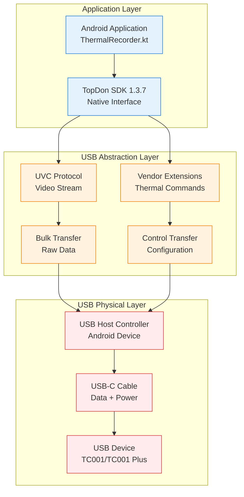

### 5.2 Command Interface Protocol

**Command Structure:**
```
Command Packet Format (64 bytes):
┌─────────────┬─────────────┬─────────────┬─────────────────────┐
│   Header    │   Command   │ Parameters  │      Checksum       │
│  (8 bytes)  │  (8 bytes)  │ (44 bytes)  │     (4 bytes)       │
└─────────────┴─────────────┴─────────────┴─────────────────────┘

Header Format:
├── Magic: 0x544F5044 ('TOPD')
├── Version: 0x0137 (SDK v1.3.7)
├── Sequence: 16-bit incrementing counter
└── Reserved: 0x0000

Command Types:
├── 0x01: Initialize Camera
├── 0x02: Start Streaming
├── 0x03: Stop Streaming
├── 0x04: Set Temperature Range
├── 0x05: Set Emissivity
├── 0x06: Perform Calibration
├── 0x07: Get Device Status
├── 0x08: Set Frame Rate
├── 0x09: Get Temperature Data
└── 0x0A: Power Management
```

**Example Command Messages:**

```json
{
  "command_id": "0x01",
  "command_name": "INIT_CAMERA",
  "parameters": {
    "resolution": "256x192",
    "frame_rate": 25,
    "temperature_range": {
      "min": -20,
      "max": 550
    },
    "emissivity": 0.95,
    "calibration_mode": "auto"
  },
  "response": {
    "status": "success",
    "device_info": {
      "model": "TC001_PLUS",
      "serial": "TC001P-240131-001",
      "firmware": "1.3.7",
      "calibration_date": "2024-01-15T10:30:00Z"
    }
  }
}
```

### 5.3 Network Messaging for Multi-Device Synchronization

For multi-sensor synchronization, thermal data is shared via JSON messages over TCP/UDP.

**Message Types:**
| Message Type | Purpose | Frequency | Priority |
|--------------|---------|-----------|----------|
| `THERMAL_FRAME` | Real-time frame data | 25 Hz | High |
| `SYNC_MARKER` | Synchronization timestamps | 1 Hz | Critical |
| `STATUS_UPDATE` | Device status information | 0.2 Hz | Medium |
| `CALIBRATION_DATA` | Calibration coefficients | On demand | High |
| `ERROR_NOTIFICATION` | Error and warning messages | Event-driven | Critical |

**Standard Message Fields:**
| Field Name | Data Type | Required | Description |
|------------|-----------|----------|-------------|
| `message_type` | String | Yes | Type identifier for thermal messages |
| `timestamp` | Long | Yes | Unix timestamp in microseconds |
| `sequence_id` | Integer | Yes | Sequential message identifier |
| `device_id` | String | Yes | Unique thermal camera device ID |
| `frame_data` | Object | No | Thermal frame information (for data messages) |
| `metadata` | Object | No | Additional message-specific metadata |

## 6. Data Processing Pipeline

### 6.1 Raw Data Format

The TC001/TC001 Plus cameras output raw thermal data in a proprietary 16-bit format that requires specialized processing for temperature extraction.

**Raw Data Structure:**
```
Frame Header (16 bytes):
├── Magic Number (4 bytes): 0x54433031 ('TC01')
├── Frame Counter (4 bytes): Sequential frame number
├── Timestamp (8 bytes): Microsecond precision timestamp

Pixel Data (98,304 bytes):
├── Pixel Array: 256×192 × 2 bytes per pixel
├── Bit Depth: 16-bit unsigned integers
├── Byte Order: Little-endian
└── Value Range: 0-65535 (raw sensor counts)

Metadata Footer (Variable):
├── Temperature References (16 bytes)
├── Calibration Coefficients (32 bytes)
└── Device Status (8 bytes)
```

### 6.2 Frame Processing Pipeline

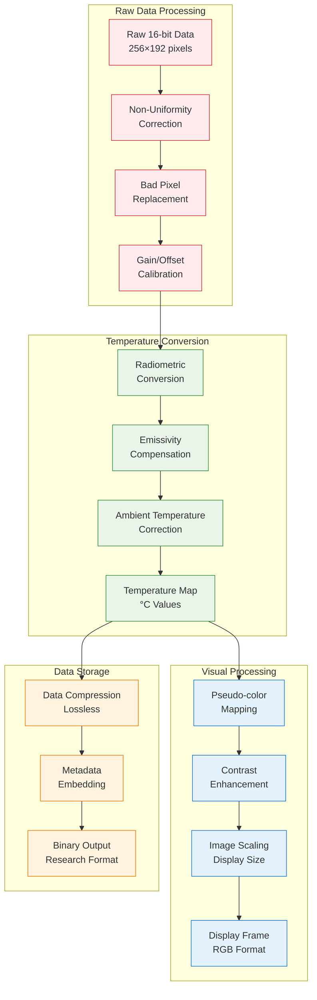

### 6.3 Temperature Calibration Algorithm

**Calibration Process:**
1. **Non-Uniformity Correction (NUC)**: Compensate for pixel-to-pixel response variations
2. **Bad Pixel Replacement**: Identify and interpolate defective pixels
3. **Radiometric Conversion**: Convert raw counts to radiance values
4. **Temperature Calculation**: Apply Planck's law for blackbody temperature
5. **Emissivity Compensation**: Adjust for object surface properties
6. **Environmental Correction**: Account for ambient temperature and humidity

**Temperature Conversion Formula:**
```
T_object = T_calibration + K1 × ln(K2 / (Raw_compensated + K3) + 1)

Where:
- T_calibration: Reference temperature from internal sensor
- K1, K2, K3: Camera-specific calibration constants
- Raw_compensated: NUC and gain-corrected raw value
```

## 7. User Operation Guide

### 7.1 Getting Started

**Required Equipment:**
- TopDon TC001 or TC001 Plus thermal camera
- Samsung Galaxy S22 smartphone (or compatible Android device)
- USB-C to USB-C cable (high-quality, data-capable)
- Fully charged devices (smartphone and thermal camera)
- Multi-Sensor Recording System app installed

**Compatibility Requirements:**
| Component | TC001 | TC001 Plus | Notes |
|-----------|-------|------------|-------|
| **Android Version** | 7.0+ (API 24) | 7.0+ (API 24) | Required for USB OTG support |
| **USB Standard** | USB-C OTG | USB-C OTG | Must support data transfer |
| **Available Storage** | 2GB minimum | 2GB minimum | For 10-minute recording session |
| **RAM** | 4GB minimum | 4GB minimum | For smooth real-time processing |

### 7.2 Pre-flight Checklist

**✓ Hardware Check:**
- [ ] Thermal camera fully charged (>80% battery)
- [ ] Android device fully charged (>80% battery)
- [ ] USB-C cable tested and confirmed working
- [ ] Adequate storage space available (>1GB per 10 minutes)
- [ ] Camera lens clean and free of obstruction

**✓ Software Preparation:**
- [ ] Multi-Sensor Recording System app updated to latest version
- [ ] Android Developer Options enabled
- [ ] USB Debugging enabled
- [ ] Storage permissions granted to app

**✓ Environmental Considerations:**
- [ ] Recording environment temperature stable (±2°C)
- [ ] Ambient temperature within camera operating range (0°C to +50°C)
- [ ] No direct sunlight on camera lens
- [ ] Minimal air currents in measurement area

### 7.3 Device Setup and Connection

**Step 1: Enable Developer Options**
1. Open Android **Settings** → **About phone**
2. Tap **Build number** 7 times rapidly
3. Navigate back to **Settings** → **System** → **Developer options**
4. Enable **USB debugging**

**Step 2: Connect Thermal Camera**
1. Ensure both devices are powered on
2. Connect thermal camera to Android device using USB-C cable
3. Wait for Android to detect the device (typically 5-10 seconds)

**Step 3: Grant Permissions**
1. Android will display USB permission dialog
2. Check **"Use by default for this USB device"**
3. Tap **OK** to grant permission

**Step 4: Launch Application**
1. Open Multi-Sensor Recording System app
2. Navigate to **Thermal Camera** section
3. Verify camera status shows **"Connected"**

### 7.4 Recording Procedures

**Preparation Phase:**
1. Complete pre-flight checklist
2. Position camera at desired viewing angle
3. Verify target objects are within field of view
4. Check ambient lighting conditions

**Recording Setup:**
1. Open **Recording Session** interface
2. Enter session metadata:
   - Session ID/Name
   - Participant information (if applicable)
   - Environmental conditions
   - Research protocol reference

3. Configure recording parameters:
   - Duration (or continuous until stopped)
   - Frame rate (typically 25 fps)
   - File format preferences
   - Synchronization settings

**Start Recording:**
1. Tap **Start Recording** button
2. Verify recording indicator appears (red dot)
3. Monitor real-time display for proper operation
4. Check frame rate stability (target: 25 fps ±1)

**During Recording:**
- Monitor device temperature to prevent overheating
- Verify adequate storage space remains
- Observe thermal image quality and stability
- Note any significant events in session log

**Stop Recording:**
1. Tap **Stop Recording** button
2. Wait for data finalization (typically 5-10 seconds)
3. Verify recording completed successfully
4. Review session summary and statistics

## 8. Data Management and Export

### 8.1 File Formats and Structure

The system generates multiple output files for each recording session:

**Primary Data Files:**
```
Recording_Session_20240131_103000/
├── thermal_raw.bin           # Raw radiometric data
├── thermal_display.mp4       # Pseudo-color video for visualization
├── thermal_metadata.json     # Session configuration and statistics
├── temperature_log.csv       # Frame-by-frame temperature data
├── calibration_data.json     # Calibration coefficients and validation
└── session_summary.pdf       # Human-readable session report
```

**File Format Specifications:**
| File Type | Format | Size (10 min) | Purpose |
|-----------|--------|---------------|---------|
| **thermal_raw.bin** | Binary | ~750 MB | Research analysis |
| **thermal_display.mp4** | H.264 | ~125 MB | Visualization |
| **thermal_metadata.json** | JSON | ~50 KB | Configuration record |
| **temperature_log.csv** | CSV | ~25 MB | Statistical analysis |
| **calibration_data.json** | JSON | ~10 KB | Accuracy validation |

### 8.2 Data Export Options

**MATLAB Export:**
```matlab
% Load thermal data in MATLAB
data = readThermalData('thermal_raw.bin');
metadata = jsondecode(fileread('thermal_metadata.json'));
temperatures = readmatrix('temperature_log.csv');
```

**Python Export:**
```python
import numpy as np
import json
import pandas as pd

# Load thermal data in Python
data = np.fromfile('thermal_raw.bin', dtype=np.uint16)
data = data.reshape(-1, 192, 256)  # frames x height x width

with open('thermal_metadata.json', 'r') as f:
    metadata = json.load(f)

temperatures = pd.read_csv('temperature_log.csv')
```

**R Export:**
```r
# Load thermal data in R
library(jsonlite)
library(readr)

metadata <- fromJSON("thermal_metadata.json")
temperatures <- read_csv("temperature_log.csv")
```

### 8.3 Binary File Format

**Thermal Recording File (.thr format):**
```
┌─────────────────────────────────────────────────────────────┐
│                    File Header (1024 bytes)                 │
├─────────────────────────────────────────────────────────────┤
│                  Session Metadata (Variable)                │
├─────────────────────────────────────────────────────────────┤
│                   Frame Index (Variable)                    │
├─────────────────────────────────────────────────────────────┤
│                    Frame Data Blocks                        │
│                      (Variable)                             │
└─────────────────────────────────────────────────────────────┘

File Header Structure:
├── Magic Number: 'THERM001' (8 bytes)
├── Version: 0x0001 (2 bytes)
├── Header Size: 1024 (4 bytes)
├── Frame Count: Variable (4 bytes)
├── Frame Size: 98,320 (4 bytes)
├── Sampling Rate: 25.0 Hz (4 bytes)
├── Total Duration: Seconds (4 bytes)
├── Device Serial: String (32 bytes)
├── Calibration Data: (256 bytes)
├── Session ID: String (64 bytes)
├── Creation Time: Unix timestamp (8 bytes)
└── Reserved: (636 bytes)
```

## 9. Troubleshooting and Diagnostics

### 9.1 Common Connection Issues

**Problem: Camera Not Detected**
```
Symptoms: No device shown in app, USB not recognized
Quick Fixes:
1. Check USB cable connection (try different cable)
2. Verify USB OTG enabled in Android settings
3. Restart both camera and Android device
4. Clear app cache and restart application

Advanced Solutions:
- Update Android USB drivers
- Check for app permission conflicts
- Verify camera firmware version
- Test with different Android device
```

**Problem: Permission Denied**
```
Symptoms: Device detected but cannot access
Solutions:
1. Grant USB permissions when prompted
2. Enable "Use by default for this USB device"
3. Check Developer Options → USB Configuration
4. Manually grant permissions in App Settings
```

**Problem: Poor Image Quality**
```
Symptoms: Noisy, distorted, or unrealistic thermal images
Diagnosis Steps:
1. Verify calibration status (should be "Active")
2. Check warm-up time (minimum 2 minutes required)
3. Assess environmental conditions
4. Review emissivity settings for target materials

Solutions:
- Perform manual shutter calibration
- Adjust emissivity to match target material
- Ensure stable ambient temperature
- Clean camera lens with appropriate cloth
```

### 9.2 Error Classification and Recovery

**Error Categories:**
| Category | Code Range | Severity | Examples |
|----------|------------|----------|----------|
| **Hardware** | 1000-1999 | Critical | USB disconnection, camera failure |
| **Communication** | 2000-2999 | High | Data transmission errors, timeouts |
| **Calibration** | 3000-3999 | Medium | Calibration drift, accuracy degradation |
| **Data Quality** | 4000-4999 | Medium | Frame corruption, quality metrics |
| **Configuration** | 5000-5999 | Low | Invalid parameters, range limits |
| **System** | 6000-6999 | Variable | Memory pressure, storage space |

**Recovery Procedures:**
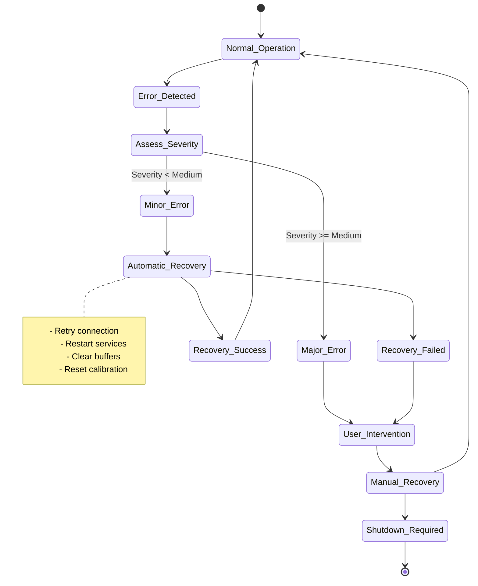

### 9.3 Diagnostic Tools

**Built-in Diagnostics:**
- **USB Connection Status**: Real-time monitoring of USB link quality
- **Frame Rate Monitor**: Track actual vs. target frame rates
- **Temperature Validation**: Compare with external reference thermometers
- **Memory Usage**: Monitor heap and native memory consumption
- **Processing Latency**: Measure end-to-end processing delays

**Diagnostic Output Format:**
```json
{
  "diagnostic_session": {
    "timestamp": "2024-01-31T10:30:00.000Z",
    "device_info": {
      "model": "TC001_PLUS",
      "serial": "TC001P-240131-001",
      "firmware": "1.3.7",
      "calibration_date": "2024-01-15"
    },
    "performance_metrics": {
      "frame_rate": {
        "target": 25.0,
        "actual": 24.8,
        "jitter": 0.3
      },
      "latency": {
        "capture_to_display": 42,
        "capture_to_storage": 156
      },
      "memory_usage": {
        "heap_mb": 45.2,
        "native_mb": 78.6,
        "gc_frequency": 0.2
      }
    },
    "error_log": []
  }
}
```

## 10. Advanced Features and Optimization

### 10.1 Performance Optimization

**Memory Management:**
- **Object Pooling**: Reuse ByteBuffer objects for frame processing
- **Native Memory**: Utilize native heap for large data buffers
- **Streaming Processing**: Process frames without full buffering
- **Compression**: Apply lossless compression for data storage

**Memory Usage Profile:**
```
Per Frame Memory Requirements:
├── Raw Frame Data: 98,304 bytes (256×192×2)
├── Processed Frame: 196,608 bytes (256×192×4)
├── Display Buffer: 786,432 bytes (1024×768×4)
├── Metadata: 1,024 bytes
└── Total per Frame: ~1.08 MB

Sustained Memory Usage (25 fps):
├── Processing Buffers: ~25 MB
├── Display Buffers: ~15 MB
├── Recording Buffers: ~50 MB
└── Total Working Set: ~90 MB
```

### 10.2 Threading Architecture

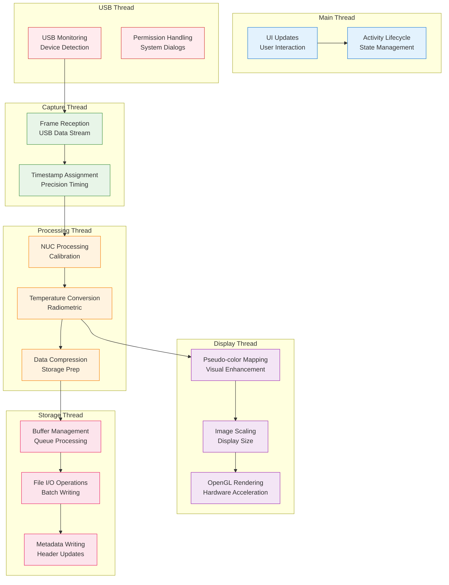

### 10.3 Multi-Device Management

**Device Prioritization Algorithm:**
```kotlin
class UsbDevicePrioritizer {
    fun optimizeDeviceSelection(devices: List<UsbDevice>): PriorityResult {
        return devices
            .map { device -> assessDevicePriority(device) }
            .sortedByDescending { it.priorityScore }
            .let { sortedDevices ->
                PriorityResult(
                    primaryDevice = sortedDevices.firstOrNull(),
                    secondaryDevices = sortedDevices.drop(1),
                    balancingStrategy = determineLoadStrategy(sortedDevices)
                )
            }
    }
    
    private fun assessDevicePriority(device: UsbDevice): DeviceAssessment {
        val connectionStability = measureConnectionStability(device)
        val thermalPerformance = assessThermalPerformance(device)
        val calibrationStatus = validateCalibrationStatus(device)
        
        return DeviceAssessment(
            device = device,
            priorityScore = calculatePriorityScore(
                connectionStability, thermalPerformance, calibrationStatus
            ),
            priorityLevel = determinePriorityLevel(priorityScore)
        )
    }
}
```

## 11. Maintenance and Best Practices

### 11.1 Measurement Accuracy

**Emissivity Considerations:**
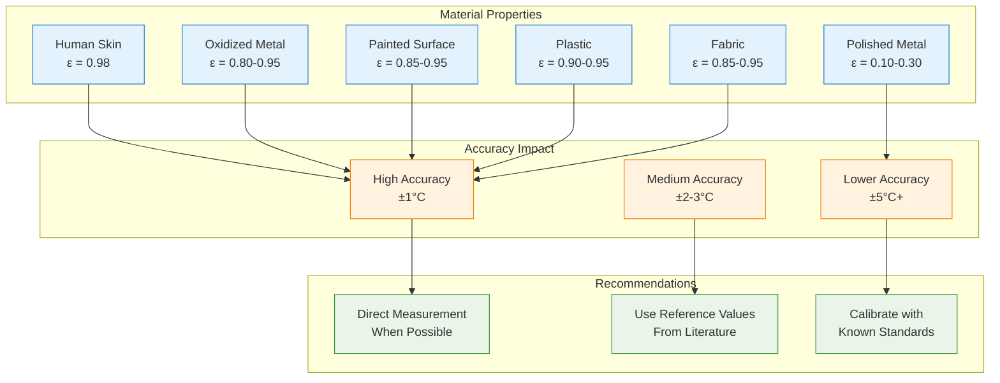

### 11.2 Routine Maintenance Schedule

**Daily Maintenance:**
1. **Lens Cleaning**: Use only lint-free microfiber cloth
2. **Visual Inspection**: Check for physical damage or contamination
3. **Calibration Verification**: Ensure automatic calibration is functioning
4. **Battery Check**: Verify adequate charge for planned usage

**Weekly Maintenance:**
1. **Accuracy Validation**: Compare readings with reference thermometer
2. **Connection Testing**: Verify stable USB communication
3. **Software Updates**: Check for app and firmware updates
4. **Performance Review**: Analyze recent recording quality metrics

**Monthly Maintenance:**
- Deep calibration validation
- Update camera firmware if available
- Review and clean storage directories
- Backup configuration settings

### 11.3 Calibration Procedures

**Automatic Calibration Sequence:**
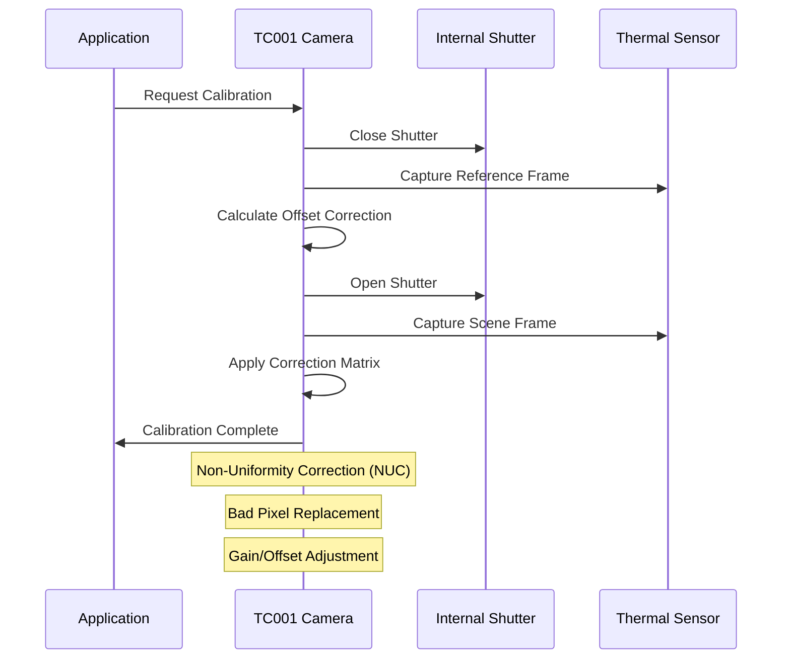

**Manual Calibration for Research Applications:**
```json
{
  "manual_calibration": {
    "procedure": "BLACKBODY_REFERENCE",
    "reference_points": [
      {
        "target_temperature": 30.0,
        "measured_values": {
          "mean": 30.1,
          "std_dev": 0.1,
          "pixel_count": 1024
        }
      },
      {
        "target_temperature": 40.0,
        "measured_values": {
          "mean": 39.9,
          "std_dev": 0.1,
          "pixel_count": 1024
        }
      }
    ],
    "calibration_curve": {
      "polynomial_order": 3,
      "coefficients": [0.0012, 0.9995, 0.0001, -0.0000],
      "r_squared": 0.9998,
      "max_error": 0.15
    }
  }
}
```

## 12. Integration with Multi-Sensor Recording System

### 12.1 System Architecture Integration

The TopDon TC001/TC001 Plus thermal cameras integrate seamlessly with the Multi-Sensor Recording System, providing synchronized thermal data alongside other sensor modalities including GSR (Galvanic Skin Response), video recording, and physiological sensors.

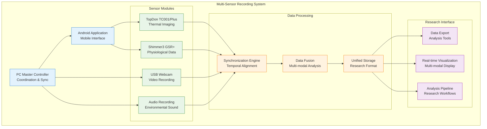

### 12.2 Synchronization with Other Sensors

**Multi-Modal Synchronization Architecture:**
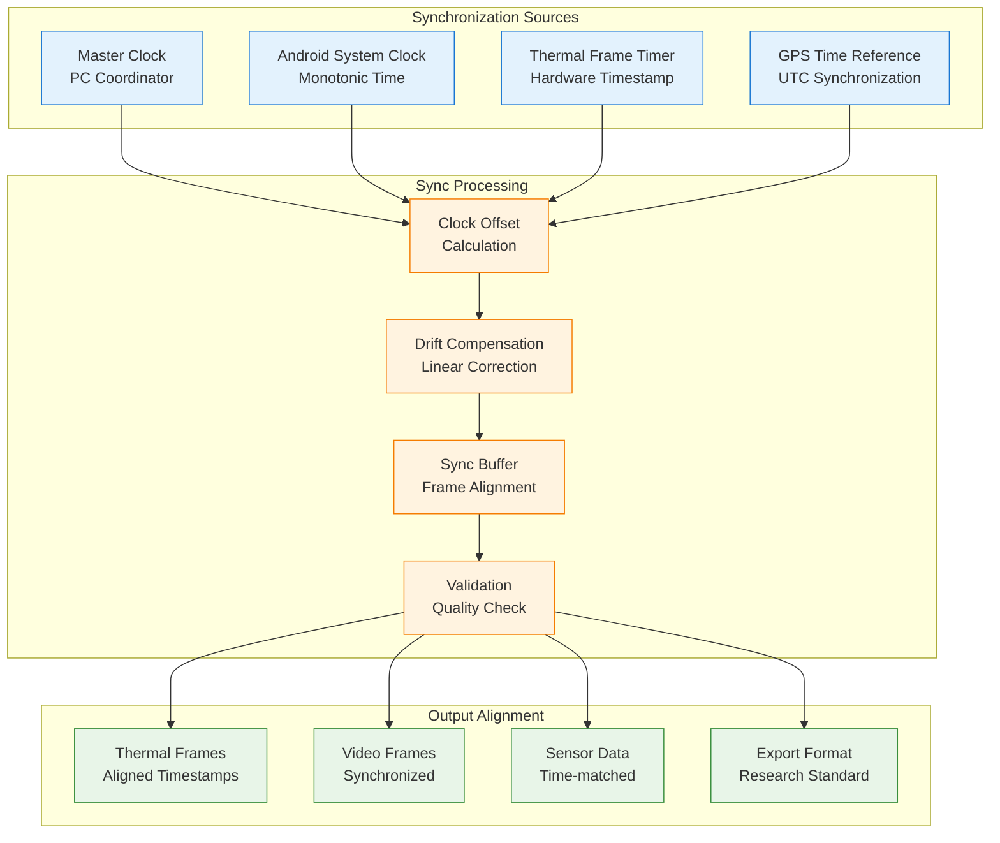

### 12.3 Research Data Integration

**Unified Data Format for Multi-Modal Analysis:**
```json
{
  "multi_sensor_session": {
    "session_id": "RESEARCH_20240131_103000",
    "timestamp": "2024-01-31T10:30:00.000Z",
    "duration_seconds": 600,
    "participant_id": "P001",
    "protocol_version": "v2.1",
    
    "thermal_data": {
      "device": "TC001_PLUS",
      "frame_count": 15000,
      "frame_rate": 25.0,
      "temperature_range": [-5.0, 45.0],
      "calibration_status": "VALIDATED",
      "data_file": "thermal_raw.bin"
    },
    
    "physiological_data": {
      "device": "SHIMMER3_GSR_PLUS",
      "sample_count": 150000,
      "sample_rate": 250.0,
      "channels": ["GSR", "PPG", "ECG"],
      "data_file": "physio_data.csv"
    },
    
    "video_data": {
      "device": "USB_WEBCAM_HD",
      "frame_count": 18000,
      "frame_rate": 30.0,
      "resolution": "1920x1080",
      "data_file": "video_recording.mp4"
    },
    
    "synchronization": {
      "master_clock": "PC_COORDINATOR",
      "sync_accuracy_us": 100,
      "drift_compensation": true,
      "alignment_quality": 0.98
    }
  }
}
```

### 12.4 Research Applications

**Supported Research Domains:**
- **Thermal Physiology**: Core body temperature monitoring and heat transfer analysis
- **Stress Response Research**: Correlation between thermal patterns and physiological stress indicators
- **Human-Computer Interaction**: Thermal feedback in interactive systems
- **Medical Research**: Non-invasive temperature monitoring for health assessment
- **Environmental Studies**: Human thermal comfort and adaptation research
- **Sports Science**: Athlete performance and recovery monitoring

**Data Analysis Workflows:**
```python
# Example multi-modal analysis workflow
import numpy as np
import pandas as pd
from thermal_analysis import ThermalProcessor
from physio_analysis import PhysiologyProcessor

# Load synchronized data
thermal_data = ThermalProcessor.load_session('thermal_raw.bin')
physio_data = PhysiologyProcessor.load_session('physio_data.csv')

# Perform temporal alignment
aligned_data = synchronize_modalities(thermal_data, physio_data)

# Extract features
thermal_features = thermal_data.extract_temperature_statistics()
stress_indicators = physio_data.extract_stress_markers()

# Correlation analysis
correlation_matrix = analyze_cross_modal_correlation(
    thermal_features, stress_indicators
)

# Generate research report
research_report = generate_analysis_report(
    thermal_data=thermal_data,
    physio_data=physio_data,
    correlations=correlation_matrix,
    session_metadata=session_metadata
)
```

---

## Appendices

### Appendix A: Quick Reference

**Connection Sequence:**
1. Enable USB debugging on Android
2. Connect camera with USB-C cable
3. Grant USB permissions
4. Launch Multi-Sensor Recording app
5. Verify connection status

**Essential Settings:**
- Frame Rate: 25 fps
- Emissivity: Material-dependent (0.95 default)
- Temperature Range: Application-dependent
- Display Mode: Pseudo-color recommended

**Emergency Procedures:**
- **Data Recovery**: Check temp storage for partial files
- **Emergency Stop**: Use Emergency Stop button or disconnect USB
- **Force Recovery**: Force-stop application if unresponsive

### Appendix B: Material Emissivity Reference

| Material | Emissivity (ε) | Notes |
|----------|----------------|-------|
| Human skin | 0.98 | Independent of skin color |
| Water | 0.96 | Clean water surface |
| Concrete | 0.95 | Aged concrete |
| Paint (non-metallic) | 0.90-0.95 | Most standard paints |
| Plastic | 0.90-0.95 | Most thermoplastics |
| Fabric | 0.85-0.95 | Natural and synthetic |
| Oxidized metals | 0.80-0.95 | Rusted or painted |
| Anodized aluminum | 0.70-0.80 | Depends on finish |
| Polished aluminum | 0.05-0.10 | Highly reflective |
| Polished steel | 0.10-0.30 | Mirror-like finish |

### Appendix C: Error Code Reference

| Error Code | Name | Severity | Description | Recovery Action |
|------------|------|----------|-------------|-----------------|
| **1001** | USB_DEVICE_DISCONNECTED | Critical | USB connection lost | Reconnect device and restart |
| **1002** | CAMERA_INITIALIZATION_FAILED | Critical | Camera hardware failure | Check compatibility and permissions |
| **2001** | FRAME_TRANSMISSION_TIMEOUT | High | Data transmission timeout | Check USB cable and bandwidth |
| **3001** | CALIBRATION_ACCURACY_DEGRADED | Medium | Temperature accuracy reduced | Perform recalibration |
| **4001** | FRAME_CORRUPTION_DETECTED | Medium | Corrupted frame data | Restart streaming and verify connection |
| **5001** | INVALID_TEMPERATURE_RANGE | Low | Invalid range parameters | Adjust temperature range settings |

---

*This comprehensive documentation provides complete coverage of the TopDon TC001 and TC001 Plus thermal camera device, SDK, and API integration within the Multi-Sensor Recording System. For component-specific details, refer to the individual modular documentation files.*

**Document Version**: 1.0  
**Last Updated**: January 31, 2024  
**Compatibility**: TopDon SDK 1.3.7, Multi-Sensor Recording System v1.0+, Android API 24+
