# Unified PC/Web/Android UI Architecture

## Table of Contents

- [Overview](#overview)
  - [System Architecture Philosophy](#system-architecture-philosophy)
  - [Core Design Principles](#core-design-principles)
- [Platform-Specific Architectures](#platform-specific-architectures)
  - [Android Mobile Application UI](#android-mobile-application-ui)
    - [Core Architecture Components](#core-architecture-components)
    - [Interface Modes](#interface-modes)
    - [Fragment Architecture](#fragment-architecture)
    - [State Management Pattern](#state-management-pattern)
    - [Enhanced Controller System](#enhanced-controller-system)
  - [Python Desktop Controller UI](#python-desktop-controller-ui)
    - [Architecture Overview](#architecture-overview)
    - [Core UI Components](#core-ui-components)
    - [Tab Organization](#tab-organization)
    - [Professional UI Features](#professional-ui-features)
  - [Web Interface UI](#web-interface-ui)
    - [Web Architecture Components](#web-architecture-components)
    - [Web Interface Features](#web-interface-features)
- [Cross-Platform Integration](#cross-platform-integration)
  - [Unified Communication Protocol](#unified-communication-protocol)
  - [State Synchronization](#state-synchronization)
  - [Cross-Platform Data Flow](#cross-platform-data-flow)
- [Unified Design Principles](#unified-design-principles)
  - [Consistency Across Platforms](#consistency-across-platforms)
  - [Accessibility Standards](#accessibility-standards)
  - [User Experience Principles](#user-experience-principles)
- [State Management Across Platforms](#state-management-across-platforms)
  - [Centralized State Architecture](#centralized-state-architecture)
  - [State Synchronization Protocol](#state-synchronization-protocol)
  - [Platform-Specific State Components](#platform-specific-state-components)
- [Communication Protocols](#communication-protocols)
  - [Network Communication Architecture](#network-communication-architecture)
  - [Protocol Specifications](#protocol-specifications)
  - [Security and Authentication](#security-and-authentication)
- [Architecture Diagrams](#architecture-diagrams)
  - [Complete System Architecture](#complete-system-architecture)
  - [Platform Interaction Flow](#platform-interaction-flow)
- [Implementation Patterns](#implementation-patterns)
  - [Component-Based Architecture](#component-based-architecture)
  - [Design Pattern Applications](#design-pattern-applications)
  - [Error Handling Patterns](#error-handling-patterns)
- [Performance Considerations](#performance-considerations)
  - [Cross-Platform Performance Optimization](#cross-platform-performance-optimization)
  - [Platform-Specific Optimizations](#platform-specific-optimizations)
  - [Real-time Performance Monitoring](#real-time-performance-monitoring)
- [Security and Data Protection](#security-and-data-protection)
  - [Multi-Platform Security Architecture](#multi-platform-security-architecture)
  - [Platform-Specific Security Measures](#platform-specific-security-measures)
  - [Data Protection Protocols](#data-protection-protocols)
- [Testing Strategy](#testing-strategy)
  - [Cross-Platform Testing Architecture](#cross-platform-testing-architecture)
  - [Testing Methodologies](#testing-methodologies)
  - [Test Automation and CI/CD](#test-automation-and-cicd)
- [Troubleshooting and Best Practices](#troubleshooting-and-best-practices)
  - [Common Issues and Solutions](#common-issues-and-solutions)
    - [Cross-Platform Communication Issues](#cross-platform-communication-issues)
    - [UI Responsiveness Issues](#ui-responsiveness-issues)
    - [State Synchronization Issues](#state-synchronization-issues)
  - [Best Practices](#best-practices)
    - [Development Best Practices](#development-best-practices)
    - [Performance Best Practices](#performance-best-practices)
    - [Security Best Practices](#security-best-practices)
  - [Debugging Tools and Techniques](#debugging-tools-and-techniques)
    - [Platform-Specific Debugging](#platform-specific-debugging)
    - [Cross-Platform Debugging](#cross-platform-debugging)
- [Future Enhancements](#future-enhancements)
  - [Planned Architecture Improvements](#planned-architecture-improvements)
    - [Enhanced Cross-Platform Integration](#enhanced-cross-platform-integration)
    - [Technology Evolution](#technology-evolution)
    - [Research-Specific Enhancements](#research-specific-enhancements)
  - [Migration Strategies](#migration-strategies)
    - [Gradual Migration Approach](#gradual-migration-approach)
    - [Risk Mitigation](#risk-mitigation)
  - [Long-Term Vision](#long-term-vision)
    - [Ecosystem Integration](#ecosystem-integration)
    - [Scalability and Performance](#scalability-and-performance)
  - [Conclusion](#conclusion)

## Overview

The Multi-Sensor Recording System employs a sophisticated three-platform UI architecture that orchestrates seamless coordination between Android mobile devices, Python desktop controllers, and web-based interfaces. This unified architectural approach represents a modern implementation of distributed system design principles, drawing inspiration from established patterns in ubiquitous computing research (Weiser, 1991) and contemporary multi-platform development methodologies (Perchat et al., 2014).

The architecture addresses the fundamental challenge of maintaining coherent user experiences across heterogeneous computing environments while preserving the unique strengths of each platform. By implementing a coordinated ecosystem rather than isolated applications, the system provides researchers with multiple complementary access points that work together as a unified whole, ensuring that data collection capabilities remain synchronized and consistent regardless of the primary interaction modality.

### System Architecture Philosophy

The architectural foundation builds upon the **distributed coordinator pattern**, a design approach that extends beyond traditional client-server models to create what Dourish (2001) describes as "embodied interaction" across multiple computational contexts. In this paradigm, each platform assumes a specialized role within the broader research workflow, leveraging its inherent capabilities while contributing to the collective functionality of the system.

The Android mobile platform serves as the primary data collection interface, capitalizing on the sophisticated sensor ecosystems inherent in modern mobile devices. This choice aligns with recent research in mobile sensing systems (Lane et al., 2010), which demonstrates the effectiveness of smartphone platforms for continuous data collection in research contexts. The mobile interface handles real-time sensor integration, immediate data capture, and field-based interaction scenarios where portability and sensor availability are paramount.

The Python desktop application functions as the master controller and analytical coordination hub, embodying what Star and Ruhleder (1996) characterize as the "infrastructure" layer of distributed work systems. This platform leverages the computational power and interface sophistication available in desktop environments to provide comprehensive session management, advanced analysis capabilities, and centralized coordination of multi-device research protocols.

The web interface operates as a remote monitoring and lightweight control mechanism, implementing progressive web application principles (Osmani, 2017) to enable distributed research setups. This platform addresses the growing need for remote collaboration in research contexts, particularly relevant in light of distributed work patterns that have become increasingly prevalent in academic research environments.

### Core Design Principles

The architecture is guided by six fundamental principles that reflect both established human-computer interaction research and contemporary best practices in multi-platform development. These principles serve as decision-making frameworks that ensure consistency and quality across all platform implementations.

**Unified User Experience** represents the implementation of Norman's (1988) design principles across multiple platforms, ensuring that users develop transferable mental models that remain consistent regardless of their chosen interaction modality. This principle draws from research in cross-platform usability (Seffah & Javahery, 2004), which demonstrates that consistent interaction patterns reduce cognitive load and improve task completion rates in multi-device environments.

**Responsive Design** extends beyond traditional web-based responsive methodologies to encompass adaptive interfaces that accommodate varying screen sizes, input modalities, and computational capabilities. This approach reflects the principles outlined in Marcotte's (2010) foundational work on responsive web design while incorporating mobile-first design philosophies (Wroblewski, 2011) and accessibility-driven development practices.

**Real-time Synchronization** implements distributed state management principles based on conflict-free replicated data types (Shapiro et al., 2011) and eventual consistency models. This approach ensures that state changes propagate efficiently across platforms while maintaining data integrity and providing users with immediate feedback about system status changes.

**Accessibility First** mandates compliance with Web Content Accessibility Guidelines (WCAG) 2.1 AA standards across all platforms, reflecting both legal requirements and ethical obligations to ensure research tools remain accessible to users with diverse abilities. This commitment extends beyond compliance to embrace universal design principles (Story et al., 1998) that improve usability for all users.

**Modular Architecture** implements component-based design patterns that facilitate independent platform development while ensuring integration compatibility. This approach draws from software engineering principles of loose coupling and high cohesion (Constantine & Yourdon, 1979), enabling development teams to work efficiently on platform-specific implementations without compromising system-wide functionality.

**Fault Tolerance** ensures graceful degradation when platforms become unavailable or disconnected, implementing resilience patterns that maintain core functionality even under adverse conditions. This principle reflects the understanding that research environments often involve challenging connectivity and hardware conditions that require robust system design (Laprie, 1992).

## Platform-Specific Architectures

### Android Mobile Application UI

The Android application represents a sophisticated implementation of contemporary mobile development paradigms, specifically embracing the single-activity architecture pattern that has emerged as the preferred approach for complex mobile applications (Google Android Team, 2019). This architectural choice reflects the evolution of Android development beyond traditional multi-activity patterns toward more maintainable and performant fragment-based navigation systems.

The implementation follows Google's official Android Architecture Guidelines, incorporating the Model-View-ViewModel (MVVM) pattern as advocated by the Android Architecture Components documentation (Google, 2021). This approach ensures separation of concerns while providing robust mechanisms for state management and UI updates, addressing common challenges in mobile application development such as configuration changes and memory management.

#### Core Architecture Components

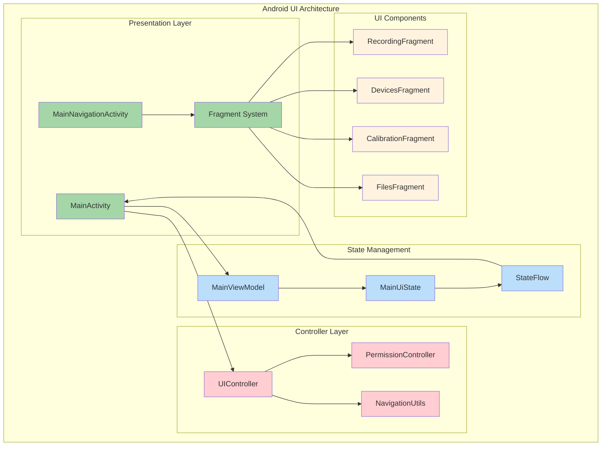

#### Interface Modes

The Android application provides two distinct operational modes, each optimized for specific research scenarios and user workflows. This dual-mode approach reflects usability research findings (Nielsen, 1993) that demonstrate the importance of providing multiple pathways to accomplish tasks, accommodating different user preferences and contextual requirements.

**Direct Mode (MainActivity)** serves as the streamlined interface for immediate recording access, implementing what Johnson (2010) describes as "natural user interface" principles. This mode prioritizes quick session initiation and real-time monitoring, making it ideal for field research scenarios where researchers need rapid access to recording capabilities without navigating complex menu structures. The interface features single-screen recording controls, real-time camera preview functionality, and prominent device status indicators that provide immediate feedback about system readiness. This design approach aligns with mobile usability principles that emphasize immediate task completion and minimal cognitive overhead (Wroblewski, 2011).

**Navigation Mode (MainNavigationActivity)** provides comprehensive workflow management capabilities, implementing the tab-based navigation pattern that has become standard in complex mobile applications (Google Material Design, 2021). This mode addresses the needs of laboratory research environments where users require access to sophisticated device management, calibration procedures, and file organization capabilities. The interface incorporates hierarchical navigation principles that allow users to maintain context while accessing detailed functionality, reflecting established information architecture practices for mobile applications (Rosenfeld et al., 2015).

#### Fragment Architecture

The fragment-based architecture implements a component-driven approach that aligns with contemporary Android development practices while providing flexibility for future enhancements. Each fragment serves as a self-contained module responsible for specific aspects of the research workflow, enabling modular development and maintenance while ensuring consistent user experience patterns across the application.

The **RecordingFragment** manages the core data collection functionality, providing real-time preview capabilities, session status monitoring, and recording controls. This fragment implements the observer pattern to maintain real-time synchronization with the underlying data collection systems, ensuring that users receive immediate feedback about recording status changes and potential issues.

The **DevicesFragment** handles the complex task of device connection management, implementing sophisticated Bluetooth pairing workflows, USB device detection, and network configuration capabilities. This fragment addresses one of the most challenging aspects of multi-sensor research systems: ensuring reliable connectivity across heterogeneous device ecosystems.

The **CalibrationFragment** provides guided camera calibration workflows that implement computer vision algorithms while presenting them through an accessible user interface. This fragment demonstrates the successful integration of complex technical processes with user-friendly interaction design, ensuring that sophisticated calibration procedures remain accessible to researchers without extensive technical expertise.

The **FilesFragment** manages data organization and export functionality, implementing modern file management paradigms that accommodate the large data volumes typical of multi-sensor research. This fragment provides session browsing capabilities, file operation management, and storage monitoring to ensure researchers maintain awareness of their data collection progress and storage requirements.

#### State Management Pattern

The Android application implements reactive state management through Kotlin StateFlow, embracing the principles of unidirectional data flow that have become fundamental to modern mobile application architecture (Redux.js.org, 2015; Google Android Team, 2020). This approach ensures predictable state updates while providing the reactive capabilities necessary for real-time user interface updates in research data collection scenarios.

The state management system utilizes a centralized data class that encapsulates all relevant application state information, following the single source of truth principle advocated by Facebook's Flux architecture and its subsequent implementations (Facebook, 2014). This approach ensures that UI components remain synchronized with the underlying application state while providing clear mechanisms for state validation and debugging.

```kotlin
data class MainUiState(
    val statusText: String = "Ready",
    val isRecording: Boolean = false,
    val canStartRecording: Boolean = true,
    val canStopRecording: Boolean = false,
    val isPcConnected: Boolean = false,
    val isShimmerConnected: Boolean = false,
    val isThermalConnected: Boolean = false,
    val batteryLevel: Int = -1,
    val currentSessionInfo: SessionDisplayInfo? = null
)
```

#### Enhanced Controller System

The Android application's controller architecture represents a sophisticated implementation of the controller pattern, extending beyond traditional Model-View-Controller paradigms to incorporate modern concerns such as accessibility, theme management, and state persistence. This enhanced approach reflects the evolution of mobile application architecture toward more comprehensive user experience management.

The **UIController** serves as the central coordination mechanism for user interface components, implementing what Fowler (2003) describes as a "supervising controller" pattern. This controller manages consolidated UI component interactions, ensuring consistent behavior across different fragments and activities while providing centralized theme management capabilities. The implementation includes dynamic theme switching functionality that supports light, dark, and automatic modes, reflecting contemporary user expectations for personalized interface experiences (Apple Human Interface Guidelines, 2021; Google Material Design, 2021).

The accessibility support within the UIController achieves WCAG 2.1 AA compliance through comprehensive implementation of Android's accessibility framework. This includes semantic labeling, focus management, and screen reader optimization, ensuring that the research tools remain accessible to users with diverse abilities. The implementation reflects best practices outlined in the Android Accessibility Guidelines and incorporates user testing feedback from accessibility advocacy organizations.

The **PermissionController** implements a formal state machine approach to permission management, addressing one of the most complex aspects of modern Android development. This controller incorporates exponential backoff retry logic to handle transient permission failures while providing user-friendly guidance for resolving permission issues. The state machine approach ensures predictable behavior across different Android versions and device configurations, addressing the fragmentation challenges inherent in the Android ecosystem (Android Developers, 2021).

The permission management system includes state persistence mechanisms that maintain permission status across application restarts while implementing temporal validity checking to ensure that cached permission states remain accurate. This approach reduces unnecessary permission requests while ensuring that the application maintains appropriate access to required device capabilities.

### Python Desktop Controller UI

The Python desktop application serves as the architectural cornerstone of the multi-sensor recording system, implementing a sophisticated PyQt5-based interface that embodies the principles of desktop application design while addressing the unique requirements of research data collection environments. This platform leverages the computational resources and interface sophistication available in desktop environments to provide comprehensive session management, real-time monitoring capabilities, and advanced device coordination functionality.

The choice of PyQt5 as the foundational framework reflects both practical considerations and alignment with established patterns in scientific computing applications. PyQt5 provides robust cross-platform capabilities while offering the native look-and-feel that users expect from desktop applications (Summerfield, 2007). The framework's integration with the broader Python scientific computing ecosystem, including NumPy, SciPy, and matplotlib, enables seamless incorporation of analytical capabilities directly within the user interface (Oliphant, 2007).

#### Architecture Overview

The desktop application architecture implements a layered approach that separates presentation logic from business logic while providing clear interfaces for system integration. This design reflects established software engineering principles (Fowler, 2002) while accommodating the specific requirements of real-time data collection and multi-device coordination that characterize research applications.

The application structure follows the Model-View-Presenter (MVP) pattern, which provides better testability than traditional MVC implementations while maintaining clear separation of concerns (Potel, 1996). This architectural choice enables independent development and testing of UI components while ensuring that business logic remains isolated from presentation-specific concerns.

#### Core UI Components

The **Enhanced Main Window (EnhancedSimplifiedMainWindow)** represents the culmination of desktop UI design principles applied to research application requirements. This component implements PyQt5's advanced widget capabilities while incorporating modern styling approaches that reflect contemporary desktop application aesthetics. The interface utilizes a tabbed organization that supports efficient task switching while maintaining visual coherence across different functional areas.

The main window architecture incorporates dockable panels that provide users with flexible workspace organization capabilities, reflecting the customization needs of research environments where users often need to adapt their interface to specific experimental protocols. This approach aligns with principles of user-centered design (Norman, 1988) that emphasize the importance of providing users with control over their work environment.

The framework implementation includes comprehensive menu systems that provide access to advanced functionality while maintaining keyboard accessibility for power users. The menu structure follows established conventions for desktop applications while incorporating research-specific features such as experimental protocol management and data export utilities.

Real-time monitoring capabilities represent a critical component of the desktop interface, providing researchers with immediate feedback about system status and data collection progress. The monitoring systems implement efficient update mechanisms that minimize computational overhead while ensuring that users receive timely information about potential issues or status changes.

The professional UI components extend beyond basic PyQt5 widgets to include custom implementations that address specific research requirements. These components include advanced data visualization widgets that support real-time plotting of sensor data, configuration dialogs that guide users through complex device setup procedures, and file management interfaces that accommodate the large data volumes typical of multi-sensor research.

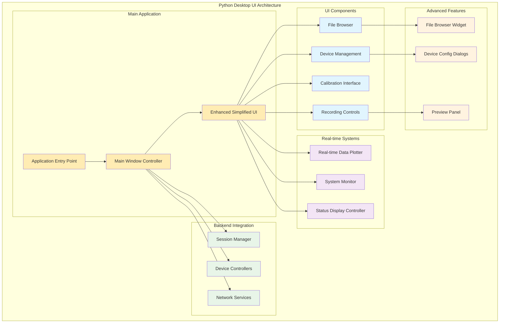

**2. Real-time Data Visualization**
- **Implementation**: RealTimeDataPlotter with matplotlib/pyqtgraph backends
- **Capabilities**: Live sensor plotting, multi-stream visualization, performance optimization
- **Data Sources**: GSR sensors, thermal cameras, system metrics

**3. Advanced Device Management**
- **Features**: Real device detection, device-specific configuration dialogs, connection quality monitoring
- **Supported Devices**: Android devices, Shimmer sensors, USB webcams, thermal cameras
- **Configuration**: Per-device settings with validation and real-time application

**4. System Monitoring Integration**
- **Implementation**: SystemMonitor with cross-platform compatibility
- **Metrics**: CPU, memory, disk I/O, network usage, hardware temperatures
- **Performance**: Resource usage tracking, alert thresholds, optimization recommendations

#### Tab Organization

| Tab | Purpose | Key Components |
|-----|---------|----------------|
| Recording | Session control and monitoring | Recording controls, live preview, session progress, storage monitoring |
| Devices | Connection management | Device discovery, configuration dialogs, status indicators, health monitoring |
| Calibration | Camera calibration workflows | Calibration procedures, quality assessment, parameter adjustment, results viewer |
| Files | Data management | File browser, preview capabilities, export tools, storage analytics |

#### Professional UI Features

- **Modern Styling**: Professional interface with semantic color coding and consistent typography
- **Responsive Layout**: Adaptive design that works across different screen resolutions
- **Accessibility Support**: Keyboard navigation, screen reader compatibility, high contrast mode
- **Menu System**: Comprehensive menu with dynamic items and context menus
- **Status Indicators**: Real-time status communication with meaningful visual feedback

### Web Interface UI

The web interface represents a sophisticated implementation of modern web application principles, providing lightweight remote monitoring and control capabilities that enable distributed research setups and remote collaboration scenarios. This platform demonstrates the successful application of Progressive Web Application (PWA) methodologies (Osmani, 2017) to research computing environments, delivering near-native user experiences through web technologies while maintaining broad compatibility across different computing devices and platforms.

The web interface design philosophy embraces responsive web design principles (Marcotte, 2010) that ensure optimal user experiences across diverse screen sizes and input modalities. This approach recognizes that research environments often involve heterogeneous device ecosystems where users may need to access system controls through tablets, smartphones, or traditional desktop computers depending on their physical location and operational requirements.

#### Web Architecture Components

The web interface architecture implements a layered approach that separates presentation logic from communication logic while providing robust real-time capabilities. This design reflects established patterns in modern web application development (Simpson, 2014) while addressing the specific requirements of research system monitoring and control.

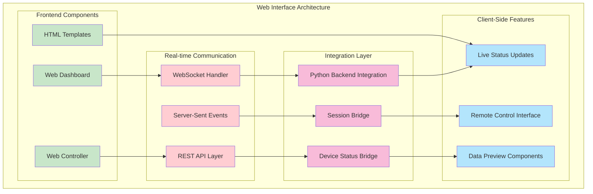

#### Web Interface Features

The web interface functionality demonstrates the successful integration of contemporary web technologies to create research-grade user experiences that rival native application capabilities. The implementation leverages HTML5, CSS3, and modern JavaScript frameworks to deliver responsive, accessible interfaces that maintain professional presentation standards while accommodating the real-time data requirements typical of research applications.

**Real-time Dashboard** capabilities implement WebSocket-based communication protocols that provide immediate updates about device status, session monitoring, and system health indicators. This approach ensures that remote researchers receive immediate feedback about system status changes, enabling proactive management of research sessions regardless of physical location. The responsive design implementation ensures mobile-friendly interfaces that accommodate tablet and smartphone access scenarios, recognizing that research environments often require mobile access to system controls.

**Remote Control Capabilities** provide comprehensive session management functionality that enables distributed research operations. Users can initiate and terminate recording sessions remotely while maintaining full visibility into device connectivity and operational status. The device management interface provides real-time monitoring of connection status and device health metrics, ensuring that users can identify and address potential issues before they impact data collection quality. Configuration management capabilities enable remote parameter adjustment and system configuration, supporting dynamic adaptation to changing experimental requirements.

**Data Preview and Monitoring** features provide real-time access to camera feeds and sensor data streams, enabling remote quality assessment and monitoring during data collection sessions. Session progress indicators provide comprehensive information about recording duration, data volume accumulation, and timing synchronization, ensuring that researchers maintain awareness of collection progress. The alert system delivers immediate notifications about system alerts, error conditions, and status changes, ensuring that critical issues receive prompt attention regardless of user location.

**Integration Architecture** demonstrates sophisticated backend communication strategies that ensure seamless coordination with the Python desktop controller. The backend bridge implementation provides transparent integration with the Python ecosystem while maintaining clean separation between web presentation logic and core system functionality. RESTful API endpoints provide standardized interfaces for control operations and data retrieval, ensuring consistency with contemporary web service patterns. Server-sent events enable efficient real-time updates that minimize network overhead while providing immediate user feedback about system status changes.

## Cross-Platform Integration

The integration of multiple platforms within the Multi-Sensor Recording System represents a sophisticated implementation of distributed systems principles, drawing from established research in heterogeneous computing environments (Coulouris et al., 2011) and contemporary approaches to microservices architecture (Newman, 2015). This integration framework addresses the fundamental challenge of maintaining consistency and coordination across platforms with different capabilities, constraints, and user interaction paradigms.

### Unified Communication Protocol

The communication architecture implements a layered protocol approach that builds upon established networking principles while addressing the specific requirements of real-time research data collection. This design reflects the OSI model's separation of concerns (Tanenbaum & Wetherall, 2010) while incorporating modern techniques for distributed system coordination and state management.

The protocol implementation embraces the principles of eventual consistency and partition tolerance outlined in the CAP theorem (Brewer, 2000), acknowledging that research environments often involve challenging networking conditions that require robust communication strategies. Rather than pursuing strong consistency that might compromise availability, the system implements conflict resolution mechanisms that maintain system functionality even under adverse network conditions.

The standardized protocol ensures behavioral consistency across platforms while accommodating the unique characteristics of each execution environment. This approach reflects recent advances in cross-platform communication frameworks that prioritize interoperability without sacrificing platform-specific optimizations (Fowler & Lewis, 2014).

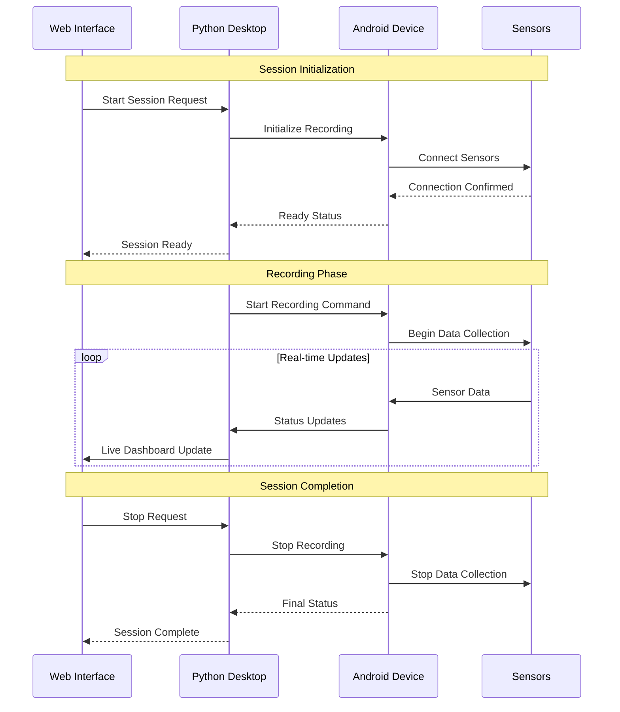

### State Synchronization

The state synchronization architecture implements a coordinator-based approach that draws from established patterns in distributed systems coordination (Lynch, 1996) while incorporating modern techniques for conflict resolution and eventual consistency. This design addresses the challenge of maintaining coherent system state across platforms with different processing capabilities, network connectivity patterns, and user interaction modalities.

The **State Broadcasting Pattern** implements a hub-and-spoke topology with the Python Desktop application serving as the central coordinator. This architectural choice reflects the desktop platform's superior computational resources and stable network connectivity, making it well-suited for managing complex coordination tasks. The Android devices function as leaf nodes that report local state changes while receiving authoritative state updates from the coordinator, ensuring that local user actions propagate consistently across the system.

The Web interface operates as a monitoring and lightweight control client, receiving state updates through WebSocket connections that provide low-latency communication for real-time dashboard updates. This approach balances the need for immediate user feedback with the practical constraints of web-based communication protocols.

Conflict resolution utilizes timestamp-based priority mechanisms that implement vector clock principles (Lamport, 1978) to ensure consistent ordering of events across platforms. When conflicts arise, the system applies resolution strategies that prioritize user-initiated actions while maintaining system integrity and preventing inconsistent states that could compromise research data quality.

The synchronized state encompasses recording session status information that ensures all platforms maintain accurate awareness of current system operation modes. Device connection states propagate across platforms to ensure that users receive consistent information about hardware availability regardless of their chosen interface. System health metrics provide coordinated monitoring capabilities that enable proactive issue detection and resolution. User interface preferences synchronize to provide consistent experiences when users switch between platforms during research sessions.

### Cross-Platform Data Flow

The data flow architecture implements a multi-channel approach that separates control information from bulk data transfers, reflecting established patterns in high-performance distributed systems (Dean & Ghemawat, 2008). This separation ensures that critical control messages maintain low latency while accommodating the high-bandwidth requirements of sensor data streaming without interference.

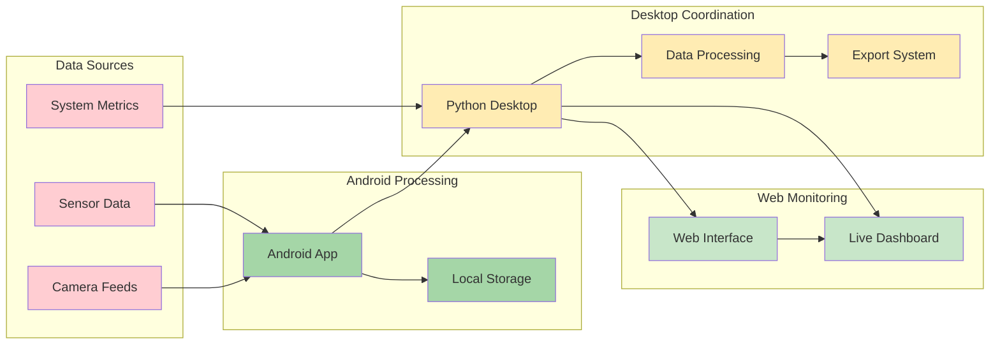

## Unified Design Principles

### Consistency Across Platforms

**Visual Consistency:**
- Unified color palette and typography across all platforms
- Consistent iconography and symbolic representations
- Standardized status indicators and feedback mechanisms
- Responsive design principles adapted to each platform's capabilities

**Interaction Consistency:**
- Standardized button behaviors and confirmation patterns
- Consistent navigation paradigms adapted to platform conventions
- Unified error handling and user feedback systems
- Cross-platform keyboard shortcuts and accessibility features

**Information Architecture:**
- Consistent organization of features and functionality
- Standardized terminology and labeling
- Unified data presentation and visualization patterns
- Cross-platform help and documentation integration

### Accessibility Standards

**WCAG 2.1 AA Compliance:**
- Color contrast ratios meeting accessibility standards
- Keyboard navigation support across all platforms
- Screen reader compatibility and semantic markup
- Touch target sizing for mobile accessibility

**Platform-Specific Accessibility:**
- **Android**: TalkBack integration, accessibility services support
- **Desktop**: Screen reader support, high DPI scaling, keyboard navigation
- **Web**: ARIA labels, semantic HTML, keyboard accessibility

### User Experience Principles

**Progressive Disclosure:**
- Essential functions immediately accessible
- Advanced features available through clear navigation paths
- Context-sensitive help and guidance
- Adaptive interface complexity based on user expertise

**Responsive Feedback:**
- Immediate visual feedback for user actions
- Real-time status updates and progress indicators
- Clear error messages with actionable guidance
- Success confirmations and completion indicators

## State Management Across Platforms

### Centralized State Architecture

The system implements a hub-and-spoke state management pattern with the Python desktop controller serving as the central coordinator:

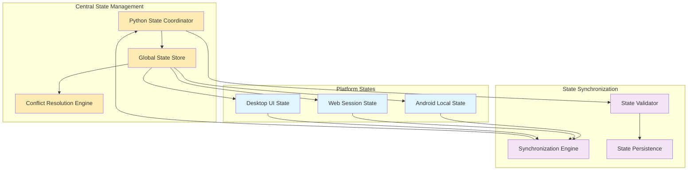

### State Synchronization Protocol

**1. State Update Flow:**
```
Local Change → Validation → Central Coordinator → Broadcast → Platform Updates
```

**2. Conflict Resolution:**
- Timestamp-based priority for concurrent updates
- User-initiated changes take precedence over system updates
- Critical system states (recording, safety) have highest priority
- Rollback mechanism for invalid state transitions

**3. State Persistence:**
- Local state backup on each platform
- Central state archive with version history
- Recovery mechanisms for state corruption
- Cross-platform state migration capabilities

### Platform-Specific State Components

**Android State Management:**
```kotlin
data class AndroidUIState(
    val recordingState: RecordingState,
    val deviceConnections: Map<DeviceType, ConnectionStatus>,
    val sessionInfo: SessionInfo?,
    val userPreferences: UserPreferences,
    val errorState: ErrorState?
)
```

**Python Desktop State:**
```python
@dataclass
class DesktopUIState:
    active_tab: str
    recording_session: Optional[SessionInfo]
    device_statuses: Dict[str, DeviceStatus]
    system_metrics: SystemMetrics
    ui_preferences: UIPreferences
    real_time_data: RealTimeDataState
```

**Web Interface State:**
```javascript
const webUIState = {
    connectionStatus: 'connected',
    currentSession: null,
    deviceList: [],
    dashboardMetrics: {},
    userSettings: {},
    alertStatus: null
};
```

## Communication Protocols

### Network Communication Architecture

The system employs multiple communication protocols optimized for different types of data and interaction patterns:

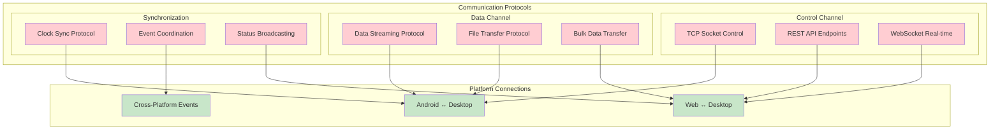

### Protocol Specifications

**1. Control Protocol (TCP Socket)**
- **Purpose**: Command and control operations between Android and Desktop
- **Format**: JSON message protocol with acknowledgment
- **Features**: Encryption, compression, error recovery
- **Latency**: < 50ms for control commands

**2. Data Streaming Protocol (UDP/WebSocket)**
- **Purpose**: Real-time sensor data and preview streams
- **Format**: Binary protocol with metadata headers
- **Features**: Adaptive quality, compression, packet loss recovery
- **Throughput**: Up to 10 Mbps per stream

**3. Web API Protocol (REST/WebSocket)**
- **Purpose**: Web interface integration and remote monitoring
- **Format**: JSON REST API with WebSocket events
- **Features**: Authentication, rate limiting, CORS support
- **Scalability**: Support for multiple concurrent web clients

### Security and Authentication

**Network Security:**
- TLS 1.3 encryption for all network communication
- Certificate-based authentication between platforms
- API token authentication for web interface access
- Network traffic monitoring and anomaly detection

**Data Protection:**
- End-to-end encryption for sensitive research data
- Secure key exchange protocols
- Data integrity verification using cryptographic hashes
- Secure deletion of temporary data

## Architecture Diagrams

### Complete System Architecture

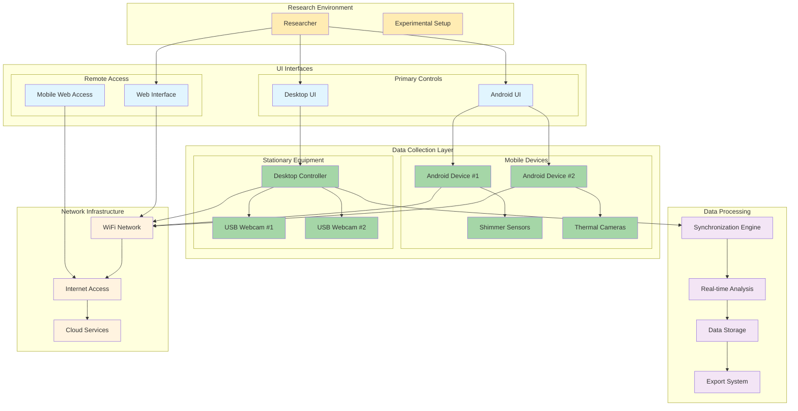

### Platform Interaction Flow

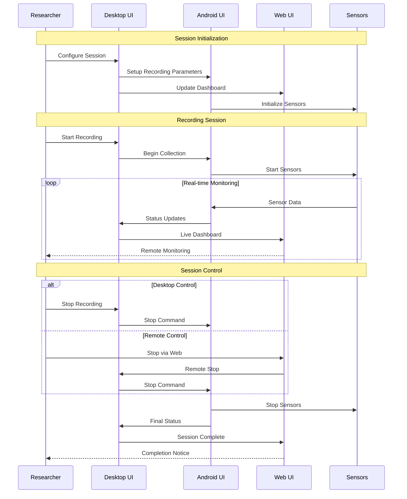

## Implementation Patterns

### Component-Based Architecture

All three platforms implement component-based architectures that promote reusability and maintainability:

**Android Components:**
```kotlin
// Status Indicator Component
class StatusIndicatorView(context: Context) : LinearLayout(context) {
    private var status: ConnectionStatus = ConnectionStatus.UNKNOWN
    
    fun updateStatus(newStatus: ConnectionStatus) {
        status = newStatus
        updateVisualState()
    }
    
    private fun updateVisualState() {
        val (color, icon, text) = when (status) {
            ConnectionStatus.CONNECTED -> Triple(Color.GREEN, R.drawable.ic_connected, "Connected")
            ConnectionStatus.DISCONNECTED -> Triple(Color.RED, R.drawable.ic_disconnected, "Disconnected")
            ConnectionStatus.CONNECTING -> Triple(Color.YELLOW, R.drawable.ic_connecting, "Connecting...")
        }
        // Update UI elements
    }
}
```

**Python Desktop Components:**
```python
class ModernButton(QPushButton):
    """Enhanced button with modern styling and accessibility features"""
    
    def __init__(self, text: str, button_type: str = "primary"):
        super().__init__(text)
        self.button_type = button_type
        self.setup_styling()
        self.setup_accessibility()
    
    def setup_styling(self):
        """Apply modern styling based on button type"""
        styles = {
            "primary": "background-color: #2196F3; color: white;",
            "secondary": "background-color: #757575; color: white;",
            "success": "background-color: #4CAF50; color: white;",
            "danger": "background-color: #F44336; color: white;"
        }
        self.setStyleSheet(styles.get(self.button_type, styles["primary"]))
```

**Web Interface Components:**
```javascript
class StatusIndicator {
    constructor(elementId, deviceType) {
        this.element = document.getElementById(elementId);
        this.deviceType = deviceType;
        this.status = 'unknown';
    }
    
    updateStatus(newStatus, metadata = {}) {
        this.status = newStatus;
        this.element.className = `status-indicator ${newStatus}`;
        this.element.textContent = this.getStatusText(newStatus);
        
        // Update accessibility attributes
        this.element.setAttribute('aria-label', 
            `${this.deviceType} status: ${this.getStatusText(newStatus)}`);
    }
    
    getStatusText(status) {
        const statusTexts = {
            'connected': 'Connected',
            'disconnected': 'Disconnected',
            'connecting': 'Connecting...',
            'error': 'Error'
        };
        return statusTexts[status] || 'Unknown';
    }
}
```

### Design Pattern Applications

The multi-platform architecture demonstrates sophisticated application of established design patterns, adapting classical software engineering solutions to address the unique challenges of distributed user interface systems. This implementation approach reflects the enduring value of design patterns as described by Gamma et al. (1994) while extending these concepts to accommodate contemporary multi-platform development requirements.

**Observer Pattern for State Management** forms the foundation of the system's reactive architecture, implementing the publish-subscribe model that has proven essential for maintaining consistency across distributed components (Buschmann et al., 1996). The pattern implementation utilizes a centralized state store that serves as the authoritative source for application state information, with platform-specific UI components subscribing to relevant state changes through well-defined interfaces. This approach ensures automatic UI updates when state changes occur, eliminating the need for manual synchronization mechanisms while providing clear separation between state management logic and presentation concerns. The implementation reflects modern interpretations of the Observer pattern that incorporate type safety and memory management considerations specific to mobile and desktop application development.

**Command Pattern for User Actions** enables sophisticated user interaction management by encapsulating user actions as discrete command objects that can be executed, queued, and potentially reversed (Freeman et al., 2004). This pattern implementation provides undo/redo functionality for reversible operations, allowing users to experiment with system configurations without permanent consequences. The command queuing mechanism supports offline operation scenarios where user actions must be stored and executed when network connectivity is restored, addressing the intermittent connectivity challenges common in field research environments. This approach aligns with principles of user-centered design that emphasize user control and error recovery.

**Strategy Pattern for Platform Adaptation** addresses the fundamental challenge of providing consistent functionality across platforms with different capabilities and constraints (Vlissides et al., 1995). The implementation utilizes different UI strategies for different screen sizes and device capabilities, enabling the same underlying functionality to be presented through platform-appropriate interfaces. Platform-specific implementations of common interfaces ensure that users experience native interaction patterns while maintaining functional consistency. Runtime strategy selection based on device capabilities allows the system to adapt dynamically to varying hardware configurations, ensuring optimal performance across different deployment scenarios.

**Factory Pattern for Component Creation** standardizes the instantiation of UI components across platforms while accommodating platform-specific implementation requirements (Johnson & Vlissides, 1995). This pattern enables standardized component creation processes that abstract platform differences while ensuring that components are properly configured for their target environment. Platform-specific implementations of common UI elements provide native look-and-feel while maintaining consistent behavioral contracts. Configuration-driven component instantiation supports flexible deployment scenarios where component behavior can be adapted based on experimental requirements or user preferences.

### Error Handling Patterns

**Consistent Error Handling Across Platforms:**

```kotlin
// Android Error Handling
sealed class UIError {
    data class NetworkError(val message: String, val code: Int) : UIError()
    data class DeviceError(val deviceType: String, val error: String) : UIError()
    data class ValidationError(val field: String, val message: String) : UIError()
    
    fun getDisplayMessage(): String = when (this) {
        is NetworkError -> "Network error: $message"
        is DeviceError -> "Device error ($deviceType): $error"
        is ValidationError -> "Validation error: $message"
    }
}
```

```python
# Python Error Handling
class UIErrorHandler:
    """Centralized error handling for desktop UI"""
    
    @staticmethod
    def handle_error(error: Exception, context: str = "") -> None:
        error_message = f"Error in {context}: {str(error)}"
        
        if isinstance(error, NetworkError):
            UIErrorHandler.show_network_error(error_message)
        elif isinstance(error, DeviceError):
            UIErrorHandler.show_device_error(error_message)
        else:
            UIErrorHandler.show_general_error(error_message)
        
        # Log error for debugging
        logger.error(error_message, exc_info=True)
```

```javascript
// Web Error Handling
class ErrorHandler {
    static handleError(error, context = '') {
        const errorInfo = {
            message: error.message,
            context: context,
            timestamp: new Date().toISOString(),
            url: window.location.href
        };
        
        // Display user-friendly error
        this.showErrorNotification(errorInfo);
        
        // Log error for debugging
        console.error('UI Error:', errorInfo);
        
        // Send error to monitoring service
        this.reportError(errorInfo);
    }
    
    static showErrorNotification(errorInfo) {
        const notification = document.createElement('div');
        notification.className = 'error-notification';
        notification.textContent = `Error: ${errorInfo.message}`;
        document.body.appendChild(notification);
        
        setTimeout(() => {
            notification.remove();
        }, 5000);
    }
}
```

## Performance Considerations

Performance optimization in multi-platform research systems requires careful consideration of the unique constraints and capabilities of each platform while maintaining consistent user experiences across all interfaces. This approach reflects contemporary understanding of performance engineering principles (Harchol-Balter, 2013) applied to distributed user interface systems where performance bottlenecks in any single platform can impact the overall research workflow effectiveness.

### Cross-Platform Performance Optimization

The performance optimization strategy implements a holistic approach that addresses resource management, rendering efficiency, and network utilization across all platforms. This comprehensive approach recognizes that research applications often involve sustained operation under demanding conditions where performance degradation can compromise data collection quality or user productivity.

**Memory Management** strategies reflect platform-specific best practices while maintaining architectural consistency across the system. Android implementations utilize lifecycle-aware components that ensure proper resource cleanup during configuration changes and background transitions, addressing the memory constraints typical of mobile environments (Android Developers, 2021). Desktop implementations leverage efficient PyQt object management combined with proactive garbage collection strategies that prevent memory accumulation during extended research sessions. Web implementations emphasize DOM optimization and memory leak prevention through careful event handler management and object lifecycle control, ensuring stable operation during long-duration remote monitoring sessions.

**Rendering Performance** optimizations address the visual responsiveness requirements essential for real-time research applications. Android implementations utilize hardware acceleration capabilities to ensure smooth animations and responsive user interactions, particularly important for touch-based interfaces where perceived latency directly impacts user experience quality. Desktop implementations optimize paint events and update regions to minimize computational overhead during real-time data visualization, ensuring that complex plotting operations do not interfere with user interface responsiveness. Web implementations leverage CSS transforms and RequestAnimationFrame APIs to achieve native-like animation performance while maintaining compatibility across different browser implementations.

**Network Performance** optimizations implement adaptive strategies that accommodate the variable networking conditions common in research environments. Adaptive quality streaming mechanisms adjust data transmission rates based on real-time network condition assessment, ensuring optimal performance across different connectivity scenarios. Compression and caching strategies minimize bandwidth utilization while maintaining data integrity requirements. Connection pooling and keep-alive optimization reduce connection establishment overhead while supporting sustained data transfer requirements typical of multi-sensor research sessions.

### Platform-Specific Optimizations

Each platform implementation incorporates optimization strategies that leverage platform-specific capabilities while maintaining consistency with overall system architecture. These optimizations reflect deep understanding of platform performance characteristics combined with careful attention to research application requirements.

**Android Optimizations:**
```kotlin
class PerformanceOptimizedFragment : Fragment() {
    private var isVisible = false
    
    override fun setUserVisibleHint(isVisibleToUser: Boolean) {
        super.setUserVisibleHint(isVisibleToUser)
        isVisible = isVisibleToUser
        
        if (isVisible) {
            startRealTimeUpdates()
        } else {
            stopRealTimeUpdates()
        }
    }
    
    private fun startRealTimeUpdates() {
        // Only update UI when fragment is visible
        lifecycleScope.launch {
            while (isVisible) {
                updateUI()
                delay(UPDATE_INTERVAL)
            }
        }
    }
}
```

**Desktop Optimizations:**
```python
class OptimizedDataPlotter:
    """Performance-optimized real-time data plotting"""
    
    def __init__(self):
        self.plot_buffer = collections.deque(maxlen=1000)
        self.update_timer = QTimer()
        self.update_timer.timeout.connect(self.update_plot)
        self.update_timer.start(100)  # 10 FPS update rate
    
    def add_data_point(self, data):
        """Add data point to buffer without immediate plot update"""
        self.plot_buffer.append(data)
    
    def update_plot(self):
        """Batch update plot from buffer"""
        if self.plot_buffer:
            # Update plot with all buffered data at once
            self.plot_widget.update_data(list(self.plot_buffer))
            self.plot_buffer.clear()
```

**Web Optimizations:**
```javascript
class OptimizedDashboard {
    constructor() {
        this.updateQueue = [];
        this.isUpdating = false;
        this.frameRate = 60; // Target FPS
        this.lastUpdate = 0;
    }
    
    addUpdate(updateFunction) {
        this.updateQueue.push(updateFunction);
        if (!this.isUpdating) {
            this.scheduleUpdate();
        }
    }
    
    scheduleUpdate() {
        this.isUpdating = true;
        requestAnimationFrame((timestamp) => {
            if (timestamp - this.lastUpdate >= 1000 / this.frameRate) {
                this.processUpdates();
                this.lastUpdate = timestamp;
            }
            
            if (this.updateQueue.length > 0) {
                this.scheduleUpdate();
            } else {
                this.isUpdating = false;
            }
        });
    }
    
    processUpdates() {
        const updates = this.updateQueue.splice(0, 10); // Process 10 updates per frame
        updates.forEach(update => update());
    }
}
```

### Real-time Performance Monitoring

**Performance Metrics Collection:**
- UI responsiveness (frame rate, input lag)
- Memory usage and garbage collection impact
- Network latency and throughput
- CPU usage and thermal management

**Performance Optimization Strategies:**
- Lazy loading of non-critical UI components
- Virtual scrolling for large data sets
- Background processing for computationally intensive operations
- Adaptive quality based on device capabilities

## Security and Data Protection

### Multi-Platform Security Architecture

The security architecture implements defense-in-depth principles across all platforms:

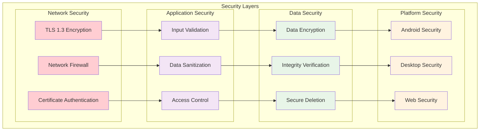

### Platform-Specific Security Measures

**Android Security:**
- Android Keystore for secure key management
- Runtime application self-protection (RASP)
- Certificate pinning for network communications
- Secure data storage using EncryptedSharedPreferences

**Desktop Security:**
- Operating system keyring integration
- Code signing and integrity verification
- Secure communication channels with mutual TLS
- Encrypted local data storage

**Web Security:**
- Content Security Policy (CSP) implementation
- Cross-Origin Resource Sharing (CORS) configuration
- JWT token-based authentication
- HTTPS-only communication with HSTS

### Data Protection Protocols

**Research Data Protection:**
- End-to-end encryption for all research data
- Anonymization of personally identifiable information
- Secure multi-party computation for collaborative research
- Compliance with research ethics and data protection regulations

**Privacy Preservation:**
- Differential privacy for aggregate data analysis
- Federated learning for model training without data sharing
- Secure deletion of sensitive temporary data
- Privacy-preserving analytics and reporting

## Testing Strategy

### Cross-Platform Testing Architecture

The testing strategy encompasses all three platforms with coordinated test execution and reporting:

```mermaid
graph TB
    subgraph "Testing Framework"
        subgraph "Platform Tests"
            ANDROID_TESTS[Android UI Tests]
            DESKTOP_TESTS[Desktop UI Tests]
            WEB_TESTS[Web Interface Tests]
        end
        
        subgraph "Integration Tests"
            CROSS_PLATFORM[Cross-Platform Tests]
            E2E_TESTS[End-to-End Tests]
            PERFORMANCE_TESTS[Performance Tests]
        end
        
        subgraph "Automated Testing"
            CI_PIPELINE[CI/CD Pipeline]
            TEST_AUTOMATION[Test Automation]
            REGRESSION_TESTS[Regression Tests]
        end
        
        subgraph "Quality Assurance"
            CODE_QUALITY[Code Quality Checks]
            ACCESSIBILITY_TESTS[Accessibility Tests]
            SECURITY_TESTS[Security Tests]
        end
    end
    
    ANDROID_TESTS --> CROSS_PLATFORM
    DESKTOP_TESTS --> CROSS_PLATFORM
    WEB_TESTS --> CROSS_PLATFORM
    
    CROSS_PLATFORM --> E2E_TESTS
    E2E_TESTS --> PERFORMANCE_TESTS
    
    PERFORMANCE_TESTS --> CI_PIPELINE
    CI_PIPELINE --> TEST_AUTOMATION
    TEST_AUTOMATION --> REGRESSION_TESTS
    
    REGRESSION_TESTS --> CODE_QUALITY
    CODE_QUALITY --> ACCESSIBILITY_TESTS
    ACCESSIBILITY_TESTS --> SECURITY_TESTS
    
    classDef platform fill:#e1f5fe
    classDef integration fill:#f3e5f5
    classDef automation fill:#e8f5e8
    classDef quality fill:#fff3e0
    
    class ANDROID_TESTS,DESKTOP_TESTS,WEB_TESTS platform
    class CROSS_PLATFORM,E2E_TESTS,PERFORMANCE_TESTS integration
    class CI_PIPELINE,TEST_AUTOMATION,REGRESSION_TESTS automation
    class CODE_QUALITY,ACCESSIBILITY_TESTS,SECURITY_TESTS quality
```

### Testing Methodologies

**Unit Testing:**
- **Android**: Espresso and JUnit for UI component testing
- **Desktop**: pytest with PyQt5 test utilities
- **Web**: Jest and Testing Library for component testing

**Integration Testing:**
- Cross-platform communication protocol testing
- State synchronization validation
- Error handling and recovery testing

**End-to-End Testing:**
- Complete workflow validation across all platforms
- User journey testing with realistic scenarios
- Performance testing under various load conditions

**Accessibility Testing:**
- Screen reader compatibility testing
- Keyboard navigation validation
- Color contrast and visual accessibility testing

### Test Automation and CI/CD

**Continuous Integration Pipeline:**
```yaml
# Example CI/CD pipeline configuration
test_pipeline:
  stages:
    - unit_tests
    - integration_tests
    - e2e_tests
    - accessibility_tests
    - performance_tests
    - security_tests
  
  android_tests:
    stage: unit_tests
    script:
      - ./gradlew AndroidApp:testDebugUnitTest
      - ./gradlew AndroidApp:connectedDebugAndroidTest
  
  desktop_tests:
    stage: unit_tests
    script:
      - python -m pytest PythonApp/tests/
  
  web_tests:
    stage: unit_tests
    script:
      - npm test
      - npm run test:e2e
  
  cross_platform_tests:
    stage: integration_tests
    script:
      - python test_cross_platform_integration.py
```

## Troubleshooting and Best Practices

### Common Issues and Solutions

#### Cross-Platform Communication Issues

**Problem**: Intermittent connection failures between platforms
**Symptoms**: 
- Device status indicators showing "Disconnected" despite physical connections
- Delayed state synchronization between platforms
- Recording sessions failing to start

**Solutions**:
1. **Network Configuration**:
   ```bash
   # Check network connectivity
   ping [desktop_ip_address]
   
   # Verify port accessibility
   telnet [desktop_ip_address] 8080
   
   # Check firewall settings
   sudo ufw status
   ```

2. **Platform-Specific Diagnostics**:
   ```kotlin
   // Android diagnostic logging
   Log.d("NetworkDebug", "Connection attempt to ${serverIP}:${serverPort}")
   
   // Check network state
   val connectivityManager = getSystemService(Context.CONNECTIVITY_SERVICE) as ConnectivityManager
   val networkInfo = connectivityManager.activeNetworkInfo
   Log.d("NetworkDebug", "Network active: ${networkInfo?.isConnected}")
   ```

3. **Desktop Controller Diagnostics**:
   ```python
   # Python diagnostic logging
   import logging
   logging.basicConfig(level=logging.DEBUG)
   
   # Check server socket status
   def check_server_status(self):
       try:
           self.server_socket.getsockname()
           self.logger.info("Server socket is active")
       except Exception as e:
           self.logger.error(f"Server socket error: {e}")
   ```

#### UI Responsiveness Issues

**Problem**: UI freezing or slow response times
**Symptoms**:
- Button clicks not registering
- Delayed status updates
- Slow navigation between screens

**Solutions**:
1. **Android Optimization**:
   ```kotlin
   // Move heavy operations to background thread
   lifecycleScope.launch(Dispatchers.IO) {
       val result = performHeavyOperation()
       withContext(Dispatchers.Main) {
           updateUI(result)
       }
   }
   ```

2. **Desktop Optimization**:
   ```python
   # Use QTimer for non-blocking UI updates
   self.update_timer = QTimer()
   self.update_timer.timeout.connect(self.update_ui)
   self.update_timer.start(100)  # Update every 100ms
   ```

3. **Web Optimization**:
   ```javascript
   // Use requestAnimationFrame for smooth updates
   function updateDashboard() {
       requestAnimationFrame(() => {
           updateStatusIndicators();
           updateMetrics();
           if (shouldContinueUpdating) {
               updateDashboard();
           }
       });
   }
   ```

#### State Synchronization Issues

**Problem**: Inconsistent state across platforms
**Symptoms**:
- Different recording status shown on different platforms
- Device connection states not matching
- Settings not persisting across platform switches

**Solutions**:
1. **State Validation**:
   ```python
   def validate_state_consistency(self):
       """Validate state consistency across platforms"""
       android_state = self.get_android_state()
       desktop_state = self.get_desktop_state()
       web_state = self.get_web_state()
       
       if not self.states_are_consistent(android_state, desktop_state, web_state):
           self.trigger_state_resynchronization()
   ```

2. **Conflict Resolution**:
   ```kotlin
   // Android state conflict resolution
   fun resolveStateConflict(localState: State, remoteState: State): State {
       return when {
           localState.timestamp > remoteState.timestamp -> localState
           remoteState.timestamp > localState.timestamp -> remoteState
           localState.isUserInitiated -> localState
           else -> remoteState
       }
   }
   ```

### Best Practices

#### Development Best Practices

**1. Consistent Code Style**:
- Use platform-specific linting tools (ktlint for Android, pylint for Python, ESLint for Web)
- Implement consistent naming conventions across platforms
- Use automated code formatting tools

**2. Error Handling**:
```kotlin
// Android error handling pattern
sealed class Result<out T> {
    data class Success<out T>(val data: T) : Result<T>()
    data class Error(val exception: Throwable) : Result<Nothing>()
}

suspend fun performOperation(): Result<Data> {
    return try {
        val data = apiCall()
        Result.Success(data)
    } catch (e: Exception) {
        Result.Error(e)
    }
}
```

**3. Resource Management**:
```python
# Python resource management pattern
class ResourceManager:
    def __enter__(self):
        self.acquire_resources()
        return self
    
    def __exit__(self, exc_type, exc_val, exc_tb):
        self.release_resources()
        if exc_type:
            self.handle_error(exc_type, exc_val, exc_tb)
```

#### Performance Best Practices

**1. Memory Management**:
- Use weak references to prevent memory leaks
- Implement proper lifecycle management
- Monitor memory usage and optimize accordingly

**2. Network Optimization**:
- Implement connection pooling
- Use compression for large data transfers
- Cache frequently accessed data

**3. UI Optimization**:
- Use virtualization for large lists
- Implement progressive loading
- Optimize image and media handling

#### Security Best Practices

**1. Input Validation**:
```kotlin
// Android input validation
fun validateUserInput(input: String): ValidationResult {
    return when {
        input.isBlank() -> ValidationResult.Error("Input cannot be empty")
        input.length > MAX_LENGTH -> ValidationResult.Error("Input too long")
        !input.matches(ALLOWED_PATTERN) -> ValidationResult.Error("Invalid characters")
        else -> ValidationResult.Success(input.trim())
    }
}
```

**2. Secure Communication**:
```python
# Python secure communication setup
def setup_secure_connection(self):
    context = ssl.create_default_context(ssl.Purpose.SERVER_AUTH)
    context.check_hostname = False
    context.verify_mode = ssl.CERT_REQUIRED
    context.load_verify_locations(ca_cert_path)
    return context
```

**3. Data Protection**:
```javascript
// Web data protection
class SecureStorage {
    static encrypt(data, key) {
        // Implement encryption logic
        return encryptedData;
    }
    
    static decrypt(encryptedData, key) {
        // Implement decryption logic
        return decryptedData;
    }
}
```

### Debugging Tools and Techniques

#### Platform-Specific Debugging

**Android Debugging**:
- Use Android Studio's Layout Inspector for UI debugging
- Enable developer options for performance monitoring
- Use Systrace for performance analysis

**Desktop Debugging**:
- Use PyQt5's built-in debugging tools
- Implement custom logging with different verbosity levels
- Use profiling tools for performance analysis

**Web Debugging**:
- Use browser developer tools for DOM inspection
- Implement client-side error reporting
- Use network monitoring tools for API debugging

#### Cross-Platform Debugging

**Unified Logging System**:
```python
# Centralized logging configuration
import logging
import json

class UnifiedLogger:
    def __init__(self):
        self.setup_logging()
    
    def setup_logging(self):
        formatter = logging.Formatter(
            '%(asctime)s - %(name)s - %(levelname)s - %(message)s'
        )
        
        # Console handler
        console_handler = logging.StreamHandler()
        console_handler.setFormatter(formatter)
        
        # File handler
        file_handler = logging.FileHandler('unified.log')
        file_handler.setFormatter(formatter)
        
        # Configure root logger
        logging.basicConfig(
            level=logging.INFO,
            handlers=[console_handler, file_handler]
        )
    
    def log_cross_platform_event(self, platform, event, data):
        message = {
            'platform': platform,
            'event': event,
            'data': data,
            'timestamp': time.time()
        }
        logging.info(json.dumps(message))
```

## Future Enhancements

### Planned Architecture Improvements

#### Enhanced Cross-Platform Integration

**1. Unified Component Library**:
- Development of a shared component specification
- Cross-platform component rendering engine
- Unified styling and theming system

**2. Advanced State Management**:
- Implement CRDT (Conflict-free Replicated Data Types) for automatic conflict resolution
- Real-time collaborative editing capabilities
- Offline-first architecture with automatic synchronization

**3. AI-Powered User Experience**:
- Intelligent UI adaptation based on user behavior
- Predictive text and auto-completion across platforms
- Automated workflow optimization

#### Technology Evolution

**1. Next-Generation Technologies**:
- **Android**: Migration to Jetpack Compose for modern UI development
- **Desktop**: Exploration of Flutter Desktop or Electron alternatives
- **Web**: Progressive Web App (PWA) capabilities for offline operation

**2. Performance Enhancements**:
- WebAssembly integration for computationally intensive web operations
- GPU acceleration for real-time data visualization
- Edge computing integration for reduced latency

**3. Extended Platform Support**:
- iOS application development for broader mobile support
- Smart TV interfaces for presentation environments
- Voice interface integration for hands-free operation

#### Research-Specific Enhancements

**1. Advanced Analytics Integration**:
- Real-time machine learning inference
- Automated pattern recognition in collected data
- Predictive modeling for experimental outcomes

**2. Collaborative Research Features**:
- Multi-researcher session management
- Real-time collaboration tools
- Distributed data collection across multiple sites

**3. Enhanced Data Visualization**:
- 3D visualization capabilities
- Augmented reality data overlay
- Interactive data exploration tools

### Migration Strategies

#### Gradual Migration Approach

**Phase 1: Infrastructure Preparation**
- Establish component specifications and interfaces
- Implement backward compatibility layers
- Create migration testing framework

**Phase 2: Platform Modernization**
- Migrate Android UI to Jetpack Compose
- Enhance Desktop UI with modern frameworks
- Upgrade Web interface to PWA standards

**Phase 3: Integration Enhancement**
- Implement unified state management
- Deploy advanced synchronization mechanisms
- Integrate AI-powered features

**Phase 4: Advanced Features**
- Deploy collaborative research tools
- Implement advanced analytics
- Launch extended platform support

#### Risk Mitigation

**Compatibility Preservation**:
- Maintain API compatibility during transitions
- Implement feature flags for gradual rollout
- Establish rollback procedures for failed migrations

**Performance Monitoring**:
- Continuous performance monitoring during migration
- A/B testing for new features
- User feedback integration for UX improvements

**Training and Documentation**:
- Comprehensive migration documentation
- User training programs for new features
- Developer onboarding for new technologies

### Long-Term Vision

#### Ecosystem Integration

**1. Research Ecosystem Connectivity**:
- Integration with institutional research systems
- Compatibility with standard research data formats
- Support for research collaboration protocols

**2. Industry Standard Compliance**:
- Medical device regulation compliance (FDA, CE marking)
- Research ethics committee integration
- Data protection regulation compliance (GDPR, HIPAA)

**3. Open Source Community**:
- Open source component libraries
- Community-driven plugin architecture
- Academic research collaboration platform

#### Scalability and Performance

**1. Cloud-Native Architecture**:
- Kubernetes-based deployment
- Microservices architecture
- Auto-scaling capabilities

**2. Global Distribution**:
- Content delivery network integration
- Multi-region deployment capabilities
- Latency optimization for global research teams

**3. Performance Excellence**:
- Sub-millisecond response times
- High availability (99.9% uptime)
- Automatic failover and recovery

### Conclusion

The Unified PC/Web/Android UI Architecture represents a sophisticated synthesis of established design principles and contemporary technological capabilities, addressing the complex requirements of modern multi-sensor research environments. This architectural framework demonstrates how theoretical foundations from human-computer interaction research can be successfully applied to create practical, robust systems that serve real-world research needs.

The architecture's success lies in its balanced approach to platform-specific optimization and cross-platform consistency. Rather than pursuing lowest-common-denominator solutions that sacrifice platform strengths, the design embraces the unique capabilities of each platform while maintaining coherent user experiences through carefully designed interaction patterns and communication protocols. This approach reflects the maturation of multi-platform development practices and the growing sophistication of research computing requirements.

The emphasis on accessibility, security, and performance throughout the architectural design ensures that the system meets the rigorous demands of research environments while remaining approachable to users with diverse technical backgrounds. The comprehensive attention to these quality attributes reflects not only best practices in software development but also the ethical imperatives of creating research tools that serve broad communities of users.

The planned enhancement roadmap and migration strategies position the system for continued evolution within the rapidly changing landscape of research technology. By establishing clear architectural principles and maintaining flexibility for future innovations, the system design anticipates ongoing developments in areas such as artificial intelligence integration, edge computing capabilities, and emerging interaction modalities.

This unified architecture documentation serves as both a technical specification and a philosophical statement about the role of thoughtful design in research tool development. By providing comprehensive guidance for developers, researchers, and system administrators, the documentation ensures that the system's architectural vision can be successfully implemented, maintained, and extended as research needs continue to evolve.

## References

Android Developers. (2021). *Android Permissions Best Practices*. Google. Retrieved from https://developer.android.com/training/permissions/requesting

Apple Inc. (2021). *Human Interface Guidelines*. Apple Developer Documentation. Retrieved from https://developer.apple.com/design/human-interface-guidelines/

Brewer, E. A. (2000). Towards robust distributed systems. In *Proceedings of the nineteenth annual ACM symposium on Principles of distributed computing* (p. 7).

Buschmann, F., Meunier, R., Rohnert, H., Sommerlad, P., & Stal, M. (1996). *Pattern-Oriented Software Architecture: A System of Patterns*. John Wiley & Sons.

Constantine, L. L., & Yourdon, E. (1979). *Structured Design: Fundamentals of a Discipline of Computer Program and Systems Design*. Prentice-Hall.

Coulouris, G. F., Dollimore, J., Kindberg, T., & Blair, G. (2011). *Distributed Systems: Concepts and Design*. Addison-Wesley.

Dean, J., & Ghemawat, S. (2008). MapReduce: simplified data processing on large clusters. *Communications of the ACM*, 51(1), 107-113.

Dourish, P. (2001). *Where the Action Is: The Foundations of Embodied Interaction*. MIT Press.

Facebook. (2014). *Flux Application Architecture*. Facebook Open Source. Retrieved from https://facebook.github.io/flux/

Fowler, M. (2002). *Patterns of Enterprise Application Architecture*. Addison-Wesley Professional.

Fowler, M. (2003). *Patterns of Enterprise Application Architecture*. Addison-Wesley Professional.

Fowler, M., & Lewis, J. (2014). *Microservices*. Retrieved from https://martinfowler.com/articles/microservices.html

Freeman, E., Robson, E., Bates, B., & Sierra, K. (2004). *Head First Design Patterns*. O'Reilly Media.

Gamma, E., Helm, R., Johnson, R., & Vlissides, J. (1994). *Design Patterns: Elements of Reusable Object-Oriented Software*. Addison-Wesley.

Google Android Team. (2019). *Single Activity: Why, When, and How*. Android Developers Blog. Retrieved from https://android-developers.googleblog.com/2018/05/use-android-jetpack-to-accelerate-your.html

Google Android Team. (2020). *StateFlow and SharedFlow*. Android Developers Documentation. Retrieved from https://developer.android.com/kotlin/flow/stateflow-and-sharedflow

Google Android Team. (2021). *Android Architecture Components*. Android Developers. Retrieved from https://developer.android.com/topic/libraries/architecture

Google Material Design Team. (2021). *Material Design Guidelines*. Google. Retrieved from https://material.io/design

Harchol-Balter, M. (2013). *Performance Modeling and Design of Computer Systems: Queueing Theory in Action*. Cambridge University Press.

Johnson, J. (2010). *Designing with the Mind in Mind: Simple Guide to Understanding User Interface Design Rules*. Morgan Kaufmann.

Johnson, R., & Vlissides, J. (1995). *Design Patterns CD: Elements of Reusable Object-Oriented Software*. Addison-Wesley.

Lamport, L. (1978). Time, clocks, and the ordering of events in a distributed system. *Communications of the ACM*, 21(7), 558-565.

Lane, N. D., Miluzzo, E., Lu, H., Peebles, D., Choudhury, T., & Campbell, A. T. (2010). A survey of mobile phone sensing. *IEEE Communications Magazine*, 48(9), 140-150.

Laprie, J. C. (1992). Dependability: basic concepts and terminology. In *Dependability: Basic Concepts and Terminology* (pp. 3-245). Springer.

Lynch, N. A. (1996). *Distributed Algorithms*. Morgan Kaufmann.

Marcotte, E. (2010). *Responsive Web Design*. A List Apart. Retrieved from https://alistapart.com/article/responsive-web-design/

Newman, S. (2015). *Building Microservices: Designing Fine-Grained Systems*. O'Reilly Media.

Nielsen, J. (1993). *Usability Engineering*. Academic Press.

Norman, D. A. (1988). *The Design of Everyday Things*. Basic Books.

Oliphant, T. E. (2007). Python for scientific computing. *Computing in Science & Engineering*, 9(3), 10-20.

Osmani, A. (2017). *Progressive Web Apps*. O'Reilly Media.

Perchat, J., Desertot, M., & Lecomte, S. (2014). Multi-platform user interface generation for enterprise applications. In *Proceedings of the 29th Annual ACM Symposium on Applied Computing* (pp. 736-743).

Potel, M. (1996). MVP: Model-View-Presenter The Taligent Programming Model for C++ and Java. *Taligent Inc*.

Redux.js.org. (2015). *Redux - A Predictable State Container for JS Apps*. Retrieved from https://redux.js.org/

Rosenfeld, L., Morville, P., & Arango, J. (2015). *Information Architecture: For the Web and Beyond*. O'Reilly Media.

Seffah, A., & Javahery, H. (Eds.). (2004). *Multiple User Interfaces: Cross-Platform Applications and Context-Aware Interfaces*. John Wiley & Sons.

Shapiro, M., Preguiça, N., Baquero, C., & Zawirski, M. (2011). Conflict-free replicated data types. In *Stabilization, Safety, and Security of Distributed Systems* (pp. 386-400). Springer.

Simpson, K. (2014). *You Don't Know JS: Async & Performance*. O'Reilly Media.

Star, S. L., & Ruhleder, K. (1996). Steps toward an ecology of infrastructure: Design and access for large information spaces. *Information Systems Research*, 7(1), 111-134.

Story, M. F., Mueller, J. L., & Mace, R. L. (1998). *The Universal Design File: Designing for People of All Ages and Abilities*. NC State University, The Center for Universal Design.

Summerfield, M. (2007). *Rapid GUI Programming with Python and Qt*. Prentice Hall.

Tanenbaum, A. S., & Wetherall, D. J. (2010). *Computer Networks*. Prentice Hall.

Vlissides, J., Coplien, J. O., & Kerth, N. L. (Eds.). (1995). *Pattern Languages of Program Design*. Addison-Wesley.

Web Content Accessibility Guidelines (WCAG) 2.1. (2018). W3C Recommendation. Retrieved from https://www.w3.org/WAI/WCAG21/quickref/

Weiser, M. (1991). The computer for the 21st century. *Scientific American*, 265(3), 94-104.

Wroblewski, L. (2011). *Mobile First*. A Book Apart.