# Unified PC/Web/Android UI Architecture

## Table of Contents

- [Overview](#overview)
- [Platform-Specific Architectures](#platform-specific-architectures)
  - [Android Mobile Application UI](#android-mobile-application-ui)
  - [Python Desktop Controller UI](#python-desktop-controller-ui)
  - [Web Interface UI](#web-interface-ui)
- [Cross-Platform Integration](#cross-platform-integration)
- [Unified Design Principles](#unified-design-principles)
- [State Management Across Platforms](#state-management-across-platforms)
- [Communication Protocols](#communication-protocols)
- [Architecture Diagrams](#architecture-diagrams)
- [Implementation Patterns](#implementation-patterns)
- [Performance Considerations](#performance-considerations)
- [Security and Data Protection](#security-and-data-protection)
- [Testing Strategy](#testing-strategy)
- [Troubleshooting and Best Practices](#troubleshooting-and-best-practices)
- [Future Enhancements](#future-enhancements)

## Overview

The Multi-Sensor Recording System implements a comprehensive three-platform UI architecture that enables seamless coordination between Android mobile devices, Python desktop controllers, and web-based interfaces. This unified architecture provides researchers with flexible access points while maintaining synchronized data collection capabilities across all platforms.

### System Architecture Philosophy

The UI architecture follows a **distributed coordinator pattern** where each platform serves a specific role in the research workflow:

- **Android Mobile**: Primary data collection interface with mobile sensor integration
- **Python Desktop**: Master controller and coordination hub with advanced analysis capabilities  
- **Web Interface**: Remote monitoring and lightweight control interface for distributed setups

### Core Design Principles

1. **Unified User Experience**: Consistent interaction patterns across all platforms
2. **Responsive Design**: Adaptive layouts that work across different screen sizes and input methods
3. **Real-time Synchronization**: Live status updates and coordinated state management
4. **Accessibility First**: WCAG 2.1 AA compliance across all interfaces
5. **Modular Architecture**: Component-based design enabling independent platform development
6. **Fault Tolerance**: Graceful degradation when platforms are offline or disconnected

## Platform-Specific Architectures

### Android Mobile Application UI

The Android application employs a modern single-activity architecture with fragment-based navigation, implementing industry best practices for mobile UI development.

#### Core Architecture Components

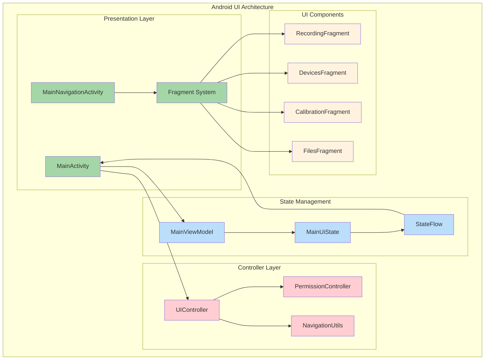

#### Interface Modes

**1. Direct Mode (MainActivity)**
- **Purpose**: Immediate recording access for quick sessions
- **Features**: Single-screen recording controls, real-time camera preview, device status indicators
- **Use Case**: Field research, single-operator scenarios

**2. Navigation Mode (MainNavigationActivity)**  
- **Purpose**: Comprehensive workflow management
- **Features**: Tab-based navigation, device management, calibration procedures, file organization
- **Use Case**: Laboratory research, multi-session projects

#### Fragment Architecture

| Fragment | Purpose | Key Features |
|----------|---------|--------------|
| RecordingFragment | Recording controls and monitoring | Real-time preview, session status, recording controls |
| DevicesFragment | Device connection management | Bluetooth pairing, USB detection, network configuration |
| CalibrationFragment | Camera calibration workflows | Pattern detection, quality assessment, result storage |
| FilesFragment | Data management and export | Session browsing, file operations, storage monitoring |

#### State Management Pattern

The Android UI implements reactive state management using Kotlin StateFlow:

```kotlin
data class MainUiState(
    val statusText: String = "Ready",
    val isRecording: Boolean = false,
    val canStartRecording: Boolean = true,
    val canStopRecording: Boolean = false,
    val isPcConnected: Boolean = false,
    val isShimmerConnected: Boolean = false,
    val isThermalConnected: Boolean = false,
    val batteryLevel: Int = -1,
    val currentSessionInfo: SessionDisplayInfo? = null
)
```

#### Enhanced Controller System

**UIController Features:**
- Consolidated UI component management
- Dynamic theme management (Light/Dark/Auto)
- Advanced accessibility support with WCAG 2.1 AA compliance
- State persistence across configuration changes
- Component validation and error recovery

**PermissionController Features:**
- Formal state machine for permission handling
- Exponential backoff retry logic
- User-friendly permission guidance
- State persistence with temporal validity

### Python Desktop Controller UI

The Python desktop application serves as the master controller, implementing a sophisticated PyQt5-based interface with real-time monitoring and advanced device coordination capabilities.

#### Architecture Overview

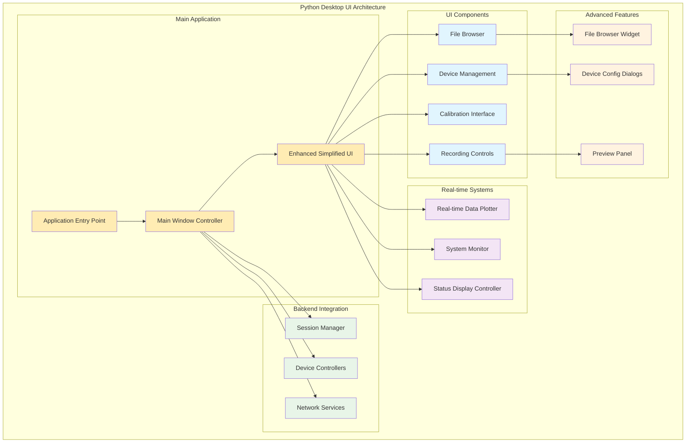

#### Core UI Components

**1. Enhanced Main Window (EnhancedSimplifiedMainWindow)**
- **Framework**: PyQt5 with modern styling and responsive design
- **Layout**: Tabbed interface with dockable panels
- **Features**: Real-time monitoring, professional UI components, comprehensive menu system

**2. Real-time Data Visualization**
- **Implementation**: RealTimeDataPlotter with matplotlib/pyqtgraph backends
- **Capabilities**: Live sensor plotting, multi-stream visualization, performance optimization
- **Data Sources**: GSR sensors, thermal cameras, system metrics

**3. Advanced Device Management**
- **Features**: Real device detection, device-specific configuration dialogs, connection quality monitoring
- **Supported Devices**: Android devices, Shimmer sensors, USB webcams, thermal cameras
- **Configuration**: Per-device settings with validation and real-time application

**4. System Monitoring Integration**
- **Implementation**: SystemMonitor with cross-platform compatibility
- **Metrics**: CPU, memory, disk I/O, network usage, hardware temperatures
- **Performance**: Resource usage tracking, alert thresholds, optimization recommendations

#### Tab Organization

| Tab | Purpose | Key Components |
|-----|---------|----------------|
| Recording | Session control and monitoring | Recording controls, live preview, session progress, storage monitoring |
| Devices | Connection management | Device discovery, configuration dialogs, status indicators, health monitoring |
| Calibration | Camera calibration workflows | Calibration procedures, quality assessment, parameter adjustment, results viewer |
| Files | Data management | File browser, preview capabilities, export tools, storage analytics |

#### Professional UI Features

- **Modern Styling**: Professional interface with semantic color coding and consistent typography
- **Responsive Layout**: Adaptive design that works across different screen resolutions
- **Accessibility Support**: Keyboard navigation, screen reader compatibility, high contrast mode
- **Menu System**: Comprehensive menu with dynamic items and context menus
- **Status Indicators**: Real-time status communication with meaningful visual feedback

### Web Interface UI

The web interface provides lightweight remote monitoring and control capabilities, enabling distributed research setups and remote collaboration.

#### Web Architecture Components

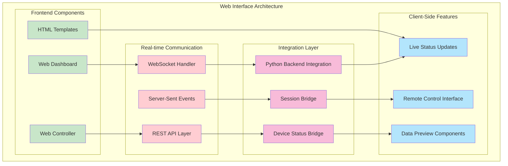

#### Web Interface Features

**1. Real-time Dashboard**
- **Technology**: HTML5, CSS3, JavaScript with WebSocket communication
- **Features**: Live device status, session monitoring, system health indicators
- **Responsive Design**: Mobile-friendly interface for tablet and smartphone access

**2. Remote Control Capabilities**
- **Session Control**: Start/stop recording sessions remotely
- **Device Management**: Monitor connection status and device health
- **Configuration**: Remote parameter adjustment and system configuration

**3. Data Preview and Monitoring**
- **Live Streams**: Real-time preview of camera feeds and sensor data
- **Session Progress**: Recording progress, data volume, timing information
- **Alerts**: System alerts, error notifications, status changes

**4. Integration Architecture**
- **Backend Bridge**: Python integration layer for seamless communication
- **API Endpoints**: RESTful API for control operations and data retrieval
- **Event Streaming**: Server-sent events for real-time updates

## Cross-Platform Integration

### Unified Communication Protocol

The three platforms communicate through a standardized protocol that ensures consistent behavior and synchronized state management.

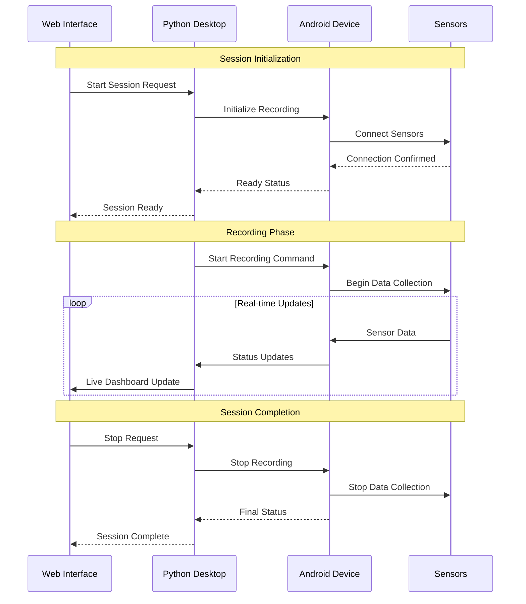

### State Synchronization

All platforms maintain synchronized state through a centralized state management system:

**State Broadcasting Pattern:**
- Python Desktop acts as the state coordinator
- Android devices report local state changes
- Web interface receives state updates via WebSocket
- Conflict resolution through timestamp-based priority

**Synchronized State Elements:**
- Recording session status
- Device connection states
- System health metrics
- User interface preferences
- Error and alert states

### Cross-Platform Data Flow

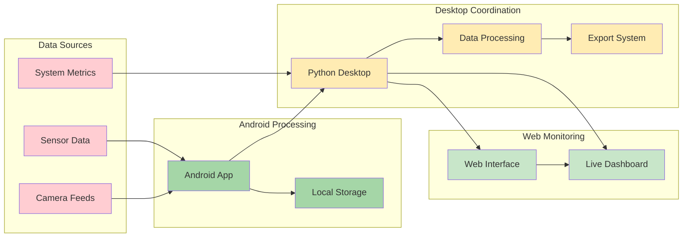

## Unified Design Principles

### Consistency Across Platforms

**Visual Consistency:**
- Unified color palette and typography across all platforms
- Consistent iconography and symbolic representations
- Standardized status indicators and feedback mechanisms
- Responsive design principles adapted to each platform's capabilities

**Interaction Consistency:**
- Standardized button behaviors and confirmation patterns
- Consistent navigation paradigms adapted to platform conventions
- Unified error handling and user feedback systems
- Cross-platform keyboard shortcuts and accessibility features

**Information Architecture:**
- Consistent organization of features and functionality
- Standardized terminology and labeling
- Unified data presentation and visualization patterns
- Cross-platform help and documentation integration

### Accessibility Standards

**WCAG 2.1 AA Compliance:**
- Color contrast ratios meeting accessibility standards
- Keyboard navigation support across all platforms
- Screen reader compatibility and semantic markup
- Touch target sizing for mobile accessibility

**Platform-Specific Accessibility:**
- **Android**: TalkBack integration, accessibility services support
- **Desktop**: Screen reader support, high DPI scaling, keyboard navigation
- **Web**: ARIA labels, semantic HTML, keyboard accessibility

### User Experience Principles

**Progressive Disclosure:**
- Essential functions immediately accessible
- Advanced features available through clear navigation paths
- Context-sensitive help and guidance
- Adaptive interface complexity based on user expertise

**Responsive Feedback:**
- Immediate visual feedback for user actions
- Real-time status updates and progress indicators
- Clear error messages with actionable guidance
- Success confirmations and completion indicators

## State Management Across Platforms

### Centralized State Architecture

The system implements a hub-and-spoke state management pattern with the Python desktop controller serving as the central coordinator:

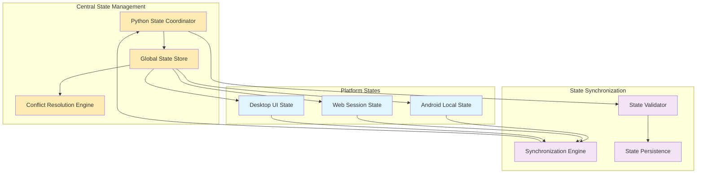

### State Synchronization Protocol

**1. State Update Flow:**
```
Local Change → Validation → Central Coordinator → Broadcast → Platform Updates
```

**2. Conflict Resolution:**
- Timestamp-based priority for concurrent updates
- User-initiated changes take precedence over system updates
- Critical system states (recording, safety) have highest priority
- Rollback mechanism for invalid state transitions

**3. State Persistence:**
- Local state backup on each platform
- Central state archive with version history
- Recovery mechanisms for state corruption
- Cross-platform state migration capabilities

### Platform-Specific State Components

**Android State Management:**
```kotlin
data class AndroidUIState(
    val recordingState: RecordingState,
    val deviceConnections: Map<DeviceType, ConnectionStatus>,
    val sessionInfo: SessionInfo?,
    val userPreferences: UserPreferences,
    val errorState: ErrorState?
)
```

**Python Desktop State:**
```python
@dataclass
class DesktopUIState:
    active_tab: str
    recording_session: Optional[SessionInfo]
    device_statuses: Dict[str, DeviceStatus]
    system_metrics: SystemMetrics
    ui_preferences: UIPreferences
    real_time_data: RealTimeDataState
```

**Web Interface State:**
```javascript
const webUIState = {
    connectionStatus: 'connected',
    currentSession: null,
    deviceList: [],
    dashboardMetrics: {},
    userSettings: {},
    alertStatus: null
};
```

## Communication Protocols

### Network Communication Architecture

The system employs multiple communication protocols optimized for different types of data and interaction patterns:

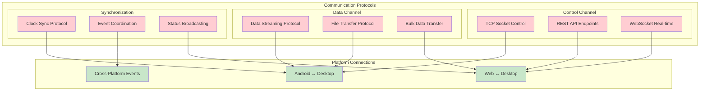

### Protocol Specifications

**1. Control Protocol (TCP Socket)**
- **Purpose**: Command and control operations between Android and Desktop
- **Format**: JSON message protocol with acknowledgment
- **Features**: Encryption, compression, error recovery
- **Latency**: < 50ms for control commands

**2. Data Streaming Protocol (UDP/WebSocket)**
- **Purpose**: Real-time sensor data and preview streams
- **Format**: Binary protocol with metadata headers
- **Features**: Adaptive quality, compression, packet loss recovery
- **Throughput**: Up to 10 Mbps per stream

**3. Web API Protocol (REST/WebSocket)**
- **Purpose**: Web interface integration and remote monitoring
- **Format**: JSON REST API with WebSocket events
- **Features**: Authentication, rate limiting, CORS support
- **Scalability**: Support for multiple concurrent web clients

### Security and Authentication

**Network Security:**
- TLS 1.3 encryption for all network communication
- Certificate-based authentication between platforms
- API token authentication for web interface access
- Network traffic monitoring and anomaly detection

**Data Protection:**
- End-to-end encryption for sensitive research data
- Secure key exchange protocols
- Data integrity verification using cryptographic hashes
- Secure deletion of temporary data

## Architecture Diagrams

### Complete System Architecture

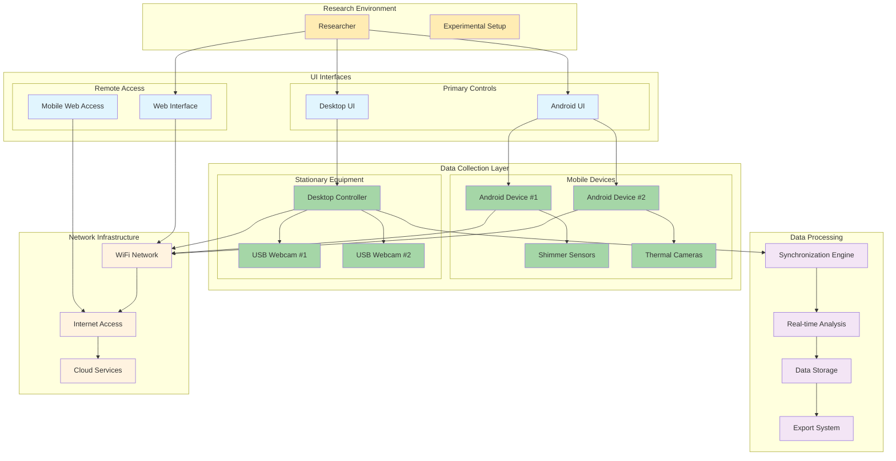

### Platform Interaction Flow

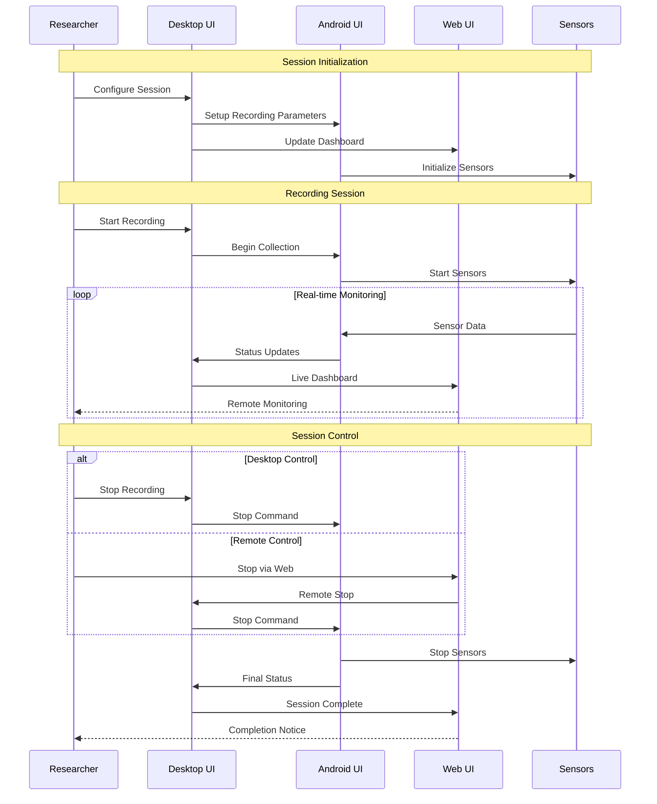

## Implementation Patterns

### Component-Based Architecture

All three platforms implement component-based architectures that promote reusability and maintainability:

**Android Components:**
```kotlin
// Status Indicator Component
class StatusIndicatorView(context: Context) : LinearLayout(context) {
    private var status: ConnectionStatus = ConnectionStatus.UNKNOWN
    
    fun updateStatus(newStatus: ConnectionStatus) {
        status = newStatus
        updateVisualState()
    }
    
    private fun updateVisualState() {
        val (color, icon, text) = when (status) {
            ConnectionStatus.CONNECTED -> Triple(Color.GREEN, R.drawable.ic_connected, "Connected")
            ConnectionStatus.DISCONNECTED -> Triple(Color.RED, R.drawable.ic_disconnected, "Disconnected")
            ConnectionStatus.CONNECTING -> Triple(Color.YELLOW, R.drawable.ic_connecting, "Connecting...")
        }
        // Update UI elements
    }
}
```

**Python Desktop Components:**
```python
class ModernButton(QPushButton):
    """Enhanced button with modern styling and accessibility features"""
    
    def __init__(self, text: str, button_type: str = "primary"):
        super().__init__(text)
        self.button_type = button_type
        self.setup_styling()
        self.setup_accessibility()
    
    def setup_styling(self):
        """Apply modern styling based on button type"""
        styles = {
            "primary": "background-color: #2196F3; color: white;",
            "secondary": "background-color: #757575; color: white;",
            "success": "background-color: #4CAF50; color: white;",
            "danger": "background-color: #F44336; color: white;"
        }
        self.setStyleSheet(styles.get(self.button_type, styles["primary"]))
```

**Web Interface Components:**
```javascript
class StatusIndicator {
    constructor(elementId, deviceType) {
        this.element = document.getElementById(elementId);
        this.deviceType = deviceType;
        this.status = 'unknown';
    }
    
    updateStatus(newStatus, metadata = {}) {
        this.status = newStatus;
        this.element.className = `status-indicator ${newStatus}`;
        this.element.textContent = this.getStatusText(newStatus);
        
        // Update accessibility attributes
        this.element.setAttribute('aria-label', 
            `${this.deviceType} status: ${this.getStatusText(newStatus)}`);
    }
    
    getStatusText(status) {
        const statusTexts = {
            'connected': 'Connected',
            'disconnected': 'Disconnected',
            'connecting': 'Connecting...',
            'error': 'Error'
        };
        return statusTexts[status] || 'Unknown';
    }
}
```

### Design Pattern Applications

**1. Observer Pattern for State Management**
- Centralized state store with observer notifications
- Platform-specific UI components subscribe to relevant state changes
- Automatic UI updates when state changes occur

**2. Command Pattern for User Actions**
- Encapsulated user actions as command objects
- Undo/redo functionality for reversible operations
- Command queuing for offline operation support

**3. Strategy Pattern for Platform Adaptation**
- Different UI strategies for different screen sizes and capabilities
- Platform-specific implementations of common interfaces
- Runtime strategy selection based on device capabilities

**4. Factory Pattern for Component Creation**
- Standardized component creation across platforms
- Platform-specific implementations of common UI elements
- Configuration-driven component instantiation

### Error Handling Patterns

**Consistent Error Handling Across Platforms:**

```kotlin
// Android Error Handling
sealed class UIError {
    data class NetworkError(val message: String, val code: Int) : UIError()
    data class DeviceError(val deviceType: String, val error: String) : UIError()
    data class ValidationError(val field: String, val message: String) : UIError()
    
    fun getDisplayMessage(): String = when (this) {
        is NetworkError -> "Network error: $message"
        is DeviceError -> "Device error ($deviceType): $error"
        is ValidationError -> "Validation error: $message"
    }
}
```

```python
# Python Error Handling
class UIErrorHandler:
    """Centralized error handling for desktop UI"""
    
    @staticmethod
    def handle_error(error: Exception, context: str = "") -> None:
        error_message = f"Error in {context}: {str(error)}"
        
        if isinstance(error, NetworkError):
            UIErrorHandler.show_network_error(error_message)
        elif isinstance(error, DeviceError):
            UIErrorHandler.show_device_error(error_message)
        else:
            UIErrorHandler.show_general_error(error_message)
        
        # Log error for debugging
        logger.error(error_message, exc_info=True)
```

```javascript
// Web Error Handling
class ErrorHandler {
    static handleError(error, context = '') {
        const errorInfo = {
            message: error.message,
            context: context,
            timestamp: new Date().toISOString(),
            url: window.location.href
        };
        
        // Display user-friendly error
        this.showErrorNotification(errorInfo);
        
        // Log error for debugging
        console.error('UI Error:', errorInfo);
        
        // Send error to monitoring service
        this.reportError(errorInfo);
    }
    
    static showErrorNotification(errorInfo) {
        const notification = document.createElement('div');
        notification.className = 'error-notification';
        notification.textContent = `Error: ${errorInfo.message}`;
        document.body.appendChild(notification);
        
        setTimeout(() => {
            notification.remove();
        }, 5000);
    }
}
```

## Performance Considerations

### Cross-Platform Performance Optimization

**Memory Management:**
- **Android**: Lifecycle-aware components with proper cleanup
- **Desktop**: Efficient PyQt object management and garbage collection
- **Web**: DOM optimization and memory leak prevention

**Rendering Performance:**
- **Android**: Hardware acceleration for smooth animations
- **Desktop**: Optimized paint events and update regions
- **Web**: CSS transforms and RequestAnimationFrame usage

**Network Performance:**
- Adaptive quality streaming based on network conditions
- Compression and caching strategies
- Connection pooling and keep-alive optimization

### Platform-Specific Optimizations

**Android Optimizations:**
```kotlin
class PerformanceOptimizedFragment : Fragment() {
    private var isVisible = false
    
    override fun setUserVisibleHint(isVisibleToUser: Boolean) {
        super.setUserVisibleHint(isVisibleToUser)
        isVisible = isVisibleToUser
        
        if (isVisible) {
            startRealTimeUpdates()
        } else {
            stopRealTimeUpdates()
        }
    }
    
    private fun startRealTimeUpdates() {
        // Only update UI when fragment is visible
        lifecycleScope.launch {
            while (isVisible) {
                updateUI()
                delay(UPDATE_INTERVAL)
            }
        }
    }
}
```

**Desktop Optimizations:**
```python
class OptimizedDataPlotter:
    """Performance-optimized real-time data plotting"""
    
    def __init__(self):
        self.plot_buffer = collections.deque(maxlen=1000)
        self.update_timer = QTimer()
        self.update_timer.timeout.connect(self.update_plot)
        self.update_timer.start(100)  # 10 FPS update rate
    
    def add_data_point(self, data):
        """Add data point to buffer without immediate plot update"""
        self.plot_buffer.append(data)
    
    def update_plot(self):
        """Batch update plot from buffer"""
        if self.plot_buffer:
            # Update plot with all buffered data at once
            self.plot_widget.update_data(list(self.plot_buffer))
            self.plot_buffer.clear()
```

**Web Optimizations:**
```javascript
class OptimizedDashboard {
    constructor() {
        this.updateQueue = [];
        this.isUpdating = false;
        this.frameRate = 60; // Target FPS
        this.lastUpdate = 0;
    }
    
    addUpdate(updateFunction) {
        this.updateQueue.push(updateFunction);
        if (!this.isUpdating) {
            this.scheduleUpdate();
        }
    }
    
    scheduleUpdate() {
        this.isUpdating = true;
        requestAnimationFrame((timestamp) => {
            if (timestamp - this.lastUpdate >= 1000 / this.frameRate) {
                this.processUpdates();
                this.lastUpdate = timestamp;
            }
            
            if (this.updateQueue.length > 0) {
                this.scheduleUpdate();
            } else {
                this.isUpdating = false;
            }
        });
    }
    
    processUpdates() {
        const updates = this.updateQueue.splice(0, 10); // Process 10 updates per frame
        updates.forEach(update => update());
    }
}
```

### Real-time Performance Monitoring

**Performance Metrics Collection:**
- UI responsiveness (frame rate, input lag)
- Memory usage and garbage collection impact
- Network latency and throughput
- CPU usage and thermal management

**Performance Optimization Strategies:**
- Lazy loading of non-critical UI components
- Virtual scrolling for large data sets
- Background processing for computationally intensive operations
- Adaptive quality based on device capabilities

## Security and Data Protection

### Multi-Platform Security Architecture

The security architecture implements defense-in-depth principles across all platforms:

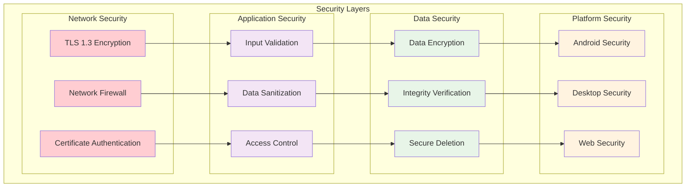

### Platform-Specific Security Measures

**Android Security:**
- Android Keystore for secure key management
- Runtime application self-protection (RASP)
- Certificate pinning for network communications
- Secure data storage using EncryptedSharedPreferences

**Desktop Security:**
- Operating system keyring integration
- Code signing and integrity verification
- Secure communication channels with mutual TLS
- Encrypted local data storage

**Web Security:**
- Content Security Policy (CSP) implementation
- Cross-Origin Resource Sharing (CORS) configuration
- JWT token-based authentication
- HTTPS-only communication with HSTS

### Data Protection Protocols

**Research Data Protection:**
- End-to-end encryption for all research data
- Anonymization of personally identifiable information
- Secure multi-party computation for collaborative research
- Compliance with research ethics and data protection regulations

**Privacy Preservation:**
- Differential privacy for aggregate data analysis
- Federated learning for model training without data sharing
- Secure deletion of sensitive temporary data
- Privacy-preserving analytics and reporting

## Testing Strategy

### Cross-Platform Testing Architecture

The testing strategy encompasses all three platforms with coordinated test execution and reporting:

```mermaid
graph TB
    subgraph "Testing Framework"
        subgraph "Platform Tests"
            ANDROID_TESTS[Android UI Tests]
            DESKTOP_TESTS[Desktop UI Tests]
            WEB_TESTS[Web Interface Tests]
        end
        
        subgraph "Integration Tests"
            CROSS_PLATFORM[Cross-Platform Tests]
            E2E_TESTS[End-to-End Tests]
            PERFORMANCE_TESTS[Performance Tests]
        end
        
        subgraph "Automated Testing"
            CI_PIPELINE[CI/CD Pipeline]
            TEST_AUTOMATION[Test Automation]
            REGRESSION_TESTS[Regression Tests]
        end
        
        subgraph "Quality Assurance"
            CODE_QUALITY[Code Quality Checks]
            ACCESSIBILITY_TESTS[Accessibility Tests]
            SECURITY_TESTS[Security Tests]
        end
    end
    
    ANDROID_TESTS --> CROSS_PLATFORM
    DESKTOP_TESTS --> CROSS_PLATFORM
    WEB_TESTS --> CROSS_PLATFORM
    
    CROSS_PLATFORM --> E2E_TESTS
    E2E_TESTS --> PERFORMANCE_TESTS
    
    PERFORMANCE_TESTS --> CI_PIPELINE
    CI_PIPELINE --> TEST_AUTOMATION
    TEST_AUTOMATION --> REGRESSION_TESTS
    
    REGRESSION_TESTS --> CODE_QUALITY
    CODE_QUALITY --> ACCESSIBILITY_TESTS
    ACCESSIBILITY_TESTS --> SECURITY_TESTS
    
    classDef platform fill:#e1f5fe
    classDef integration fill:#f3e5f5
    classDef automation fill:#e8f5e8
    classDef quality fill:#fff3e0
    
    class ANDROID_TESTS,DESKTOP_TESTS,WEB_TESTS platform
    class CROSS_PLATFORM,E2E_TESTS,PERFORMANCE_TESTS integration
    class CI_PIPELINE,TEST_AUTOMATION,REGRESSION_TESTS automation
    class CODE_QUALITY,ACCESSIBILITY_TESTS,SECURITY_TESTS quality
```

### Testing Methodologies

**Unit Testing:**
- **Android**: Espresso and JUnit for UI component testing
- **Desktop**: pytest with PyQt5 test utilities
- **Web**: Jest and Testing Library for component testing

**Integration Testing:**
- Cross-platform communication protocol testing
- State synchronization validation
- Error handling and recovery testing

**End-to-End Testing:**
- Complete workflow validation across all platforms
- User journey testing with realistic scenarios
- Performance testing under various load conditions

**Accessibility Testing:**
- Screen reader compatibility testing
- Keyboard navigation validation
- Color contrast and visual accessibility testing

### Test Automation and CI/CD

**Continuous Integration Pipeline:**
```yaml
# Example CI/CD pipeline configuration
test_pipeline:
  stages:
    - unit_tests
    - integration_tests
    - e2e_tests
    - accessibility_tests
    - performance_tests
    - security_tests
  
  android_tests:
    stage: unit_tests
    script:
      - ./gradlew AndroidApp:testDebugUnitTest
      - ./gradlew AndroidApp:connectedDebugAndroidTest
  
  desktop_tests:
    stage: unit_tests
    script:
      - python -m pytest PythonApp/tests/
  
  web_tests:
    stage: unit_tests
    script:
      - npm test
      - npm run test:e2e
  
  cross_platform_tests:
    stage: integration_tests
    script:
      - python test_cross_platform_integration.py
```

## Troubleshooting and Best Practices

### Common Issues and Solutions

#### Cross-Platform Communication Issues

**Problem**: Intermittent connection failures between platforms
**Symptoms**: 
- Device status indicators showing "Disconnected" despite physical connections
- Delayed state synchronization between platforms
- Recording sessions failing to start

**Solutions**:
1. **Network Configuration**:
   ```bash
   # Check network connectivity
   ping [desktop_ip_address]
   
   # Verify port accessibility
   telnet [desktop_ip_address] 8080
   
   # Check firewall settings
   sudo ufw status
   ```

2. **Platform-Specific Diagnostics**:
   ```kotlin
   // Android diagnostic logging
   Log.d("NetworkDebug", "Connection attempt to ${serverIP}:${serverPort}")
   
   // Check network state
   val connectivityManager = getSystemService(Context.CONNECTIVITY_SERVICE) as ConnectivityManager
   val networkInfo = connectivityManager.activeNetworkInfo
   Log.d("NetworkDebug", "Network active: ${networkInfo?.isConnected}")
   ```

3. **Desktop Controller Diagnostics**:
   ```python
   # Python diagnostic logging
   import logging
   logging.basicConfig(level=logging.DEBUG)
   
   # Check server socket status
   def check_server_status(self):
       try:
           self.server_socket.getsockname()
           self.logger.info("Server socket is active")
       except Exception as e:
           self.logger.error(f"Server socket error: {e}")
   ```

#### UI Responsiveness Issues

**Problem**: UI freezing or slow response times
**Symptoms**:
- Button clicks not registering
- Delayed status updates
- Slow navigation between screens

**Solutions**:
1. **Android Optimization**:
   ```kotlin
   // Move heavy operations to background thread
   lifecycleScope.launch(Dispatchers.IO) {
       val result = performHeavyOperation()
       withContext(Dispatchers.Main) {
           updateUI(result)
       }
   }
   ```

2. **Desktop Optimization**:
   ```python
   # Use QTimer for non-blocking UI updates
   self.update_timer = QTimer()
   self.update_timer.timeout.connect(self.update_ui)
   self.update_timer.start(100)  # Update every 100ms
   ```

3. **Web Optimization**:
   ```javascript
   // Use requestAnimationFrame for smooth updates
   function updateDashboard() {
       requestAnimationFrame(() => {
           updateStatusIndicators();
           updateMetrics();
           if (shouldContinueUpdating) {
               updateDashboard();
           }
       });
   }
   ```

#### State Synchronization Issues

**Problem**: Inconsistent state across platforms
**Symptoms**:
- Different recording status shown on different platforms
- Device connection states not matching
- Settings not persisting across platform switches

**Solutions**:
1. **State Validation**:
   ```python
   def validate_state_consistency(self):
       """Validate state consistency across platforms"""
       android_state = self.get_android_state()
       desktop_state = self.get_desktop_state()
       web_state = self.get_web_state()
       
       if not self.states_are_consistent(android_state, desktop_state, web_state):
           self.trigger_state_resynchronization()
   ```

2. **Conflict Resolution**:
   ```kotlin
   // Android state conflict resolution
   fun resolveStateConflict(localState: State, remoteState: State): State {
       return when {
           localState.timestamp > remoteState.timestamp -> localState
           remoteState.timestamp > localState.timestamp -> remoteState
           localState.isUserInitiated -> localState
           else -> remoteState
       }
   }
   ```

### Best Practices

#### Development Best Practices

**1. Consistent Code Style**:
- Use platform-specific linting tools (ktlint for Android, pylint for Python, ESLint for Web)
- Implement consistent naming conventions across platforms
- Use automated code formatting tools

**2. Error Handling**:
```kotlin
// Android error handling pattern
sealed class Result<out T> {
    data class Success<out T>(val data: T) : Result<T>()
    data class Error(val exception: Throwable) : Result<Nothing>()
}

suspend fun performOperation(): Result<Data> {
    return try {
        val data = apiCall()
        Result.Success(data)
    } catch (e: Exception) {
        Result.Error(e)
    }
}
```

**3. Resource Management**:
```python
# Python resource management pattern
class ResourceManager:
    def __enter__(self):
        self.acquire_resources()
        return self
    
    def __exit__(self, exc_type, exc_val, exc_tb):
        self.release_resources()
        if exc_type:
            self.handle_error(exc_type, exc_val, exc_tb)
```

#### Performance Best Practices

**1. Memory Management**:
- Use weak references to prevent memory leaks
- Implement proper lifecycle management
- Monitor memory usage and optimize accordingly

**2. Network Optimization**:
- Implement connection pooling
- Use compression for large data transfers
- Cache frequently accessed data

**3. UI Optimization**:
- Use virtualization for large lists
- Implement progressive loading
- Optimize image and media handling

#### Security Best Practices

**1. Input Validation**:
```kotlin
// Android input validation
fun validateUserInput(input: String): ValidationResult {
    return when {
        input.isBlank() -> ValidationResult.Error("Input cannot be empty")
        input.length > MAX_LENGTH -> ValidationResult.Error("Input too long")
        !input.matches(ALLOWED_PATTERN) -> ValidationResult.Error("Invalid characters")
        else -> ValidationResult.Success(input.trim())
    }
}
```

**2. Secure Communication**:
```python
# Python secure communication setup
def setup_secure_connection(self):
    context = ssl.create_default_context(ssl.Purpose.SERVER_AUTH)
    context.check_hostname = False
    context.verify_mode = ssl.CERT_REQUIRED
    context.load_verify_locations(ca_cert_path)
    return context
```

**3. Data Protection**:
```javascript
// Web data protection
class SecureStorage {
    static encrypt(data, key) {
        // Implement encryption logic
        return encryptedData;
    }
    
    static decrypt(encryptedData, key) {
        // Implement decryption logic
        return decryptedData;
    }
}
```

### Debugging Tools and Techniques

#### Platform-Specific Debugging

**Android Debugging**:
- Use Android Studio's Layout Inspector for UI debugging
- Enable developer options for performance monitoring
- Use Systrace for performance analysis

**Desktop Debugging**:
- Use PyQt5's built-in debugging tools
- Implement custom logging with different verbosity levels
- Use profiling tools for performance analysis

**Web Debugging**:
- Use browser developer tools for DOM inspection
- Implement client-side error reporting
- Use network monitoring tools for API debugging

#### Cross-Platform Debugging

**Unified Logging System**:
```python
# Centralized logging configuration
import logging
import json

class UnifiedLogger:
    def __init__(self):
        self.setup_logging()
    
    def setup_logging(self):
        formatter = logging.Formatter(
            '%(asctime)s - %(name)s - %(levelname)s - %(message)s'
        )
        
        # Console handler
        console_handler = logging.StreamHandler()
        console_handler.setFormatter(formatter)
        
        # File handler
        file_handler = logging.FileHandler('unified.log')
        file_handler.setFormatter(formatter)
        
        # Configure root logger
        logging.basicConfig(
            level=logging.INFO,
            handlers=[console_handler, file_handler]
        )
    
    def log_cross_platform_event(self, platform, event, data):
        message = {
            'platform': platform,
            'event': event,
            'data': data,
            'timestamp': time.time()
        }
        logging.info(json.dumps(message))
```

## Future Enhancements

### Planned Architecture Improvements

#### Enhanced Cross-Platform Integration

**1. Unified Component Library**:
- Development of a shared component specification
- Cross-platform component rendering engine
- Unified styling and theming system

**2. Advanced State Management**:
- Implement CRDT (Conflict-free Replicated Data Types) for automatic conflict resolution
- Real-time collaborative editing capabilities
- Offline-first architecture with automatic synchronization

**3. AI-Powered User Experience**:
- Intelligent UI adaptation based on user behavior
- Predictive text and auto-completion across platforms
- Automated workflow optimization

#### Technology Evolution

**1. Next-Generation Technologies**:
- **Android**: Migration to Jetpack Compose for modern UI development
- **Desktop**: Exploration of Flutter Desktop or Electron alternatives
- **Web**: Progressive Web App (PWA) capabilities for offline operation

**2. Performance Enhancements**:
- WebAssembly integration for computationally intensive web operations
- GPU acceleration for real-time data visualization
- Edge computing integration for reduced latency

**3. Extended Platform Support**:
- iOS application development for broader mobile support
- Smart TV interfaces for presentation environments
- Voice interface integration for hands-free operation

#### Research-Specific Enhancements

**1. Advanced Analytics Integration**:
- Real-time machine learning inference
- Automated pattern recognition in collected data
- Predictive modeling for experimental outcomes

**2. Collaborative Research Features**:
- Multi-researcher session management
- Real-time collaboration tools
- Distributed data collection across multiple sites

**3. Enhanced Data Visualization**:
- 3D visualization capabilities
- Augmented reality data overlay
- Interactive data exploration tools

### Migration Strategies

#### Gradual Migration Approach

**Phase 1: Infrastructure Preparation**
- Establish component specifications and interfaces
- Implement backward compatibility layers
- Create migration testing framework

**Phase 2: Platform Modernization**
- Migrate Android UI to Jetpack Compose
- Enhance Desktop UI with modern frameworks
- Upgrade Web interface to PWA standards

**Phase 3: Integration Enhancement**
- Implement unified state management
- Deploy advanced synchronization mechanisms
- Integrate AI-powered features

**Phase 4: Advanced Features**
- Deploy collaborative research tools
- Implement advanced analytics
- Launch extended platform support

#### Risk Mitigation

**Compatibility Preservation**:
- Maintain API compatibility during transitions
- Implement feature flags for gradual rollout
- Establish rollback procedures for failed migrations

**Performance Monitoring**:
- Continuous performance monitoring during migration
- A/B testing for new features
- User feedback integration for UX improvements

**Training and Documentation**:
- Comprehensive migration documentation
- User training programs for new features
- Developer onboarding for new technologies

### Long-Term Vision

#### Ecosystem Integration

**1. Research Ecosystem Connectivity**:
- Integration with institutional research systems
- Compatibility with standard research data formats
- Support for research collaboration protocols

**2. Industry Standard Compliance**:
- Medical device regulation compliance (FDA, CE marking)
- Research ethics committee integration
- Data protection regulation compliance (GDPR, HIPAA)

**3. Open Source Community**:
- Open source component libraries
- Community-driven plugin architecture
- Academic research collaboration platform

#### Scalability and Performance

**1. Cloud-Native Architecture**:
- Kubernetes-based deployment
- Microservices architecture
- Auto-scaling capabilities

**2. Global Distribution**:
- Content delivery network integration
- Multi-region deployment capabilities
- Latency optimization for global research teams

**3. Performance Excellence**:
- Sub-millisecond response times
- High availability (99.9% uptime)
- Automatic failover and recovery

### Conclusion

The Unified PC/Web/Android UI Architecture represents a comprehensive approach to multi-platform interface design for research applications. By implementing consistent design principles, robust communication protocols, and advanced state management across all platforms, the system provides researchers with a powerful, flexible, and reliable tool for multi-sensor data collection.

The architecture's emphasis on accessibility, security, and performance ensures that it meets the demanding requirements of research environments while remaining accessible to users with varying technical expertise. The planned enhancements and migration strategies position the system for continued evolution and improvement, maintaining its relevance and effectiveness in the rapidly advancing field of multi-sensor research systems.

This unified architecture documentation serves as a comprehensive guide for developers, researchers, and system administrators working with the Multi-Sensor Recording System, providing both high-level architectural understanding and practical implementation guidance for successful system deployment and operation.