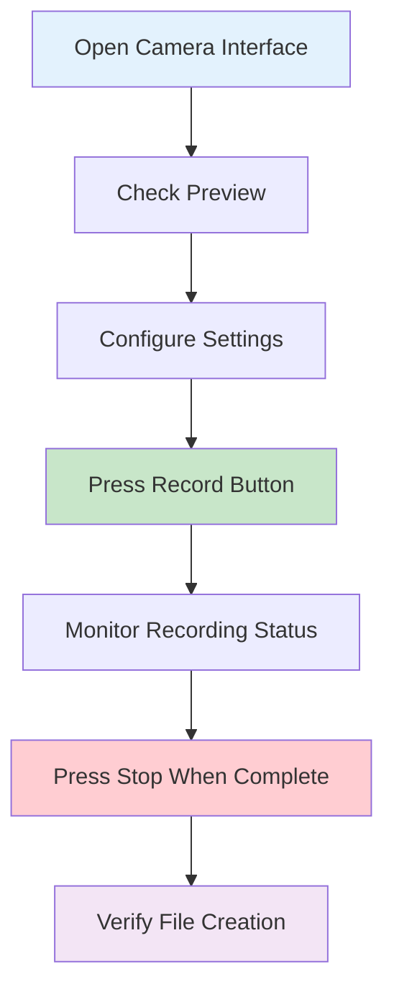
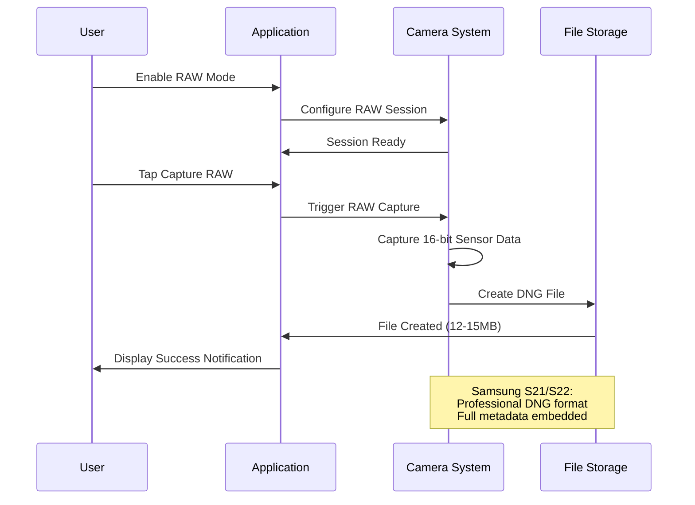

# Camera Recording System - User Guide

## Table of Contents

- [Pre-flight Checklist](#pre-flight-checklist)
- [Getting Started](#getting-started)
- [Recording Sessions](#recording-sessions)
- [Advanced Features](#advanced-features)
- [Configuration Options](#configuration-options)
- [Expected Output](#expected-output)
- [Troubleshooting](#troubleshooting)
- [Samsung S21/S22 Optimization](#samsung-s21s22-optimization)

## Pre-flight Checklist

Before using the Camera Recording System, ensure all prerequisites are met:

### ✅ Hardware Requirements

**Minimum Requirements**:
- [ ] Android device with Camera2 API support (API 21+)
- [ ] 2GB available storage space
- [ ] Stable lighting conditions for optimal recording

**Optimal Requirements (Samsung S21/S22)**:
- [ ] Samsung Galaxy S21 or S22 series device
- [ ] 4GB+ available storage space
- [ ] Hardware LEVEL_3 camera support (automatically detected)
- [ ] Manual sensor control capabilities

### ✅ Permissions

Ensure the following permissions are granted:
- [ ] **Camera Permission**: Required for camera access
- [ ] **Storage Permission**: Required for saving video and RAW files
- [ ] **Audio Permission**: May be required for some configurations

### ✅ Environment Setup

- [ ] Adequate lighting for camera operation
- [ ] Stable device mounting or hand-held operation
- [ ] Clear camera lens (clean with microfiber cloth)
- [ ] Sufficient battery level (recommend 50%+ for extended sessions)

### ✅ Network Configuration (if using streaming)

- [ ] Stable Wi-Fi or cellular connection
- [ ] PC application running and ready to receive stream
- [ ] Network firewall configured to allow connections

## Getting Started

### Step 1: Initialize Camera System

1. **Open the Application**
   - Launch the Multi-Sensor Recording application
   - Navigate to the camera recording section

2. **Grant Permissions**
   - When prompted, grant camera access permission
   - Grant storage access permission for file saving

3. **Verify Camera Setup**
   - Ensure the camera preview is visible on screen
   - Check that the camera is properly focused
   - Verify adequate lighting conditions

### Step 2: Configure Recording Settings

Navigate to **Settings → Camera Configuration**:

**Basic Settings**:
- **Video Quality**: 4K UHD (3840x2160) - recommended
- **Frame Rate**: 30 fps - standard
- **Video Format**: MP4 (H.264 encoding)

**Advanced Settings** (Samsung S21/S22):
- **RAW Capture**: Enable for professional photography
- **DNG Format**: Professional RAW format with metadata
- **Samsung Optimization**: Automatically enabled for supported devices

### Step 3: Test Camera Function

1. **Preview Test**:
   - Verify camera preview displays correctly
   - Check preview is responsive to device movement
   - Ensure preview orientation matches device rotation

2. **Test Recording**:
   - Start a short 10-second test recording
   - Verify video file is created successfully
   - Check video playback quality and orientation

## Recording Sessions

### Basic Video Recording

#### Starting a Video Session



**Step-by-Step Process**:

1. **Preparation**
   - Ensure good lighting conditions
   - Clean camera lens if necessary
   - Position device or mount securely

2. **Start Recording**
   - Tap the **Start Recording** button
   - Observe recording indicator (red dot or timer)
   - Maintain steady device position

3. **During Recording**
   - Monitor recording duration display
   - Ensure adequate storage space remains
   - Avoid covering camera lens or blocking light

4. **Stop Recording**
   - Tap the **Stop Recording** button
   - Wait for file processing to complete
   - Verify success notification appears

#### Recording Status Indicators

| Indicator | Meaning | Action Required |
|-----------|---------|----------------|
| 🔴 **Recording** | Video capture active | Continue recording or stop when ready |
| ⏸️ **Paused** | Recording temporarily paused | Resume or stop recording |
| ✅ **Complete** | Recording finished successfully | Files ready for review |
| ⚠️ **Warning** | Storage low or other issue | Check storage space or restart |
| ❌ **Error** | Recording failed | Check troubleshooting guide |

### RAW Image Capture (Samsung S21/S22)

#### Enabling RAW Capture

1. **Access Advanced Settings**
   - Navigate to **Settings → Camera → Advanced**
   - Toggle **Enable RAW Capture** to ON
   - Confirm Samsung optimization is detected

2. **Configure RAW Settings**
   - **DNG Quality**: Maximum (recommended)
   - **Metadata Embedding**: Full (includes GPS, orientation)
   - **Color Profile**: RGGB (Samsung standard)

#### Capturing RAW Images



**Manual RAW Capture Steps**:

1. **Enable RAW Mode**
   - Ensure RAW capture is enabled in settings
   - Verify Samsung S21/S22 optimization is active
   - Check available storage (15MB+ per RAW image)

2. **Compose Shot**
   - Frame your subject in the camera preview
   - Ensure adequate lighting (RAW captures work best with good light)
   - Wait for autofocus confirmation

3. **Capture RAW Image**
   - Tap the **Capture RAW** button
   - Wait for processing indicator (2-3 seconds)
   - Confirm successful capture notification

4. **Verify Output**
   - Check that DNG file was created
   - File size should be 12-15MB for Samsung S21/S22
   - Timestamp should match capture time

### Concurrent Recording (Advanced)

For Samsung S21/S22 devices with LEVEL_3 camera hardware:

#### Simultaneous Video + RAW

1. **Setup Concurrent Mode**
   - Enable both **Video Recording** and **RAW Capture**
   - Verify LEVEL_3 hardware compatibility message
   - Check storage space (recommend 5GB+ available)

2. **Start Concurrent Session**
   - Tap **Start Recording** to begin video
   - During video recording, tap **Capture RAW** as needed
   - Monitor storage space and battery level

3. **Performance Expectations**
   - Video quality remains at full 4K @ 30fps
   - RAW capture adds 2-3 second processing time
   - No impact on video recording continuity

## Advanced Features

### Flash Synchronization

The camera system can trigger LED flash for multi-device synchronization:

**Usage**:
1. Navigate to **Tools → Synchronization**
2. Configure **Flash Duration** (default: 200ms)
3. Tap **Trigger Flash Sync** when needed
4. All devices will see the flash signal simultaneously

**Applications**:
- Synchronizing multiple recording devices
- Time-stamping specific events in recordings
- Coordinating with external equipment

### Calibration Image Capture

For system calibration and device alignment:

**Process**:
1. **Setup Calibration Target**
   - Position thermal-contrast checkerboard in view
   - Ensure target fills significant portion of frame
   - Verify adequate lighting on calibration target

2. **Capture Calibration Image**
   - Navigate to **Calibration → Camera Calibration**
   - Tap **Capture Calibration Image**
   - Wait for high-quality JPEG creation
   - Verify calibration image quality

### Live Preview Streaming

For real-time monitoring on PC:

**Configuration**:
1. **Enable Network Streaming**
   - Settings → Network → Enable Preview Streaming
   - Configure PC IP address and port
   - Set streaming quality (640x480 recommended)

2. **Start Streaming**
   - Ensure PC application is ready to receive
   - Tap **Start Preview Stream**
   - Monitor stream status and quality

## Configuration Options

### Video Settings

| Setting | Options | Recommendation | Notes |
|---------|---------|----------------|-------|
| **Resolution** | 1080p, 4K UHD | 4K UHD | Higher quality, larger files |
| **Frame Rate** | 15, 24, 30, 60 fps | 30 fps | Good quality/file size balance |
| **Bitrate** | 5-20 Mbps | 10 Mbps | Professional quality |
| **Audio** | Enabled/Disabled | Disabled | Video-only recording |

### RAW Settings (Samsung S21/S22)

| Setting | Options | Recommendation | Notes |
|---------|---------|----------------|-------|
| **DNG Quality** | Standard, High, Maximum | Maximum | Professional quality |
| **Metadata** | Basic, Full | Full | Include GPS, orientation |
| **Color Space** | sRGB, Adobe RGB | Adobe RGB | Professional color accuracy |
| **Compression** | None, Lossless | Lossless | Smaller files, same quality |

### Preview Settings

| Setting | Options | Recommendation | Notes |
|---------|---------|----------------|-------|
| **Preview Resolution** | 720p, 1080p | 1080p | Clear preview without lag |
| **Stream Resolution** | 480p, 720p | 480p | Network efficiency |
| **Auto-Focus** | Continuous, Manual | Continuous | Best for moving subjects |
| **Exposure** | Auto, Manual | Auto | Simplest operation |

## Expected Output

### Video Files

**4K Video Recording Output**:
- **Format**: MP4 (H.264 encoding)
- **Resolution**: 3840x2160 pixels
- **Frame Rate**: 30 fps
- **Bitrate**: 10 Mbps
- **File Size**: ~75MB per minute
- **Audio**: None (video-only recording)

**File Location**: 
- Internal Storage: `/Android/data/com.multisensor.recording/files/Movies/`
- External Storage: `/storage/emulated/0/Android/data/com.multisensor.recording/files/Movies/`

**Naming Convention**: `Session_[timestamp].mp4`
- Example: `Session_1709123456789.mp4`

### RAW Image Files (Samsung S21/S22)

**DNG File Specifications**:
- **Format**: Adobe DNG (Digital Negative)
- **Resolution**: 4000x3000+ pixels (device dependent)
- **Bit Depth**: 16-bit per channel
- **Color Space**: RGGB Bayer pattern
- **File Size**: 12-15MB per image
- **Compression**: Lossless

**Embedded Metadata**:
- Camera characteristics and sensor information
- Capture settings (ISO, exposure time, aperture)
- GPS location data (if available)
- Orientation and rotation information
- Samsung-specific sensor calibration data

**File Location**:
- Internal Storage: `/Android/data/com.multisensor.recording/files/Pictures/`
- External Storage: `/storage/emulated/0/Android/data/com.multisensor.recording/files/Pictures/`

**Naming Convention**: `Session_[timestamp]_RAW_[index].dng`
- Example: `Session_1709123456789_RAW_1.dng`

### Session Information

Each recording session generates a summary file:

**SessionInfo Contents**:
```json
{
  "sessionId": "Session_1709123456789",
  "startTime": 1709123456789,
  "endTime": 1709123556789,
  "duration": 100000,
  "videoEnabled": true,
  "rawEnabled": true,
  "videoFilePath": "/path/to/Session_1709123456789.mp4",
  "rawFilePaths": [
    "/path/to/Session_1709123456789_RAW_1.dng",
    "/path/to/Session_1709123456789_RAW_2.dng"
  ],
  "cameraId": "0",
  "videoResolution": "3840x2160",
  "rawResolution": "4000x3000",
  "deviceModel": "Samsung SM-G991B",
  "optimizationLevel": "Samsung_S21_Optimized"
}
```

## Troubleshooting

### Common Issues and Solutions

#### Camera Not Initializing

**Symptoms**: Camera preview not showing, initialization fails
**Possible Causes**:
- Camera permission not granted
- Camera in use by another application
- Hardware failure

**Solutions**:
1. **Check Permissions**
   - Go to Settings → Apps → [App Name] → Permissions
   - Ensure Camera permission is granted
   - Restart application after granting permission

2. **Close Other Camera Apps**
   - Close all other camera applications
   - Restart device if necessary
   - Try initialization again

3. **Hardware Reset**
   - Force close application completely
   - Restart device
   - Clear application cache if problem persists

#### Recording Fails to Start

**Symptoms**: Record button doesn't work, error messages appear
**Possible Causes**:
- Insufficient storage space
- Invalid camera configuration
- Background processing overload

**Solutions**:
1. **Free Storage Space**
   - Check available storage: need 2GB+ for basic recording
   - Delete old files or move to cloud storage
   - Restart recording session

2. **Reset Camera Configuration**
   - Go to Settings → Camera → Reset to Defaults
   - Restart application
   - Try recording with default settings

3. **Close Background Apps**
   - Close unnecessary applications
   - Free up device memory
   - Restart camera session

#### RAW Capture Not Working

**Symptoms**: RAW capture button disabled, DNG files not created
**Possible Causes**:
- Non-Samsung device or unsupported hardware
- Insufficient storage space
- Camera session not properly configured

**Solutions**:
1. **Verify Device Compatibility**
   - Check if device is Samsung S21/S22 series
   - Look for "Samsung Optimization Detected" message
   - Use standard video recording if RAW not supported

2. **Check Storage Requirements**
   - Ensure 15MB+ available per RAW image
   - Clear storage if necessary
   - Monitor storage during extended RAW sessions

3. **Restart RAW Session**
   - Stop current recording session
   - Restart application completely
   - Re-enable RAW capture in settings

#### Poor Video Quality

**Symptoms**: Blurry video, low resolution, artifacts
**Possible Causes**:
- Inadequate lighting conditions
- Camera lens obstruction
- Incorrect video settings

**Solutions**:
1. **Improve Lighting**
   - Ensure adequate lighting on subject
   - Avoid backlighting situations
   - Use external lighting if necessary

2. **Clean Camera Lens**
   - Use microfiber cloth to clean lens
   - Remove any protective film or case interference
   - Check for scratches or damage

3. **Adjust Video Settings**
   - Increase video bitrate in settings
   - Ensure 4K resolution is selected
   - Check that auto-focus is enabled

#### Synchronization Issues

**Symptoms**: Flash sync not working, timing problems
**Possible Causes**:
- Flash hardware not available
- Multiple device timing mismatch
- Network latency in coordination

**Solutions**:
1. **Verify Flash Availability**
   - Check if device has LED flash
   - Test flash manually in camera app
   - Use alternative sync methods if no flash

2. **Network Synchronization**
   - Ensure all devices on same network
   - Minimize network latency
   - Use wired connections where possible

3. **Manual Coordination**
   - Use audio or visual cues for synchronization
   - Record synchronization events in video
   - Post-process alignment if necessary

### Error Codes and Messages

| Error Code | Message | Solution |
|------------|---------|----------|
| **CAM_001** | Camera initialization failed | Check permissions and restart |
| **CAM_002** | Invalid camera configuration | Reset to default settings |
| **CAM_003** | Recording session failed | Check storage and restart |
| **CAM_004** | RAW capture not supported | Use Samsung S21/S22 device |
| **CAM_005** | Insufficient storage space | Free storage and retry |
| **CAM_006** | DNG creation failed | Restart session and retry |
| **CAM_007** | Flash sync unavailable | Check device flash capability |
| **CAM_008** | Network streaming failed | Check network connection |

## Samsung S21/S22 Optimization

### Hardware-Specific Features

Samsung S21/S22 devices provide enhanced camera capabilities:

#### Automatic Optimization Detection

The application automatically detects Samsung S21/S22 devices and enables:
- **LEVEL_3 Hardware Support**: Advanced camera features
- **Stage 3 RAW Extraction**: Professional-grade sensor data access
- **Enhanced Metadata**: Samsung-specific sensor characteristics
- **Optimized Processing**: Hardware-accelerated DNG creation

#### Visual Confirmation

When Samsung optimization is active, you'll see:
- **Device Status**: "Samsung S21/S22 Detected" in camera settings
- **Optimization Level**: "Samsung_S21_Optimized" in session info
- **RAW Capability**: "Stage 3 RAW Extraction Available" message
- **Performance Metrics**: Enhanced processing speed indicators

#### Samsung-Specific Settings

Additional configuration options for Samsung devices:

**Enhanced RAW Features**:
- **Noise Profile Processing**: Samsung sensor-specific noise reduction
- **Color Filter Array**: RGGB pattern optimization
- **Sensor Calibration**: Samsung factory calibration data embedding
- **Advanced Metadata**: Extended camera characteristics inclusion

**Performance Optimizations**:
- **Concurrent Recording**: Video + RAW simultaneous capture
- **Background Processing**: Optimized DNG creation pipeline
- **Memory Management**: Samsung-specific buffer optimization
- **Hardware Acceleration**: LEVEL_3 camera API utilization

### Best Practices for Samsung Devices

1. **Storage Management**
   - Reserve 5GB+ for extended RAW sessions
   - Use high-speed storage (UFS 3.0+) for optimal performance
   - Monitor storage during concurrent recording

2. **Thermal Management**
   - Avoid extended concurrent recording in hot environments
   - Allow device cooling between intensive sessions
   - Monitor device temperature during long recordings

3. **Quality Optimization**
   - Use Samsung-recommended settings for best results
   - Enable all metadata embedding for professional use
   - Utilize LEVEL_3 features for maximum quality

4. **Performance Monitoring**
   - Watch for Samsung optimization status indicators
   - Monitor RAW processing times (2-3 seconds normal)
   - Verify DNG file sizes match expected range (12-15MB)

## Additional Resources

### Professional Photography Tips

For optimal RAW capture results:
- Use manual focus for critical shots
- Ensure adequate lighting (RAW excels in good light)
- Shoot in Adobe RGB color space for maximum color gamut
- Use tripod or stabilization for sharpest results
- Capture calibration images for color accuracy

### Integration with Professional Workflows

The DNG files produced are compatible with:
- Adobe Lightroom and Photoshop
- Capture One Pro
- ON1 Photo RAW
- Open-source alternatives like RawTherapee

### Support and Community

- **Documentation**: [Full technical documentation](README_CameraRecorder.md)
- **API Reference**: [Protocol documentation](PROTOCOL_CameraRecorder.md)
- **Community Forums**: User discussion and tips sharing
- **Professional Support**: Technical consultation available

---

*For technical implementation details, see [README_CameraRecorder.md](README_CameraRecorder.md)*  
*For API and protocol specifications, see [PROTOCOL_CameraRecorder.md](PROTOCOL_CameraRecorder.md)*