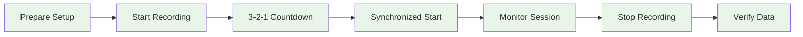

# Multi-Device Synchronization System - User Guide

## Overview

The Multi-Device Synchronization System ensures that all your recording devices (smartphones, thermal cameras, webcams, and physiological sensors) capture data at exactly the same moments in time. This guide will help you set up, use, and troubleshoot the synchronization system for your research experiments.

## What is Multi-Device Synchronization?

When conducting research with multiple sensors, it's crucial that all devices record data simultaneously. Even tiny timing differences (milliseconds) can make it impossible to correlate data between different sensors. Our synchronization system acts like a master conductor, ensuring all devices start and stop recording at precisely the same time.

### Why Synchronization Matters

- **Accurate Data Correlation:** Compare thermal, video, and physiological data from the exact same moments
- **Valid Research Results:** Ensure timing precision required for scientific analysis
- **Event Timing:** Precisely measure responses to stimuli across all sensor modalities
- **Quality Assurance:** Maintain research-grade data collection standards

## Pre-flight Checklist

Before starting your recording session, ensure these prerequisites are met:

### Network Requirements
- [ ] **Stable Wi-Fi Network:** All devices connected to the same network
- [ ] **Sufficient Bandwidth:** Minimum 10 Mbps for multiple device streams
- [ ] **Low Latency:** Network latency below 50ms (test with ping)
- [ ] **Firewall Configuration:** Ports 8889 (NTP) and 9000 (JSON) open

### Hardware Setup
- [ ] **PC Controller:** Windows PC with Python environment active
- [ ] **Android Devices:** 2x Samsung S22 smartphones with thermal cameras attached
- [ ] **USB Webcams:** 2x Logitech Brio 4K cameras connected to PC
- [ ] **Shimmer Sensors:** Optional GSR+ sensors paired with Android devices
- [ ] **Power Supply:** All devices adequately charged or connected to power

### Software Verification
- [ ] **PC Application:** Desktop controller application launched and running
- [ ] **Android Apps:** Recording apps installed and updated on both devices
- [ ] **Network Discovery:** PC can discover and connect to Android devices
- [ ] **Time Server:** NTP time server active and synchronized

## Step-by-Step Setup Guide

### Step 1: Start the PC Controller

1. Open a terminal and navigate to the project directory
2. Activate the Python environment:
   ```bash
   conda activate thermal-env
   ```
3. Launch the desktop controller:
   ```bash
   ./gradlew :PythonApp:runDesktopApp
   ```
4. Verify the controller starts successfully with this interface:


### Step 2: Connect Android Devices

1. **Launch Android Apps:** Open the recording app on both Android devices
2. **Check Network Discovery:** The PC should automatically discover nearby devices
3. **Establish Connections:** Click "Connect" for each discovered device
4. **Verify Device Status:** Ensure both devices show "Connected" status


### Step 3: Verify Synchronization Quality

1. **Check Time Sync Status:** Look for green synchronization indicators
2. **Monitor Sync Quality:** Ensure sync quality shows >90% for all devices
3. **Test Network Latency:** Verify latency measurements are below 50ms
4. **Validate Clock Accuracy:** Time offset should be <10ms for all devices

```
Synchronization Status:
✓ Device 1: Synchronized (offset: 3.2ms, quality: 96%)
✓ Device 2: Synchronized (offset: 5.1ms, quality: 94%)
✓ NTP Server: Active (accuracy: 2.1ms)
✓ Network Quality: Excellent (latency: 12ms)
```

### Step 4: Configure Recording Parameters

1. **Select Recording Mode:**
   - **Video Recording:** Enable 4K video capture
   - **Thermal Recording:** Enable thermal camera data
   - **Shimmer Recording:** Enable physiological sensors if available

2. **Set Session Parameters:**
   - **Session ID:** Enter unique identifier for your experiment
   - **Duration:** Set maximum recording duration (optional)
   - **File Naming:** Configure automatic file naming convention

3. **Configure Sensor Settings:**
   - **Frame Rate:** 30 FPS recommended for most applications
   - **Resolution:** 4K for video, native resolution for thermal
   - **Compression:** Enable for longer recordings or limited storage


## Recording Session Workflow

### Starting a Recording Session

1. **Prepare Your Setup:**
   - Position all cameras and sensors appropriately
   - Ensure subjects are in the field of view of all devices
   - Verify adequate lighting for thermal and video cameras

2. **Initialize Recording:**
   - Click "Start Recording" on the PC controller
   - Observe the countdown timer (3-2-1 synchronization sequence)
   - Verify all devices begin recording simultaneously

3. **Monitor During Recording:**
   - Watch real-time status indicators for all devices
   - Monitor synchronization quality throughout the session
   - Check storage space and battery levels on mobile devices



### During Recording

**Real-Time Monitoring:**
- **Device Status:** Monitor connection and recording status for each device
- **Synchronization Quality:** Watch for any drops in sync quality
- **Network Performance:** Keep an eye on latency and packet loss indicators
- **Storage Monitoring:** Track available storage space on all devices

**Quality Indicators:**
- 🟢 **Green:** Excellent synchronization (>95% quality)
- 🟡 **Yellow:** Good synchronization (85-95% quality)  
- 🔴 **Red:** Poor synchronization (<85% quality) - consider stopping to troubleshoot

### Stopping a Recording Session

1. **Coordinate Stop:** Click "Stop Recording" on PC controller
2. **Synchronized Termination:** All devices stop recording simultaneously
3. **Data Verification:** System automatically verifies data integrity
4. **File Transfer:** Android devices transfer data to PC (optional)

## Expected Results and Data Output

### File Organization

After a successful recording session, you'll find your data organized as follows:

```
recordings/
└── session_20240315_143022/
    ├── session_metadata.json          # Session info and sync quality
    ├── device_1/
    │   ├── rgb_video.mp4              # 4K RGB video
    │   ├── thermal_data.bin           # Thermal camera data
    │   └── shimmer_gsr.csv            # GSR sensor data (if enabled)
    ├── device_2/
    │   ├── rgb_video.mp4              # 4K RGB video
    │   ├── thermal_data.bin           # Thermal camera data
    │   └── shimmer_gsr.csv            # GSR sensor data (if enabled)
    ├── webcam_1/
    │   └── video_capture.mp4          # USB webcam footage
    ├── webcam_2/
    │   └── video_capture.mp4          # USB webcam footage
    └── sync_logs/
        ├── synchronization_log.txt    # Detailed sync events
        └── quality_report.json        # Sync quality metrics
```

### Data Quality Validation

The system automatically generates quality reports:

**Session Metadata (`session_metadata.json`):**
```json
{
  "session_id": "session_20240315_143022",
  "start_time": "2024-03-15T14:30:22.045Z",
  "duration_seconds": 180.5,
  "devices": [
    {
      "device_id": "samsung_s22_001",
      "sync_quality_avg": 96.3,
      "time_offset_avg_ms": 3.2,
      "files_recorded": ["rgb_video.mp4", "thermal_data.bin"]
    }
  ],
  "overall_sync_quality": 95.7,
  "quality_assessment": "Excellent"
}
```

### Temporal Alignment Verification

Each data file includes precise timestamps for correlation:

- **Video Files:** Frame-level timestamps with microsecond precision
- **Thermal Data:** Temperature readings with synchronized timestamps  
- **Sensor Data:** Sample-level timing for physiological measurements
- **Event Markers:** Stimulus timing and system events

## Troubleshooting Guide

### Common Issues and Solutions

#### Poor Synchronization Quality

**Symptoms:**
- Sync quality below 85%
- High time offset (>20ms)
- Inconsistent timing across devices

**Solutions:**
1. **Check Network Quality:**
   ```bash
   # Test network latency
   ping -c 10 [android_device_ip]
   ```
2. **Restart Time Synchronization:**
   - Click "Re-sync Clocks" in the PC controller
   - Wait for synchronization to complete
3. **Improve Network Conditions:**
   - Move devices closer to Wi-Fi router
   - Reduce other network traffic
   - Switch to 5GHz Wi-Fi band if available

#### Device Connection Issues

**Symptoms:**
- Devices not discovered by PC
- Connection drops during recording
- "Disconnected" status in device list

**Solutions:**
1. **Network Configuration:**
   - Ensure all devices on same Wi-Fi network
   - Check firewall settings (allow ports 8889, 9000)
   - Restart Wi-Fi router if necessary

2. **Device-Specific Troubleshooting:**
   - Restart Android recording apps
   - Check Android Wi-Fi settings
   - Verify PC network adapter settings

3. **Manual Connection:**
   - Enter device IP addresses manually
   - Use "Scan Network" function
   - Check device discovery logs

#### Recording Start Failures

**Symptoms:**
- Some devices don't start recording
- Recording starts at different times
- Error messages during start sequence

**Solutions:**
1. **Pre-Recording Checklist:**
   - Verify all devices show "Ready" status
   - Check available storage space
   - Ensure adequate battery levels

2. **Synchronization Reset:**
   - Stop any partially started recordings
   - Re-establish device connections
   - Perform fresh time synchronization

#### Data Quality Issues

**Symptoms:**
- Missing data files
- Timestamp misalignment
- Incomplete recordings

**Solutions:**
1. **Verify Recording Parameters:**
   - Check selected recording modes
   - Validate file paths and permissions
   - Review storage capacity

2. **Post-Recording Validation:**
   - Run data integrity checks
   - Compare file timestamps
   - Review synchronization logs

### Advanced Troubleshooting

#### Network Diagnostics

Use these commands to diagnose network issues:

```bash
# Check network connectivity
python PythonApp/tools/network_diagnostics.py

# Monitor real-time sync quality
python PythonApp/tools/sync_monitor.py

# Generate detailed connection report
python PythonApp/tools/connection_report.py
```

#### Log Analysis

Check these log files for detailed troubleshooting information:

- **Application Logs:** `PythonApp/logs/application.log`
- **Network Logs:** `PythonApp/logs/network_communication.log`
- **Synchronization Logs:** `PythonApp/logs/synchronization.log`
- **Device Logs:** Check individual Android device logs

#### Performance Optimization

**Network Optimization:**
- Use wired ethernet for PC if possible
- Configure QoS settings on router
- Minimize other network activity during recording

**System Optimization:**
- Close unnecessary applications on PC
- Ensure adequate free disk space
- Monitor CPU and memory usage

## Tips for Optimal Performance

### Best Practices

1. **Environment Setup:**
   - Use dedicated Wi-Fi network for recording
   - Maintain consistent environmental conditions
   - Position devices to minimize movement

2. **Recording Planning:**
   - Test synchronization before important experiments
   - Keep recording sessions under 30 minutes for optimal performance
   - Plan for adequate data transfer time

3. **Quality Monitoring:**
   - Always verify sync quality before starting recording
   - Monitor real-time indicators during recording
   - Review quality reports after each session

### Performance Expectations

Under optimal conditions, expect:
- **Synchronization Accuracy:** <5ms time offset
- **Recording Start Precision:** <50ms across all devices
- **Data Transfer Speed:** 10-50 MB/s depending on network
- **Session Setup Time:** 2-3 minutes including quality verification

### Recommended Session Workflow

1. **Daily Setup (5 minutes):**
   - Start PC controller
   - Connect all devices
   - Verify synchronization quality

2. **Per-Experiment (2 minutes):**
   - Configure recording parameters
   - Position devices and subjects
   - Start synchronized recording

3. **Post-Recording (5 minutes):**
   - Verify data quality
   - Transfer files if needed
   - Review sync quality report

## Frequently Asked Questions

**Q: How accurate is the synchronization?**
A: Under optimal conditions, the system achieves sub-10 millisecond synchronization accuracy across all devices.

**Q: Can I record without an internet connection?**
A: Yes, the system works on local networks without internet. However, initial NTP synchronization requires internet access.

**Q: What happens if a device disconnects during recording?**
A: The system continues recording on connected devices and automatically reconnects dropped devices when possible.

**Q: How many devices can I synchronize simultaneously?**
A: The system has been tested with up to 8 devices. Performance depends on network capacity and PC resources.

**Q: Can I add custom sensors to the synchronization system?**
A: Yes, the system is extensible. Contact the development team for guidance on integrating new sensor types.

**Q: How do I calibrate cameras for synchronized recording?**
A: Use the built-in calibration system before recording. See the [Calibration User Guide](USER_GUIDE_Calibration.md) for details.

This user guide provides everything you need to successfully set up and operate the Multi-Device Synchronization System for your research experiments. For technical details and development information, see the [Technical Deep-Dive](README_Multi_Device_Synchronization.md).