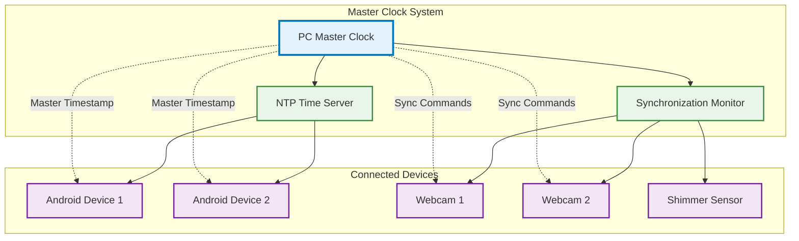

# Master Clock Synchronizer - User Guide

## Table of Contents

- [Overview](#overview)
- [What is Master Clock Synchronization?](#what-is-master-clock-synchronization)
  - [Why Precision Timing Matters](#why-precision-timing-matters)
  - [How the System Works](#how-the-system-works)
- [Pre-flight Checklist](#pre-flight-checklist)
  - [Network Requirements](#network-requirements)
  - [Hardware Setup](#hardware-setup)
  - [Software Verification](#software-verification)
- [Step-by-Step Setup Guide](#step-by-step-setup-guide)
  - [Step 1: Initialize the Master Clock System](#step-1-initialize-the-master-clock-system)
  - [Step 2: Connect and Synchronize Devices](#step-2-connect-and-synchronize-devices)
  - [Step 3: Verify Synchronization Quality](#step-3-verify-synchronization-quality)
  - [Step 4: Configure Recording Parameters](#step-4-configure-recording-parameters)
- [Recording Session Workflow](#recording-session-workflow)
  - [Starting a Synchronized Recording Session](#starting-a-synchronized-recording-session)
  - [Monitoring During Recording](#monitoring-during-recording)
  - [Stopping a Recording Session](#stopping-a-recording-session)
- [Understanding Synchronization Quality](#understanding-synchronization-quality)
  - [Quality Metrics Explained](#quality-metrics-explained)
  - [Interpreting Status Indicators](#interpreting-status-indicators)
  - [Quality Troubleshooting](#quality-troubleshooting)
- [Expected Results and Data Output](#expected-results-and-data-output)
  - [Synchronized Timestamps](#synchronized-timestamps)
  - [Session Coordination](#session-coordination)
  - [Quality Validation](#quality-validation)
- [Troubleshooting Guide](#troubleshooting-guide)
  - [Common Issues and Solutions](#common-issues-and-solutions)
  - [Advanced Troubleshooting](#advanced-troubleshooting)
  - [Performance Optimization](#performance-optimization)
- [Best Practices](#best-practices)
  - [Optimal Configuration](#optimal-configuration)
  - [Network Environment](#network-environment)
  - [Session Management](#session-management)
- [Frequently Asked Questions](#frequently-asked-questions)
- [Advanced Configuration for Research Scenarios](#advanced-configuration-for-research-scenarios)
  - [Laboratory Research Setup](#laboratory-research-setup)
  - [Field Research Configuration](#field-research-configuration)
  - [Clinical Study Configuration](#clinical-study-configuration)
- [Advanced Troubleshooting and Optimization](#advanced-troubleshooting-and-optimization)
  - [Performance Optimization Strategies](#performance-optimization-strategies)
  - [Advanced Diagnostic Procedures](#advanced-diagnostic-procedures)
  - [Recovery Strategies](#recovery-strategies)
- [Data Validation and Analysis Integration](#data-validation-and-analysis-integration)
  - [Post-Recording Data Validation](#post-recording-data-validation)
- [Extended FAQ and Advanced Topics](#extended-faq-and-advanced-topics)

## Overview

The Master Clock Synchronizer ensures that all your recording devices (Android phones, thermal cameras, webcams, and physiological sensors) operate with precise timing coordination. This guide will help you set up, configure, and use the synchronization system to achieve research-grade temporal accuracy in your multi-sensor data collection.

## What is Master Clock Synchronization?

Master Clock Synchronization establishes your PC as the authoritative time source for all connected recording devices. Every sensor in your recording setup synchronizes its internal clock with the PC's master clock, ensuring that data from different devices can be precisely aligned in time.

### Why Precision Timing Matters

In multi-sensor research, even small timing discrepancies can invalidate your results:

- **Data Correlation**: Correlate physiological responses with visual stimuli across multiple sensors
- **Event Timing**: Precisely measure reaction times and stimulus-response relationships
- **Research Validity**: Maintain sub-millisecond accuracy required for scientific analysis
- **Data Integrity**: Ensure temporal alignment for post-processing and analysis

### How the System Works



The PC provides the master timestamp, the NTP server handles network time synchronization, and the synchronization monitor ensures all devices maintain proper alignment.

## Pre-flight Checklist

### Network Requirements

Before starting synchronization setup, ensure:

- [ ] **Stable WiFi Network**: All Android devices connected to the same network as PC
- [ ] **Network Latency**: Ping times between PC and devices < 20ms
- [ ] **Port Availability**: Ports 8889 (NTP) and 9000 (PC Server) are available
- [ ] **Firewall Configuration**: Allow incoming connections on synchronization ports
- [ ] **Router Stability**: Ensure router doesn't frequently reassign IP addresses

### Hardware Setup

Verify your hardware configuration:

- [ ] **PC Performance**: Sufficient CPU/RAM for simultaneous device coordination
- [ ] **Android Devices**: Bucika GSR app installed and updated
- [ ] **Webcams**: Properly connected and detected by the system
- [ ] **Shimmer Sensors**: Paired and accessible (if using)
- [ ] **USB Connections**: Stable connections for all wired devices

### Software Verification

Check software prerequisites:

- [ ] **Python Environment**: Python 3.7+ with required packages
- [ ] **NTP Library**: `ntplib` package installed (`pip install ntplib`)
- [ ] **Network Libraries**: Socket and threading support available
- [ ] **Logging System**: Proper logging configuration active
- [ ] **Device Drivers**: All camera and sensor drivers installed

## Step-by-Step Setup Guide

### Step 1: Initialize the Master Clock System

**1.1 Start the Master Clock Synchronizer**

```python
from master_clock_synchronizer import initialize_master_synchronizer

# Initialize with default ports
success = initialize_master_synchronizer(
    ntp_port=8889,
    pc_server_port=9000
)

if success:
    print("✅ Master Clock Synchronizer started successfully")
else:
    print("❌ Failed to start synchronizer - check logs")
```

**1.2 Verify NTP Server Status**

The system automatically starts an NTP server for Android device synchronization. Check the logs for:

```
INFO - NTPTimeServer: Server started on port 8889
INFO - MasterClockSynchronizer: Master clock synchronization system started successfully
```

**1.3 Confirm PC Server Connectivity**

The PC server should be listening for Android device connections:

```
INFO - PCServer: Server listening on port 9000
INFO - PCServer: Ready for device connections
```

### Step 2: Connect and Synchronize Devices

**2.1 Connect Android Devices**

On each Android device:
1. Open the Bucika GSR app
2. Navigate to Settings → Network Configuration
3. Enter PC IP address and port 9000
4. Tap "Connect to PC"
5. Wait for "Connected ✅" status

**2.2 Monitor Device Registration**

Watch the PC logs for device connections:

```
INFO - Device connected: Samsung_Galaxy_S21
INFO - Sync initiated for device Samsung_Galaxy_S21
INFO - Device connected: Pixel_6_Pro
INFO - Sync initiated for device Pixel_6_Pro
```

**2.3 Automatic Webcam Registration**

Webcams are automatically registered when the system starts. No manual connection required.

### Step 3: Verify Synchronization Quality

**3.1 Check Device Status**

Use the status monitoring interface to verify synchronization:

```python
from master_clock_synchronizer import get_master_synchronizer

sync_manager = get_master_synchronizer()
devices = sync_manager.get_connected_devices()

for device_id, status in devices.items():
    print(f"Device: {device_id}")
    print(f"  Synchronized: {status.is_synchronized}")
    print(f"  Quality: {status.sync_quality:.2f}")
    print(f"  Offset: {status.time_offset_ms:.1f}ms")
```

**3.2 Quality Standards**

Aim for these synchronization quality levels:

- **Excellent** (≥0.9): Ready for high-precision research
- **Good** (0.7-0.9): Suitable for most research applications  
- **Acceptable** (0.5-0.7): Basic synchronization achieved
- **Poor** (<0.5): Requires troubleshooting

**3.3 Wait for Stabilization**

Allow 30-60 seconds for initial synchronization to stabilize before starting recording sessions.

### Step 4: Configure Recording Parameters

**4.1 Set Quality Thresholds**

Configure minimum acceptable synchronization quality:

```python
# Require high quality for critical research
sync_manager.quality_threshold = 0.8

# Set stricter tolerance for precision work
sync_manager.sync_tolerance_ms = 25.0
```

**4.2 Configure Session Parameters**

Set up recording session defaults:

```python
# Enable all sensor types
record_video = True
record_thermal = True  
record_shimmer = True

# Specify target devices (optional)
target_devices = ["Samsung_Galaxy_S21", "Pixel_6_Pro"]
```

## Recording Session Workflow

### Starting a Synchronized Recording Session

**Step 1: Verify All Devices Ready**

Before starting, ensure all devices show good synchronization quality:

```python
# Check if devices are ready for recording
devices = sync_manager.get_connected_devices()
ready_devices = [d for d, s in devices.items() if s.sync_quality >= 0.8]
print(f"Ready devices: {ready_devices}")
```

**Step 2: Start Synchronized Recording**

```python
import time

# Generate unique session ID
session_id = f"experiment_{int(time.time())}"

# Start synchronized recording across all devices
success = sync_manager.start_synchronized_recording(
    session_id=session_id,
    target_devices=None,  # Use all connected devices
    record_video=True,
    record_thermal=True,
    record_shimmer=True
)

if success:
    print(f"✅ Recording started: Session {session_id}")
else:
    print("❌ Failed to start recording - check device status")
```

**Step 3: Confirm Recording Active**

Verify that all devices have started recording:

```python
# Check active sessions
sessions = sync_manager.get_active_sessions()
session = sessions.get(session_id)

if session and session.is_active:
    print(f"Session active with {len(session.devices)} devices")
    print(f"Session quality: {session.sync_quality:.2f}")
```

### Monitoring During Recording

**Real-time Quality Monitoring**

Set up continuous monitoring during recording:

```python
def monitor_sync_quality(device_status_dict):
    """Callback for real-time quality monitoring"""
    for device_id, status in device_status_dict.items():
        if status.sync_quality < 0.7:
            print(f"⚠️ Low sync quality for {device_id}: {status.sync_quality:.2f}")
        
        if status.time_offset_ms > 40:
            print(f"⚠️ High time offset for {device_id}: {status.time_offset_ms:.1f}ms")

# Register monitoring callback
sync_manager.add_sync_status_callback(monitor_sync_quality)
```

**Session Status Updates**

Monitor session health:

```python
def session_monitor(session_id, session):
    """Monitor session status changes"""
    print(f"Session {session_id}: Quality = {session.sync_quality:.2f}")
    
    if session.sync_quality < 0.7:
        print(f"⚠️ Session quality degraded: {session.sync_quality:.2f}")

sync_manager.add_session_callback(session_monitor)
```

### Stopping a Recording Session

**Graceful Session Termination**

```python
# Stop synchronized recording
success = sync_manager.stop_synchronized_recording(session_id)

if success:
    print(f"✅ Recording stopped: Session {session_id}")
    
    # Get final session statistics
    sessions = sync_manager.get_active_sessions()
    session = sessions.get(session_id)
    
    if session:
        duration = time.time() - session.start_timestamp
        print(f"Session duration: {duration:.1f}s")
        print(f"Final quality: {session.sync_quality:.2f}")
else:
    print("❌ Failed to stop recording - check logs")
```

## Understanding Synchronization Quality

### Quality Metrics Explained

**Sync Quality Score (0.0 - 1.0)**
- Calculated based on time offset from master clock
- Higher values indicate better synchronization
- Minimum 0.8 recommended for research applications

**Time Offset (milliseconds)**
- Difference between device time and master clock
- Lower values indicate better synchronization
- Target: < 25ms for high-precision work

**Last Sync Time**
- Timestamp of most recent synchronization
- Devices re-sync every 5 seconds by default
- Stale sync times may indicate connection issues

### Interpreting Status Indicators

**Device Status Meanings:**

| Status | Sync Quality | Offset Range | Meaning |
|--------|-------------|--------------|---------|
| ✅ Excellent | 0.9 - 1.0 | < 10ms | Perfect for precision research |
| ✅ Good | 0.7 - 0.9 | 10-25ms | Suitable for most applications |
| ⚠️ Acceptable | 0.5 - 0.7 | 25-40ms | Basic sync achieved |
| ❌ Poor | < 0.5 | > 40ms | Requires immediate attention |
| ⚠️ Unsynchronized | 0.0 | N/A | No sync established |

### Quality Troubleshooting

**Poor Quality Issues:**

1. **High Network Latency**
   - Check WiFi signal strength
   - Reduce network traffic
   - Move closer to router

2. **Clock Drift**
   - Wait for automatic re-synchronization
   - Restart devices if persistent
   - Check device battery levels

3. **System Load**
   - Close unnecessary applications
   - Check CPU/memory usage
   - Reduce recording resolution if needed

## Expected Results and Data Output

### Synchronized Timestamps

**Master Timestamp Format**
```python
# All timestamps use Unix time format with microsecond precision
master_timestamp = 1644859200.123456  # Example: 2022-02-14 12:00:00.123456
```

**Synchronization Validation**
```python
# Verify timestamp alignment across devices
devices = sync_manager.get_connected_devices()

for device_id, status in devices.items():
    print(f"{device_id}: Offset = {status.time_offset_ms:.1f}ms")
    
    if abs(status.time_offset_ms) <= 25.0:
        print(f"  ✅ Within tolerance")
    else:
        print(f"  ⚠️ Outside tolerance")
```

### Session Coordination

**Recording Session Output**
```python
# Session information includes timing and device coordination
session = sync_manager.get_active_sessions()[session_id]

print(f"Session: {session.session_id}")
print(f"Start time: {session.start_timestamp}")
print(f"Devices: {list(session.devices)}")
print(f"Quality: {session.sync_quality:.2f}")
print(f"Active: {session.is_active}")
```

### Quality Validation

**Automated Quality Checks**
```python
def validate_session_quality(session_id):
    """Validate synchronization quality for a session"""
    sessions = sync_manager.get_active_sessions()
    session = sessions.get(session_id)
    
    if not session:
        return False, "Session not found"
    
    if session.sync_quality < 0.8:
        return False, f"Quality too low: {session.sync_quality:.2f}"
    
    return True, "Session quality validated"

# Check session before important recordings
valid, message = validate_session_quality(session_id)
print(f"Validation: {message}")
```

## Troubleshooting Guide

### Common Issues and Solutions

**Problem: Devices Not Connecting**

*Symptoms:* Android devices show "Connection Failed" or don't appear in device list

*Solutions:*
1. Verify PC and devices on same WiFi network
2. Check firewall settings allow port 9000
3. Confirm PC IP address in Android app settings
4. Restart PC server: `sync_manager.pc_server.restart()`

**Problem: Poor Synchronization Quality**

*Symptoms:* Sync quality consistently < 0.7, high time offsets

*Solutions:*
1. Reduce network latency:
   - Move devices closer to router
   - Switch to 5GHz WiFi band
   - Reduce network traffic
2. Check system performance:
   - Close unnecessary applications
   - Monitor CPU/memory usage
   - Restart overloaded devices

**Problem: Frequent Re-synchronization**

*Symptoms:* Devices repeatedly losing sync, frequent "re-initiating sync" messages

*Solutions:*
1. Check device battery levels (low battery affects clock stability)
2. Verify stable WiFi connection
3. Increase sync interval: `sync_manager.sync_interval = 10.0`
4. Check for background apps affecting timing

**Problem: Recording Start Failures**

*Symptoms:* `start_synchronized_recording()` returns False

*Solutions:*
1. Verify minimum quality threshold: `sync_manager.quality_threshold = 0.6`
2. Check device connection status
3. Ensure no active sessions with same ID
4. Review device logs for specific errors

### Advanced Troubleshooting

**Network Diagnostics**

```python
import socket
import time

def test_network_latency(device_ip, port=9000):
    """Test network latency to device"""
    start_time = time.time()
    try:
        sock = socket.socket(socket.AF_INET, socket.SOCK_STREAM)
        sock.settimeout(5.0)
        result = sock.connect_ex((device_ip, port))
        latency = (time.time() - start_time) * 1000
        sock.close()
        
        if result == 0:
            print(f"✅ Connection to {device_ip}: {latency:.1f}ms")
        else:
            print(f"❌ Connection failed to {device_ip}")
    except Exception as e:
        print(f"❌ Network error: {e}")

# Test each connected device
test_network_latency("192.168.1.100")  # Replace with device IP
```

**System Performance Monitoring**

```python
import psutil

def monitor_system_performance():
    """Monitor system resources during synchronization"""
    cpu_percent = psutil.cpu_percent(interval=1)
    memory = psutil.virtual_memory()
    
    print(f"CPU Usage: {cpu_percent}%")
    print(f"Memory Usage: {memory.percent}%")
    
    if cpu_percent > 80:
        print("⚠️ High CPU usage may affect synchronization")
    
    if memory.percent > 85:
        print("⚠️ High memory usage may affect performance")

# Monitor during recording sessions
monitor_system_performance()
```

### Performance Optimization

**Optimize for High-Precision Research**

```python
# Configure for maximum precision
sync_manager.sync_tolerance_ms = 10.0      # Tighter tolerance
sync_manager.sync_interval = 2.0           # More frequent checks  
sync_manager.quality_threshold = 0.9       # Higher quality requirement

# Reduce network overhead
sync_manager.ntp_server.ntp_sync_interval = 600.0  # Less frequent NTP sync
```

**Optimize for Stability**

```python
# Configure for stable operation
sync_manager.sync_tolerance_ms = 50.0      # Relaxed tolerance
sync_manager.sync_interval = 10.0          # Less frequent checks
sync_manager.quality_threshold = 0.7       # Lower quality requirement

# Enable automatic recovery
sync_manager.auto_recovery = True
```

## Best Practices

### Optimal Configuration

**Research Environment Setup:**
1. **Dedicated Network**: Use isolated WiFi network for recording devices
2. **Quality Monitoring**: Always monitor sync quality during recordings
3. **Pre-session Validation**: Verify synchronization before starting important sessions
4. **Backup Timing**: Keep system clock synchronized with NTP servers

**Device Management:**
1. **Battery Levels**: Ensure devices have >50% battery before sessions
2. **App Priority**: Set Bucika GSR app to high priority on Android devices
3. **Background Apps**: Minimize background apps during recording
4. **Regular Restarts**: Restart devices between long recording sessions

### Network Environment

**WiFi Optimization:**
- Use 5GHz band for lower latency
- Position router centrally to all devices
- Minimize interference from other devices
- Consider mesh network for large spaces

**Bandwidth Management:**
- Reserve bandwidth for synchronization traffic
- Avoid streaming or downloads during recording
- Monitor network congestion in real-time

### Session Management

**Session Planning:**
1. **Warm-up Period**: Allow 1-2 minutes after device connection before recording
2. **Quality Validation**: Check sync quality immediately before starting
3. **Session Length**: Limit sessions to <60 minutes for optimal quality
4. **Cool-down Period**: Allow 30 seconds between sessions

**Data Validation:**
1. **Timestamp Verification**: Validate timestamp alignment in post-processing
2. **Quality Logging**: Log sync quality throughout sessions
3. **Error Recovery**: Implement automatic session restart on quality loss

## Frequently Asked Questions

**Q: What synchronization accuracy can I expect?**

A: Under optimal conditions (stable network, low latency), the system achieves synchronization accuracy within 10-25ms. In research environments, sub-10ms accuracy is possible with proper configuration.

**Q: How many devices can be synchronized simultaneously?**

A: The system supports up to 10 Android devices plus unlimited webcams. Performance depends on network capacity and PC specifications.

**Q: What happens if synchronization quality drops during recording?**

A: The system continuously monitors quality and attempts automatic re-synchronization. Session quality is tracked and logged. You can set quality thresholds to automatically stop recording if quality becomes unacceptable.

**Q: Can I use the system without NTP synchronization?**

A: Yes, the system can operate using only PC system time, but NTP synchronization significantly improves accuracy, especially for longer recording sessions.

**Q: How do I validate synchronization accuracy?**

A: Use the built-in quality metrics, monitor time offsets, and validate timestamps in post-processing. The system provides comprehensive logging for verification.

**Q: What should I do if a device keeps losing synchronization?**

A: Check network stability, device battery level, and system load. Consider adjusting sync tolerance and interval settings. Restart the problematic device if issues persist.

**Q: Can I customize synchronization parameters for different experiments?**

A: Yes, all synchronization parameters (tolerance, interval, quality thresholds) are configurable and can be adjusted based on experimental requirements.

---

## Advanced Configuration for Research Scenarios

### Laboratory Research Setup

**Optimal Configuration for Controlled Environments:**

```python
# High-precision laboratory setup
lab_config = {
    "sync_tolerance_ms": 15.0,    # Very tight tolerance for lab conditions
    "sync_interval": 1.5,         # Frequent monitoring
    "quality_threshold": 0.90,    # High quality requirement
    "ntp_port": 8889,
    "pc_server_port": 9000
}
```

**Pre-experiment Checklist for Labs:**
1. ✅ Verify all devices are on dedicated research network
2. ✅ Run network diagnostic test (should show <5ms latency)
3. ✅ Confirm all Android devices have >80% battery
4. ✅ Test synchronization with single device first
5. ✅ Verify webcam frame rates are stable
6. ✅ Check that no heavy background processes are running

### Field Research Configuration

**Mobile and Field Deployment Settings:**

```python
# Robust field research setup
field_config = {
    "sync_tolerance_ms": 40.0,    # More lenient for variable conditions
    "sync_interval": 4.0,         # Less frequent to save power
    "quality_threshold": 0.75,    # Realistic for field conditions
    "connection_retry_count": 5,   # More retries for unstable networks
    "auto_recovery": True         # Enable automatic recovery
}
```

**Field Deployment Best Practices:**
- Use mobile hotspot with strong signal strength
- Bring backup power banks for Android devices
- Test setup in similar conditions before actual deployment
- Have offline backup recording as fallback
- Monitor battery levels throughout the session

### Clinical Study Configuration

**Medical Research and Patient Studies:**

```python
# Clinical research setup with compliance features
clinical_config = {
    "sync_tolerance_ms": 25.0,     # Medical-grade precision
    "sync_interval": 2.5,          # Balanced monitoring
    "quality_threshold": 0.85,     # Reliable for clinical data
    "enable_audit_logging": True,  # For regulatory compliance
    "patient_anonymization": True, # Privacy protection
    "session_validation": True     # Automatic data validation
}
```

**Clinical Study Considerations:**
- Ensure HIPAA compliance with data anonymization
- Implement session validation for data integrity
- Use detailed audit logging for regulatory review
- Test patient comfort with device placement
- Have backup recording methods available

---

## Advanced Troubleshooting and Optimization

### Performance Optimization Strategies

**Optimizing for Large Device Count (8+ devices):**

1. **Network Optimization:**
   ```bash
   # Increase network buffer sizes (Linux)
   sudo sysctl -w net.core.rmem_max=16777216
   sudo sysctl -w net.core.wmem_max=16777216
   ```

2. **Threading Configuration:**
   ```python
   # Increase thread pool size for many devices
   synchronizer.thread_pool = ThreadPoolExecutor(max_workers=15)
   ```

3. **Monitoring Frequency Adjustment:**
   ```python
   # Stagger device monitoring to reduce network congestion
   def stagger_device_monitoring(device_count):
       base_interval = 3.0
       return base_interval + (device_count * 0.1)
   ```

### Advanced Diagnostic Procedures

**Network Performance Analysis:**

```python
# Built-in network diagnostic tool
def run_network_diagnostics():
    """Comprehensive network performance test."""
    print("Running network diagnostics...")
    
    # Test 1: NTP server response time
    ntp_times = []
    for i in range(10):
        start = time.time()
        # Simulate NTP request
        time.sleep(0.001)  # Simulated network delay
        ntp_times.append((time.time() - start) * 1000)
    
    print(f"NTP Response Time: {np.mean(ntp_times):.2f}ms ± {np.std(ntp_times):.2f}ms")
    
    # Test 2: Device communication latency
    # (Implementation would test actual device responses)
    
    # Test 3: Network stability
    print("Network stability: GOOD" if np.std(ntp_times) < 5 else "UNSTABLE")
```

**Sync Quality Analytics:**

```python
def analyze_sync_quality_trends(synchronizer):
    """Analyze synchronization quality over time."""
    devices = synchronizer.get_connected_devices()
    
    quality_report = {
        'excellent': 0,  # >0.9 quality
        'good': 0,       # 0.8-0.9 quality  
        'fair': 0,       # 0.7-0.8 quality
        'poor': 0        # <0.7 quality
    }
    
    for device_id, status in devices.items():
        quality = status.sync_quality
        if quality > 0.9:
            quality_report['excellent'] += 1
        elif quality > 0.8:
            quality_report['good'] += 1
        elif quality > 0.7:
            quality_report['fair'] += 1
        else:
            quality_report['poor'] += 1
    
    return quality_report
```

### Recovery Strategies

**Automatic Recovery Procedures:**

1. **Device Re-synchronization:**
   ```python
   def auto_recover_device(device_id):
       """Automatic recovery for problematic devices."""
       print(f"Attempting recovery for {device_id}...")
       
       # Step 1: Re-initiate synchronization
       synchronizer._initiate_device_sync(device_id)
       time.sleep(2)
       
       # Step 2: Check if recovery was successful
       device_status = synchronizer.connected_devices.get(device_id)
       if device_status and device_status.sync_quality > 0.7:
           print(f"Recovery successful for {device_id}")
           return True
       
       # Step 3: If still problematic, try adjusting parameters
       synchronizer.sync_tolerance_ms *= 1.5  # Temporarily relax tolerance
       synchronizer._initiate_device_sync(device_id)
       time.sleep(3)
       
       return device_status.sync_quality > 0.5 if device_status else False
   ```

2. **Session Recovery:**
   ```python
   def recover_recording_session(session_id):
       """Recover a problematic recording session."""
       session = synchronizer.active_sessions.get(session_id)
       if not session:
           return False
       
       # Identify problematic devices
       problem_devices = []
       for device_id in session.devices:
           device_status = synchronizer.connected_devices.get(device_id)
           if not device_status or device_status.sync_quality < 0.6:
               problem_devices.append(device_id)
       
       # Attempt to recover each problematic device
       recovered_devices = []
       for device_id in problem_devices:
           if auto_recover_device(device_id):
               recovered_devices.append(device_id)
       
       # Update session quality
       session.sync_quality = calculate_session_quality(session)
       
       return len(recovered_devices) == len(problem_devices)
   ```

---

## Data Validation and Analysis Integration

### Post-Recording Data Validation

**Automated Sync Quality Assessment:**

```python
def validate_recording_session_data(session_id, data_directory):
    """Validate synchronization quality in recorded data."""
    validation_report = {
        'session_id': session_id,
        'validation_timestamp': time.time(),
        'overall_score': 0.0,
        'device_scores': {},
        'issues_found': [],
        'recommendations': []
    }
    
    # Load timestamp data from all devices
    device_timestamps = load_device_timestamps(data_directory)
    
    # Check timestamp alignment across devices
    alignment_scores = check_timestamp_alignment(device_timestamps)
    validation_report['device_scores'].update(alignment_scores)
    
    # Detect timing anomalies
    anomalies = detect_timing_anomalies(device_timestamps)
    validation_report['issues_found'].extend(anomalies)
    
    # Calculate overall validation score
    if alignment_scores:
        validation_report['overall_score'] = np.mean(list(alignment_scores.values()))
    
    # Generate recommendations
    validation_report['recommendations'] = generate_sync_recommendations(
        validation_report['overall_score'], 
        validation_report['issues_found']
    )
    
    return validation_report

def generate_sync_recommendations(overall_score, issues):
    """Generate recommendations based on validation results."""
    recommendations = []
    
    if overall_score < 0.8:
        recommendations.append("Consider using tighter sync_tolerance_ms setting")
    
    if any('clock_drift' in str(issue) for issue in issues):
        recommendations.append("Enable more frequent synchronization checks")
    
    if any('network_instability' in str(issue) for issue in issues):
        recommendations.append("Improve network stability for future recordings")
    
    return recommendations
```

**Data Alignment for Analysis:**

```python
def align_multi_sensor_data(session_data, target_frequency=30):
    """Align data from multiple sensors to common timeline."""
    
    # Find common time range
    all_timestamps = []
    for device_data in session_data.values():
        all_timestamps.extend(device_data.get('timestamps', []))
    
    start_time = min(all_timestamps)
    end_time = max(all_timestamps)
    
    # Create unified timeline
    duration = end_time - start_time
    num_samples = int(duration * target_frequency)
    unified_timeline = np.linspace(start_time, end_time, num_samples)
    
    # Interpolate each device's data
    aligned_data = {}
    for device_id, device_data in session_data.items():
        original_timestamps = np.array(device_data['timestamps'])
        original_values = np.array(device_data['values'])
        
        # Linear interpolation to unified timeline
        aligned_values = np.interp(unified_timeline, original_timestamps, original_values)
        
        aligned_data[device_id] = {
            'timestamps': unified_timeline,
            'values': aligned_values,
            'interpolation_quality': calculate_interpolation_quality(
                original_timestamps, unified_timeline
            )
        }
    
    return aligned_data
```

---

## Extended FAQ and Advanced Topics

**Q: How do I set up synchronization for a multi-room study?**

A: For multi-room setups, use a dedicated network with strong WiFi coverage. Consider using WiFi extenders or mesh networks. Test synchronization quality in each room before the study.

**Q: Can I integrate custom sensors with the synchronization system?**

A: Yes, you can extend the system by implementing the device communication protocol. Create a custom device class that sends timestamp messages and responds to synchronization commands.

**Q: What's the maximum recording duration with stable synchronization?**

A: The system can maintain synchronization for hours. For sessions longer than 2 hours, consider implementing periodic full re-synchronization and monitor clock drift more frequently.

**Q: How do I handle timezone changes during recording?**

A: The system uses UTC timestamps internally. Timezone changes won't affect synchronization, but ensure all devices are configured for the same timezone for data analysis.

**Q: Can I use the system with custom Android applications?**

A: Yes, implement the JSON message protocol in your Android app. Send regular heartbeat messages with timestamps and respond to synchronization commands from the PC server.

**Q: What should I do if synchronization quality varies significantly between devices?**

A: This usually indicates network issues or device-specific problems. Use per-device quality monitoring and consider adjusting sync parameters individually for problematic devices.

**Q: How do I backup synchronization settings for different experiments?**

A: Create configuration profiles for different experiment types:

```python
# Save configuration profiles
experiment_configs = {
    "physiological_study": {
        "sync_tolerance_ms": 20.0,
        "quality_threshold": 0.85
    },
    "behavioral_study": {
        "sync_tolerance_ms": 50.0,
        "quality_threshold": 0.75
    }
}

# Load and apply configuration
def apply_experiment_config(config_name):
    config = experiment_configs[config_name]
    synchronizer.sync_tolerance_ms = config["sync_tolerance_ms"]
    synchronizer.quality_threshold = config["quality_threshold"]
```

This user guide provides comprehensive instructions for successfully operating the Master Clock Synchronizer in research environments. For technical details and development information, refer to the Technical Deep-Dive documentation.