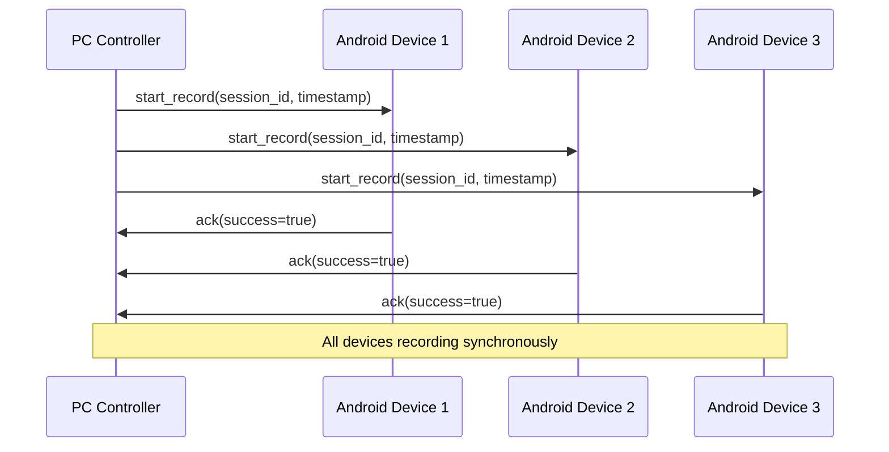

# Networking and Communication Protocol - User Guide

## Overview

This guide provides step-by-step instructions for using the Networking and Communication Protocol to connect Android devices to the PC controller and establish synchronized multi-device recording sessions. The protocol enables real-time communication between your Android devices and the PC application for coordinated data collection.

## Pre-flight Checklist

Before starting any network operations, ensure you have completed the following prerequisites:

### Network Environment
- [ ] All devices (PC and Android) are connected to the same Wi-Fi network
- [ ] Network allows TCP connections on port 9000 (or your configured port)
- [ ] No firewall blocking connections between devices
- [ ] Stable network connection with minimal packet loss

### PC Application Setup
- [ ] PC application is installed and configured
- [ ] Protocol configuration file (`/protocol/config.json`) is properly configured
- [ ] PC server component is accessible and ready to accept connections
- [ ] Network interface is correctly configured (check IP address)

### Android Device Setup
- [ ] Android application is installed on all recording devices
- [ ] Network permissions are granted to the Android application
- [ ] Android devices have sufficient battery level (>30% recommended)
- [ ] Storage space available for recording data
- [ ] Time synchronization is enabled on Android devices

### Hardware Requirements
- [ ] Minimum Android API level 24 (Android 7.0) for enhanced networking features
- [ ] Wi-Fi connectivity capability on all devices
- [ ] Sufficient processing power for real-time data streaming

## Step-by-Step Usage Guide

### Phase 1: PC Server Initialization

#### 1. Configure Network Settings

First, configure the network settings in the PC application:

1. **Open Configuration File**: Navigate to `/protocol/config.json`
2. **Set Network Parameters**:
   ```json
   {
     "network": {
       "host": "192.168.0.100",     // Your PC's IP address
       "port": 9000,                // Server listening port
       "timeout_seconds": 30,        // Connection timeout
       "max_connections": 10,        // Maximum concurrent devices
       "heartbeat_interval": 5       // Health check frequency
     }
   }
   ```
3. **Save Configuration**: Ensure the file is saved before starting the server

#### 2. Start PC Server

1. **Launch PC Application**: Open the Multi-Sensor Recording System PC application
2. **Initialize Server**: The server should automatically start on application launch
3. **Verify Server Status**: Look for "Server listening on port 9000" in the application logs
4. **Check Network Interface**: Ensure the correct network interface is selected

**Expected Output**: 
```
[INFO] PC Server initialized on 192.168.0.100:9000
[INFO] Waiting for device connections...
[INFO] Protocol version: 1.0.0
```

#### 3. Monitor Server Health

Use the PC application interface to monitor server health:

- **Connection Status**: Shows "Server Active" indicator
- **Device Count**: Displays number of connected devices (initially 0)
- **Network Metrics**: Shows network statistics and performance data

### Phase 2: Android Device Connection

#### 4. Configure Android Network Settings

On each Android device:

1. **Open Android Application**: Launch the Multi-Sensor Recording System app
2. **Navigate to Network Settings**: Tap on "Settings" → "Network Configuration"
3. **Enter Server Details**:
   - **Server IP**: Enter the PC's IP address (e.g., 192.168.0.100)
   - **Server Port**: Enter 9000 (or your configured port)
   - **Device Name**: Enter a unique identifier for this device

```kotlin
// Network configuration screen
Server IP: [192.168.0.100]
Port: [9000]
Device Name: [Android_Device_01]
Connection Timeout: [30 seconds]
Enable Auto-Reconnect: [✓]
```

#### 5. Establish Device Connection

1. **Initiate Connection**: Tap "Connect to Server" button
2. **Monitor Connection Status**: Watch the connection indicator in the app
3. **Verify Handshake**: Wait for successful handshake completion

**Connection Process Visualization**:
```
Android Device → PC Server
[1] TCP Connection Request
[2] Handshake Message (capabilities, version)
[3] Handshake Acknowledgment
[4] Connection Established ✓
```

**Expected Connection Flow**:
- Connection Status: "Connecting..." → "Handshake" → "Connected"
- Device appears in PC application's device list
- Green indicator shows successful connection

#### 6. Verify Device Registration

After connection establishment:

1. **Check PC Application**: Verify device appears in connected devices list
2. **Confirm Capabilities**: Ensure device capabilities are correctly detected
3. **Test Communication**: Use ping test to verify bidirectional communication

**Device Information Display**:
```
Device: Android_Device_01
Status: Connected
Capabilities: [recording, streaming, thermal_imaging]
Battery: 85%
Storage: 24.3 GB available
Latency: 12ms
```

### Phase 3: Multi-Device Coordination

#### 7. Connect Additional Devices

Repeat the connection process for each additional Android device:

1. **Device 2**: Configure with unique device name (e.g., "Android_Device_02")
2. **Device 3**: Configure with unique device name (e.g., "Android_Device_03")
3. **Verify Each Connection**: Ensure all devices appear in PC device list

#### 8. Test Synchronized Communication

Before starting recording, test the communication system:

1. **Ping All Devices**: Use the PC application's "Ping All" function
2. **Measure Latency**: Verify all devices have acceptable latency (<50ms)
3. **Test Commands**: Send test commands to verify command distribution

**Synchronization Test Results**:
```
Device 1: Latency 12ms ✓
Device 2: Latency 15ms ✓  
Device 3: Latency 18ms ✓
All devices synchronized ✓
```

### Phase 4: Recording Session Management

#### 9. Prepare Recording Session

1. **Configure Session Settings**: Set recording parameters in PC application
2. **Select Target Devices**: Choose which devices to include in recording
3. **Verify Device Readiness**: Ensure all devices show "Ready" status

#### 10. Start Synchronized Recording

1. **Initiate Recording**: Click "Start Recording" in PC application
2. **Monitor Command Distribution**: Watch commands being sent to all devices
3. **Verify Recording Status**: Confirm all devices begin recording simultaneously

**Command Distribution Process**:


#### 11. Monitor Real-time Data Streaming

During recording, monitor the data flow:

1. **Preview Frames**: Watch preview frames from each device
2. **Status Updates**: Monitor device status (battery, storage, temperature)
3. **Network Performance**: Check latency and throughput metrics

**Real-time Monitoring Dashboard**:
```
┌─ Device Status ─────────────────────────────────────┐
│ Device 1: Recording | Battery: 85% | Storage: 23.1GB │
│ Device 2: Recording | Battery: 78% | Storage: 18.7GB │
│ Device 3: Recording | Battery: 92% | Storage: 29.3GB │
└─────────────────────────────────────────────────────┘

┌─ Network Performance ───────────────────────────────┐
│ Average Latency: 15ms | Throughput: 2.3 MB/s       │
│ Packet Loss: 0.1% | Jitter: 3ms                    │
└─────────────────────────────────────────────────────┘
```

#### 12. Stop Recording and Data Transfer

1. **Stop Recording**: Click "Stop Recording" to end the session
2. **Monitor File Transfer**: Watch recorded files being transferred from devices
3. **Verify Data Integrity**: Ensure all files are successfully transferred

**File Transfer Process**:
```
Device 1: Transferring video_1.mp4 [████████████] 100%
Device 2: Transferring video_2.mp4 [████████████] 100%
Device 3: Transferring video_3.mp4 [████████████] 100%
All files transferred successfully ✓
```

### Phase 5: Advanced Features

#### 13. Calibration Coordination

For synchronized calibration across devices:

1. **Start Calibration Mode**: Select "Calibration" in PC application
2. **Position Calibration Pattern**: Ensure calibration pattern is visible to all devices
3. **Execute Synchronized Calibration**: All devices capture calibration data simultaneously

#### 14. Adaptive Quality Management

The system automatically adjusts streaming quality based on network conditions:

- **Excellent Network (WiFi)**: Ultra quality (1080p@60fps)
- **Good Network (4G LTE)**: High quality (1080p@30fps)
- **Fair Network (3G)**: Medium quality (720p@30fps)
- **Poor Network**: Low quality (480p@15fps)

## Expected Output and Results

### Successful Connection Indicators

**PC Application**:
- Green connection indicators for all devices
- Device list populated with connected Android devices
- Network metrics showing healthy latency and throughput
- No error messages in the communication log

**Android Application**:
- "Connected" status indicator
- Server information displayed correctly
- Smooth preview streaming without interruptions
- Network quality indicator showing good connection

### Performance Benchmarks

**Normal Operation Targets**:
- **Latency**: <50ms for local network connections
- **Jitter**: <10ms variance
- **Packet Loss**: <1%
- **Throughput**: >1 MB/s per device for video streaming
- **Connection Uptime**: >99% during recording sessions

### Data Output Structure

After a successful recording session, expect the following data structure:

```
recording_session_20240131_143000/
├── device_1/
│   ├── video_001.mp4
│   ├── audio_001.wav
│   ├── sensor_data.json
│   └── metadata.json
├── device_2/
│   ├── video_002.mp4
│   ├── audio_002.wav
│   ├── sensor_data.json
│   └── metadata.json
├── device_3/
│   ├── video_003.mp4
│   ├── audio_003.wav
│   ├── sensor_data.json
│   └── metadata.json
└── session_metadata.json
```

## Comprehensive Troubleshooting Guide

### Connection Issues

#### Problem: Devices Cannot Connect to PC Server

**Symptoms**:
- Android app shows "Connection Failed" or "Server Unreachable"
- PC application shows no incoming connections
- Connection timeout errors

**Diagnostic Steps**:
1. **Network Connectivity Test**:
   ```bash
   # On Android device (using terminal app)
   ping [PC_IP_ADDRESS]
   telnet [PC_IP_ADDRESS] 9000
   ```

2. **PC Server Status Check**:
   ```python
   # In PC application console
   server_status = get_server_status()
   print(f"Server listening: {server_status.listening}")
   print(f"Port: {server_status.port}")
   print(f"Active connections: {server_status.connection_count}")
   ```

**Solutions**:
1. **Firewall Configuration**:
   - Windows: Allow PC application through Windows Firewall
   - Linux: Configure iptables to allow port 9000
   - Router: Check port forwarding settings if using different subnets

2. **Network Configuration**:
   - Ensure all devices are on same network segment
   - Check DHCP settings and IP address ranges
   - Verify no VPN or proxy interference

3. **Application Configuration**:
   - Verify server IP address in Android app settings
   - Check port number consistency (default: 9000)
   - Restart both PC and Android applications

#### Problem: Frequent Connection Drops

**Symptoms**:
- Devices disconnect and reconnect repeatedly
- "Connection Lost" messages during recording
- Incomplete data transfers

**Diagnostic Commands**:
```python
# Monitor connection stability
connection_stats = get_connection_statistics()
print(f"Disconnections per hour: {connection_stats.disconnects_per_hour}")
print(f"Average connection duration: {connection_stats.avg_duration_minutes}")
print(f"Reconnection success rate: {connection_stats.reconnect_success_rate}")
```

**Solutions**:
1. **Network Stability**:
   - Switch to 5GHz WiFi band for better stability
   - Reduce distance between devices and router
   - Check for electromagnetic interference

2. **Power Management**:
   - Disable WiFi power saving on Android devices
   - Prevent Android app from being killed by battery optimization
   - Keep devices plugged in during long recording sessions

3. **Application Settings**:
   - Increase connection timeout values
   - Enable automatic reconnection
   - Adjust heartbeat interval for network conditions

### Performance Issues

#### Problem: High Latency (>100ms)

**Symptoms**:
- Delayed response to commands
- Sluggish preview streaming
- Poor synchronization between devices

**Performance Monitoring**:
```python
# Real-time latency monitoring
latency_monitor = NetworkLatencyMonitor()
stats = latency_monitor.get_real_time_stats()
print(f"Current RTT: {stats.current_rtt}ms")
print(f"Average RTT: {stats.average_rtt}ms")
print(f"Jitter: {stats.jitter}ms")
print(f"95th percentile: {stats.p95_latency}ms")
```

**Solutions**:
1. **Network Optimization**:
   - Use wired Ethernet connection for PC if possible
   - Switch to less congested WiFi channel
   - Upgrade network hardware (router, access points)

2. **Quality Adjustment**:
   - Reduce streaming quality to Medium or Low
   - Enable adaptive quality management
   - Limit number of simultaneous streaming devices

3. **System Optimization**:
   - Close unnecessary applications on both PC and Android
   - Increase network buffer sizes
   - Optimize background processes

#### Problem: Poor Data Throughput (<1 MB/s)

**Symptoms**:
- Slow file transfers
- Choppy video streaming
- Timeout errors during data upload

**Bandwidth Testing**:
```python
# Bandwidth measurement
bandwidth_test = NetworkBandwidthTest()
results = bandwidth_test.run_comprehensive_test()
print(f"Download speed: {results.download_mbps} Mbps")
print(f"Upload speed: {results.upload_mbps} Mbps")
print(f"Available bandwidth: {results.available_mbps} Mbps")
```

**Solutions**:
1. **Network Capacity**:
   - Verify internet connection speed meets requirements
   - Check for bandwidth-intensive applications
   - Consider upgrading internet plan

2. **Protocol Optimization**:
   - Enable data compression
   - Implement adaptive bitrate streaming
   - Use TCP window scaling

3. **Hardware Considerations**:
   - Ensure adequate storage write speeds on Android devices
   - Check for thermal throttling on mobile devices
   - Verify sufficient RAM availability

### Security and SSL Issues

#### Problem: SSL/TLS Certificate Errors

**Symptoms**:
- "Certificate validation failed" messages
- SSL handshake timeouts
- Encrypted connection failures

**SSL Diagnostics**:
```python
# SSL certificate validation
ssl_validator = SSLCertificateValidator()
cert_status = ssl_validator.validate_certificate(server_address)
print(f"Certificate valid: {cert_status.is_valid}")
print(f"Expiry date: {cert_status.expiry_date}")
print(f"Issuer: {cert_status.issuer}")
print(f"Subject: {cert_status.subject}")
```

**Solutions**:
1. **Certificate Management**:
   - Regenerate server certificates if expired
   - Ensure certificate chain is complete
   - Verify certificate matches server hostname

2. **Trust Store Configuration**:
   - Install CA certificate on Android devices
   - Update trust store with custom certificates
   - Configure certificate pinning if required

3. **TLS Settings**:
   - Use TLS 1.2 or higher
   - Configure compatible cipher suites
   - Disable deprecated TLS versions

#### Problem: Rate Limiting Triggered

**Symptoms**:
- "Rate limit exceeded" error messages
- Temporary connection blocking
- Reduced application responsiveness

**Rate Limit Monitoring**:
```python
# Check rate limiting status
rate_limiter = RateLimitMonitor()
status = rate_limiter.get_current_status("device_ip")
print(f"Current requests: {status.current_requests}/{status.max_requests}")
print(f"Reset time: {status.reset_time}")
print(f"Remaining capacity: {status.remaining_requests}")
```

**Solutions**:
1. **Request Optimization**:
   - Reduce frequency of status requests
   - Batch multiple operations together
   - Implement exponential backoff for retries

2. **Rate Limit Configuration**:
   - Increase rate limits for trusted devices
   - Implement different limits for different message types
   - Use token bucket algorithm for burst handling

### Synchronization Issues

#### Problem: Poor Time Synchronization (>10ms drift)

**Symptoms**:
- Misaligned multi-device recordings
- Timestamp inconsistencies in data
- Poor correlation between sensor streams

**Time Sync Diagnostics**:
```python
# Time synchronization analysis
time_sync = TimeSynchronizationAnalyzer()
sync_status = time_sync.analyze_drift()
print(f"Current drift: {sync_status.drift_ms}ms")
print(f"Sync accuracy: {sync_status.accuracy_ms}ms")
print(f"Last sync: {sync_status.last_sync_time}")
```

**Solutions**:
1. **Clock Synchronization**:
   - Enable NTP synchronization on all devices
   - Use high-precision time servers
   - Implement custom time sync protocol

2. **Drift Compensation**:
   - Monitor and correct for clock drift
   - Use hardware timestamping when available
   - Implement predictive drift correction

### Device-Specific Issues

#### Problem: Android Battery Optimization Interfering

**Symptoms**:
- App killed during background operation
- Network connections terminated unexpectedly
- Missing data from Android devices

**Solutions**:
1. **Battery Optimization Settings**:
   - Add app to battery optimization whitelist
   - Enable "Don't optimize" for recording app
   - Disable adaptive battery for the app

2. **Background Processing**:
   - Use foreground service for recording
   - Implement wake locks during critical operations
   - Monitor app lifecycle states

#### Problem: Insufficient Storage Space

**Symptoms**:
- Recording stops prematurely
- File transfer failures
- Incomplete data capture

**Storage Monitoring**:
```kotlin
// Android storage check
val storageManager = StorageManager()
val availableSpace = storageManager.getAvailableSpaceGB()
val requiredSpace = estimateRequiredSpace(recordingDuration)
if (availableSpace < requiredSpace) {
    showStorageWarning()
}
```

**Solutions**:
1. **Storage Management**:
   - Clean up old recording files
   - Move files to external storage
   - Implement automatic cleanup policies

2. **Compression and Quality**:
   - Reduce recording quality for longer sessions
   - Enable data compression
   - Use efficient codec settings

## Performance Optimization Tips

### Network Optimization

1. **WiFi Configuration**:
   ```
   Recommended Settings:
   - Channel: Auto (or manual selection for 5GHz)
   - Channel Width: 80MHz for 5GHz, 40MHz for 2.4GHz
   - Security: WPA3 or WPA2
   - Quality of Service: Enable for multimedia traffic
   ```

2. **Router Settings**:
   ```
   Optimal Configuration:
   - Enable QoS with multimedia priority
   - Disable band steering for consistent connections
   - Set transmission power to maximum
   - Enable beam forming if available
   ```

### Application Performance

1. **PC Application Optimization**:
   ```python
   # Recommended settings
   config.max_concurrent_devices = 10
   config.network_buffer_size = 65536
   config.message_queue_size = 1000
   config.heartbeat_interval = 5.0
   config.connection_timeout = 30.0
   ```

2. **Android Application Tuning**:
   ```kotlin
   // Performance settings
   NetworkConfig.apply {
       socketBufferSize = 64 * 1024
       connectionPoolSize = 5
       keepAliveInterval = 30_000
       readTimeout = 15_000
       writeTimeout = 15_000
   }
   ```

### Resource Management

1. **Memory Optimization**:
   - Limit video frame buffer size
   - Implement memory pooling for large objects
   - Monitor and prevent memory leaks

2. **CPU Optimization**:
   - Use hardware acceleration when available
   - Optimize image processing algorithms
   - Balance threading for concurrent operations

3. **Storage Optimization**:
   - Use efficient file formats
   - Implement compression for sensor data
   - Clean up temporary files regularly

### Connection Problems

**Issue**: Android device cannot connect to PC server
**Solutions**:
1. Verify both devices are on the same network
2. Check PC firewall settings for port 9000
3. Confirm PC IP address is correct in Android app
4. Restart both applications and try again

**Issue**: Devices connect but frequently disconnect
**Solutions**:
1. Check network stability and signal strength
2. Increase connection timeout in configuration
3. Verify power management settings on Android devices
4. Check for network interference or congestion

### Performance Issues

**Issue**: High latency or poor streaming quality
**Solutions**:
1. Move devices closer to Wi-Fi router
2. Check for other bandwidth-intensive applications
3. Reduce number of connected devices
4. Lower streaming quality manually if auto-adaptation fails

**Issue**: File transfer failures
**Solutions**:
1. Ensure sufficient storage space on PC
2. Check network stability during transfer
3. Verify file permissions on PC storage location
4. Retry transfer with smaller chunk sizes

### Synchronization Issues

**Issue**: Devices not synchronized properly
**Solutions**:
1. Verify time synchronization on all devices
2. Check network latency and jitter metrics
3. Restart synchronization process
4. Ensure all devices received start command acknowledgment

## Advanced Configuration

### Network Optimization

For optimal performance in research environments:

```json
{
  "network": {
    "buffer_size": 16384,
    "heartbeat_interval": 3,
    "reconnect_attempts": 5,
    "use_newline_protocol": false,
    "tcp_no_delay": true,
    "keep_alive": true
  }
}
```

### Quality Settings

Customize streaming quality based on your network capabilities:

```json
{
  "streaming": {
    "auto_adapt_quality": true,
    "default_quality": "HIGH",
    "quality_adaptation_threshold": 0.6,
    "max_frame_rate": 60,
    "compression_level": "medium"
  }
}
```

This user guide provides comprehensive instructions for successfully establishing and managing network communication in the Multi-Sensor Recording System. Follow each phase sequentially for best results, and refer to the troubleshooting section for resolving common issues.