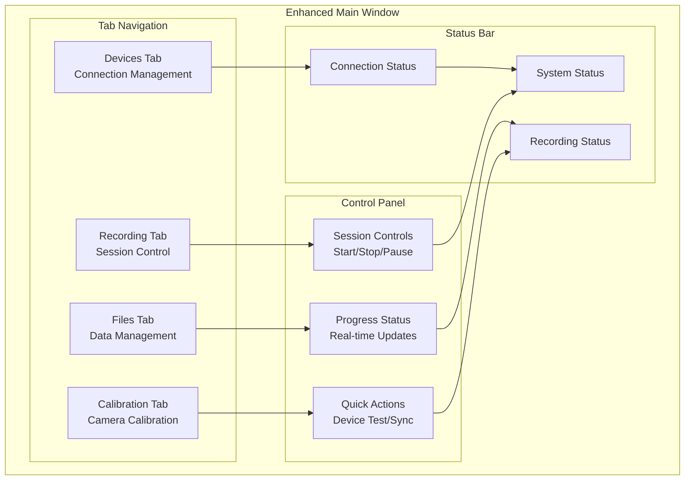

# Python Desktop Controller Application - User Guide

## Table of Contents

- [Overview](#overview)
- [Pre-flight Checklist](#pre-flight-checklist)
- [Getting Started](#getting-started)
  - [System Setup and Installation](#system-setup-and-installation)
  - [First-Time Configuration](#first-time-configuration)
- [User Interface Overview](#user-interface-overview)
  - [Recording Tab](#recording-tab)
  - [Devices Tab](#devices-tab)
  - [Calibration Tab](#calibration-tab)
  - [Files Tab](#files-tab)
- [Step-by-Step Recording Workflow](#step-by-step-recording-workflow)
  - [Preparation Phase](#preparation-phase)
  - [Recording Session](#recording-session)
  - [Post-Recording Analysis](#post-recording-analysis)
- [Advanced Features](#advanced-features)
  - [Custom Recording Profiles](#custom-recording-profiles)
  - [Multi-Session Management](#multi-session-management)
  - [Real-Time Monitoring](#real-time-monitoring)
- [System Monitoring and Logging](#system-monitoring-and-logging)
  - [Real-time Monitoring](#real-time-monitoring-1)
  - [Log Management](#log-management)
- [Troubleshooting Common Issues](#troubleshooting-common-issues)
  - [Device Connection Problems](#device-connection-problems)
  - [Recording Quality Issues](#recording-quality-issues)
  - [Storage and Performance Issues](#storage-and-performance-issues)
- [Best Practices for Research Applications](#best-practices-for-research-applications)
  - [Experimental Design Considerations](#experimental-design-considerations)
  - [Data Management Best Practices](#data-management-best-practices)
  - [Performance Optimization](#performance-optimization)
- [Frequently Asked Questions](#frequently-asked-questions)
- [Getting Help and Support](#getting-help-and-support)
  - [Built-in Help System](#built-in-help-system)
  - [Additional Resources](#additional-resources)
  - [Reporting Issues](#reporting-issues)

## Overview

The Python Desktop Controller Application is your central command center for multi-sensor recording sessions. This application coordinates all connected devices, monitors recording progress in real-time, and manages your research data efficiently.

## Pre-flight Checklist

Before starting your first recording session, ensure you have:

- [ ] Windows PC with Python 3.8+ or Linux with PyQt5 installed
- [ ] At least 2 Android smartphones with the Multi-Sensor Recording app installed
- [ ] USB webcams connected and recognized by your system
- [ ] All devices connected to the same WiFi network
- [ ] Sufficient storage space for recording sessions (minimum 10GB recommended)
- [ ] All device permissions granted (camera, microphone, storage)

## Getting Started

### System Setup and Installation

#### Quick Start Installation

1. **Download and Extract**
   ```bash
   # Clone the repository or download the release package
   git clone https://github.com/your-repo/multi-sensor-recording.git
   cd multi-sensor-recording
   ```

2. **Automated Setup**
   ```bash
   # Run the automated setup script (recommended)
   python3 tools/development/setup.py
   
   # Or use platform-specific scripts:
   # Windows: tools/development/setup_dev_env.ps1
   # Linux/macOS: tools/development/setup.sh
   ```

3. **Manual Setup** (if automated setup fails)
   ```bash
   # Create conda environment
   conda env create -f environment.yml
   conda activate thermal-env
   
   # Install dependencies
   pip install pyqt5 opencv-python numpy requests websockets pillow
   ```

#### Verify Installation

1. **Test Basic Functionality**
   ```bash
   # Navigate to the application directory
   cd PythonApp/src
   
   # Test the application imports
   python -c "from application import Application; print('Installation successful!')"
   ```

2. **Launch the Application**
   ```bash
   # Start the desktop controller
   python main.py
   ```

### First-Time Configuration

When you launch the application for the first time:

1. **Network Configuration**
   - The application will automatically detect your network interface
   - Default server port is 9000 (adjustable in settings)
   - Firewall prompts may appear - allow access for proper functionality

2. **Camera Detection**
   - USB webcams will be automatically detected
   - Camera settings can be adjusted in the Devices tab
   - Test camera functionality before starting recording sessions

3. **Storage Location**
   - Default recording location: `PythonApp/recordings/`
   - Change location in File Management settings if needed
   - Ensure adequate storage space (10GB+ recommended)

## User Interface Overview

The Enhanced UI provides a clean, modern interface organized into functional tabs:



### Recording Tab

**Purpose:** Central control for recording sessions

**Key Components:**
- **Session Name Input**: Enter descriptive names for your recording sessions
- **Duration Settings**: Set recording duration (manual or timed)
- **Start/Stop Controls**: Large, prominent recording control buttons
- **Progress Monitoring**: Real-time progress bars and status indicators
- **Device Status Grid**: Visual overview of all connected devices

**Quick Actions:**
- **Quick Start**: One-click recording with default settings
- **Custom Session**: Configure detailed recording parameters
- **Resume Session**: Continue interrupted recording sessions

### Devices Tab

**Purpose:** Manage connections to Android devices and USB cameras

**Device Categories:**
1. **Android Smartphones**
   - Connection status indicators
   - Individual device controls
   - Preview streams from device cameras
   - Battery and storage status

2. **USB Webcams**
   - Camera selection and configuration
   - Resolution and frame rate settings
   - Live preview windows
   - Recording format options

3. **Shimmer Sensors** (if available)
   - Bluetooth connection status
   - Sensor configuration
   - Real-time data streams
   - Calibration status

**Connection Workflow:**
1. **Device Discovery**: Automatic detection of available devices
2. **Connection Establishment**: One-click connection to discovered devices
3. **Capability Verification**: Automatic verification of device capabilities
4. **Status Monitoring**: Continuous monitoring of device health and connectivity

### Calibration Tab

**Purpose:** Camera calibration for accurate spatial measurements

**Calibration Types:**
1. **Single Camera Calibration**
   - Intrinsic parameter calculation
   - Distortion correction
   - Quality assessment and coverage analysis

2. **Stereo Calibration**
   - RGB-thermal camera alignment
   - Spatial relationship calculation
   - Cross-camera synchronization

**Calibration Workflow:**
1. **Pattern Preparation**: Ensure calibration checkerboard is visible
2. **Data Collection**: Capture calibration images from multiple angles
3. **Processing**: Automatic calculation of calibration parameters
4. **Quality Assessment**: Review calibration quality metrics
5. **Result Saving**: Save calibration data for future sessions

### Files Tab

**Purpose:** Data management, export, and session review

**File Management Features:**
- **Session Browser**: Navigate through recorded sessions
- **File Organization**: Automatic organization by date and session name
- **Export Tools**: Export data in various formats (MP4, CSV, JSON)
- **Storage Monitor**: Track storage usage and cleanup old sessions
- **Backup Tools**: Create backups of important sessions

## Step-by-Step Recording Workflow

### Preparation Phase

1. **Start the Desktop Controller**
   ```bash
   cd PythonApp/src
   python main.py
   ```

2. **Verify System Status**
   - Check the status bar for green indicators
   - Ensure all services are running properly
   - Verify network connectivity

3. **Connect Devices**
   - Go to the **Devices** tab
   - Wait for automatic device discovery
   - Click **Connect** for each discovered Android device
   - Verify USB webcam detection and functionality

4. **Test Device Functionality**
   - Use **Test Connection** for each device
   - Verify preview streams are working
   - Check device battery levels and storage space

### Recording Session

1. **Navigate to Recording Tab**
   - Click on the **Recording** tab in the main interface

2. **Configure Session Settings**
   ```
   Session Name: [Enter descriptive name, e.g., "Experiment_1_Participant_A"]
   Recording Duration: [Set duration or choose "Manual Stop"]
   Quality Settings: [High/Medium/Low based on storage constraints]
   ```

3. **Verify Ready Status**
   - All device indicators should show green "Ready" status
   - Storage space should be adequate
   - Network connectivity should be stable

4. **Start Recording**
   - Click the large **Start Recording** button
   - Confirm the recording start in the dialog
   - Monitor the real-time progress indicators

5. **Monitor Recording Progress**
   - **Device Status Grid**: Shows recording status for each device
   - **Progress Bars**: Display recording progress and remaining time
   - **Network Status**: Monitor data transfer rates
   - **Storage Monitor**: Track storage usage in real-time

6. **Stop Recording**
   - Click **Stop Recording** button when session is complete
   - Wait for all devices to confirm recording completion
   - Review the session summary dialog

### Post-Recording Analysis

1. **Session Verification**
   - Navigate to the **Files** tab
   - Verify all expected files are present
   - Check file sizes for reasonable values

2. **Data Export** (if needed)
   - Select the completed session
   - Choose export format (MP4 for videos, CSV for sensor data)
   - Specify export location
   - Click **Export Session**

3. **Session Backup** (recommended)
   - Use **Create Backup** for important sessions
   - Store backups on external storage or cloud services

## Advanced Features

### Custom Recording Profiles

Create reusable recording profiles for different experiment types:

1. **Access Profile Manager**
   - Go to Settings → Recording Profiles
   - Click **Create New Profile**

2. **Configure Profile Settings**
   ```
   Profile Name: [e.g., "High-Quality Thermal"]
   Video Resolution: 4K
   Frame Rate: 30 FPS
   Thermal Recording: Enabled
   Sensor Sampling: 100 Hz
   ```

3. **Save and Use Profile**
   - Save the profile for future use
   - Select profile from dropdown in Recording tab

### Multi-Session Management

For experiments with multiple participants or conditions:

1. **Batch Session Creation**
   - Use **Batch Session Manager** in Files tab
   - Create multiple session templates
   - Pre-configure session parameters

2. **Session Templates**
   - Create templates with common settings
   - Reduce setup time between sessions
   - Ensure consistency across recordings

### Real-Time Monitoring

Monitor recording quality in real-time:

1. **Preview Streams**
   - Enable preview streams in Devices tab
   - Monitor video quality during recording
   - Identify issues before they affect data quality

2. **Quality Alerts**
   - Configure quality threshold alerts
   - Receive notifications for connectivity issues
   - Automatic recovery for minor problems

## System Monitoring and Logging

### Real-time Monitoring

The application provides comprehensive monitoring capabilities for research operations:

**Performance Monitoring:**
- **CPU Usage**: Monitor processing load during multi-device recording
- **Memory Usage**: Track memory consumption and detect potential leaks
- **Network Bandwidth**: Monitor data transfer rates and connectivity quality
- **Storage Space**: Alert when disk space becomes critical

**Session Monitoring:**
- **Device Status**: Real-time tracking of all connected devices
- **Data Quality**: Continuous monitoring of recording quality metrics
- **Synchronization**: Verify temporal alignment across all sensors
- **Error Detection**: Automatic identification of potential issues

### Log Management

**Log Categories:**
- **Session Logs**: Recording session details and participant information
- **Device Logs**: Hardware communication and status information
- **Network Logs**: Connection events and data transfer details
- **Performance Logs**: System resource usage and optimization data
- **Error Logs**: Issue detection and diagnostic information

**Log Locations:**
- **Session Logs**: `logs/sessions/session_YYYYMMDD_HHMMSS.log`
- **Application Logs**: `logs/application/multisensor.log`
- **Performance Logs**: `logs/performance/performance_YYYYMMDD.log`

**Log Configuration:**
```json
{
    "log_level": "INFO",
    "enable_performance_logging": true,
    "log_rotation_size": "100MB",
    "log_retention_days": 30
}
```

## Troubleshooting Common Issues

### Device Connection Problems

**Issue:** Android device not appearing in device list
**Solutions:**
1. Verify both devices are on the same WiFi network
2. Check firewall settings on PC
3. Restart the WiFi connection on the Android device
4. Ensure port 9000 is not blocked
5. Try connecting manually using IP address

**Issue:** USB webcam not detected
**Solutions:**
1. Verify camera is connected and recognized by system
2. Close other applications that might be using the camera
3. Update camera drivers
4. Try different USB ports
5. Restart the application

### Recording Quality Issues

**Issue:** Poor video quality or frame drops
**Solutions:**
1. Reduce recording resolution or frame rate
2. Check available storage space
3. Close unnecessary applications
4. Use faster storage device (SSD recommended)
5. Reduce number of connected devices if needed

**Issue:** Audio-video synchronization problems
**Solutions:**
1. Ensure consistent network connectivity
2. Use clock synchronization feature
3. Restart all devices before recording
4. Check for WiFi interference

### Storage and Performance Issues

**Issue:** Running out of storage space
**Solutions:**
1. Monitor storage usage in Files tab
2. Delete unnecessary session files
3. Export and archive old sessions
4. Use external storage for recordings
5. Configure automatic cleanup settings

**Issue:** Application running slowly
**Solutions:**
1. Close unnecessary applications
2. Restart the desktop controller
3. Check system resource usage
4. Reduce preview quality settings
5. Disable unused device features

## Best Practices for Research Applications

### Experimental Design Considerations

1. **Session Naming Conventions**
   ```
   Format: [Study]_[Condition]_[Participant]_[Session]
   Example: "SocialStudy_HighStress_P001_Session1"
   ```

2. **Data Organization**
   - Create separate folders for different studies
   - Use consistent naming across all sessions
   - Document recording parameters for each session

3. **Quality Control**
   - Test recording setup before each session
   - Monitor recording quality throughout session
   - Verify data integrity after each recording

### Data Management Best Practices

1. **Backup Strategy**
   - Create backups immediately after recording
   - Use multiple backup locations (local + cloud)
   - Verify backup integrity regularly

2. **Documentation**
   - Document experimental conditions for each session
   - Record any technical issues or anomalies
   - Maintain session metadata consistently

3. **Privacy and Security**
   - Follow institutional data protection guidelines
   - Use participant IDs instead of names
   - Secure storage for sensitive data

### Performance Optimization

1. **Hardware Recommendations**
   - SSD storage for better I/O performance
   - 16GB+ RAM for multiple device recording
   - Dedicated WiFi network for device communication
   - USB 3.0 hubs for multiple webcams

2. **Network Optimization**
   - Use 5GHz WiFi for reduced interference
   - Minimize network traffic during recording
   - Position WiFi router close to recording area

3. **Recording Optimization**
   - Test different quality settings for your needs
   - Balance quality with storage requirements
   - Use appropriate recording durations

## Frequently Asked Questions

**Q: Can I record with only some devices if others are unavailable?**
A: Yes, the system supports partial device recording. Missing devices will be noted in the session metadata.

**Q: How do I synchronize clocks across devices?**
A: Use the Clock Synchronization feature in the Devices tab. This should be done before each recording session.

**Q: What happens if a device disconnects during recording?**
A: The system will attempt automatic reconnection. If unsuccessful, recording continues with remaining devices.

**Q: Can I change recording settings during a session?**
A: Basic settings like quality can be adjusted, but major changes require stopping and restarting the session.

**Q: How do I export data for analysis in other software?**
A: Use the Export tools in the Files tab. Multiple formats are supported including MP4, CSV, and JSON.

**Q: What storage format is used for the recordings?**
A: Videos are stored as MP4 files, sensor data as CSV/JSON, and metadata as JSON files with timestamps.

## Getting Help and Support

### Built-in Help System

1. **Context-Sensitive Help**
   - Hover over interface elements for tooltips
   - Press F1 for context-sensitive help

2. **Error Messages**
   - Detailed error messages with suggested solutions
   - Error codes for technical support

3. **Log Files**
   - Detailed log files for troubleshooting
   - Located in `logs/` directory

### Additional Resources

- **User Manual**: Complete documentation in `docs/` directory
- **Video Tutorials**: Available in the Help menu
- **FAQ**: Comprehensive FAQ in the application help
- **Technical Support**: Contact information in About dialog

### Reporting Issues

When reporting issues, please include:

1. **System Information**
   - Operating system and version
   - Python version and installed packages
   - Hardware specifications

2. **Error Details**
   - Complete error messages
   - Steps to reproduce the issue
   - Log files (if available)

3. **Session Information**
   - Number and type of connected devices
   - Recording parameters used
   - Duration and timing of the issue