# Shimmer Manager and PC Application: Practical User Guide

## Table of Contents

- [Overview](#overview)
- [Pre-flight Checklist](#pre-flight-checklist)
  - [Hardware Requirements](#hardware-requirements)
  - [Software Prerequisites](#software-prerequisites)
  - [Network Configuration](#network-configuration)
  - [Environmental Considerations](#environmental-considerations)
- [Step-by-Step Setup Guide](#step-by-step-setup-guide)
  - [Step 1: System Initialization](#step-1-system-initialization)
  - [Step 2: Device Discovery and Connection](#step-2-device-discovery-and-connection)
  - [Step 3: Sensor Configuration](#step-3-sensor-configuration)
  - [Step 4: Recording Session Management](#step-4-recording-session-management)
  - [Step 5: Data Collection and Monitoring](#step-5-data-collection-and-monitoring)
  - [Step 6: Session Completion and Data Export](#step-6-session-completion-and-data-export)
- [Connection Method Selection](#connection-method-selection)
  - [Direct Bluetooth Connection Workflow](#direct-bluetooth-connection-workflow)
  - [Android-Mediated Connection Workflow](#android-mediated-connection-workflow)
  - [Simulation Mode for Testing](#simulation-mode-for-testing)
- [Multi-Device Research Scenarios](#multi-device-research-scenarios)
  - [Single Participant, Multiple Devices](#single-participant-multiple-devices)
  - [Multiple Participants, Single Device Each](#multiple-participants-single-device-each)
  - [Mixed Connection Type Scenarios](#mixed-connection-type-scenarios)
- [Real-time Monitoring and Troubleshooting](#real-time-monitoring-and-troubleshooting)
  - [Device Status Monitoring](#device-status-monitoring)
  - [Data Quality Assessment](#data-quality-assessment)
  - [Connection Issue Resolution](#connection-issue-resolution)
- [Advanced Features](#advanced-features)
  - [Synchronization Signal Management](#synchronization-signal-management)
  - [Custom Data Processing Callbacks](#custom-data-processing-callbacks)
  - [Session Metadata and Analysis](#session-metadata-and-analysis)
- [Expected Output and Results](#expected-output-and-results)
  - [CSV Data Format](#csv-data-format)
  - [Session Directory Structure](#session-directory-structure)
  - [Data Quality Indicators](#data-quality-indicators)
- [Common Use Cases and Examples](#common-use-cases-and-examples)
  - [Stress Response Study](#stress-response-study)
  - [Sleep Quality Assessment](#sleep-quality-assessment)
  - [Group Interaction Analysis](#group-interaction-analysis)

## Overview

This practical guide provides step-by-step instructions for researchers and developers to effectively use the Shimmer Manager and PC Application within the Multi-Sensor Recording System. The guide covers device setup, configuration, data collection, and analysis workflows designed for research applications requiring high-quality physiological data collection.

The Shimmer Manager enables precise measurement of galvanic skin response (GSR), photoplethysmography (PPG), and motion data from Shimmer3 GSR+ devices, supporting both direct PC connections and Android-mediated connections for maximum experimental flexibility.

## Pre-flight Checklist

Before beginning any recording session with Shimmer devices, ensure all prerequisites are met to guarantee successful data collection:

### Hardware Requirements

**Shimmer3 GSR+ Devices**:
- [ ] **Device Battery**: Fully charged (battery level > 20%)
- [ ] **MicroSD Card**: Formatted and inserted for on-device logging backup
- [ ] **Electrode Attachments**: GSR electrodes properly attached and clean
- [ ] **Charging Dock**: Available for device preparation and post-session charging

**PC Hardware**:
- [ ] **Bluetooth Adapter**: PC with working Bluetooth 4.0+ adapter
- [ ] **USB Ports**: Available for device charging and configuration
- [ ] **Storage Space**: Sufficient disk space for data recording (>1GB recommended)

**Android Devices** (if using Android-mediated connections):
- [ ] **Android Device**: Version 7.0+ with Bluetooth LE support
- [ ] **Shimmer App**: Official Shimmer Android application installed
- [ ] **Network Connection**: WiFi connectivity for PC-Android communication

### Software Prerequisites

**Core System Requirements**:
- [ ] **Multi-Sensor Recording System**: Installed and configured
- [ ] **Python Environment**: Python 3.8+ with required dependencies
- [ ] **pyshimmer Library**: Installed for direct connections (optional)
- [ ] **Network Permissions**: Firewall configured for Android device communication

**Permission Configuration**:
- [ ] **Bluetooth Permissions**: System Bluetooth access enabled
- [ ] **Location Permissions**: Required for Bluetooth device discovery
- [ ] **Network Permissions**: Port 9000 accessible for Android communication
- [ ] **File System Permissions**: Write access to recordings directory

### Network Configuration

**PC Network Setup**:
- [ ] **Port Configuration**: TCP port 9000 open for Android device connections
- [ ] **Firewall Settings**: Allow incoming connections from Android devices
- [ ] **WiFi Network**: PC and Android devices on same network segment

**Android Device Setup**:
- [ ] **WiFi Connection**: Connected to same network as PC
- [ ] **Shimmer Pairing**: Shimmer devices paired in Android Bluetooth settings
- [ ] **App Permissions**: Location, Bluetooth, and storage permissions granted

### Environmental Considerations

**Optimal Recording Environment**:
- [ ] **Temperature**: 18-25°C (64-77°F) for stable sensor performance
- [ ] **Humidity**: 40-60% relative humidity prevents electrode issues
- [ ] **Electromagnetic Interference**: Minimal WiFi/cellular interference
- [ ] **Movement Space**: Adequate space for participant movement if required

**Participant Preparation**:
- [ ] **Skin Preparation**: Clean electrode attachment sites with alcohol wipes
- [ ] **Device Placement**: Secure device attachment to prevent movement artifacts
- [ ] **Comfort Check**: Ensure participant comfort with device placement

## Step-by-Step Setup Guide

### Step 1: System Initialization

**1.1 Launch the Shimmer PC Application**:

```bash
# Option 1: Direct Python execution
cd PythonApp/src
python shimmer_pc_app.py --port 9000 --log-level INFO

# Option 2: Command-line with auto-session
python shimmer_pc_app.py --session-id "study_001" --duration 300
```

**1.2 Verify System Initialization**:
```
00:51:38 [INFO] ShimmerPCApplication: Shimmer PC Application initialized
00:51:38 [INFO] ShimmerManager: Enhanced ShimmerManager initialized with Android integration support
00:51:38 [INFO] AndroidDeviceManager: Android device server listening on port 9000
```

**1.3 System Initialization Workflow**:


### Step 2: Device Discovery and Connection

**2.1 Automatic Device Discovery**:
The system automatically scans for devices across all connection types:

```python
# Programmatic device discovery
app = ShimmerPCApplication(android_port=9000)
app.initialize()

# Discover all available devices
devices = app.shimmer_manager.scan_and_pair_devices()
print(f"Found devices: {devices}")
# Output: {'direct': ['00:06:66:66:66:66'], 'android': ['android_001'], 'simulated': []}
```

**2.2 Connect to Discovered Devices**:

```python
# Connect to all discovered devices
success = app.shimmer_manager.connect_devices(devices)
if success:
    print("All devices connected successfully")
else:
    print("Some devices failed to connect")
```

**2.3 Device Connection Status Verification**:

```python
# Check device status
status = app.shimmer_manager.get_shimmer_status()
for device_id, device_status in status.items():
    print(f"Device {device_id}: {device_status.device_state.value}")
    print(f"  Connection: {device_status.connection_type.value}")
    print(f"  Battery: {device_status.battery_level}%")
```

**2.4 Device Discovery and Connection Workflow**:

```mermaid
sequenceDiagram
    participant U as User
    participant App as ShimmerPCApp
    participant SM as ShimmerManager
    participant BT as Bluetooth Scanner
    participant AND as Android Devices
    
    U->>App: Launch Application
    App->>SM: Initialize System
    SM->>BT: Start Bluetooth Scan
    SM->>AND: Listen for Android Devices
    
    par Parallel Discovery
        BT-->>SM: Direct Devices Found
        AND-->>SM: Android Devices Connected
    end
    
    SM->>SM: Compile Device List
    App->>SM: Connect to Devices
    
    loop For Each Device
        SM->>SM: Establish Connection
        SM->>SM: Verify Status
        SM->>App: Report Connection Status
    end
    
    App->>U: Display Device Status
```

### Step 3: Sensor Configuration

**3.1 Configure Enabled Sensor Channels**:

```python
# Define sensor channels for research protocol
channels = {
    "GSR",           # Galvanic skin response
    "PPG_A13",       # Photoplethysmography
    "Accel_X",       # X-axis acceleration
    "Accel_Y",       # Y-axis acceleration
    "Accel_Z",       # Z-axis acceleration
}

# Apply configuration to all connected devices
for device_id in app.shimmer_manager.device_status:
    success = app.shimmer_manager.set_enabled_channels(device_id, channels)
    print(f"Configured {device_id}: {success}")
```

**3.2 Verify Sensor Configuration**:

```python
# Check device configurations
configurations = app.shimmer_manager.device_configurations
for device_id, config in configurations.items():
    print(f"Device {device_id}:")
    print(f"  Enabled channels: {config.enabled_channels}")
    print(f"  Sampling rate: {config.sampling_rate} Hz")
    print(f"  Connection type: {config.connection_type.value}")
```

### Step 4: Recording Session Management

**4.1 Start a Recording Session**:

```python
# Start a new recording session
session_id = f"stress_study_{datetime.now().strftime('%Y%m%d_%H%M%S')}"
success = app.start_session(session_id, record_shimmer=True)

if success:
    print(f"Session {session_id} started successfully")
    print("Data recording active on all connected devices")
else:
    print("Failed to start recording session")
```

**4.2 Monitor Session Progress**:

```python
# Real-time session monitoring
def monitor_session():
    while app.current_session_id:
        status = app.get_status_summary()
        print(f"Session: {app.current_session_id}")
        print(f"  Duration: {time.time() - app.session_start_time:.1f}s")
        print(f"  Samples collected: {status['data_samples_received']}")
        print(f"  Active devices: {status['devices_streaming']}")
        time.sleep(10)  # Update every 10 seconds
```

**4.3 Session Management Workflow**:


### Step 5: Data Collection and Monitoring

**5.1 Real-time Data Monitoring**:

```python
# Setup real-time data callbacks
def on_data_received(sample):
    """Process incoming sensor data in real-time"""
    print(f"Device {sample.device_id} ({sample.connection_type.value}):")
    print(f"  GSR: {sample.gsr_conductance:.3f} µS")
    print(f"  PPG: {sample.ppg_a13:.0f} ADC")
    print(f"  Motion: X={sample.accel_x:.2f}, Y={sample.accel_y:.2f}, Z={sample.accel_z:.2f} g")

def on_status_update(device_id, status):
    """Monitor device health and connectivity"""
    print(f"Device {device_id}: {status.device_state.value}")
    if status.battery_level:
        print(f"  Battery: {status.battery_level}%")
    print(f"  Samples: {status.samples_recorded}")

# Register callbacks
app.shimmer_manager.add_data_callback(on_data_received)
app.shimmer_manager.add_status_callback(on_status_update)
```

**5.2 Send Synchronization Signals**:

```python
# Send visual flash synchronization signal
flash_count = app.send_sync_signal("flash", duration_ms=200, intensity=1.0)
print(f"Flash sync sent to {flash_count} devices")

# Send audio beep synchronization signal
beep_count = app.send_sync_signal("beep", frequency_hz=1000, duration_ms=100)
print(f"Beep sync sent to {beep_count} devices")
```

**5.3 Data Quality Assessment**:

```python
# Monitor data quality indicators
def assess_data_quality():
    status = app.shimmer_manager.get_shimmer_status()
    
    for device_id, device_status in status.items():
        print(f"\nDevice {device_id} Quality Assessment:")
        
        # Connection quality
        if device_status.is_connected:
            print("  ✓ Connection: Stable")
        else:
            print("  ✗ Connection: Unstable")
        
        # Battery status
        if device_status.battery_level and device_status.battery_level > 20:
            print(f"  ✓ Battery: {device_status.battery_level}% (Good)")
        else:
            print(f"  ⚠ Battery: {device_status.battery_level}% (Low)")
        
        # Data flow
        if device_status.samples_recorded > 0:
            print(f"  ✓ Data Flow: {device_status.samples_recorded} samples")
        else:
            print("  ✗ Data Flow: No samples received")
```

### Step 6: Session Completion and Data Export

**6.1 Stop Recording Session**:

```python
# Stop the current recording session
success = app.stop_session()

if success:
    print("Session stopped successfully")
    print("Data files saved and closed")
else:
    print("Error stopping session")
```

**6.2 Verify Data Export**:

```python
# Check session output directory
session_dir = Path(f"recordings/{session_id}")
if session_dir.exists():
    print(f"Session data saved to: {session_dir}")
    
    # List generated files
    csv_files = list(session_dir.glob("*_data.csv"))
    print(f"Generated {len(csv_files)} CSV files:")
    for csv_file in csv_files:
        file_size = csv_file.stat().st_size
        print(f"  {csv_file.name}: {file_size:,} bytes")
```

## Connection Method Selection

### Direct Bluetooth Connection Workflow

**Best for**: Laboratory settings, single PC setup, minimum latency requirements

**Setup Process**:


**Code Example**:
```python
# Force direct Bluetooth connection
devices = {'direct': ['00:06:66:66:66:66'], 'android': [], 'simulated': []}
app.shimmer_manager.connect_devices(devices)
```

### Android-Mediated Connection Workflow

**Best for**: Field research, mobile scenarios, multiple device coordination

**Setup Process**:


**Android Device Setup**:
1. Install official Shimmer Android application
2. Pair Shimmer3 devices in Android Bluetooth settings
3. Configure WiFi connection to same network as PC
4. Launch Shimmer app and connect to PC server (port 9000)

### Simulation Mode for Testing

**Best for**: Development, testing, demonstration without hardware

```python
# Enable simulation mode
app = ShimmerPCApplication(android_port=9000)
app.initialize()

# Simulation automatically activates when no real devices available
devices = app.shimmer_manager.scan_and_pair_devices()
# Returns: {'simulated': ['00:06:66:66:66:66', '00:06:66:66:66:67']}
```

## Multi-Device Research Scenarios

### Single Participant, Multiple Devices

**Use Case**: Comprehensive physiological monitoring with multiple Shimmer devices per participant

```python
# Configure multiple devices for single participant
participant_id = "P001"
devices = {
    'direct': ['00:06:66:66:66:66'],  # Wrist GSR device
    'android': ['android_001'],       # Chest-mounted via Android
    'simulated': []
}

session_id = f"{participant_id}_multidevice_{datetime.now().strftime('%Y%m%d_%H%M%S')}"
app.start_session(session_id)
```

### Multiple Participants, Single Device Each

**Use Case**: Group studies with one device per participant

```python
# Coordinate multiple Android devices for group study
android_devices = app.shimmer_manager.get_android_devices()
print(f"Connected participants: {len(android_devices)}")

for device_id, device_info in android_devices.items():
    print(f"Participant {device_id}: {device_info['shimmer_devices']}")

# Start synchronized group session
group_session_id = f"group_study_{datetime.now().strftime('%Y%m%d_%H%M%S')}"
app.start_session(group_session_id)

# Send group synchronization signal
app.send_sync_signal("flash", duration_ms=500)
```

### Mixed Connection Type Scenarios

**Use Case**: Research requiring both direct and Android-mediated connections

```python
# Mixed connection setup
devices = {
    'direct': ['00:06:66:66:66:66'],  # High-precision lab device
    'android': ['android_001', 'android_002'],  # Mobile participants
    'simulated': []
}

# Start session with mixed device types
app.shimmer_manager.connect_devices(devices)
session_id = "mixed_connection_study"
app.start_session(session_id)
```

## Real-time Monitoring and Troubleshooting

### Device Status Monitoring

**Continuous Status Display**:
```python
def display_device_status():
    """Real-time device status monitoring"""
    status = app.shimmer_manager.get_shimmer_status()
    
    print("\n=== Device Status Dashboard ===")
    for device_id, device_status in status.items():
        status_icon = "✓" if device_status.is_connected else "✗"
        battery_icon = "🔋" if device_status.battery_level and device_status.battery_level > 50 else "🪫"
        
        print(f"{status_icon} {device_id} ({device_status.connection_type.value})")
        print(f"   State: {device_status.device_state.value}")
        print(f"   {battery_icon} Battery: {device_status.battery_level}%")
        print(f"   📊 Samples: {device_status.samples_recorded}")
        print(f"   🕒 Last data: {device_status.last_data_timestamp}")
```

### Data Quality Assessment

**Quality Indicators**:


### Connection Issue Resolution

**Common Issues and Solutions**:

1. **Bluetooth Connection Failed**:
   ```python
   # Check Bluetooth adapter status
   import bluetooth
   nearby_devices = bluetooth.discover_devices(lookup_names=True)
   print(f"Available Bluetooth devices: {nearby_devices}")
   
   # Restart Bluetooth service (Linux)
   os.system("sudo systemctl restart bluetooth")
   ```

2. **Android Device Not Connecting**:
   ```python
   # Verify network connectivity
   import socket
   try:
       sock = socket.socket(socket.AF_INET, socket.SOCK_STREAM)
       result = sock.connect_ex(('android_device_ip', 9000))
       if result == 0:
           print("Network connection available")
       else:
           print("Network connection failed")
   except Exception as e:
       print(f"Network test error: {e}")
   ```

3. **Data Quality Issues**:
   ```python
   # Enable verbose data validation
   app.shimmer_manager.enable_debug_logging()
   
   # Check for data validation errors
   def check_data_quality(sample):
       if sample.gsr_conductance and (sample.gsr_conductance < 0 or sample.gsr_conductance > 100):
           print(f"GSR out of range: {sample.gsr_conductance}")
       
       if sample.battery_percentage and sample.battery_percentage < 10:
           print(f"Low battery warning: {sample.battery_percentage}%")
   
   app.shimmer_manager.add_data_callback(check_data_quality)
   ```

## Advanced Features

### Synchronization Signal Management

**Visual Flash Synchronization**:
```python
# Send synchronized flash across all Android devices
def send_experiment_marker(marker_type, **params):
    if marker_type == "stimulus_onset":
        flash_count = app.send_sync_signal("flash", 
                                         duration_ms=100, 
                                         intensity=1.0,
                                         marker_id="STIMULUS_01")
        
    elif marker_type == "response_window":
        beep_count = app.send_sync_signal("beep",
                                        frequency_hz=800,
                                        duration_ms=200,
                                        marker_id="RESPONSE_WINDOW")
    
    print(f"Sync signal sent to {flash_count or beep_count} devices")
```

### Custom Data Processing Callbacks

**Real-time Data Analysis**:
```python
class RealTimeAnalyzer:
    def __init__(self):
        self.gsr_baseline = None
        self.response_threshold = 2.0  # microsiemens
        
    def analyze_gsr_response(self, sample):
        """Detect galvanic skin response events in real-time"""
        if sample.gsr_conductance is None:
            return
            
        # Establish baseline
        if self.gsr_baseline is None:
            self.gsr_baseline = sample.gsr_conductance
            return
            
        # Detect response
        response_magnitude = sample.gsr_conductance - self.gsr_baseline
        if response_magnitude > self.response_threshold:
            print(f"GSR Response detected: {response_magnitude:.3f} µS above baseline")
            print(f"Device: {sample.device_id}, Time: {sample.system_time}")
            
            # Trigger synchronization event
            app.send_sync_signal("flash", duration_ms=50, marker_id="GSR_RESPONSE")

# Register real-time analyzer
analyzer = RealTimeAnalyzer()
app.shimmer_manager.add_data_callback(analyzer.analyze_gsr_response)
```

### Session Metadata and Analysis

**Session Analysis Report**:
```python
def generate_session_report(session_id):
    """Generate comprehensive session analysis report"""
    session_dir = Path(f"recordings/{session_id}")
    
    if not session_dir.exists():
        print(f"Session directory not found: {session_dir}")
        return
    
    print(f"\n=== Session Report: {session_id} ===")
    
    # Analyze CSV files
    csv_files = list(session_dir.glob("*_data.csv"))
    total_samples = 0
    device_summary = {}
    
    for csv_file in csv_files:
        import pandas as pd
        df = pd.read_csv(csv_file)
        
        device_id = csv_file.stem.replace('_data', '')
        sample_count = len(df)
        duration = df['timestamp'].max() - df['timestamp'].min() if len(df) > 1 else 0
        
        device_summary[device_id] = {
            'samples': sample_count,
            'duration': duration,
            'avg_sample_rate': sample_count / duration if duration > 0 else 0,
            'data_quality': 'Good' if sample_count > 100 else 'Poor'
        }
        
        total_samples += sample_count
    
    print(f"Total samples collected: {total_samples:,}")
    print(f"Devices involved: {len(device_summary)}")
    
    for device_id, summary in device_summary.items():
        print(f"\nDevice {device_id}:")
        print(f"  Samples: {summary['samples']:,}")
        print(f"  Duration: {summary['duration']:.1f} seconds")
        print(f"  Sample rate: {summary['avg_sample_rate']:.1f} Hz")
        print(f"  Data quality: {summary['data_quality']}")
```

## Expected Output and Results

### CSV Data Format

**Standard CSV Output Structure**:
```csv
timestamp,system_time,device_id,connection_type,android_device_id,session_id,gsr_conductance,ppg_a13,accel_x,accel_y,accel_z,gyro_x,gyro_y,gyro_z,mag_x,mag_y,mag_z,ecg,emg,battery_percentage,signal_strength
1641234567.123,2022-01-03T15:42:47.123000,shimmer_00_06_66_66_66_66,direct_bluetooth,,stress_study_20220103_154247,5.234,2847,0.234,-0.123,0.987,12.45,-3.21,8.76,,,,,85,
1641234567.131,2022-01-03T15:42:47.131000,shimmer_00_06_66_66_66_66,direct_bluetooth,,stress_study_20220103_154247,5.245,2851,0.241,-0.118,0.992,12.38,-3.18,8.82,,,,,85,
```

**Data Field Descriptions**:
- `timestamp`: Unix timestamp with millisecond precision
- `system_time`: ISO 8601 formatted timestamp
- `device_id`: Unique device identifier
- `connection_type`: Connection method (direct_bluetooth, android_mediated, simulation)
- `gsr_conductance`: Galvanic skin response in microsiemens
- `ppg_a13`: Photoplethysmography signal (ADC units)
- `accel_x/y/z`: Acceleration in g-force units
- `battery_percentage`: Device battery level (0-100%)

### Session Directory Structure

**Generated File Organization**:
```
recordings/
└── stress_study_20220103_154247/
    ├── shimmer_metadata.json
    ├── session_info.json
    ├── shimmer_00_06_66_66_66_66_data.csv
    ├── android_android_001_shimmer_data.csv
    └── sync_events.log
```

**Metadata Files**:
- `session_info.json`: Session configuration and summary statistics
- `shimmer_metadata.json`: Device configuration and calibration data
- `sync_events.log`: Synchronization signals and event markers

### Data Quality Indicators

**Quality Assessment Metrics**:

```mermaid
graph LR
    A[Data Quality] --> B[Completeness]
    A --> C[Accuracy]
    A --> D[Consistency]
    A --> E[Timeliness]
    
    B --> B1[Sample Rate: 98%+]
    B --> B2[Missing Data: <2%]
    
    C --> C1[GSR Range: 0-100µS]
    C --> C2[PPG Range: 0-4095 ADC]
    
    D --> D1[Timestamp Order]
    D --> D2[Device Synchronization]
    
    E --> E1[Real-time Latency: <100ms]
    E --> E2[Processing Delay: <1s]
    
    style A fill:#e8f5e8
    style B fill:#e3f2fd
    style C fill:#f3e5f5
    style D fill:#fff8e1
    style E fill:#fce4ec
```



## Common Use Cases and Examples

### Stress Response Study

**Research Protocol**: Measure physiological responses to stress stimuli

```python
# Stress study session setup
def run_stress_study(participant_id):
    session_id = f"stress_{participant_id}_{datetime.now().strftime('%Y%m%d_%H%M%S')}"
    
    # Start recording
    app.start_session(session_id)
    print("Baseline recording started...")
    
    # Baseline period (2 minutes)
    time.sleep(120)
    app.send_sync_signal("beep", marker_id="BASELINE_END")
    
    # Stress stimulus presentation
    print("Presenting stress stimulus...")
    app.send_sync_signal("flash", duration_ms=1000, marker_id="STRESS_STIMULUS")
    
    # Stress response period (5 minutes)
    time.sleep(300)
    app.send_sync_signal("beep", marker_id="STRESS_END")
    
    # Recovery period (3 minutes)
    time.sleep(180)
    app.send_sync_signal("beep", marker_id="RECOVERY_END")
    
    # Stop recording
    app.stop_session()
    print(f"Stress study completed: {session_id}")
```

### Sleep Quality Assessment

**Research Protocol**: Monitor physiological signals during sleep

```python
# Long-term sleep monitoring setup
def setup_sleep_study(participant_id, duration_hours=8):
    session_id = f"sleep_{participant_id}_{datetime.now().strftime('%Y%m%d_%H%M%S')}"
    
    # Configure for extended recording
    app.shimmer_manager.data_buffer_size = 10000  # Larger buffer
    
    # Start recording
    app.start_session(session_id)
    print(f"Sleep monitoring started for {duration_hours} hours")
    
    # Monitor for specified duration
    duration_seconds = duration_hours * 3600
    start_time = time.time()
    
    while (time.time() - start_time) < duration_seconds:
        # Check device status every 30 minutes
        time.sleep(1800)
        
        status = app.get_status_summary()
        print(f"Sleep study progress: {((time.time() - start_time) / duration_seconds) * 100:.1f}%")
        print(f"Samples collected: {status['data_samples_received']:,}")
        
        # Check battery levels
        for device_id, device_status in app.shimmer_manager.get_shimmer_status().items():
            if device_status.battery_level and device_status.battery_level < 20:
                print(f"Warning: Low battery on {device_id}: {device_status.battery_level}%")
    
    app.stop_session()
    print(f"Sleep study completed: {session_id}")
```

### Group Interaction Analysis

**Research Protocol**: Measure physiological synchrony in group settings

```python
# Group synchrony study
def run_group_interaction_study(group_id, interaction_duration=30):
    session_id = f"group_{group_id}_{datetime.now().strftime('%Y%m%d_%H%M%S')}"
    
    # Verify all participants connected
    android_devices = app.shimmer_manager.get_android_devices()
    participant_count = len(android_devices)
    
    if participant_count < 2:
        print(f"Insufficient participants: {participant_count} (minimum 2 required)")
        return
    
    print(f"Group study with {participant_count} participants")
    
    # Start synchronized recording
    app.start_session(session_id)
    
    # Synchronization at start
    app.send_sync_signal("flash", duration_ms=500, marker_id="GROUP_START")
    
    # Interaction period with periodic synchronization
    interaction_start = time.time()
    while (time.time() - interaction_start) < (interaction_duration * 60):
        time.sleep(60)  # Every minute
        app.send_sync_signal("beep", duration_ms=100, marker_id="SYNC_MARKER")
        
        # Display group status
        elapsed = time.time() - interaction_start
        print(f"Group interaction: {elapsed/60:.1f}/{interaction_duration} minutes")
    
    # End synchronization
    app.send_sync_signal("flash", duration_ms=500, marker_id="GROUP_END")
    
    app.stop_session()
    print(f"Group interaction study completed: {session_id}")
    
    # Generate group analysis report
    generate_group_analysis_report(session_id, participant_count)

def generate_group_analysis_report(session_id, participant_count):
    """Analyze group physiological synchrony"""
    print(f"\n=== Group Analysis Report: {session_id} ===")
    print(f"Participants: {participant_count}")
    
    # Load and analyze CSV files for synchrony patterns
    session_dir = Path(f"recordings/{session_id}")
    csv_files = list(session_dir.glob("*_data.csv"))
    
    if len(csv_files) >= 2:
        print("Cross-participant correlation analysis available")
        print("Recommended next steps:")
        print("1. Load CSV files into analysis software (R, Python, MATLAB)")
        print("2. Analyze GSR synchrony using cross-correlation")
        print("3. Examine heart rate variability patterns")
        print("4. Calculate physiological coherence metrics")
    else:
        print("Insufficient data files for group analysis")
```

This comprehensive user guide provides researchers with the practical knowledge needed to effectively use the Shimmer Manager and PC Application for physiological data collection in diverse research scenarios. The step-by-step instructions, code examples, and troubleshooting guidance ensure successful implementation of research protocols while maintaining data quality and system reliability.